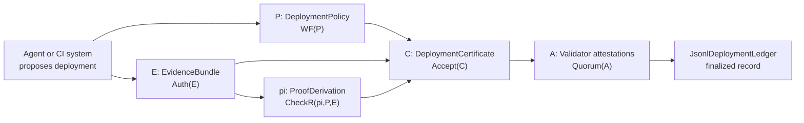

# MaatProof - Proof-of-Deploy

MaatProof is a research prototype for **proof-carrying deployment**: every deployment decision is packaged with a machine-checkable certificate that explains what was deployed, which evidence supports it, which policy it satisfies, and which validators attested to it.

The day autonomous agents can produce cryptographically bound, deterministic, machine-checkable deployment certificates is the day CI/CD stops being the authority of deployment and becomes the evidence layer for proof-carrying deployment.

## Simple explanation

Today, most deployment systems approve releases by running a pipeline and storing logs. Those logs are useful, but they are not a proof. They show what the system claims happened, not a compact certificate that another machine can independently replay.

MaatProof turns a deployment into a package of proof. It says: here is the policy, here is the evidence, here is the reasoning that connects the evidence to the policy, and here are the validator attestations that finalized the decision. If any part is missing, stale, tampered with, or logically unsupported, the deployment certificate is rejected with a specific reason.

For a non-technical reader: this repo is like a black box recorder for deployments, but with stronger guarantees. It does not merely record that an AI agent approved a release. It shows the receipts and lets another verifier check whether the approval should have been trusted.

## Research perspective

Modern CI/CD logs tell you what happened. MaatProof aims to prove why a deployment was allowed.

The formal motivation and broader protocol argument are developed in the [MaatProof White Paper](https://www.overleaf.com/read/hvsvqyvzfmhf#89e3b9).

The core object is a deployment certificate:

```text
C = <P, E, pi, A>
```

Where:

| Symbol | Meaning | Python implementation |
|---|---|---|
| `P` | Deployment policy | `maatproof.policy.DeploymentPolicy` |
| `E` | Signed evidence bundle | `maatproof.evidence.EvidenceBundle` |
| `pi` | Machine-checkable proof derivation | `maatproof.vrp.ProofDerivation` |
| `A` | Validator attestations | `maatproof.pod.ValidatorAttestation` |

The acceptance rule is explicit and replayable:

```text
Accept(C) = WF(P) && Auth(E) && CheckR(pi, P, E) && Quorum(A)
```

The model is deliberately decomposed into independent proof obligations. Policy validity, evidence authenticity, reasoning admissibility, and validator finality are checked separately so the system can explain exactly which obligation failed.

## What this repo showcases

This repository combines a formal protocol sketch with executable Python and Rust code:

| Showcase | What to inspect |
|---|---|
| **Proof-carrying deployment certificate** | `PYTHON/maatproof/certificate.py`, `RUST/src/lib.rs` |
| **Policy well-formedness (`WF(P)`)** | `PYTHON/maatproof/policy.py`, `RUST/src/lib.rs` |
| **Signed, canonical evidence (`Auth(E)`)** | `PYTHON/maatproof/evidence.py`, `PYTHON/maatproof/canonical.py`, `RUST/src/lib.rs` |
| **Verifiable reasoning derivation (`CheckR`)** | `PYTHON/maatproof/vrp.py`, `RUST/src/lib.rs` |
| **Validator quorum and finality (`Quorum(A)`)** | `PYTHON/maatproof/pod.py`, `RUST/src/lib.rs` |
| **Append-only local deployment ledger** | `PYTHON/maatproof/ledger.py`, `RUST/src/lib.rs` |
| **AVM boundary trace-to-evidence conversion** | `PYTHON/maatproof/avm.py`, `RUST/src/lib.rs` |
| **Hash-chained reasoning proofs** | `PYTHON/maatproof/proof.py`, `PYTHON/maatproof/chain.py`, `RUST/src/lib.rs` |
| **Agentic CI/CD orchestration prototype** | `PYTHON/maatproof/pipeline.py`, `PYTHON/maatproof/orchestrator.py`, `PYTHON/maatproof/layers`, `RUST/src/lib.rs` |
| **Executable demonstration** | `examples/proof_of_deploy_colab.ipynb` |

The implementations intentionally use HMAC-SHA256 so the reference model is easy to run in tests and Colab. Production hardening can replace the signature backend with Ed25519 or post-quantum schemes without changing the certificate validity equation.

## Architecture at a glance



The design separates research concerns cleanly:

1. **Policy is not evidence.** Policy says what must be true; evidence proves facts about a specific deployment.
2. **Evidence is not reasoning.** Evidence is signed external data; `pi` is the derivation that connects evidence to policy satisfaction.
3. **Validity is not incentives.** Tokenomics, staking, slashing, and checker markets are accountability layers. They do not change `Accept(C)`.
4. **Human approval is a policy primitive.** ADA is the default production-authorization model; human approval can be required by a declared policy gate for regulated workloads.

## Try it in Google Colab

Open [`examples/proof_of_deploy_colab.ipynb`](examples/proof_of_deploy_colab.ipynb) to run a complete proof-of-deploy flow.

The notebook demonstrates:

- A valid production deployment certificate.
- Finality through validator attestations.
- Local ledger append and replay verification.
- Rejections for missing scan evidence, stale human attestation, wrong environment binding, invalid derivation steps, and insufficient quorum.

## Local quick start

```bash
git clone https://github.com/dngoins/MaatProof.git
cd MaatProof
cd PYTHON
pip install -e ".[dev]"
python -m pytest tests -v
```

Rust:

```bash
git clone https://github.com/dngoins/MaatProof.git
cd MaatProof
cd RUST
cargo test
```

## Implementation samples

The Python sample below shows the original reference flow. For Rust usage, including a minimal certificate check and pointers to end-to-end test samples, see [`RUST/README.md`](RUST/README.md) and `RUST/src/lib.rs`.

Minimal certificate check:

```python
from maatproof import (
    CertificateChecker,
    DeploymentCertificate,
    DeploymentPolicy,
    DeploymentRequest,
    EvidenceBundle,
    PolicyPredicate,
    ProofDerivation,
    ProofStep,
    signed_evidence,
    simulate_validators,
)

evidence_key = b"evidence-secret"
validators = {
    "validator-a": b"validator-a-secret",
    "validator-b": b"validator-b-secret",
    "validator-c": b"validator-c-secret",
}
now = 1_700_000_100.0

request = DeploymentRequest(
    deployment_id="deploy-123",
    service="checkout",
    environment="production",
    commit_sha="abc123",
    artifact_hash="sha256:artifact",
    requested_by="agent:planner",
)

policy = DeploymentPolicy(
    policy_id="checkout-prod",
    version=1,
    environment="production",
    freshness_seconds={"scan_report": 3600},
    predicates=[
        PolicyPredicate("test_passed", {"suite": "unit"}),
        PolicyPredicate(
            "vuln_count",
            {"severity": "critical", "operator": "<=", "threshold": 0},
        ),
        PolicyPredicate("environment_matches", {"target": "production"}),
    ],
)

evidence = EvidenceBundle([
    signed_evidence(
        "commit",
        "commit_snapshot",
        {"deployment_id": request.deployment_id, "commit_sha": request.commit_sha},
        "git",
        now,
        evidence_key,
    ),
    signed_evidence(
        "artifact",
        "build_artifact",
        {"deployment_id": request.deployment_id, "artifact_hash": request.artifact_hash},
        "builder",
        now,
        evidence_key,
    ),
    signed_evidence(
        "test",
        "test_result",
        {"deployment_id": request.deployment_id, "suite": "unit", "passed": True},
        "pytest",
        now,
        evidence_key,
    ),
    signed_evidence(
        "scan",
        "scan_report",
        {"deployment_id": request.deployment_id, "vulnerabilities": {"critical": 0}},
        "scanner",
        now,
        evidence_key,
    ),
    signed_evidence(
        "env",
        "environment_descriptor",
        {"deployment_id": request.deployment_id, "environment": "production"},
        "cluster",
        now,
        evidence_key,
    ),
])

proof = ProofDerivation(
    final_conclusion=f"deploy_authorized:{request.deployment_id}",
    steps=[
        ProofStep("test-pass", "TEST_PASS", "test_passed:unit", ["test"]),
        ProofStep("scan-ok", "VULN_OK", "vuln_count:critical<=0", ["scan"]),
        ProofStep("env-ok", "ENVIRONMENT_MATCH", "environment_matches", ["env"]),
        ProofStep(
            "policy",
            "POLICY_SATISFIED",
            "policy_satisfied",
            premises=["test-pass", "scan-ok", "env-ok"],
        ),
        ProofStep(
            "deploy",
            "DEPLOY_AUTH",
            f"deploy_authorized:{request.deployment_id}",
            premises=["policy"],
        ),
    ],
)

certificate = DeploymentCertificate(request, policy, evidence, proof)
checker = CertificateChecker(evidence_key, now=now)
certificate.attestations = simulate_validators(certificate, checker, validators, now)

report = CertificateChecker(evidence_key, validators, now=now).accept(certificate)
assert report.accepted, [failure.code for failure in report.failures]
print(report.certificate_digest)
```

## Verification guarantees

MaatProof is not just a CI helper script. It is a testbed for deployment authorization as a verifiable system:

- **Formal object model:** certificate validity is stated as `Accept(C)` over named sub-checks.
- **Deterministic replay:** verifiers can recompute canonical hashes, evidence roots, proof roots, and validator quorum.
- **Falsifiable examples:** tests include both accepted certificates and precise rejection cases.
- **Traceability:** docs, specs, tests, and code map back to policy, evidence, proof, and attestation obligations.
- **Accountable finality:** a deployment is not "good because the agent said so"; it is accepted only after replay and quorum.
- **Incentive separation:** economic systems can punish bad actors, but validity remains a pure checker result.

## Repository layout

```text
CONSTITUTION.md          # Project invariants and agent workflow rules
docs/                    # Architecture docs, roadmap, requirements, reports
specs/                   # Protocol specifications for AVM, VRP, PoD, ADA, DRE
contracts/               # Solidity contract sketches
examples/
  proof_of_deploy_colab.ipynb
PYTHON/
  maatproof/              # Original Python reference package
  tests/                  # Pytest suite, including proof-of-deploy cases
  pyproject.toml          # Python package metadata
RUST/
  Cargo.toml              # Rust crate metadata
  src/lib.rs              # Rust implementation and unit tests
```

## Current status

MaatProof is a **reference prototype**, not a production deployment network. The Python and Rust packages are intended to make the research model executable, inspectable, and easy to challenge.

Planned hardening paths include:

- Rust/WASM checkers for production AVM and VRP replay.
- Stronger signature adapters such as Ed25519 and post-quantum schemes.
- On-chain deployment contracts and checker registries.
- Stake-weighted validator networks with dispute and slashing paths.
- Runtime guard and rollback proofs for finalized deployments.

## Contributing

This repo follows [`CONSTITUTION.md`](CONSTITUTION.md):

1. Spec first, code second.
2. Every artifact must trace to acceptance criteria.
3. Human review is required before merge.
4. Small, reversible changes are preferred.
5. Deterministic gates and cryptographic proof obligations cannot be bypassed.

## License

[CC0-1.0](LICENSE)

> "The day agents can prove why they should deploy is the day pipelines stop approving deployments and start feeding proofs."
