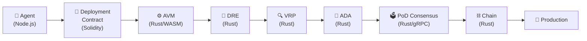
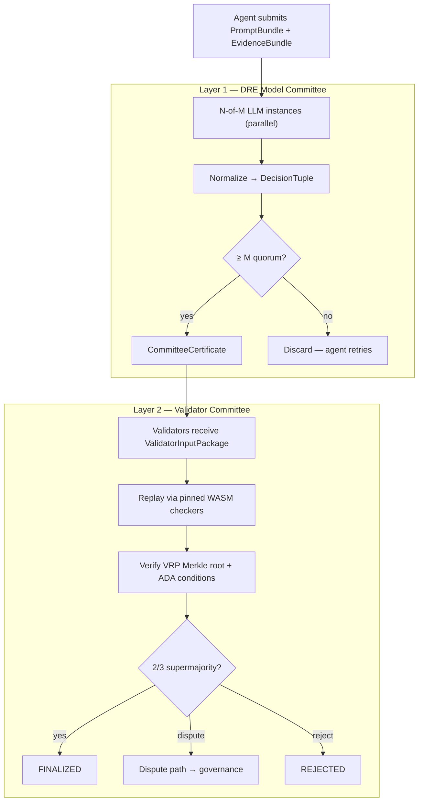
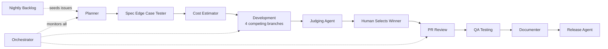
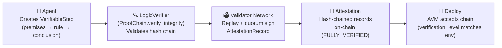

# MaatProof — Proof of Deploy

MaatProof is a Layer 1 blockchain for **Agentic CI/CD (ACI/ACD)**. It replaces traditional pipelines with **cryptographically verifiable deployment decisions made by AI agents**, enforced through signed reasoning proofs, deterministic trust anchors, and on-chain deployment policies.

Every deployment decision produces a `ReasoningProof` — a hash-chained, HMAC-signed artifact that answers *"Why did this deploy at 2 am?"* with a cryptographically verifiable answer, not a stale log entry.

The protocol stack is built in **Rust** (consensus engine, AVM, DRE, VRP, ADA), **Node.js** (orchestrator, GitHub integrations, SDK), and **Solidity** (deployment contracts, tokenomics, governance).

## What MaatProof Does

| Capability | How it works |
|---|---|
| **Proof-of-Deploy consensus** | Two-layer consensus: DRE model committee (L1) + stake-weighted validator committee (L2) attest every deployment |
| **Deterministic Reasoning Engine (DRE)** | N-of-M LLM instances execute a canonical `PromptBundle` in parallel; convergence on a `DecisionTuple` emits a `CommitteeCertificate` — determinism is a system property, not a per-call guarantee |
| **Verifiable Reasoning Protocol (VRP)** | Typed reasoning records committed as a Merkleized DAG; only *admissible* (machine-checkable) reasoning may authorize a production deploy |
| **Autonomous Deployment Authority (ADA)** | 7-condition authorization replaces mandatory human approval as the protocol default; human approval is a configurable policy gate for regulated workloads |
| **Agent Virtual Machine (AVM)** | Executes reasoning traces deterministically in a WASM sandbox and validates against on-chain policy |
| **Cryptographic audit trail** | Every agent decision is hash-chained and HMAC-SHA256 signed — tamper-evident by design |
| **Self-healing pipelines** | Agents fix failing tests, retry, and redeploy with bounded retries; runtime guard + rollback proofs provide automatic production safety |

## Key Components

| Component | Role |
|---|---|
| **AVM** | WASM sandbox execution and policy-driven trace verification (Rust) |
| **DRE** | N-of-M LLM committee; canonical PromptBundle + EvidenceBundle → DecisionTuple (Rust) |
| **VRP** | Typed, Merkleized reasoning records; admissible vs informational split (Rust) |
| **ADA** | 7-condition autonomous deployment authorization; runtime guard + rollback proofs (Rust) |
| **Deployment Contracts** | Policy as code, on-chain; configurable human approval gate (Solidity) |
| **PoD Consensus** | Two-layer: DRE model committee + validator stake-weighted quorum (Rust / gRPC) |
| **$MAAT** | Staking, slashing, validator incentives, DAO governance (Solidity) |
| **ReasoningProof** | Signed, hash-chained reasoning artifacts (Python orchestration layer) |
| **OrchestratingAgent** | Event-driven ACI/ACD pipeline coordination (Node.js) |

## Status

🚧 **Spec Phase** — Architecture defined, agent pipeline operational, core implementation in progress.

📄 **[Read the full MaatProof Whitepaper →](https://www.overleaf.com/read/hvsvqyvzfmhf#89e3b9)**

---

## Autonomous Deployment Authority (ADA)

<!-- Addresses EDGE-001, EDGE-004, EDGE-051, EDGE-053 -->

ADA is the MaatProof subsystem that **replaces mandatory human approval** as the protocol
default for production deployments. It computes a multi-signal deployment score, derives an
authority level, and either executes an autonomous deployment or raises
`AutonomousDeploymentBlockedError` — with a full cryptographic proof chain for every decision.

> **Before ADA:** Every production deployment required `HumanApprovalRequiredError` to be
> resolved by a human approver — even for low-risk, high-confidence changes.  
> **After ADA:** Human approval is a configurable policy gate for regulated workloads
> (HIPAA, SOX, PCI-DSS). ADA handles authorization by proof, not by rubber stamp.

### How ADA Works

```
Agent proposes → AVM gates run → DRE committee → VRP reasoning → ADA scores (0.0–1.0)
    → Authority level derived → Deploy (or block) → Runtime Guard (15-min window)
    → Auto-rollback if thresholds breached → Signed RollbackProof on-chain
```

### Multi-Signal Scoring Model

ADA aggregates five independently verified signals (no self-reporting allowed):

| Signal | Weight | What It Measures |
|--------|--------|-----------------|
| `deterministic_gates` | **25%** | All AVM gates pass: lint, compile, security scan, artifact signing |
| `dre_consensus` | **20%** | DRE N-of-M committee converges on `Approve` |
| `logic_verification` | **20%** | Formal logic verifier signs off on reasoning |
| `validator_attestation` | **20%** | Stake-weighted PoD validator quorum attests |
| `risk_score` | **15%** | `1.0 − normalised_risk` (CVEs, change size, critical paths, test coverage) |

**Total score = weighted sum, range [0.0, 1.0], computed with Python `Decimal` for determinism.**

### Authority Levels

| Level | Score Threshold | Production? | Notes |
|-------|----------------|-------------|-------|
| `FULL_AUTONOMOUS` | ≥ 0.90 | ✅ | Requires DAO vote; blocked for HIPAA/SOX |
| `AUTONOMOUS_WITH_MONITORING` | 0.75–0.89 | ✅ | Auto-rollback guard active |
| `STAGING_AUTONOMOUS` | 0.60–0.74 | ❌ staging only | |
| `DEV_AUTONOMOUS` | 0.40–0.59 | ❌ dev only | |
| `BLOCKED` | < 0.40 | ❌ | `AutonomousDeploymentBlockedError` raised |

### Auto-Rollback Protocol

Every production deployment runs a **15-minute monitoring window** with 10-second metric polls.
Rollback is triggered automatically when:
- Error rate > 5% (over any 60-second window)
- p99 latency > 2× pre-deployment baseline
- CPU > 95% sustained for > 120 seconds
- Health check fails 3 consecutive times
- Metrics become unavailable for ≥ 30 seconds (fail-safe)

Every rollback produces a signed `RollbackProof` (HMAC-SHA256, KMS-sourced key) recorded
on-chain as a first-class chain-of-custody event.

### MAAT Staking for Deployment

| Environment | Minimum Agent Stake |
|-------------|---------------------|
| Development | 100 $MAAT |
| Staging / UAT | 1,000 $MAAT |
| Production | 10,000 $MAAT |

Effective minimum = base × `risk_multiplier` (derived from critical paths touched + CVE severity).
Stake is locked for the deployment round + 30-day challenge window.

### Migrating from `HumanApprovalRequiredError`

```python
# ✅ Updated catch block for ADA
try:
    pipeline.deploy()
except (HumanApprovalRequiredError, AutonomousDeploymentBlockedError) as e:
    # AutonomousDeploymentBlockedError carries: reason, authority_level, deployment_score, trace_id
    handle_blocked_deployment(e)
```

📐 **[Full ADA architecture decision record →](docs/architecture/ADR-001-autonomous-deployment-authority.md)**  
📋 **[Complete ADA technical spec →](specs/autonomous-deployment-authority.md)**

---

## Architecture

MaatProof operates as a fully autonomous ACI/ACD system. Agents propose, DRE verifies, VRP records reasoning, ADA authorizes, and the chain finalizes — no external CI/CD pipeline required.

### Full Protocol Stack

### Full Protocol Stack



### Two-Layer Consensus



### Orchestrating Agent + Deterministic Layers


### Two-Layer Consensus


### The Orchestrating Agent Model

```python
agent.on("code_pushed")      -> submit_to_avm()          # AVM validates policy + trace
agent.on("test_failed")      -> fix_and_retry(max=3)
agent.on("all_tests_pass")   -> deploy_to_staging()
agent.on("staging_healthy")  -> submit_prompt_bundle()   # → DRE → VRP → ADA
agent.on("ada_authorized")   -> deploy_to_prod()         # ADA is protocol default
agent.on("policy_requires")  -> request_human_approval() # when contract declares it
agent.on("prod_error_spike") -> rollback()               # runtime guard triggers
```

> ADA is the protocol default for production authorization. Human approval is a configurable gate declared in the Deployment Contract — required for regulated workloads (SOX, HIPAA, PCI-DSS, CRITICAL tier).

---

## Agentic AI Loop

MaatProof uses a fully automated agentic pipeline powered by GitHub Actions and AI agents (Claude + GPT). Every issue flows through a structured sequence of agents before reaching production.



### Agent Pipeline

| Step | Agent | What it does |
|------|-------|-------------|
| 1 | **Planner** | Decomposes feature request into 9 scoped child issues with acceptance criteria |
| 2 | **Spec Edge Case Tester** | Generates up to 100 edge cases, validates specs reach ≥90% coverage |
| 3 | **Cost Estimator** | Compares Azure vs AWS vs GCP costs, calculates ACI/ACD savings using DORA metrics |
| 4 | **Development** | Spawns 4 concurrent implementations (Claude Sonnet, Claude Opus, GPT 5.3 Codex, GPT 5.4) |
| 5 | **Judging** | Scores all 4 on Big O complexity, code quality, cost, performance, security |
| 6 | **PR Review** | Posts 10-dimension review score on every PR |
| 7 | **QA Testing** | Validates against 10 comparison dimensions with pass/fail criteria |
| 8 | **Documenter** | Updates all public-facing docs, changelog, and diagrams |
| 9 | **Release** | Creates semantic version tag and GitHub Release |
| ∞ | **Orchestrator** | Monitors all events, re-triggers stalled agents (max 15 retries) |
| 🕐 | **Nightly Backlog** | Cron job seeds issues from `docs/requirements/backlog.md` every weekday at 7am UTC |

---

## Why ACI/ACD?

### Advantages

| Advantage | Why it matters |
|---|---|
| **Self-healing** | Agent doesn't just report a failing test — it fixes it, reruns, and redeploys |
| **Context-aware gates** | Agent understands *why* a test fails, not just that it failed |
| **Natural language policy** | "Don't deploy on Fridays, unless it's a security fix" — trivial for an agent, painful in YAML |
| **Adaptive workflows** | Agent skips Docker build gate when only a README changed |
| **Proactive** | Agent monitors production metrics and opens its own issue: "Error rate spiked, rolling back" |
| **No YAML hell** | No `.github/workflows/` archaeology |

### Real Risks (and how MaatProof addresses them)

| Risk | Mitigation |
|---|---|
| **Non-determinism** | DRE: N-of-M committee quorum makes determinism a system property; VRP Merkle DAG makes every reasoning step auditable |
| **Auditability gap** | ReasoningProof = signed artifact; VRP admissible reasoning is on-chain and verifiable |
| **Blast radius** | ADA requires 7 conditions including zero blocking CVEs; runtime guard auto-rolls back on any error spike |
| **Runaway loops** | Bounded retries (max 3); runtime guard auto-rolls back on error spike |
| **Rate limits** | Orchestrator monitors and re-triggers with max 15 retries per item |
| **Security surface** | Agent authority limits in Constitution §5; dispute path prevents bad slashing |
| **LLM error rate** | 4-branch competing implementations + Judging Agent; DRE committee quorum as L1 safety |

---

## 💰 Cost Savings — ACI/ACD vs Traditional CI/CD

> _Issues #14 · #119 · #137 · #133 · #126: Data Model · Core Pipeline · DRE Docs · CI/CD Workflow · **ADA CI/CD Workflow** (autonomous deployment · authority gating · auto-rollback · signed proof artifacts)_

| Metric | Traditional | MaatProof | Savings |
|--------|-------------|-----------|---------|
| Build cost — **ADA CI/CD Workflow (#126)** | $4,512 | $301 | **93%** |
| Build cost — CI/CD Workflow (#133) | $4,540 | $167 | **96%** |
| Build cost — DRE Docs (#137) | $972 | $48 | **95%** |
| Build cost — Core Pipeline (#119) | $6,741 | $247 | **96%** |
| Build cost — Data Model (#14) | $2,326 | $148 | **94%** |
| Combined build cost (#14+#119+#137+#133+#126) | $19,091 | $911 | **95%** |
| **Human approval gate elimination (#126)** | $110,160/yr | $26/yr | **99.98%** |
| **ADA workflow ROI per compute dollar** | — | — | **4,270×** |
| **Auto-rollback activation time (#126)** | 30–60 min | ≤ 60 seconds | **97% faster** |
| **Signed deployment proofs (#126)** | 0% | 100% per deploy | **Compliance-grade** |
| Annual developer savings | — | $309,000 | **5,150 hrs/yr** |
| Annual CI/CD cost (GCP, public repo, 100 MAU) | — | **$418/yr** | — |
| GitHub Actions runtime (public repo) | — | **$0/yr** | Unlimited free minutes |
| Trust anchor gate bypass prevention | Possible | **Impossible** | 100% elimination |
| Deployment frequency | 1×/week | 10×/day | **70× faster** |
| Lead time for changes | 5 days | 2 hours | **60× faster** |
| Change failure rate | 15% | 3% | **80% reduction** |
| Mean time to recovery | 4 hours | 15 min | **94% faster** |
| DORA rating | Low | **Elite** (top 10%) | — |
| Year 1 ROI | — | — | **14,521%** |
| 5-year TCO savings | — | — | **$2,406,676** |

> _Last estimated: 2026-04-23 · Issue #126 [ADA CI/CD Workflow] · [Full report →](docs/reports/cost-estimation-report.md) · [Dashboard →](docs/reports/cost-summary.html)_
---

## Verifiable Reasoning Protocol (VRP)

<!-- Addresses EDGE-059, EDGE-068, EDGE-069, EDGE-070 -->

The **Verifiable Reasoning Protocol (VRP)** is the formal-logic layer that structures every agent reasoning step as a typed, machine-checkable record. Unlike a plain hash-chain (which only proves a trace was not modified), VRP proves the reasoning is *logically sound* — that conclusions follow from premises via a named inference rule, confirmed by validators.

### VRP Pipeline



### Quick-Start: Create and Verify a VerifiableStep

```python
import uuid, time
from maatproof.vrp import (
    InferenceRule, VerifiableStep, VerificationLevel,
    ProofChain, AttestationRecord, make_step_range_hash,
)

# 1. Create a VerifiableStep — the core VRP unit
step = VerifiableStep(
    step_id=0,
    premises=[
        "Test coverage = 87%",
        "Policy requires coverage ≥ 80%",
    ],
    inference_rule=InferenceRule.THRESHOLD,
    conclusion="Test coverage requirement is satisfied.",
    confidence=0.98,
    evidence=["sha256:a3f8b2c1d4e5f6a7b8c9d0e1f2a3b4c5"],
)

# 2. Build a ProofChain and add steps
chain = ProofChain(
    chain_id=str(uuid.uuid4()),
    agent_id="did:maat:agent:abc123def456789a",
    verification_level=VerificationLevel.SELF_VERIFIED,   # dev environment
)
chain.add_step(step)

# 3. Finalize: computes root_hash and cumulative_hash
root_hash = chain.finalize()
print(f"Root hash: {root_hash}")

# 4. Attest (SELF_VERIFIED uses HMAC-SHA256)
secret_key = b"shared-secret-from-kms"
step_range_hash = make_step_range_hash(root_hash, 0, 0)
sig = AttestationRecord.sign_hmac(
    chain_id=chain.chain_id,
    step_range_hash=step_range_hash,
    previous_hash="",
    stake_amount="0",
    secret_key=secret_key,
)
rec = AttestationRecord(
    record_id=str(uuid.uuid4()),
    validator_id="did:maat:agent:abc123def456789a",
    timestamp=time.time(),
    signature=sig,
    previous_hash="",
    stake_amount="0",
    step_range_hash=step_range_hash,
    chain_id=chain.chain_id,
    verification_level=VerificationLevel.SELF_VERIFIED,
)
chain.add_attestation(rec)

# 5. Verify integrity and signature
assert chain.verify_integrity(), "Hash chain is broken!"
assert rec.verify_hmac(secret_key), "Attestation signature is invalid!"
assert chain.is_quorum_reached(total_stake=0), "Quorum not reached!"

print(f"✅ VerifiableStep verified — chain ID: {chain.chain_id}")
```

### The 7 Inference Rules

| Rule | Formal Form | Use Case |
|------|------------|----------|
| `modus_ponens` | P, P→Q ⊢ Q | Test passes → deployment is safe |
| `conjunction` | P, Q ⊢ P∧Q | Combine multiple passing checks |
| `disjunctive_syllogism` | P∨Q, ¬P ⊢ Q | One path fails, deduce the other |
| `induction` | Base + inductive steps ⊢ ∀n P(n) | Prove all N retry attempts acceptable |
| `abduction` | Q, P→Q ⊢ P (best explanation) | Infer root cause from observed symptom |
| `data_lookup` | Sources ⊢ retrieved value | Fetch test coverage number from CI output |
| `threshold` | value ≥ minimum ⊢ gate passes | coverage ≥ 80%, risk_score ≤ 700 |

Full formal definitions, Python usage examples for each rule, and the complete data model are in [`specs/vrp-data-model-spec.md`](specs/vrp-data-model-spec.md).

### Verification Levels

| Level | Environment | Quorum | Human-in-loop |
|-------|-------------|--------|---------------|
| `SELF_VERIFIED` | development | Agent only (HMAC) | ❌ Never |
| `PEER_VERIFIED` | staging | ≥ 1 peer validator | ⚙️ Optional (policy gate) |
| `FULLY_VERIFIED` | production | 2/3 stake-weighted | ⚙️ Optional (ADA default; required for SOX/HIPAA) |

> ADA (Autonomous Deployment Authority) is the protocol default for production. Human approval is declared in the Deployment Contract and is required for regulated workloads (SOX, HIPAA, PCI-DSS).

For the full VRP specification see [`specs/vrp-data-model-spec.md`](specs/vrp-data-model-spec.md) and [`specs/vrp-spec.md`](specs/vrp-spec.md).

---

## Getting Started

```bash
# Clone the repository
git clone https://github.com/dngoins/MaatProof.git
cd MaatProof

# Install dependencies
pip install -e ".[dev]"

# Run tests
python -m pytest tests/ -v

# Build a reasoning proof (legacy ReasoningProof API)
python -c "
from maatproof.proof import ProofBuilder, ProofVerifier, ReasoningStep

builder = ProofBuilder(secret_key=b'my-secret', model_id='gpt-v1')
proof = builder.build(steps=[
    ReasoningStep(step_id=0, context='PR #42 failing',
                  reasoning='Mock return value changed',
                  conclusion='Update mock to fix', timestamp=1700000000.0)
])
print(f'Proof ID: {proof.proof_id}')
print(f'Root hash: {proof.root_hash}')
print(f'Verified: {ProofVerifier(b\"my-secret\").verify(proof)}')
"

# Build a VRP VerifiableStep (see VRP section above for full example)
python -c "
from maatproof.vrp import VerifiableStep, InferenceRule
step = VerifiableStep(
    step_id=0,
    premises=['Test coverage = 87%', 'Policy requires coverage >= 80%'],
    inference_rule=InferenceRule.THRESHOLD,
    conclusion='Test coverage requirement is satisfied.',
    confidence=0.98,
    evidence=[],
)
print(f'Step hash will be set by ProofChain: {step.step_hash!r}')
print(f'Inference rule: {step.inference_rule.value}')
"
```

---

## Project Structure

```
CONSTITUTION.md          # Pipeline invariants — the policy layer above code
CLAUDE.md                # Agent session instructions
specs/
  dre-spec.md            # Deterministic Reasoning Engine (Rust)
  vrp-spec.md            # Verifiable Reasoning Protocol (Rust)
  ada-spec.md            # Autonomous Deployment Authority (Rust)
  pod-consensus-spec.md  # Two-layer PoD consensus — DRE + validator committees
  avm-spec.md            # Agent Virtual Machine
  agent-identity-spec.md # Agent DID and key management
docs/
  01-architecture.md     # Full 9-component stack + tech stack callouts
  02-consensus-proof-of-deploy.md  # Block structure, MaatBlock Rust struct
  08-roadmap.md          # Phase roadmap (full ACD from day 1)
  requirements/          # Feature specs and backlog
  reports/               # Cost estimation and analysis reports
maatproof/
  proof.py               # ReasoningProof, ProofBuilder, ProofVerifier
  chain.py               # ReasoningChain fluent builder
  orchestrator.py        # OrchestratingAgent — event-driven pipeline
  pipeline.py            # ACIPipeline and ACDPipeline
  layers/
    deterministic.py     # Trust anchor gates (lint, compile, security)
    agent.py             # Agent layer (fix, review, deploy decisions)
.github/
  agents/                # Agent persona files (planner, developer, QA, etc.)
  workflows/             # GitHub Actions workflows for each agent
tests/                   # Test suite (pytest)
```

---

## Contributing

1. Read [`CONSTITUTION.md`](CONSTITUTION.md) — the rules are non-negotiable
2. Spec first, code second — every feature needs a user story and acceptance criteria
3. One function per PR — keep changes small and reversible
4. All agent output requires human review before merge

See [CLAUDE.md](CLAUDE.md) for agent session instructions and the full label taxonomy.

---

## License

[CC0-1.0](LICENSE)

---

> ***"The day LLMs have cryptographically verifiable, deterministic reasoning is the day you can drop the pipeline entirely."***
