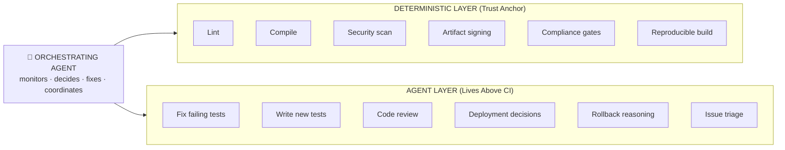
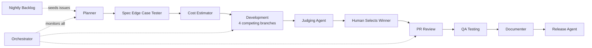

# MaatProof — Proof of Deploy

MaatProof is a Layer 1 blockchain for **Agentic CI/CD (ACI/ACD)**. It replaces traditional pipelines with **cryptographically verifiable deployment decisions made by AI agents**, enforced through signed reasoning proofs, deterministic trust anchors, and on-chain deployment policies.

Every deployment decision produces a `ReasoningProof` — a hash-chained, HMAC-signed artifact that answers *"Why did this deploy at 2 am?"* with a cryptographically verifiable answer, not a stale log entry.

## What MaatProof Does

| Capability | How it works |
|---|---|
| **Proof-of-Deploy consensus** | Validators replay and attest agent reasoning traces before production deploys |
| **Agent Virtual Machine (AVM)** | Executes reasoning traces deterministically and validates against on-chain policy |
| **Cryptographic audit trail** | Every agent decision is hash-chained and HMAC-SHA256 signed — tamper-evident by design |
| **Human approval invariant** | Production deployments always require a human in the loop — accountability, not capability |
| **Self-healing pipelines** | Agents don't just report failures — they fix tests, retry, and redeploy with bounded retries |

## Key Components

| Component | Role |
|---|---|
| **AVM** | Executes and verifies agent reasoning |
| **Deployment Contracts** | Policy as code, on-chain |
| **PoD Consensus** | Validators attest deployments |
| **$MAAT** | Staking, slashing, incentives |
| **ReasoningProof** | Signed, hash-chained reasoning artifacts |
| **OrchestratingAgent** | Event-driven coordination of deterministic + agent layers |

## Status

🚧 **Spec Phase** — Architecture defined, agent pipeline operational, core implementation in progress.

📄 **[Read the full MaatProof Whitepaper →](https://www.overleaf.com/read/hvsvqyvzfmhf#89e3b9)**

---

## Architecture: The Hybrid ACI/ACD Model

The honest answer is that **hybrid is right** — for now. Agents orchestrate above a deterministic trust anchor. The agent decides; the pipeline executes with cryptographic receipts.



**Keep deterministic CI for:**
- Production artifacts (signed builds, SBOM)
- Compliance requirements (SOC2, HIPAA audit trails)
- Security gates — never let an agent decide "this CVE is fine"
- The final deploy trigger (agent requests deploy; pipeline executes it)

**Replace with agents:**
- Everything that currently requires a human to read a failure and decide what to do
- PR review, test authoring, deployment scheduling
- Incident response and rollback reasoning

### The Orchestrating Agent Model

```python
agent.on("code_pushed")      -> run_deterministic_gates()
agent.on("test_failed")      -> fix_and_retry(max=3)
agent.on("all_tests_pass")   -> deploy_to_staging()
agent.on("staging_healthy")  -> request_human_approval()   # constitutional invariant
agent.on("approved")         -> deploy_to_prod()
agent.on("prod_error_spike") -> rollback()
```

---

## Agentic AI Loop

MaatProof uses a fully automated agentic pipeline powered by GitHub Actions and AI agents (Claude + GPT). Every issue flows through a structured sequence of agents before reaching production.



### Agent Pipeline

| Step | Agent | What it does |
|------|-------|-------------|
| 1 | **Planner** | Decomposes feature request into 9 scoped child issues with acceptance criteria |
| 2 | **Spec Edge Case Tester** | Generates up to 100 edge cases, validates specs reach ≥90% coverage |
| 3 | **Cost Estimator** | Compares Azure vs AWS vs GCP costs, calculates ACI/ACD savings using DORA metrics |
| 4 | **Development** | Spawns 4 concurrent implementations (Claude Sonnet, Claude Opus, GPT 5.3 Codex, GPT 5.4) |
| 5 | **Judging** | Scores all 4 on Big O complexity, code quality, cost, performance, security |
| 6 | **PR Review** | Posts 10-dimension review score on every PR |
| 7 | **QA Testing** | Validates against 10 comparison dimensions with pass/fail criteria |
| 8 | **Documenter** | Updates all public-facing docs, changelog, and diagrams |
| 9 | **Release** | Creates semantic version tag and GitHub Release |
| ∞ | **Orchestrator** | Monitors all events, re-triggers stalled agents (max 15 retries) |
| 🕐 | **Nightly Backlog** | Cron job seeds issues from `docs/requirements/backlog.md` every weekday at 7am UTC |

---

## Why ACI/ACD?

### Advantages

| Advantage | Why it matters |
|---|---|
| **Self-healing** | Agent doesn't just report a failing test — it fixes it, reruns, and redeploys |
| **Context-aware gates** | Agent understands *why* a test fails, not just that it failed |
| **Natural language policy** | "Don't deploy on Fridays, unless it's a security fix" — trivial for an agent, painful in YAML |
| **Adaptive workflows** | Agent skips Docker build gate when only a README changed |
| **Proactive** | Agent monitors production metrics and opens its own issue: "Error rate spiked, rolling back" |
| **No YAML hell** | No `.github/workflows/` archaeology |

### Real Risks (and how MaatProof addresses them)

| Risk | Mitigation |
|---|---|
| **Non-determinism** | Cryptographic reasoning proofs make every decision auditable and reproducible |
| **Auditability gap** | ReasoningProof = signed artifact, not a stale log entry |
| **Blast radius** | Deterministic gates (lint, compile, security scan) cannot be bypassed by any agent |
| **Runaway loops** | Bounded retries (max 3) with automatic escalation to human |
| **Rate limits** | Orchestrator monitors and re-triggers with max 15 retries per item |
| **Security surface** | Agent authority limits defined in Constitution §5 — agents cannot override deterministic gates |
| **LLM error rate** | 4-branch competing implementations + Judging Agent selects the best |

---

## 💰 Cost Savings — ACI/ACD vs Traditional CI/CD

| Metric | Traditional | MaatProof | Savings |
|--------|-------------|-----------|---------|
| Build cost per feature | $2,326 | $148 | **94%** |
| Deployment frequency | 1×/week | 10×/day | **70× faster** |
| Lead time for changes | 5 days | 2 hours | **98% faster** |
| Change failure rate | 15% | 3% | **80% reduction** |
| Mean time to recovery | 4 hours | 15 min | **94% faster** |
| DORA rating | Low | **Elite** | — |

> _Last estimated: 2026-04-22 | [Full cost report →](docs/reports/cost-estimation-report.md)_

---

## Getting Started

```bash
# Clone the repository
git clone https://github.com/dngoins/MaatProof.git
cd MaatProof

# Install dependencies
pip install -e ".[dev]"

# Run tests
python -m pytest tests/ -v

# Build a reasoning proof
python -c "
from maatproof.proof import ProofBuilder, ProofVerifier, ReasoningStep

builder = ProofBuilder(secret_key=b'my-secret', model_id='gpt-v1')
proof = builder.build(steps=[
    ReasoningStep(step_id=0, context='PR #42 failing', 
                  reasoning='Mock return value changed',
                  conclusion='Update mock to fix', timestamp=1700000000.0)
])
print(f'Proof ID: {proof.proof_id}')
print(f'Root hash: {proof.root_hash}')
print(f'Verified: {ProofVerifier(b\"my-secret\").verify(proof)}')
"
```

---

## Project Structure

```
CONSTITUTION.md          # Pipeline invariants — the policy layer above code
CLAUDE.md                # Agent session instructions
docs/
  requirements/          # Feature specs and backlog
  architecture/          # Design docs, ADRs, Mermaid diagrams
  reports/               # Cost estimation and analysis reports
maatproof/
  proof.py               # ReasoningProof, ProofBuilder, ProofVerifier
  chain.py               # ReasoningChain fluent builder
  orchestrator.py        # OrchestratingAgent — event-driven pipeline
  pipeline.py            # ACIPipeline and ACDPipeline
  layers/
    deterministic.py     # Trust anchor gates (lint, compile, security)
    agent.py             # Agent layer (fix, review, deploy decisions)
.github/
  agents/                # Agent persona files (planner, developer, QA, etc.)
  workflows/             # GitHub Actions workflows for each agent
tests/                   # Test suite (pytest)
```

---

## Contributing

1. Read [`CONSTITUTION.md`](CONSTITUTION.md) — the rules are non-negotiable
2. Spec first, code second — every feature needs a user story and acceptance criteria
3. One function per PR — keep changes small and reversible
4. All agent output requires human review before merge

See [CLAUDE.md](CLAUDE.md) for agent session instructions and the full label taxonomy.

---

## License

[MIT](LICENSE)

---

## 💰 Cost Savings (ACI/ACD vs Traditional)

| Metric | Traditional | MaatProof ACI/ACD | Savings |
|--------|-------------|-------------------|---------|
| Build cost per issue | $2,326 | $148 | **94%** |
| Annual CI/CD cost (4-dev team) | $304,392 | $2,429 | **99%** |
| Developer hours/year on CI/CD | 3,104 hrs | ~100 hrs | **3,004 hrs** |
| Mean deploy time | 5 days | 2 hours | **97%** |
| Defect escape rate | 15% | 3% | **80% ↓** |
| MTTR | 4 hours | 15 minutes | **94% ↓** |
| 5-year TCO | $1,521,960 | $14,124 | **$1,507,836** |
| ROI (Year 1) | — | — | **12,433%** |

> _Last estimated: 2026-04-22 · Issue #14 [ACI/ACD Engine] Data Model/Schema_
> [Full report](docs/reports/cost-estimation-report.md) · [Interactive charts](docs/reports/cost-summary.html)

---

> ***"The day LLMs have cryptographically verifiable, deterministic reasoning is the day you can drop the pipeline entirely."***
