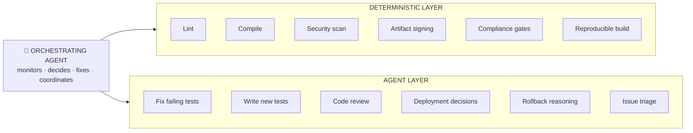

# MaatProof — Proof of Deploy

MaatProof is a Layer 1 blockchain for **Agentic CI/CD (ACI/ACD)**.

It replaces traditional pipelines with **cryptographically verifiable deployment decisions made by AI agents**, enforced through:

- Proof-of-Deploy consensus
- Agent Virtual Machine (AVM)
- On-chain deployment policies
- Verifiable reasoning traces

## Status

🚧 Spec Phase — Pre-implementation

## Goals

- Replace CI/CD with verifiable pipelines
- Make AI deployments auditable
- Introduce economic accountability for agents

## Key Components

| Component | Role |
|---|---|
| **AVM** | Executes and verifies agent reasoning |
| **Deployment Contracts** | Policy as code, on-chain |
| **PoD Consensus** | Validators attest deployments |
| **$MAAT** | Staking, slashing, incentives |

📄 **[Read the full MaatProof Whitepaper →](https://www.overleaf.com/read/hvsvqyvzfmhf#89e3b9)**

---

## Hypothesis: Proof-of-Deploy

If a large language model–based system can produce cryptographically verifiable and deterministic reasoning traces that are reproducible across executions and independently auditable, then such a system can safely replace traditional CI/CD pipelines as the primary mechanism for software validation and deployment.

---

## Traditional CI/CD vs. Agent-Continuous Dev/Deployment (ACD)

### What we already have is ACI

For example, issues trigger Claude, Claude writes code, creates PRs. The pipeline is just a safety net underneath it. The real question is: should agents replace that net, or run above it?

---

## Advantages of going full ACD

| Advantage | Why it matters |
|---|---|
| Self-healing | Agent doesn't just report a failing test — it fixes it, reruns, and redeploys |
| Context-aware gates | Agent understands *why* a test fails, not just that it failed. Can decide "this flaky test is irrelevant to this change" |
| Natural language policy | "Don't deploy on Fridays, unless it's a security fix" is trivial for an agent, painful in YAML |
| Adaptive workflows | Agent skips Docker build gate when only a README changed |
| Proactive | Agent monitors production metrics and opens its own issue: "Error rate spiked, rolling back" |
| No YAML hell | No `.github/workflows/` archaeology |

---

## Disadvantages / Real Risks

| Risk | Why it matters |
|---|---|
| Non-determinism | Same code, different LLM run → different deployment decision. This is catastrophic in regulated environments (SOX, HIPAA, etc.) |
| Auditability gap | "Why did this deploy at 2am?" needs a deterministic answer. LLM reasoning is a chain of thought, not a signed artifact |
| Blast radius | A confused agent with deploy credentials can silently push broken code to prod. A YAML pipeline fails loudly and stops |
| Runaway loops | Agent fixes test → breaks another → fixes that → infinite loop → $$$ |
| Rate limits as deployment gates | Anthropic API down = your deployments stop |
| Speed | LLM call: ~2–10s per step. `npm test`: 30s flat. A 20-step agent loop is slower than a deterministic pipeline |
| Security surface | An agent with `gh`, `az`, and `kubectl` access is the highest-value attack target in your org |
| Current LLM error rate | Agents make mistakes. A CI script either works or it doesn't |

---

## The Honest Answer: Hybrid is Right (for now)



**Keep deterministic CI for:**
- Anything that touches production artifacts (signed builds, SBOM)
- Compliance requirements (SOC2, HIPAA audit trails)
- Security gates — never let an agent decide "this CVE is fine"
- The final deploy trigger (agent requests deploy; pipeline executes it)

**Replace with agents:**
- Everything that currently requires a human to read a failure and decide what to do
- PR review, test authoring, deployment scheduling
- Incident response and rollback reasoning

---

## The 1 Orchestrating Agent Model

This is where it's heading. Essentially:

```python
# pseudo-code for what your repo already almost does
agent.on("code_pushed")      -> run_tests()
agent.on("test_failed")      -> fix_and_retry(max=3)
agent.on("all_tests_pass")   -> deploy_to_staging()
agent.on("staging_healthy")  -> request_human_approval()  # <-- keep this
agent.on("approved")         -> deploy_to_prod()
agent.on("prod_error_spike") -> rollback()
```

The one thing that should **never** be removed from the loop: **human approval before production**. Not because agents can't decide — but because accountability requires a human in the chain. The same principle applies to deployments.

---

## Bottom line

You don't need traditional CI/CD as the primary workflow — but you want its deterministic, auditable core underneath your agents as a trust anchor. The agent orchestrates; the pipeline executes with receipts.

> If a large language model–based system can produce cryptographically verifiable and deterministic reasoning traces that are reproducible across executions and independently auditable, then such a system can safely replace traditional CI/CD pipelines as the primary mechanism for software validation and deployment.
