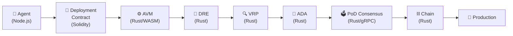
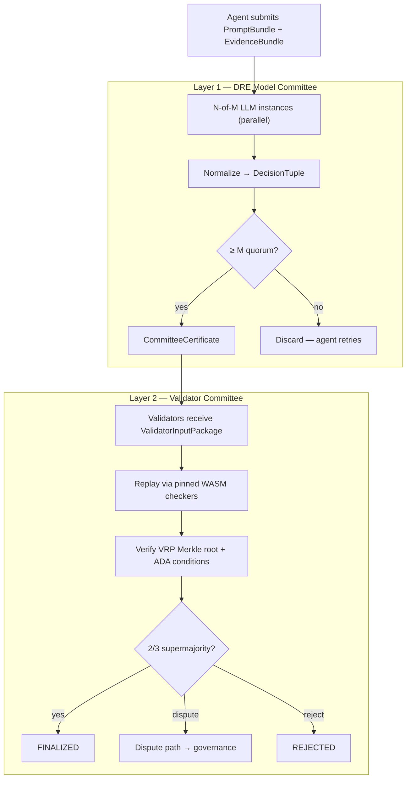
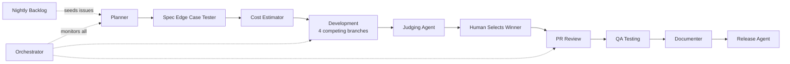

# MaatProof — Proof of Deploy

MaatProof is a Layer 1 blockchain for **Agentic CI/CD (ACI/ACD)**. It replaces traditional pipelines with **cryptographically verifiable deployment decisions made by AI agents**, enforced through signed reasoning proofs, deterministic trust anchors, and on-chain deployment policies.

Every deployment decision produces a `ReasoningProof` — a hash-chained, HMAC-signed artifact that answers *"Why did this deploy at 2 am?"* with a cryptographically verifiable answer, not a stale log entry.

The protocol stack is built in **Rust** (consensus engine, AVM, DRE, VRP, ADA), **Node.js** (orchestrator, GitHub integrations, SDK), and **Solidity** (deployment contracts, tokenomics, governance).

## What MaatProof Does

| Capability | How it works |
|---|---|
| **Proof-of-Deploy consensus** | Two-layer consensus: DRE model committee (L1) + stake-weighted validator committee (L2) attest every deployment |
| **Deterministic Reasoning Engine (DRE)** | N-of-M LLM instances execute a canonical `PromptBundle` in parallel; convergence on a `DecisionTuple` emits a `CommitteeCertificate` — determinism is a system property, not a per-call guarantee |
| **Verifiable Reasoning Protocol (VRP)** | Typed reasoning records committed as a Merkleized DAG; only *admissible* (machine-checkable) reasoning may authorize a production deploy |
| **Autonomous Deployment Authority (ADA)** | 7-condition authorization replaces mandatory human approval as the protocol default; human approval is a configurable policy gate for regulated workloads |
| **Agent Virtual Machine (AVM)** | Executes reasoning traces deterministically in a WASM sandbox and validates against on-chain policy |
| **Cryptographic audit trail** | Every agent decision is hash-chained and HMAC-SHA256 signed — tamper-evident by design |
| **Self-healing pipelines** | Agents fix failing tests, retry, and redeploy with bounded retries; runtime guard + rollback proofs provide automatic production safety |

## Key Components

| Component | Role |
|---|---|
| **AVM** | WASM sandbox execution and policy-driven trace verification (Rust) |
| **DRE** | N-of-M LLM committee; canonical PromptBundle + EvidenceBundle → DecisionTuple (Rust) |
| **VRP** | Typed, Merkleized reasoning records; admissible vs informational split (Rust) |
| **ADA** | 7-condition autonomous deployment authorization; runtime guard + rollback proofs (Rust) |
| **Deployment Contracts** | Policy as code, on-chain; configurable human approval gate (Solidity) |
| **PoD Consensus** | Two-layer: DRE model committee + validator stake-weighted quorum (Rust / gRPC) |
| **$MAAT** | Staking, slashing, validator incentives, DAO governance (Solidity) |
| **ReasoningProof** | Signed, hash-chained reasoning artifacts (Python orchestration layer) |
| **OrchestratingAgent** | Event-driven ACI/ACD pipeline coordination (Node.js) |

## Status

🚧 **Spec Phase** — Architecture defined, agent pipeline operational, core implementation in progress.

📄 **[Read the full MaatProof Whitepaper →](https://www.overleaf.com/read/hvsvqyvzfmhf#89e3b9)**

---

## Architecture

MaatProof operates as a fully autonomous ACI/ACD system. Agents propose, DRE verifies, VRP records reasoning, ADA authorizes, and the chain finalizes — no external CI/CD pipeline required.

### Full Protocol Stack

### Full Protocol Stack



### Two-Layer Consensus



### Orchestrating Agent + Deterministic Layers


### Two-Layer Consensus


### The Orchestrating Agent Model

```python
agent.on("code_pushed")      -> submit_to_avm()          # AVM validates policy + trace
agent.on("test_failed")      -> fix_and_retry(max=3)
agent.on("all_tests_pass")   -> deploy_to_staging()
agent.on("staging_healthy")  -> submit_prompt_bundle()   # → DRE → VRP → ADA
agent.on("ada_authorized")   -> deploy_to_prod()         # ADA is protocol default
agent.on("policy_requires")  -> request_human_approval() # when contract declares it
agent.on("prod_error_spike") -> rollback()               # runtime guard triggers
```

> ADA is the protocol default for production authorization. Human approval is a configurable gate declared in the Deployment Contract — required for regulated workloads (SOX, HIPAA, PCI-DSS, CRITICAL tier).

---

## Agentic AI Loop

MaatProof uses a fully automated agentic pipeline powered by GitHub Actions and AI agents (Claude + GPT). Every issue flows through a structured sequence of agents before reaching production.



### Agent Pipeline

| Step | Agent | What it does |
|------|-------|-------------|
| 1 | **Planner** | Decomposes feature request into 9 scoped child issues with acceptance criteria |
| 2 | **Spec Edge Case Tester** | Generates up to 100 edge cases, validates specs reach ≥90% coverage |
| 3 | **Cost Estimator** | Compares Azure vs AWS vs GCP costs, calculates ACI/ACD savings using DORA metrics |
| 4 | **Development** | Spawns 4 concurrent implementations (Claude Sonnet, Claude Opus, GPT 5.3 Codex, GPT 5.4) |
| 5 | **Judging** | Scores all 4 on Big O complexity, code quality, cost, performance, security |
| 6 | **PR Review** | Posts 10-dimension review score on every PR |
| 7 | **QA Testing** | Validates against 10 comparison dimensions with pass/fail criteria |
| 8 | **Documenter** | Updates all public-facing docs, changelog, and diagrams |
| 9 | **Release** | Creates semantic version tag and GitHub Release |
| ∞ | **Orchestrator** | Monitors all events, re-triggers stalled agents (max 15 retries) |
| 🕐 | **Nightly Backlog** | Cron job seeds issues from `docs/requirements/backlog.md` every weekday at 7am UTC |

---

## Why ACI/ACD?

### Advantages

| Advantage | Why it matters |
|---|---|
| **Self-healing** | Agent doesn't just report a failing test — it fixes it, reruns, and redeploys |
| **Context-aware gates** | Agent understands *why* a test fails, not just that it failed |
| **Natural language policy** | "Don't deploy on Fridays, unless it's a security fix" — trivial for an agent, painful in YAML |
| **Adaptive workflows** | Agent skips Docker build gate when only a README changed |
| **Proactive** | Agent monitors production metrics and opens its own issue: "Error rate spiked, rolling back" |
| **No YAML hell** | No `.github/workflows/` archaeology |

### Real Risks (and how MaatProof addresses them)

| Risk | Mitigation |
|---|---|
| **Non-determinism** | DRE: N-of-M committee quorum makes determinism a system property; VRP Merkle DAG makes every reasoning step auditable |
| **Auditability gap** | ReasoningProof = signed artifact; VRP admissible reasoning is on-chain and verifiable |
| **Blast radius** | ADA requires 7 conditions including zero blocking CVEs; runtime guard auto-rolls back on any error spike |
| **Runaway loops** | Bounded retries (max 3); runtime guard auto-rolls back on error spike |
| **Rate limits** | Orchestrator monitors and re-triggers with max 15 retries per item |
| **Security surface** | Agent authority limits in Constitution §5; dispute path prevents bad slashing |
| **LLM error rate** | 4-branch competing implementations + Judging Agent; DRE committee quorum as L1 safety |

---

## 💰 Cost Savings — ACI/ACD vs Traditional CI/CD

> _Issue #31: VRP Data Model/Schema — VerifiableStep, InferenceRule (7 rules), AttestationRecord (HMAC-SHA256 + ECDSA P-256), VerificationLevel, ProofChain_

| Metric | Traditional | MaatProof | Savings |
|--------|-------------|-----------|---------|
| Build cost per issue (VRP Data Model #31) | $3,167 | $195 | **94%** |
| Annual developer savings | — | $186,240 | **3,104 hrs/yr** |
| Deployment frequency | 1×/week | 10×/day | **70× faster** |
| Lead time for changes | 5 days | 2 hours | **60× faster** |
| Change failure rate | 15% | 3% | **80% reduction** |
| Mean time to recovery | 4 hours | 15 min | **94% faster** |
| Cryptographic test coverage | 40% manual | 95% automated | **+55pp** |
| VRP runtime cost (GCP standard) | — | **$0.16/mo** | ECDSA P-256 incl. |
| Annual infra cost (100 MAU, GCP) | — | **$31/yr** | — |
| DORA rating | Low | **Elite** | — |
| Year 1 ROI | — | — | **12,507%** |
| 5-year TCO savings | — | — | **$1,832,532** |

> _Last estimated: 2026-04-23 · Issue #31 [VRP Data Model / Schema] · [Full report →](docs/reports/cost-estimation-report.md) · [Dashboard →](docs/reports/cost-summary.html)_
---

## Getting Started

```bash
# Clone the repository
git clone https://github.com/dngoins/MaatProof.git
cd MaatProof

# Install dependencies
pip install -e ".[dev]"

# Run tests
python -m pytest tests/ -v

# Build a reasoning proof
python -c "
from maatproof.proof import ProofBuilder, ProofVerifier, ReasoningStep

builder = ProofBuilder(secret_key=b'my-secret', model_id='gpt-v1')
proof = builder.build(steps=[
    ReasoningStep(step_id=0, context='PR #42 failing', 
                  reasoning='Mock return value changed',
                  conclusion='Update mock to fix', timestamp=1700000000.0)
])
print(f'Proof ID: {proof.proof_id}')
print(f'Root hash: {proof.root_hash}')
print(f'Verified: {ProofVerifier(b\"my-secret\").verify(proof)}')
"
```

---

## Project Structure

```
CONSTITUTION.md          # Pipeline invariants — the policy layer above code
CLAUDE.md                # Agent session instructions
specs/
  dre-spec.md            # Deterministic Reasoning Engine (Rust)
  vrp-spec.md            # Verifiable Reasoning Protocol (Rust)
  ada-spec.md            # Autonomous Deployment Authority (Rust)
  pod-consensus-spec.md  # Two-layer PoD consensus — DRE + validator committees
  avm-spec.md            # Agent Virtual Machine
  agent-identity-spec.md # Agent DID and key management
docs/
  01-architecture.md     # Full 9-component stack + tech stack callouts
  02-consensus-proof-of-deploy.md  # Block structure, MaatBlock Rust struct
  08-roadmap.md          # Phase roadmap (full ACD from day 1)
  requirements/          # Feature specs and backlog
  reports/               # Cost estimation and analysis reports
maatproof/
  proof.py               # ReasoningProof, ProofBuilder, ProofVerifier
  chain.py               # ReasoningChain fluent builder
  orchestrator.py        # OrchestratingAgent — event-driven pipeline
  pipeline.py            # ACIPipeline and ACDPipeline
  layers/
    deterministic.py     # Trust anchor gates (lint, compile, security)
    agent.py             # Agent layer (fix, review, deploy decisions)
.github/
  agents/                # Agent persona files (planner, developer, QA, etc.)
  workflows/             # GitHub Actions workflows for each agent
tests/                   # Test suite (pytest)
```

---

## Contributing

1. Read [`CONSTITUTION.md`](CONSTITUTION.md) — the rules are non-negotiable
2. Spec first, code second — every feature needs a user story and acceptance criteria
3. One function per PR — keep changes small and reversible
4. All agent output requires human review before merge

See [CLAUDE.md](CLAUDE.md) for agent session instructions and the full label taxonomy.

---

## License

[CC0-1.0](LICENSE)

---

> ***"The day LLMs have cryptographically verifiable, deterministic reasoning is the day you can drop the pipeline entirely."***
