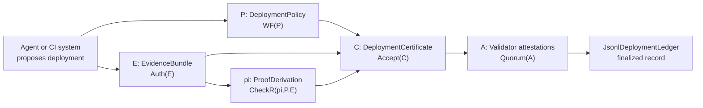

# MaatProof - Proof-of-Deploy

MaatProof is a research prototype for **proof-carrying deployment**: every deployment decision is packaged with a machine-checkable certificate that explains what was deployed, which evidence supports it, which policy it satisfies, and which validators attested to it.

The day autonomous agents can produce cryptographically bound, deterministic, machine-checkable deployment certificates is the day CI/CD stops being the authority of deployment and becomes the evidence layer for proof-carrying deployment.

## Why this matters

AI tools now let people "vibe code" an app quickly. The demo may look polished, but important deployment questions often remain unanswered:

- Why this database?
- Why this authentication model?
- Why single-user instead of multi-user?
- Why no tenant isolation?
- Why deploy now?
- Why did the AI think this was production-ready?

MaatProof starts from a simple claim: **every AI deployment should come with a receipt.** Not just a receipt for the code, but a receipt for the decision to ship it.

Before an AI-built system is deployed, it should carry a proof explaining what policy it followed, what evidence it used, what assumptions it made, and who or what verified the decision. That proof should be replayable by someone other than the AI agent that made the choice.

MaatProof is a black box recorder for AI-built software. It turns mystery deployments into verifiable records. When AI writes the code, Proof-of-Deploy explains the why.

Think of it as:

- From vibe coding to verified shipping.
- Do not just ship it. Prove why it should ship.
- Proof-of-Deploy: a receipt for every AI software decision.
- Trustless deployment for the AI coding era.
- Every AI-built app should ship with proof of why it was safe to deploy.

Blockchain gave us a way to verify financial transactions without blindly trusting the people involved. MaatProof applies that idea to AI software deployments. When an AI agent builds or deploys software, it must produce a cryptographic receipt showing what policy it followed, what evidence it used, what tests passed, what assumptions were made, and which validators agreed.

Instead of asking, "Why did the AI ship this?" after something breaks, MaatProof gives you a replayable Proof-of-Deploy before the software reaches production.

One-sentence version: **MaatProof is Proof-of-Deploy for the AI coding era: every AI-built app ships with a verifiable receipt explaining why it was safe to release.**

For example, suppose an AI builds a demo app with a single-user architecture and a customer later asks, "Why did it choose single-user instead of multi-user?" With MaatProof, the answer should not be buried in a chat log or guessed after the fact. The deployment certificate can show:

- What requirements were provided.
- Whether multi-user support was explicitly required.
- Which policy gates existed.
- Which architecture assumptions were recorded.
- Which tests were run.
- Which deployment profile was selected.
- Whether human approval was required.
- Whether the app was marked as demo-only, staging, or production.
- Whether it passed an architecture-readiness policy.

## Business case

AI coding changes the economics of software delivery: teams can generate and modify applications faster than traditional review, security, and compliance processes can absorb. That speed is useful only if organizations can still answer the business question behind every release: **why was this safe to ship?**

MaatProof turns that question into a verifiable artifact. Instead of relying on scattered chat history, pipeline logs, or tribal memory, each deployment can carry a certificate that connects requirements, assumptions, tests, policies, approvals, and validator attestations. This makes AI-built software easier to govern, audit, sell, insure, and operate.

| Business concern | Why it matters | How Proof-of-Deploy helps |
|---|---|---|
| **Executive accountability** | Leaders need confidence that AI-generated changes are not entering production on vibes alone. | Each release has a replayable decision record showing why it was allowed. |
| **Audit and compliance** | Regulated teams must prove that required controls ran before deployment. | Policies, evidence, human approvals when required, and validator attestations are attached to the certificate. |
| **Security risk** | AI may omit auth, tenant isolation, threat modeling, or production-readiness checks. | Architecture assumptions and policy gates become explicit evidence instead of hidden prompt context. |
| **Enterprise procurement** | Buyers will ask how an AI-built system was verified before adoption. | A Proof-of-Deploy record can support due diligence, vendor review, and customer trust. |
| **Incident response** | After an outage, teams need to know what was assumed, tested, skipped, or approved. | The certificate becomes a black box recorder for the deployment decision. |
| **Developer productivity** | Teams want AI speed without turning review into a bottleneck. | CI/CD becomes the evidence producer; the proof checker decides whether the release is acceptable. |

The business value is not just "better CI." It is a governance layer for the AI software supply chain. As AI agents move from generating demos to modifying real production systems, companies will need a way to distinguish a convincing demo from a deployment that is policy-compliant, evidence-backed, and independently verifiable.

MaatProof's practical thesis is that proof-carrying deployment can become the trust boundary between fast AI software creation and responsible enterprise release management.

## Research perspective

Modern CI/CD logs tell you what happened. MaatProof aims to prove why a deployment was allowed.

The formal motivation and broader protocol argument are developed in the [MaatProof White Paper](https://www.overleaf.com/read/hvsvqyvzfmhf#89e3b9).

The core object is a deployment certificate:

```text
C = <P, E, pi, A>
```

Where:

| Symbol | Meaning | Python implementation |
|---|---|---|
| `P` | Deployment policy | `maatproof.policy.DeploymentPolicy` |
| `E` | Signed evidence bundle | `maatproof.evidence.EvidenceBundle` |
| `pi` | Machine-checkable proof derivation | `maatproof.vrp.ProofDerivation` |
| `A` | Validator attestations | `maatproof.pod.ValidatorAttestation` |

The acceptance rule is explicit and replayable:

```text
Accept(C) = WF(P) && Auth(E) && CheckR(pi, P, E) && Quorum(A)
```

The model is deliberately decomposed into independent proof obligations. Policy validity, evidence authenticity, reasoning admissibility, and validator finality are checked separately so the system can explain exactly which obligation failed.

## What this repo showcases

This repository combines a formal protocol sketch with executable Python and Rust code:

| Showcase | What to inspect |
|---|---|
| **Proof-carrying deployment certificate** | `PYTHON/maatproof/certificate.py`, `RUST/src/certificate.rs` |
| **Policy well-formedness (`WF(P)`)** | `PYTHON/maatproof/policy.py`, `RUST/src/policy.rs` |
| **Signed, canonical evidence (`Auth(E)`)** | `PYTHON/maatproof/evidence.py`, `PYTHON/maatproof/canonical.py`, `RUST/src/evidence.rs`, `RUST/src/canonical.rs` |
| **Verifiable reasoning derivation (`CheckR`)** | `PYTHON/maatproof/vrp.py`, `RUST/src/vrp.rs` |
| **Validator quorum and finality (`Quorum(A)`)** | `PYTHON/maatproof/pod.py`, `RUST/src/pod.rs` |
| **Append-only local deployment ledger** | `PYTHON/maatproof/ledger.py`, `RUST/src/ledger.rs` |
| **AVM boundary trace-to-evidence conversion** | `PYTHON/maatproof/avm.py`, `RUST/src/avm.rs` |
| **Hash-chained reasoning proofs** | `PYTHON/maatproof/proof.py`, `PYTHON/maatproof/chain.py`, `RUST/src/proof.rs`, `RUST/src/chain.rs` |
| **Agentic CI/CD orchestration prototype** | `PYTHON/maatproof/pipeline.py`, `PYTHON/maatproof/orchestrator.py`, `PYTHON/maatproof/layers`, `RUST/src/pipeline.rs`, `RUST/src/orchestrator.rs`, `RUST/src/layers` |
| **Executable demonstration** | `examples/proof_of_deploy_colab.ipynb` |

The implementations intentionally use HMAC-SHA256 so the reference model is easy to run in tests and Colab. Production hardening can replace the signature backend with Ed25519 or post-quantum schemes without changing the certificate validity equation.

## Architecture at a glance



The design separates research concerns cleanly:

1. **Policy is not evidence.** Policy says what must be true; evidence proves facts about a specific deployment.
2. **Evidence is not reasoning.** Evidence is signed external data; `pi` is the derivation that connects evidence to policy satisfaction.
3. **Validity is not incentives.** Tokenomics, staking, slashing, and checker markets are accountability layers. They do not change `Accept(C)`.
4. **Human approval is a policy primitive.** ADA is the default production-authorization model; human approval can be required by a declared policy gate for regulated workloads.

## Try it in Google Colab

Open [`examples/proof_of_deploy_colab.ipynb`](examples/proof_of_deploy_colab.ipynb) to run a complete proof-of-deploy flow.

The notebook demonstrates:

- A valid production deployment certificate.
- Finality through validator attestations.
- Local ledger append and replay verification.
- Rejections for missing scan evidence, stale human attestation, wrong environment binding, invalid derivation steps, and insufficient quorum.

## Local quick start

```bash
git clone https://github.com/dngoins/MaatProof.git
cd MaatProof
cd PYTHON
pip install -e ".[dev]"
python -m pytest tests -v
```

Rust:

```bash
git clone https://github.com/dngoins/MaatProof.git
cd MaatProof
cd RUST
cargo test
```

## Implementation samples

The Python sample below shows the original reference flow. For Rust usage, including a minimal certificate check and pointers to end-to-end test samples, see [`RUST/README.md`](RUST/README.md) and the unit tests in `RUST/src/core.rs`.

Minimal certificate check:

```python
from maatproof import (
    CertificateChecker,
    DeploymentCertificate,
    DeploymentPolicy,
    DeploymentRequest,
    EvidenceBundle,
    PolicyPredicate,
    ProofDerivation,
    ProofStep,
    signed_evidence,
    simulate_validators,
)

evidence_key = b"evidence-secret"
validators = {
    "validator-a": b"validator-a-secret",
    "validator-b": b"validator-b-secret",
    "validator-c": b"validator-c-secret",
}
now = 1_700_000_100.0

request = DeploymentRequest(
    deployment_id="deploy-123",
    service="checkout",
    environment="production",
    commit_sha="abc123",
    artifact_hash="sha256:artifact",
    requested_by="agent:planner",
)

policy = DeploymentPolicy(
    policy_id="checkout-prod",
    version=1,
    environment="production",
    freshness_seconds={"scan_report": 3600},
    predicates=[
        PolicyPredicate("test_passed", {"suite": "unit"}),
        PolicyPredicate(
            "vuln_count",
            {"severity": "critical", "operator": "<=", "threshold": 0},
        ),
        PolicyPredicate("environment_matches", {"target": "production"}),
    ],
)

evidence = EvidenceBundle([
    signed_evidence(
        "commit",
        "commit_snapshot",
        {"deployment_id": request.deployment_id, "commit_sha": request.commit_sha},
        "git",
        now,
        evidence_key,
    ),
    signed_evidence(
        "artifact",
        "build_artifact",
        {"deployment_id": request.deployment_id, "artifact_hash": request.artifact_hash},
        "builder",
        now,
        evidence_key,
    ),
    signed_evidence(
        "test",
        "test_result",
        {"deployment_id": request.deployment_id, "suite": "unit", "passed": True},
        "pytest",
        now,
        evidence_key,
    ),
    signed_evidence(
        "scan",
        "scan_report",
        {"deployment_id": request.deployment_id, "vulnerabilities": {"critical": 0}},
        "scanner",
        now,
        evidence_key,
    ),
    signed_evidence(
        "env",
        "environment_descriptor",
        {"deployment_id": request.deployment_id, "environment": "production"},
        "cluster",
        now,
        evidence_key,
    ),
])

proof = ProofDerivation(
    final_conclusion=f"deploy_authorized:{request.deployment_id}",
    steps=[
        ProofStep("test-pass", "TEST_PASS", "test_passed:unit", ["test"]),
        ProofStep("scan-ok", "VULN_OK", "vuln_count:critical<=0", ["scan"]),
        ProofStep("env-ok", "ENVIRONMENT_MATCH", "environment_matches", ["env"]),
        ProofStep(
            "policy",
            "POLICY_SATISFIED",
            "policy_satisfied",
            premises=["test-pass", "scan-ok", "env-ok"],
        ),
        ProofStep(
            "deploy",
            "DEPLOY_AUTH",
            f"deploy_authorized:{request.deployment_id}",
            premises=["policy"],
        ),
    ],
)

certificate = DeploymentCertificate(request, policy, evidence, proof)
checker = CertificateChecker(evidence_key, now=now)
certificate.attestations = simulate_validators(certificate, checker, validators, now)

report = CertificateChecker(evidence_key, validators, now=now).accept(certificate)
assert report.accepted, [failure.code for failure in report.failures]
print(report.certificate_digest)
```

## Verification guarantees

MaatProof is not just a CI helper script. It is a testbed for deployment authorization as a verifiable system:

- **Formal object model:** certificate validity is stated as `Accept(C)` over named sub-checks.
- **Deterministic replay:** verifiers can recompute canonical hashes, evidence roots, proof roots, and validator quorum.
- **Falsifiable examples:** tests include both accepted certificates and precise rejection cases.
- **Traceability:** docs, specs, tests, and code map back to policy, evidence, proof, and attestation obligations.
- **Accountable finality:** a deployment is not "good because the agent said so"; it is accepted only after replay and quorum.
- **Incentive separation:** economic systems can punish bad actors, but validity remains a pure checker result.

## Repository layout

```text
CONSTITUTION.md          # Project invariants and agent workflow rules
docs/                    # Architecture docs, roadmap, requirements, reports
specs/                   # Protocol specifications for AVM, VRP, PoD, ADA, DRE
contracts/               # Solidity contract sketches
examples/
  proof_of_deploy_colab.ipynb
PYTHON/
  maatproof/              # Original Python reference package
  tests/                  # Pytest suite, including proof-of-deploy cases
  pyproject.toml          # Python package metadata
RUST/
  Cargo.toml              # Rust crate metadata
  src/                    # Rust implementation modules and unit tests
```

## Current status

MaatProof is a **reference prototype**, not a production deployment network. The Python and Rust packages are intended to make the research model executable, inspectable, and easy to challenge.

Planned hardening paths include:

- Rust/WASM checkers for production AVM and VRP replay.
- Stronger signature adapters such as Ed25519 and post-quantum schemes.
- On-chain deployment contracts and checker registries.
- Stake-weighted validator networks with dispute and slashing paths.
- Runtime guard and rollback proofs for finalized deployments.

## Contributing

This repo follows [`CONSTITUTION.md`](CONSTITUTION.md):

1. Spec first, code second.
2. Every artifact must trace to acceptance criteria.
3. Human review is required before merge.
4. Small, reversible changes are preferred.
5. Deterministic gates and cryptographic proof obligations cannot be bypassed.

## License

[CC0-1.0](LICENSE)

> "The day agents can prove why they should deploy is the day pipelines stop approving deployments and start feeding proofs."
