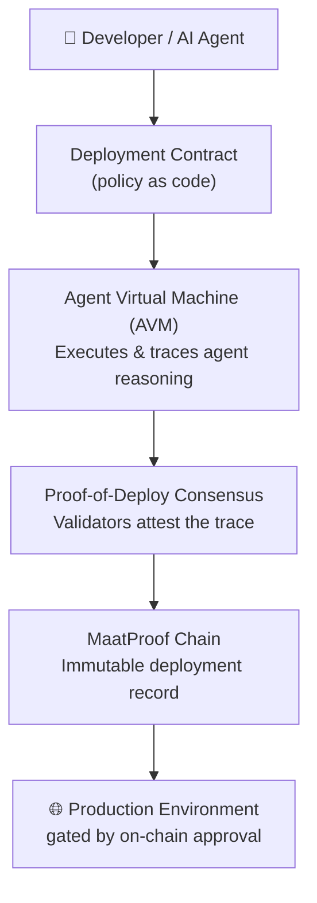
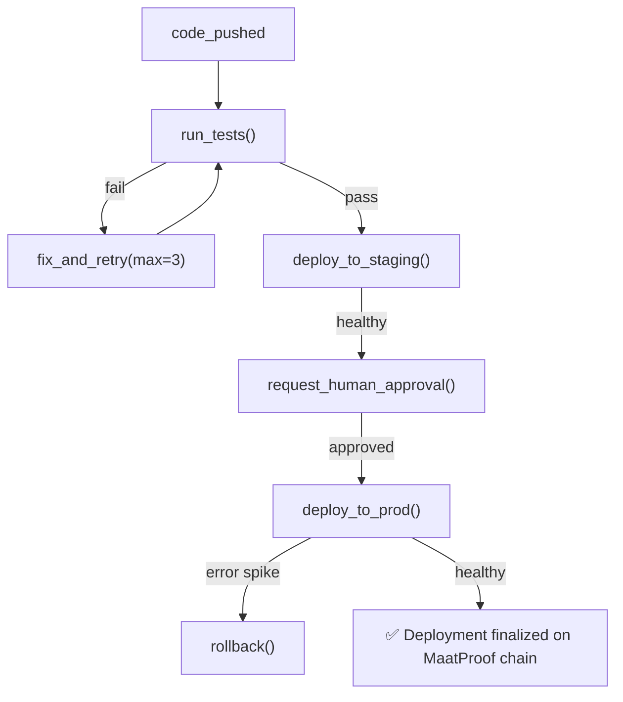

# MaatProof Whitepaper
### Proof-of-Deploy: A Decentralized Trust Layer for the ACI/ACD Revolution

**Version 0.1 — Draft**

---

## Abstract

Software deployment is a trust problem. Today, that trust is enforced by YAML pipelines, human approvers, and audit logs stored in systems controlled by the same organizations they are meant to hold accountable. As AI agents increasingly write, review, and deploy code autonomously, this model breaks down.

MaatProof is a purpose-built Layer 1 blockchain whose singular mission is to be the **trust infrastructure for Agent-Continuous Integration and Deployment (ACI/ACD)**. Where Ethereum powers decentralized finance, MaatProof powers decentralized deployment. Every agent action, every reasoning trace, every deployment decision is cryptographically signed, verified by the network, and permanently recorded on-chain.

The hypothesis at the core of MaatProof:

> *If a large language model–based system can produce cryptographically verifiable and deterministic reasoning traces that are reproducible across executions and independently auditable, then such a system can safely replace traditional CI/CD pipelines as the primary mechanism for software validation and deployment.*

MaatProof is the infrastructure that makes that hypothesis provably true.

---

## 1. The Problem

### 1.1 CI/CD Was Built for Humans

Traditional CI/CD pipelines — GitHub Actions, Jenkins, CircleCI — were designed for a world where humans write code and pipelines check it. The pipeline is a deterministic script. The human is the intelligent actor. Trust flows from human accountability.

That world is ending.

AI agents now open issues, write code, author PRs, run tests, and increasingly request deployments. The pipeline is no longer a check on human work — it is a check on agent work. But it was never designed for that role.

### 1.2 The Trust Gap

When a human deploys broken code, there is accountability: a name, a commit, a decision trail. When an agent deploys broken code today:

- The reasoning that led to the deployment lives in an ephemeral LLM context window
- The audit log says *what* happened, not *why*
- There is no cryptographic proof the agent followed policy
- There is no economic penalty for a bad decision

This is the **trust gap**. MaatProof closes it.

### 1.3 The Auditability Crisis

Regulators, auditors, and security teams ask one question: *"Why did this happen?"* For human-driven deployments, the answer is a PR, a review, an approval. For agent-driven deployments, the answer is a chain of thought that no longer exists.

SOX, HIPAA, SOC2, and emerging AI governance frameworks will require verifiable, auditable records of autonomous agent decisions. No existing infrastructure provides this.

---

## 2. The Vision: Ethereum for ACI/ACD

Ethereum proved that a programmable blockchain could become the trust layer for an entirely new financial system. Smart contracts replaced intermediaries. Validators replaced banks. The chain replaced the ledger.

MaatProof applies the same architecture to software deployment.

| Ethereum | MaatProof |
|---|---|
| Powers DeFi & DAOs | Powers ACI/ACD pipelines |
| Smart contracts | Deployment contracts (policy as code, on-chain) |
| Proof-of-Stake | **Proof-of-Deploy** |
| Gas fees | Deploy fees (staked $MAAT) |
| EVM (Ethereum Virtual Machine) | **AVM (Agent Virtual Machine)** |
| Validators | Deployment attestation nodes |
| `msg.sender` | `agent.identity` (cryptographically signed) |
| Slashing | Penalizes agents that push bad deploys |
| Immutable transaction log | The audit trail that replaces CI receipts |

Any team. Any repo. Any agent. Plug into MaatProof and get **verifiable, on-chain deployment history**. No YAML archaeology. No trust-me-bro CI logs. The chain *is* the pipeline.

---

## 3. Architecture

### 3.1 The Stack



### 3.2 Deployment Contracts

Deployment contracts are the on-chain equivalent of `.github/workflows/`. They encode deployment policy in a language agents can read, reason about, and prove compliance with.

```solidity
// Example: MaatProof Deployment Contract
contract DeployPolicy {
    rule no_friday_deploys: dayOfWeek != FRIDAY || isCriticalSecurityFix();
    rule require_human_approval: stage == PRODUCTION;
    rule test_coverage_gate: coverage >= 80;
    rule no_known_cves: securityScan.critical == 0;
    rule agent_stake_minimum: agent.stakedMAT >= 1000;
}
```

Agents must prove compliance with every rule before a deployment is finalized. Proof is on-chain. Policy is immutable. No YAML. No secrets in environment variables.

### 3.3 The Agent Virtual Machine (AVM)

The AVM is MaatProof's execution environment. Unlike the EVM (which executes deterministic bytecode), the AVM executes **agent reasoning traces** and produces **verifiable proofs of compliance**.

Key properties:
- **Trace recording** — every step of agent reasoning is captured and hashed
- **Deterministic replay** — any validator can re-execute the trace and verify the outcome
- **Policy binding** — traces are evaluated against the deployment contract
- **Identity attestation** — agent identity is cryptographically signed (no impersonation)

The AVM is how MaatProof closes the hypothesis gap: it makes LLM reasoning *verifiable*.

### 3.4 Proof-of-Deploy Consensus

MaatProof's consensus mechanism is **Proof-of-Deploy (PoD)**. Validators are nodes that:

1. Receive a deployment request + reasoning trace from an agent
2. Re-execute the trace in a sandboxed AVM instance
3. Verify the trace satisfies all rules in the deployment contract
4. Vote to finalize or reject the deployment
5. Earn $MAAT rewards for correct attestations

A deployment is finalized when a supermajority of validators attest it. The finalized block contains:
- The deployment artifact hash
- The reasoning trace hash
- The policy contract address
- The agent identity
- The validator signatures
- The timestamp

This block is the audit trail. Forever.

---

## 4. Tokenomics — $MAAT

$MAAT is the native token of the MaatProof network. It is named for Ma'at, the ancient Egyptian concept of truth, justice, and cosmic order — the idea that there is a right way for things to happen, and deviation from it has consequences.

### 4.1 Token Utility

| Use | Mechanism |
|---|---|
| **Agent staking** | Agents must stake $MAAT to request deploy rights. Stake = skin in the game |
| **Validator rewards** | Validators earn $MAAT for attesting valid deployments |
| **Slashing** | Agents lose staked $MAAT when a deployment is proven malicious or negligent |
| **Deploy fees** | Each deployment burns a small amount of $MAAT (deflationary pressure) |
| **Governance** | $MAAT holders vote on protocol upgrades, AVM changes, and core policy primitives |

### 4.2 Slashing: Economic Accountability for Agents

Slashing is the most important innovation in MaatProof tokenomics. Today, when an agent causes a bad deployment, there is no cost. Slashing changes that.

If a deployment is later proven (on-chain, via governance vote or automated oracle) to have:
- Introduced a critical security vulnerability
- Violated a compliance rule
- Caused a production outage attributable to the agent's decision

...the agent's staked $MAAT is **slashed** — partially burned, partially distributed to affected parties. This creates the first real **economic accountability layer** for autonomous AI agents.

### 4.3 Supply

| Allocation | % | Notes |
|---|---|---|
| Validator rewards | 40% | Emitted over time for network security |
| Ecosystem / grants | 25% | Fund teams building on MaatProof |
| Core team | 15% | 4-year vest, 1-year cliff |
| Treasury / DAO | 15% | Protocol-controlled, governance-directed |
| Public launch | 5% | Initial liquidity and distribution |

---

## 5. The ACI/ACD Revolution

### 5.1 What ACI/ACD Means

**ACI (Agent-Continuous Integration):** AI agents respond to code events — issues, PRs, test failures — and act autonomously to resolve them.

**ACD (Agent-Continuous Deployment):** AI agents make deployment decisions — staging, production, rollback — based on real-time signals.

This is not a future state. It is happening now. GitHub Copilot, Claude, and similar systems are already writing code and opening PRs. The question is not *whether* agents will deploy software — it is *whether that deployment will be trustworthy*.

### 5.2 The Orchestrating Agent Model



Every arrow in this diagram is a transaction on the MaatProof chain. Every decision is attested. Every rollback is a signed, auditable event.

### 5.3 Human Approval as a First-Class Primitive

One rule is enshrined in the MaatProof protocol itself, not just in individual deployment contracts:

**No autonomous agent may finalize a production deployment without a human approval attestation.**

Not because agents cannot make the right decision. Because accountability requires a human in the chain. This is the `CONSTITUTION.md` principle applied to deployment infrastructure: the agent proposes, the human ratifies, the chain records.

---

## 6. Why Now

Three forces are converging:

1. **AI agents are becoming deployment actors** — the tooling (gh, kubectl, az) is already in their hands
2. **Regulatory pressure on AI accountability is accelerating** — the EU AI Act, SEC guidance, and NIST frameworks all point toward verifiable AI decision trails
3. **The infrastructure gap is real** — no existing system provides cryptographically verifiable, auditable records of autonomous deployment decisions

MaatProof is the infrastructure layer the ACI/ACD revolution needs to be trustworthy at scale.

---

## 7. Roadmap

| Phase | Milestone |
|---|---|
| **Genesis** | MaatProof chain testnet, AVM v0.1, basic deployment contracts |
| **Attestation** | Proof-of-Deploy consensus live, validator network, $MAAT testnet |
| **Integration** | GitHub App, GitLab integration, Claude / Copilot agent adapters |
| **Mainnet** | $MAAT mainnet launch, slashing live, DAO governance active |
| **Protocol** | AVM v1.0 with full LLM trace verification, ZK-proof reasoning traces |
| **Ecosystem** | Third-party deployment contract marketplace, multi-chain bridges |

---

## 8. Conclusion

The day LLMs have cryptographically verifiable, deterministic reasoning is the day you can drop the traditional pipeline entirely. MaatProof is the infrastructure that makes that day real — and trustworthy.

The agent orchestrates. The chain verifies. The pipeline is the ledger.

---

*MaatProof is an open protocol. Contributions, critiques, and collaborations welcome.*
