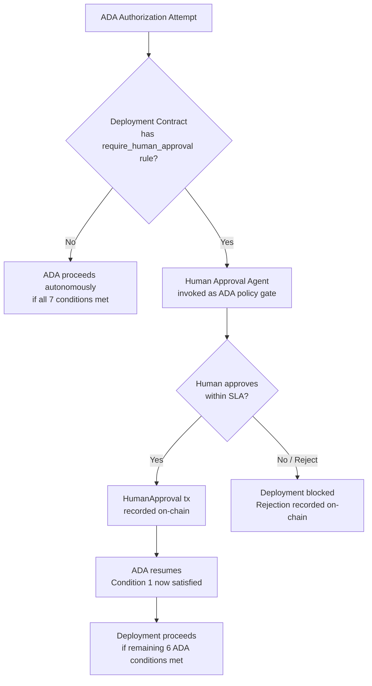
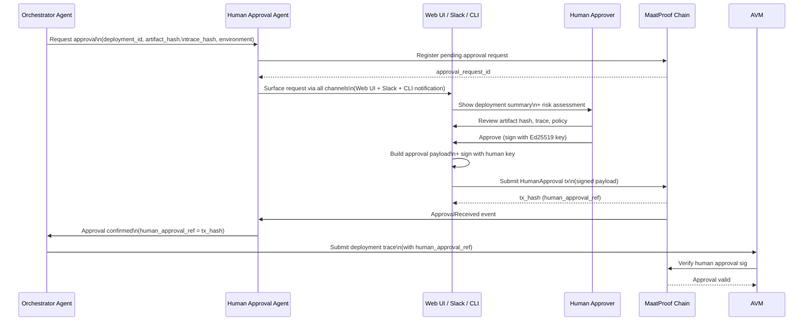

# Human Approval Agent — Specification

## Overview

The Human Approval Agent surfaces deployment requests to human key-holders and collects
cryptographic approval signatures. In the MaatProof protocol, human approval is a
**policy-configurable gate** — not a universal mandate.

The protocol default is the **Autonomous Deployment Authority (ADA)**. Human approval
is invoked only when a Deployment Contract declares a `require_human_approval` rule
(typically for regulated workloads, critical services, or first-time deployments).

When human approval is required, it is a **signed Ed25519 attestation** recorded on-chain
as a first-class policy gate — not a UI button click.

**Implementation**: Node.js (orchestrator integration layer)  
**Core authorization logic**: Rust (ADA conditions evaluated in AVM)  
**Interfaces**: Web UI, Slack/Teams bot, CLI  
**On-chain record**: `HumanApproval` transaction with Ed25519 signature  

---

## When Human Approval Is Triggered



Workloads that typically declare `require_human_approval`:
- Services classified as `CRITICAL` service tier
- First deployment to a new environment
- Regulated data processors (HIPAA, SOX, PCI-DSS)
- Deployments that change the Deployment Contract itself

---



---

## Approval Payload Structure

The human signs this structured payload (canonicalized JSON):

```json
{
  "type": "MaatHumanApproval",
  "version": "1",
  "deployment_id": "dep-8f3a2b1c",
  "artifact_hash": "sha256:a3f8b2c1...",
  "trace_hash": "sha256:def456...",
  "policy_ref": "0xDeployPolicyAddress",
  "policy_version": 3,
  "deploy_environment": "production",
  "requested_by": "did:maat:agent:xyz789abc",
  "approver_did": "did:maat:human:alice",
  "timestamp": "2025-01-15T14:30:00Z",
  "nonce": "550e8400-e29b-41d4-a716-446655440001"
}
```

The signature is over `sha256(canonicalize(payload))`.

---

## Interfaces

### Web UI

The web dashboard shows:
- Pending approval requests (sorted by urgency/environment)
- Deployment summary: what changed, who requested it, artifact hash
- Trace explorer: human-readable summary of agent reasoning steps
- Policy compliance status (coverage, CVEs, policy rules)
- One-click approve / reject (signs with browser-based key via WebCrypto API or hardware wallet)

### Slack / Teams Bot

```
🚀 *Production Deploy Request*
Requested by: AI Orchestrator Agent (did:maat:agent:xyz789abc)
Environment: production
Artifact: myapp:v2.4.1 (sha256:a3f8b2c1...)
Coverage: 87% ✅  CVEs: 0 ✅  Policy: v3 ✅

[Approve] [Reject] [View Trace]

Approval requires your Ed25519 signature.
Use /maat approve dep-8f3a2b1c or the web UI.
```

### CLI

```bash
# List pending approvals
maat approvals list

# Review a specific approval
maat approvals show dep-8f3a2b1c

# Approve (signs with local key or hardware wallet)
maat approvals approve dep-8f3a2b1c --key ./alice-key.json

# Reject with reason
maat approvals reject dep-8f3a2b1c --reason "Not ready for production"
```

---

## Node.js Implementation

```javascript
const { MaatClient, MaatIdentity } = require('@maatproof/sdk');
const { SlackBot } = require('@maatproof/integrations/slack');
const { WebServer } = require('@maatproof/ui');

class HumanApprovalAgent {
  constructor(config) {
    this.client = new MaatClient({ apiUrl: config.apiUrl });
    this.slack = new SlackBot(config.slack);
    this.web = new WebServer(config.webPort);
    this.pendingApprovals = new Map();
  }

  async requestApproval(deploymentRequest) {
    // Register pending approval on-chain
    const approvalReqId = await this.client.registerApprovalRequest(deploymentRequest);
    this.pendingApprovals.set(approvalReqId, deploymentRequest);

    // Notify all channels
    await Promise.all([
      this.slack.notifyApprovalRequired(deploymentRequest),
      this.web.showPendingApproval(deploymentRequest),
    ]);

    // Wait for approval (with timeout)
    return await this.waitForApproval(approvalReqId, deploymentRequest.expiresAt);
  }

  async submitApproval(approvalReqId, approverKey, decision) {
    const request = this.pendingApprovals.get(approvalReqId);
    const payload = this.buildApprovalPayload(request, approverKey.did, decision);
    const payloadHash = sha256(canonicalize(payload));
    const signature = approverKey.sign(payloadHash);

    const tx = await this.client.submitHumanApproval({
      ...payload,
      signature,
      decision,
    });

    return { tx_hash: tx.hash, decision };
  }
}
```

---

## Approval Expiry & Escalation

| Scenario | Behavior |
|---|---|
| No approval within 24 hours | Approval request expires; deployment blocked |
| First approver approves, second required | Wait for second approver (multi-sig policy) |
| Approver rejects | Deployment blocked; rejection reason recorded on-chain |
| Approver key compromised | On-chain key revocation invalidates pending approvals |

---

## On-Chain Record

Every approval (or rejection) is recorded on-chain via the `HumanApproval` contract:

```solidity
event ApprovalSubmitted(
    bytes32 indexed deploymentId,
    address indexed approver,
    string  approverDid,
    bool    approved,
    bytes32 payloadHash,
    bytes   signature,
    uint256 timestamp
);
```

This creates an immutable, auditable record of who authorized (or blocked) every production deployment.
