# Orchestrator Agent — Specification

## Overview

The Orchestrator Agent is the primary AI deployment agent in the MaatProof ecosystem. It coordinates the full ACI/ACD lifecycle: listening for code events, orchestrating test runs, deciding on staging deploys, requesting human approval for production, monitoring production metrics, and triggering rollbacks when needed.

**Implementation**: Node.js  
**Identity**: On-chain DID + Ed25519 keypair  
**SDK**: `@maatproof/sdk`  

---

## Responsibilities

| Responsibility | Description |
|---|---|
| **Event Listening** | Subscribe to CI events (push, PR merge, test completion) |
| **Test Orchestration** | Trigger test runs and collect coverage/CVE results |
| **Staging Deploy** | Propose staging deployments autonomously (within policy) |
| **Human Approval Request** | Surface production deployment requests to human approvers |
| **Production Deploy** | Submit production deployment proposals after human approval |
| **Metrics Monitoring** | Watch production metrics (error rate, latency, availability) |
| **Rollback** | Trigger rollback if metrics exceed alert thresholds |
| **Trace Recording** | Record all decisions and actions via AVM trace interface |

---

## State Machine

```mermaid
stateDiagram-v2
    [*] --> IDLE

    IDLE --> ANALYZING : Code event received\n(push / PR merge)

    ANALYZING --> TESTING : Kick off test suite

    TESTING --> POLICY_CHECK : Tests complete
    TESTING --> IDLE : Tests failed\n(no deployment)

    POLICY_CHECK --> STAGING_DEPLOY : Policy allows\nautonomous staging deploy

    POLICY_CHECK --> APPROVAL_PENDING : Policy requires\nhuman approval

    STAGING_DEPLOY --> STAGING_MONITORING : Staging deploy\nfinalized on-chain

    APPROVAL_PENDING --> PRODUCTION_DEPLOY : Human approval\nreceived (signed)
    APPROVAL_PENDING --> IDLE : Approval denied\nor timed out

    PRODUCTION_DEPLOY --> PRODUCTION_MONITORING : Production deploy\nfinalized on-chain
    PRODUCTION_DEPLOY --> IDLE : Deploy rejected\nby validators

    STAGING_MONITORING --> APPROVAL_PENDING : Staging healthy;\nproduction deploy ready
    STAGING_MONITORING --> IDLE : Staging unhealthy;\nno production deploy

    PRODUCTION_MONITORING --> IDLE : Metrics healthy

    PRODUCTION_MONITORING --> ROLLBACK_PENDING : Error rate spike\nor metric alert

    ROLLBACK_PENDING --> ROLLING_BACK : Rollback proposed\nand finalized

    ROLLING_BACK --> PRODUCTION_MONITORING : Rollback complete;\nmonitoring resumed

    ROLLBACK_PENDING --> IDLE : Rollback rejected\n(manual intervention required)
```



---

## MaatProof Chain Interactions

```javascript
const { MaatClient, MaatIdentity } = require('@maatproof/sdk');

class OrchestratorAgent {
  constructor(config) {
    this.identity = MaatIdentity.fromKeyFile(config.keyFile);
    this.client = new MaatClient({
      apiUrl: config.apiUrl,
      identity: this.identity,
    });
  }

  async proposeDeployment(artifact, traceActions, environment) {
    const policy = await this.client.getPolicy(this.config.policyRef);
    const trace = this.buildTrace(artifact, traceActions, policy, environment);
    const signed = this.identity.signTrace(trace);
    const result = await this.client.submitDeployment(signed);
    return result;
  }

  async requestHumanApproval(deploymentId, approvers) {
    // Submit approval request on-chain
    const request = {
      deployment_id: deploymentId,
      requested_approvers: approvers,
      expires_at: new Date(Date.now() + 24 * 60 * 60 * 1000).toISOString(),
    };
    return await this.client.requestApproval(request);
  }

  async monitorProduction(deploymentId, thresholds) {
    // Poll metrics; trigger rollback if threshold exceeded
    const metrics = await this.getProductionMetrics(deploymentId);
    if (metrics.errorRate > thresholds.maxErrorRate) {
      await this.triggerRollback(deploymentId, 'ERROR_RATE_SPIKE');
    }
  }

  async triggerRollback(deploymentId, reason) {
    const rollbackTrace = this.buildRollbackTrace(deploymentId, reason);
    const signed = this.identity.signTrace(rollbackTrace);
    return await this.client.submitDeployment(signed);
  }
}
```

---

## Event Sources

| Event | Source | Trigger |
|---|---|---|
| `code.pushed` | GitHub / GitLab webhook | New commit pushed to main |
| `pr.merged` | GitHub / GitLab webhook | PR merged to main |
| `tests.completed` | CI adapter | Test run finished |
| `staging.healthy` | Metrics API | Staging environment stable |
| `approval.received` | Human Approval Agent | Human signed approval |
| `metrics.alert` | Production monitor | Error/latency threshold exceeded |

---

## Trace Recording

Every agent decision is recorded as a `TraceAction` via the AVM trace interface:

```javascript
this.avm.recordAction({
  action_type: 'DECISION',
  input: { context: 'test_coverage=87, critical_cves=0, policy_version=3' },
  output: { decision: 'PROCEED_TO_STAGING', confidence: 0.95 },
});
```

This ensures the full reasoning chain is available for validator replay and compliance auditing.

---

## Configuration

```yaml
# orchestrator-config.yaml
agent:
  key_file: ./agent-key.json
  did: did:maat:agent:xyz789abc

maat_api:
  url: https://api.maatproof.dev
  policy_ref: "0xDeployPolicyAddress"

environments:
  staging:
    autonomous: true          # no human approval required
    min_coverage: 80
  production:
    autonomous: false         # always require human approval
    min_coverage: 80
    required_approvers:
      - alice@example.com
      - bob@example.com

monitoring:
  check_interval_seconds: 30
  thresholds:
    max_error_rate: 0.01       # 1%
    max_p99_latency_ms: 500
    min_availability: 0.999
```
