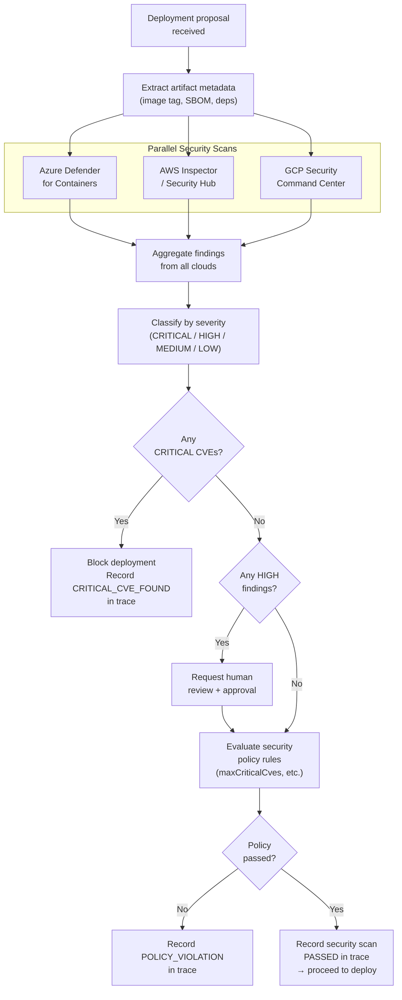

# Security Agent — Specification

## Overview

The Security Agent is a specialized MaatProof agent responsible for scanning deployment artifacts for vulnerabilities, checking against deployment contract security rules, flagging critical issues, and escalating to human approval when needed. It integrates with cloud-native security services across Azure, AWS, and GCP.

**Implementation**: Node.js  
**Identity**: On-chain DID + Ed25519 keypair  
**Integrations**: Azure Defender, AWS Security Hub, GCP Security Command Center  

---

## Responsibilities

| Responsibility | Description |
|---|---|
| **CVE Scanning** | Scan container images and dependencies for known CVEs |
| **Policy Rule Check** | Validate security findings against deployment contract security rules |
| **Severity Classification** | Classify findings as CRITICAL / HIGH / MEDIUM / LOW |
| **Block Critical Deployments** | Flag deployments with critical CVEs before they reach validators |
| **Escalate to Human** | Request human review for HIGH/CRITICAL findings |
| **Record Findings** | Append security scan results to the AVM reasoning trace |
| **SBOM Generation** | Produce Software Bill of Materials for compliance |

---

## Cloud Security Integrations

| Cloud | Service | Capability |
|---|---|---|
| **Azure** | Microsoft Defender for Containers | Container image CVE scanning |
| **AWS** | Amazon Inspector / Security Hub | ECR image scanning, aggregated findings |
| **GCP** | Security Command Center | Artifact Registry scanning, vulnerability findings |

The Security Agent queries all configured cloud providers and aggregates findings before evaluating policy rules.

---

## Security Scan Flow



---

## Node.js Implementation

```javascript
const { AzureDefender } = require('@maatproof/integrations/azure');
const { AWSInspector } = require('@maatproof/integrations/aws');
const { GCPSecurityCenter } = require('@maatproof/integrations/gcp');
const { MaatClient, MaatIdentity } = require('@maatproof/sdk');

class SecurityAgent {
  constructor(config) {
    this.identity = MaatIdentity.fromKeyFile(config.keyFile);
    this.client = new MaatClient({ apiUrl: config.apiUrl, identity: this.identity });
    this.scanners = [
      new AzureDefender(config.azure),
      new AWSInspector(config.aws),
      new GCPSecurityCenter(config.gcp),
    ];
  }

  async scan(deploymentProposal) {
    const { artifactRef, imageTag, sbom } = deploymentProposal;

    // Run all scanners in parallel
    const scanResults = await Promise.all(
      this.scanners.map(s => s.scan({ artifactRef, imageTag, sbom }))
    );

    // Aggregate and classify findings
    const findings = this.aggregate(scanResults);
    const critical = findings.filter(f => f.severity === 'CRITICAL');
    const high = findings.filter(f => f.severity === 'HIGH');

    // Record in trace
    await this.avm.recordAction({
      action_type: 'TOOL_CALL',
      input: { tool: 'security_scan', artifact: artifactRef },
      output: {
        total_findings: findings.length,
        critical: critical.length,
        high: high.length,
        cve_ids: findings.map(f => f.cveId),
      },
    });

    if (critical.length > 0) {
      return { passed: false, reason: 'CRITICAL_CVE_FOUND', findings: critical };
    }
    if (high.length > 0) {
      return { passed: true, requiresHumanReview: true, findings: high };
    }
    return { passed: true, requiresHumanReview: false, findings: [] };
  }
}
```

---

## Finding Schema

```json
{
  "finding_id": "CVE-2024-12345",
  "cve_id": "CVE-2024-12345",
  "severity": "CRITICAL",
  "cvss_score": 9.8,
  "package": "openssl",
  "affected_version": "1.1.1t",
  "fixed_version": "1.1.1w",
  "description": "Remote code execution via buffer overflow",
  "source": "azure-defender",
  "detected_at": "2025-01-15T14:31:00Z"
}
```

---

## Policy Integration

The Security Agent's findings feed directly into Deployment Contract rule evaluation:

| Finding | Policy Rule | Effect |
|---|---|---|
| CRITICAL CVE present | `maxCriticalCves = 0` | Deploy blocked |
| HIGH CVE present | `requireHumanApproval = true` | Escalated to human |
| SBOM missing | Custom rule | Deploy blocked |
| Unlicensed dependency | Custom rule | Deploy blocked |

---

## SBOM Generation

The Security Agent generates a CycloneDX-format SBOM for every deployment:

```javascript
const sbom = await this.sbomGenerator.generate(artifactRef);
const sbomHash = sha256(JSON.stringify(sbom));
// Record SBOM hash in trace for compliance
await this.avm.recordAction({
  action_type: 'TOOL_CALL',
  input: { tool: 'generate_sbom', artifact: artifactRef },
  output: { sbom_hash: sbomHash, component_count: sbom.components.length },
});
```

SBOM is stored on IPFS and the CID is recorded in the deployment trace for supply chain compliance.
