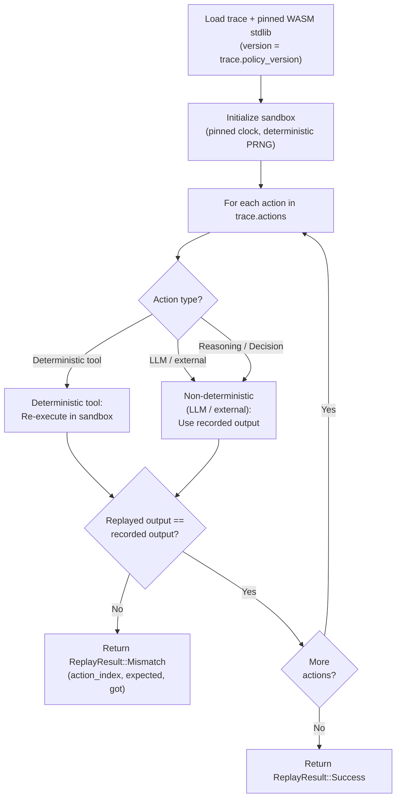

# AVM Deterministic Replay

## Overview

Deterministic replay is the core mechanism by which MaatProof validators independently verify that an agent's deployment trace is authentic and unmodified. The fundamental guarantee is: **given the same input trace, every AVM instance always produces the same output**.

**Language**: Rust  
**Sandbox**: WASM (wasmtime) with constrained stdlib  
**Non-determinism handling**: LLM outputs pinned to recorded values  

---

## Replay Guarantees

| Guarantee | Mechanism |
|---|---|
| Same input → same output | WASM sandbox with no I/O, no randomness, no system clock |
| LLM outputs are stable | Replay uses recorded outputs, not re-sampled |
| Tool results are verified | Deterministic tools (test runners) are re-executed and compared |
| No side effects | Sandbox is destroyed and recreated per trace |
| Cross-node consistency | All validators run the same WASM stdlib version |

---

## Non-Determinism Sources & Mitigations

### LLM Sampling

LLMs are inherently non-deterministic (temperature > 0 produces different outputs each run). MaatProof's solution:

- **Replay mode**: the WASM sandbox's LLM tool stub returns the **recorded** output from `action.output`, not a re-sampled LLM response
- **Reasoning steps** (`REASONING` actions) are verified by signature and hash — validators confirm the recording is authentic, not that they would get the same LLM output
- **Decision steps** (`DECISION` actions) produce deterministic outputs given recorded reasoning inputs

### System Clock

The sandbox stubs `std::time::SystemTime` and returns the trace's `timestamp` field. All time-dependent logic uses this pinned value.

### Randomness

The sandbox stubs `rand` with a deterministic PRNG seeded from `trace_id`. Any code path that requests randomness gets the same sequence on every replay.

### Network I/O

Network calls are fully stubbed — they return cached/recorded responses stored in `tool_calls[*].tool_output`. Re-executed tool calls (deterministic tools) are compared against this recorded output.

---

## Replay Algorithm

```rust
pub async fn replay_trace(
    trace: &DeploymentTrace,
    sandbox: &AvmSandbox,
    policy_client: &DeployPolicyClient,
) -> ReplayResult {
    // Load WASM module pinned to this protocol version
    let module_version = trace.policy_version;
    let wasm_module = load_stdlib_module(module_version);

    // Initialize sandbox with deterministic state
    let mut sb = sandbox.create_instance(
        wasm_module,
        DeterministicContext {
            pinned_timestamp: trace.timestamp,
            prng_seed:        derive_seed(&trace.trace_id),
        },
    );

    // Replay each action
    for (i, action) in trace.actions.iter().enumerate() {
        let replayed_output = match action.action_type {
            ActionType::ToolCall => {
                // Re-execute deterministic tools; use recorded for LLM/external
                if is_deterministic_tool(&action) {
                    sb.execute_tool(action).await?
                } else {
                    // Use recorded output (non-deterministic tool)
                    action.output.clone()
                }
            }
            ActionType::Reasoning | ActionType::Decision => {
                // LLM outputs: use recorded
                action.output.clone()
            }
            ActionType::ApprovalRequest => {
                action.output.clone()
            }
        };

        if replayed_output != action.output {
            return ReplayResult::Mismatch {
                action_index: i,
                action_id:    action.action_id.clone(),
                expected:     action.output.clone(),
                got:          replayed_output,
            };
        }
    }

    ReplayResult::Success
}

fn is_deterministic_tool(action: &TraceAction) -> bool {
    // Tools that produce the same output for the same input
    let deterministic_tools = ["run_test_suite", "hash_artifact", "verify_signature"];
    action.tool_calls.iter().any(|tc| {
        deterministic_tools.contains(&tc.tool_name.as_str())
    })
}
```

---

## Deterministic Tool Re-execution

For deterministic tools (test runners, hash functions, signature verification), the AVM re-executes the tool and compares the output to the recorded value. This provides stronger verification than simply trusting the recorded value.

| Tool | Re-executed? | Why |
|---|---|---|
| `run_test_suite` | ✅ | Test results are deterministic given same code + env |
| `hash_artifact` | ✅ | SHA-256 is deterministic |
| `verify_signature` | ✅ | Signature verification is deterministic |
| `security_scan` | ❌ | External service; use recorded result + signature |
| `call_llm` | ❌ | Non-deterministic; use recorded result |
| `notify_slack` | ❌ | Side effect; stubbed |

---

## Replay Flow Diagram



---

## Rust Implementation Notes

### WASM Stdlib Versioning

<!-- Addresses EDGE-ADA-034 -->

The WASM stdlib is versioned and content-addressed. Each protocol upgrade may introduce a new stdlib version. Validators MUST support all historic stdlib versions to replay older traces.

**Critical**: The implementation MUST NOT panic on unknown versions — this would crash the
validator node and prevent any trace replay. Instead, return a structured error:

```rust
#[derive(Debug, thiserror::Error)]
pub enum WasmStdlibError {
    #[error("Unknown WASM stdlib version {version}: node must be upgraded to replay this trace")]
    UnknownVersion { version: u32 },
    #[error("WASM stdlib version {version} has been removed after EOL date; contact DAO for archive")]
    VersionRetired { version: u32 },
}

pub fn load_stdlib_module(version: u32) -> Result<Vec<u8>, WasmStdlibError> {
    match version {
        1 => Ok(include_bytes!("../wasm/stdlib_v1.wasm").to_vec()),
        2 => Ok(include_bytes!("../wasm/stdlib_v2.wasm").to_vec()),
        3 => Ok(include_bytes!("../wasm/stdlib_v3.wasm").to_vec()),
        // When a node encounters an unknown version, it must not crash —
        // it should return an error and cast a DISPUTE vote (good-faith disagreement),
        // then download the stdlib from the on-chain stdlib registry.
        v => Err(WasmStdlibError::UnknownVersion { version: v }),
    }
}
```

### WASM Stdlib Upgrade Protocol

When a validator node encounters `WasmStdlibError::UnknownVersion`:

1. **Do not panic** — return `ReplayResult::StdlibMissing { version }` to the caller.
2. **Do not cast a REJECT vote** — the validator cannot distinguish between a tampered
   trace and a trace that needs a newer stdlib.
3. **Cast a `GoodFaithDisagreement` DISPUTE vote** citing `StdlibVersionUnknown`.
4. **Fetch the missing stdlib** from the on-chain stdlib registry (governance-controlled):
   ```rust
   let module = chain_client.fetch_stdlib_wasm(version).await?;
   // Verify content hash matches on-chain registry entry
   assert_eq!(sha256(&module), chain_client.get_stdlib_hash(version).await?);
   // Cache locally
   local_stdlib_cache.insert(version, module);
   ```
5. **Re-verify the trace** after downloading the stdlib.

The on-chain stdlib registry MUST be updated via governance vote before any new
protocol version is deployed to mainnet. A validator that cannot download the missing
stdlib within the `VERIFYING` phase timeout (20s) casts a `GoodFaithDisagreement`
dispute and the chain proceeds via governance resolution.

### IPFS Unavailability During Trace Validation

<!-- Addresses EDGE-ADA-033 -->

When validators attempt to fetch trace CIDs from IPFS and the IPFS network is
unavailable or the CID is unresolvable, the following protocol applies:

| Scenario | Validator Action |
|---|---|
| IPFS request times out (>10s) | Retry once via alternate IPFS gateway |
| IPFS CID not found after 2 retries | Cast `GoodFaithDisagreement` DISPUTE vote |
| IPFS fully unavailable (all gateways down) | Round moves to DISCARDED after VERIFYING timeout |
| CID found but hash mismatch | Cast REJECT vote with `EVIDENCE_HASH_MISMATCH` reason |

**Fallback gateways**: Validators MUST be configured with at least 3 IPFS gateways.
The AVM node config MUST include:

```toml
[ipfs]
gateways = [
  "https://ipfs.io/ipfs/",
  "https://cloudflare-ipfs.com/ipfs/",
  "https://gateway.pinata.cloud/ipfs/",
]
timeout_secs = 10
retry_count  = 2
```

When a trace cannot be verified due to IPFS unavailability (not due to validator
malice), the round is DISCARDED (not REJECTED). The agent may resubmit after IPFS
recovers. No stake is slashed for an IPFS-caused failure.

### Sandbox Lifecycle

A new sandbox instance is created per trace and destroyed after replay. This ensures no state leaks between trace verifications on the same validator node.

```rust
// Correct: create fresh sandbox per trace
let result = {
    let sandbox = AvmSandbox::new(wasm_module, context);
    sandbox.replay(&trace).await
};
// sandbox is dropped here; no state leak
```

### Timeout Enforcement

Each action replay has a maximum execution time of 10 seconds. If exceeded, the replay returns `ReplayResult::Timeout`, which the validator treats as a `REJECT` vote.

```rust
tokio::time::timeout(
    Duration::from_secs(10),
    sb.execute_tool(action),
).await
.unwrap_or(Err(SandboxError::Timeout))
```
