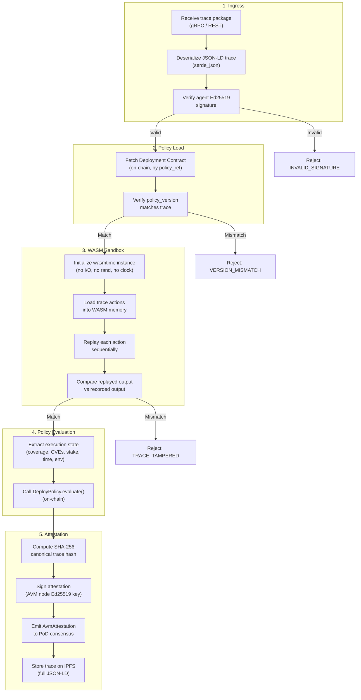

# AVM Execution Model

## Overview

The AVM (Agent Virtual Machine) execution model defines how agent reasoning traces are received, sandboxed, replayed, and attested. This document covers the complete execution lifecycle from trace ingestion to attestation emission.

**Language**: Rust  
**Sandbox**: WebAssembly (WASM) via `wasmtime`  
**Guarantees**: Deterministic execution, policy binding, identity attestation  

---

## Execution Lifecycle



---

## WASM Sandbox Properties

The execution sandbox enforces determinism by restricting the WASM module's capabilities:

| Capability | Allowed | Notes |
|---|---|---|
| Pure computation | ✅ | Math, string ops, logic |
| Deterministic stdlib | ✅ | Custom MaatProof stdlib |
| Network I/O | ❌ | Stubbed; returns error |
| Filesystem I/O | ❌ | Stubbed; returns error |
| System clock | ❌ | Stubbed; uses trace timestamp |
| PRNG / randomness | ❌ | Stubbed; trace-derived seed only |
| Multi-threading | ❌ | WASM threads disabled |
| SIMD | ❌ | Disabled for cross-platform determinism |

---

## Execution State

After replaying the trace, the AVM extracts an `ExecutionState` that is passed to policy evaluation:

```rust
#[derive(Debug)]
pub struct ExecutionState {
    pub test_coverage:       u8,      // percent
    pub critical_cves:       u8,
    pub high_cves:           u8,
    pub agent_stake:         u128,    // $MAAT in wei
    pub deploy_hour_utc:     u8,
    pub deploy_day_of_week:  u8,      // 0=Sun … 6=Sat
    pub human_approval_ref:  Option<String>,
    pub sbom_present:        bool,
    pub deploy_environment:  String,
}
```

These values are extracted from the recorded `TraceAction` outputs during replay.

---

## Lifecycle Phases

### Phase 1: Ingress

The AVM listens on a gRPC port for incoming `DeploymentProposal` messages from the PoD consensus leader. Upon receipt:

1. Deserialize the `trace_package` bytes as a `DeploymentTrace` (JSON-LD)
2. Verify that the agent's DID is registered on-chain
3. Verify the Ed25519 signature: `verify(agent_pubkey, trace_hash, trace.signature)`

Reject immediately if signature is invalid — do not proceed to sandbox.

### Phase 2: Policy Load

1. Query `DeployPolicy(policy_ref).policyVersion()` from the chain
2. Compare with `trace.policy_version` — reject if they differ
3. Fetch the full `PolicyRules` struct for evaluation in Phase 4

### Phase 3: WASM Sandbox

1. Initialize a `wasmtime::Store` with restricted imports
2. Serialize the trace actions as WASM memory-mapped input
3. For each action in order:
   - Execute the action in the sandbox
   - Compare output to `trace.actions[i].output`
   - If mismatch: reject with `TRACE_TAMPERED`, include action index and delta
4. If all actions match: proceed to Phase 4

### Phase 4: Policy Evaluation

1. Extract `ExecutionState` from trace action outputs
2. Call on-chain `DeployPolicy.evaluate()` with extracted state
3. Collect `(passed, failReason)` return values
4. If policy fails: attestation is emitted with `PolicyResult::Fail` — PoD validators receive a `REJECT` recommendation

### Phase 5: Attestation

1. Compute `trace_hash = sha256(canonical_json(trace, exclude_signature))`
2. Build `AvmAttestation` struct
3. Sign attestation with AVM node's Ed25519 key
4. Emit attestation to PoD consensus via gRPC
5. Store full trace on IPFS (content-addressed; CID recorded in attestation)

---

## Error Handling

| Error | Phase | Response |
|---|---|---|
| `INVALID_SIGNATURE` | Phase 1 | Reject immediately; log; increment invalid_sig counter |
| `VERSION_MISMATCH` | Phase 2 | Reject; agent should re-query policy and resubmit |
| `TRACE_TAMPERED` | Phase 3 | Reject; flag as potential security event; whistleblower can submit evidence |
| `POLICY_VIOLATION` | Phase 4 | Emit attestation with `PolicyResult::Fail`; not a slashable event |
| `SANDBOX_TIMEOUT` | Phase 3 | Reject; trace replay exceeded 10s per action |
| `CHAIN_UNREACHABLE` | Phase 2/4 | Pause; retry with backoff; alert operator |
