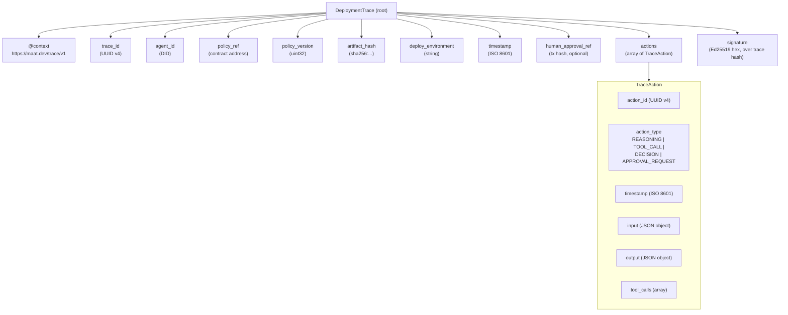

# AVM Trace Format Specification

## Overview

Agent reasoning traces are serialized in **JSON-LD** format using the MaatProof trace context. The trace format captures every step of an agent's decision-making process in a structured, hashable, replayable form.

**Format**: JSON-LD  
**Context URL**: `https://maat.dev/trace/v1`  
**Hashing**: SHA-256 over canonical JSON (BTreeMap sorted keys, signature excluded)  
**Storage**: IPFS (content-addressed); CID recorded in finalized block  

---

## Top-Level Trace Structure



---

## Complete Trace Example

```json
{
  "@context": "https://maat.dev/trace/v1",
  "trace_id": "550e8400-e29b-41d4-a716-446655440000",
  "agent_id": "did:maat:agent:xyz789abc",
  "policy_ref": "0xDeployPolicyContractAddress",
  "policy_version": 3,
  "artifact_hash": "sha256:a3f8b2c1d4e5f6a7b8c9d0e1f2a3b4c5d6e7f8a9b0c1d2e3f4a5b6c7d8e9f0a1",
  "deploy_environment": "production",
  "timestamp": "2025-01-15T14:32:00Z",
  "human_approval_ref": "0x9f8e7d6c5b4a3f2e1d0c9b8a7f6e5d4c3b2a1f0e",
  "actions": [
    {
      "action_id": "act-001",
      "action_type": "REASONING",
      "timestamp": "2025-01-15T14:31:40Z",
      "input": {
        "prompt": "Analyze build artifacts and test results for production deployment readiness"
      },
      "output": {
        "reasoning": "Build completed successfully. Test suite passed 142/142. Coverage at 87%. No critical CVEs found by security scan. Policy v3 requires 80% coverage and 0 critical CVEs — both satisfied.",
        "next_step": "PROCEED_TO_SECURITY_SCAN"
      },
      "tool_calls": []
    },
    {
      "action_id": "act-002",
      "action_type": "TOOL_CALL",
      "timestamp": "2025-01-15T14:31:45Z",
      "input": {
        "tool": "run_test_suite",
        "args": { "suite": "integration", "environment": "ci" }
      },
      "output": {
        "passed": 142,
        "failed": 0,
        "coverage_percent": 87,
        "duration_ms": 42300
      },
      "tool_calls": [
        {
          "tool_name": "run_test_suite",
          "tool_input": { "suite": "integration", "environment": "ci" },
          "tool_output": { "passed": 142, "failed": 0, "coverage_percent": 87 },
          "duration_ms": 42300
        }
      ]
    },
    {
      "action_id": "act-003",
      "action_type": "TOOL_CALL",
      "timestamp": "2025-01-15T14:31:50Z",
      "input": {
        "tool": "security_scan",
        "args": { "image": "myapp:v2.4.1", "sbom": true }
      },
      "output": {
        "critical_cves": 0,
        "high_cves": 0,
        "medium_cves": 2,
        "sbom_cid": "bafybeigdyrzt5sfp7udm7hu76uh7y26nf3efuylqabf3oclgtqy55fbzdi"
      },
      "tool_calls": [
        {
          "tool_name": "security_scan",
          "tool_input": { "image": "myapp:v2.4.1" },
          "tool_output": { "critical_cves": 0, "high_cves": 0, "medium_cves": 2 },
          "duration_ms": 8100
        }
      ]
    },
    {
      "action_id": "act-004",
      "action_type": "DECISION",
      "timestamp": "2025-01-15T14:31:55Z",
      "input": {
        "context": "coverage=87%, critical_cves=0, high_cves=0, policy_version=3, human_approval_ref=0x9f8e7d..."
      },
      "output": {
        "decision": "PROCEED_TO_PRODUCTION_DEPLOY",
        "confidence": 0.97,
        "reasoning": "All policy rules satisfied. Human approval confirmed on-chain."
      },
      "tool_calls": []
    }
  ],
  "signature": "a1b2c3d4e5f6a7b8c9d0e1f2a3b4c5d6e7f8a9b0c1d2e3f4a5b6c7d8e9f0a1b2c3d4e5f6a7b8c9d0e1f2a3b4c5d6e7f8a9b0c1d2e3f4a5b6c7d8e9f0a1b2c3"
}
```

---

## Action Types

| Type | When Used | Key Output Fields |
|---|---|---|
| `REASONING` | Agent thinks through a decision | `reasoning` (text), `next_step` |
| `TOOL_CALL` | Agent invokes a tool (tests, scan, deploy) | Tool-specific JSON |
| `DECISION` | Agent makes a deterministic decision | `decision` (enum), `confidence`, `reasoning` |
| `APPROVAL_REQUEST` | Agent requests human approval | `approval_request_id`, `urgency` |
| `POLICY_CHECK` | Agent queries/checks policy rules | `policy_ref`, `policy_version`, `result` |

---

## Hashing Algorithm

The canonical trace hash is computed by:

1. Serialize trace to JSON
2. Remove the `signature` field
3. Re-serialize with **lexicographically sorted keys** (BTreeMap)
4. Compute SHA-256 over the UTF-8 bytes of the canonical JSON string

```rust
pub fn canonical_trace_hash(trace: &DeploymentTrace) -> String {
    use std::collections::BTreeMap;
    use sha2::{Sha256, Digest};

    // Convert to serde_json::Value, remove signature, sort keys
    let mut value = serde_json::to_value(trace).unwrap();
    value.as_object_mut().unwrap().remove("signature");
    let sorted: BTreeMap<_, _> =
        serde_json::from_value::<std::collections::HashMap<String, serde_json::Value>>(value)
        .unwrap()
        .into_iter()
        .collect();
    let canonical = serde_json::to_string(&sorted).unwrap();

    let hash = Sha256::digest(canonical.as_bytes());
    format!("sha256:{}", hex::encode(hash))
}
```

---

## IPFS Storage

After the AVM emits an attestation, the full trace is stored on IPFS:

```rust
pub async fn store_trace_on_ipfs(trace: &DeploymentTrace) -> String {
    let trace_bytes = serde_json::to_vec(trace).unwrap();
    let cid = ipfs_client.add(trace_bytes).await.unwrap();
    cid.to_string()  // e.g., "bafybeigdyrzt5sfp7udm7hu76uh7y26nf3efuylqabf3oclgtqy55fbzdi"
}
```

The CID is content-addressed — it is cryptographically derived from the trace content. If anyone modifies the trace, the CID changes, making tampering detectable.
