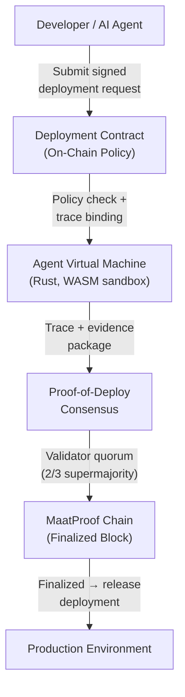
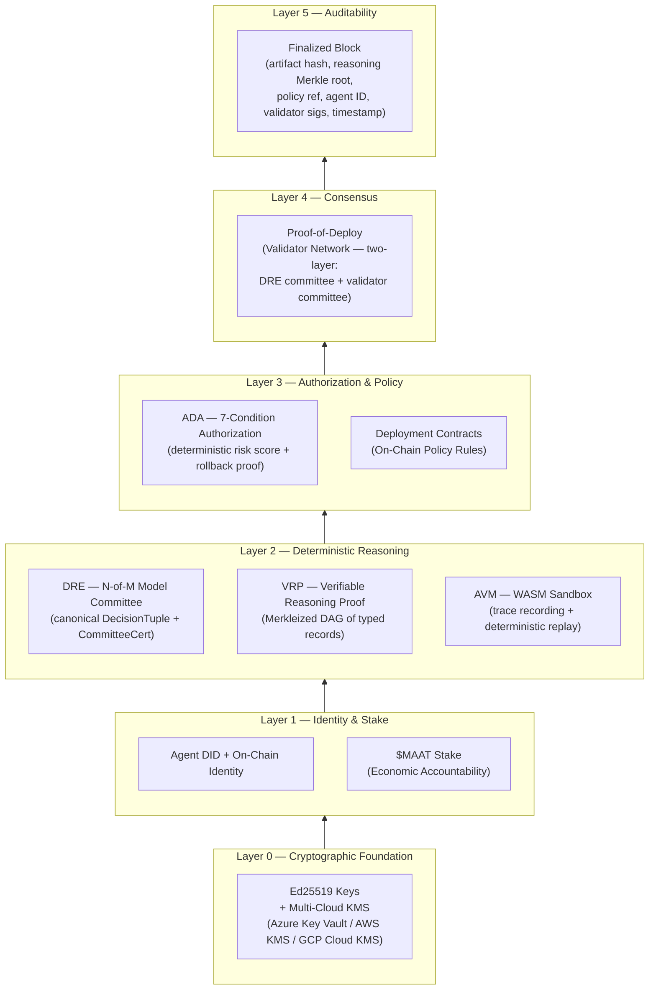

# MaatProof: Overview

## The Problem

### CI/CD Was Built for Humans

Modern CI/CD pipelines — GitHub Actions, GitLab CI, Jenkins — were designed with a fundamental assumption: a human engineer reviews, approves, and is ultimately accountable for every production deployment. The tooling reflects this: merge queues, code review requirements, manual approval gates.

That assumption is breaking down.

AI agents now write code, open pull requests, interpret test results, and propose deployments — sometimes faster than any human can review. The pipeline tooling has not caught up. There is no standard mechanism for:

- Cryptographically proving *which agent* proposed a deployment
- Recording *why* the agent decided to deploy (the reasoning trace)
- Enforcing *policy rules* that are auditable and tamper-proof
- Providing economic accountability when an agent makes a harmful deployment

### The Trust Gap

When an AI agent deploys to production, who is accountable? Today the answer is: no one and everyone. The agent has no on-chain identity. Its reasoning is ephemeral. The deployment pipeline has no concept of "agent stake." If something goes wrong, there is no cryptographic chain of custody from decision to damage.

This is the trust gap.

### The Auditability Crisis

Regulated industries — healthcare, finance, critical infrastructure — are already subject to audit requirements for software deployments (SOX, HIPAA, SOC2). As AI agents become deployment actors, regulators are asking: *show me the audit trail for every production change made by an AI.* Today's CI/CD systems cannot answer that question. Logs are mutable. Reasoning is unrecorded. Agent identity is informal.

---

## The Vision: Ethereum for ACI/ACD

MaatProof is a **Layer 1 blockchain purpose-built for Agent-Continuous Integration and Deployment (ACI/ACD)**.

Just as Ethereum made financial contracts programmable and verifiable, MaatProof makes **deployment policy** programmable and verifiable. Every deployment is:

- Governed by an **on-chain Deployment Contract** (the ACI/ACD equivalent of `.github/workflows`)
- Executed by a **cryptographically identified agent**
- Traced by the **Agent Virtual Machine (AVM)**
- Verified by a **Proof-of-Deploy (PoD)** validator network
- Finalized as an **immutable block** on the MaatProof chain

The protocol default is: **agent proposes, proof authorizes, chain records, runtime guard can reverse.** Human approval is a policy-configurable gate — one possible rule in a Deployment Contract — not a protocol-level mandate.

---

## How MaatProof Solves It

| Problem | MaatProof Solution |
|---|---|
| No agent identity | Ed25519 on-chain identity + DID |
| No reasoning record | AVM trace recording + VRP (IPFS-anchored) |
| Non-deterministic LLM reasoning | DRE: N-of-M model committee → canonical DecisionTuple |
| No tamper-proof policy | Deployment Contracts (Solidity on-chain) |
| No economic accountability | $MAAT staking + slashing |
| Unverifiable deployment decisions | ADA: 7-condition authorization + deterministic risk score |
| No audit trail | Immutable finalized blocks |
| Mutable CI logs | Reasoning Merkle root + artifact hash on-chain |
| Human approval (when required) | Signed Ed25519 attestation on-chain — a policy gate, not a mandate |

### Architecture Flow

---

## The Trust Stack

---

## Key Concepts

**Deployment Contract** — An on-chain Solidity smart contract encoding deployment policy rules (e.g., `no_friday_deploys`, `test_coverage_gate ≥ 80`, `no_known_cves`, `agent_stake_minimum ≥ 1000 $MAAT`, and optionally `require_human_approval: stage == PRODUCTION`). The direct on-chain analogue of a CI/CD workflow file — but tamper-proof and validator-attested.

**Agent Virtual Machine (AVM)** — A Rust-based WASM sandbox that executes and records agent reasoning traces deterministically. Produces a signed evidence package (including the VRP Merkle root) that validators can replay.

**Deterministic Reasoning Engine (DRE)** — Sends a canonical PromptBundle to an N-of-M model committee, normalizes outputs to a `DecisionTuple`, checks convergence, and emits a `CommitteeCertificate`. Determinism is a system property, not a per-LLM-call property.

**Verifiable Reasoning Proof (VRP)** — A Merkleized DAG of typed reasoning records (premises, inference rule, evidence refs, conclusion, checker ID). Enables selective disclosure and checker-registry verification without replaying the full trace.

**Autonomous Deployment Authority (ADA)** — Evaluates 7 mandatory conditions and computes a deterministic risk score over: change size, scan severity, historical rollback rate, committee agreement %, validator agreement %, and service criticality. Rollback is a first-class trust protocol, not an error state.

**Proof-of-Deploy (PoD)** — MaatProof's two-layer consensus mechanism. Layer 1: DRE model committee converges on a canonical decision. Layer 2: Validator committee verifies the reasoning Merkle root, ADA conditions, and policy compliance. Honest attestation is rewarded; equivocation and invalid attestation are slashed.

**$MAAT Token** — The protocol's unit of economic accountability. Agents stake $MAAT to earn deploy rights. Validators earn $MAAT for honest attestation. Slashing destroys stake for policy violations.

**Human Approval** — A signed Ed25519 attestation by a human key-holder, recorded on-chain. Available as an optional `require_human_approval: stage == PRODUCTION` policy rule in Deployment Contracts. A cryptographic proof of human authorization when required by policy — not a protocol-level mandate.
