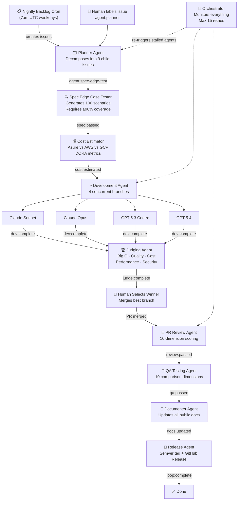

# Architecture

## High-Level Flow

1. Agent proposes deployment
2. AVM executes reasoning trace
3. Validators replay and verify
4. Consensus finalizes deployment
5. Production system unlocks deploy

## Agentic AI Loop Architecture

The repository uses a label-driven agentic loop where GitHub Issues flow through a sequence of AI agents, each gated by status labels.



## Label-Driven State Machine

Each agent adds a status label when it completes, which gates the next agent:

```
agent:planner → agent:spec-edge-test → spec:passed
→ agent:cost-estimator → cost:estimated
→ agent:developer → dev:complete
→ agent:judge → judge:complete
→ (human merges) → review:passed
→ qa:passed → agent:documenter → docs:updated
→ agent:release → loop:complete
```

## Components

### 1. Agent
- Generates reasoning trace
- Signs identity
- Stakes $MAAT

### 2. AVM
- Executes trace
- Produces deterministic output
- Validates against policy

### 3. Validators
- Re-run trace
- Vote on validity

### 4. Chain
- Stores:
  - Trace hash
  - Artifact hash
  - Policy reference
  - Signatures

### 5. Production Gate
- Only deploys if chain approves
