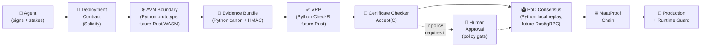
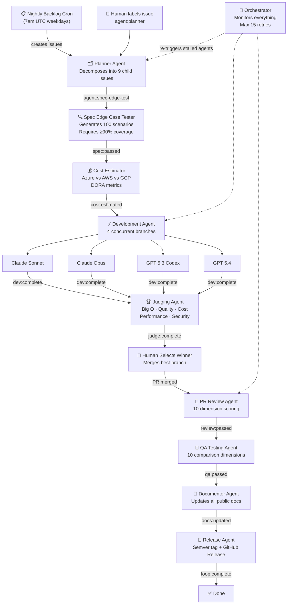
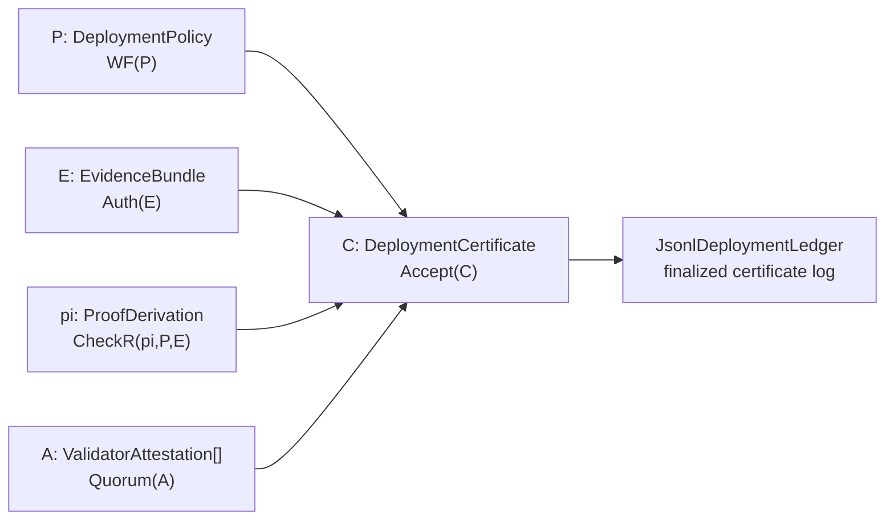

# Architecture

## High-Level Flow



1. Agent proposes deployment with signed identity and staked $MAAT
2. Deployment Contract encodes on-chain policy rules
3. AVM boundary captures externally observable tool traces as typed evidence
4. Evidence bundle canonicalization signs and authenticates `E`
5. VRP checks admissible derivation `pi` with deterministic Python `CheckR`
6. Certificate checker evaluates `Accept(C) = WF(P) && Auth(E) && CheckR(pi,P,E) && Quorum(A)`
7. Proof-of-Deploy Consensus: validators replay and attest locally in Python, with Rust/gRPC planned for production
8. Finalized block written on-chain with full audit record
9. Production Gate unlocks; Runtime Guard monitors with auto-rollback

## Agentic AI Loop Architecture

The repository uses a label-driven agentic loop where GitHub Issues flow through a sequence of AI agents, each gated by status labels.



## Label-Driven State Machine

Each agent adds a status label when it completes, which gates the next agent:

```
agent:planner → agent:spec-edge-test → spec:passed
→ agent:cost-estimator → cost:estimated
→ agent:developer → dev:complete
→ agent:judge → judge:complete
→ (human merges) → review:passed
→ qa:passed → agent:documenter → docs:updated
→ agent:release → loop:complete
```

## Components

**Tech stack:** Python reference prototype (`maatproof.policy`, `maatproof.evidence`, `maatproof.vrp`, `maatproof.pod`, `maatproof.certificate`, `maatproof.ledger`, `maatproof.avm`) · Rust/WASM planned for production AVM/VRP/DRE/consensus hardening · Node.js planned for orchestrator integrations · Solidity for on-chain contracts and incentives

## Python Proof-of-Deploy Reference Prototype

The repository now includes an executable Python implementation of the formal certificate model from the Proof-Carrying Deployment paper:



| Formal term | Python implementation | Responsibility |
|---|---|---|
| `P` | `maatproof.policy.DeploymentPolicy` | Policy predicates, environment binding, optional human-attestation rule, and `WF(P)` |
| `E` | `maatproof.evidence.EvidenceBundle` | Signed evidence objects, canonical ordering, freshness/dependency checks, and `Auth(E)` |
| `pi` | `maatproof.vrp.ProofDerivation` | Typed admissible proof steps and deterministic `CheckR(pi, P, E)` |
| `A` | `maatproof.pod.ValidatorAttestation` | Validator signatures, accept/reject/dispute decisions, and quorum finality |
| `C` | `maatproof.certificate.DeploymentCertificate` | Certificate digest and top-level `Accept(C)` report |
| Ledger | `maatproof.ledger.JsonlDeploymentLedger` | Append-only local record and replay verification |
| AVM boundary | `maatproof.avm.DeploymentTrace` | Trace-to-evidence conversion without private model chain-of-thought |

The prototype intentionally uses HMAC-SHA256 to keep the Colab and test environment dependency-free. Ed25519 and post-quantum signature providers remain production-hardening adapters rather than certificate-validity changes.

### 1. Agent
- Proposes deployment with signed identity (`did:maat:agent:<hex>`)
- Stakes $MAAT as economic collateral
- Emits reasoning trace (JSON-LD, IPFS-stored)

### 2. Deployment Contract (Solidity)
- Encodes policy as on-chain rules (`no_friday_deploys`, `coverage >= 80`, etc.)
- Optional `require_human_approval` rule for regulated workloads
- Immutable per version; governance vote required to change

### 3. AVM — Agent Virtual Machine (Rust / WASM)
- Executes and records agent reasoning trace in a sandboxed `wasmtime` instance
- No I/O, no clock, no randomness — deterministic by construction
- Verifies Ed25519 agent signature before replay begins

### 4. DRE — Deterministic Reasoning Engine (Rust)
- Builds content-addressed `PromptBundle` from all deployment context
- Executes N-of-M model committee in parallel isolation
- Normalizes outputs into a `DecisionTuple`; checks convergence
- Emits `CommitteeCertificate` when quorum is achieved
- See [`specs/dre-spec.md`](../specs/dre-spec.md)

### 5. VRP — Verifiable Reasoning Protocol (Rust)
- Compiles reasoning steps into typed `ReasoningRecord` entries
- Separates **admissible** (machine-checkable) from **informational** (narrative) reasoning
- Commits the full package as a Merkleized DAG
- Only admissible steps may authorize a production deployment
- See [`specs/vrp-spec.md`](../specs/vrp-spec.md)

### 6. ADA — Autonomous Deployment Authority (Rust)
- Protocol default for production authorization (replaces mandatory human approval)
- Verifies all 7 conditions: policy gates, DRE quorum, VRP checkers, validator consensus, risk score, security clearance, runtime guard
- Emits signed `AdaAuthorization` stored on-chain
- Human approval remains available as a policy-declared gate
- See [`specs/ada-spec.md`](../specs/ada-spec.md)

### 7. Proof-of-Reasoning Consensus (Rust)
- Validators receive `PromptBundle`, `EvidenceBundle`, reasoning Merkle root, and `CommitteeCertificate`
- Independently reconstruct the policy result vector using pinned deterministic checkers
- Vote `ACCEPT` / `REJECT` / `DISPUTE` — 2/3 stake-weighted supermajority required
- Disagreement enters a dispute path; slashing only on proven malicious attestation

### 8. MaatProof Chain
- Stores finalized `MaatBlock`: artifact hash, reasoning root, policy ref, ADA authorization, validator signatures, timestamp
- Append-only institutional memory of every deployment decision
- See [`docs/02-consensus-proof-of-deploy.md`](02-consensus-proof-of-deploy.md)

### 9. Production Gate
- Unlocks only on finalized chain block
- Runtime Guard monitors metrics; triggers rollback proof on threshold violation
- Rollback is a first-class protocol event, not an operational afterthought
