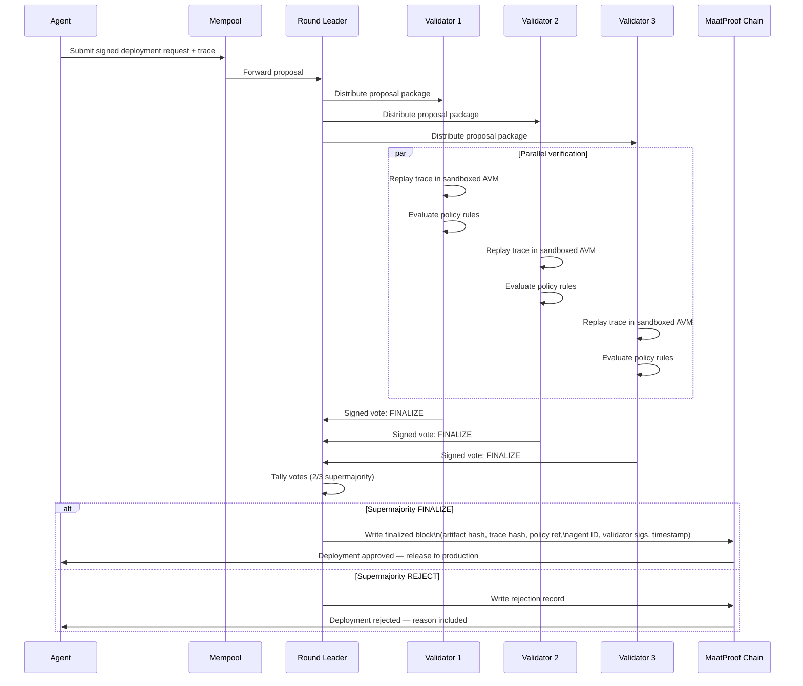

# Proof-of-Deploy (PoD) Consensus

## Overview

Proof-of-Deploy (PoD) is MaatProof's purpose-built consensus mechanism for verifying AI agent deployments. Unlike Proof-of-Work (energy expenditure) or Proof-of-Stake (capital weight), PoD validators perform **useful work**: they replay agent reasoning traces in sandboxed AVMs and certify that a deployment is policy-compliant before it reaches production.

---

## Validator Role

Validators are staked network participants who:

1. Receive deployment proposals (trace + evidence package)
2. Replay the agent's reasoning trace in a sandboxed AVM instance
3. Evaluate the trace against the referenced Deployment Contract
4. Vote to **finalize** (approve) or **reject** the deployment
5. Earn $MAAT rewards for honest, timely attestation
6. Risk $MAAT slash for malicious or negligent attestation

---

## Round Lifecycle

Each deployment proposal progresses through a consensus round:

| Phase | Description |
|---|---|
| **Propose** | Agent submits signed deployment request + trace evidence to the mempool |
| **Distribute** | Round leader distributes proposal to the validator set |
| **Verify** | Each validator replays the trace in a local sandboxed AVM |
| **Policy Check** | Validator evaluates trace output against Deployment Contract rules |
| **Vote** | Validator submits signed vote: `FINALIZE` or `REJECT` with reason |
| **Tally** | Round leader tallies votes; 2/3 supermajority required |
| **Finalize/Reject** | Block is written (finalize) or proposal is discarded with rejection record |

### Sequence Diagram



---

## Finalized Block Contents

Each finalized block stores:

```json
{
  "block_height": 1042301,
  "artifact_hash": "sha256:abc123...",
  "trace_hash": "sha256:def456...",
  "policy_ref": "0xDeployPolicyContractAddress",
  "policy_version": 3,
  "agent_id": "did:maat:agent:xyz789",
  "validator_signatures": [
    { "validator": "did:maat:validator:v1", "sig": "ed25519:..." },
    { "validator": "did:maat:validator:v2", "sig": "ed25519:..." },
    { "validator": "did:maat:validator:v3", "sig": "ed25519:..." }
  ],
  "timestamp": "2025-01-15T14:32:00Z",
  "deploy_environment": "production",
  "human_approval_ref": "0xApprovalTxHash"
}
```

---

## Economic Model

### Validator Rewards

Validators earn $MAAT for every finalized block in which their attestation is included. Reward formula:

```
block_reward = BASE_BLOCK_REWARD * (validator_stake / total_validator_stake)
```

Rewards are distributed at block finalization. Validators who are offline or miss votes receive no reward for that round.

### Slashing Conditions

| Condition | Slash Amount |
|---|---|
| Double-vote (equivocation) | 100% of validator stake |
| Attesting a provably invalid trace | 50% of validator stake |
| Colluding to approve policy-violating deployment | 100% of validator stake |
| Chronic liveness failure (>10% missed rounds) | 5% of validator stake |

Slashed funds are distributed: 50% burned (deflationary), 25% to the whistleblower/reporter, 25% to the DAO treasury.

### Staking Requirements

| Role | Minimum Stake |
|---|---|
| Validator | 100,000 $MAAT |
| Agent (basic deploy) | 1,000 $MAAT |
| Agent (production deploy) | 10,000 $MAAT |

---

## Quorum & Finality

- **Validator set size**: configurable per deployment environment (minimum 4 validators)
- **Quorum**: 2/3 supermajority of active validators must vote `FINALIZE`
- **Finality**: Byzantine fault tolerant — tolerates up to 1/3 malicious validators
- **Round timeout**: 30 seconds per phase; proposal discarded if timeout exceeded
- **Deterministic finality**: once 2/3 supermajority is reached, the block is final — no forks

---

## Policy Enforcement

Validators do not make subjective deployment decisions. They verify objective, deterministic policy rules encoded in Deployment Contracts:

1. **Trace replay matches recorded output** — deterministic AVM re-execution
2. **All policy rules evaluate to `true`** — checked against the on-chain contract
3. **Agent identity is valid and sufficiently staked** — verified against on-chain identity
4. **Human approval present** (if required by policy) — verified on-chain signature
5. **Artifact hash matches** — hash of deployment artifact matches trace record

A single failed check causes the validator to vote `REJECT`.
