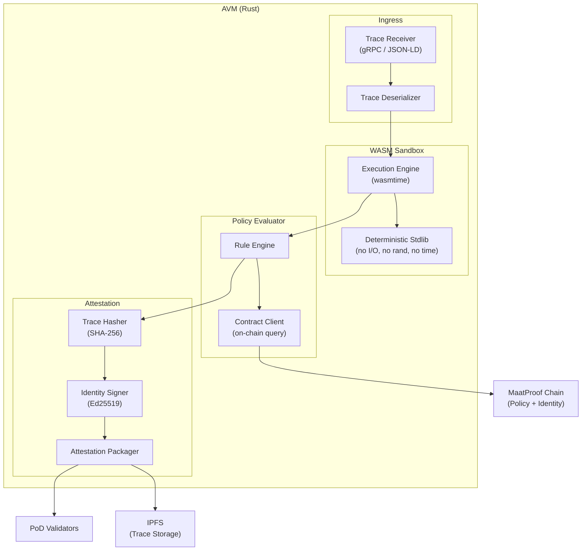
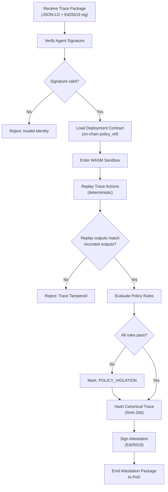

# Agent Virtual Machine (AVM)

## Overview

The Agent Virtual Machine (AVM) is the execution engine at the heart of MaatProof. It receives an agent's reasoning trace, executes it deterministically in a sandboxed environment, evaluates the result against the referenced Deployment Contract, and produces a signed attestation package for the PoD validator network.

The AVM is implemented in **Rust** and uses a **WebAssembly (WASM) sandbox** to ensure isolation and deterministic execution across validator nodes.

---

## Core Properties

| Property | Description |
|---|---|
| **Trace Recording** | Every agent action (tool call, reasoning step, decision) is recorded as a structured trace entry |
| **Deterministic Replay** | Given the same input trace, the AVM always produces the same output — enabling validator re-execution |
| **Policy Binding** | Each execution is bound to a specific Deployment Contract version; policy evaluation is part of the execution lifecycle |
| **Identity Attestation** | The AVM signs its output with the agent's Ed25519 key; validators verify this signature before replay |
| **Sandboxed Isolation** | The WASM sandbox prevents side effects, network calls, and non-deterministic operations during replay |

---

## Component Architecture



---

## Execution Lifecycle

1. **Receive**: AVM receives signed trace package from agent (via gRPC or REST)
2. **Deserialize**: Trace is deserialized from JSON-LD format into internal representation
3. **Validate Signature**: Agent's Ed25519 signature over the trace is verified
4. **Load Policy**: Deployment Contract is fetched from on-chain using the `policy_ref` in the trace
5. **Enter Sandbox**: Trace is loaded into WASM sandbox; non-deterministic operations are stubbed
6. **Replay Actions**: Each trace action is re-executed sequentially; outputs are compared to recorded outputs
7. **Evaluate Policy**: Policy rules are evaluated against execution state (coverage %, CVEs, environment, etc.)
8. **Hash Trace**: SHA-256 is computed over the canonical serialization of the full trace
9. **Sign Attestation**: AVM signs the attestation package with the node's Ed25519 key
10. **Emit**: Attestation package (trace hash, policy result, signatures) is emitted to PoD consensus

---

## AVM Execution Flow



---

## Rust Implementation Notes

The AVM is built with the following Rust crates:

- `wasmtime` — WASM sandbox runtime
- `ed25519-dalek` — Ed25519 keypair operations
- `sha2` — SHA-256 trace hashing
- `serde` / `serde_json` — JSON-LD trace serialization
- `tonic` — gRPC server/client
- `tokio` — async runtime

### Core Data Structures

```rust
/// A single action recorded in the agent's reasoning trace
#[derive(Serialize, Deserialize, Clone, Debug)]
pub struct TraceAction {
    pub action_id: String,
    pub action_type: ActionType,
    pub timestamp: DateTime<Utc>,
    pub input: serde_json::Value,
    pub output: serde_json::Value,
    pub tool_calls: Vec<ToolCall>,
}

/// Full reasoning trace for a deployment
#[derive(Serialize, Deserialize, Clone, Debug)]
pub struct DeploymentTrace {
    pub trace_id: String,
    pub agent_id: String,               // DID
    pub policy_ref: String,             // contract address
    pub policy_version: u32,
    pub artifact_hash: String,          // sha256 of deployment artifact
    pub actions: Vec<TraceAction>,
    pub timestamp: DateTime<Utc>,
    pub signature: Ed25519Signature,
}

/// Output of AVM execution
#[derive(Serialize, Deserialize, Clone, Debug)]
pub struct AvmAttestation {
    pub trace_hash: String,             // sha256 of canonical trace
    pub policy_result: PolicyResult,
    pub policy_ref: String,
    pub policy_version: u32,
    pub agent_id: String,
    pub avm_node_id: String,
    pub avm_signature: Ed25519Signature,
    pub timestamp: DateTime<Utc>,
}
```

---

## Determinism Guarantees

The AVM enforces determinism by:

- **Stubbing all I/O** in the WASM sandbox (network, filesystem, clocks)
- **Pinning random seeds** to trace-derived values
- **Constraining LLM outputs** to recorded outputs (replay uses recorded, not re-sampled)
- **Serializing action execution** (no parallelism within a single trace replay)
- **Versioning the WASM stdlib** — all validators run the same stdlib version
