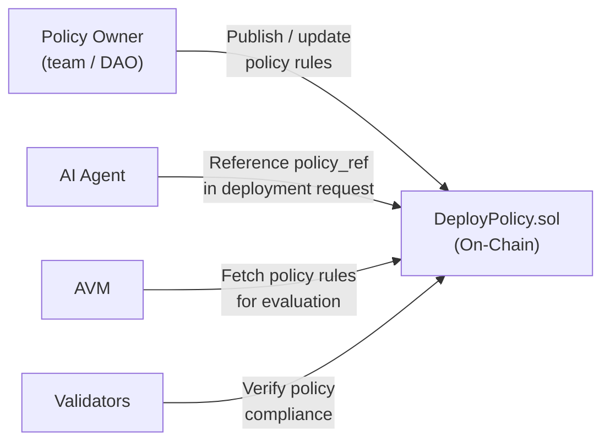
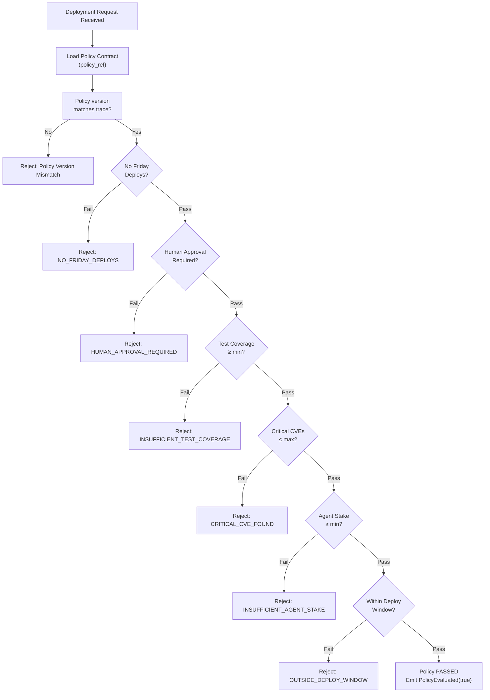

# Deployment Contracts

## Overview

Deployment Contracts are on-chain smart contracts (Solidity) that encode the deployment policy for a given project or environment. They are the ACI/ACD equivalent of `.github/workflows` — but instead of being mutable YAML files in a repository, they are **immutable, versioned, on-chain policy rules** that all validators enforce uniformly.

Every deployment request must reference a valid, active Deployment Contract. Validators will reject any deployment that lacks a valid policy reference or fails policy evaluation.

---

## Role in the Protocol



---

## Policy Rules

Deployment Contracts encode **deterministic, evaluable rules**. Examples:

| Rule | Example Value |
|---|---|
| `no_friday_deploys` | `block.timestamp % 604800 != 4 days` |
| `require_human_approval` | `true` (for production) |
| `min_test_coverage` | `80` (percent) |
| `max_critical_cves` | `0` |
| `min_agent_stake` | `10000e18` ($MAAT, in wei) |
| `allowed_environments` | `["staging", "production"]` |
| `required_approvers` | `["0xAlice", "0xBob"]` |
| `deploy_window_start` | `9` (UTC hour) |
| `deploy_window_end` | `17` (UTC hour) |

Rules are stored as structs on-chain and evaluated by the AVM's policy evaluator during trace verification. Validators re-evaluate the same rules during PoD consensus.

---

## Example Contract Syntax

```solidity
// SPDX-License-Identifier: MIT
pragma solidity ^0.8.20;

contract DeployPolicy {
    struct PolicyRules {
        bool noFridayDeploys;
        bool requireHumanApproval;
        uint8  minTestCoverage;       // percent, 0-100
        uint8  maxCriticalCves;
        uint256 minAgentStake;        // in $MAAT (wei)
        uint8  deployWindowStart;     // UTC hour
        uint8  deployWindowEnd;       // UTC hour
    }

    PolicyRules public rules;
    uint256 public policyVersion;
    address public policyOwner;

    event PolicyUpdated(uint256 version, address updatedBy);
    event PolicyEvaluated(
        address indexed agent,
        bytes32 traceHash,
        bool passed,
        string failReason
    );

    constructor(PolicyRules memory _rules) {
        rules = _rules;
        policyVersion = 1;
        policyOwner = msg.sender;
    }

    function updatePolicy(PolicyRules memory _rules) external onlyOwner {
        rules = _rules;
        policyVersion++;
        emit PolicyUpdated(policyVersion, msg.sender);
    }

    function evaluate(
        address agent,
        bytes32 traceHash,
        uint8   testCoverage,
        uint8   criticalCves,
        uint256 agentStake,
        bool    humanApprovalPresent,
        uint8   deployHourUtc,
        uint8   deployDayOfWeek   // 0=Sun, 5=Fri
    ) external returns (bool passed, string memory failReason) {
        // Friday check
        if (rules.noFridayDeploys && deployDayOfWeek == 5) {
            emit PolicyEvaluated(agent, traceHash, false, "NO_FRIDAY_DEPLOYS");
            return (false, "NO_FRIDAY_DEPLOYS");
        }
        // Human approval check
        if (rules.requireHumanApproval && !humanApprovalPresent) {
            emit PolicyEvaluated(agent, traceHash, false, "HUMAN_APPROVAL_REQUIRED");
            return (false, "HUMAN_APPROVAL_REQUIRED");
        }
        // Test coverage check
        if (testCoverage < rules.minTestCoverage) {
            emit PolicyEvaluated(agent, traceHash, false, "INSUFFICIENT_TEST_COVERAGE");
            return (false, "INSUFFICIENT_TEST_COVERAGE");
        }
        // CVE check
        if (criticalCves > rules.maxCriticalCves) {
            emit PolicyEvaluated(agent, traceHash, false, "CRITICAL_CVE_FOUND");
            return (false, "CRITICAL_CVE_FOUND");
        }
        // Stake check
        if (agentStake < rules.minAgentStake) {
            emit PolicyEvaluated(agent, traceHash, false, "INSUFFICIENT_AGENT_STAKE");
            return (false, "INSUFFICIENT_AGENT_STAKE");
        }
        // Deploy window check
        if (deployHourUtc < rules.deployWindowStart || deployHourUtc >= rules.deployWindowEnd) {
            emit PolicyEvaluated(agent, traceHash, false, "OUTSIDE_DEPLOY_WINDOW");
            return (false, "OUTSIDE_DEPLOY_WINDOW");
        }

        emit PolicyEvaluated(agent, traceHash, true, "");
        return (true, "");
    }

    modifier onlyOwner() {
        require(msg.sender == policyOwner, "Not policy owner");
        _;
    }
}
```

---

## Policy Evaluation Flow



---

## Contract Versioning

Policy owners can update contract rules at any time by calling `updatePolicy()`. Each update increments `policyVersion`. Deployment traces must record the `policy_version` at the time of submission. Validators reject any deployment where the trace's policy version does not match the contract's current version, preventing stale-policy attacks.

## Governance Controls

For DAO-governed policies, the `policyOwner` can be set to a governance contract (e.g., a multisig or token-weighted DAO). This enables community governance of deployment standards across the ecosystem.
