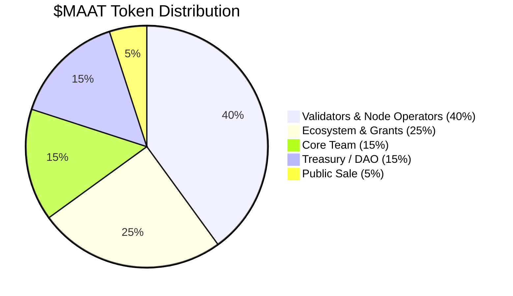
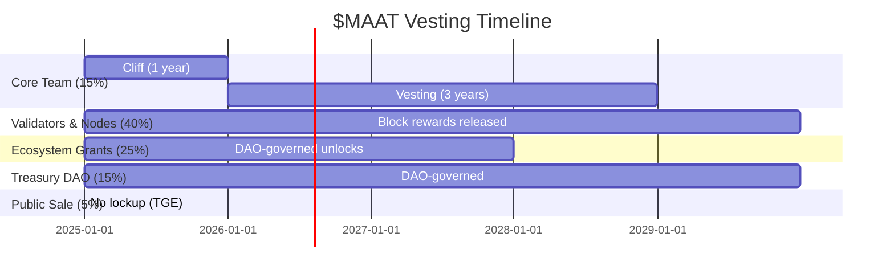
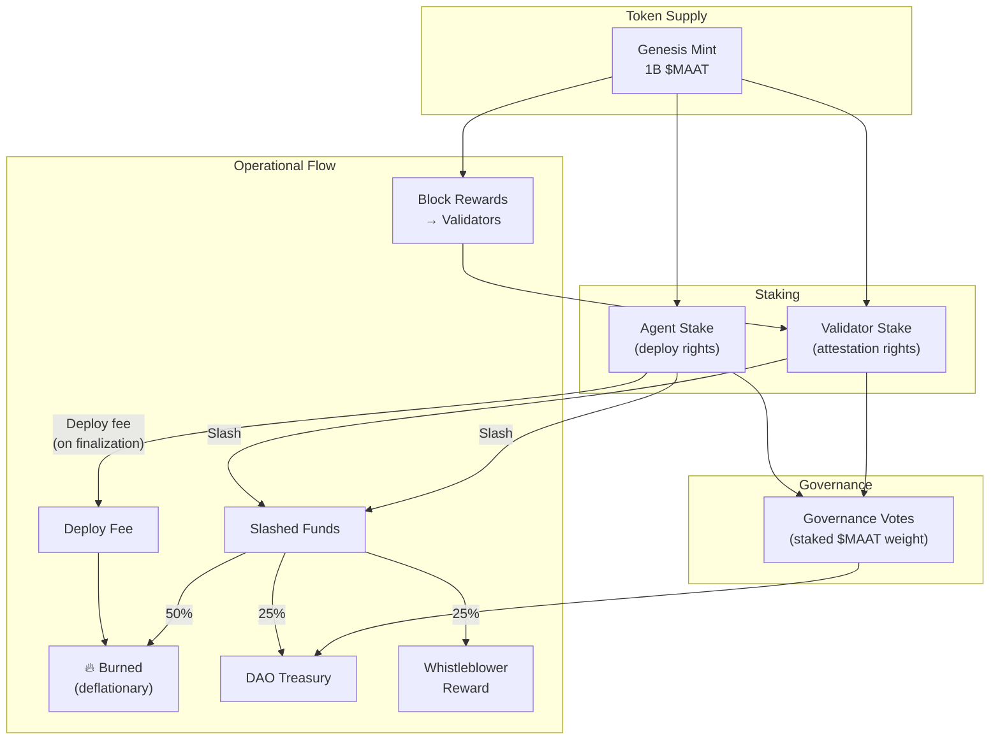

# $MAAT Tokenomics

## Overview

$MAAT is the native protocol token of MaatProof. It provides **economic accountability** for the ACI/ACD lifecycle — aligning incentives for agents, validators, policy owners, and the broader ecosystem. The name is derived from *Ma'at*, the ancient Egyptian concept of truth, justice, and cosmic order.

---

## Token Functions

| Function | Mechanism |
|---|---|
| **Agent Staking** | Agents must stake $MAAT to earn deploy rights; stake is at risk if policy is violated |
| **Validator Rewards** | Validators earn $MAAT for honest, timely attestation in PoD consensus rounds |
| **Slashing** | Malicious or negligent validators and agents lose staked $MAAT |
| **Deploy Fee (Burn)** | Each deployment consumes a small $MAAT fee, which is burned — deflationary pressure |
| **Governance** | $MAAT holders vote on protocol upgrades, policy standards, and treasury allocation |

---

## Token Supply & Distribution

**Total Supply: 1,000,000,000 $MAAT (1 billion)**



### Allocation Detail

| Category | Allocation | Vesting |
|---|---|---|
| **Validators & Node Operators** | 40% (400M) | Released over 5 years via block rewards |
| **Ecosystem & Grants** | 25% (250M) | DAO-governed; milestone-based unlocks |
| **Core Team** | 15% (150M) | 4-year vest, 1-year cliff |
| **Treasury / DAO** | 15% (150M) | DAO-governed |
| **Public Sale** | 5% (50M) | No lockup post-TGE |

---

## Staking

### Agent Staking

Agents must stake $MAAT to submit deployment requests. The required stake scales with deployment risk:

| Deployment Target | Minimum Agent Stake |
|---|---|
| Development / sandbox | 100 $MAAT |
| Staging | 1,000 $MAAT |
| Production | 10,000 $MAAT |

Stake is locked for the duration of the deployment round plus a **30-day challenge window**. If no slash is triggered within 30 days, stake is returned.

### Validator Staking

Validators must stake a minimum of **100,000 $MAAT** to participate in PoD consensus. Stake is at risk for equivocation, invalid attestation, or chronic liveness failures.

---

## Validator Rewards

Block reward formula:

```
validator_reward = BASE_BLOCK_REWARD
                   × (validator_stake / total_staked_by_active_validators)
                   × participation_rate
```

- `BASE_BLOCK_REWARD` starts at 10 $MAAT and halves every 4 years
- `participation_rate` = fraction of recent rounds in which validator participated

---

## Slashing

### Slash Conditions & Amounts

| Condition | Slash |
|---|---|
| Double-vote (equivocation) | 100% of validator stake |
| Attesting provably invalid trace | 50% of validator stake |
| Colluding to approve policy-violating deploy | 100% of validator stake |
| Chronic liveness failure (>10% missed rounds) | 5% of validator stake |
| Agent malicious deployment (proven on-chain) | 50% of agent stake |
| Agent policy violation (detected post-finalization) | 25% of agent stake |

### Slashed Fund Distribution

| Destination | Share |
|---|---|
| Burned (deflationary) | 50% |
| Whistleblower / reporter | 25% |
| DAO Treasury | 25% |

---

## Deploy Fee (Burn)

Every finalized deployment consumes a **deploy fee** paid in $MAAT:

```
deploy_fee = BASE_FEE × environment_multiplier
```

| Environment | Multiplier |
|---|---|
| Development | 0.1× |
| Staging | 1× |
| Production | 10× |

The deploy fee is **burned** (removed from supply), creating long-term deflationary pressure as deployment volume grows.

---

## Governance

$MAAT holders participate in on-chain governance via the DAO treasury contract. Voting weight = staked $MAAT balance. Governance controls:

- Protocol parameter updates (base fees, slash amounts, quorum)
- Ecosystem grant approvals
- Validator set size limits
- New Deployment Contract standard proposals
- Treasury fund deployment

---

## MEV Considerations

Unlike traditional blockchains, MaatProof's PoD consensus processes **deployment proposals** rather than financial transactions. MEV (Maximal Extractable Value) is therefore different in character:

| MEV Type | Risk Level | Mitigation |
|---|---|---|
| **Proposal ordering manipulation** | Medium | Round leader is selected by VRF — not economically manipulable |
| **Selective censorship** | Low | Deployment proposals have a 30s timeout; timeout causes automatic retry with new leader |
| **Front-running deployments** | Low | Deployments are agent-specific (signed by DID); a different agent cannot "front-run" your deployment |
| **Validator bribe for approval** | High | 2/3 supermajority required; colluding validators face 100% slash |
| **Fee manipulation** | Low | Deploy fee is deterministic (formula-based, not auction) |

VRF-based leader selection ensures the leader cannot be predicted in advance, making proposal reordering attacks economically impractical.

---

## Anti-Whale Mechanisms

To prevent concentration of governance and validator power:

| Mechanism | Description |
|---|---|
| **Validator stake cap** | Maximum 5% of total staked supply per single validator |
| **Voting power quadratic scaling** | Governance votes use √(staked $MAAT) to dilute whale influence |
| **Delegated staking** | Small token holders can delegate to a validator without giving up governance rights |
| **Validator set rotation** | Minimum 20 active validators required; new validators admitted based on stake + reputation score |

---

## Liquidity Bootstrapping

Phase 1 (pre-mainnet) liquidity strategy:

1. **Testnet incentives** — validators and agents earn testnet $MAAT for participation; 1% of mainnet supply allocated to testnet contributors
2. **Genesis auction** — 5% public sale via a fair-launch Dutch auction (no insider advantage)
3. **Ecosystem grants** — 25% (250M $MAAT) deployed over 3 years via DAO grants to integrators and node operators
4. **DEX listing** — Primary listing on Uniswap V4 (ETH mainnet via cross-chain bridge) + native DEX on MaatProof chain
5. **Liquidity mining** — Initial 6-month liquidity mining program for $MAAT/ETH pool; 10M $MAAT total incentive budget

### Token Vesting Schedule



---

## Token Flow Diagram


