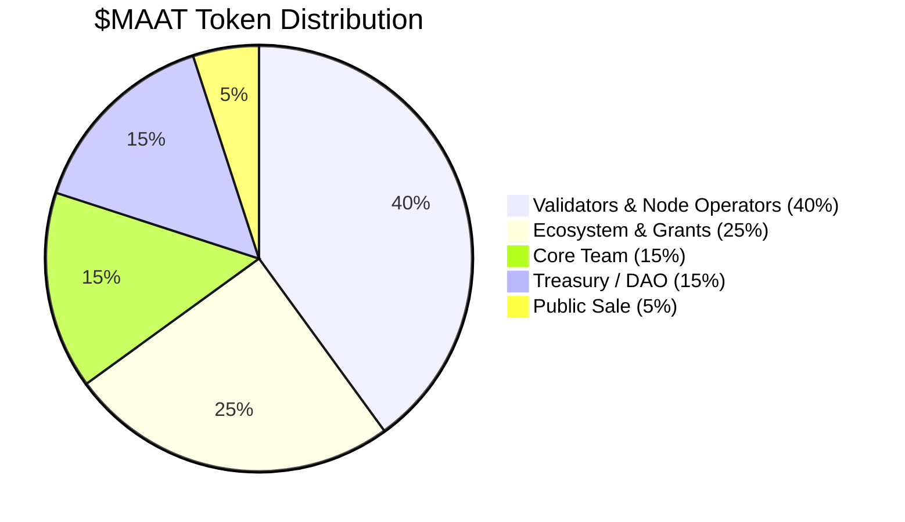
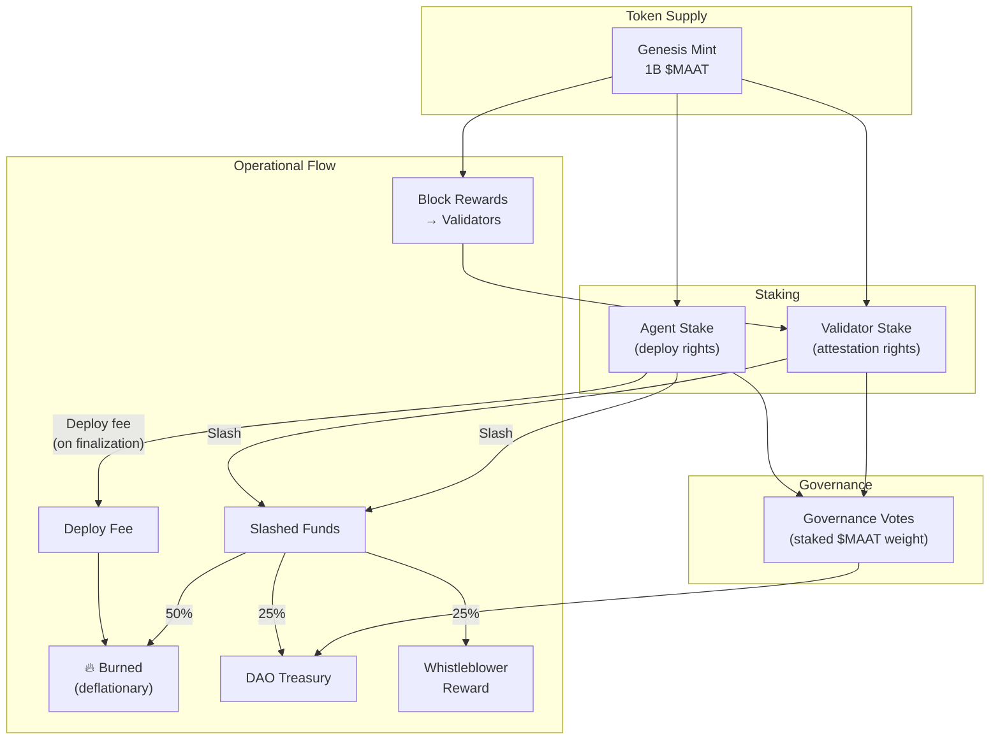

# $MAAT Tokenomics

## Overview

$MAAT is the native protocol token of MaatProof. It provides **economic accountability** for the ACI/ACD lifecycle — aligning incentives for agents, validators, policy owners, and the broader ecosystem. The name is derived from *Ma'at*, the ancient Egyptian concept of truth, justice, and cosmic order.

---

## Token Functions

| Function | Mechanism |
|---|---|
| **Agent Staking** | Agents must stake $MAAT to earn deploy rights; stake is at risk if policy is violated |
| **Validator Rewards** | Validators earn $MAAT for honest, timely attestation in PoD consensus rounds |
| **Slashing** | Malicious or negligent validators and agents lose staked $MAAT |
| **Deploy Fee (Burn)** | Each deployment consumes a small $MAAT fee, which is burned — deflationary pressure |
| **Governance** | $MAAT holders vote on protocol upgrades, policy standards, and treasury allocation |

---

## Token Supply & Distribution

**Total Supply: 1,000,000,000 $MAAT (1 billion)**



### Allocation Detail

| Category | Allocation | Vesting |
|---|---|---|
| **Validators & Node Operators** | 40% (400M) | Released over 5 years via block rewards |
| **Ecosystem & Grants** | 25% (250M) | DAO-governed; milestone-based unlocks |
| **Core Team** | 15% (150M) | 4-year vest, 1-year cliff |
| **Treasury / DAO** | 15% (150M) | DAO-governed |
| **Public Sale** | 5% (50M) | No lockup post-TGE |

---

## Staking

### Agent Staking

Agents must stake $MAAT to submit deployment requests. The required stake scales with deployment risk:

| Deployment Target | Minimum Agent Stake |
|---|---|
| Development / sandbox | 100 $MAAT |
| Staging | 1,000 $MAAT |
| Production | 10,000 $MAAT |

Stake is locked for the duration of the deployment round plus a **30-day challenge window**. If no slash is triggered within 30 days, stake is returned.

### Validator Staking

Validators must stake a minimum of **100,000 $MAAT** to participate in PoD consensus. Stake is at risk for equivocation, invalid attestation, or chronic liveness failures.

---

## Validator Rewards

Block reward formula:

```
validator_reward = BASE_BLOCK_REWARD
                   × (validator_stake / total_staked_by_active_validators)
                   × participation_rate
```

- `BASE_BLOCK_REWARD` starts at 10 $MAAT and halves every 4 years
- `participation_rate` = fraction of recent rounds in which validator participated

---

## Slashing

### Slash Conditions & Amounts

| Condition | Slash |
|---|---|
| Double-vote (equivocation) | 100% of validator stake |
| Attesting provably invalid trace | 50% of validator stake |
| Colluding to approve policy-violating deploy | 100% of validator stake |
| Chronic liveness failure (>10% missed rounds) | 5% of validator stake |
| Agent malicious deployment (proven on-chain) | 50% of agent stake |
| Agent policy violation (detected post-finalization) | 25% of agent stake |

### Slashed Fund Distribution

| Destination | Share |
|---|---|
| Burned (deflationary) | 50% |
| Whistleblower / reporter | 25% |
| DAO Treasury | 25% |

---

## Deploy Fee (Burn)

Every finalized deployment consumes a **deploy fee** paid in $MAAT:

```
deploy_fee = BASE_FEE × environment_multiplier
```

| Environment | Multiplier |
|---|---|
| Development | 0.1× |
| Staging | 1× |
| Production | 10× |

The deploy fee is **burned** (removed from supply), creating long-term deflationary pressure as deployment volume grows.

---

## Governance

$MAAT holders participate in on-chain governance via the DAO treasury contract. Voting weight = staked $MAAT balance. Governance controls:

- Protocol parameter updates (base fees, slash amounts, quorum)
- Ecosystem grant approvals
- Validator set size limits
- New Deployment Contract standard proposals
- Treasury fund deployment

---

## Token Flow Diagram


