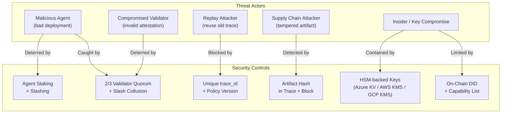

# Security Model

## Overview

MaatProof's security model is designed around the principle that **every deployment action must be attributable, tamper-evident, and economically accountable**. The threat model considers malicious agents, compromised validators, replay attacks, and supply chain attacks.

---

## Agent Identity

Every agent that interacts with MaatProof has a cryptographic identity:

- **Keypair**: Ed25519 (fast, secure, widely supported)
- **Identity Document**: W3C Decentralized Identifier (DID) anchored on-chain
- **Capability List**: On-chain record of what environments the agent may deploy to
- **Stake Amount**: $MAAT stake visible on-chain — economic skin in the game

All deployment requests and trace packages are signed by the agent's Ed25519 private key. Validators verify this signature before processing.

---

## Stake as Collateral

Economic security is provided by the staking mechanism:

- Agents must stake $MAAT proportional to the risk of their deployment target
- Stake is locked during the deployment round + 30-day challenge window
- If a malicious or policy-violating deployment is proven on-chain, stake is slashed
- This creates a direct economic cost for bad behavior

The minimum stake for production deployments (10,000 $MAAT) must exceed the expected value of a harmful deployment for the economic deterrent to be effective.

---

## Slashing Conditions

| Condition | Who is slashed | Amount |
|---|---|---|
| Proven malicious deployment | Agent | 50% of stake |
| Policy violation (post-finalization) | Agent | 25% of stake |
| Double-vote by validator | Validator | 100% of stake |
| Attesting invalid trace | Validator | 50% of stake |
| Collusion to approve bad deploy | All colluding validators | 100% of stake each |

---

## Validator Quorum

The PoD consensus requires a **2/3 supermajority** of active validators to finalize a deployment. This means:

- An attacker must control >1/3 of staked validator weight to halt finality
- An attacker must control >2/3 of staked validator weight to approve a malicious deployment
- Colluding validators face 100% slash — the economic cost must exceed any potential gain

---

## Trace Integrity

Reasoning traces are protected by:

1. **SHA-256 hashing** of the canonical JSON-LD serialization — any modification to the trace changes the hash
2. **Agent signature** over the trace hash — traces cannot be forged without the agent's private key
3. **On-chain anchoring** — the trace hash is written to the finalized block; post-hoc modification is detectable
4. **IPFS storage** — full trace is stored on IPFS; content-addressed (CID = hash of content)

---

## Replay Attack Prevention

| Attack | Prevention |
|---|---|
| Replay a valid trace for a different deployment | `trace_id` is unique per deployment; validators reject duplicate trace IDs |
| Replay an old approved trace | `policy_version` in trace must match current on-chain version |
| Replay in a different environment | `deploy_environment` is part of the signed trace; validators check it |
| Submit trace before human approval | AVM checks `human_approval_ref` before emitting attestation |

---

## Multi-Cloud Key Management

MaatProof node operators can store validator and agent private keys in hardware-backed KMS services:

| Cloud | Service | Key Type |
|---|---|---|
| **Azure** | Azure Key Vault (HSM-backed) | Ed25519 via BYOK or managed |
| **AWS** | AWS KMS (CloudHSM) | Ed25519 via asymmetric CMK |
| **GCP** | Cloud KMS (Cloud HSM) | Ed25519 signing keys |

The AVM signing interface abstracts the key backend — operators configure their preferred KMS provider. Private keys **never leave** the HSM boundary.

---

## Threat Model



---

## Smart Contract Security

The Deployment Contracts and token contracts follow these practices:

- **No upgradeability by default** — policy changes go through `updatePolicy()` with version increment
- **Reentrancy guards** on all state-changing functions
- **Slashing contract is separate** from the token contract — principle of least privilege
- **Governance timelock** — policy changes have a 48-hour timelock before taking effect
- **Formal verification target** — core contracts are designed to be verifiable with Certora or Halmos

---

## Audit Trail

Every finalized block provides an immutable, cryptographically linked audit record:

```
Block N:
  artifact_hash:       sha256:abc123...   ← deployment artifact
  trace_hash:          sha256:def456...   ← full reasoning trace
  policy_ref:          0xContract...      ← on-chain policy
  policy_version:      3                  ← policy snapshot
  agent_id:            did:maat:agent:... ← who deployed
  validator_signatures: [sig1, sig2, ...]  ← who attested
  timestamp:           2025-01-15T14:32Z  ← when
  human_approval_ref:  0xTxHash...        ← human authorization
```

This record satisfies SOX, HIPAA, and SOC2 audit requirements for AI-driven deployments (see `docs/07-regulatory-compliance.md`).
