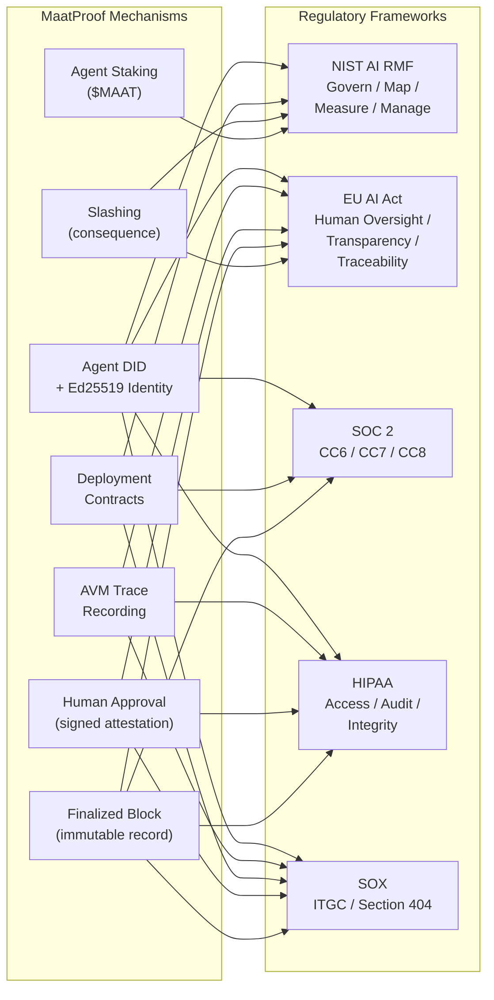

# Regulatory Compliance

## Overview

MaatProof is designed from the ground up to satisfy the regulatory requirements emerging around AI-driven software deployments. As AI agents become deployment actors in regulated industries (healthcare, finance, critical infrastructure), the question "show me the audit trail for every AI-driven production change" becomes a compliance requirement, not a nice-to-have.

MaatProof's on-chain architecture provides **compliance artifacts by construction** — not via post-hoc log scraping.

---

## Regulatory Frameworks Addressed

### NIST AI Risk Management Framework (AI RMF)

| NIST AI RMF Function | MaatProof Mechanism |
|---|---|
| **Govern** | Deployment Contracts encode governance rules on-chain; DAO governance for protocol changes |
| **Map** | Agent identity (DID) maps every action to a specific AI system |
| **Measure** | Trace recording quantifies AI decision-making; policy evaluation is measurable |
| **Manage** | Slashing provides automated consequence for harmful AI actions; human approval gates risk |

### EU AI Act

| EU AI Act Requirement | MaatProof Mechanism |
|---|---|
| Human oversight for high-risk AI | Human approval is a first-class protocol primitive — a signed cryptographic attestation |
| Transparency & explainability | Full reasoning trace recorded by AVM, anchored to IPFS, hash on-chain |
| Traceability | Every deployment has an immutable on-chain record with agent identity |
| Accuracy & robustness | Policy rules encode minimum quality gates (test coverage, CVE checks) |
| Record-keeping | Finalized blocks are permanent on-chain records |

### SOC 2 (Type I & II)

| SOC 2 Trust Service Criterion | MaatProof Mechanism |
|---|---|
| **CC6.1** Logical access controls | Agent DID + Ed25519 cryptographic access control |
| **CC6.6** Logical access removal | On-chain capability revocation |
| **CC7.2** System monitoring | On-chain event emission for all deployment actions |
| **CC8.1** Change management | Every deployment is a policy-governed, validator-attested change |
| **A1.2** Availability | Multi-cloud validator deployment (AKS, EKS, GKE) |

### HIPAA (for healthcare deployments)

| HIPAA Requirement | MaatProof Mechanism |
|---|---|
| Access control (§164.312(a)) | Agent identity + stake gates access to production deployment |
| Audit controls (§164.312(b)) | Immutable on-chain audit trail for every production change |
| Integrity (§164.312(c)) | Artifact hash + trace hash in finalized block proves integrity |
| Transmission security (§164.312(e)) | gRPC with TLS; keys in HSM-backed KMS |

### SOX (for financial deployments)

| SOX Requirement | MaatProof Mechanism |
|---|---|
| IT General Controls (ITGC) | Policy rules enforce separation of duties, change management |
| Access controls (Section 404) | Agent DID + capability list; human approval on-chain |
| Audit trail | Every deployment has a non-repudiable, timestamped, validator-attested record |
| Change documentation | Deployment Contract version history is immutable and auditable |

---

## Human Approval as Protocol Primitive

Human approval in MaatProof is **not a UI button** — it is a cryptographic protocol primitive:

1. Human key-holder signs the deployment request hash with their Ed25519 key
2. The signature is submitted to the chain as a `HumanApproval` transaction
3. The AVM verifies the human approval signature before emitting attestation
4. The `human_approval_ref` is recorded in the finalized block
5. The human key-holder's identity is traceable to a real person via the DID registry

This means a human approval is **non-repudiable** — the approver cannot later claim they didn't approve it.

---

## On-Chain Audit Trail as Compliance Artifact

Every finalized block is a compliance artifact. For a SOX or HIPAA audit, an organization can present:

```
Block 1042301
  What deployed:    artifact_hash = sha256:abc123...
  Why it deployed:  trace_hash = sha256:def456... (full trace on IPFS)
  Policy followed:  policy_ref = 0xDeployPol... (policy_version = 3)
  Who deployed:     agent_id = did:maat:agent:xyz789
  Who approved:     human_approval_ref = 0xApprovalTx...
  Who verified:     validator_signatures = [v1, v2, v3, ...]
  When:             timestamp = 2025-01-15T14:32:00Z
```

This single block record satisfies:
- SOX IT General Controls audit evidence
- HIPAA access and audit control requirements
- SOC 2 CC8.1 change management evidence
- EU AI Act traceability requirements

---

## Compliance Mapping Diagram



---

## AI Governance Requirements

As AI governance regulations mature globally (EU AI Act enforcement from 2026, US Executive Orders on AI safety, emerging APAC frameworks), MaatProof provides a **protocol-level compliance layer** rather than a point solution:

- **Immutable by design**: on-chain records cannot be deleted or altered post-finalization
- **Auditor-accessible**: block explorers and APIs provide read access to any compliance auditor
- **Standard format**: JSON-LD trace format is designed for AI governance tooling compatibility
- **Separation of duties**: policy owner ≠ deploying agent ≠ validator ≠ human approver
- **Version-controlled policy**: Deployment Contract versioning provides a full policy change history
