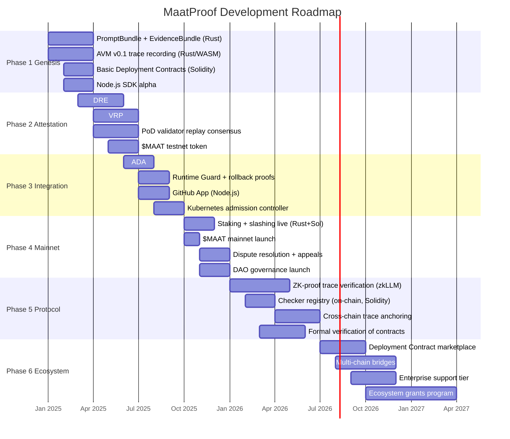
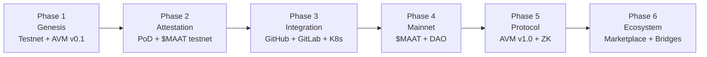

# MaatProof Roadmap

## Overview

MaatProof is developed under the assumption that **full ACD is the operating model from
the beginning**. The roadmap sequences the proof primitives needed to make autonomous
deployment safe — it does not treat autonomous production deploy as a speculative endpoint.

Sequence: canonical bundles → DRE normalization → VRP checkers → validator replay →
runtime guards → staking/slashing → ecosystem integrations → optional ZK upgrades

---

## Phase Timeline

---

## Phase Detail

### Phase 1: Genesis

**Goal**: Canonical proof primitives — PromptBundle, EvidenceBundle, AVM trace recording.

| Deliverable | Tech | Description |
|---|---|---|
| PromptBundle (content-addressed) | Rust | Canonical serialization of all deployment context |
| EvidenceBundle | Rust | Content-addressed artifact collection |
| AVM v0.1 | Rust / WASM | Trace recording and basic WASM sandbox replay |
| Basic Deployment Contracts | Solidity | Core policy rules on testnet |
| SDK Alpha | Node.js | Submit deployment requests; read attestations |

### Phase 2: Attestation

**Goal**: DRE + VRP + validator replay consensus operational on testnet.

| Deliverable | Tech | Description |
|---|---|---|
| DRE | Rust | N-of-M committee execution, DecisionTuple normalization, convergence |
| VRP | Rust | Typed reasoning records, admissible/informational split, Merkleized DAG |
| PoD Consensus | Rust / gRPC | Validator replay, stake-weighted quorum, dispute path |
| $MAAT Testnet | Solidity | Testnet token with staking and reward mechanics |

### Phase 3: Integration

**Goal**: ADA live; runtime guards; mainstream CI/CD integrations.

| Deliverable | Tech | Description |
|---|---|---|
| ADA | Rust | 7-condition autonomous production authorization |
| Runtime Guard | Rust / Node.js | Metric monitoring, auto-rollback proofs |
| GitHub App | Node.js | Push/PR events → MaatProof proposals; status back to PR |
| Kubernetes Controller | Rust | Admission webhook enforcing on-chain policy |

### Phase 4: Mainnet

**Goal**: Economic accountability live — staking, slashing, governance.

| Deliverable | Tech | Description |
|---|---|---|
| Staking + Slashing | Rust / Solidity | Live economic consequences for agents and validators |
| $MAAT Mainnet | Solidity | Token generation event; listing; staking live |
| Dispute Resolution | Rust / Solidity | Appeal path; governance vote for contested slashes |
| DAO Governance | Solidity | Token-weighted governance for protocol parameters |

### Phase 5: Protocol

**Goal**: ZK-provable reasoning — path to full ACD without a DRE committee.

| Deliverable | Tech | Description |
|---|---|---|
| ZK Trace Verification | Rust / zkSNARK | zkLLM-style proofs for reasoning package verification |
| Checker Registry | Solidity | On-chain registry of pinned WASM checker versions |
| Cross-Chain Anchoring | Rust / Solidity | Anchor MaatProof block hashes to Ethereum/other L1s |
| Formal Verification | Certora / Halmos | Verify core Solidity contracts |

### Phase 6: Ecosystem

**Goal**: Self-sustaining ecosystem with marketplace and multi-chain support.

| Deliverable | Tech | Description |
|---|---|---|
| Contract Marketplace | Node.js | Community Deployment Contract templates and library |
| Multi-Chain Bridges | Rust / Solidity | Bridge MaatProof attestations to EVM chains |
| Enterprise Support | — | SLA-backed support for enterprise deployments |
| Ecosystem Grants | DAO | DAO-funded grants for protocol tooling and integrations |

---

## Milestone Dependencies

