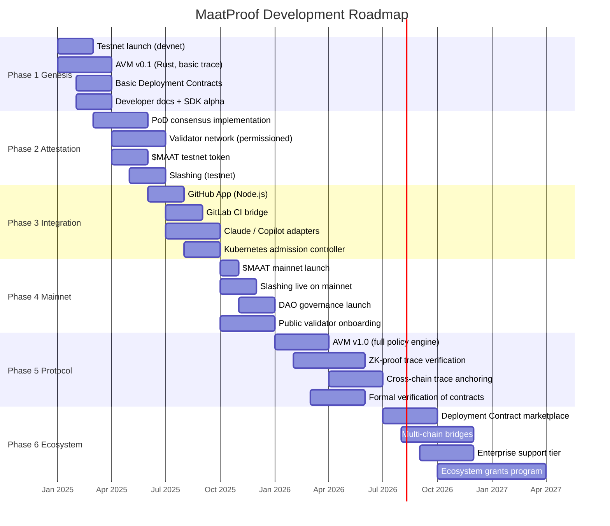
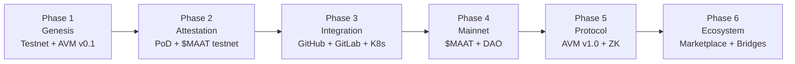

# MaatProof Roadmap

## Overview

MaatProof development is organized into six phases, from initial testnet through a mature protocol ecosystem. Each phase builds on the previous, with clear milestones and deliverables.

---

## Phase Timeline

---

## Phase Detail

### Phase 1: Genesis

**Goal**: Working testnet with AVM and basic deployment contracts.

| Deliverable | Description |
|---|---|
| Testnet (devnet) | Single-region testnet with 4 permissioned validators |
| AVM v0.1 | Rust-based trace recording and basic replay |
| Basic Deployment Contracts | Solidity contracts with core policy rules |
| SDK Alpha | Node.js SDK for submitting deployment requests |
| Developer docs | Core docs: overview, AVM, contracts |

### Phase 2: Attestation

**Goal**: Full PoD consensus with validator network and testnet economics.

| Deliverable | Description |
|---|---|
| PoD Consensus | Full round lifecycle: propose → verify → vote → finalize |
| Validator Network | Permissioned validator set (10-20 validators) |
| $MAAT Testnet | Testnet token with staking and reward mechanics |
| Slashing (testnet) | Basic slash conditions on testnet |

### Phase 3: Integration

**Goal**: Mainstream CI/CD systems can use MaatProof without changing workflows.

| Deliverable | Description |
|---|---|
| GitHub App | Push/PR events → MaatProof proposals; status back to PR |
| GitLab CI Bridge | Pipeline triggers → MaatProof; status reporting |
| Claude/Copilot Adapters | AI agent adapters for Anthropic Claude and GitHub Copilot |
| Kubernetes Admission Controller | kubectl-level policy enforcement |

### Phase 4: Mainnet

**Goal**: Production-ready protocol with live economics.

| Deliverable | Description |
|---|---|
| $MAAT Mainnet | Token generation event; listing; staking live |
| Slashing (mainnet) | Economic consequences for real deployments |
| DAO Governance | Token-weighted governance for protocol parameters |
| Public Validators | Permissionless validator onboarding |

### Phase 5: Protocol

**Goal**: AVM v1.0 with ZK-proof trace verification.

| Deliverable | Description |
|---|---|
| AVM v1.0 | Full policy engine, all rule types, improved performance |
| ZK-Proof Traces | zkLLM-style proofs for trace verification (privacy-preserving) |
| Cross-Chain Anchoring | Anchor MaatProof block hashes to Ethereum/other L1s |
| Formal Verification | Certora/Halmos verification of core contracts |

### Phase 6: Ecosystem

**Goal**: Self-sustaining ecosystem with marketplace and multi-chain support.

| Deliverable | Description |
|---|---|
| Contract Marketplace | Community Deployment Contract templates and library |
| Multi-Chain Bridges | Bridge MaatProof attestations to EVM chains |
| Enterprise Support | SLA-backed support for enterprise deployments |
| Ecosystem Grants | DAO-funded grants for protocol tooling and integrations |

---

## Milestone Dependencies

