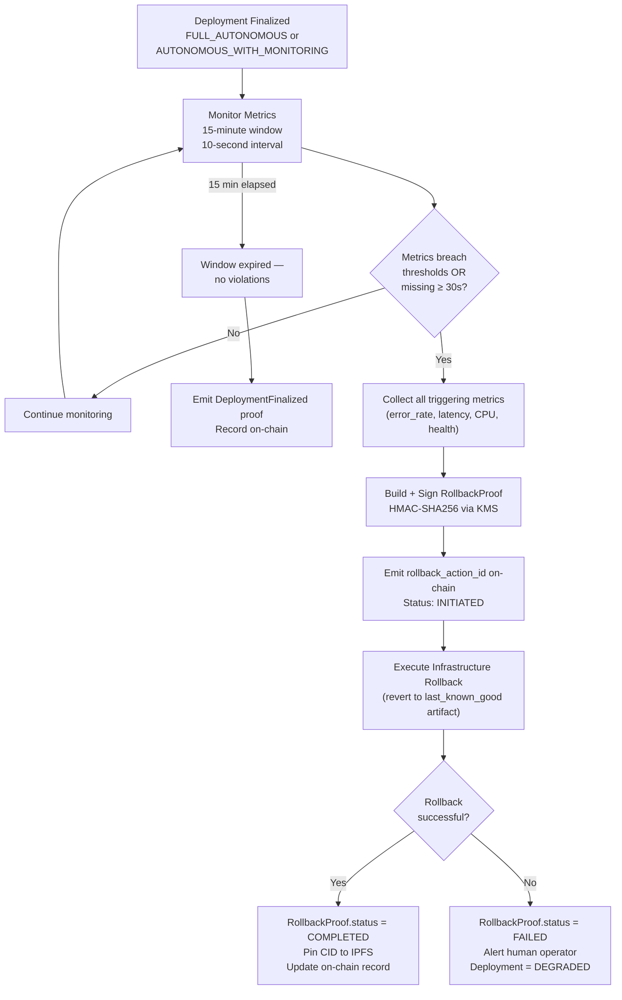
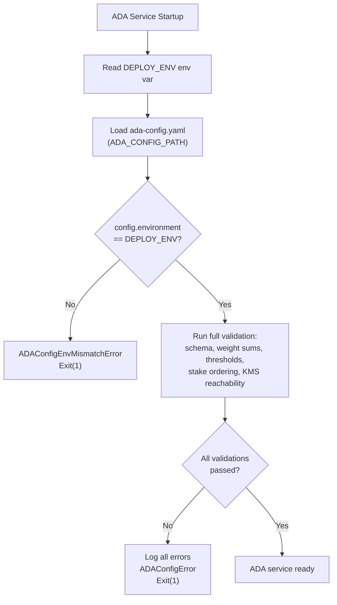

# ADR-001: Adopt Autonomous Deployment Authority (ADA) as Protocol Default

<!-- Addresses EDGE-001, EDGE-002, EDGE-003, EDGE-004, EDGE-049, EDGE-050, EDGE-051,
     EDGE-052, EDGE-053, EDGE-054, EDGE-055, EDGE-056 -->

**Status:** Accepted  
**Date:** 2026-04-23  
**Deciders:** MaatProof Protocol Team + DAO  
**Issue:** [#138 — ADA Documentation](https://github.com/dngoins/MaatProof/issues/138)  
**Supersedes:** Pre-ADA mandatory `HumanApprovalRequiredError` flow  

---

## Context

Before ADA, every production deployment in MaatProof required a human approver to sign off
via the `HumanApprovalAgent`. This created a bottleneck: the system was capable of generating
cryptographically verifiable, deterministic proof chains for every deployment decision — yet
still required a human to act as a rubber stamp before any code could reach production.

The core question: **if a deployment decision can be proven correct — deterministically,
cryptographically, and verifiably — why mandate a human in the loop by default?**

### Problems with the Old Model

| Problem | Impact |
|---------|--------|
| Human approval as universal mandate regardless of risk level | Bottleneck for low-risk deployments |
| `HumanApprovalRequiredError` semantics don't capture why a deploy was blocked | Poor observability |
| No autonomous authority levels (all-or-nothing) | No graduated trust model |
| Auto-rollback lacked a signed proof for chain-of-custody | Auditability gap |
| No scoring model — "approved" or "not approved" | No quantified trust signal |

---

## Decision

**Adopt Autonomous Deployment Authority (ADA) as the protocol default.**

Human approval becomes a **policy primitive** — a rule that teams declare in their
`DeployPolicy` contract when they want it, not a universal protocol mandate.

ADA authorizes production deployments by computing a **multi-signal deployment score**
and mapping it to an **authority level**. Cryptographic proof chains — not human judgment —
are the primary trust mechanism.

When ADA cannot authorize a deployment, it raises `AutonomousDeploymentBlockedError`
(replacing `HumanApprovalRequiredError`) and the pipeline falls back to the human-approval
path if the policy contract specifies `require_human_approval`.

---

## Multi-Signal Deployment Scoring Model

<!-- Addresses EDGE-003, EDGE-054, EDGE-050 -->

ADA computes a `DeploymentScore` from five independently verified signals. **No signal
may be self-reported by the deploying agent** — each is sourced and verified by the AVM.

### Signal Weights

| Signal | Weight | Source | Verification |
|--------|--------|--------|-------------|
| `deterministic_gates` | **25%** | AVM gate runner (lint / compile / security scan / artifact signing) | WASM sandbox replay; result hash committed to trace |
| `dre_consensus` | **20%** | Deterministic Reasoning Engine consensus certificate | Signed by ≥ 2/3 DRE committee nodes |
| `logic_verification` | **20%** | Logic verifier agent | Signed AVM attestation |
| `validator_attestation` | **20%** | PoD validator set (on-chain `ValidatorVote` records) | Stake-weighted: `sum(stake[v] for FINALIZE voters) / total_active_stake` |
| `risk_score` | **15%** | AVM security agent from verified `RiskAssessment` | `1.0 − normalised_risk`; RiskAssessment verified from signed CI artifacts |

> **Constitutional invariant (CONSTITUTION §2):** `deterministic_gates` weight **must be ≥ 10%**
> at all times. A value of zero would allow deployments with all policy gates failed to
> achieve `AUTONOMOUS_WITH_MONITORING` via other signals — a constitutional violation.

**Total score formula:**
```
total = (deterministic_gates × 0.25) + (dre_consensus × 0.20) +
        (logic_verification × 0.20)  + (validator_attestation × 0.20) +
        (risk_score × 0.15)

Range: [0.0, 1.0]    Precision: Python Decimal (6 decimal places)
```

> All arithmetic uses Python `Decimal` — **not** IEEE 754 `float` — to ensure deterministic
> results across validators and prevent boundary misclassification (e.g., 0.8999999 vs 0.9000000).

### Scoring Example

A routine staging deployment with all gates green and a small diff:

| Signal | Value | Weight | Contribution |
|--------|-------|--------|-------------|
| deterministic_gates | 1.0 (all 5 gates pass) | 0.25 | 0.2500 |
| dre_consensus | 0.95 (19/20 nodes converge) | 0.20 | 0.1900 |
| logic_verification | 1.0 (formal check passes) | 0.20 | 0.2000 |
| validator_attestation | 0.90 (stake-weighted) | 0.20 | 0.1800 |
| risk_score | 0.85 (low normalized risk) | 0.15 | 0.1275 |
| **Total** | | | **0.9475 → FULL_AUTONOMOUS** |

### Risk Score Formula

`risk_score` = `1.0 − normalised_risk`  

`normalised_risk` is computed by the AVM security agent from verified CI pipeline artifacts:

```
normalised_risk =
    min(files_changed / 500,         1.0) × 0.10    # file change volume
  + min(lines_changed / 10_000,      1.0) × 0.10    # line change volume
  + min(critical_paths / 5,          1.0) × 0.25    # critical path impact
  + min(new_dependencies / 20,       1.0) × 0.15    # new dependency risk
  + max(0, −test_coverage_delta)          × 0.15    # test deletion penalty
  + min((4×CRITICAL + 2×HIGH + MEDIUM) / 20, 1.0)
                                          × 0.25    # CVE severity score
```

**Risk multiplier for staking:**
```
risk_multiplier = 1.0
  + 0.5 × min(len(critical_paths_touched), 10)    # max +5
  + 1.0 × min(CRITICAL_finding_count, 10)          # max +10
  + 0.5 × min(HIGH_finding_count, 10)              # max +5
  × 2.0 if test_coverage_delta < −0.10             # double for major test deletion

Result clamped to [1, 100]
```

---

## Deployment Authority Levels

<!-- Addresses EDGE-003, EDGE-049, EDGE-051 -->

The `DeploymentAuthorityLevel` is derived from the total score, subject to environment
constraints, DAO governance requirements, and compliance overrides.

### Authority Level Thresholds

| Level | Score Range | Production Deploy? | Requires DAO Vote? | Regulated Env Cap? |
|-------|-------------|--------------------|--------------------|-------------------|
| `FULL_AUTONOMOUS` | **≥ 0.90** | ✅ Yes | ✅ Required | ❌ Blocked (HIPAA/SOX) |
| `AUTONOMOUS_WITH_MONITORING` | **0.75–0.89** | ✅ Yes | ❌ Not required | ✅ Allowed |
| `STAGING_AUTONOMOUS` | **0.60–0.74** | ❌ Staging only | ❌ | N/A |
| `DEV_AUTONOMOUS` | **0.40–0.59** | ❌ Dev only | ❌ | N/A |
| `BLOCKED` | **< 0.40** | ❌ No deployment | ❌ | N/A |

### Environment + Compliance Overrides

```
score ≥ 0.90  AND  dao_full_autonomous_enabled=true  AND  compliance_regulated=false
   → FULL_AUTONOMOUS (production permitted)

score ≥ 0.90  AND  (dao_full_autonomous_enabled=false  OR  compliance_regulated=true)
   → downgraded to AUTONOMOUS_WITH_MONITORING

score in [0.75, 0.90)  →  AUTONOMOUS_WITH_MONITORING (prod; auto-rollback mandatory)

score in [0.60, 0.75)  →  STAGING_AUTONOMOUS (staging/dev only; blocked in prod)

score in [0.40, 0.60)  →  DEV_AUTONOMOUS (dev/sandbox only)

score < 0.40  →  BLOCKED  →  AutonomousDeploymentBlockedError raised
```

### Compliance Tier Overrides

| Compliance Tier | Environment | Max Authority Level |
|-----------------|-------------|---------------------|
| Unrestricted | dev, sandbox | `FULL_AUTONOMOUS` |
| Standard | staging, non-regulated prod | `FULL_AUTONOMOUS` (requires DAO vote) |
| HIPAA | HIPAA-regulated prod | `AUTONOMOUS_WITH_MONITORING` |
| SOX | SOX-regulated prod | `AUTONOMOUS_WITH_MONITORING` |
| Critical Infrastructure | Any critical infra prod | `BLOCKED` |

### Authority Level Example

```
score = 0.93, environment = "production", dao_enabled = false, compliance_regulated = true

Step 1: score ≥ 0.90  →  initial level = FULL_AUTONOMOUS
Step 2: compliance_regulated = true  →  downgrade to AUTONOMOUS_WITH_MONITORING
Step 3: "production" ∈ AUTONOMOUS_WITH_MONITORING.allowed_environments  →  permitted

Result: AUTONOMOUS_WITH_MONITORING — deploy to prod with active rollback monitoring
```

---

## `AutonomousDeploymentBlockedError` — Replacing `HumanApprovalRequiredError`

<!-- Addresses EDGE-004, EDGE-046, EDGE-053 -->

### What Changed

| Aspect | Old (`HumanApprovalRequiredError`) | New (`AutonomousDeploymentBlockedError`) |
|--------|------------------------------------|----------------------------------------|
| Semantics | "A human must approve before continuing" | "ADA cannot authorize; here is why" |
| Carries score? | ❌ No | ✅ Yes (`deployment_score` dict) |
| Carries trace ID? | ❌ No | ✅ Yes (`trace_id`) |
| Carries authority level? | ❌ No | ✅ Yes (`authority_level`) |
| Audit trail entry? | Manual | ✅ Automatic (`ADA_DEPLOY_BLOCKED`) |
| Compliance classification? | None | ✅ SOC2/HIPAA/SOX/EU AI Act |

### Migration Guide

```python
# ❌ Old catch block (misses new ADA errors)
try:
    pipeline.deploy()
except HumanApprovalRequiredError as e:
    request_human_approval(e)

# ✅ New catch block — handles both during migration period
try:
    pipeline.deploy()
except (HumanApprovalRequiredError, AutonomousDeploymentBlockedError) as e:
    if isinstance(e, AutonomousDeploymentBlockedError):
        logger.warning(f"ADA blocked: {e.reason} | score={e.deployment_score} | trace={e.trace_id}")
    request_human_approval(e)
```

> **DeprecationWarning:** `HumanApprovalRequiredError` emits a `DeprecationWarning` when raised
> in a production deployment context. It is **not removed** in this release — only ADA-managed
> deployments use the new error class.

### Compliance Classification

When `AutonomousDeploymentBlockedError` is raised:

| Framework | Control | Meaning |
|-----------|---------|---------|
| SOC 2 Type II | CC6.1 | Logical access controls — blocked access attempt logged |
| HIPAA | §164.312(a)(2)(i) | Access control — autonomous access denied; human escalation required |
| SOX | ITGC IT-CC-03 | Change management — change blocked pending human authorization |
| EU AI Act | Art. 14 | Human oversight — autonomous action prevented; human review required |

---

## Auto-Rollback Protocol

<!-- Addresses EDGE-052, EDGE-056 -->

Every production deployment under `FULL_AUTONOMOUS` or `AUTONOMOUS_WITH_MONITORING` must
declare a `RuntimeGuard`. ADA actively monitors the deployment for **15 minutes** after
go-live. A signed `RollbackProof` is produced for every rollback event.

### Monitoring Window Parameters

| Parameter | Default Value | Configurable? |
|-----------|--------------|---------------|
| Monitoring window duration | **15 minutes** | ✅ via config |
| Metric check interval | **10 seconds** | ✅ via config |
| Rollback initiation SLA | ≤ 60 seconds from trigger | ❌ hard limit |
| RollbackProof generation SLA | ≤ 30 seconds | ❌ hard limit |

### Rollback Trigger Thresholds (Default)

| Metric | Trigger Condition |
|--------|-------------------|
| `error_rate_pct` | > 5% sustained over any 60-second window |
| `p99_latency_ms` | > 2× pre-deployment baseline |
| `cpu_utilisation_pct` | > 95% sustained for > 120 seconds |
| `health_check_failed` | ≥ 3 consecutive failures |

> If metrics are **unavailable for ≥ 30 seconds**, rollback is triggered automatically as a
> fail-safe (missing monitoring = assume degraded).

### Rollback Flow



### RollbackProof Structure

```python
@dataclass
class RollbackProof:
    rollback_id:           str    # UUID — unique per rollback event
    deployment_trace_id:   str    # links to original DeploymentTrace
    rollback_action_id:    str    # written on-chain immediately (before completion)
    agent_id:              str    # DID of the ADA system initiating rollback
    deploy_environment:    str    # must match original trace (replay protection)
    triggering_metrics:    RollbackTriggerMetrics
    signed_reasoning:      str    # human-readable rollback reason
    rollback_status:       str    # INITIATED | COMPLETED | FAILED
    initiated_at:          float  # Unix timestamp
    completed_at:          float  # None until completion
    spec_version:          str    # ADA spec version (for WASM stdlib compat check)
    signature:             str    # HMAC-SHA256 hex (KMS-sourced key, never plain-text)
```

> **Replay protection:** `deploy_environment` is included in the signed canonical bytes.
> A staging `RollbackProof` cannot be submitted as a production rollback —
> validators reject with `ROLLBACK_PROOF_ENV_MISMATCH`.

---

## MAAT Staking and Slashing

<!-- Addresses EDGE-003, EDGE-050 -->

### Agent Staking Requirements

| Deployment Environment | Minimum Stake | Risk Multiplier Applied? |
|------------------------|---------------|--------------------------|
| Development / sandbox | **100 $MAAT** | ✅ Yes |
| Staging / UAT | **1,000 $MAAT** | ✅ Yes |
| Production | **10,000 $MAAT** | ✅ Yes |

**Effective minimum stake = base_minimum × risk_multiplier**

Example: A production deploy touching 3 critical paths and 2 HIGH CVEs:
```
risk_multiplier = 1.0 + (3 × 0.5) + (2 × 0.5) = 3.5
effective_minimum = 10,000 × 3.5 = 35,000 $MAAT
```

The stake is **locked** for the duration of the deployment round plus a **30-day challenge
window**. If no slash is triggered within 30 days, stake is returned automatically.

### Validator Staking

Validators must stake a minimum of **100,000 $MAAT** to participate in PoD consensus.
`validator_attestation` is stake-weighted — a Sybil operator registering 100 zero-stake
validator DIDs contributes 0 attestation weight.

### Slash Conditions and Amounts

| Condition | Code | Slash Amount |
|-----------|------|-------------|
| Double-vote (equivocation) | `VAL_DOUBLE_VOTE` | 100% of validator stake |
| Attesting provably invalid trace | `VAL_INVALID_ATTESTATION` | 50% of validator stake |
| Colluding to approve policy-violating deploy | `VAL_COLLUSION` | 100% of validator stake |
| Chronic liveness failure (> 10% missed rounds) | `VAL_LIVENESS` | 5% of validator stake |
| Agent malicious deployment (proven on-chain) | `AGENT_MALICIOUS_DEPLOY` | 50% of agent stake |
| Agent policy violation (post-finalization) | `AGENT_POLICY_VIOLATION` | 25% of agent stake |
| Agent false attestation | `AGENT_FALSE_ATTESTATION` | 50% of agent stake |

### Slashed Fund Distribution

| Destination | Share |
|-------------|-------|
| 🔥 Burned (deflationary) | 50% |
| Whistleblower / reporter | 25% |
| DAO Treasury | 25% |

### Staking Parameter Ordering Invariant

Config MUST satisfy: `prod_stake ≥ uat_stake ≥ dev_stake ≥ 1`  
Violation raises `ADAConfigStakeOrderError` at startup.

Changes to staking parameters do **not** retroactively affect agents with active stake
locks — locked agents are grandfathered on the parameters in effect at lock time.

---

## Configuration Reference

<!-- Addresses EDGE-003, EDGE-050 -->

ADA is configured via `ada-config.yaml` (path via `ADA_CONFIG_PATH` env var).
A separate file MUST exist per environment (`dev`, `uat`, `prod`).

### Full Configuration Schema

```yaml
# ada-config.yaml — ADA Service Configuration (Schema v1)

schema_version: "1"          # Must match ADA spec major version
environment: "dev"            # One of: dev | uat | prod

# Signal Weights (must sum to 1.0 ± 1e-6; deterministic_gates ≥ 0.10)
signal_weights:
  deterministic_gates:    0.25   # MUST be ≥ 0.10 (CONSTITUTION §2 minimum)
  dre_consensus:          0.20
  logic_verification:     0.20
  validator_attestation:  0.20
  risk_score:             0.15

# Authority Level Thresholds
authority_thresholds:
  full_autonomous:              0.90
  autonomous_with_monitoring:   0.75
  staging_autonomous:           0.60
  dev_autonomous:               0.40
  # score < dev_autonomous → BLOCKED

# Feature Flags
feature_flags:
  full_autonomous_enabled: false   # true only after DAO vote
  require_human_approval:  true    # overrides full_autonomous_enabled
  dao_vote_required:       true

# Rollback Metric Thresholds (15-minute monitoring window)
rollback_thresholds:
  error_rate_pct:                       5.0    # > 5% over 60s → rollback
  p99_latency_multiplier:               2.0    # > 2× baseline → rollback
  cpu_utilisation_pct:                 95.0    # > 95% for 120s → rollback
  health_check_consecutive_failures:    3      # ≥ 3 consecutive → rollback

# MAAT Staking Minimums (in whole $MAAT; converted to wei internally)
staking:
  min_stake_maat:
    dev:  100
    uat:  1000
    prod: 10000
  slash_percentage:
    agent_policy_violation: 25    # % of stake slashed
    agent_malicious_deploy:  50
    agent_false_attestation: 50

# HMAC Key References (KMS URI only — never plain-text)
hmac_keys:
  rollback_proof_key_ref: "azurekeyvault://myvault.vault.azure.net/secrets/ada-hmac-dev"

# Fail-Closed Policy
fail_closed:
  fail_closed_on_score_error:             true   # MUST be true in prod
  fail_closed_on_kms_error:               true   # MUST be true in all envs
  fail_closed_on_config_validation_error: true   # always true; cannot be overridden
  ada_blocked_error_behaviour: "BLOCK"           # "BLOCK" | "DEGRADE" (dev/uat only)
```

### Environment-Specific Defaults

| Config File | Environment | `full_autonomous_enabled` | `ada_blocked_error_behaviour` |
|-------------|-------------|--------------------------|-------------------------------|
| `ada-config.dev.yaml` | `dev` | `false` | `DEGRADE` |
| `ada-config.uat.yaml` | `uat` | `false` | `BLOCK` |
| `ada-config.prod.yaml` | `prod` | `false` ¹ | `BLOCK` |

¹ Set to `true` only after a successful DAO governance vote.

### Environment Variable Override Policy

| Parameter | Env Var Override Allowed? |
|-----------|---------------------------|
| `ADA_CONFIG_PATH` | ✅ Yes (path selection) |
| `DEPLOY_ENV` | ✅ Yes (env identification) |
| `feature_flags.*` | ❌ **Prohibited** — security-critical |
| `hmac_keys.*` | ❌ **Prohibited** — KMS URI only |
| `fail_closed.*` | ❌ **Prohibited** — security posture |
| `authority_thresholds.*` | ❌ **Prohibited** — trust boundary |
| `signal_weights.*` | ❌ **Prohibited** — constitutional invariant |
| `staking.min_stake_maat.*` | ❌ **Prohibited** — economic security |
| `staking.slash_percentage.*` | ❌ **Prohibited** — economic accountability |
| `rollback_thresholds.*` | ✅ Yes (with full validation) |

### Startup Validation Flow



---

## Consequences

### Positive

- **Throughput:** Low-risk, high-confidence deployments proceed without human bottleneck
- **Auditability:** Signed proof chain (score + authority level + rollback proof) provides stronger audit trail than a human click
- **Trust levels:** 5 authority levels enable graduated deployment trust per environment and risk
- **Compliance:** `AutonomousDeploymentBlockedError` + `RollbackProof` satisfy SOC2/HIPAA/SOX/EU AI Act audit requirements
- **Self-healing:** Runtime guard automatically reverts bad deployments with a signed chain-of-custody proof

### Negative / Risks

- **DAO governance bottleneck for FULL_AUTONOMOUS:** Requires on-chain DAO vote per policy contract — slower to enable for new services
- **Lost human approver key:** If `require_human_approval` is set and the human approver's key is lost, the deployment is permanently blocked until governance reassigns the approver role (see [#139 — Spec Gap: Human Approver Key Recovery](https://github.com/dngoins/MaatProof/issues/139))
- **Flash loan governance attacks:** DAO vote for `full_autonomous_enabled` must use pre-voting stake snapshots to prevent flash-loan voting weight manipulation (see [#140 — Spec Gap: Governance Vote Snapshot Timing](https://github.com/dngoins/MaatProof/issues/140))
- **Migration period:** `HumanApprovalRequiredError` and `AutonomousDeploymentBlockedError` coexist during migration — teams must update catch blocks

### Neutral

- Human approval is still available as a policy gate for any team that wants it — ADA does not remove human oversight, it makes it optional for sufficiently proven deployments

---

## Decision Record Rationale

The following table documents why ADA was chosen over the alternatives:

| Alternative Considered | Why Rejected |
|------------------------|-------------|
| **Keep mandatory human approval** | Bottleneck incompatible with ACI/ACD objectives; human click provides no stronger proof than cryptographic verification |
| **Human approval with timeout auto-approve** | Silent auto-approval after timeout provides false sense of oversight; no audit trail for the "approval" |
| **Score-only approach (no authority levels)** | Binary pass/fail doesn't capture graduated risk; staging deploys have different risk profile than production |
| **Authority levels without compliance overrides** | HIPAA/SOX require named human accountability for regulated environments — a purely autonomous model would violate compliance requirements |

---

## References

- `specs/ada-spec.md` — 7-condition authorization flow and rollback sequence
- `specs/autonomous-deployment-authority.md` — Complete Python data model and configuration schema
- `docs/05-tokenomics.md` — $MAAT staking and slashing economics
- `docs/06-security-model.md` — Key management, KMS integration, and threat model
- `docs/07-regulatory-compliance.md` — Compliance tier mappings and `AutonomousDeploymentBlockedError` classification
- `CONSTITUTION.md §3` — Constitutional basis for ADA as protocol default
- `maatproof/exceptions.py` — `AutonomousDeploymentBlockedError` and `HumanApprovalRequiredError` implementation
