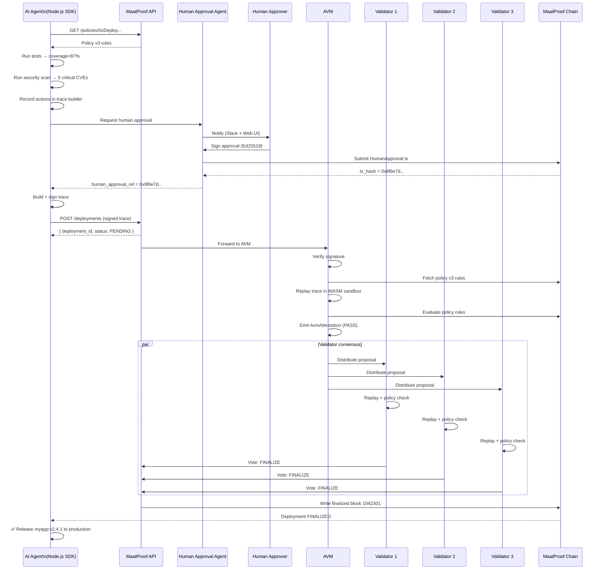

# Example: Basic Agent-Driven Deployment

## Overview

This example walks through a complete, successful agent-driven deployment through MaatProof — from the agent submitting a request to a finalized block on-chain.

**Scenario**: AI agent deploys `myapp:v2.4.1` to production after tests pass and human approval is granted.

---

## Prerequisites

```bash
npm install @maatproof/sdk
```

```javascript
// Configure your agent identity
// agent-key.json contains your Ed25519 keypair
const { MaatClient, MaatIdentity } = require('@maatproof/sdk');

const identity = MaatIdentity.fromKeyFile('./agent-key.json');
const client   = new MaatClient({
  apiUrl:   'https://api.maatproof.dev',
  identity,
});
```

---

## Step-by-Step Walkthrough

### Step 1: Agent Fetches Deployment Policy

```javascript
const POLICY_REF = '0xDeployPolicyContractAddress';

const policy = await client.getPolicy(POLICY_REF);
console.log('Policy version:', policy.version);
console.log('Rules:', policy.rules);
// { no_friday_deploys: true, require_human_approval: true,
//   min_test_coverage: 80, max_critical_cves: 0, ... }
```

### Step 2: Agent Runs Tests and Security Scan (recorded as trace actions)

```javascript
const traceBuilder = client.newTraceBuilder({
  policyRef:     POLICY_REF,
  policyVersion: policy.version,
  artifactHash:  'sha256:a3f8b2c1d4e5f6a7...',
  environment:   'production',
});

// Record test run
traceBuilder.recordToolCall('run_test_suite', {
  input:  { suite: 'integration' },
  output: { passed: 142, failed: 0, coverage_percent: 87 },
});

// Record security scan
traceBuilder.recordToolCall('security_scan', {
  input:  { image: 'myapp:v2.4.1' },
  output: { critical_cves: 0, high_cves: 0, medium_cves: 2 },
});

// Record agent decision
traceBuilder.recordDecision({
  input:  { context: 'coverage=87%, critical_cves=0, policy_version=3' },
  output: { decision: 'PROCEED_TO_DEPLOY', confidence: 0.97 },
});
```

### Step 3: Request Human Approval

```javascript
const approvalRequest = await client.requestHumanApproval({
  deployment_id:     'pre-dep-xyz',
  artifact_hash:     'sha256:a3f8b2c1...',
  deploy_environment:'production',
  expires_in_hours:  24,
  required_approvers: ['alice@example.com'],
});

console.log('Waiting for human approval...');
const approval = await client.waitForApproval(approvalRequest.id, {
  timeoutMs: 24 * 60 * 60 * 1000,
});
console.log('Approval received:', approval.tx_hash);
```

### Step 4: Submit Deployment to MaatProof

```javascript
const trace = traceBuilder
  .setHumanApprovalRef(approval.tx_hash)
  .build();

const deployment = await client.submitDeployment(trace);
console.log('Deployment submitted:', deployment.deployment_id);
console.log('Status:', deployment.status); // "PENDING"
```

### Step 5: Wait for Validators to Finalize

```javascript
const result = await client.pollDeployment(deployment.deployment_id, {
  intervalMs: 5000,
  timeoutMs:  120000,
});

if (result.status === 'FINALIZED') {
  console.log('✅ Deployment FINALIZED');
  console.log('Block height:', result.block_height);
  console.log('Artifact hash:', result.artifact_hash);
  console.log('Trace hash:', result.trace_hash);
  console.log('Validators:', result.validator_signatures.length);
} else {
  console.error('❌ Deployment REJECTED:', result.reject_reason);
}
```

---

## Full Sequence Diagram



---

## Finalized Block Record

```json
{
  "block_height": 1042301,
  "artifact_hash": "sha256:a3f8b2c1d4e5f6a7b8c9d0e1f2a3b4c5d6e7f8a9b0c1d2e3f4a5b6c7d8e9f0a1",
  "trace_hash": "sha256:def456789abcdef0123456789abcdef0123456789abcdef0123456789abcdef01",
  "policy_ref": "0xDeployPolicyContractAddress",
  "policy_version": 3,
  "agent_id": "did:maat:agent:xyz789abc",
  "deploy_environment": "production",
  "human_approval_ref": "0x9f8e7d6c5b4a3f2e1d0c9b8a7f6e5d4c3b2a1f0e",
  "validator_signatures": [
    { "validator": "did:maat:validator:v1", "sig": "ed25519:a1b2c3..." },
    { "validator": "did:maat:validator:v2", "sig": "ed25519:d4e5f6..." },
    { "validator": "did:maat:validator:v3", "sig": "ed25519:g7h8i9..." }
  ],
  "timestamp": "2025-01-15T14:32:00Z"
}
```
