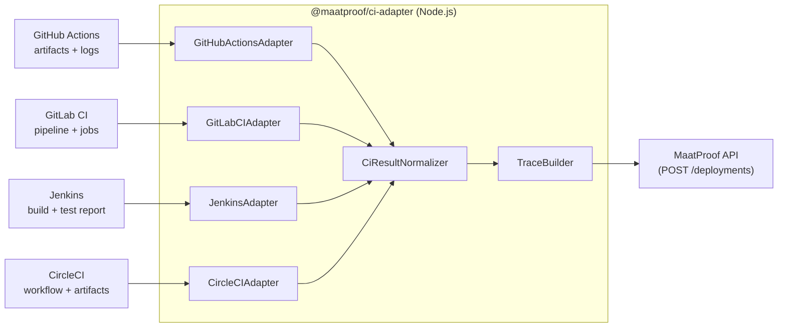

# CI Adapter — Generic CI Integration

## Overview

The MaatProof CI Adapter is a Node.js library that translates the output of any CI system into a MaatProof-compatible reasoning trace. It provides adapters for GitHub Actions, GitLab CI, Jenkins, and CircleCI, normalizing their output into the JSON-LD trace format required by the AVM.

**Implementation**: Node.js  
**Package**: `@maatproof/ci-adapter`  
**Supported CI systems**: GitHub Actions, GitLab CI, Jenkins, CircleCI  

---

## Adapter Architecture



---

## Normalized CI Result Format

All adapters produce a `NormalizedCiResult`:

```typescript
interface NormalizedCiResult {
  // Build info
  build_id:          string;
  commit_sha:        string;
  branch:            string;
  repository:        string;
  triggered_at:      string; // ISO 8601

  // Artifact
  artifact_ref:      string; // image:tag or binary path
  artifact_hash:     string; // sha256:...

  // Test results
  tests_passed:      number;
  tests_failed:      number;
  test_coverage:     number; // percent

  // Security
  critical_cves:     number;
  high_cves:         number;
  cve_ids:           string[];
  sbom_cid?:         string; // IPFS CID of SBOM

  // Metadata
  ci_system:         'github_actions' | 'gitlab_ci' | 'jenkins' | 'circleci';
  raw_logs_url?:     string;
}
```

---

## Adapter Implementations

### GitHub Actions Adapter

```javascript
class GitHubActionsAdapter {
  constructor(octokit, owner, repo) {
    this.octokit = octokit;
    this.owner   = owner;
    this.repo    = repo;
  }

  async extract(workflowRunId) {
    const run = await this.octokit.rest.actions
      .getWorkflowRun({ owner: this.owner, repo: this.repo, run_id: workflowRunId });

    const artifacts = await this.octokit.rest.actions
      .listWorkflowRunArtifacts({ owner: this.owner, repo: this.repo, run_id: workflowRunId });

    const coverage = await this.extractCoverage(artifacts.data.artifacts);
    const security = await this.extractSecurity(artifacts.data.artifacts);

    return {
      build_id:       String(workflowRunId),
      commit_sha:     run.data.head_sha,
      branch:         run.data.head_branch,
      repository:     `${this.owner}/${this.repo}`,
      triggered_at:   run.data.created_at,
      artifact_ref:   await this.getImageRef(artifacts),
      artifact_hash:  await this.getImageHash(artifacts),
      tests_passed:   coverage.passed,
      tests_failed:   coverage.failed,
      test_coverage:  coverage.percent,
      critical_cves:  security.critical,
      high_cves:      security.high,
      cve_ids:        security.cve_ids,
      ci_system:      'github_actions',
    };
  }
}
```

### GitLab CI Adapter

```javascript
class GitLabCIAdapter {
  async extract(projectId, pipelineId) {
    const pipeline = await gitlab.Pipelines.show(projectId, pipelineId);
    const jobs     = await gitlab.PipelineJobs.all(projectId, pipelineId);
    const testJob  = jobs.find(j => j.name === 'test');
    const scanJob  = jobs.find(j => j.name === 'security-scan');

    return {
      build_id:      String(pipelineId),
      commit_sha:    pipeline.sha,
      branch:        pipeline.ref,
      tests_passed:  testJob?.test_report?.total_count ?? 0,
      test_coverage: parseFloat(pipeline.coverage ?? '0'),
      critical_cves: await this.extractCves(scanJob, 'CRITICAL'),
      ci_system:     'gitlab_ci',
      // ... additional fields
    };
  }
}
```

### Jenkins Adapter

```javascript
class JenkinsAdapter {
  async extract(buildUrl) {
    const build    = await jenkinsClient.getBuild(buildUrl);
    const testReport = await jenkinsClient.getTestReport(buildUrl);

    return {
      build_id:      build.id,
      commit_sha:    build.actions.find(a => a._class?.includes('SCM'))?.lastBuiltRevision?.SHA1,
      tests_passed:  testReport.passCount,
      tests_failed:  testReport.failCount,
      test_coverage: await this.extractCoberturaCoverage(buildUrl),
      ci_system:     'jenkins',
      // ... additional fields
    };
  }
}
```

### CircleCI Adapter

```javascript
class CircleCIAdapter {
  async extract(workflowId) {
    const workflow = await circleClient.getWorkflow(workflowId);
    const jobs     = await circleClient.getWorkflowJobs(workflowId);

    return {
      build_id:  workflowId,
      ci_system: 'circleci',
      // ... extract from artifacts and test metadata
    };
  }
}
```

---

## Trace Builder

Once a `NormalizedCiResult` is produced, the `TraceBuilder` converts it into a MaatProof trace:

```javascript
class TraceBuilder {
  build(ciResult, agentIdentity, policyRef, policyVersion) {
    return {
      '@context':     'https://maat.dev/trace/v1',
      trace_id:       crypto.randomUUID(),
      agent_id:       agentIdentity.did,
      policy_ref:     policyRef,
      policy_version: policyVersion,
      artifact_hash:  ciResult.artifact_hash,
      deploy_environment: this.resolveEnvironment(ciResult.branch),
      timestamp:      new Date().toISOString(),
      actions: [
        {
          action_id:   'act-001',
          action_type: 'TOOL_CALL',
          timestamp:   ciResult.triggered_at,
          input:  { tool: 'run_test_suite', ci_system: ciResult.ci_system },
          output: {
            passed:           ciResult.tests_passed,
            failed:           ciResult.tests_failed,
            coverage_percent: ciResult.test_coverage,
          },
          tool_calls: [],
        },
        {
          action_id:   'act-002',
          action_type: 'TOOL_CALL',
          timestamp:   ciResult.triggered_at,
          input:  { tool: 'security_scan', artifact: ciResult.artifact_ref },
          output: {
            critical_cves: ciResult.critical_cves,
            high_cves:     ciResult.high_cves,
            cve_ids:       ciResult.cve_ids,
          },
          tool_calls: [],
        },
        {
          action_id:   'act-003',
          action_type: 'DECISION',
          timestamp:   new Date().toISOString(),
          input:  { context: `coverage=${ciResult.test_coverage}%, critical_cves=${ciResult.critical_cves}` },
          output: { decision: 'PROCEED_TO_DEPLOY', confidence: 1.0 },
          tool_calls: [],
        },
      ],
    };
  }
}
```

---

## CLI Usage

```bash
# GitHub Actions
npx @maatproof/ci-adapter submit \
  --ci github-actions \
  --run-id $GITHUB_RUN_ID \
  --policy-ref 0xDeployPolicyAddress \
  --environment production

# GitLab CI
npx @maatproof/ci-adapter submit \
  --ci gitlab \
  --pipeline-id $CI_PIPELINE_ID \
  --policy-ref 0xDeployPolicyAddress

# Jenkins
npx @maatproof/ci-adapter submit \
  --ci jenkins \
  --build-url $BUILD_URL \
  --policy-ref 0xDeployPolicyAddress

# CircleCI
npx @maatproof/ci-adapter submit \
  --ci circleci \
  --workflow-id $CIRCLE_WORKFLOW_ID \
  --policy-ref 0xDeployPolicyAddress
```
