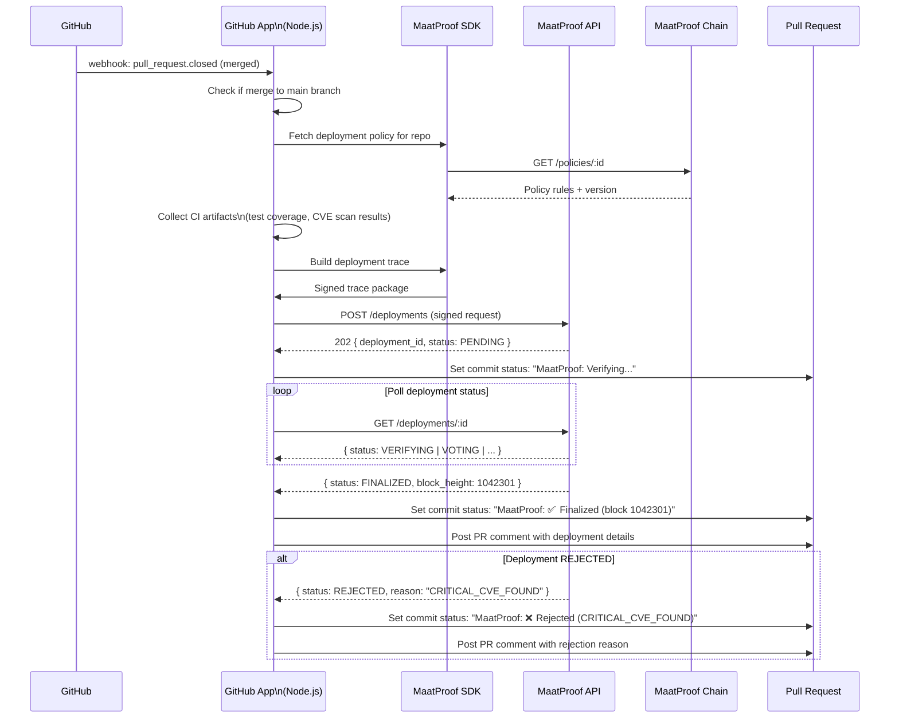

# GitHub App Integration

## Overview

The MaatProof GitHub App integrates with GitHub repositories to automatically trigger MaatProof deployment proposals on code events. It reports deployment status back to pull requests and commit statuses.

**Implementation**: Node.js (Probot framework + `@maatproof/sdk`)  
**Deployment**: Azure App Service / AWS Lambda / GCP Cloud Run  
**Events**: `push`, `pull_request`, `check_suite`  

---

## Integration Flow



---

## Node.js Implementation

```javascript
const { App } = require('@octokit/app');
const { MaatClient, MaatIdentity } = require('@maatproof/sdk');

const app = new App({
  appId: process.env.GITHUB_APP_ID,
  privateKey: process.env.GITHUB_APP_PRIVATE_KEY,
  webhooks: { secret: process.env.GITHUB_WEBHOOK_SECRET },
});

const maatIdentity = MaatIdentity.fromEnv();
const maatClient = new MaatClient({
  apiUrl: process.env.MAAT_API_URL,
  identity: maatIdentity,
});

// Trigger MaatProof deployment on PR merge to main
app.webhooks.on('pull_request.closed', async ({ octokit, payload }) => {
  if (!payload.pull_request.merged) return;
  if (payload.pull_request.base.ref !== 'main') return;

  const { owner, name: repo } = payload.repository;
  const sha = payload.pull_request.merge_commit_sha;

  // Set pending status
  await octokit.rest.repos.createCommitStatus({
    owner, repo, sha,
    state: 'pending',
    context: 'MaatProof',
    description: 'Verifying deployment...',
  });

  try {
    // Collect CI artifacts
    const ciArtifacts = await collectCiArtifacts(octokit, owner, repo, sha);

    // Build and submit deployment
    const deploymentId = await submitDeployment(owner, repo, sha, ciArtifacts);

    // Poll for result
    const result = await pollDeployment(deploymentId);

    if (result.status === 'FINALIZED') {
      await octokit.rest.repos.createCommitStatus({
        owner, repo, sha,
        state: 'success',
        context: 'MaatProof',
        description: `Finalized at block ${result.block_height}`,
        target_url: `https://explorer.maatproof.dev/block/${result.block_height}`,
      });
      await postDeploymentComment(octokit, payload, result);
    } else {
      await octokit.rest.repos.createCommitStatus({
        owner, repo, sha,
        state: 'failure',
        context: 'MaatProof',
        description: `Rejected: ${result.reject_reason}`,
      });
    }
  } catch (err) {
    await octokit.rest.repos.createCommitStatus({
      owner, repo, sha, state: 'error',
      context: 'MaatProof',
      description: 'MaatProof error — check logs',
    });
  }
});

async function submitDeployment(owner, repo, sha, ciArtifacts) {
  const policy = await maatClient.getPolicy(process.env.MAAT_POLICY_REF);
  const trace = maatClient.buildTrace({
    agentId: maatIdentity.did,
    policyRef: policy.ref,
    policyVersion: policy.version,
    artifactHash: ciArtifacts.artifactHash,
    environment: 'production',
    actions: ciArtifacts.traceActions,
  });
  const result = await maatClient.submitDeployment(trace);
  return result.deployment_id;
}
```

---

## Multi-Cloud Deployment

### Azure App Service

```yaml
# azure-pipelines.yml
- task: AzureWebApp@1
  inputs:
    appType: webApp
    appName: maat-github-app
    package: ./dist
  env:
    GITHUB_APP_ID:            $(GITHUB_APP_ID)
    GITHUB_APP_PRIVATE_KEY:   $(GITHUB_APP_PRIVATE_KEY)
    MAAT_API_URL:             https://api.maatproof.dev
    MAAT_KEY_VAULT_URL:       https://maat-github-app.vault.azure.net
```

### AWS Lambda

```yaml
# serverless.yml
functions:
  githubApp:
    handler: dist/index.handler
    events:
      - http: { path: /webhooks/github, method: post }
    environment:
      MAAT_KMS_KEY_ID: !Sub "arn:aws:kms:${AWS::Region}:${AWS::AccountId}:key/..."
```

### GCP Cloud Run

```yaml
# cloudbuild.yaml
steps:
  - name: gcr.io/cloud-builders/docker
    args: [build, -t, gcr.io/$PROJECT_ID/maat-github-app, .]
  - name: gcr.io/cloud-builders/gcloud
    args: [run, deploy, maat-github-app, --image, gcr.io/$PROJECT_ID/maat-github-app]
```

---

## Configuration

```yaml
# .github/maat.yml (in repository)
maat:
  policy_ref: "0xDeployPolicyAddress"
  environments:
    main:
      target: production
      require_human_approval: true
    staging:
      target: staging
      require_human_approval: false
  notifications:
    slack_channel: "#deployments"
```
