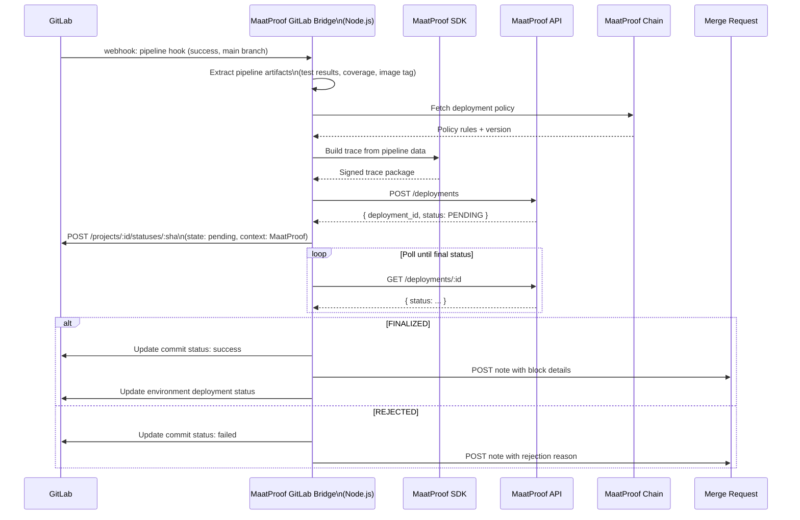

# GitLab Integration

## Overview

The MaatProof GitLab integration bridges GitLab CI/CD pipelines with the MaatProof protocol. It intercepts pipeline completion events, submits deployment proposals to MaatProof, and reports deployment status back to GitLab merge requests and environments.

**Implementation**: Node.js (GitLab webhooks + `@maatproof/sdk`)  
**Deployment**: Azure App Service / AWS Lambda / GCP Cloud Run  
**Triggers**: Pipeline completion, merge request events  

---

## Integration Flow



---

## Node.js Implementation

```javascript
const express = require('express');
const { MaatClient, MaatIdentity } = require('@maatproof/sdk');
const { Gitlab } = require('@gitbeaker/node');

const maatIdentity = MaatIdentity.fromEnv();
const maatClient = new MaatClient({
  apiUrl: process.env.MAAT_API_URL,
  identity: maatIdentity,
});

const gitlab = new Gitlab({ token: process.env.GITLAB_TOKEN });
const app = express();
app.use(express.json());

// GitLab pipeline webhook
app.post('/webhooks/gitlab', async (req, res) => {
  const event = req.headers['x-gitlab-event'];
  if (event !== 'Pipeline Hook') return res.sendStatus(200);

  const { object_attributes: pipeline, project } = req.body;

  // Only process successful pipelines on default branch
  if (pipeline.status !== 'success') return res.sendStatus(200);
  if (pipeline.ref !== project.default_branch) return res.sendStatus(200);

  res.sendStatus(202); // Acknowledge webhook immediately

  try {
    await processPipelineDeployment(project, pipeline);
  } catch (err) {
    console.error('Pipeline processing failed:', err);
  }
});

async function processPipelineDeployment(project, pipeline) {
  // Set pending status on GitLab
  await gitlab.Commits.createStatus(
    project.id,
    pipeline.sha,
    'pending',
    { name: 'MaatProof', description: 'Verifying deployment...' }
  );

  // Collect pipeline artifacts
  const artifacts = await collectGitLabArtifacts(project.id, pipeline.id);

  // Submit deployment to MaatProof
  const policy = await maatClient.getPolicy(process.env.MAAT_POLICY_REF);
  const trace = maatClient.buildTrace({
    agentId: maatIdentity.did,
    policyRef: policy.ref,
    policyVersion: policy.version,
    artifactHash: artifacts.imageHash,
    environment: resolveEnvironment(pipeline.ref),
    actions: buildTraceActions(artifacts),
  });

  const deployment = await maatClient.submitDeployment(trace);
  const result = await maatClient.pollDeployment(deployment.deployment_id);

  if (result.status === 'FINALIZED') {
    await gitlab.Commits.createStatus(project.id, pipeline.sha, 'success', {
      name: 'MaatProof',
      description: `Finalized at block ${result.block_height}`,
      target_url: `https://explorer.maatproof.dev/block/${result.block_height}`,
    });
    // Post MR note if pipeline is associated with an MR
    if (pipeline.merge_request_iid) {
      await gitlab.MergeRequestNotes.create(project.id, pipeline.merge_request_iid, {
        body: formatDeploymentNote(result),
      });
    }
  } else {
    await gitlab.Commits.createStatus(project.id, pipeline.sha, 'failed', {
      name: 'MaatProof',
      description: `Rejected: ${result.reject_reason}`,
    });
  }
}

function formatDeploymentNote(result) {
  return `## ✅ MaatProof Deployment Finalized

| Field | Value |
|---|---|
| Block | ${result.block_height} |
| Artifact | \`${result.artifact_hash.slice(0, 16)}...\` |
| Trace | \`${result.trace_hash.slice(0, 16)}...\` |
| Policy | v${result.policy_version} |
| Validators | ${result.validator_signatures.length} signed |
| Timestamp | ${result.timestamp} |

[View on MaatProof Explorer](https://explorer.maatproof.dev/block/${result.block_height})`;
}
```

---

## GitLab CI/CD Pipeline Example

```yaml
# .gitlab-ci.yml with MaatProof integration
stages:
  - test
  - security
  - maat-submit

test:
  stage: test
  script:
    - npm test -- --coverage
  artifacts:
    reports:
      coverage_report:
        coverage_format: cobertura
        path: coverage/cobertura-coverage.xml

security-scan:
  stage: security
  script:
    - trivy image $CI_REGISTRY_IMAGE:$CI_COMMIT_SHA --format json -o trivy-report.json
  artifacts:
    paths: [trivy-report.json]

maat-deploy:
  stage: maat-submit
  only: [main]
  script:
    - npx @maatproof/cli submit
        --policy-ref $MAAT_POLICY_REF
        --artifact $CI_REGISTRY_IMAGE:$CI_COMMIT_SHA
        --coverage-report coverage/cobertura-coverage.xml
        --security-report trivy-report.json
        --environment production
```

---

## Multi-Cloud Deployment

The GitLab bridge follows the same multi-cloud pattern as the GitHub App:

| Cloud | Service | Config |
|---|---|---|
| **Azure** | App Service | `MAAT_KEY_VAULT_URL` for key storage |
| **AWS** | Lambda | `MAAT_KMS_KEY_ID` for key storage |
| **GCP** | Cloud Run | `MAAT_KMS_KEY_RING` for key storage |

---

## Configuration

```yaml
# maat-gitlab-config.yaml
maat:
  api_url: https://api.maatproof.dev
  policy_ref: "0xDeployPolicyAddress"
  agent_key: "${MAAT_AGENT_KEY_PATH}"

gitlab:
  token: "${GITLAB_TOKEN}"
  webhook_secret: "${GITLAB_WEBHOOK_SECRET}"
  default_environment: production
  branches:
    main: production
    staging: staging
```
