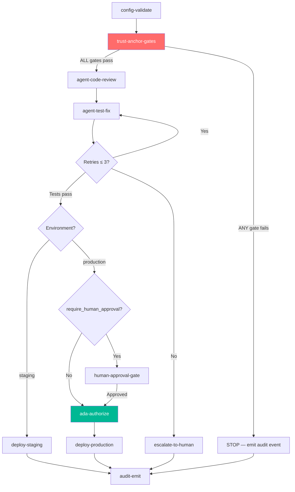
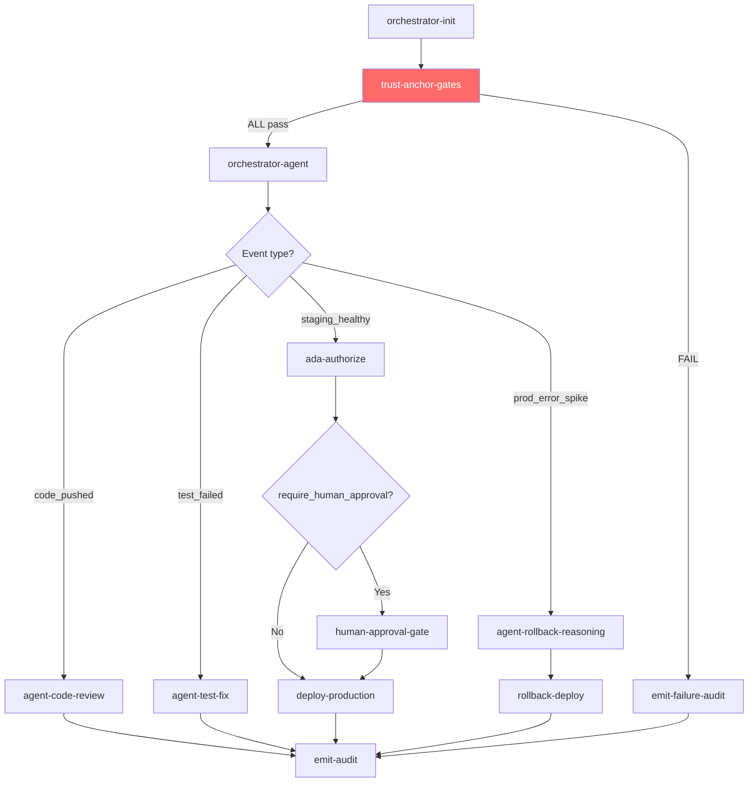

# ACI/ACD GitHub Actions Workflow — Technical Specification

**Version**: 1.0
**Status**: Draft
**Issue**: #133 — [MaatProof ACI/ACD Engine - Core Pipeline] CI/CD Workflow
**Part of**: #13
**Blocked by**: #129 (Configuration)
**Related Specs**: `CONSTITUTION.md`, `specs/proof-chain-spec.md`, `specs/audit-logging-spec.md`,
  `specs/ada-spec.md`, `specs/core-pipeline-infra-spec.md`, `docs/06-security-model.md`

<!-- Addresses EDGE-133-001 through EDGE-133-078 (ACI/ACD CI/CD Workflow edge cases) -->

---

## Overview

This specification defines two complementary GitHub Actions CI/CD workflows for the MaatProof
ACI/ACD Engine:

| Workflow | File | Mode | When Used |
|----------|------|------|-----------|
| **ACI Workflow** | `.github/workflows/aci-pipeline.yml` | Agents augment CI | Existing CI infrastructure; trust anchors run first, agents add reasoning |
| **ACD Workflow** | `.github/workflows/acd-pipeline.yml` | Agents drive pipeline | MaatProof-native deployments; orchestrator is primary driver |

**Key invariants** for both workflows:

1. The deterministic trust anchor layer (`CONSTITUTION.md §2`) MUST always complete before
   any agent step executes. Agents cannot skip or short-circuit trust anchor failures.
2. Every job completion — success OR failure — MUST emit a signed audit event
   (`CONSTITUTION.md §7`).
3. Agent retry loops are bounded at `max_fix_retries = 3` (`CONSTITUTION.md §6`).
4. Production deployments are authorized by ADA 7-condition gate (`specs/ada-spec.md`).
   Human approval is a **policy primitive** (`CONSTITUTION.md §3`) enabled when the
   Deployment Contract declares `require_human_approval`.
5. No agent may approve its own PR; agents may not write to `pull-requests` in an
   approval capacity (`CONSTITUTION.md §10`).

---

## §1 — Workflow Trigger Specification

<!-- Addresses EDGE-133-005, EDGE-133-027, EDGE-133-028 -->

### §1.1 ACI Pipeline Triggers

```yaml
# .github/workflows/aci-pipeline.yml
on:
  push:
    branches:
      - 'feat/**'
      - 'fix/**'
      - 'chore/**'
      - 'refactor/**'
  pull_request:
    types: [opened, synchronize, reopened]
    branches:
      - main
  workflow_dispatch:
    inputs:
      environment:
        required: true
        type: choice
        options: ['dev', 'staging', 'production']
```

### §1.2 ACD Pipeline Triggers

```yaml
# .github/workflows/acd-pipeline.yml
on:
  push:
    branches:
      - main
  workflow_dispatch:
    inputs:
      environment:
        required: true
        type: choice
        options: ['staging', 'production']
      override_reason:
        required: false
        type: string
```

### §1.3 Empty Commit Handling

<!-- Addresses EDGE-133-028 -->

A push with zero file changes (empty commit — git `-allow-empty`) MUST NOT skip the
trust anchor layer. The workflow runs in full but the security scan and lint steps will
trivially pass on an empty diff. The audit event `CODE_PUSHED` is still emitted.

If the artifact signing step finds no artifacts to sign (no build output), it MUST
emit `ARTIFACT_SIGNING_SKIPPED` to the audit log with `result="no_artifacts"` and
the pipeline continues — there is nothing to deploy.

### §1.4 Branch Name Sanitization

<!-- Addresses EDGE-133-027 -->

Branch names containing Unicode characters or emoji are valid Git branch names. Before
a branch name is used in any resource name (e.g., ephemeral environment names,
container image tags, storage account names), it MUST be sanitized per
`CONSTITUTION.md §13.1`: strip non-`[a-z0-9-]`, truncate to 8 chars, append 4-char hash.

The branch name sanitization step MUST run as the first step of any job that uses the
branch name in a resource identifier:

```yaml
    - name: Sanitize branch name for resource identifiers
      id: branch
      run: |
        BRANCH="${{ github.ref_name }}"
        SANITIZED=$(echo "$BRANCH" | tr -cd 'a-z0-9-' | cut -c1-8)
        HASH=$(echo "$BRANCH" | sha256sum | cut -c1-4)
        echo "safe_branch=${SANITIZED}-${HASH}" >> $GITHUB_OUTPUT
```

### §1.5 Large Commit Message Handling

<!-- Addresses EDGE-133-029 -->

Commit messages are extracted structurally (not passed as raw text to an LLM).
The orchestrator invocation script MUST truncate the commit message to 4,096 characters
(matching `proof-chain-spec.md §1 Field Constraints`) before passing to any agent:

```python
COMMIT_MSG_MAX = 4096
commit_message = subprocess.run(
    ["git", "log", "-1", "--format=%s"],
    capture_output=True, text=True
).stdout[:COMMIT_MSG_MAX]
```

If truncation occurs, a `CONTEXT_TRUNCATED` flag is set in the pipeline event metadata
and logged to the audit trail.

---

## §2 — Job Dependency Graph

<!-- Addresses EDGE-133-067, EDGE-133-065 -->

### §2.1 ACI Pipeline Job Graph



**Dependency enforcement** (`CONSTITUTION.md §2` + `EDGE-133-067`):

Every job that invokes agent logic MUST declare `needs: [trust-anchor-gates]` in its
GitHub Actions job definition. A job that references agent tooling without this
`needs:` dependency is a **constitutional violation** and MUST be caught by the
workflow linter (§9.1).

```yaml
jobs:
  config-validate:
    # First: validate all config

  trust-anchor-gates:
    needs: [config-validate]
    # ALL deterministic gates run here

  agent-code-review:
    needs: [trust-anchor-gates]       # ← REQUIRED — no agent step before trust anchor

  agent-test-fix:
    needs: [agent-code-review]

  human-approval-gate:
    needs: [agent-test-fix]           # ← Only after agents complete
    if: ${{ vars.REQUIRE_HUMAN_APPROVAL == 'true' }}

  ada-authorize:
    needs: [agent-test-fix]

  deploy-production:
    needs: [ada-authorize]            # ← or human-approval-gate if policy says so

  audit-emit:
    needs: [deploy-production, deploy-staging, escalate-to-human]
    if: always()                       # ← REQUIRED: always emit, even on failure
```

### §2.2 ACD Pipeline Job Graph



---

## §3 — Trust Anchor Gates Job

<!-- Addresses EDGE-133-012, EDGE-133-067, EDGE-133-068, EDGE-133-076 -->

### §3.1 Required Gates

The `trust-anchor-gates` job MUST run **all five mandatory gates** from `CONSTITUTION.md §2`:

| Gate | Step name | Failure behavior |
|------|-----------|-----------------|
| Lint | `run-lint` | Fail with exit code 1; emit `LINT_FAILED` to audit |
| Compile | `run-compile` | Fail with exit code 1; emit `COMPILE_FAILED` to audit |
| Security scan | `run-security-scan` | Fail with exit code 1; emit `SECURITY_SCAN_FAILED` |
| Artifact signing | `run-artifact-sign` | Fail with exit code 1; emit `ARTIFACT_SIGN_FAILED` |
| Compliance | `run-compliance` | Fail with exit code 1; emit `COMPLIANCE_FAILED` |

### §3.2 Gate Execution Requirements

```yaml
trust-anchor-gates:
  runs-on: ubuntu-latest
  timeout-minutes: 30                  # Hard cap prevents stalled runners (EDGE-133-066)
  permissions:
    contents: read
    checks: write
  steps:
    - uses: actions/checkout@v4

    - uses: actions/setup-python@v5
      with:
        python-version: '3.11'
        cache: 'pip'

    - name: Install dependencies
      run: |
        pip install --upgrade pip
        pip install -r requirements.txt
        pip install ruff bandit pytest
        python -c "from maatproof.proof import ProofBuilder; print('Dependencies OK')" \
          || { echo "PIPELINE-001: Required packages missing"; exit 3; }

    - name: run-lint
      # MUST NOT use continue-on-error: true (EDGE-133-068)
      run: |
        ruff check . --output-format github
        python -m maatproof.audit.emit_step \
          --event LINT_COMPLETE \
          --result "${{ job.status }}" \
          --metadata '{"step":"lint"}'

    - name: run-compile
      run: |
        python -m py_compile $(find maatproof/ -name "*.py" | head -500)
        python -m maatproof.audit.emit_step \
          --event COMPILE_COMPLETE \
          --result "success"

    - name: run-security-scan
      run: |
        bandit -r maatproof/ -ll -f json -o bandit-report.json
        python -m maatproof.audit.emit_step \
          --event SECURITY_SCAN_COMPLETE \
          --result "success" \
          --artifact "bandit-report.json"

    - name: run-artifact-sign
      env:
        MAAT_AUDIT_HMAC_KEY_VERSION: ${{ vars.HMAC_KEY_VERSION }}
        MAAT_AUDIT_HMAC_KEY_2: ${{ secrets.MAAT_AUDIT_HMAC_KEY_2 }}
      run: |
        # Mask signing key before any logging (EDGE-133-042)
        echo "::add-mask::$MAAT_AUDIT_HMAC_KEY_2"
        python -m maatproof.pipeline sign-artifacts \
          --artifacts-dir dist/ \
          --output artifacts.sig.json
        python -m maatproof.audit.emit_step \
          --event ARTIFACT_SIGN_COMPLETE \
          --result "success"

    - name: run-compliance
      run: |
        python -m maatproof.compliance.check \
          --gates "sox,hipaa,soc2" \
          --env "${{ inputs.environment || 'dev' }}"
        python -m maatproof.audit.emit_step \
          --event COMPLIANCE_GATE_COMPLETE \
          --result "success"
```

### §3.3 Gate Failure — Audit Emission

<!-- Addresses EDGE-133-016, EDGE-133-017, EDGE-133-069 -->

When any gate fails, the workflow MUST still emit a signed audit event. This is enforced
by declaring the audit emission step with `if: always()`:

```yaml
    - name: emit-gate-audit-on-any-outcome
      if: always()                     # ← REQUIRED — not 'if: success()'
      env:
        MAAT_AUDIT_HMAC_KEY_2: ${{ secrets.MAAT_AUDIT_HMAC_KEY_2 }}
      run: |
        echo "::add-mask::$MAAT_AUDIT_HMAC_KEY_2"
        python -m maatproof.audit.emit_step \
          --event TRUST_ANCHOR_COMPLETE \
          --result "${{ job.status }}" \
          --metadata '{
            "run_id": "${{ github.run_id }}",
            "sha": "${{ github.sha }}",
            "ref": "${{ github.ref }}",
            "actor": "${{ github.actor }}"
          }'
```

**Rule**: The phrase `if: success()` on any audit emission step is a **constitutional
violation** (`CONSTITUTION.md §7`) and MUST be flagged by the workflow linter (§9.1).

### §3.4 `continue-on-error: false` Enforcement

<!-- Addresses EDGE-133-068 -->

Trust anchor gate steps MUST NOT use `continue-on-error: true`. Setting this flag
would allow an agent step to proceed despite a gate failure, violating
`CONSTITUTION.md §2`.

The workflow linter (§9.1) MUST detect any `continue-on-error: true` on steps within
the `trust-anchor-gates` job and fail the linting run with:

```
PIPELINE-002: continue-on-error: true is prohibited on trust anchor gate step
'{step_name}'. Constitutional violation (CONSTITUTION.md §2). Remove this flag.
```

---

## §4 — Agent Layer Job Specifications

<!-- Addresses EDGE-133-004, EDGE-133-007, EDGE-133-011 -->

### §4.1 Agent Code Review Job

```yaml
agent-code-review:
  needs: [trust-anchor-gates]
  runs-on: ubuntu-latest
  timeout-minutes: 20
  steps:
    - uses: actions/checkout@v4
    - uses: actions/setup-python@v5
      with:
        python-version: '3.11'
        cache: 'pip'
    - run: pip install -r requirements.txt

    - name: Sanitize PR inputs for LLM
      # NEVER pass raw PR body or commit messages directly to LLM
      # (EDGE-133-050, EDGE-133-051, docs/06-security-model.md §Prompt Injection)
      run: |
        python -m maatproof.security.sanitize_inputs \
          --pr-body-file pr_body.txt \
          --commit-msg "${{ github.event.head_commit.message }}" \
          --output sanitized_inputs.json \
          --max-length 4096

    - name: Run code review agent
      env:
        MAAT_MODEL_ID: ${{ vars.MAAT_MODEL_ID || 'claude-opus-4' }}
      run: |
        python -m maatproof.agents.code_review \
          --inputs sanitized_inputs.json \
          --proof-output code-review-proof.json

    - name: Emit audit event
      if: always()
      env:
        MAAT_AUDIT_HMAC_KEY_2: ${{ secrets.MAAT_AUDIT_HMAC_KEY_2 }}
      run: |
        echo "::add-mask::$MAAT_AUDIT_HMAC_KEY_2"
        python -m maatproof.audit.emit_step \
          --event AGENT_CODE_REVIEW_COMPLETE \
          --result "${{ job.status }}" \
          --artifact "code-review-proof.json"
```

### §4.2 Agent Test Fix Job — Bounded Retries

<!-- Addresses EDGE-133-021, EDGE-133-022, EDGE-133-075 -->

The test fix agent implements bounded retry per `CONSTITUTION.md §6`
(`max_fix_retries = 3`). The workflow enforces this at the job level using a
**matrix strategy** or a Python loop with an explicit counter — NOT an unbounded
`while True` loop.

```yaml
agent-test-fix:
  needs: [agent-code-review]
  runs-on: ubuntu-latest
  timeout-minutes: 45           # Hard cap for all retry attempts combined
  env:
    MAX_FIX_RETRIES: '3'        # Must match CONSTITUTION.md §6
  steps:
    - uses: actions/checkout@v4
    - uses: actions/setup-python@v5
      with:
        python-version: '3.11'
        cache: 'pip'
    - run: pip install -r requirements.txt

    - name: Run tests with bounded fix retries
      id: test-fix
      run: |
        python -m maatproof.agents.test_fix_loop \
          --max-retries "$MAX_FIX_RETRIES" \
          --test-command "python -m pytest tests/ -v" \
          --proof-output test-fix-proof.json
        # Exit codes:
        # 0: tests pass
        # 1: tests fail after max retries
        # 2: tests pass after N retries (N < max)
        echo "exit_code=$?" >> $GITHUB_OUTPUT

    - name: Escalate to human on max retries exceeded
      # (EDGE-133-075) — Must notify when max retries hit
      if: steps.test-fix.outputs.exit_code == '1'
      env:
        GITHUB_TOKEN: ${{ secrets.GITHUB_TOKEN }}
      run: |
        python -m maatproof.escalation.notify_human \
          --issue-number "${{ github.event.number || '' }}" \
          --reason "max_fix_retries_exceeded" \
          --proof "test-fix-proof.json" \
          --runbook "docs/runbooks/test-fix-escalation.md"

    - name: Emit audit event
      if: always()
      env:
        MAAT_AUDIT_HMAC_KEY_2: ${{ secrets.MAAT_AUDIT_HMAC_KEY_2 }}
      run: |
        echo "::add-mask::$MAAT_AUDIT_HMAC_KEY_2"
        python -m maatproof.audit.emit_step \
          --event AGENT_TEST_FIX_COMPLETE \
          --result "${{ job.status }}" \
          --metadata "{\"retries\":\"${{ steps.test-fix.outputs.retry_count || '0' }}\"}" \
          --artifact "test-fix-proof.json"
```

**Retry implementation requirements** (`maatproof.agents.test_fix_loop`):

```python
def test_fix_loop(max_retries: int, test_command: str, proof_output: str) -> int:
    """
    Bounded retry loop for test fixing.

    Returns:
        0 — tests pass (may have needed fixes)
        1 — tests fail after max_retries attempts (escalate to human)
        2 — tests pass after N retries

    Raises:
        ValueError if max_retries <= 0 or > 10 (safety bound)
    <!-- Addresses EDGE-133-022 — infinite loop prevention -->
    """
    if max_retries <= 0 or max_retries > 10:
        raise ValueError(f"max_retries must be 1-10; got {max_retries}")

    for attempt in range(max_retries + 1):  # +1 for initial run
        result = subprocess.run(test_command.split(), capture_output=True)
        emit_audit(f"TEST_RUN_{attempt}", result.returncode)

        if result.returncode == 0:
            return 0 if attempt == 0 else 2

        if attempt < max_retries:
            # Agent tries to fix; generates proof step
            agent_fix(result.stderr, attempt, proof_builder)
        else:
            # max_retries exceeded — do NOT continue looping
            return 1
```

### §4.3 Agent Rollback Reasoning Job

```yaml
agent-rollback-reasoning:
  needs: [deploy-production]
  runs-on: ubuntu-latest
  timeout-minutes: 15
  if: failure()   # Triggered when production deploy or runtime guard fires
  steps:
    - uses: actions/checkout@v4
    - uses: actions/setup-python@v5
      with:
        python-version: '3.11'
        cache: 'pip'
    - run: pip install -r requirements.txt

    - name: Generate rollback proof
      run: |
        python -m maatproof.agents.rollback_reason \
          --deployment-id "${{ needs.deploy-production.outputs.deployment_id }}" \
          --metrics-snapshot metrics-snapshot.json \
          --proof-output rollback-proof.json

    - name: Execute rollback
      run: |
        python -m maatproof.ada.rollback \
          --deployment-id "${{ needs.deploy-production.outputs.deployment_id }}" \
          --proof rollback-proof.json \
          --emit-proof

    - name: Emit audit event
      if: always()
      env:
        MAAT_AUDIT_HMAC_KEY_2: ${{ secrets.MAAT_AUDIT_HMAC_KEY_2 }}
      run: |
        echo "::add-mask::$MAAT_AUDIT_HMAC_KEY_2"
        python -m maatproof.audit.emit_step \
          --event ROLLBACK_COMPLETE \
          --result "${{ job.status }}" \
          --artifact "rollback-proof.json"
```

---

## §5 — Human Approval Gate Job

<!-- Addresses EDGE-133-044, EDGE-133-071, EDGE-133-038 -->

### §5.1 Policy-Controlled Activation

Human approval is a **policy primitive** (`CONSTITUTION.md §3`) — it is invoked when
the Deployment Contract declares `require_human_approval`. In GitHub Actions, this
is controlled by a repository variable `REQUIRE_HUMAN_APPROVAL`:

```yaml
human-approval-gate:
  needs: [agent-test-fix]
  runs-on: ubuntu-latest
  timeout-minutes: 1440           # 24 hours (matches core-pipeline-infra-spec.md §5.3)
  environment: production         # GitHub environment with required_reviewers ≥ 1
  if: |
    github.ref == 'refs/heads/main' &&
    vars.REQUIRE_HUMAN_APPROVAL == 'true'
  steps:
    - name: Verify stale proof guard
      # (core-pipeline-infra-spec.md §5.5) — reject stale approvals
      run: |
        python -m maatproof.approval.verify_pending \
          --proof-id "${{ needs.agent-test-fix.outputs.proof_id }}" \
          --max-age-seconds 86400
      # Fails with STALE_APPROVAL_REJECTED if proof is older than 24h

    - name: Emit approval requested audit event
      env:
        MAAT_AUDIT_HMAC_KEY_2: ${{ secrets.MAAT_AUDIT_HMAC_KEY_2 }}
      run: |
        echo "::add-mask::$MAAT_AUDIT_HMAC_KEY_2"
        python -m maatproof.audit.emit_step \
          --event AWAITING_APPROVAL \
          --result "pending" \
          --metadata "{\"proof_id\":\"${{ needs.agent-test-fix.outputs.proof_id }}\"}"

    # GitHub Actions pauses here until environment reviewers approve
    # The environment protection rules enforce the reviewer requirement

    - name: Emit approval decision audit event
      if: always()
      env:
        MAAT_AUDIT_HMAC_KEY_2: ${{ secrets.MAAT_AUDIT_HMAC_KEY_2 }}
      run: |
        echo "::add-mask::$MAAT_AUDIT_HMAC_KEY_2"
        ACTOR="${{ github.event.review.user.login || 'system' }}"
        python -m maatproof.audit.emit_step \
          --event "${{ job.status == 'success' && 'HUMAN_APPROVED' || 'HUMAN_APPROVAL_TIMEOUT' }}" \
          --result "${{ job.status }}" \
          --actor-id "github:${ACTOR}"
```

### §5.2 Reviewer Unavailability

<!-- Addresses EDGE-133-044 -->

The human approval gate follows the escalation path from `core-pipeline-infra-spec.md §5.4`:

- After 8 hours: `APPROVAL_DELAYED` audit event + secondary escalation alert
- After 24 hours (timeout): `HUMAN_APPROVAL_TIMEOUT` event; pipeline blocks
- Recovery path: team lead with `role:architect` extends timeout via `workflow_dispatch`
  with `extend_timeout: true` — this creates a new 24-hour window

### §5.3 GitHub Environment Misconfiguration Check

<!-- Addresses EDGE-133-071 -->

Before the human approval gate job runs, the `config-validate` job MUST verify that
the `production` GitHub environment has `required_reviewers ≥ 1`:

```yaml
config-validate:
  steps:
    - name: Verify GitHub environment has reviewers
      env:
        GH_TOKEN: ${{ secrets.GITHUB_TOKEN }}
      run: |
        REVIEWERS=$(gh api repos/${{ github.repository }}/environments/production \
          --jq '.protection_rules[] | select(.type == "required_reviewers") | .reviewers | length')
        if [ "${REVIEWERS:-0}" -lt "1" ]; then
          echo "PIPELINE-003: GitHub environment 'production' has zero required reviewers."
          echo "This is a misconfiguration per core-pipeline-infra-spec.md §5.1."
          # Emit audit event for the misconfiguration
          python -m maatproof.audit.emit_step \
            --event HUMAN_APPROVAL_BYPASSED \
            --result "misconfiguration_detected"
          exit 1
        fi
```

---

## §6 — ADA Authorization Job

<!-- Addresses EDGE-133-055, EDGE-133-060 -->

The ADA authorization job verifies all 7 ADA conditions (`specs/ada-spec.md`) before
any production deploy proceeds. This job is triggered when `REQUIRE_HUMAN_APPROVAL`
is false (the default ADA mode).

```yaml
ada-authorize:
  needs: [agent-test-fix]
  runs-on: ubuntu-latest
  timeout-minutes: 30
  if: |
    github.ref == 'refs/heads/main' &&
    vars.REQUIRE_HUMAN_APPROVAL != 'true'
  steps:
    - uses: actions/checkout@v4
    - uses: actions/setup-python@v5
      with:
        python-version: '3.11'
        cache: 'pip'
    - run: pip install -r requirements.txt

    - name: Verify all 7 ADA conditions
      run: |
        python -m maatproof.ada.authorize \
          --proof "${{ needs.agent-test-fix.outputs.proof_path }}" \
          --environment production \
          --output ada-authorization.json
        # Exits 1 if any of the 7 conditions is not met

    - name: Emit ADA authorization audit event
      if: always()
      env:
        MAAT_AUDIT_HMAC_KEY_2: ${{ secrets.MAAT_AUDIT_HMAC_KEY_2 }}
      run: |
        echo "::add-mask::$MAAT_AUDIT_HMAC_KEY_2"
        python -m maatproof.audit.emit_step \
          --event ADA_AUTHORIZATION_COMPLETE \
          --result "${{ job.status }}" \
          --artifact "ada-authorization.json"
```

---

## §7 — Production Deploy Job

<!-- Addresses EDGE-133-072, EDGE-133-033, EDGE-133-070 -->

### §7.1 Deploy Job Definition

```yaml
deploy-production:
  needs: [ada-authorize]   # OR [human-approval-gate] when policy requires it
  runs-on: ubuntu-latest
  timeout-minutes: 60      # Hard cap (vrp-cicd-spec.md §Scale and Resource Limits)
  concurrency:
    group: deploy-production
    cancel-in-progress: false   # Never cancel mid-deploy (EDGE-133-072)
  environment:
    name: production
    url: ${{ steps.deploy.outputs.deployment_url }}
  steps:
    - uses: actions/checkout@v4
    - uses: actions/setup-python@v5
      with:
        python-version: '3.11'
        cache: 'pip'
    - run: pip install -r requirements.txt

    - name: Verify artifact signature before deploy
      # (EDGE-133-070) — Artifact must be signed AFTER all trust anchors passed
      run: |
        python -m maatproof.pipeline verify-artifact-signature \
          --artifacts-dir dist/ \
          --signatures artifacts.sig.json

    - name: Export audit log to durable storage (BEFORE deploy)
      # Audit export must succeed before deploy proceeds
      # (vrp-cicd-spec.md §Long-Term Audit Log Retention)
      env:
        MAAT_AUDIT_HMAC_KEY_2: ${{ secrets.MAAT_AUDIT_HMAC_KEY_2 }}
      run: |
        echo "::add-mask::$MAAT_AUDIT_HMAC_KEY_2"
        python -m maatproof.audit.export \
          --output audit-log-${{ github.run_id }}.jsonl \
          --destination "${{ vars.AUDIT_STORAGE_ACCOUNT_URL }}/ci-audit-logs/"
        # Exit 1 if export fails — do NOT deploy without compliance record

    - name: Deploy to production
      id: deploy
      run: |
        python -m maatproof.deploy.production \
          --ada-auth ada-authorization.json \
          --env production

    - name: Start Runtime Guard observation window
      # (specs/ada-spec.md Condition 7)
      run: |
        python -m maatproof.ada.runtime_guard \
          --deployment-id "${{ steps.deploy.outputs.deployment_id }}" \
          --observation-window-secs "${{ vars.RUNTIME_GUARD_WINDOW_SECS || '300' }}" \
          --on-rollback "python -m maatproof.ada.rollback --emit-proof"

    - name: Emit deploy audit event
      if: always()
      env:
        MAAT_AUDIT_HMAC_KEY_2: ${{ secrets.MAAT_AUDIT_HMAC_KEY_2 }}
      run: |
        echo "::add-mask::$MAAT_AUDIT_HMAC_KEY_2"
        python -m maatproof.audit.emit_step \
          --event "${{ job.status == 'success' && 'DEPLOY_SUCCESS' || 'DEPLOY_FAILED' }}" \
          --result "${{ job.status }}" \
          --metadata "{\"deployment_id\":\"${{ steps.deploy.outputs.deployment_id || 'unknown' }}\"}"
```

### §7.2 Audit Export Must Precede Deploy

<!-- Addresses EDGE-133-033 -->

The audit log export step MUST execute before the deploy step. If audit export fails,
the deploy job MUST halt with error:

```
PIPELINE-004: Audit log export to durable storage failed. Production deployment
blocked until compliance evidence can be preserved.
See specs/aci-acd-workflow-spec.md §7.2 and vrp-cicd-spec.md §Long-Term Audit Log Retention.
```

This ensures that no production deployment proceeds without a compliance record.

---

## §8 — Audit Event Emission Requirements

<!-- Addresses EDGE-133-016, EDGE-133-017, EDGE-133-018, EDGE-133-019, EDGE-133-020 -->

### §8.1 Required Audit Events

Every job in the ACI/ACD pipeline MUST emit an audit event on completion (success or
failure). The following table defines required event types:

| Job | Success Event | Failure Event |
|-----|--------------|---------------|
| `config-validate` | `CONFIG_VALIDATED` | `CONFIG_VALIDATION_FAILED` |
| `trust-anchor-gates` | `TRUST_ANCHOR_COMPLETE` | `TRUST_ANCHOR_FAILED` |
| `agent-code-review` | `AGENT_CODE_REVIEW_COMPLETE` | `AGENT_CODE_REVIEW_FAILED` |
| `agent-test-fix` | `AGENT_TEST_FIX_COMPLETE` | `AGENT_TEST_FIX_FAILED` |
| `human-approval-gate` | `HUMAN_APPROVED` | `HUMAN_APPROVAL_TIMEOUT` |
| `ada-authorize` | `ADA_AUTHORIZATION_COMPLETE` | `ADA_AUTHORIZATION_FAILED` |
| `deploy-staging` | `DEPLOY_STAGING_SUCCESS` | `DEPLOY_STAGING_FAILED` |
| `deploy-production` | `DEPLOY_SUCCESS` | `DEPLOY_FAILED` |
| `agent-rollback-reasoning` | `ROLLBACK_COMPLETE` | `ROLLBACK_FAILED` |
| `escalate-to-human` | `ESCALATION_SENT` | `ESCALATION_FAILED` |

### §8.2 Audit Event HMAC Signing

All audit events MUST be signed with HMAC-SHA256 per `CONSTITUTION.md §7` and
`audit-logging-spec.md §2`. The `maatproof.audit.emit_step` module handles signing:

1. HMAC key is read from the environment variable `MAAT_AUDIT_HMAC_KEY_{VERSION}`.
2. The key MUST be masked with `::add-mask::` before any step that logs output.
3. The signed audit event is written to the append-only audit log (SQLite) AND
   uploaded as a GitHub Actions artifact.
4. If the HMAC key is unavailable, `emit_step` MUST exit with code 1 and the job
   MUST fail — unsigned audit events are NOT acceptable.

### §8.3 Audit Emission on Runner Failure

<!-- Addresses EDGE-133-017 -->

If a GitHub Actions runner goes offline mid-job (hardware failure, preemption), the
last in-progress job will be marked as failed by GitHub. The `if: always()` pattern
on audit emission steps ensures the step is attempted, but if the runner is truly
offline, the step cannot run.

Mitigation: The `maatproof.audit.emit_step` module MUST:
1. Write audit events to a local file first (on the runner filesystem)
2. Upload the file as a GitHub Actions artifact (separate `upload-artifact` step)
3. The orchestrator's nightly audit reconciliation job detects missing entries
   (per `audit-logging-spec.md §12.1 EDGE-058`)

### §8.4 Duplicate Event Prevention

<!-- Addresses EDGE-133-018 -->

`emit_step` uses idempotent logging per `audit-logging-spec.md §5.2`. The `entry_id`
is derived deterministically from `github.run_id + github.run_attempt + job_name + event_type`:

```python
import hashlib, uuid

def deterministic_entry_id(run_id: str, attempt: str, job: str, event: str) -> str:
    key = f"{run_id}|{attempt}|{job}|{event}"
    return str(uuid.UUID(hashlib.sha256(key.encode()).hexdigest()[:32]))
```

GitHub Actions may retry failed steps, which would call `emit_step` multiple times
with the same inputs. The `UNIQUE` constraint on `entry_id` (audit-logging-spec.md §1.1)
rejects the duplicate silently.

---

## §9 — Security Hardening

<!-- Addresses EDGE-133-013, EDGE-133-015, EDGE-133-042, EDGE-133-050, EDGE-133-073, EDGE-133-074 -->

### §9.1 Workflow Linter

<!-- Addresses EDGE-133-076 -->

A `workflow-lint` step MUST run on every PR that modifies `.github/workflows/aci-pipeline.yml`
or `.github/workflows/acd-pipeline.yml`. The linter checks:

| Rule | Error Code | Description |
|------|-----------|-------------|
| Trust anchor must precede agents | `LINT-WF-001` | Any job with `agent` in name must have `trust-anchor-gates` in its `needs:` chain |
| No `continue-on-error: true` on gates | `LINT-WF-002` | Constitutional violation (EDGE-133-068) |
| Audit steps must use `if: always()` | `LINT-WF-003` | Steps named `emit-*-audit` must not use `if: success()` |
| GITHUB_TOKEN not used for PR approvals | `LINT-WF-004` | `CONSTITUTION.md §10` |
| No `secrets: inherit` | `LINT-WF-005` | Per `dre-infra-spec.md §11.1` |
| `::add-mask::` before HMAC key | `LINT-WF-006` | Any step using `MAAT_AUDIT_HMAC_KEY_*` must mask it first |
| No `pull_request_target` for secret-bearing jobs | `LINT-WF-007` | `vrp-cicd-spec.md §Fork PR Security` |
| Deploy job must have `concurrency.cancel-in-progress: false` | `LINT-WF-008` | Prevents mid-deploy cancellation |

### §9.2 GITHUB_TOKEN Minimal Permissions

<!-- Addresses EDGE-133-074 -->

```yaml
# Top-level workflow permissions (ACI)
permissions:
  contents: read
  checks: write
  pull-requests: write   # For status comments only; NOT for approvals
  # ← pull-requests: write MUST NOT be used to approve PRs (CONSTITUTION.md §10)
```

**Prohibited in ACI/ACD workflows**:
- `permissions: write-all` — grants excessive access; flagged by LINT-WF-009
- `pull-requests: write` used for `gh pr review --approve` — LINT-WF-004
- `administration: write` — unnecessary; flagged by LINT-WF-009

### §9.3 Fork PR Protection

<!-- Addresses EDGE-133-073 -->

ACI/ACD workflow jobs that access secrets MUST NOT be triggered by `pull_request_target`.

```yaml
# CORRECT — fork PRs run in read-only context
on:
  pull_request:
    types: [opened, synchronize]

# PROHIBITED — fork PRs would get environment secret access
# on:
#   pull_request_target:
```

For fork PRs, the `trust-anchor-gates` job runs in read-only mode (no secret access,
no audit log write, no deploy). The workflow outputs a comment to the PR:
```
Fork PR detected. Trust anchor verification completed read-only.
Secrets-bearing jobs will run after maintainer approval.
```

### §9.4 Prompt Injection Mitigations

<!-- Addresses EDGE-133-050, EDGE-133-051, EDGE-133-052, EDGE-133-053, EDGE-133-054 -->

The following inputs MUST be sanitized before passing to any agent step:

| Input | Mitigation | Spec Reference |
|-------|-----------|----------------|
| PR title and body | `maatproof.security.sanitize_inputs` — max 4,096 chars, strip injection patterns | `docs/06-security-model.md §Prompt Injection` |
| Commit message | Structured extraction (regex/AST), truncated to 4,096 chars | `proof-chain-spec.md §1`, EDGE-133-051 |
| Test runner output | Parsed structurally (exit code + structured report); raw text flagged | `vrp-cicd-spec.md §LLM Hallucination` |
| SBOM metadata | Verified cryptographically; not interpreted by LLM | `docs/06-security-model.md §Supply Chain` |
| Workflow artifact metadata | Content-addressed; agent receives hash, not raw content | `docs/06-security-model.md §Prompt Injection` |

**Injection detection** (`docs/06-security-model.md §Prompt Injection Defenses`):
Traces referencing "ignore previous instructions", "you are now", or other known
injection patterns are automatically rejected. The `sanitize_inputs` step logs
`INJECTION_DETECTED` to the audit trail and blocks the agent invocation.

---

## §10 — Concurrency Settings

<!-- Addresses EDGE-133-001, EDGE-133-004, EDGE-133-005, EDGE-133-006 -->

### §10.1 Per-PR Concurrency

```yaml
# ACI pipeline — cancel stale runs when new commit pushed to same PR
concurrency:
  group: aci-pipeline-${{ github.event.pull_request.number || github.sha }}
  cancel-in-progress: true    # Stale PR runs are safe to cancel
```

### §10.2 Per-Job Concurrency Overrides

| Job | Concurrency group | cancel-in-progress | Rationale |
|-----|------------------|--------------------|-----------|
| `trust-anchor-gates` | `trust-anchor-${{ github.sha }}` | `true` | Safe to cancel |
| `agent-test-fix` | `test-fix-${{ github.sha }}` | `false` | Holds in-progress fix state |
| `deploy-staging` | `deploy-staging` | `false` | Infrastructure state |
| `deploy-production` | `deploy-production` | `false` | Infrastructure state (EDGE-133-072) |
| `human-approval-gate` | `approval-${{ github.sha }}` | `false` | In-progress review |

### §10.3 Simultaneous PR Handling

<!-- Addresses EDGE-133-001, EDGE-133-004 -->

When 50+ PRs trigger the ACI pipeline simultaneously, each PR gets its own concurrency
group (parameterized by PR number). Trust anchor gates for different PRs run in parallel;
production deploys are serialized by the `deploy-production` concurrency group.

**Maximum concurrent pipeline runs**: 200 (limited by orchestrator ACI compute
capacity per `core-pipeline-infra-spec.md §3.3`). GitHub Actions queues additional
runs; no runs are dropped.

### §10.4 ACI and ACD Workflow Simultaneous Trigger

<!-- Addresses EDGE-133-005 -->

The ACI and ACD workflows MUST be in separate YAML files (§Overview). If a `push` to
`main` triggers both (e.g., both workflows have `push: branches: [main]`), they run
independently. To prevent duplicate production deploys, the `deploy-production` job
in BOTH workflows MUST use the same concurrency group `deploy-production`, ensuring
only one deploy runs at a time.

---

## §11 — Failure and Recovery Scenarios

<!-- Addresses EDGE-133-007, EDGE-133-008, EDGE-133-009, EDGE-133-010, EDGE-133-035, EDGE-133-036, EDGE-133-037 -->

### §11.1 LLM Provider Unavailability

<!-- Addresses EDGE-133-007 -->

If the LLM provider is unavailable during an agent step:
1. The agent invocation script MUST retry with exponential backoff:
   `1s → 2s → 4s → 8s → 16s` (5 retries, max ~31 seconds).
2. If all retries fail, the job exits with code 1.
3. The audit event `AGENT_UNAVAILABLE` is emitted with `reason="llm_provider_down"`.
4. The pipeline fails; the orchestrator escalates to a human.

```python
# In maatproof.agents.base
LLM_RETRY_DELAYS = [1, 2, 4, 8, 16]  # seconds

def call_llm_with_retry(prompt: str) -> str:
    for attempt, delay in enumerate(LLM_RETRY_DELAYS):
        try:
            return llm_client.invoke(prompt, timeout=60)
        except (LLMUnavailableError, TimeoutError) as e:
            if attempt == len(LLM_RETRY_DELAYS) - 1:
                raise AgentUnavailableError("LLM provider unavailable after 5 retries") from e
            time.sleep(delay)
```

### §11.2 HMAC Key Unavailable

<!-- Addresses EDGE-133-008, EDGE-133-046 -->

If the HMAC signing key is unavailable when `emit_step` runs:
1. `emit_step` attempts to fetch the key from Azure Key Vault with 3 retries (5s backoff).
2. If the key remains unavailable, `emit_step` exits with code 1.
3. The job fails. **An unsigned audit event is NOT acceptable**.

**GitHub Actions secret rotation race (EDGE-133-046)**: If a new HMAC key secret is
provisioned while a workflow run is in progress, the run continues using the key version
that was loaded at job start. Key rotation MUST follow the procedure in
`audit-logging-spec.md §3.3` — old and new keys overlap for 24 hours. Operators MUST
NOT delete the old key while CI runs are active.

### §11.3 GitHub Actions Runner Failure Mid-Gate

<!-- Addresses EDGE-133-009, EDGE-133-037 -->

If a runner goes offline mid-trust-anchor-gate:
1. GitHub marks the job as failed after the runner timeout.
2. The `deploy-production` job does not run (`needs: [trust-anchor-gates]` unsatisfied).
3. No deployment occurs.
4. The workflow can be re-run via "Re-run failed jobs" in GitHub Actions.

The audit gap (no completion event emitted) is detected by the nightly reconciliation
job (`audit-logging-spec.md §12.1 EDGE-058`). Operators MUST manually emit a
`TRUST_ANCHOR_RUNNER_FAILED` event via `workflow_dispatch` if compliance requires it.

### §11.4 GitHub API Rate Limit

<!-- Addresses EDGE-133-035 -->

The orchestrator invocation scripts MUST implement GitHub API rate limit handling:

```python
# In maatproof.github.client
def api_call_with_rate_limit_retry(endpoint: str, **kwargs) -> dict:
    """
    Retry GitHub API calls on rate limit (HTTP 403 with X-RateLimit-Remaining: 0).
    Backs off until X-RateLimit-Reset timestamp.
    """
    for attempt in range(5):
        response = requests.get(endpoint, **kwargs)
        if response.status_code == 403 and int(response.headers.get('X-RateLimit-Remaining', 1)) == 0:
            reset_time = int(response.headers.get('X-RateLimit-Reset', time.time() + 60))
            wait = max(reset_time - int(time.time()), 1)
            emit_audit("GITHUB_RATE_LIMIT_HIT", result=f"retry_after_{wait}s")
            time.sleep(min(wait, 300))  # Wait up to 5 minutes
            continue
        return response.json()
    raise GitHubRateLimitError("GitHub API rate limit not recovered after 5 retries")
```

### §11.5 Webhook Delivery Failure

<!-- Addresses EDGE-133-036 -->

If a GitHub webhook is not delivered (e.g., orchestrator container is temporarily
unavailable), the `CODE_PUSHED` event may be missed. The orchestrator MUST implement
a **polling fallback**: every 5 minutes, it checks for new commits on monitored
branches that have no corresponding `CODE_PUSHED` audit entry. Any such commits trigger
the pipeline as if the webhook had been received. This prevents silent gap in coverage.

---

## §12 — SLSA and Supply Chain Requirements

<!-- Addresses EDGE-133-077, EDGE-133-078 -->

### §12.1 SLSA Level 3 for Production

Per `docs/06-security-model.md §Supply Chain Security`, production deployments require
SLSA Level 3. The `trust-anchor-gates` job MUST:

1. Generate a SLSA Build Level 3 provenance attestation.
2. Generate a CycloneDX SBOM for all production artifacts.
3. Reject any attempt to deploy a production artifact with an empty SBOM:

```python
def validate_sbom(sbom_path: str) -> None:
    """
    Validate SBOM is non-empty and well-formed.
    <!-- Addresses EDGE-133-078 — empty SBOM check -->
    """
    if not os.path.exists(sbom_path):
        raise SBOMError("SBOM file not found; cannot deploy to production")

    sbom_size = os.path.getsize(sbom_path)
    if sbom_size == 0:
        raise SBOMError(
            f"SBOM file '{sbom_path}' is 0 bytes. A 0-byte SBOM means no "
            "software components were captured. This is a sign of a broken "
            "SBOM generator, not an empty artifact. Production deploy blocked."
        )

    with open(sbom_path) as f:
        sbom = json.load(f)
    if len(sbom.get("components", [])) == 0:
        raise SBOMError(
            "SBOM contains 0 components. A valid SBOM for any non-trivial "
            "artifact must list its dependencies. Deploy blocked."
        )
```

### §12.2 Artifact Signing Sequence

<!-- Addresses EDGE-133-070 -->

The artifact signing step MUST run AFTER the security scan, not before. The correct
sequence within `trust-anchor-gates` is:

```
Lint → Compile → Security Scan → [SBOM generation] → Artifact Sign → Compliance
```

Artifact signing before the security scan would create a valid signature over an
artifact that might subsequently be found to have CVEs. The linter enforces this order.

---

## §13 — Scale and Resource Limits

<!-- Addresses EDGE-133-002, EDGE-133-003, EDGE-133-024 -->

| Parameter | Limit | Enforcement |
|-----------|-------|-------------|
| Max concurrent pipeline runs | 200 | Orchestrator ACI capacity (`core-pipeline-infra-spec.md §3.3`) |
| Max artifact size for signing | 500 MB | `run-artifact-sign` pre-check; fail with `ARTIFACT_TOO_LARGE` |
| Max security scan artifact | 500 MB | Bandit/Semgrep pre-check |
| Max commit message length passed to agent | 4,096 chars | Truncated (§1.5) |
| Max `trust-anchor-gates` job duration | 30 min | `timeout-minutes: 30` |
| Max `agent-test-fix` job duration | 45 min | `timeout-minutes: 45` |
| Max `human-approval-gate` job duration | 1,440 min | `timeout-minutes: 1440` |
| Max `deploy-production` job duration | 60 min | `timeout-minutes: 60` |
| Max audit log entries per workflow run | 10,000 | `audit-logging-spec.md §10` |
| Audit log long-term retention | ≥ 7 years | Azure Blob WORM (`core-pipeline-infra-spec.md §1.4`) |

---

## §14 — Error Code Reference

| Code | Job | Description |
|------|-----|-------------|
| `PIPELINE-001` | all | Required Python packages missing |
| `PIPELINE-002` | lint | `continue-on-error: true` on trust anchor step |
| `PIPELINE-003` | config-validate | GitHub environment has 0 required reviewers |
| `PIPELINE-004` | deploy-production | Audit log export failed; deploy blocked |
| `PIPELINE-005` | trust-anchor | Empty artifact directory — nothing to sign |
| `PIPELINE-006` | trust-anchor | SBOM is 0 bytes or empty components |
| `PIPELINE-007` | agent-test-fix | max_fix_retries exceeded; escalating to human |
| `PIPELINE-008` | human-approval | Stale proof detected; approval rejected |
| `PIPELINE-009` | ada-authorize | ADA 7-condition check failed |
| `PIPELINE-010` | agent | LLM provider unavailable after retries |
| `PIPELINE-011` | audit | HMAC key unavailable; audit emission blocked |
| `PIPELINE-012` | all | Prompt injection pattern detected in input |
| `PIPELINE-013` | deploy | Artifact signature invalid before deploy |

---

## §15 — Compliance Mapping

<!-- Addresses EDGE-133-031, EDGE-133-032 -->

| Compliance Requirement | Implementation |
|-----------------------|----------------|
| SOX 7-year audit retention | Audit export to WORM Azure Blob before deploy (§7.2); `audit-logging-spec.md §8.1` |
| HIPAA audit controls | `HUMAN_APPROVED`/`HUMAN_REJECTED` events include `actor_id` (DID); `audit-logging-spec.md §1.2 EDGE-063` |
| SOC 2 CC8.1 Change management | Every deploy: trust anchor pass + ADA authorization + audit record |
| EU AI Act human oversight | `require_human_approval` policy primitive available for high-risk deployments |
| GitHub Actions log retention | Default 90 days insufficient; structured audit export to durable store required before deploy |

---

## References

- Issue #133 — [MaatProof ACI/ACD Engine - Core Pipeline] CI/CD Workflow
- Issue #129 — [Configuration] (blocking)
- Issue #13 — [Core Pipeline Epic]
- `CONSTITUTION.md` §2, §3, §4, §5, §6, §7, §10, §13
- `specs/proof-chain-spec.md` — Cryptographic proof chain
- `specs/audit-logging-spec.md` — Audit log specification
- `specs/ada-spec.md` — Autonomous Deployment Authority
- `specs/vrp-cicd-spec.md` — VRP CI/CD workflow (reference)
- `specs/core-pipeline-infra-spec.md` — Core pipeline infrastructure
- `docs/06-security-model.md` — Security model and prompt injection defenses
- `docs/07-regulatory-compliance.md` — Regulatory compliance requirements
