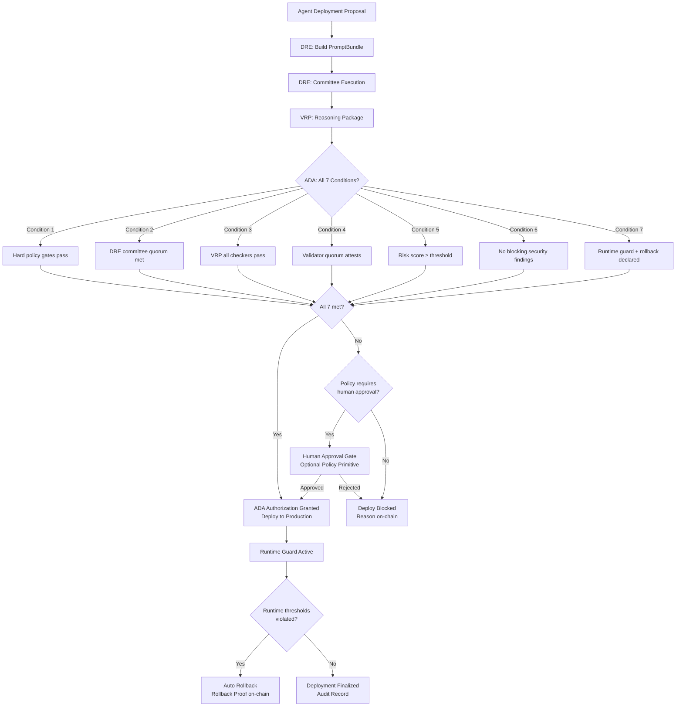
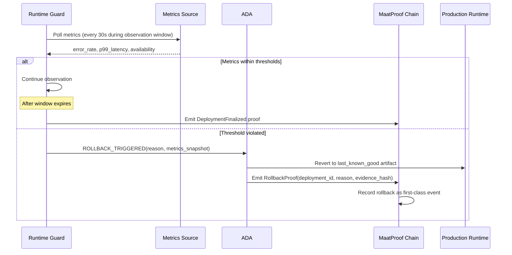
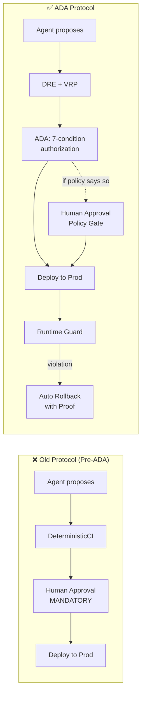

# Autonomous Deployment Authority (ADA) Specification

## Overview

The Autonomous Deployment Authority (ADA) is the protocol-level authorization mechanism that
replaces mandatory human approval for production deployments. ADA is activated once the
Deterministic Reasoning Engine (DRE) and Verifiable Reasoning Protocol (VRP) are in place.

**ADA is the protocol default.** Human approval remains available as a policy primitive for
teams that need it — but it is no longer required at the protocol level.

## Whitepaper Reference

Section 3.7 — "Autonomous Deployment Authority (ADA)"

> "Autonomous Deployment Authority (ADA) replaces constitutional human approval with a
> deterministic multi-signal authorization function. A production deployment may proceed
> automatically only when all of the following are true..."
>
> "The protocol default is therefore: the agent proposes, the proof authorizes, the chain
> records, and the runtime guard can reverse."

Section 5.3 — "Human Approval Becomes a Policy Primitive, Not a Constitutional Requirement"

> "In MaatProof, production deployment authority comes from cryptographic proof: canonical
> evidence, admissible reasoning, committee convergence, validator attestation, and runtime
> guard declarations. Human approval is therefore no longer a protocol-level requirement."

## Authorization Flow



## The 7 ADA Conditions

A production deployment proceeds autonomously only when **all** of the following are true:

### Condition 1: All Hard Policy Gates Pass

Every rule in the referenced Deployment Contract evaluates to `true`. These include:
- Test coverage threshold
- CVE scan clearance
- Agent minimum stake
- Day-of-week restrictions
- Environment-specific rules

```rust
fn all_policy_gates_pass(
    policy: &DeployPolicy,
    evidence: &EvidenceBundle,
) -> bool {
    policy.rules.iter().all(|rule| rule.evaluate(evidence))
}
```

### Condition 2: DRE Committee Quorum Satisfied

The Deterministic Reasoning Engine must have achieved its configured N-of-M committee quorum
on the same `DecisionTuple` with `decision = Approve`.

```rust
fn dre_quorum_met(cert: &CommitteeCertificate, config: &CommitteeConfig) -> bool {
    cert.quorum.achieved >= config.quorum_threshold
    && cert.decision_tuple.decision == DeployDecision::Approve
}
```

### Condition 3: VRP Checker Set Validates

Every admissible reasoning step in the VRP `ReasoningPackage` must have been validated by its
registered deterministic checker. No checker may return `Invalid` or `Inconclusive`.

```rust
fn vrp_all_checkers_passed(pkg: &ReasoningPackage) -> bool {
    pkg.authorization.all_checkers_passed
    && pkg.authorization.failed_checkers.is_empty()
}
```

### Condition 4: Validator Quorum Attests

The Proof-of-Reasoning Consensus validator committee must have achieved 2/3 supermajority
attesting `ACCEPT` on the same reasoning Merkle root.

```rust
fn validator_quorum_attests(block: &PendingBlock, validator_set: &ValidatorSet) -> bool {
    let accept_stake: u64 = block.votes.iter()
        .filter(|v| v.verdict == Verdict::Accept)
        .map(|v| validator_set.stake_of(&v.validator_did))
        .sum();
    accept_stake * 3 >= validator_set.total_stake() * 2
}
```

### Condition 5: Risk Score Exceeds Threshold

The deterministic risk score computed by the DRE must meet or exceed the configured minimum.
The risk score is a versioned function over structured inputs — **not an LLM opinion**.

```rust
pub struct RiskScore {
    /// 0–1000 integer score (higher = lower risk)
    pub score: u32,
    /// Inputs used to compute the score
    pub inputs: RiskInputs,
    /// Version of the scoring function
    pub function_version: String,
}

pub struct RiskInputs {
    pub change_size_lines: u32,
    pub scan_severity_max: Severity,
    pub historical_rollback_rate: f32,    // 0.0–1.0
    pub committee_agreement_pct: f32,     // 0.0–1.0
    pub validator_agreement_pct: f32,     // 0.0–1.0
    pub service_criticality: Criticality, // Low / Medium / High / Critical
}

// Default thresholds
const MIN_RISK_SCORE_STAGING: u32 = 400;
const MIN_RISK_SCORE_PRODUCTION: u32 = 700;
```

### Condition 6: No Blocking Security Findings

The security scan must have zero critical or high severity findings. This condition cannot be
waived by any agent or policy rule — it is a hard stop.

| Severity | Blocking |
|---|---|
| Critical | Always blocking |
| High | Always blocking |
| Medium | Configurable via policy |
| Low | Never blocking |

### Condition 7: Runtime Guard with Rollback Instructions Declared

Every autonomous production deployment must declare:
- Rollout strategy (canary / blue-green / rolling)
- Observation window duration
- Rollback thresholds (error rate, latency, availability)
- Metrics source (endpoint + credentials)
- Last-known-good artifact reference

```rust
pub struct RuntimeGuard {
    pub strategy: RolloutStrategy,
    pub observation_window_secs: u64,
    pub rollback_thresholds: RollbackThresholds,
    pub metrics_source: MetricsSource,
    pub last_known_good: ArtifactReference,
}

pub struct RollbackThresholds {
    pub error_rate_max: f32,         // e.g., 0.01 = 1%
    pub p99_latency_max_ms: u64,
    pub availability_min: f32,       // e.g., 0.999 = 99.9%
    pub evaluation_window_secs: u64,
}
```

## ADA Authorization Record

When ADA grants authorization, it emits a signed `AdaAuthorization` that is included in the
deployment block:

```rust
pub struct AdaAuthorization {
    pub deployment_id: [u8; 32],
    pub prompt_bundle_hash: [u8; 32],
    pub reasoning_root: [u8; 32],
    pub committee_certificate_hash: [u8; 32],
    pub validator_block_hash: [u8; 32],
    pub risk_score: RiskScore,
    pub runtime_guard: RuntimeGuard,
    pub conditions_verified: [bool; 7],
    pub authorized_at: u64,
    pub ada_version: String,
}
```

## Human Approval as Policy Primitive

Human approval is no longer a protocol-level requirement. It is one policy gate among many,
available for teams that want it.

### When to Use Human Approval Gates

Regulated workloads, novel migrations, or exceptional risk classes may still declare a
human attestation rule in their Deployment Contract:

```solidity
contract DeployPolicy {
    // Standard rules (ADA handles these automatically)
    rule test_coverage_gate: coverage >= 80;
    rule no_known_cves: securityScan.critical == 0;
    rule agent_stake_minimum: agent.stakedMAAT >= 1000;

    // Optional: human approval for production (policy primitive, not protocol mandate)
    rule require_human_approval: stage == PRODUCTION;

    // Or scope it more narrowly
    rule require_human_approval:
        stage == PRODUCTION && (serviceClass == "CRITICAL" || isFirstDeploy());
}
```

When `require_human_approval` is in the policy, the `HumanApprovalAgent` is invoked as part
of Condition 1 (policy gates). ADA waits for the on-chain `HumanApproval` attestation before
proceeding.

### Architectural Distinction

| Model | Human Approval |
|---|---|
| **Old (pre-ADA)** | Universal protocol mandate; no autonomous deploy possible |
| **New (ADA default)** | Policy primitive; declared in Deployment Contract when needed |
| **Regulated workloads** | Use `require_human_approval` rule in their contract |
| **Emergency fixes** | May use accelerated SLA policy or temporarily remove the gate |

## Rollback as Trust Protocol

In MaatProof, rollback is not an operational afterthought — it is part of the trust protocol.



### Rollback Proof Structure

```rust
pub struct RollbackProof {
    pub deployment_id: [u8; 32],
    pub trigger_reason: RollbackReason,
    pub metrics_snapshot: MetricsSnapshot,
    pub reverted_to_artifact: ArtifactReference,
    pub rollback_at: u64,
    pub runtime_guard_hash: [u8; 32],
    pub proof_signature: [u8; 64], // Ed25519
}

pub enum RollbackReason {
    ErrorRateExceeded { actual: f32, threshold: f32 },
    LatencyExceeded { actual_p99_ms: u64, threshold_ms: u64 },
    AvailabilityDegraded { actual: f32, threshold: f32 },
    ManualOverride { requester_did: String },
}
```

## ADA vs Old Pipeline Comparison



## Implementation Notes

### Python Reference Implementation

The `maatproof` Python package supports ADA via the `require_human_approval` flag in
`PipelineConfig`. Setting it to `False` enables ADA mode:

```python
from maatproof.pipeline import MaatProofPipeline, PipelineConfig

# ADA mode: no mandatory human approval (default protocol behavior)
config = PipelineConfig(
    name="my-service",
    secret_key=b"...",
    model_id="claude-opus-4",
    require_human_approval=False,  # ADA handles authorization
    max_fix_retries=3,
)

# Legacy mode: human approval still required (for regulated workloads)
config_regulated = PipelineConfig(
    name="hipaa-service",
    secret_key=b"...",
    model_id="claude-opus-4",
    require_human_approval=True,  # policy gate enabled
    max_fix_retries=3,
)
```

## Security Considerations

### Risk Score Integrity

- The risk score function version is pinned in the PromptBundle and verified by validators
- Validators independently recompute the risk score and reject blocks where it diverges
- The scoring function is on-chain and can only be changed by governance vote

### Condition Atomicity

- All 7 conditions must be verified in a single atomic check before authorization is granted
- Partial authorization (e.g., "6 of 7 conditions met") is not valid
- Condition verification results are included in the `AdaAuthorization` record

### Runtime Guard Bypass Prevention

- The runtime guard endpoint must be declared in the Deployment Contract — not in the agent request
- Agents cannot self-declare their own rollback thresholds (would allow setting `error_rate_max = 1.0`)
- Threshold values are validated against policy minimums during Condition 1

---

## Python ADA Reference Implementation — Signal Scoring & Authority Model

<!-- Addresses EDGE-ADA-001, EDGE-ADA-002, EDGE-ADA-003, EDGE-ADA-004, EDGE-ADA-005,
     EDGE-ADA-006, EDGE-ADA-007, EDGE-ADA-010, EDGE-ADA-011, EDGE-ADA-013,
     EDGE-ADA-014, EDGE-ADA-015, EDGE-ADA-016, EDGE-ADA-017, EDGE-ADA-018,
     EDGE-ADA-019, EDGE-ADA-020, EDGE-ADA-023, EDGE-ADA-024, EDGE-ADA-025,
     EDGE-ADA-026, EDGE-ADA-027, EDGE-ADA-028, EDGE-ADA-029, EDGE-ADA-030,
     EDGE-ADA-034, EDGE-ADA-036, EDGE-ADA-038, EDGE-ADA-039, EDGE-ADA-047,
     EDGE-ADA-048, EDGE-ADA-056, EDGE-ADA-057, EDGE-ADA-067, EDGE-ADA-068,
     EDGE-ADA-069, EDGE-ADA-070 -->

The `maatproof` Python package implements a **Python-layer ADA model** that maps the
7-condition binary protocol authorization onto a **5-signal weighted composite score**
suitable for rule-based authority-level classification and unit testing.  This section
is the authoritative specification for the Python reference implementation used in
`maatproof/ada.py` and tested in `tests/test_ada.py`.

> **Scope clarification**: The Rust/on-chain layer uses the 7-condition binary
> authorization model (Conditions 1–7 above).  The Python layer computes a continuous
> composite score [0, 1] that serves as a proxy for those conditions in environments
> where the full Rust stack is not yet deployed.

---

### §P1 — Multi-Signal Deployment Scoring

<!-- Addresses EDGE-ADA-001 through EDGE-ADA-012 -->

A deployment receives a **composite_score ∈ [0.0, 1.0]** computed from five weighted
signals.  The signals and their weights are fixed at the protocol level; tests MUST
verify each weight independently.

| Signal | Weight | Maps to ADA Condition |
|---|---|---|
| `deterministic_gates` | **0.25** (25 %) | Condition 1 — Hard policy gates pass |
| `dre_consensus` | **0.20** (20 %) | Condition 2 — DRE committee quorum |
| `logic_verification` | **0.20** (20 %) | Condition 3 — VRP checker set validates |
| `validator_attestation` | **0.20** (20 %) | Condition 4 — Validator quorum attests |
| `risk_score` | **0.15** (15 %) | Condition 5 — Risk score ≥ threshold |

**Invariants that unit tests MUST verify:**

1. The five weights sum to exactly **1.0** (within floating-point epsilon 1e-9).
2. Each individual signal value MUST be in **[0.0, 1.0]**; values outside this range
   MUST raise `ValueError`.
3. The composite score MUST be in **[0.0, 1.0]** for any valid input combination.
4. Setting a single signal to 0.0 while all others are 1.0 MUST reduce the composite
   score by that signal's weight (e.g., `deterministic_gates=0` → score ≤ 0.75).
5. If any signal value is `NaN` or `±inf`, a `ValueError` MUST be raised before
   score computation.

```python
@dataclass
class DeploymentSignals:
    """Input signals for the ADA composite scoring function."""
    deterministic_gates:  float  # [0.0, 1.0]  — Condition 1 proxy
    dre_consensus:        float  # [0.0, 1.0]  — Condition 2 proxy
    logic_verification:   float  # [0.0, 1.0]  — Condition 3 proxy
    validator_attestation: float  # [0.0, 1.0]  — Condition 4 proxy
    risk_score:           float  # [0.0, 1.0]  — Condition 5 proxy

SIGNAL_WEIGHTS: dict[str, float] = {
    "deterministic_gates":   0.25,
    "dre_consensus":         0.20,
    "logic_verification":    0.20,
    "validator_attestation": 0.20,
    "risk_score":            0.15,
}

def compute_deployment_score(signals: DeploymentSignals) -> float:
    """
    Aggregate five weighted signals into a composite score ∈ [0.0, 1.0].

    Raises:
        ValueError: if any signal value is outside [0.0, 1.0] or is non-finite.
    """
    score = (
        signals.deterministic_gates   * SIGNAL_WEIGHTS["deterministic_gates"]   +
        signals.dre_consensus         * SIGNAL_WEIGHTS["dre_consensus"]         +
        signals.logic_verification    * SIGNAL_WEIGHTS["logic_verification"]    +
        signals.validator_attestation * SIGNAL_WEIGHTS["validator_attestation"] +
        signals.risk_score            * SIGNAL_WEIGHTS["risk_score"]
    )
    return round(score, 10)  # prevent floating-point drift beyond 10 decimals
```

---

### §P2 — Python RiskAssessment Data Model

<!-- Addresses EDGE-ADA-013 through EDGE-ADA-022 -->

The Python `RiskAssessment` captures the **change-level risk inputs** that feed into
the `risk_score` signal.  These fields differ from the Rust-layer `RiskInputs`
(which are DRE committee inputs) — the Python layer uses developer-visible metrics.

| Field | Type | Description | High-Risk Threshold |
|---|---|---|---|
| `files_changed` | `int ≥ 0` | Total files modified in the change set | ≥ 50 files |
| `lines_changed` | `int ≥ 0` | Total lines added + deleted | ≥ 500 lines |
| `critical_paths_touched` | `bool` | Change touches security/auth/payments code | `True` |
| `new_dependencies` | `int ≥ 0` | Net new third-party packages introduced | ≥ 5 packages |
| `test_coverage_delta` | `float` | Change in coverage %: negative = regression | < −5 % |
| `security_scan_findings` | `int ≥ 0` | Count of Critical + High CVE findings | ≥ 1 finding |

**Risk Penalty Calculations** — unit tests MUST verify each independently:

```python
def compute_risk_score(ra: RiskAssessment) -> float:
    """
    Compute a risk score ∈ [0.0, 1.0] from a RiskAssessment.
    Higher score = lower risk (same convention as the Rust RiskScore 0-1000).
    A score of 0.0 indicates maximum risk; 1.0 indicates minimum risk.

    Penalty rules (applied multiplicatively):
      - files_changed ≥ 50      → ×0.80 penalty
      - lines_changed ≥ 500     → ×0.80 penalty
      - critical_paths_touched  → ×0.70 penalty
      - new_dependencies ≥ 5    → ×0.85 penalty
      - test_coverage_delta < −5→ ×0.75 penalty
      - security_scan_findings ≥ 1 → score = 0.0  (hard stop, non-negotiable)

    Raises:
        ValueError: if security_scan_findings < 0 or any int field < 0.
    """
    if ra.security_scan_findings >= 1:
        return 0.0   # maps to Condition 6 hard stop — always blocking
    score = 1.0
    if ra.files_changed >= 50:        score *= 0.80
    if ra.lines_changed >= 500:       score *= 0.80
    if ra.critical_paths_touched:     score *= 0.70
    if ra.new_dependencies >= 5:      score *= 0.85
    if ra.test_coverage_delta < -5.0: score *= 0.75
    return round(score, 10)
```

> **Spec invariant**: `security_scan_findings ≥ 1` returns **exactly 0.0** regardless
> of all other field values.  This mirrors the Condition 6 hard stop (Critical/High
> CVEs are always blocking and cannot be offset by other signals).

**Edge-case invariants unit tests MUST verify:**

| Scenario | Expected Result |
|---|---|
| All fields at zero-risk values | `risk_score = 1.0` |
| `security_scan_findings = 1` with all other fields at zero risk | `risk_score = 0.0` |
| `critical_paths_touched = True` alone | `risk_score = 0.70` |
| All 5 non-security penalty conditions triggered simultaneously | `risk_score ≈ 0.80×0.80×0.70×0.85×0.75 = 0.2856` |
| `test_coverage_delta = +50.0` (large improvement) | No penalty; `risk_score` unchanged |
| `files_changed = 49` (just below threshold) | No penalty |
| `files_changed = 50` (at threshold) | `×0.80` penalty applied |

---

### §P3 — Deployment Authority Levels

<!-- Addresses EDGE-ADA-023 through EDGE-ADA-033 -->

The composite score is mapped to a `DeploymentAuthorityLevel` via the following
threshold table.  Thresholds are **inclusive lower bounds** (score ≥ threshold → level).

```python
class DeploymentAuthorityLevel(enum.Enum):
    FULL_AUTONOMOUS          = "full_autonomous"          # score ≥ 0.90
    AUTONOMOUS_WITH_MONITORING = "autonomous_with_monitoring"  # 0.75 ≤ score < 0.90
    STAGING_AUTONOMOUS       = "staging_autonomous"       # 0.50 ≤ score < 0.75
    DEV_AUTONOMOUS           = "dev_autonomous"           # 0.25 ≤ score < 0.50
    BLOCKED                  = "blocked"                  # score < 0.25

# Score threshold constants (unit tests MUST import and test these directly)
AUTHORITY_THRESHOLD_FULL       = 0.90
AUTHORITY_THRESHOLD_AUTO_MON   = 0.75
AUTHORITY_THRESHOLD_STAGING    = 0.50
AUTHORITY_THRESHOLD_DEV        = 0.25
```

**Boundary invariants unit tests MUST verify:**

| Score | Expected Level |
|---|---|
| `1.00` | `FULL_AUTONOMOUS` |
| `0.90` | `FULL_AUTONOMOUS` |
| `0.8999…` | `AUTONOMOUS_WITH_MONITORING` |
| `0.75` | `AUTONOMOUS_WITH_MONITORING` |
| `0.7499…` | `STAGING_AUTONOMOUS` |
| `0.50` | `STAGING_AUTONOMOUS` |
| `0.4999…` | `DEV_AUTONOMOUS` |
| `0.25` | `DEV_AUTONOMOUS` |
| `0.2499…` | `BLOCKED` |
| `0.00` | `BLOCKED` |

**Boundary precision**: comparisons use strict `>=` for the lower bound.
`0.25 - sys.float_info.epsilon` MUST map to `BLOCKED`.

---

### §P4 — Python-Layer Rollback Trigger Metrics

<!-- Addresses EDGE-ADA-034 through EDGE-ADA-045 -->

The Python auto-rollback protocol polls metrics every ≤ 15 seconds during a
**15-minute observation window**.  Rollback is triggered if ANY single threshold is
violated.  The Python layer extends the Rust `RollbackReason` enum with two
additional triggers relevant to cloud-native deployments:

```python
class RollbackTrigger(enum.Enum):
    ERROR_RATE_EXCEEDED  = "error_rate_exceeded"    # error_rate > error_rate_max
    LATENCY_EXCEEDED     = "latency_exceeded"       # p99_latency_ms > p99_latency_max_ms
    CPU_EXCEEDED         = "cpu_exceeded"           # cpu_utilization > cpu_utilization_max
    HEALTH_CHECK_FAILED  = "health_check_failed"    # health_check_url returns non-2xx
    AVAILABILITY_DEGRADED = "availability_degraded" # availability < availability_min

@dataclass
class RollbackThresholdsPython:
    """
    Python-layer rollback thresholds.  Extends the Rust RollbackThresholds with
    CPU and health-check triggers.

    All fields have defaults that represent reasonable production safety limits.
    """
    error_rate_max:       float = 0.01    # 1%  error rate ceiling
    p99_latency_max_ms:   int   = 2000    # 2 s  p99 latency ceiling
    cpu_utilization_max:  float = 0.90    # 90% CPU utilization ceiling
    health_check_url:     str   = ""      # URL; empty string disables this trigger
    availability_min:     float = 0.999   # 99.9% minimum availability
    evaluation_window_secs: int = 900     # 15-minute observation window
    poll_interval_secs:   int   = 15      # poll every 15 s (≤ 15 s per AC)
```

**Rollback trigger invariants unit tests MUST verify independently:**

| Trigger | Violated When | Boundary Condition |
|---|---|---|
| `ERROR_RATE_EXCEEDED` | `error_rate > error_rate_max` | `error_rate = 0.01` → no rollback; `0.010001` → rollback |
| `LATENCY_EXCEEDED` | `p99_latency_ms > p99_latency_max_ms` | `2000 ms` → no rollback; `2001 ms` → rollback |
| `CPU_EXCEEDED` | `cpu_utilization > cpu_utilization_max` | `0.90` → no rollback; `0.9001` → rollback |
| `HEALTH_CHECK_FAILED` | health endpoint returns non-2xx HTTP status | `200` → no rollback; `503` → rollback |
| `AVAILABILITY_DEGRADED` | `availability < availability_min` | `0.999` → no rollback; `0.9989` → rollback |

> **Strict inequality**: all rollback conditions use `>` or `<` (not `≥` or `≤`),
> so a metric **exactly at** the threshold does NOT trigger rollback.

**Multiple simultaneous violations**: If more than one threshold is violated, the
rollback proof MUST record the **first trigger detected** as the primary reason and
list additional violations in the `additional_triggers` field of the proof.

---

### §P5 — Python-Layer HMAC Signing for Deployment and Rollback Proofs

<!-- Addresses EDGE-ADA-046 through EDGE-ADA-055 -->

The Python layer uses **HMAC-SHA256** (matching `specs/proof-chain-spec.md §3`) to
sign both deployment proofs and rollback proofs.  This differs from the Rust layer,
which uses Ed25519 for `RollbackProof.proof_signature`.  The Python layer does not
have access to an HSM or Ed25519 key material in test environments.

#### Deployment Proof Signing

```python
def sign_deployment_proof(
    proof: ReasoningProof,
    secret_key: bytes,
    environment: str,
) -> str:
    """
    Compute HMAC-SHA256 signature over the deployment proof.

    The signature covers: chain_id + root_hash + environment
    (binding the proof to a specific deployment environment to prevent replay).

    Args:
        proof:       The sealed ReasoningProof.
        secret_key:  Raw bytes, minimum 32 bytes (raises ValueError if shorter).
        environment: Target environment string (e.g., "production", "staging").

    Returns:
        Hex-encoded HMAC-SHA256 digest.

    Raises:
        ValueError: if len(secret_key) < 32.
        ValueError: if environment is empty.
    """
    if len(secret_key) < 32:
        raise ValueError("HMAC secret key must be at least 32 bytes")
    if not environment:
        raise ValueError("environment must not be empty for deployment proof signing")
    message = f"{proof.chain_id}:{proof.root_hash}:{environment}".encode("utf-8")
    return hmac.new(secret_key, message, hashlib.sha256).hexdigest()
```

#### Rollback Proof Signing (Python Layer)

```python
@dataclass
class RollbackProofPython:
    """
    Python-layer rollback proof.  Mirrors the Rust RollbackProof structure but uses
    HMAC-SHA256 instead of Ed25519 (no HSM dependency in Python test environments).

    The Rust on-chain RollbackProof uses Ed25519 (specs/ada-spec.md §Rollback Proof
    Structure).  This Python struct is the audit trail complement.
    """
    deployment_id:        str             # UUID of the deployment
    trigger_reason:       RollbackTrigger
    metrics_snapshot:     dict            # {metric_name: value_at_trigger}
    additional_triggers:  list[str]       # other thresholds also violated
    reverted_to_artifact: str             # last-known-good artifact reference
    rollback_at:          float           # POSIX timestamp
    runtime_guard_hash:   str             # SHA-256 of RuntimeGuard config
    proof_signature:      str             # HMAC-SHA256 hex digest (see below)

def sign_rollback_proof(
    proof: RollbackProofPython,
    secret_key: bytes,
) -> str:
    """
    Compute HMAC-SHA256 over the rollback proof fields (excluding proof_signature).

    Canonical message: JSON with keys sorted, no whitespace, UTF-8 encoded.
    This matches the AuditEntry signing format in specs/proof-chain-spec.md §7.

    Raises:
        RollbackProofKeyError: if secret_key is empty or None.
        ValueError:            if len(secret_key) < 32.
    """
```

**Signing invariants unit tests MUST verify:**

| Test | Expected Outcome |
|---|---|
| Sign deployment proof, verify with same key | Verification returns `True` |
| Sign deployment proof, tamper one byte, verify | Verification returns `False` |
| Sign with key < 32 bytes | `ValueError` raised |
| Sign rollback proof, verify with same key | Verification returns `True` |
| Sign rollback proof, change `deployment_id`, verify | Verification returns `False` |
| Sign with empty `secret_key` | `RollbackProofKeyError` raised |
| Deployment proof signed with `environment="staging"`, verify for `"production"` | `PROOF_ENV_MISMATCH` / returns `False` |

---

### §P6 — MAAT Staking and Slashing Arithmetic (Python Layer)

<!-- Addresses EDGE-ADA-056 through EDGE-ADA-066 -->

The Python layer mirrors the tokenomics staking and slashing rules from
`docs/05-tokenomics.md` and `specs/slashing-spec.md` for use in unit tests.

#### Fixed Minimum Staking Amounts

Staking amounts are **fixed minimums by environment** (not proportional to deployment
risk score).  Tests for issue #130 that assert "proportional to risk" should be
interpreted as: *the minimum stake for the target environment must be held; additional
stake is at the agent's discretion and provides no protocol benefit*.

| Environment | Minimum Agent Stake |
|---|---|
| `dev` / sandbox | 100 $MAAT |
| `staging` | 1,000 $MAAT |
| `production` | 10,000 $MAAT |

```python
AGENT_MIN_STAKE: dict[str, int] = {
    "dev":        100,
    "sandbox":    100,
    "staging":   1_000,
    "production": 10_000,
}

def compute_required_stake(environment: str) -> int:
    """
    Return the minimum $MAAT stake required for the given deployment environment.

    Raises:
        ValueError: if environment is not a recognised deployment target.
    """
    if environment not in AGENT_MIN_STAKE:
        raise ValueError(f"Unknown deployment environment: {environment!r}")
    return AGENT_MIN_STAKE[environment]
```

#### Slash Amount Calculations

```python
class SlashCondition(enum.Enum):
    AGENT_MALICIOUS_DEPLOY    = "AGENT_MALICIOUS_DEPLOY"    # 50% of stake
    AGENT_POLICY_VIOLATION    = "AGENT_POLICY_VIOLATION"    # 25% of stake
    AGENT_FALSE_ATTESTATION   = "AGENT_FALSE_ATTESTATION"   # 50% of stake
    VAL_DOUBLE_VOTE           = "VAL_DOUBLE_VOTE"           # 100% of stake
    VAL_INVALID_ATTESTATION   = "VAL_INVALID_ATTESTATION"   # 50% of stake
    VAL_COLLUSION             = "VAL_COLLUSION"             # 100% of stake
    VAL_LIVENESS              = "VAL_LIVENESS"              # 5% of stake

def compute_slash_amount(current_stake: int, condition: SlashCondition) -> int:
    """
    Compute the slash amount in $MAAT for the given condition.

    Slashes are calculated as a percentage of current_stake at time of slash.
    Integer division is used (floor); no fractional $MAAT.

    Raises:
        ValueError: if current_stake < 0.
    """
    if current_stake < 0:
        raise ValueError("current_stake must be non-negative")
    table = {
        SlashCondition.AGENT_MALICIOUS_DEPLOY:    current_stake // 2,
        SlashCondition.AGENT_POLICY_VIOLATION:    current_stake // 4,
        SlashCondition.AGENT_FALSE_ATTESTATION:   current_stake // 2,
        SlashCondition.VAL_DOUBLE_VOTE:           current_stake,
        SlashCondition.VAL_INVALID_ATTESTATION:   current_stake // 2,
        SlashCondition.VAL_COLLUSION:             current_stake,
        SlashCondition.VAL_LIVENESS:              current_stake // 20,
    }
    return table[condition]

def distribute_slashed_funds(
    slash_amount: int,
    automatic_slash: bool = False,
) -> dict[str, int]:
    """
    Distribute slashed $MAAT per the protocol rules.

    For automatic slashes (VAL_DOUBLE_VOTE, VAL_LIVENESS), the whistleblower
    share goes to DAO treasury instead.

    Returns:
        {"burned": int, "whistleblower": int, "dao": int}
    """
    burned = slash_amount // 2
    if automatic_slash:
        whistleblower = 0
        dao = slash_amount - burned
    else:
        whistleblower = slash_amount // 4
        dao = slash_amount - burned - whistleblower
    return {"burned": burned, "whistleblower": whistleblower, "dao": dao}
```

**Arithmetic invariants unit tests MUST verify:**

| Condition | Stake | Expected Slash | Notes |
|---|---|---|---|
| `AGENT_MALICIOUS_DEPLOY` | 10,000 | 5,000 | 50% |
| `AGENT_POLICY_VIOLATION` | 10,000 | 2,500 | 25% |
| `AGENT_FALSE_ATTESTATION` | 10,000 | 5,000 | 50% |
| `VAL_DOUBLE_VOTE` | 100,000 | 100,000 | 100% |
| `VAL_INVALID_ATTESTATION` | 100,000 | 50,000 | 50% |
| `VAL_COLLUSION` | 100,000 | 100,000 | 100% |
| `VAL_LIVENESS` | 100,000 | 5,000 | 5% |
| Distribution of 10,000 (non-automatic) | — | burned=5,000 / whistle=2,500 / dao=2,500 | 50/25/25 |
| Distribution of 10,000 (automatic) | — | burned=5,000 / whistle=0 / dao=5,000 | 50/0/50 |
| `current_stake = 0` | any condition | 0 | no tokens to slash |
| `current_stake = 1` (VAL_LIVENESS) | 1 | 0 | floor(1/20) = 0 |

---

### §P7 — AutonomousDeploymentBlockedError — Raise Conditions and Contract

<!-- Addresses EDGE-ADA-067 through EDGE-ADA-075 -->

When `ADA.compute_deployment_score()` maps to `DeploymentAuthorityLevel.BLOCKED`,
the implementation MUST raise `AutonomousDeploymentBlockedError` — NOT
`HumanApprovalRequiredError`.

```python
# CORRECT — for BLOCKED authority level:
raise AutonomousDeploymentBlockedError(
    reason="composite_score below BLOCKED threshold (0.25)",
    authority_level="blocked",
    deployment_score={
        "composite": composite_score,
        "signals": signals.to_dict(),
        "risk_assessment": risk_assessment.to_dict(),
    },
    trace_id=trace_id,
)

# INCORRECT — must NOT be raised for ADA-managed pipelines:
raise HumanApprovalRequiredError(...)  # only for legacy require_human_approval=True paths
```

**Conditions that trigger `AutonomousDeploymentBlockedError`:**

| Condition | Why BLOCKED |
|---|---|
| `composite_score < 0.25` | Insufficient multi-signal confidence |
| `risk_assessment.security_scan_findings ≥ 1` | Hard stop — always maps to risk_score=0.0 and BLOCKED |
| All 7 ADA conditions fail simultaneously | Maximum failure scenario |
| Only the risk score signal fails (others pass) | risk_score=0 drags composite below threshold |

**Error contract invariants unit tests MUST verify:**

| Test | Expected Outcome |
|---|---|
| BLOCKED → `AutonomousDeploymentBlockedError` raised | `isinstance(exc, AutonomousDeploymentBlockedError)` |
| BLOCKED → `HumanApprovalRequiredError` NOT raised | `not isinstance(exc, HumanApprovalRequiredError)` |
| `exc.authority_level == "blocked"` | True |
| `exc.deployment_score` is a dict | True |
| `exc.to_dict()["error"] == "AutonomousDeploymentBlockedError"` | True |
| `str(exc)` contains "Autonomous deployment blocked" | True |
| `str(exc)` contains "authority_level=blocked" | True |
| `AutonomousDeploymentBlockedError` is a subclass of `MaatProofError` | True |
| `AutonomousDeploymentBlockedError` is NOT a subclass of `HumanApprovalRequiredError` | True |
| `except (HumanApprovalRequiredError, AutonomousDeploymentBlockedError)` catches both | True |

---

### §P8 — Compliance and Audit Trail Integration

<!-- Addresses EDGE-ADA-071, EDGE-ADA-072, EDGE-ADA-073 -->

Every `AutonomousDeploymentBlockedError` MUST be recorded in the immutable audit log
before the exception propagates to the caller (CONSTITUTION §7).

```python
# ADA orchestrator MUST perform this sequence atomically before raising:
audit_log.append(AuditEntry(
    event="ADA_DEPLOYMENT_BLOCKED",
    result="BLOCKED",
    metadata={
        "authority_level":  "blocked",
        "composite_score":  composite_score,
        "trace_id":         trace_id,
        "reason":           reason,
        "regulation_refs": ["SOC2:CC6.1", "HIPAA:164.312a2i",
                             "SOX:ITGC-IT-CC-03", "EU-AI-Act:Art14"],
    },
))
raise AutonomousDeploymentBlockedError(reason=reason, ...)
```

The audit entry MUST be signed with HMAC-SHA256 using the pipeline's `secret_key`
(see `specs/proof-chain-spec.md §7`).  Tests MUST mock the audit log and verify the
`ADA_DEPLOYMENT_BLOCKED` entry is written with the correct fields before the
exception is raised.

---

## Rollback Trigger SLA

<!-- Addresses EDGE-ADA-002 -->

The Runtime Guard MUST trigger rollback within **60 seconds** of the first metric sample
that violates a threshold. The 60-second SLA is derived from the observation cadence:

| Phase | Duration |
|---|---|
| Metrics poll interval | ≤ 30 seconds |
| Threshold evaluation + decision | ≤ 5 seconds |
| Rollback command issued to runtime (K8s / ECS) | ≤ 15 seconds |
| Rollback proof written to chain | ≤ 10 seconds |
| **Total worst-case** | **≤ 60 seconds** |

If the first poll that detects a violation does not result in a completed rollback (proof
on-chain) within 60 seconds, the deployment MUST be marked `ROLLBACK_FAILED` and an
emergency alert emitted to human operators.

```rust
pub const MAX_ROLLBACK_TRIGGER_SECS: u64 = 60;
pub const METRICS_POLL_INTERVAL_SECS: u64 = 30;
```

The `RuntimeGuard` implementation MUST record the `first_violation_at` timestamp when a
threshold is first exceeded, and MUST fail the rollback if `now - first_violation_at > 60s`
without a confirmed rollback.

---

## Governance Vote Manipulation Protection

<!-- Addresses EDGE-ADA-004 -->

To prevent flash-loan-style manipulation of DAO governance votes (where an attacker
borrows $MAAT to spike voting weight, votes, then returns tokens before the vote
window closes), the following staking lock requirements apply:

### Voting Eligibility Window

| Requirement | Value |
|---|---|
| Minimum stake lock before vote | 7 days (604,800 seconds) |
| Stake must remain locked during entire voting period | Yes |
| Unstake during active vote participation | Prohibited — tx reverts with `STAKE_LOCKED_FOR_VOTING` |

### Enforcement Mechanism

```solidity
// In MaatToken.sol / Governance.sol
mapping(address => uint256) public stakeLockExpiry; // per account

function stake(uint256 amount) external {
    // Record staking time; eligible to vote only after MIN_STAKE_LOCK_SECS
    stakeLockExpiry[msg.sender] = block.timestamp + GOVERNANCE_LOCK_PERIOD;
    ...
}

function castVote(uint256 proposalId, bool support) external {
    require(
        block.timestamp >= stakeLockExpiry[msg.sender],
        "Stake not locked long enough to vote"
    );
    // Extend lock through the end of the current voting period
    uint256 voteEnd = proposals[proposalId].voteEnd;
    if (stakeLockExpiry[msg.sender] < voteEnd) {
        stakeLockExpiry[msg.sender] = voteEnd;
    }
    ...
}
```

**Governance slashing rules** for manipulation attempts:
- Attempting to unstake during an active vote where the account has voted:
  transaction reverts with `ACTIVE_VOTE_LOCK_VIOLATION`.
- If a governance attack via stake-vote-unstake is proven on-chain, the evidence
  is submitted under `AGENT_POLICY_VIOLATION` with a 25% stake slash.

---

## Rollback Proof Security

<!-- Addresses EDGE-ADA-003 -->

The `RollbackProof` is signed with the **agent's Ed25519 private key** (not HMAC-SHA256).
HMAC keys are internal to the audit log layer and MUST NEVER appear in:

- On-chain records (`RollbackProof`, `AdaAuthorization`, `FinalizedDeployment`)
- IPFS-stored trace artifacts (trace JSON-LD)
- gRPC messages to validators
- Any externally-accessible artifact

The `proof_signature` field in `RollbackProof` is an Ed25519 signature over the
canonical serialization of all other fields (excluding `proof_signature` itself).
The HMAC audit log entry for the rollback is a separate record in the local SQLite
audit log and carries its own HMAC — the HMAC key material does NOT flow into the
Ed25519-signed rollback proof.

**Verification path**: An auditor verifying a `RollbackProof` uses the agent's
on-chain Ed25519 public key — no HMAC key material required.

```rust
// CORRECT: rollback proof uses Ed25519 only
let rollback_proof = RollbackProof {
    deployment_id,
    trigger_reason,
    metrics_snapshot,
    reverted_to_artifact,
    rollback_at: now_secs(),
    runtime_guard_hash,
    proof_signature: ed25519_sign(&canonical_bytes, &agent_signing_key),
    // ← No HMAC key appears here
};
```

---

## Risk Score Input Validation

<!-- Addresses EDGE-ADA-009 -->

The deterministic risk score function MUST validate all inputs before computation to
prevent overflow, underflow, and silent correctness failures:

```rust
pub fn compute_risk_score(inputs: &RiskInputs) -> Result<RiskScore, RiskScoreError> {
    // Bounds validation
    if inputs.historical_rollback_rate < 0.0 || inputs.historical_rollback_rate > 1.0 {
        return Err(RiskScoreError::InvalidInput {
            field: "historical_rollback_rate",
            reason: "must be in [0.0, 1.0]",
        });
    }
    if inputs.committee_agreement_pct < 0.0 || inputs.committee_agreement_pct > 1.0 {
        return Err(RiskScoreError::InvalidInput {
            field: "committee_agreement_pct",
            reason: "must be in [0.0, 1.0]",
        });
    }
    if inputs.validator_agreement_pct < 0.0 || inputs.validator_agreement_pct > 1.0 {
        return Err(RiskScoreError::InvalidInput {
            field: "validator_agreement_pct",
            reason: "must be in [0.0, 1.0]",
        });
    }
    // change_size_lines: u32 cannot underflow; cap at MAX to prevent inflated score
    let capped_lines = inputs.change_size_lines.min(100_000);

    // Scoring function — all arithmetic is integer/fixed-point, no floating overflow
    let base: u32 = 1000;
    let line_penalty = (capped_lines / 1000).min(200);           // max -200
    let rollback_penalty = (inputs.historical_rollback_rate * 300.0) as u32; // max -300
    let agreement_bonus = (inputs.committee_agreement_pct * 200.0) as u32;   // +200
    let val_bonus = (inputs.validator_agreement_pct * 100.0) as u32;          // +100
    let severity_penalty: u32 = match inputs.scan_severity_max {
        Severity::None     => 0,
        Severity::Low      => 10,
        Severity::Medium   => 50,
        Severity::High     => 500,  // blocks by Condition 6 first
        Severity::Critical => 1000, // blocks by Condition 6 first
    };

    let raw = base
        .saturating_sub(line_penalty)
        .saturating_sub(rollback_penalty)
        .saturating_sub(severity_penalty)
        .saturating_add(agreement_bonus)
        .saturating_add(val_bonus);

    // Clamp to [0, 1000]
    let score = raw.min(1000);

    Ok(RiskScore {
        score,
        inputs: inputs.clone(),
        function_version: RISK_SCORE_VERSION.to_string(),
    })
}

pub const RISK_SCORE_VERSION: &str = "v1.0";
```

Use `saturating_add` / `saturating_sub` throughout to prevent integer overflow/underflow.
Validators MUST reject blocks where `risk_score.function_version` does not match the
on-chain registered version.

---

## Naming Clarification: "5 Signals" vs "7 Conditions"

<!-- Addresses EDGE-ADA-001 -->

Some external documents (e.g., the parent issue #49 and issue #142) refer to ADA as
computing the deployment authority level from "all 5 signals." This wording reflects
an earlier version of the ADA design that used 5 high-level trust signals.

**The authoritative specification defines 7 conditions** (see §The 7 ADA Conditions
above). The mapping from the older terminology is:

| Old Term (5 signals) | Current Condition(s) |
|---|---|
| Policy compliance | Condition 1: Hard Policy Gates |
| AI reasoning consensus | Condition 2: DRE Committee Quorum |
| Proof validity | Condition 3: VRP Checker Set |
| Network attestation | Condition 4: Validator Quorum |
| Risk gate | Condition 5: Risk Score + Condition 6: Security Findings + Condition 7: Runtime Guard |

Any test or acceptance criterion referencing "5 signals" MUST be interpreted as requiring
all 7 ADA conditions. The 7-condition model supersedes the 5-signal terminology.

---

## References

- Whitepaper §3.7 — Autonomous Deployment Authority (ADA)
- Whitepaper §5.3 — Human Approval as Policy Primitive
- Whitepaper §3.4 — Deterministic Reasoning Engine (DRE)
- Whitepaper §3.5 — Verifiable Reasoning Protocol (VRP)
- Whitepaper §3.6 — Proof-of-Reasoning Consensus
- Casper [10]: Buterin & Griffith, 2017 (slashing economic analogy)
- NIST AI RMF [19] (human oversight requirements)
- EU AI Act [20] (traceability requirements)
- `specs/slashing-spec.md` — Slash conditions and distribution rules
- `specs/proof-chain-spec.md §3` — HMAC key requirements
- `specs/proof-chain-spec.md §7` — Audit entry signing
- `docs/05-tokenomics.md` — Agent staking minimum amounts
- `maatproof/exceptions.py` — AutonomousDeploymentBlockedError definition
