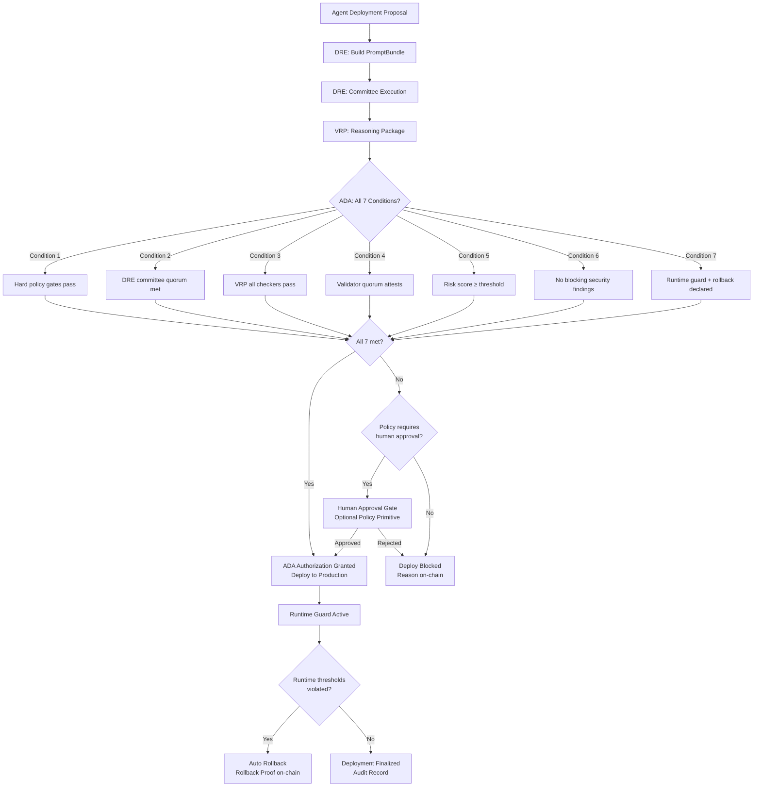
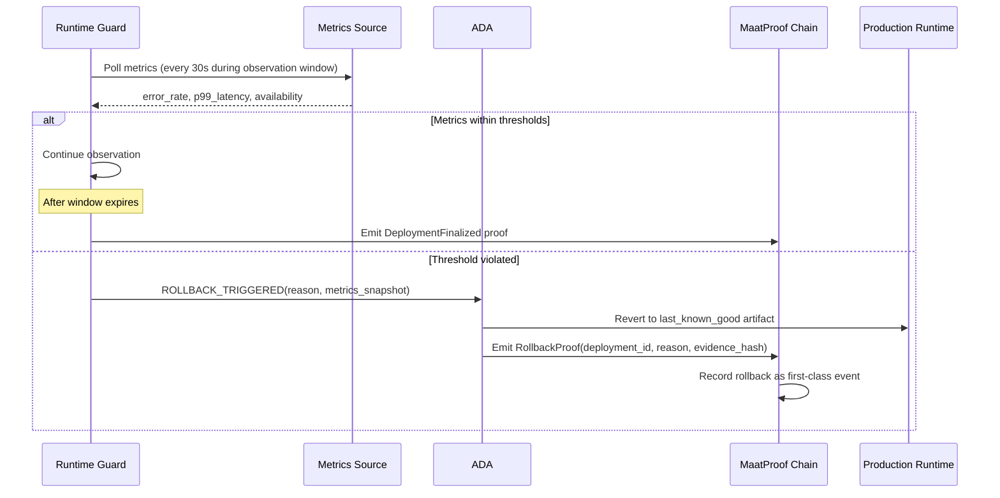
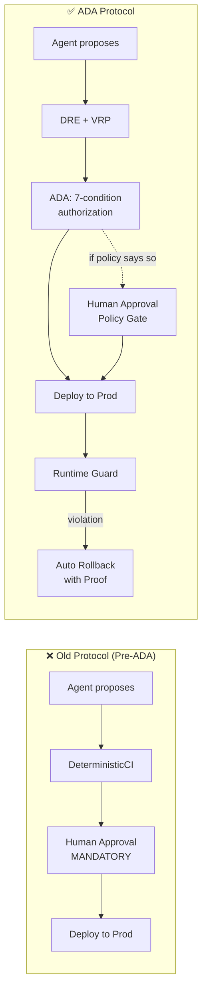

# Autonomous Deployment Authority (ADA) Specification

## Overview

The Autonomous Deployment Authority (ADA) is the protocol-level authorization mechanism that
replaces mandatory human approval for production deployments. ADA is activated once the
Deterministic Reasoning Engine (DRE) and Verifiable Reasoning Protocol (VRP) are in place.

**ADA is the protocol default.** Human approval remains available as a policy primitive for
teams that need it — but it is no longer required at the protocol level.

## Whitepaper Reference

Section 3.7 — "Autonomous Deployment Authority (ADA)"

> "Autonomous Deployment Authority (ADA) replaces constitutional human approval with a
> deterministic multi-signal authorization function. A production deployment may proceed
> automatically only when all of the following are true..."
>
> "The protocol default is therefore: the agent proposes, the proof authorizes, the chain
> records, and the runtime guard can reverse."

Section 5.3 — "Human Approval Becomes a Policy Primitive, Not a Constitutional Requirement"

> "In MaatProof, production deployment authority comes from cryptographic proof: canonical
> evidence, admissible reasoning, committee convergence, validator attestation, and runtime
> guard declarations. Human approval is therefore no longer a protocol-level requirement."

## Authorization Flow



## The 7 ADA Conditions

A production deployment proceeds autonomously only when **all** of the following are true:

### Condition 1: All Hard Policy Gates Pass

Every rule in the referenced Deployment Contract evaluates to `true`. These include:
- Test coverage threshold
- CVE scan clearance
- Agent minimum stake
- Day-of-week restrictions
- Environment-specific rules

```rust
fn all_policy_gates_pass(
    policy: &DeployPolicy,
    evidence: &EvidenceBundle,
) -> bool {
    policy.rules.iter().all(|rule| rule.evaluate(evidence))
}
```

### Condition 2: DRE Committee Quorum Satisfied

The Deterministic Reasoning Engine must have achieved its configured N-of-M committee quorum
on the same `DecisionTuple` with `decision = Approve`.

```rust
fn dre_quorum_met(cert: &CommitteeCertificate, config: &CommitteeConfig) -> bool {
    cert.quorum.achieved >= config.quorum_threshold
    && cert.decision_tuple.decision == DeployDecision::Approve
}
```

### Condition 3: VRP Checker Set Validates

Every admissible reasoning step in the VRP `ReasoningPackage` must have been validated by its
registered deterministic checker. No checker may return `Invalid` or `Inconclusive`.

```rust
fn vrp_all_checkers_passed(pkg: &ReasoningPackage) -> bool {
    pkg.authorization.all_checkers_passed
    && pkg.authorization.failed_checkers.is_empty()
}
```

### Condition 4: Validator Quorum Attests

The Proof-of-Reasoning Consensus validator committee must have achieved 2/3 supermajority
attesting `ACCEPT` on the same reasoning Merkle root.

```rust
fn validator_quorum_attests(block: &PendingBlock, validator_set: &ValidatorSet) -> bool {
    let accept_stake: u64 = block.votes.iter()
        .filter(|v| v.verdict == Verdict::Accept)
        .map(|v| validator_set.stake_of(&v.validator_did))
        .sum();
    accept_stake * 3 >= validator_set.total_stake() * 2
}
```

### Condition 5: Risk Score Exceeds Threshold

The deterministic risk score computed by the DRE must meet or exceed the configured minimum.
The risk score is a versioned function over structured inputs — **not an LLM opinion**.

```rust
pub struct RiskScore {
    /// 0–1000 integer score (higher = lower risk)
    pub score: u32,
    /// Inputs used to compute the score
    pub inputs: RiskInputs,
    /// Version of the scoring function
    pub function_version: String,
}

pub struct RiskInputs {
    pub change_size_lines: u32,
    pub scan_severity_max: Severity,
    pub historical_rollback_rate: f32,    // 0.0–1.0
    pub committee_agreement_pct: f32,     // 0.0–1.0
    pub validator_agreement_pct: f32,     // 0.0–1.0
    pub service_criticality: Criticality, // Low / Medium / High / Critical
}

// Default thresholds
const MIN_RISK_SCORE_STAGING: u32 = 400;
const MIN_RISK_SCORE_PRODUCTION: u32 = 700;
```

### Condition 6: No Blocking Security Findings

The security scan must have zero critical or high severity findings. This condition cannot be
waived by any agent or policy rule — it is a hard stop.

| Severity | Blocking |
|---|---|
| Critical | Always blocking |
| High | Always blocking |
| Medium | Configurable via policy |
| Low | Never blocking |

### Condition 7: Runtime Guard with Rollback Instructions Declared

Every autonomous production deployment must declare:
- Rollout strategy (canary / blue-green / rolling)
- Observation window duration
- Rollback thresholds (error rate, latency, availability)
- Metrics source (endpoint + credentials)
- Last-known-good artifact reference

```rust
pub struct RuntimeGuard {
    pub strategy: RolloutStrategy,
    pub observation_window_secs: u64,
    pub rollback_thresholds: RollbackThresholds,
    pub metrics_source: MetricsSource,
    pub last_known_good: ArtifactReference,
}

pub struct RollbackThresholds {
    pub error_rate_max: f32,         // e.g., 0.01 = 1%
    pub p99_latency_max_ms: u64,
    pub availability_min: f32,       // e.g., 0.999 = 99.9%
    pub evaluation_window_secs: u64,
}
```

## ADA Authorization Record

When ADA grants authorization, it emits a signed `AdaAuthorization` that is included in the
deployment block:

```rust
pub struct AdaAuthorization {
    pub deployment_id: [u8; 32],
    pub prompt_bundle_hash: [u8; 32],
    pub reasoning_root: [u8; 32],
    pub committee_certificate_hash: [u8; 32],
    pub validator_block_hash: [u8; 32],
    pub risk_score: RiskScore,
    pub runtime_guard: RuntimeGuard,
    pub conditions_verified: [bool; 7],
    pub authorized_at: u64,
    pub ada_version: String,
}
```

## Human Approval as Policy Primitive

Human approval is no longer a protocol-level requirement. It is one policy gate among many,
available for teams that want it.

### When to Use Human Approval Gates

Regulated workloads, novel migrations, or exceptional risk classes may still declare a
human attestation rule in their Deployment Contract:

```solidity
contract DeployPolicy {
    // Standard rules (ADA handles these automatically)
    rule test_coverage_gate: coverage >= 80;
    rule no_known_cves: securityScan.critical == 0;
    rule agent_stake_minimum: agent.stakedMAAT >= 1000;

    // Optional: human approval for production (policy primitive, not protocol mandate)
    rule require_human_approval: stage == PRODUCTION;

    // Or scope it more narrowly
    rule require_human_approval:
        stage == PRODUCTION && (serviceClass == "CRITICAL" || isFirstDeploy());
}
```

When `require_human_approval` is in the policy, the `HumanApprovalAgent` is invoked as part
of Condition 1 (policy gates). ADA waits for the on-chain `HumanApproval` attestation before
proceeding.

### Architectural Distinction

| Model | Human Approval |
|---|---|
| **Old (pre-ADA)** | Universal protocol mandate; no autonomous deploy possible |
| **New (ADA default)** | Policy primitive; declared in Deployment Contract when needed |
| **Regulated workloads** | Use `require_human_approval` rule in their contract |
| **Emergency fixes** | May use accelerated SLA policy or temporarily remove the gate |

## Rollback as Trust Protocol

In MaatProof, rollback is not an operational afterthought — it is part of the trust protocol.



### Rollback Proof Structure

```rust
pub struct RollbackProof {
    pub deployment_id: [u8; 32],
    pub trigger_reason: RollbackReason,
    pub metrics_snapshot: MetricsSnapshot,
    pub reverted_to_artifact: ArtifactReference,
    pub rollback_at: u64,
    pub runtime_guard_hash: [u8; 32],
    pub proof_signature: [u8; 64], // Ed25519
}

pub enum RollbackReason {
    ErrorRateExceeded { actual: f32, threshold: f32 },
    LatencyExceeded { actual_p99_ms: u64, threshold_ms: u64 },
    AvailabilityDegraded { actual: f32, threshold: f32 },
    ManualOverride { requester_did: String },
}
```

## ADA vs Old Pipeline Comparison



## Implementation Notes

### Python Reference Implementation

The `maatproof` Python package supports ADA via the `require_human_approval` flag in
`PipelineConfig`. Setting it to `False` enables ADA mode:

```python
from maatproof.pipeline import MaatProofPipeline, PipelineConfig

# ADA mode: no mandatory human approval (default protocol behavior)
config = PipelineConfig(
    name="my-service",
    secret_key=b"...",
    model_id="claude-opus-4",
    require_human_approval=False,  # ADA handles authorization
    max_fix_retries=3,
)

# Legacy mode: human approval still required (for regulated workloads)
config_regulated = PipelineConfig(
    name="hipaa-service",
    secret_key=b"...",
    model_id="claude-opus-4",
    require_human_approval=True,  # policy gate enabled
    max_fix_retries=3,
)
```

## Security Considerations

### Risk Score Integrity

- The risk score function version is pinned in the PromptBundle and verified by validators
- Validators independently recompute the risk score and reject blocks where it diverges
- The scoring function is on-chain and can only be changed by governance vote

### Condition Atomicity

- All 7 conditions must be verified in a single atomic check before authorization is granted
- Partial authorization (e.g., "6 of 7 conditions met") is not valid
- Condition verification results are included in the `AdaAuthorization` record

### Runtime Guard Bypass Prevention

- The runtime guard endpoint must be declared in the Deployment Contract — not in the agent request
- Agents cannot self-declare their own rollback thresholds (would allow setting `error_rate_max = 1.0`)
- Threshold values are validated against policy minimums during Condition 1

## References

- Whitepaper §3.7 — Autonomous Deployment Authority (ADA)
- Whitepaper §5.3 — Human Approval as Policy Primitive
- Whitepaper §3.4 — Deterministic Reasoning Engine (DRE)
- Whitepaper §3.5 — Verifiable Reasoning Protocol (VRP)
- Whitepaper §3.6 — Proof-of-Reasoning Consensus
- Casper [10]: Buterin & Griffith, 2017 (slashing economic analogy)
- NIST AI RMF [19] (human oversight requirements)
- EU AI Act [20] (traceability requirements)
