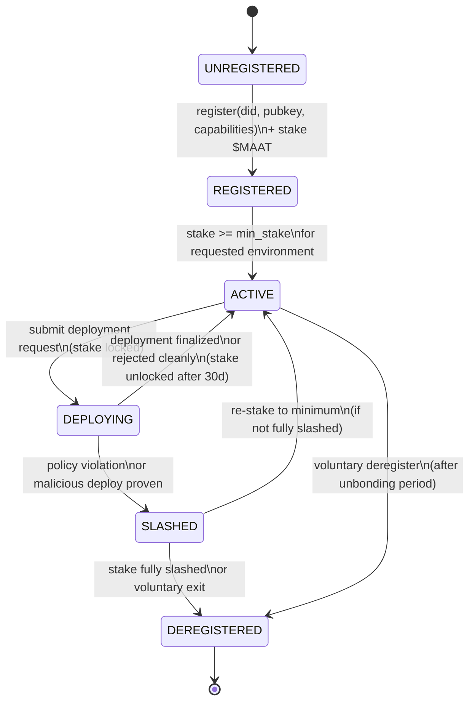

# Agent Identity — Technical Specification

## Overview

Every agent that interacts with MaatProof has a cryptographic identity anchored on-chain. Agent identity provides:

- **Authentication**: cryptographic proof that a request came from a specific agent
- **Authorization**: on-chain capability list limits what environments an agent may deploy to
- **Accountability**: on-chain record of agent stake, history, and any slashing events
- **Non-repudiation**: signed deployment requests cannot be denied after the fact

**Keypair**: Ed25519  
**DID method**: `did:maat`  
**Standard**: W3C Decentralized Identifiers (DID) v1.0  
**Registration**: On-chain transaction  

---

## Identity Document

An agent identity document follows the W3C DID spec:

```json
{
  "@context": [
    "https://www.w3.org/ns/did/v1",
    "https://maat.dev/identity/v1"
  ],
  "id": "did:maat:agent:xyz789abc",
  "verificationMethod": [
    {
      "id": "did:maat:agent:xyz789abc#key-1",
      "type": "Ed25519VerificationKey2020",
      "controller": "did:maat:agent:xyz789abc",
      "publicKeyMultibase": "z6MkhaXgBZDvotDkL5257faiztiGiC2QtKLGpbnnEGta2doK"
    }
  ],
  "authentication": ["did:maat:agent:xyz789abc#key-1"],
  "assertionMethod": ["did:maat:agent:xyz789abc#key-1"],
  "service": [
    {
      "id": "did:maat:agent:xyz789abc#maat-agent",
      "type": "MaatAgentService",
      "serviceEndpoint": "https://agent.example.com/maat"
    }
  ],
  "maat:stake": "10000000000000000000000",
  "maat:capabilities": ["deploy:staging", "deploy:production"],
  "maat:agentType": "orchestrator",
  "maat:created": "2025-01-15T00:00:00Z"
}
```

### Identity Fields

| Field | Description |
|---|---|
| `id` | The agent's DID — `did:maat:agent:<hex-pubkey-hash>` |
| `verificationMethod` | Ed25519 public key in multibase encoding |
| `maat:stake` | Current staked $MAAT (in wei, string for precision) |
| `maat:capabilities` | List of permitted deploy targets |
| `maat:agentType` | `orchestrator \| validator \| security \| approval` |

---

## Keypair Generation

```rust
use ed25519_dalek::{SigningKey, VerifyingKey};
use rand::rngs::OsRng;

pub struct AgentIdentity {
    pub did: String,
    pub signing_key: SigningKey,
    pub verifying_key: VerifyingKey,
}

impl AgentIdentity {
    /// Generate a new agent identity
    pub fn generate() -> Self {
        let signing_key = SigningKey::generate(&mut OsRng);
        let verifying_key = signing_key.verifying_key();
        let pubkey_bytes = verifying_key.to_bytes();
        let pubkey_hash = hex::encode(&sha256(&pubkey_bytes)[..16]);
        let did = format!("did:maat:agent:{}", pubkey_hash);
        Self { did, signing_key, verifying_key }
    }

    /// Sign a deployment request
    pub fn sign(&self, payload: &[u8]) -> String {
        let sig = self.signing_key.sign(payload);
        hex::encode(sig.to_bytes())
    }
}
```

---

## On-Chain Registration

Agents register their identity by calling `AgentRegistry.register()` on-chain:

```solidity
function register(
    string calldata did,
    bytes  calldata publicKey,      // 32-byte Ed25519 public key
    string[] calldata capabilities  // ["deploy:staging", "deploy:production"]
) external payable {
    // Stake is sent as msg.value in $MAAT
    require(msg.value >= MIN_REGISTRATION_STAKE, "Insufficient stake");
    agents[did] = AgentRecord({
        did:          did,
        publicKey:    publicKey,
        capabilities: capabilities,
        stake:        msg.value,
        active:       true,
        registeredAt: block.timestamp
    });
    emit AgentRegistered(did, msg.value, block.timestamp);
}
```

---

## Signing Deployment Requests

All deployment requests must be signed:

```javascript
// Node.js SDK
const { MaatIdentity } = require('@maatproof/sdk');

const identity = MaatIdentity.fromKeyFile('./agent-key.json');
const request = {
  trace_id: crypto.randomUUID(),
  agent_id: identity.did,
  policy_ref: '0xDeployPolicyAddress',
  policy_version: 3,
  artifact_hash: `sha256:${artifactHash}`,
  deploy_environment: 'production',
  timestamp: new Date().toISOString(),
};

const requestHash = sha256(JSON.stringify(canonicalize(request)));
request.signature = identity.sign(requestHash);
await maatProof.submitDeployment(request);
```

---

## Identity Lifecycle



---

## Capability Enforcement

Validators check the agent's capability list before processing a deployment proposal:

```rust
pub fn check_agent_capability(
    agent_capabilities: &[String],
    deploy_environment: &str,
) -> bool {
    let required = format!("deploy:{}", deploy_environment);
    agent_capabilities.iter().any(|cap| cap == &required || cap == "deploy:*")
}
```

An agent without `deploy:production` in its capability list cannot deploy to production, regardless of stake amount.

---

## Key Storage

In production, agent signing keys should be stored in hardware-backed KMS:

| Cloud | Service | Integration |
|---|---|---|
| Azure | Azure Key Vault (HSM) | `azure-identity` crate + Key Vault SDK |
| AWS | AWS KMS (CloudHSM) | `aws-sdk-kms` crate |
| GCP | Cloud KMS (Cloud HSM) | `google-cloud-kms` crate |

The `AgentIdentity` signing interface abstracts the key backend — the `sign()` method delegates to the configured KMS provider. Private keys never leave the HSM boundary.
