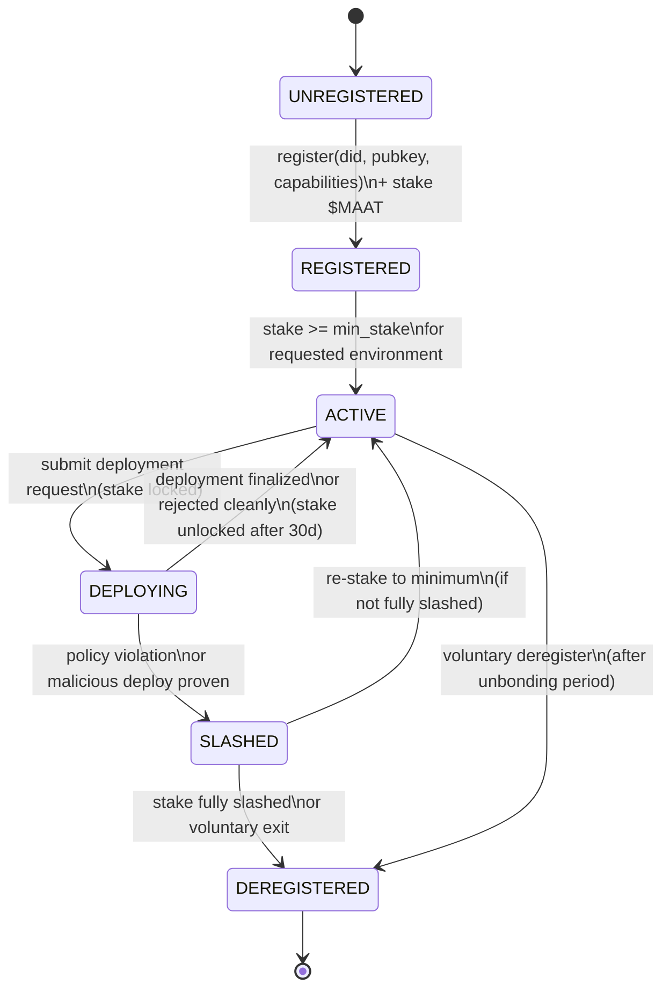
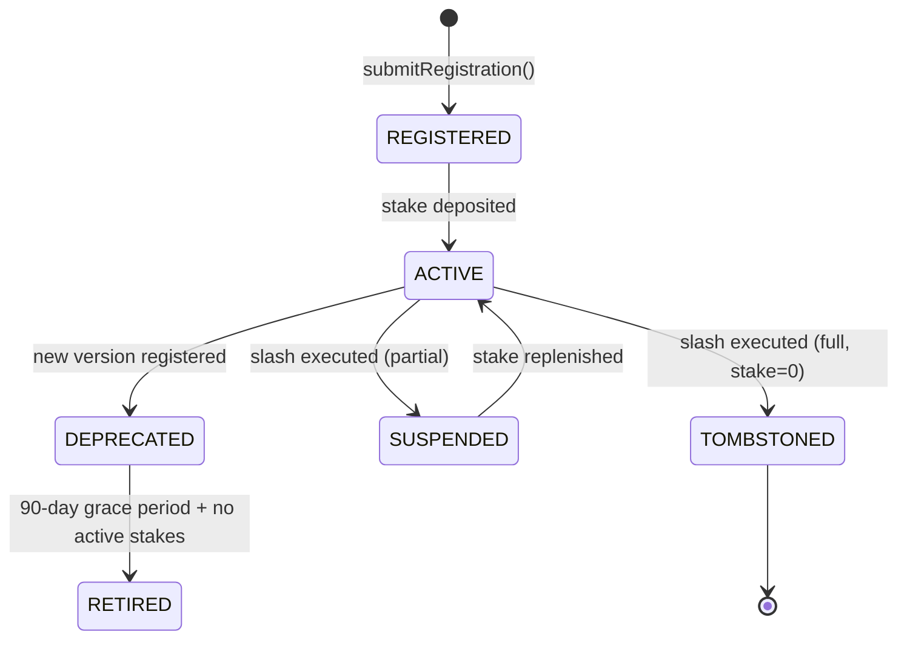
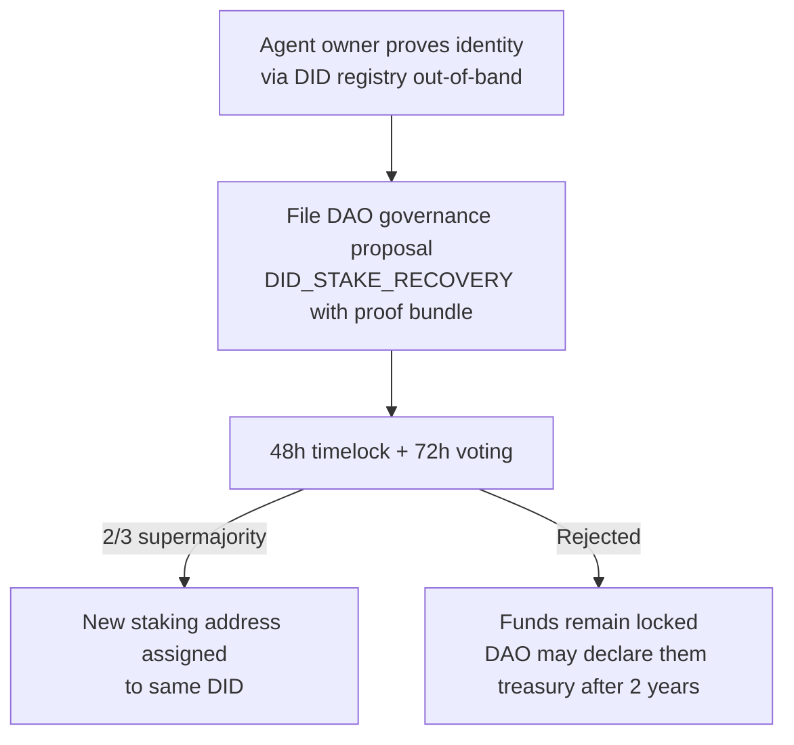

# Agent Identity — Technical Specification

## Overview

Every agent that interacts with MaatProof has a cryptographic identity anchored on-chain. Agent identity provides:

- **Authentication**: cryptographic proof that a request came from a specific agent
- **Authorization**: on-chain capability list limits what environments an agent may deploy to
- **Accountability**: on-chain record of agent stake, history, and any slashing events
- **Non-repudiation**: signed deployment requests cannot be denied after the fact

**Keypair**: Ed25519  
**DID method**: `did:maat`  
**Standard**: W3C Decentralized Identifiers (DID) v1.0  
**Registration**: On-chain transaction  

---

## Identity Document

An agent identity document follows the W3C DID spec:

```json
{
  "@context": [
    "https://www.w3.org/ns/did/v1",
    "https://maat.dev/identity/v1"
  ],
  "id": "did:maat:agent:xyz789abc",
  "verificationMethod": [
    {
      "id": "did:maat:agent:xyz789abc#key-1",
      "type": "Ed25519VerificationKey2020",
      "controller": "did:maat:agent:xyz789abc",
      "publicKeyMultibase": "z6MkhaXgBZDvotDkL5257faiztiGiC2QtKLGpbnnEGta2doK"
    }
  ],
  "authentication": ["did:maat:agent:xyz789abc#key-1"],
  "assertionMethod": ["did:maat:agent:xyz789abc#key-1"],
  "service": [
    {
      "id": "did:maat:agent:xyz789abc#maat-agent",
      "type": "MaatAgentService",
      "serviceEndpoint": "https://agent.example.com/maat"
    }
  ],
  "maat:stake": "10000000000000000000000",
  "maat:capabilities": ["deploy:staging", "deploy:production"],
  "maat:agentType": "orchestrator",
  "maat:created": "2025-01-15T00:00:00Z"
}
```

### Identity Fields

| Field | Description |
|---|---|
| `id` | The agent's DID — `did:maat:agent:<hex-pubkey-hash>` |
| `verificationMethod` | Ed25519 public key in multibase encoding |
| `maat:stake` | Current staked $MAAT (in wei, string for precision) |
| `maat:capabilities` | List of permitted deploy targets |
| `maat:agentType` | `orchestrator \| validator \| security \| approval` |

---

## Keypair Generation

```rust
use ed25519_dalek::{SigningKey, VerifyingKey};
use rand::rngs::OsRng;

pub struct AgentIdentity {
    pub did: String,
    pub signing_key: SigningKey,
    pub verifying_key: VerifyingKey,
}

impl AgentIdentity {
    /// Generate a new agent identity
    pub fn generate() -> Self {
        let signing_key = SigningKey::generate(&mut OsRng);
        let verifying_key = signing_key.verifying_key();
        let pubkey_bytes = verifying_key.to_bytes();
        let pubkey_hash = hex::encode(&sha256(&pubkey_bytes)[..16]);
        let did = format!("did:maat:agent:{}", pubkey_hash);
        Self { did, signing_key, verifying_key }
    }

    /// Sign a deployment request
    pub fn sign(&self, payload: &[u8]) -> String {
        let sig = self.signing_key.sign(payload);
        hex::encode(sig.to_bytes())
    }
}
```

---

## On-Chain Registration

Agents register their identity by calling `AgentRegistry.register()` on-chain:

```solidity
function register(
    string calldata did,
    bytes  calldata publicKey,      // 32-byte Ed25519 public key
    string[] calldata capabilities  // ["deploy:staging", "deploy:production"]
) external payable {
    // Stake is sent as msg.value in $MAAT
    require(msg.value >= MIN_REGISTRATION_STAKE, "Insufficient stake");
    agents[did] = AgentRecord({
        did:          did,
        publicKey:    publicKey,
        capabilities: capabilities,
        stake:        msg.value,
        active:       true,
        registeredAt: block.timestamp
    });
    emit AgentRegistered(did, msg.value, block.timestamp);
}
```

---

## Signing Deployment Requests

All deployment requests must be signed:

```javascript
// Node.js SDK
const { MaatIdentity } = require('@maatproof/sdk');

const identity = MaatIdentity.fromKeyFile('./agent-key.json');
const request = {
  trace_id: crypto.randomUUID(),
  agent_id: identity.did,
  policy_ref: '0xDeployPolicyAddress',
  policy_version: 3,
  artifact_hash: `sha256:${artifactHash}`,
  deploy_environment: 'production',
  timestamp: new Date().toISOString(),
};

const requestHash = sha256(JSON.stringify(canonicalize(request)));
request.signature = identity.sign(requestHash);
await maatProof.submitDeployment(request);
```

---

## Identity Lifecycle



---

## Capability Enforcement

Validators check the agent's capability list before processing a deployment proposal:

```rust
pub fn check_agent_capability(
    agent_capabilities: &[String],
    deploy_environment: &str,
) -> bool {
    let required = format!("deploy:{}", deploy_environment);
    agent_capabilities.iter().any(|cap| cap == &required || cap == "deploy:*")
}
```

An agent without `deploy:production` in its capability list cannot deploy to production, regardless of stake amount.

---

## Key Storage

In production, agent signing keys should be stored in hardware-backed KMS:

| Cloud | Service | Integration |
|---|---|---|
| Azure | Azure Key Vault (HSM) | `azure-identity` crate + Key Vault SDK |
| AWS | AWS KMS (CloudHSM) | `aws-sdk-kms` crate |
| GCP | Cloud KMS (Cloud HSM) | `google-cloud-kms` crate |

The `AgentIdentity` signing interface abstracts the key backend — the `sign()` method delegates to the configured KMS provider. Private keys never leave the HSM boundary.

---

## Agent Versioning

Agents evolve over time — their system prompts, tool manifests, and underlying LLM models change. MaatProof tracks agent versions on-chain:

```rust
pub struct AgentVersion {
    pub agent_id:           String,    // did:maat:agent:...
    pub version:            u32,       // monotonically increasing
    pub system_prompt_hash: [u8; 32], // SHA-256 of system prompt
    pub tool_manifest_hash: [u8; 32], // SHA-256 of registered tool list
    pub llm_model_id:       String,    // e.g., "anthropic/claude-3-7-sonnet"
    pub registered_at:      i64,
    pub deprecated_at:      Option<i64>,
}
```

- Agent version is included in every deployment trace.
- Validators reject traces produced by a deprecated agent version.
- Old versions remain queryable for audit purposes.

### Agent Version Lifecycle



---

## Capability Escalation Prevention

Agents may only use capabilities they declared at registration time. Escalation prevention:

| Attack | Prevention |
|---|---|
| Agent claims new capability at runtime | Capabilities are immutable per version; new capabilities require new registration |
| Agent calls tool not in manifest | AVM rejects trace with `UNDECLARED_TOOL_CALL` |
| Agent attempts production deploy with staging role | AVM checks `deploy_environment` against registered capabilities |
| Delegated agent tries to exceed delegator's capabilities | Delegation tokens include capability subset; delegation cannot escalate beyond delegator |
| Agent impersonates another DID | Ed25519 signature required; only the key-holder can sign |

---

## Agent Delegation

An agent may delegate a capability subset to another agent for a time-bounded scope:

```rust
pub struct DelegationToken {
    pub delegator_id:    String,          // parent agent DID
    pub delegate_id:     String,          // child agent DID
    pub capabilities:    Vec<Capability>, // MUST be subset of delegator's capabilities
    pub valid_from:      i64,
    pub valid_until:     i64,             // max 24h for production capabilities
    pub max_deployments: Option<u32>,     // optional use limit
    pub signature:       String,          // signed by delegator's Ed25519 key
}
```

Delegation tokens are submitted on-chain and verified by the AVM before trace processing. A delegated agent's trace includes the delegation token reference.

---

## Agent Retirement / Deregistration

Agents may be voluntarily retired or forcibly deregistered:

| Path | Trigger | Process |
|---|---|---|
| **Voluntary retirement** | Operator decision | Agent submits `RetireAgent(did)` tx; stake unlocked after 30-day challenge window |
| **Forced deregistration** | Slash (stake=0) | Automatic; agent cannot submit new deployments |
| **Governance removal** | DAO vote | Used for agents that cause systemic harm; requires 2/3 governance vote |

Retired agents remain readable on-chain for audit purposes. Their trace history is permanent.

---

## Agent Owner Key Loss Recovery

<!-- Addresses EDGE-ADA-006 -->

If an agent owner permanently loses access to their staking wallet (e.g., lost seed phrase,
hardware failure, death), the following recovery paths are available:

### Path 1: DAO Governance Recovery (Preferred)

If the agent owner can prove identity via the DID registry (e.g., via an out-of-band
attestation from multiple trusted parties), the DAO may vote to reassign the staking
address:



### Path 2: Emergency Guardian Transfer

For production agents that registered with a **guardian address** at registration time,
the guardian may initiate a one-time stake transfer to a new wallet:

```solidity
function emergencyTransferStake(
    string calldata agentDid,
    address newStakingAddress,
    bytes calldata guardianSignature
) external {
    AgentRecord storage agent = agents[agentDid];
    require(agent.guardianAddress != address(0), "No guardian registered");
    require(
        verifyGuardianSig(agentDid, newStakingAddress, guardianSignature, agent.guardianAddress),
        "Invalid guardian signature"
    );
    require(agent.stakeLockExpiry < block.timestamp, "Stake still locked");
    // Transfer ownership
    agent.stakingAddress = newStakingAddress;
    emit AgentStakeTransferred(agentDid, msg.sender, newStakingAddress, block.timestamp);
}
```

**Guardian registration** is optional and specified at `register()` time:
```solidity
// Optional: register a guardian address at agent registration
agents[did].guardianAddress = guardianAddress; // may be address(0) if none
```

### Path 3: Stake Expiry

If neither path is available and the staking wallet is permanently inaccessible:
- Staked tokens remain locked for the duration of the active challenge window
- After a **2-year inactivity timeout**, the DAO may move the locked tokens to the
  treasury via governance vote (`INACTIVE_STAKE_RECLAIM`), subject to a 30-day
  public notice period

This prevents permanent token lockup from eroding the total supply indefinitely.

---

## Multi-Sig Guardian Emergency Recovery

<!-- Addresses EDGE-ADA-005 -->

Human approver keys are protected by a 2-of-3 multi-sig guardian model. If guardian
quorum becomes unreachable (e.g., guardians are on leave, keys are lost), the following
emergency paths exist:

### Guardian Quorum Failure Recovery

| Scenario | Recovery Path |
|---|---|
| 1-of-3 guardians unreachable | Other 2 guardians form quorum normally |
| 2-of-3 guardians unreachable (quorum lost) | DAO governance emergency vote (see below) |
| All 3 guardians unreachable | DAO emergency vote + 14-day waiting period |

### DAO Emergency Governance Path

When guardian quorum is lost (< 2-of-3 guardians reachable for > 24 hours), the
human approver account enters `GUARDIAN_QUORUM_FAILED` state:

1. Any DAO member may file a `GUARDIAN_EMERGENCY_RECOVERY` governance proposal.
2. The proposal requires **80% supermajority** (higher than normal 2/3 threshold).
3. Voting period is **7 days** (extended from normal 72 hours).
4. If passed, the governance contract issues a new human approver DID and revokes
   the old one — the old approver key is tombstoned on-chain.
5. Pending production deployments that were awaiting the original human approver
   are re-queued with the new approver.

**Until recovery**: All new production deployments requiring `require_human_approval`
are **blocked** (not processed). Existing deployments in `AWAITING_APPROVAL` state
remain pending with an extended `human_approval_timeout` equal to the guardian
recovery period.

This is a Critical-path scenario — operators should designate geographically and
institutionally diverse guardians to minimize this risk.
