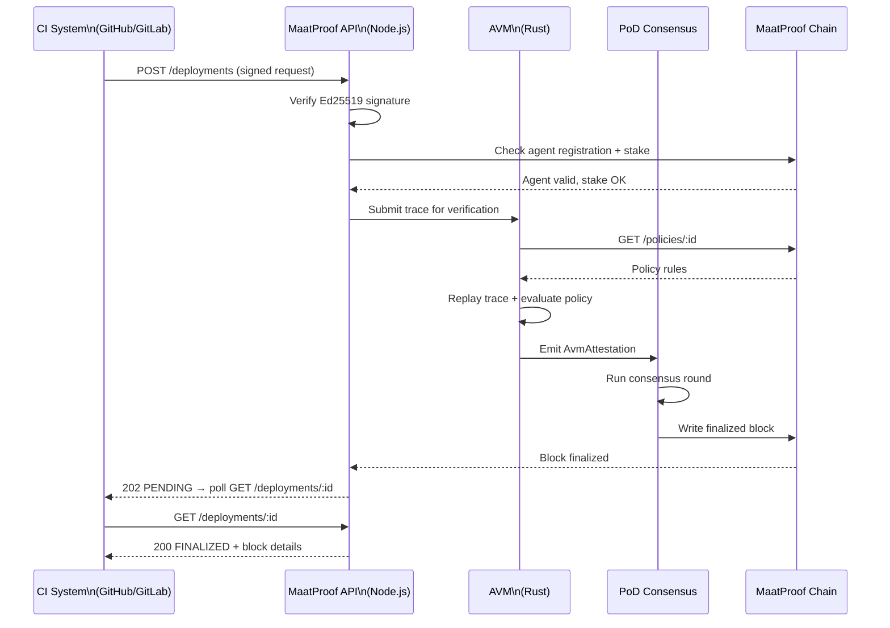

# API Specification

## Overview

The MaatProof API is implemented in **Node.js** and exposes both **REST** and **gRPC** interfaces. The REST API is the primary integration point for CI/CD systems, GitHub/GitLab apps, and SDKs. The gRPC API is used for internal communication between AVM nodes, validators, and the consensus engine.

**Runtime**: Node.js (Express + gRPC via `@grpc/grpc-js`)  
**Authentication**: Ed25519 signed requests (JWT-style bearer with DID)  
**Rate limiting**: Per-agent DID, configurable  

---

## Authentication

All write endpoints require an `Authorization` header containing a signed JWT:

```
Authorization: Bearer <base64url(header)>.<base64url(payload)>.<base64url(ed25519_sig)>
```

The payload includes:
- `sub`: agent DID
- `iat`: issued-at timestamp
- `exp`: expiry (max 5 minutes from `iat`)
- `nonce`: UUID v4 (replay prevention)

---

## REST Endpoints

### POST /deployments

Submit a new deployment request.

**Request**:
```json
{
  "trace_id": "550e8400-e29b-41d4-a716-446655440000",
  "agent_id": "did:maat:agent:xyz789abc",
  "policy_ref": "0xDeployPolicyContractAddress",
  "policy_version": 3,
  "artifact_hash": "sha256:a3f8b2c1...",
  "deploy_environment": "production",
  "trace": { "...": "full JSON-LD trace object" },
  "human_approval_ref": "0x9f8e7d6c...",
  "signature": "a1b2c3d4..."
}
```

**Response** (202 Accepted):
```json
{
  "deployment_id": "dep-8f3a2b1c",
  "status": "PENDING",
  "round_id": "round-7e2d4f8a",
  "estimated_finality_seconds": 35
}
```

---

### GET /deployments/:id

Get deployment status and result.

**Response** (200 OK):
```json
{
  "deployment_id": "dep-8f3a2b1c",
  "status": "FINALIZED",
  "block_height": 1042301,
  "artifact_hash": "sha256:a3f8b2c1...",
  "trace_hash": "sha256:def456...",
  "policy_ref": "0xDeployPolicy...",
  "policy_version": 3,
  "agent_id": "did:maat:agent:xyz789abc",
  "validator_signatures": ["sig1...", "sig2...", "sig3..."],
  "timestamp": "2025-01-15T14:32:00Z",
  "human_approval_ref": "0x9f8e7d6c..."
}
```

**Status values**: `PENDING | VERIFYING | VOTING | FINALIZED | REJECTED | DISCARDED`

---

### GET /deployments/:id/trace

Retrieve the full reasoning trace for a deployment.

**Response** (200 OK):
```json
{
  "deployment_id": "dep-8f3a2b1c",
  "trace_hash": "sha256:def456...",
  "ipfs_cid": "bafybeigdyrzt5sfp7udm7hu76uh7y26nf3efuylqabf3oclgtqy55fbzdi",
  "trace": { "...": "full JSON-LD trace" }
}
```

---

### POST /validators/attest

Submit a validator attestation vote.

**Request**:
```json
{
  "round_id": "round-7e2d4f8a",
  "validator_id": "did:maat:validator:v1",
  "decision": "FINALIZE",
  "trace_hash": "sha256:def456...",
  "policy_result": { "passed": true },
  "timestamp": "2025-01-15T14:32:05Z",
  "signature": "b2c3d4e5..."
}
```

**Response** (200 OK):
```json
{
  "vote_id": "vote-3a4b5c6d",
  "accepted": true,
  "round_status": "VOTING"
}
```

---

### GET /policies/:id

Get a deployment policy contract.

**Response** (200 OK):
```json
{
  "policy_ref": "0xDeployPolicyContractAddress",
  "policy_version": 3,
  "policy_owner": "0xOwnerAddress",
  "active": true,
  "rules": {
    "no_friday_deploys": true,
    "require_human_approval": true,
    "min_test_coverage": 80,
    "max_critical_cves": 0,
    "min_agent_stake": "10000000000000000000000",
    "deploy_window_start": 9,
    "deploy_window_end": 17
  },
  "last_updated": "2025-01-10T09:00:00Z"
}
```

---

### POST /agents/register

Register a new agent identity.

**Request**:
```json
{
  "did": "did:maat:agent:xyz789abc",
  "public_key": "hex-encoded-ed25519-pubkey",
  "capabilities": ["deploy:staging", "deploy:production"],
  "agent_type": "orchestrator",
  "stake_amount": "10000000000000000000000",
  "signature": "registration-sig..."
}
```

**Response** (201 Created):
```json
{
  "did": "did:maat:agent:xyz789abc",
  "tx_hash": "0xRegistrationTxHash",
  "registered_at": "2025-01-15T00:00:00Z"
}
```

---

### GET /agents/:id/stake

Get current stake for an agent.

**Response** (200 OK):
```json
{
  "agent_id": "did:maat:agent:xyz789abc",
  "staked_amount": "10000000000000000000000",
  "locked_amount": "10000000000000000000000",
  "available_amount": "0",
  "capabilities": ["deploy:staging", "deploy:production"],
  "active_deployments": 1,
  "slash_history": []
}
```

---

## Error Responses

All errors follow the format:
```json
{
  "error": "POLICY_VERSION_MISMATCH",
  "message": "Submitted policy_version 2 does not match current version 3",
  "code": 409
}
```

**Error codes**:

| Code | HTTP Status | Description |
|---|---|---|
| `INVALID_SIGNATURE` | 401 | Ed25519 signature verification failed |
| `AGENT_NOT_REGISTERED` | 404 | Agent DID not found on-chain |
| `INSUFFICIENT_STAKE` | 402 | Agent stake below minimum for environment |
| `POLICY_VERSION_MISMATCH` | 409 | Policy version changed since agent queried |
| `DUPLICATE_TRACE_ID` | 409 | trace_id already used |
| `INVALID_TRACE_FORMAT` | 400 | Trace does not conform to JSON-LD spec |
| `ROUND_TIMEOUT` | 504 | Consensus round timed out |

---

## API Flow Diagram


