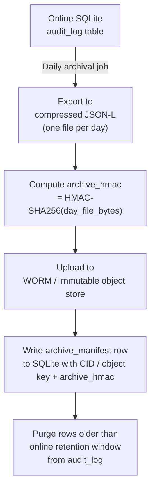

# Audit Logging Specification

<!-- Addresses EDGE-001 through EDGE-070 (see spec-edge-case-tester results for issue #118) -->

## Overview

The Audit Logging subsystem provides a **tamper-evident, append-only record** of every
state change in the MaatProof pipeline.  It implements the audit trail required by
CONSTITUTION.md §7, and satisfies the compliance obligations described in
`docs/07-regulatory-compliance.md` (SOC 2 CC7.2, HIPAA §164.312(b), SOX ITGC).

**Tech stack:** Python · SQLite (WAL mode) · `cryptography` / `hmac` / `hashlib`

---

## §1 — AuditEntry Data Model

<!-- Addresses EDGE-001, EDGE-002, EDGE-003, EDGE-004, EDGE-005, EDGE-063 -->

Every event is stored as a single row in the `audit_log` table.  The schema enforces
uniqueness and adds two tamper-detection columns (`entry_hmac`, `prev_entry_id`) that
form a **hash-linked chain** across rows.

### 1.1 SQLite Schema

```sql
CREATE TABLE IF NOT EXISTS audit_log (
    id            INTEGER PRIMARY KEY AUTOINCREMENT,
    entry_id      TEXT    NOT NULL UNIQUE,          -- UUID4 per row
    prev_entry_id TEXT,                             -- NULL for first entry
    event         TEXT    NOT NULL CHECK(length(event) BETWEEN 1 AND 256),
    timestamp     REAL    NOT NULL,                 -- POSIX float (monotonic source preferred)
    result        TEXT    NOT NULL,
    metadata      TEXT    NOT NULL DEFAULT '{}',    -- JSON, max 65536 bytes enforced in app layer
    actor_id      TEXT,                             -- DID of the agent/human who triggered the event
    entry_hmac    TEXT    NOT NULL,                 -- HMAC-SHA256(key_version||entry_id||prev_entry_id||event||timestamp||result||metadata||actor_id)
    key_version   INTEGER NOT NULL DEFAULT 1,       -- HMAC key version used for this entry
    created_at    REAL    NOT NULL                  -- wall-clock write time (separate from event timestamp)
);

CREATE INDEX IF NOT EXISTS idx_audit_log_timestamp ON audit_log(timestamp);
CREATE INDEX IF NOT EXISTS idx_audit_log_entry_id  ON audit_log(entry_id);
CREATE INDEX IF NOT EXISTS idx_audit_log_event     ON audit_log(event);
```

### 1.2 Field Constraints

| Field | Type | Constraint | Rationale |
|-------|------|-----------|-----------|
| `entry_id` | UUID4 string | UNIQUE, NOT NULL | Guarantees idempotency (duplicate inserts rejected) |
| `event` | TEXT | 1–256 chars, no NULL bytes | Prevents flooding and encoding attacks |
| `timestamp` | REAL | Must be > 0, ≤ `now() + 60s` | Rejects epoch-0 and far-future timestamps |
| `metadata` | JSON TEXT | ≤ 65,536 bytes | Prevents single-row bloat |
| `actor_id` | DID string or NULL | NULL only for system-internal events | Required for human approval events |
| `entry_hmac` | hex string | NOT NULL | Per-row tamper detection |
| `prev_entry_id` | UUID4 or NULL | Foreign-key-style chain link | Detects deletions and reorderings |

> **EDGE-039 — `event_name=None`:** The app layer MUST reject `None` values before
> reaching SQLite. `log_event()` raises `ValueError("event must be a non-empty string")`.

> **EDGE-041 — Unicode/emoji:** Python `str` + SQLite UTF-8 storage is fully supported.
> No special handling required; tests MUST include a Unicode event name.

> **EDGE-045 — Invalid timestamps:** `log_event()` raises `ValueError` if
> `timestamp <= 0` or `timestamp > time.time() + 60`.

> **EDGE-063 — Approver identity:** For events of type `HUMAN_APPROVED` and
> `HUMAN_REJECTED`, `actor_id` MUST be set to the approver's DID. A NULL `actor_id` on
> these events causes `log_event()` to raise `ValueError("actor_id required for approval events")`.

---

## §2 — Tamper Detection Algorithm

<!-- Addresses EDGE-001, EDGE-002, EDGE-003, EDGE-004, EDGE-032, EDGE-035 -->

The audit log uses a **per-entry HMAC + backward-linked chain** to detect four
classes of tampering:

| Attack | Detection Mechanism |
|--------|-------------------|
| Modify a field in an existing row | Per-entry HMAC fails on re-verification |
| Delete a row from the middle of the chain | `prev_entry_id` link from the next row points to a missing entry |
| Reorder rows by updating timestamps | `prev_entry_id` chain order diverges from `id` order |
| Insert a fabricated row | Fabricated `entry_hmac` fails (attacker lacks the HMAC key) |

### 2.1 Entry HMAC Computation

```python
def compute_entry_hmac(
    key: bytes,
    key_version: int,
    entry_id: str,
    prev_entry_id: str | None,
    event: str,
    timestamp: float,
    result: str,
    metadata: str,   # JSON string
    actor_id: str | None,
) -> str:
    """HMAC-SHA256 over canonical concatenation of all entry fields."""
    canonical = "|".join([
        str(key_version),
        entry_id,
        prev_entry_id or "",
        event,
        f"{timestamp:.6f}",          # fixed precision to avoid float repr drift
        result,
        metadata,                    # already a canonical JSON string (sort_keys=True)
        actor_id or "",
    ])
    return hmac.new(key, canonical.encode("utf-8"), hashlib.sha256).hexdigest()
```

> **EDGE-033 — Length extension:** HMAC-SHA256 is **not** vulnerable to length extension
> attacks.  The spec explicitly states this so implementors need not add a workaround.

### 2.2 Chain Verification Procedure

```
verify_chain(entries: list[AuditEntry]) -> VerificationResult
  1. Sort entries by id ASC (database insertion order)
  2. For each entry e[i]:
     a. Recompute expected_hmac = compute_entry_hmac(key_for_version(e.key_version), ...)
     b. If not hmac.compare_digest(e.entry_hmac, expected_hmac): FAIL(tamper_detected, e.entry_id)
     c. If i > 0 and e.prev_entry_id != e[i-1].entry_id: FAIL(chain_broken, e.entry_id)
  3. Return VerificationResult(ok=True, entries_checked=len(entries))
```

> **EDGE-002 — Row deletion:** Step 2c detects any deleted middle row because the next
> row's `prev_entry_id` will point to the deleted entry.

> **EDGE-003 — Row reordering:** Step 2c detects reordering because the chain sequence
> diverges from insertion order.

> **EDGE-035 — Empty step_hash in ReasoningProof:** The `ProofVerifier` already performs
> constant-time comparison on each `step_hash`. A forged empty string FAILS step 1a of
> `verify()` because `compute_hash("", ...)` will not equal `""`.

---

## §3 — HMAC Key Management

<!-- Addresses EDGE-006, EDGE-007, EDGE-008, EDGE-009, EDGE-010, EDGE-030,
     EDGE-036, EDGE-061, EDGE-062 -->

### 3.1 Key Storage

HMAC keys for the audit log **MUST** be stored using one of the following mechanisms,
in order of preference:

| Priority | Mechanism | Notes |
|----------|-----------|-------|
| 1 | Azure Key Vault / AWS KMS / GCP Cloud KMS | HSM-backed; keys never leave HSM boundary |
| 2 | Environment variable `MAAT_AUDIT_HMAC_KEY_{VERSION}` | Acceptable for dev/staging; must not appear in logs |
| 3 | Secrets manager (HashiCorp Vault, AWS Secrets Manager) | Acceptable for self-hosted |

**Prohibited storage locations:**

- ❌ Plain-text in any config file (`.py`, `.yaml`, `.env` committed to Git)
- ❌ Any log output (application logs, debug output, stack traces)
- ❌ Process arguments (`sys.argv`)
- ❌ Docker `ENV` declarations in a committed `Dockerfile`

> **EDGE-009 / EDGE-062:** If a static analysis scan (`bandit`, `detect-secrets`) finds
> an HMAC key literal in the source tree, the CI pipeline MUST fail with error
> `"Audit HMAC key detected in source — rotate immediately"`.

> **EDGE-008:** The `logging` module configuration MUST set `SECRET_KEY` and
> `HMAC_KEY` as masked fields. The `ProofBuilder` and `AuditLogger` classes MUST NOT
> log their `secret_key` attribute at any log level.

> **EDGE-006:** HMAC keys MUST NOT be passed as command-line arguments. Operators
> SHOULD use `MAAT_AUDIT_HMAC_KEY_{VERSION}` environment variables loaded via
> `os.environ` and immediately stored in a `bytearray` that is not serialized by
> Python's default `__repr__`.

### 3.2 Key Versioning

The `audit_log` table stores a `key_version` integer per row. This enables HMAC key
rotation without making historic entries unverifiable.

```python
# Maintained in application config / KMS tags
HMAC_KEY_REGISTRY = {
    1: load_key_from_env("MAAT_AUDIT_HMAC_KEY_1"),   # retired (read-only)
    2: load_key_from_env("MAAT_AUDIT_HMAC_KEY_2"),   # retired (read-only)
    3: load_key_from_env("MAAT_AUDIT_HMAC_KEY_3"),   # current (read/write)
}
CURRENT_KEY_VERSION = 3
```

- New entries MUST always use `CURRENT_KEY_VERSION`.
- Verification MUST look up the key by `key_version` stored in each row.
- Old key material MUST be retained in the registry (marked "retired") for the
  duration of the audit retention period (see §8).

> **EDGE-007:** After HMAC key rotation, historic entries remain verifiable because
> their `key_version` field directs the verifier to the correct retired key.

> **EDGE-036 — Key rotation mid-proof:** During the 24-hour overlap window, both old
> and new key versions are valid for verification. New proofs MUST be signed with the
> new `CURRENT_KEY_VERSION`. Proofs signed during the overlap with the old key remain
> valid as long as the old key is present in `HMAC_KEY_REGISTRY`.

### 3.3 Key Rotation Procedure

```mermaid
sequenceDiagram
    participant Ops as Operator
    participant KMS as KMS / Env
    participant App as AuditLogger
    participant DB  as SQLite audit_log

    Ops->>KMS: Generate new HMAC key (key_version = N+1)
    KMS-->>Ops: new_key stored securely
    Ops->>App: Deploy with MAAT_AUDIT_HMAC_KEY_{N+1} set; CURRENT_KEY_VERSION = N+1
    App->>DB: All new entries written with key_version = N+1
    Note over App,DB: Historic entries with key_version ≤ N remain verifiable<br/>via retired key in HMAC_KEY_REGISTRY
    Ops->>KMS: Mark old key (version N) as "retired"; retain for audit period
    Note over Ops,KMS: Old key MUST NOT be deleted until all entries using it<br/>are past their retention window
```

> **EDGE-010 — Key lost after crash:** Key material MUST be backed up in at least two
> geographically separated KMS regions before any rotation. Loss of a key version makes
> all entries with that `key_version` permanently unverifiable — this is treated as a
> **Critical compliance incident** requiring immediate escalation to the CISO and
> regulatory notification under the applicable framework (HIPAA Breach Notification,
> SOX material weakness).

> **EDGE-061 — Multiple instances, different keys:** All horizontally scaled instances
> of `AuditLogger` MUST share the same `HMAC_KEY_REGISTRY` (via KMS or a shared
> secrets store). Instances with different active keys will produce entries that fail
> cross-instance chain verification. The deployment MUST inject the same key material
> to all pods.

---

## §4 — Concurrent Write Handling

<!-- Addresses EDGE-011, EDGE-012, EDGE-013, EDGE-014, EDGE-060, EDGE-066 -->

### 4.1 SQLite WAL Mode (Required)

All audit log SQLite databases MUST be opened in **Write-Ahead Logging (WAL)** mode:

```python
conn.execute("PRAGMA journal_mode=WAL")
conn.execute("PRAGMA synchronous=NORMAL")   # WAL + NORMAL gives durability + speed
conn.execute("PRAGMA busy_timeout=5000")    # 5-second timeout before SQLITE_BUSY
```

WAL mode allows **one writer + many readers simultaneously**, eliminating reader-writer
lock contention that would cause `SQLITE_BUSY` under concurrent access.

> **EDGE-013 — SQLITE_BUSY without WAL:** Without WAL mode, concurrent writers
> receive `SQLITE_BUSY`. With `busy_timeout=5000`, the writer retries for up to 5
> seconds before raising `AuditWriteError`. Entries MUST NOT be silently dropped.

### 4.2 Connection Pooling

Production deployments with > 10 concurrent writers MUST use a connection pool:

```python
# Recommended: thread-local connections (one connection per thread)
import threading
_thread_local = threading.local()

def get_connection(db_path: str) -> sqlite3.Connection:
    if not hasattr(_thread_local, "conn"):
        _thread_local.conn = sqlite3.connect(db_path, check_same_thread=False)
        _thread_local.conn.execute("PRAGMA journal_mode=WAL")
        _thread_local.conn.execute("PRAGMA busy_timeout=5000")
    return _thread_local.conn
```

> **EDGE-066 — 500 concurrent pod instances:** Each pod MUST use its own SQLite file
> path OR a shared network-accessible SQLite-compatible database (e.g., Litestream
> replication). The spec does not support direct concurrent writes to the same SQLite
> file from > 32 threads; scale beyond this requires a database tier upgrade
> (see §4.4 Scaling Path).

### 4.3 Write Transaction Semantics

<!-- Addresses EDGE-019 -->

Every `log_event()` call executes inside a single atomic transaction:

```sql
BEGIN IMMEDIATE;
  INSERT INTO audit_log (...) VALUES (...);
COMMIT;
```

`BEGIN IMMEDIATE` acquires a write lock upfront, preventing two concurrent writes from
computing `prev_entry_id` based on the same last row. If `COMMIT` fails (e.g.,
`SQLITE_FULL`, `SQLITE_CORRUPT`), the entry is NOT written and `AuditWriteError` is
raised to the caller. Entries are **never partially written**.

> **EDGE-019 — Process crash mid-write:** `BEGIN IMMEDIATE` + WAL + `synchronous=NORMAL`
> guarantees that a crash between `INSERT` and `COMMIT` causes the SQLite WAL to roll
> back the incomplete transaction on next open. The entry is not persisted.
> Callers that require guaranteed delivery MUST implement a durable pre-write queue
> (e.g., an outbox pattern with a local WAL-backed buffer).

### 4.4 Performance Target

<!-- Addresses EDGE-011, EDGE-015 -->

| Metric | Target | Condition |
|--------|--------|-----------|
| `log_event()` p50 latency | < 5 ms | Single writer, WAL mode |
| `log_event()` p99 latency | **< 50 ms** | 100 concurrent writers, WAL mode, NVMe storage |
| `log_event()` p99 latency | < 200 ms | 100 concurrent writers, spinning disk |
| `verify_chain()` throughput | ≥ 10,000 entries/sec | In-memory HMAC recomputation |

Performance MUST be validated with a load test before the acceptance gate in issue #118
closes. The test harness MUST spin up 100 threads each calling `log_event()` for 30
seconds and report p50/p90/p99 latencies.

> **EDGE-016 — 1 MB metadata field:** The app layer enforces a 65,536-byte JSON limit
> on `metadata` before the INSERT. Payloads exceeding this limit cause `log_event()` to
> raise `MetadataTooLargeError` and the caller MUST truncate or summarise the payload.

### 4.5 Scaling Path

When write throughput exceeds 500 events/second sustained:

1. Switch from SQLite to PostgreSQL with `UNLOGGED` tables (for speed) + logical replication to a read replica.
2. Or use Litestream to replicate SQLite WAL to S3/Azure Blob in real time.
3. Or use a time-series database (InfluxDB, TimescaleDB) for high-throughput ingestion.

The migration path MUST preserve the `entry_hmac` chain across all tiers.

---

## §5 — Entry Uniqueness and Idempotency

<!-- Addresses EDGE-012, EDGE-054, EDGE-056, EDGE-060 -->

### 5.1 UUID4 entry_id

`entry_id` is generated by `uuid.uuid4()` at the call site before the `INSERT`. The
`UNIQUE` constraint on `entry_id` ensures that:

- A duplicate UUID (probability ~10⁻³⁷ per billion entries) causes an
  `IntegrityError` that `log_event()` retries once with a fresh UUID.
- A webhook retrying the same event twice MUST carry the same idempotency key
  (passed as `entry_id` by the caller), causing the second `INSERT` to fail
  gracefully and return the existing entry rather than creating a duplicate.

### 5.2 Idempotency Contract

Callers that need idempotent logging (e.g., GitHub webhook retries) MUST:

1. Generate `entry_id` deterministically from the event source (e.g., `sha256(webhook_delivery_id)`).
2. Pass `entry_id` explicitly to `log_event(entry_id=..., ...)`.
3. `log_event()` MUST catch `UNIQUE constraint failed` and return the existing entry (no error).

> **EDGE-054 — Duplicate webhook delivery:** With deterministic `entry_id`, the second
> delivery is a no-op. Without it, a duplicate entry is created — which is acceptable
> for non-idempotent callers but MUST be documented in the API contract.

---

## §6 — Input Validation and Injection Prevention

<!-- Addresses EDGE-029, EDGE-040, EDGE-042, EDGE-048, EDGE-049, EDGE-050 -->

### 6.1 SQL Injection

All database writes MUST use **parameterized queries** (DB-API 2.0 `?` placeholders).
The `event`, `result`, and `metadata` fields MUST NEVER be interpolated into SQL strings.

```python
# CORRECT
cursor.execute(
    "INSERT INTO audit_log (entry_id, event, ...) VALUES (?, ?, ...)",
    (entry_id, event, ...)
)

# PROHIBITED
cursor.execute(f"INSERT INTO audit_log ... VALUES ('{entry_id}', '{event}', ...)")
```

> **EDGE-029 — SQL injection via event name:** Parameterized queries make this impossible.

### 6.2 Event Name Validation

```python
MAX_EVENT_LEN = 256
DISALLOWED_EVENT_CHARS = re.compile(r'[\x00-\x08\x0b\x0c\x0e-\x1f]')  # control chars except \t\n

def validate_event(event: str) -> str:
    if not isinstance(event, str):
        raise ValueError(f"event must be str, got {type(event).__name__}")
    if len(event) == 0:
        raise ValueError("event must not be empty")
    if len(event) > MAX_EVENT_LEN:
        raise ValueError(f"event exceeds {MAX_EVENT_LEN} chars")
    if DISALLOWED_EVENT_CHARS.search(event):
        raise ValueError("event contains disallowed control characters")
    return event
```

> **EDGE-040 — 100K character event name:** Rejected by length check (max 256 chars).

### 6.3 Metadata Validation

```python
MAX_METADATA_BYTES = 65_536

def validate_metadata(metadata: dict) -> str:
    """Serialize to canonical JSON and enforce size limit."""
    if metadata is None:
        metadata = {}
    try:
        serialized = json.dumps(metadata, sort_keys=True, separators=(",", ":"))
    except (TypeError, ValueError) as exc:
        raise ValueError(f"metadata is not JSON-serializable: {exc}") from exc
    if len(serialized.encode("utf-8")) > MAX_METADATA_BYTES:
        raise MetadataTooLargeError(
            f"metadata exceeds {MAX_METADATA_BYTES} bytes; summarise before logging"
        )
    return serialized
```

> **EDGE-042 — Circular reference in metadata:** `json.dumps()` raises `ValueError`,
> caught and re-raised as a clear error to the caller.

> **EDGE-016 — 1 MB metadata:** Rejected by size check.

### 6.4 Prompt Injection in Stored Context

<!-- Addresses EDGE-047, EDGE-048, EDGE-049 -->

The `context` field stored in `ReasoningStep` (and by extension in audit log `metadata`)
MUST be treated as **untrusted input** by any downstream LLM or log viewer.

- The `AuditLogger` MUST NOT pass stored metadata directly to an LLM without stripping known injection patterns (see `docs/06-security-model.md §Prompt Injection Defenses`).
- Log viewer components MUST treat all stored `context`/`metadata` strings as **data, not instructions**.
- The security model's existing injection detection rule (reject traces with "ignore previous instructions" language) ALSO applies to `ReasoningStep.context` values recorded in the audit log.

> **EDGE-048 — SQL escape sequences in commit message:** These are prevented by
> parameterized queries (§6.1) and length limits (§6.2).

> **EDGE-049 — Stored prompt injection in audit log:** Audit log metadata values MUST
> be rendered in log viewer UIs using **HTML escaping or structured display** — never
> as raw text passed to an LLM reasoning step.

---

## §7 — Persistence and Error Handling

<!-- Addresses EDGE-019, EDGE-020, EDGE-021, EDGE-023, EDGE-026, EDGE-027, EDGE-065, EDGE-067 -->

### 7.1 Persistence Requirement (Critical Gap Closure)

> **EDGE-065 — In-memory audit log lost on restart (CRITICAL):**
> `OrchestratingAgent._audit_log` is an in-memory `list`. This is **insufficient** for
> production use. The implementation MUST persist every entry to SQLite (or equivalent
> durable store) synchronously within the `emit()` call before returning.

The `AuditLogger` class (wrapping SQLite) MUST be injected into `OrchestratingAgent`
and called from `_record_audit()`. The in-memory list MAY be retained as a read-cache
but MUST NOT be the sole persistence store.

### 7.2 Error Handling Matrix

| Error Condition | Required Behavior | Addresses |
|----------------|-------------------|-----------|
| `SQLITE_BUSY` after 5-second timeout | Raise `AuditWriteError`; caller MUST NOT silently drop | EDGE-020 |
| `SQLITE_CORRUPT` | Raise `AuditWriteError`; alert on-call; do NOT continue pipeline | EDGE-021 |
| `SQLITE_FULL` (disk full) | Raise `AuditDiskFullError`; emit system alert; pipeline PAUSES until resolved | EDGE-067 |
| NFS/network disconnect | Raise `AuditWriteError`; pipeline PAUSES | EDGE-023 |
| `json.dumps` fails on metadata | Raise `ValueError`; caller must fix metadata before retrying | EDGE-042 |
| `UNIQUE constraint failed` on `entry_id` | Idempotent: return existing entry (see §5) | EDGE-054 |
| Handler returns `None` | Log `"no_handler"` as result — this is intentional, not an error | EDGE-055 |

> **EDGE-026 — Signed in memory but INSERT fails:** The transaction semantics (§4.3)
> guarantee atomicity — if `INSERT` fails, the entry is not in the DB. The HMAC
> computed in memory is discarded. This means the compliance record is missing.
> For regulated workloads, callers MUST treat `AuditWriteError` as a **pipeline halt
> condition**, not a warning.

> **EDGE-027 — Human approval timeout not logged:** The `HUMAN_APPROVED` /
> `HUMAN_REJECTED` event MUST be emitted and logged **even on timeout**. The timeout
> case emits `HUMAN_APPROVAL_TIMEOUT` with `actor_id=None` and `result="timeout"`.
> The pipeline halts and escalates to a human operator.

---

## §8 — Data Retention and Archival

<!-- Addresses EDGE-018, EDGE-024, EDGE-025, EDGE-052 -->

### 8.1 Retention Policy

| Regulatory Context | Minimum Retention | Maximum Online (SQLite) | Archival Tier |
|-------------------|------------------|------------------------|---------------|
| General / dev | 90 days | 90 days | None required |
| SOC 2 | 1 year | 1 year | Cold storage |
| HIPAA | 6 years | 1 year | Encrypted cold storage |
| SOX | **7 years** | 2 years | Immutable object storage (WORM) |
| Critical Infrastructure | 10 years | 2 years | Immutable object storage (WORM) |

> **EDGE-024 — SOX 7-year lookback:** Audit entries older than 2 years MUST be archived
> to a WORM-capable store (Azure Blob immutable storage, AWS S3 Object Lock, GCP
> Storage Bucket Lock) before removal from the online SQLite database. The archive MUST
> preserve `entry_hmac` and `key_version` to allow offline chain re-verification.

> **EDGE-025 — HIPAA audit trail gap on crash:** The `synchronous=NORMAL` + WAL
> combination ensures that a crash loses at most the last un-checkpointed WAL frame.
> For HIPAA environments, the deployment MUST enable `synchronous=FULL` to guarantee
> zero data loss on crash, accepting the ~2× write latency penalty.

### 8.2 WAL Checkpointing

<!-- Addresses EDGE-059 -->

WAL journals MUST be checkpointed regularly to prevent unbounded WAL growth:

```python
# Checkpoint every 1000 writes or every 30 minutes, whichever comes first
PRAGMA wal_checkpoint(TRUNCATE);
```

A background thread (or a cron job) MUST run `wal_checkpoint(TRUNCATE)` at least every
30 minutes. Deployments relying solely on SQLite's passive auto-checkpoint
(`PRAGMA wal_autocheckpoint=1000`) are acceptable for low-volume environments.

### 8.3 Archival Procedure



---

## §9 — Read Access Control

<!-- Addresses EDGE-028 -->

Audit log reads MUST require authentication and authorisation:

| Caller | Permitted Reads | Notes |
|--------|----------------|-------|
| `OrchestratingAgent` (same process) | All entries | In-process access; no HTTP boundary |
| Compliance dashboard API | All entries (paginated) | Requires bearer token with `audit:read` scope |
| Tenant admin | Own tenant's entries only | Row-filtered by `actor_id` tenant prefix |
| Anonymous / unauthenticated | **None** | 401 Unauthorized |

`get_audit_log()` in `OrchestratingAgent` is an internal method. It MUST NOT be
exposed via a public REST endpoint without:

1. Bearer token authentication (verified JWT or Ed25519-signed DID auth token).
2. Authorisation scope check (`audit:read`).
3. Pagination (`limit` + `offset` or cursor-based) — see §10.

> **EDGE-028 — Unauthenticated read:** The REST API layer MUST enforce authentication
> middleware before any `/audit-log` route is reachable.

---

## §10 — Audit Log Query API

<!-- Addresses EDGE-070 -->

The `get_audit_log()` internal method and any REST endpoint wrapping it MUST enforce
pagination to prevent OOM responses:

```python
def get_audit_log(
    limit: int = 100,
    offset: int = 0,
    event_filter: str | None = None,
    since: float | None = None,
    until: float | None = None,
) -> PaginatedAuditResult:
    """Return a page of audit entries with total count."""
    ...
```

| Parameter | Max Value | Default |
|-----------|-----------|---------|
| `limit` | 10,000 | 100 |
| `offset` | no limit | 0 |

Requests with `limit > 10,000` MUST be rejected with `400 Bad Request`.

> **EDGE-070 — 10M entries as single JSON response:** Pagination makes this impossible.
> Callers wanting full exports MUST use the archival procedure (§8.3) rather than a
> live API query.

---

## §11 — ReasoningProof Chain Specification

<!-- Addresses EDGE-017, EDGE-034, EDGE-046, EDGE-050, EDGE-051, EDGE-064, EDGE-068 -->

### 11.1 Chain Length Limits

<!-- Addresses EDGE-017, EDGE-051 -->

| Limit | Value | Behavior when exceeded |
|-------|-------|----------------------|
| Max steps per `ReasoningProof` | 1,000 | `ProofBuilder.build()` raises `ChainTooLongError` |
| Max `context` field length per step | 8,192 bytes | `ReasoningStep.__post_init__` raises `ValueError` |
| Max `reasoning` field length per step | 16,384 bytes | `ReasoningStep.__post_init__` raises `ValueError` |

> **EDGE-017 — 50K step chain:** Rejected by max-steps limit (1,000). The
> `max_fix_retries=3` in CONSTITUTION.md §6 also bounds chain length for the standard
> fix-retry flow.

> **EDGE-051 — OOM from unbounded chain:** The 1,000-step cap prevents in-memory OOM
> during `build()`.

### 11.2 Duplicate step_id

<!-- Addresses EDGE-046 -->

`ProofBuilder.build()` MUST validate that all `step_id` values are unique before
processing:

```python
seen_ids = {s.step_id for s in steps}
if len(seen_ids) != len(steps):
    raise ValueError("ReasoningProof steps must have unique step_id values")
```

### 11.3 chain_id Uniqueness

<!-- Addresses EDGE-034 -->

`chain_id` is not globally unique by spec — two proofs MAY share a `chain_id` if they
represent competing implementations of the same reasoning task (e.g., 4-branch
concurrent implementations). Verifiers MUST NOT assume `chain_id` uniqueness. The
`proof_id` (UUID4) is the globally unique identifier.

However, if a caller submits two proofs with identical `chain_id` AND `created_at`
claiming to be the authoritative proof for a deployment, the AVM MUST reject the
duplicate via the `trace_id` uniqueness check (see `docs/06-security-model.md
§Replay Attack Prevention`).

### 11.4 Proof Replay Across Environments

<!-- Addresses EDGE-068 -->

A `ReasoningProof` signed for `environment=staging` MUST NOT be accepted as valid for
`environment=production`. The `deploy_environment` field MUST be included in the
signed `metadata` of the proof, and the AVM MUST verify that `proof.metadata["deploy_environment"]`
matches the target environment before emitting attestation.

This is an extension of the replay attack prevention matrix in
`docs/06-security-model.md §Replay Attack Prevention`.

### 11.5 Verifier Return Value Contract

<!-- Addresses EDGE-064 -->

`ProofVerifier.verify()` returns `bool`. Callers MUST NOT ignore the return value.
Any caller that does not check the return value introduces a silent security bypass.

The following patterns are **prohibited**:

```python
# PROHIBITED — ignores return value
verifier.verify(proof)
result = verifier.verify(proof)  # result never checked

# REQUIRED
if not verifier.verify(proof):
    raise InvalidProofError(f"Proof {proof.proof_id} failed verification")
```

Static analysis (e.g., `flake8-bugbear B007`, mypy `--warn-return-any`) MUST be
configured to flag ignored return values from `verify()`.

---

## §12 — Compliance Gaps and Edge Cases

<!-- Addresses EDGE-057, EDGE-058 -->

### 12.1 On-Chain vs. Off-Chain Audit Log Relationship

The on-chain finalized block (see `docs/06-security-model.md §Audit Trail`) and the
local SQLite audit log are **complementary, not redundant**:

| Source | What it captures | Tamper resistance |
|--------|-----------------|-------------------|
| Local SQLite audit_log | All pipeline events (including failures, retries, non-deployment events) | HMAC chain (key-dependent) |
| On-chain finalized block | Finalized deployment decisions only | Blockchain immutability |

> **EDGE-057 — DeployPolicy.evaluate() doesn't check local audit log:** This is by
> design. The on-chain policy evaluates on-chain data (stake, capability, policy rules).
> The local audit log is not a policy input — it is a compliance output. Requiring
> on-chain verification of the local log would couple the two layers inappropriately.

> **EDGE-058 — Finalized block with no matching local audit entry:** If the chain
> finalizes a deployment block but the local audit DB has no matching entry (e.g.,
> the AVM node crashed before writing), this is a **compliance discrepancy** that MUST
> be detected during the nightly audit reconciliation job. The reconciliation job MUST:
> 1. Query all finalized blocks from the chain for the past 24 hours.
> 2. Cross-reference with local SQLite `audit_log` by `trace_hash`.
> 3. Alert if any finalized block lacks a corresponding local audit entry.

---

## §13 — LLM Hallucination in Audit Records

<!-- Addresses EDGE-050 -->

An LLM agent MUST NOT record self-assessed results in `ReasoningStep.conclusion` as
final truth. The following rules apply:

1. **Tool call results** (`TOOL_CALL` action type in AVM trace): The actual tool output
   (test runner exit code, lint output, etc.) MUST be captured directly from the
   subprocess/API call — not from the LLM's description of that output.
2. **Reasoning conclusions** are informational per VRP spec (see `specs/vrp-spec.md`).
   They MUST NOT be used as the authoritative gate result.
3. **Gate results** (pass/fail) MUST come from the deterministic layer
   (`DeterministicLayer.run_all()`), not from LLM reasoning.

> **EDGE-050 — LLM fabricates test pass result:** Mitigated by rule 1 above. The
> `DeterministicLayer` captures actual exit codes; the agent layer may reason about
> them but cannot override them.

---

## §14 — Security Summary

<!-- Consolidates EDGE-030, EDGE-031, EDGE-033 -->

| Control | Implementation |
|---------|---------------|
| HMAC key minimum length | 32 bytes (256 bits) — enforced in `AuditLogger.__init__()` |
| HMAC algorithm | HMAC-SHA256 — immune to length extension attacks |
| Comparison | `hmac.compare_digest()` throughout — constant-time, no timing side-channel |
| Key storage | KMS or environment variable; never config file or log output |
| Signature exposure | `entry_hmac` is stored in SQLite but MUST NOT be exposed via public API without auth |
| Key version tracking | `key_version` per row enables rotation without historic entry invalidation |

> **EDGE-030 — HMAC key brute force:** 32-byte minimum key length makes brute force
> computationally infeasible (2²⁵⁶ search space for HMAC-SHA256).

> **EDGE-031 — Signature field exposed via debug endpoint:** The `entry_hmac` field
> exposes the HMAC output, not the key. Revealing `entry_hmac` does not enable key
> derivation from HMAC-SHA256. However, unauthenticated API access MUST still be
> blocked (see §9).

---

## §15 — Scope Exclusions (Issues Requiring Architecture Decisions)

The following scenarios are **out of scope** for this spec and are tracked as separate
GitHub issues:

| Scenario | Issue | Reason |
|----------|-------|--------|
| EDGE-024 (SOX 7-year WORM archival) | Filed separately | Requires cloud WORM storage integration design |
| EDGE-037/038 (Multi-tenant row isolation) | Filed separately | Requires tenant data model decision |
| EDGE-069 (GDPR right-to-erasure vs. append-only) | Filed separately | Fundamental compliance tension requiring legal input |
| EDGE-058 (Nightly audit reconciliation job) | Filed separately | Requires new CI/CD component design |

---

*Last updated: 2026-04-23 — Addresses spec edge cases EDGE-001 through EDGE-070 for [Audit Logging] Validation & Sign-off (#118)*
