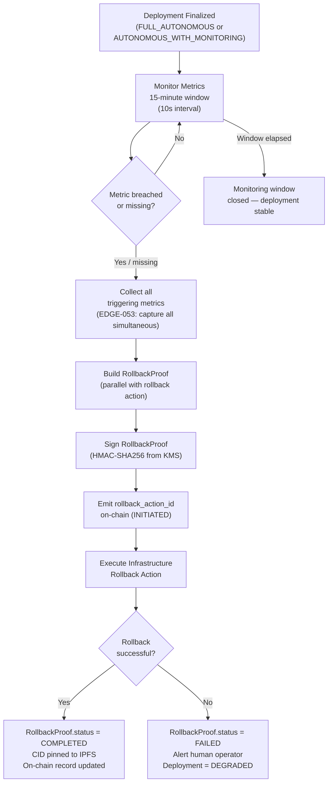
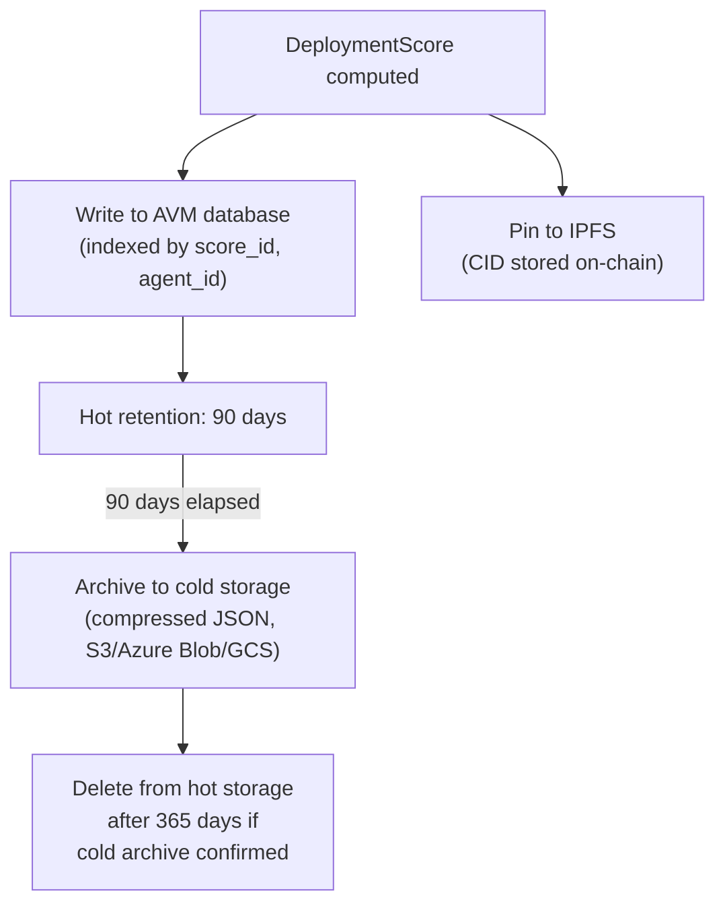
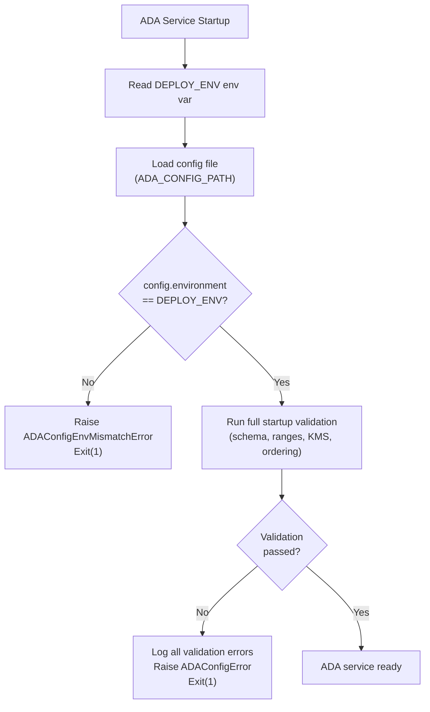
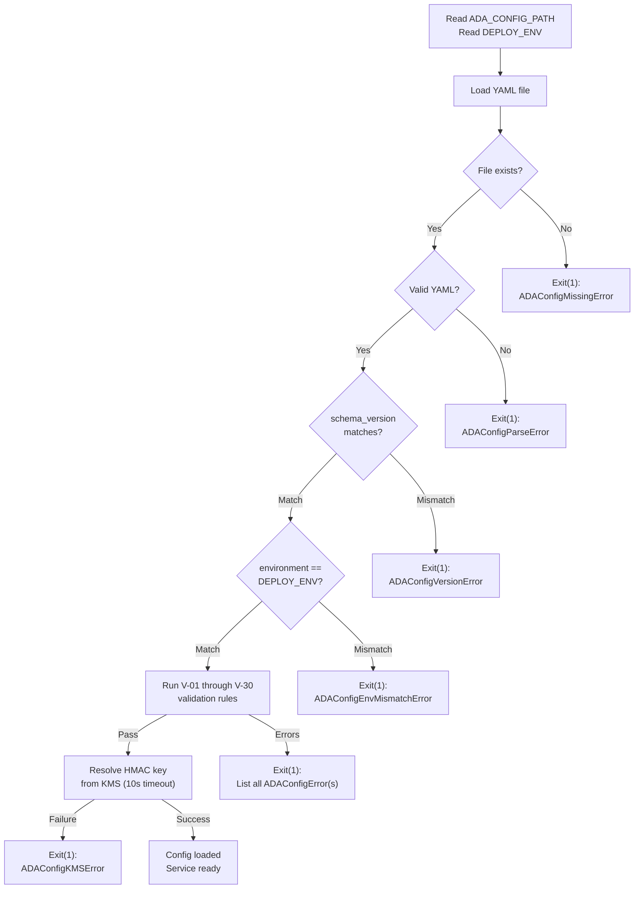
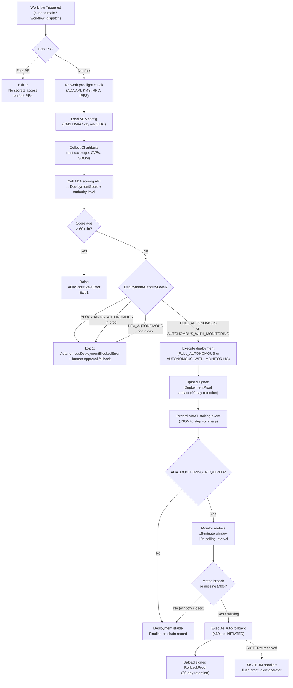

# Autonomous Deployment Authority (ADA) — Technical Specification

<!-- Addresses EDGE-035, EDGE-036, EDGE-037, EDGE-038, EDGE-039, EDGE-040, EDGE-041,
     EDGE-042, EDGE-043, EDGE-044, EDGE-045, EDGE-046, EDGE-047, EDGE-048, EDGE-049,
     EDGE-050, EDGE-051, EDGE-052, EDGE-053, EDGE-054, EDGE-055, EDGE-056, EDGE-057,
     EDGE-058, EDGE-059, EDGE-060, EDGE-061, EDGE-062, EDGE-063, EDGE-064, EDGE-065,
     EDGE-066, EDGE-067, EDGE-068, EDGE-069, EDGE-070, EDGE-071, EDGE-072, EDGE-073,
     EDGE-074, EDGE-075, EDGE-076, EDGE-077, EDGE-078, EDGE-079, EDGE-080,
     EDGE-100, EDGE-101, EDGE-102, EDGE-103, EDGE-104, EDGE-105, EDGE-106, EDGE-107,
     EDGE-108, EDGE-109, EDGE-110, EDGE-111, EDGE-112, EDGE-113, EDGE-114, EDGE-115,
     EDGE-116, EDGE-117, EDGE-118, EDGE-119, EDGE-120, EDGE-121, EDGE-122, EDGE-123,
     EDGE-124, EDGE-125, EDGE-126, EDGE-127, EDGE-128, EDGE-131,
     EDGE-132, EDGE-133, EDGE-134, EDGE-135, EDGE-136, EDGE-137, EDGE-138, EDGE-139,
     EDGE-140, EDGE-141, EDGE-142, EDGE-143, EDGE-144, EDGE-145, EDGE-146, EDGE-147,
     EDGE-148, EDGE-149, EDGE-150, EDGE-151, EDGE-152, EDGE-153,
     EDGE-154, EDGE-155, EDGE-158,
     EDGE-160, EDGE-161, EDGE-162, EDGE-163, EDGE-164, EDGE-165,
     EDGE-166, EDGE-167, EDGE-168, EDGE-169, EDGE-170,
     EDGE-171, EDGE-172, EDGE-173, EDGE-174, EDGE-175, EDGE-176, EDGE-177,
     EDGE-178, EDGE-179, EDGE-180, EDGE-181, EDGE-182, EDGE-183,
     EDGE-184, EDGE-185, EDGE-186, EDGE-187, EDGE-188,
     EDGE-189, EDGE-190, EDGE-191, EDGE-192, EDGE-193,
     EDGE-194, EDGE-195, EDGE-196, EDGE-197, EDGE-198 -->

## Overview

The Autonomous Deployment Authority (ADA) is the MaatProof subsystem that computes a
**multi-signal deployment score**, derives an **authority level**, and either executes
an autonomous deployment or raises `AutonomousDeploymentBlockedError` — with a full
cryptographic proof chain for every decision.

**Language**: Python (dataclasses / Pydantic)  
**Signing**: HMAC-SHA256 over canonical JSON (`hashlib`, `hmac`)  
**Serialization**: JSON (all models require `to_dict()` / `from_dict()`)  
**Hash precision**: All token amounts stored as `int` (wei), never `float`  
**Float precision**: All score fields use Python `Decimal` for deterministic arithmetic

> ### Constitutional Alignment (CONSTITUTION §3, as amended)
>
> CONSTITUTION §3 (amended) designates ADA as the **protocol default** for all deployment
> decisions. Human approval is a **policy primitive** — one possible rule in a Deployment
> Contract (`require_human_approval: stage == PRODUCTION`), not a universal protocol mandate.
>
> ADA `FULL_AUTONOMOUS` is authorised for production only when ALL of the
> following constitutional safeguards are satisfied:
>
> 1. The DAO has voted (≥60% supermajority, ≥10% quorum) to enable `FULL_AUTONOMOUS`
>    for the specific `policy_ref` contract.
> 2. The deployment environment is **not** classified as HIPAA-regulated, SOX-regulated,
>    or any compliance tier that explicitly requires named human accountability (see
>    `docs/07-regulatory-compliance.md` §ADA Compliance Tiers).
> 3. All seven ADA conditions are independently verified by the AVM — no self-reported
>    values are accepted (see §Signal Verification below).
> 4. The on-chain `DeployPolicy` has no `require_human_approval` rule configured for this
>    environment (the policy owner's explicit choice, recorded on-chain).
>
> <!-- Addresses EDGE-044, EDGE-074 -->

---

## Data Models

### 1. `DeploymentScore`

<!-- Addresses EDGE-035, EDGE-036, EDGE-046, EDGE-047, EDGE-050, EDGE-057, EDGE-077 -->

The deployment score aggregates five independently verified signals into a total score
in the range [0.0, 1.0].

```python
from __future__ import annotations
from dataclasses import dataclass, field
from decimal import Decimal, ROUND_HALF_UP
from typing import Any, Dict, Optional
import json
import uuid


@dataclass
class DeploymentScore:
    """Multi-signal deployment readiness score.

    All signal fields are in [0.0, 1.0].  A value of None means the signal
    was not available (e.g. validator_attestation during dev builds).
    None signals contribute 0.0 to the total — the deployer must ensure
    all required signals are populated for the target environment.

    Weights:
      deterministic_gates  25%  (compile / lint / security scan / build)
      dre_consensus        20%  (Deterministic Reasoning Engine consensus)
      logic_verification   20%  (formal / semi-formal logic check)
      validator_attestation 20% (on-chain PoD validator attestation ratio)
      risk_score           15%  (1.0 − normalised_risk, see RiskAssessment)

    Total = sum(signal * weight).  Range: [0.0, 1.0].
    Arithmetic uses Python Decimal to avoid IEEE 754 rounding errors.
    """

    # Signal weights — must sum to Decimal("1.00")
    WEIGHT_DETERMINISTIC_GATES:   Decimal = field(default=Decimal("0.25"), init=False, repr=False)
    WEIGHT_DRE_CONSENSUS:         Decimal = field(default=Decimal("0.20"), init=False, repr=False)
    WEIGHT_LOGIC_VERIFICATION:    Decimal = field(default=Decimal("0.20"), init=False, repr=False)
    WEIGHT_VALIDATOR_ATTESTATION: Decimal = field(default=Decimal("0.20"), init=False, repr=False)
    WEIGHT_RISK_SCORE:            Decimal = field(default=Decimal("0.15"), init=False, repr=False)

    # Signal values — set by AVM; never self-reported by the deploying agent
    deterministic_gates:   Optional[Decimal] = None   # 0.0–1.0 or None
    dre_consensus:         Optional[Decimal] = None
    logic_verification:    Optional[Decimal] = None
    validator_attestation: Optional[Decimal] = None   # fraction of validators that attested
    risk_score:            Optional[Decimal] = None   # 1.0 − normalised_risk

    # Computed fields (populated by compute_total())
    total:     Decimal = field(default=Decimal("0"), init=False)
    score_id:  str     = field(default_factory=lambda: str(uuid.uuid4()))

    def __post_init__(self) -> None:
        # Coerce float → Decimal to prevent silent precision loss
        for attr in ("deterministic_gates", "dre_consensus", "logic_verification",
                     "validator_attestation", "risk_score"):
            val = getattr(self, attr)
            if isinstance(val, float):
                setattr(self, attr, Decimal(str(val)))
        self.compute_total()

    def compute_total(self) -> Decimal:
        """Compute weighted total using Decimal arithmetic.

        Missing signals (None) contribute 0.0.
        Result is quantised to 6 decimal places.
        """
        def _signal(val: Optional[Decimal]) -> Decimal:
            if val is None:
                return Decimal("0")
            # Clamp to [0, 1]
            return max(Decimal("0"), min(Decimal("1"), val))

        total = (
            _signal(self.deterministic_gates)   * self.WEIGHT_DETERMINISTIC_GATES  +
            _signal(self.dre_consensus)         * self.WEIGHT_DRE_CONSENSUS        +
            _signal(self.logic_verification)    * self.WEIGHT_LOGIC_VERIFICATION   +
            _signal(self.validator_attestation) * self.WEIGHT_VALIDATOR_ATTESTATION +
            _signal(self.risk_score)            * self.WEIGHT_RISK_SCORE
        )
        self.total = total.quantize(Decimal("0.000001"), rounding=ROUND_HALF_UP)
        return self.total

    def to_dict(self) -> Dict[str, Any]:
        """Deterministic JSON-safe dict (Decimal → str to preserve precision)."""
        return {
            "score_id":              self.score_id,
            "deterministic_gates":   str(self.deterministic_gates) if self.deterministic_gates is not None else None,
            "dre_consensus":         str(self.dre_consensus)         if self.dre_consensus         is not None else None,
            "logic_verification":    str(self.logic_verification)    if self.logic_verification    is not None else None,
            "validator_attestation": str(self.validator_attestation) if self.validator_attestation is not None else None,
            "risk_score":            str(self.risk_score)            if self.risk_score            is not None else None,
            "total":                 str(self.total),
        }

    @classmethod
    def from_dict(cls, data: Dict[str, Any]) -> "DeploymentScore":
        def _dec(v: Any) -> Optional[Decimal]:
            return Decimal(v) if v is not None else None
        obj = cls(
            deterministic_gates=_dec(data.get("deterministic_gates")),
            dre_consensus=_dec(data.get("dre_consensus")),
            logic_verification=_dec(data.get("logic_verification")),
            validator_attestation=_dec(data.get("validator_attestation")),
            risk_score=_dec(data.get("risk_score")),
        )
        obj.score_id = data.get("score_id", obj.score_id)
        return obj
```

#### Signal Verification Requirements

<!-- Addresses EDGE-057, EDGE-062 -->

**No signal may be self-reported by the deploying agent.** Each signal source:

| Signal | Source | Verification |
|--------|--------|-------------|
| `deterministic_gates` | AVM gate runner (lint/compile/security scan) | WASM sandbox replay; result hash committed to trace |
| `dre_consensus` | DRE consensus engine output | Signed by ≥2/3 DRE nodes |
| `logic_verification` | Logic verifier agent | Signed AVM attestation |
| `validator_attestation` | PoD validator set | On-chain `ValidatorVote` records; computed as `FINALIZE_votes / total_active_validators` — Sybil-resistant because stake-weighted (see §Sybil Resistance) |
| `risk_score` | AVM security agent from verified `RiskAssessment` | Signed; `RiskAssessment` fields verified from CI pipeline artifacts, not agent claim |

#### Sybil Resistance for `validator_attestation`

<!-- Addresses EDGE-019 -->

`validator_attestation` is computed as:

```
validator_attestation = sum(stake[v] for v in FINALIZE_voters) / total_active_stake
```

This is **stake-weighted**, not validator-count-weighted. A Sybil operator registering
100 zero-stake DIDs contributes 0 attestation weight. The minimum validator stake
(100,000 $MAAT) ensures economic cost per fake DID.

---

### 2. `DeploymentAuthorityLevel`

<!-- Addresses EDGE-044, EDGE-046, EDGE-059, EDGE-074 -->

```python
from enum import Enum
from decimal import Decimal


class DeploymentAuthorityLevel(Enum):
    """Authority level derived from DeploymentScore.total.

    Thresholds (inclusive lower bound):
      FULL_AUTONOMOUS          >= 0.90  (all safeguards met; see §Constitutional Compatibility)
      AUTONOMOUS_WITH_MONITORING >= 0.75
      STAGING_AUTONOMOUS       >= 0.60  (staging/dev only)
      DEV_AUTONOMOUS           >= 0.40  (dev/sandbox only)
      BLOCKED                  < 0.40

    Environment restrictions:
      FULL_AUTONOMOUS:          production only if DAO-enabled + non-regulated env
      AUTONOMOUS_WITH_MONITORING: production (auto-rollback monitoring active)
      STAGING_AUTONOMOUS:       staging and below only
      DEV_AUTONOMOUS:           dev/sandbox only
      BLOCKED:                  no deployment permitted

    Compliance override: HIPAA, SOX, and any tier in
    docs/07-regulatory-compliance.md §ADA Compliance Tiers will cap the
    effective authority level at AUTONOMOUS_WITH_MONITORING regardless of score.
    """

    FULL_AUTONOMOUS           = "FULL_AUTONOMOUS"
    AUTONOMOUS_WITH_MONITORING = "AUTONOMOUS_WITH_MONITORING"
    STAGING_AUTONOMOUS        = "STAGING_AUTONOMOUS"
    DEV_AUTONOMOUS            = "DEV_AUTONOMOUS"
    BLOCKED                   = "BLOCKED"

    # Environment capability constraints
    ALLOWED_ENVIRONMENTS: dict = {
        "FULL_AUTONOMOUS":           {"production", "staging", "dev"},
        "AUTONOMOUS_WITH_MONITORING": {"production", "staging", "dev"},
        "STAGING_AUTONOMOUS":        {"staging", "dev"},
        "DEV_AUTONOMOUS":            {"dev", "sandbox"},
        "BLOCKED":                   set(),
    }

    @classmethod
    def from_score(cls, total: Decimal, deploy_environment: str,
                   dao_full_autonomous_enabled: bool = False,
                   compliance_regulated: bool = False) -> "DeploymentAuthorityLevel":
        """Derive authority level from a DeploymentScore total.

        Args:
            total: DeploymentScore.total (Decimal, clamped to [0, 1])
            deploy_environment: target environment string
            dao_full_autonomous_enabled: True only if on-chain DAO vote approved
            compliance_regulated: True for HIPAA/SOX/regulated environments
        """
        total = max(Decimal("0"), min(Decimal("1"), total))

        if total >= Decimal("0.90"):
            level = cls.FULL_AUTONOMOUS
        elif total >= Decimal("0.75"):
            level = cls.AUTONOMOUS_WITH_MONITORING
        elif total >= Decimal("0.60"):
            level = cls.STAGING_AUTONOMOUS
        elif total >= Decimal("0.40"):
            level = cls.DEV_AUTONOMOUS
        else:
            level = cls.BLOCKED

        # Constitutional §3 + Compliance override
        if level == cls.FULL_AUTONOMOUS:
            if not dao_full_autonomous_enabled or compliance_regulated:
                level = cls.AUTONOMOUS_WITH_MONITORING

        # Environment capability check
        allowed = cls.ALLOWED_ENVIRONMENTS.value.get(level.value, set())
        if deploy_environment not in allowed:
            level = cls.BLOCKED

        return level
```

#### Authority Level Thresholds

| Level | Score Range | Production? | Requires DAO Vote? | Regulated Env? |
|-------|-------------|-------------|-------------------|----------------|
| `FULL_AUTONOMOUS` | ≥ 0.90 | ✅ | ✅ Required | ❌ Blocked |
| `AUTONOMOUS_WITH_MONITORING` | 0.75–0.89 | ✅ | ❌ | ✅ Allowed |
| `STAGING_AUTONOMOUS` | 0.60–0.74 | ❌ Staging only | ❌ | N/A |
| `DEV_AUTONOMOUS` | 0.40–0.59 | ❌ Dev only | ❌ | N/A |
| `BLOCKED` | < 0.40 | ❌ | ❌ | N/A |

---

### 3. `RiskAssessment`

<!-- Addresses EDGE-037, EDGE-038, EDGE-039, EDGE-058, EDGE-064, EDGE-075 -->

```python
from __future__ import annotations
from dataclasses import dataclass, field
from typing import Any, Dict, List, Optional
from decimal import Decimal


@dataclass
class RiskAssessment:
    """Deployment risk factors derived from CI pipeline artifacts.

    All fields are populated by the AVM security agent — NOT by the
    deploying agent. The AVM verifies each value against the signed
    CI artifact (test report, SBOM, security scan output).

    Constraints:
      files_changed:          int >= 0; max 100,000 (cap; extreme values capped, not errored)
      lines_changed:          int >= 0; max 10,000,000
      critical_paths_touched: List[str]; each path must match a registered critical-path
                              pattern from the DeployPolicy; unknown paths are REJECTED
      new_dependencies:       List[str]; each entry is a package name + version;
                              max 1,000 entries (EDGE-075 cap)
      test_coverage_delta:    Decimal in [-1.0, +1.0]; negative means tests were deleted
      security_scan_findings: int >= 0 (total finding count); see severity_breakdown
      severity_breakdown:     Dict mapping severity → count (CRITICAL, HIGH, MEDIUM, LOW)
    """

    files_changed:          int              = 0
    lines_changed:          int              = 0
    critical_paths_touched: List[str]        = field(default_factory=list)
    new_dependencies:       List[str]        = field(default_factory=list)
    test_coverage_delta:    Decimal          = Decimal("0")
    security_scan_findings: int              = 0
    # Severity breakdown for security_scan_findings (addresses EDGE-038)
    severity_breakdown:     Dict[str, int]   = field(default_factory=lambda: {
        "CRITICAL": 0, "HIGH": 0, "MEDIUM": 0, "LOW": 0
    })

    def __post_init__(self) -> None:
        # Enforce caps (EDGE-064, EDGE-075)
        self.files_changed  = min(self.files_changed, 100_000)
        self.lines_changed  = min(self.lines_changed, 10_000_000)
        if len(self.new_dependencies) > 1_000:
            raise ValueError(
                f"new_dependencies exceeds max 1,000 entries "
                f"(got {len(self.new_dependencies)})"
            )
        # Coerce float → Decimal (EDGE-037)
        if isinstance(self.test_coverage_delta, float):
            self.test_coverage_delta = Decimal(str(self.test_coverage_delta))
        # Clamp test_coverage_delta to [-1, +1]
        self.test_coverage_delta = max(
            Decimal("-1"), min(Decimal("1"), self.test_coverage_delta)
        )
        # Ensure severity_breakdown totals equal security_scan_findings
        total = sum(self.severity_breakdown.values())
        if total != self.security_scan_findings:
            raise ValueError(
                f"severity_breakdown sum {total} != security_scan_findings "
                f"{self.security_scan_findings}"
            )

    def normalised_risk(self) -> Decimal:
        """Compute a normalised risk score in [0.0, 1.0].

        Higher = riskier.  Used to compute DeploymentScore.risk_score = 1 − normalised_risk.

        Formula (weighted sum, each component in [0, 1]):
          file_factor    = min(files_changed / 500, 1.0)          weight 0.10
          line_factor    = min(lines_changed / 10_000, 1.0)       weight 0.10
          path_factor    = min(len(critical_paths) / 5, 1.0)      weight 0.25
          dep_factor     = min(len(new_dependencies) / 20, 1.0)   weight 0.15
          coverage_factor = max(0, -test_coverage_delta)          weight 0.15  (penalty for coverage drop)
          cve_factor     = min((4*CRITICAL + 2*HIGH + MEDIUM) / 20, 1.0)  weight 0.25
        """
        cve_score = (
            4 * self.severity_breakdown.get("CRITICAL", 0) +
            2 * self.severity_breakdown.get("HIGH", 0)     +
            1 * self.severity_breakdown.get("MEDIUM", 0)
        )
        components = {
            "file":     (Decimal(str(min(self.files_changed / 500, 1.0))),    Decimal("0.10")),
            "line":     (Decimal(str(min(self.lines_changed / 10_000, 1.0))), Decimal("0.10")),
            "path":     (Decimal(str(min(len(self.critical_paths_touched) / 5, 1.0))), Decimal("0.25")),
            "dep":      (Decimal(str(min(len(self.new_dependencies) / 20, 1.0))),      Decimal("0.15")),
            "coverage": (max(Decimal("0"), -self.test_coverage_delta),                 Decimal("0.15")),
            "cve":      (Decimal(str(min(cve_score / 20, 1.0))),                       Decimal("0.25")),
        }
        total = sum(v * w for v, w in components.values())
        return total.quantize(Decimal("0.000001"))

    def to_dict(self) -> Dict[str, Any]:
        return {
            "files_changed":          self.files_changed,
            "lines_changed":          self.lines_changed,
            "critical_paths_touched": self.critical_paths_touched,
            "new_dependencies":       self.new_dependencies,
            "test_coverage_delta":    str(self.test_coverage_delta),
            "security_scan_findings": self.security_scan_findings,
            "severity_breakdown":     self.severity_breakdown,
        }

    @classmethod
    def from_dict(cls, data: Dict[str, Any]) -> "RiskAssessment":
        return cls(
            files_changed=int(data.get("files_changed", 0)),
            lines_changed=int(data.get("lines_changed", 0)),
            critical_paths_touched=list(data.get("critical_paths_touched", [])),
            new_dependencies=list(data.get("new_dependencies", [])),
            test_coverage_delta=Decimal(str(data.get("test_coverage_delta", "0"))),
            security_scan_findings=int(data.get("security_scan_findings", 0)),
            severity_breakdown=dict(data.get("severity_breakdown",
                                             {"CRITICAL": 0, "HIGH": 0, "MEDIUM": 0, "LOW": 0})),
        )
```

#### Critical Path Validation

<!-- Addresses EDGE-039 -->

`critical_paths_touched` entries must match one or more patterns registered in the
`DeployPolicy` contract's `criticalPathPatterns` list.  The AVM rejects a trace if any
path in the list does not match a registered pattern (rejects unknown paths, does not
silently ignore them).

---

### 4. `RollbackProof`

<!-- Addresses EDGE-040, EDGE-041, EDGE-048, EDGE-050, EDGE-054, EDGE-055, EDGE-056,
     EDGE-033, EDGE-034, EDGE-076 -->

```python
from __future__ import annotations
from dataclasses import dataclass, field
from typing import Any, Dict, List, Optional
import hashlib
import hmac
import json
import time
import uuid


@dataclass
class RollbackTriggerMetrics:
    """Metrics that triggered the auto-rollback decision.

    All metric values are observed values at time of trigger.
    All timestamps are Unix seconds (float).

    <!-- Addresses EDGE-053: captures all simultaneous triggers -->
    """
    error_rate_pct:     Optional[float] = None  # e.g. 5.3 → 5.3% error rate
    p99_latency_ms:     Optional[float] = None  # p99 latency in milliseconds
    cpu_utilisation_pct: Optional[float] = None # 0–100
    health_check_failed: Optional[bool] = None  # health check endpoint returned non-2xx
    observed_at:        float           = field(default_factory=time.time)

    # Thresholds that were breached (all simultaneously captured; EDGE-053)
    thresholds_breached: List[str] = field(default_factory=list)

    def to_dict(self) -> Dict[str, Any]:
        return {
            "error_rate_pct":        self.error_rate_pct,
            "p99_latency_ms":        self.p99_latency_ms,
            "cpu_utilisation_pct":   self.cpu_utilisation_pct,
            "health_check_failed":   self.health_check_failed,
            "observed_at":           self.observed_at,
            "thresholds_breached":   self.thresholds_breached,
        }

    @classmethod
    def from_dict(cls, data: Dict[str, Any]) -> "RollbackTriggerMetrics":
        return cls(**{k: data[k] for k in data if k in cls.__dataclass_fields__})


@dataclass
class RollbackProof:
    """Signed reasoning proof produced by the auto-rollback protocol.

    Signing:
      - The canonical JSON of this proof (all fields except `signature`)
        is serialised with sorted keys and no whitespace (UTF-8 bytes).
      - HMAC-SHA256 is computed over the serialised bytes using the
        agent's HMAC secret key (same key as ReasoningProof).
      - The signature is stored as a hex string.

    <!-- Addresses EDGE-040, EDGE-048 -->

    HMAC Key Management:
      - The HMAC secret key MUST be loaded from a KMS secret (Azure Key Vault /
        AWS Secrets Manager / GCP Secret Manager) — never from an environment
        variable directly in production.
      - If the HMAC key cannot be loaded, `build()` raises
        `RollbackProofKeyError` (NOT a silent failure).
      - During key rotation (24h overlap window per §Key Rotation), both the old
        and new keys are attempted during verification. <!-- Addresses EDGE-056 -->

    Traceability:
      - `deployment_trace_id` links back to the original DeploymentTrace.
      - `rollback_action_id` is written to the on-chain audit trail immediately
        upon rollback initiation (before completion), so partial rollbacks are
        detectable. <!-- Addresses EDGE-055 -->

    IPFS Storage:
      - The canonical JSON is pinned to IPFS.  The CID is written on-chain.
      - Validators must resolve the CID before verifying.
      - IPFS fallback: if CID is unresolvable within 30 seconds, the
        RollbackProof is fetched from the AVM node's local cache (max 7-day
        retention). <!-- Addresses EDGE-033 -->

    Versioning:
      - `spec_version` records the ADA spec version used to produce this proof.
      - Validators check `spec_version` before replay.  A mismatch triggers
        WASM stdlib compatibility check (see avm/deterministic-replay.md
        §WASM Stdlib Versioning). <!-- Addresses EDGE-034 -->
    """

    rollback_id:           str                    = field(default_factory=lambda: str(uuid.uuid4()))
    deployment_trace_id:   str                    = ""           # original DeploymentTrace.trace_id
    rollback_action_id:    str                    = field(default_factory=lambda: str(uuid.uuid4()))
    agent_id:              str                    = ""           # DID of the agent initiating rollback
    deploy_environment:    str                    = ""           # must match original trace
    triggering_metrics:    RollbackTriggerMetrics = field(default_factory=RollbackTriggerMetrics)
    signed_reasoning:      str                    = ""           # plain-text reasoning summary
    rollback_status:       str                    = "INITIATED"  # INITIATED | COMPLETED | FAILED
    initiated_at:          float                  = field(default_factory=time.time)
    completed_at:          Optional[float]        = None
    spec_version:          str                    = "1.0"
    signature:             str                    = ""           # HMAC-SHA256 hex; set by sign()

    def _canonical_bytes(self) -> bytes:
        """Deterministic serialisation for HMAC computation.

        Keys are sorted; no whitespace; UTF-8 encoded.
        'signature' field is excluded. <!-- Addresses EDGE-050, EDGE-076 -->
        """
        d = self.to_dict()
        d.pop("signature", None)
        return json.dumps(d, sort_keys=True, separators=(",", ":"),
                          ensure_ascii=False).encode("utf-8")

    def sign(self, secret_key: bytes) -> "RollbackProof":
        """Compute and set HMAC-SHA256 signature.

        Args:
            secret_key: KMS-sourced HMAC key (must be non-empty; EDGE-040)

        Raises:
            RollbackProofKeyError: if secret_key is empty
        """
        if not secret_key:
            raise RollbackProofKeyError("HMAC secret_key must not be empty")
        self.signature = hmac.new(
            secret_key, self._canonical_bytes(), hashlib.sha256
        ).hexdigest()
        return self

    def verify(self, secret_key: bytes) -> bool:
        """Verify HMAC-SHA256 signature (constant-time comparison)."""
        if not secret_key:
            return False
        expected = hmac.new(
            secret_key, self._canonical_bytes(), hashlib.sha256
        ).hexdigest()
        return hmac.compare_digest(self.signature, expected)

    def to_dict(self) -> Dict[str, Any]:
        return {
            "rollback_id":         self.rollback_id,
            "deployment_trace_id": self.deployment_trace_id,
            "rollback_action_id":  self.rollback_action_id,
            "agent_id":            self.agent_id,
            "deploy_environment":  self.deploy_environment,
            "triggering_metrics":  self.triggering_metrics.to_dict(),
            "signed_reasoning":    self.signed_reasoning,
            "rollback_status":     self.rollback_status,
            "initiated_at":        self.initiated_at,
            "completed_at":        self.completed_at,
            "spec_version":        self.spec_version,
            "signature":           self.signature,
        }

    @classmethod
    def from_dict(cls, data: Dict[str, Any]) -> "RollbackProof":
        obj = cls(
            rollback_id=data.get("rollback_id", str(uuid.uuid4())),
            deployment_trace_id=data.get("deployment_trace_id", ""),
            rollback_action_id=data.get("rollback_action_id", str(uuid.uuid4())),
            agent_id=data.get("agent_id", ""),
            deploy_environment=data.get("deploy_environment", ""),
            triggering_metrics=RollbackTriggerMetrics.from_dict(
                data.get("triggering_metrics", {})),
            signed_reasoning=data.get("signed_reasoning", ""),
            rollback_status=data.get("rollback_status", "INITIATED"),
            initiated_at=float(data.get("initiated_at", time.time())),
            completed_at=data.get("completed_at"),
            spec_version=data.get("spec_version", "1.0"),
            signature=data.get("signature", ""),
        )
        return obj


class RollbackProofKeyError(Exception):
    """Raised when the HMAC secret key for RollbackProof signing is missing or empty."""
```

#### Rollback Status State Machine

<!-- Addresses EDGE-055 -->

```mermaid
stateDiagram-v2
    [*] --> INITIATED : rollback triggered; proof created + signed; on-chain action_id emitted

    INITIATED --> COMPLETED : rollback infrastructure action succeeds
    INITIATED --> FAILED    : rollback action fails (infra error, timeout)

    COMPLETED --> [*] : proof finalised; CID pinned to IPFS; on-chain record updated
    FAILED --> [*]    : FAILED status recorded; human operator alerted;
                        deployment remains in DEGRADED state
```

#### Rollback Proof Replay Verification

<!-- Addresses EDGE-023 -->

To prevent replay of a staging `RollbackProof` claiming production:

- `deploy_environment` is included in the signed canonical bytes.
- Validators check that `rollback_proof.deploy_environment` matches the
  `DeploymentTrace.deploy_environment` referenced by `deployment_trace_id`.
- Any mismatch is an immediate rejection with `ROLLBACK_PROOF_ENV_MISMATCH`.

---

### 5. `MaatStake`

<!-- Addresses EDGE-006, EDGE-009, EDGE-012, EDGE-024, EDGE-030, EDGE-042,
     EDGE-049, EDGE-063, EDGE-064, EDGE-070, EDGE-079 -->

```python
from __future__ import annotations
from dataclasses import dataclass, field
from decimal import Decimal
from typing import Any, Dict, Optional
import time
import uuid


@dataclass
class MaatStake:
    """Python representation of an agent or validator's $MAAT stake record.

    `staked_amount` is always stored as int (wei, 1e-18 $MAAT) to avoid
    float precision loss for large amounts. <!-- Addresses EDGE-049 -->

    `risk_multiplier` is derived by the AVM from the RiskAssessment using
    the formula below — it is NEVER accepted as a self-reported value.
    <!-- Addresses EDGE-042, EDGE-079 -->

    Stake locking: <!-- Addresses EDGE-012, EDGE-024 -->
      - `locked_until` is the Unix timestamp after which unstaking is allowed.
      - The MaatToken contract enforces this lock; the Python model is a
        read-only cache of the on-chain state.
      - A stake record is only considered valid if its on-chain equivalent
        (MaatToken.stakes[wallet_address]) shows the same amount and lock.
      - During concurrent deployment submission, the AVM serialises stake
        reads using an advisory lock keyed on agent_id to prevent double-spend.
        <!-- Addresses EDGE-063 -->

    On-chain verification:
      - `staked_amount` is verified against MaatToken.stakedBalanceOf(wallet_address)
        on every AVM policy evaluation.  A Python record with a higher value than
        on-chain is rejected immediately. <!-- Addresses EDGE-006 -->
    """

    stake_id:         str          = field(default_factory=lambda: str(uuid.uuid4()))
    agent_id:         str          = ""           # DID: did:maat:agent:<hex>
    wallet_address:   str          = ""           # Ethereum address (0x...)
    staked_amount:    int          = 0            # wei (int, not float — EDGE-049)
    locked_until:     float        = 0.0          # Unix timestamp; 0 = not locked
    risk_multiplier:  Decimal      = Decimal("1") # AVM-computed; range [1, 100]
    staking_purpose:  str          = "deploy"     # "deploy" | "validator_attestation"
    created_at:       float        = field(default_factory=time.time)

    # Minimum stake thresholds (in wei, matching docs/05-tokenomics.md)
    MIN_STAKE_DEV:        int = field(default=100 * 10**18,     init=False, repr=False)
    MIN_STAKE_STAGING:    int = field(default=1_000 * 10**18,   init=False, repr=False)
    MIN_STAKE_PRODUCTION: int = field(default=10_000 * 10**18,  init=False, repr=False)
    MIN_STAKE_VALIDATOR:  int = field(default=100_000 * 10**18, init=False, repr=False)

    def __post_init__(self) -> None:
        if isinstance(self.staked_amount, float):
            raise TypeError(
                "staked_amount must be int (wei), not float — use int(amount_maat * 10**18)"
            )
        if isinstance(self.risk_multiplier, float):
            self.risk_multiplier = Decimal(str(self.risk_multiplier))
        # Clamp risk_multiplier to [1, 100]; EDGE-064, EDGE-079
        self.risk_multiplier = max(Decimal("1"), min(Decimal("100"), self.risk_multiplier))

    @classmethod
    def compute_risk_multiplier(cls, risk_assessment: "RiskAssessment") -> Decimal:
        """Derive risk_multiplier from a verified RiskAssessment.

        Formula:
          base = 1.0
          +0.5 per critical path touched (max +5)
          +1.0 per CRITICAL security finding (max +10)
          +0.5 per HIGH security finding (max +5)
          ×2.0 if test_coverage_delta < -0.10 (significant test deletion)

        Result clamped to [1, 100].
        """
        base = Decimal("1.0")
        base += min(Decimal("5"), Decimal(str(len(risk_assessment.critical_paths_touched))) * Decimal("0.5"))
        base += min(Decimal("10"), Decimal(str(risk_assessment.severity_breakdown.get("CRITICAL", 0))) * Decimal("1.0"))
        base += min(Decimal("5"), Decimal(str(risk_assessment.severity_breakdown.get("HIGH", 0))) * Decimal("0.5"))
        if risk_assessment.test_coverage_delta < Decimal("-0.10"):
            base *= Decimal("2.0")
        return max(Decimal("1"), min(Decimal("100"), base)).quantize(Decimal("0.01"))

    def required_stake_wei(self, deploy_environment: str) -> int:
        """Return minimum required stake (wei) for given environment × risk_multiplier."""
        base = {
            "production": self.MIN_STAKE_PRODUCTION,
            "staging":    self.MIN_STAKE_STAGING,
            "dev":        self.MIN_STAKE_DEV,
            "sandbox":    self.MIN_STAKE_DEV,
        }.get(deploy_environment, self.MIN_STAKE_PRODUCTION)
        return int(Decimal(str(base)) * self.risk_multiplier)

    def to_dict(self) -> Dict[str, Any]:
        return {
            "stake_id":        self.stake_id,
            "agent_id":        self.agent_id,
            "wallet_address":  self.wallet_address,
            "staked_amount":   self.staked_amount,    # int, wei
            "locked_until":    self.locked_until,
            "risk_multiplier": str(self.risk_multiplier),
            "staking_purpose": self.staking_purpose,
            "created_at":      self.created_at,
        }

    @classmethod
    def from_dict(cls, data: Dict[str, Any]) -> "MaatStake":
        return cls(
            stake_id=data.get("stake_id", str(uuid.uuid4())),
            agent_id=data.get("agent_id", ""),
            wallet_address=data.get("wallet_address", ""),
            staked_amount=int(data["staked_amount"]),   # explicit int cast
            locked_until=float(data.get("locked_until", 0.0)),
            risk_multiplier=Decimal(str(data.get("risk_multiplier", "1"))),
            staking_purpose=data.get("staking_purpose", "deploy"),
            created_at=float(data.get("created_at", time.time())),
        )
```

#### Stake Lock Enforcement During Concurrent Deployment

<!-- Addresses EDGE-063 -->

```mermaid
sequenceDiagram
    participant A1 as Agent Deploy #1
    participant A2 as Agent Deploy #2
    participant AVM as AVM Policy Evaluator
    participant Chain as MaatToken.sol

    A1->>AVM: Submit DeploymentScore (stake_id=X)
    AVM->>AVM: Acquire advisory lock(agent_id)
    AVM->>Chain: stakedBalanceOf(wallet)
    Chain-->>AVM: 10,000 $MAAT
    AVM->>AVM: Record stake snapshot
    A2->>AVM: Submit DeploymentScore (stake_id=X)
    AVM-->>A2: LOCKED — stake evaluation in progress; retry after 5s
    AVM-->>A1: Stake verified; proceeding
    AVM->>AVM: Release lock after finalization
```

---

### 6. `SlashRecord`

<!-- Addresses EDGE-007, EDGE-008, EDGE-010, EDGE-011, EDGE-043,
     EDGE-060, EDGE-078 -->

```python
from __future__ import annotations
from dataclasses import dataclass, field
from enum import Enum
from typing import Any, Dict, Optional
import time
import uuid


class SlashConditionCode(Enum):
    """Maps to Slashing.sol::SlashCondition enum.

    Python names are identical to Solidity names to prevent type mismatch.
    <!-- Addresses EDGE-043 -->
    """
    VAL_DOUBLE_VOTE           = "VAL_DOUBLE_VOTE"
    VAL_INVALID_ATTESTATION   = "VAL_INVALID_ATTESTATION"
    VAL_COLLUSION             = "VAL_COLLUSION"
    VAL_LIVENESS              = "VAL_LIVENESS"
    AGENT_MALICIOUS_DEPLOY    = "AGENT_MALICIOUS_DEPLOY"
    AGENT_POLICY_VIOLATION    = "AGENT_POLICY_VIOLATION"
    AGENT_FALSE_ATTESTATION   = "AGENT_FALSE_ATTESTATION"


@dataclass
class SlashRecord:
    """Python representation of a slash event.

    Relationship to Slashing.sol:
      - A SlashRecord is created in Python when the ADA layer detects a
        slashable condition.
      - It is submitted to Slashing.sol via `submitEvidence()` to initiate
        the on-chain slash process.
      - A SlashRecord with status='LOCAL_ONLY' means the on-chain submission
        has NOT occurred yet — it is NOT a completed slash. <!-- Addresses EDGE-060 -->

    Zero-amount protection: <!-- Addresses EDGE-078 -->
      `slash_amount_wei` must be > 0; a zero-amount slash raises ValueError.

    Zero-address protection: <!-- Addresses EDGE-010 -->
      `slash_recipient` must not be the zero address (0x000...000).
      Slash distribution is handled by Slashing.sol (burn 50% / whistleblower
      25% / DAO 25%); `slash_recipient` here is the accused's wallet address.
    """

    record_id:          str               = field(default_factory=lambda: str(uuid.uuid4()))
    agent_id:           str               = ""      # DID of the accused
    wallet_address:     str               = ""      # Ethereum address of accused
    slash_amount_wei:   int               = 0       # wei (int, not float)
    slash_condition:    SlashConditionCode = SlashConditionCode.AGENT_POLICY_VIOLATION
    slash_reason:       str               = ""      # human-readable explanation
    slash_recipient:    str               = ""      # accused's wallet (zero-address forbidden)
    evidence_bytes:     bytes             = b""     # ABI-encoded proof for Slashing.sol
    on_chain_evidence_id: Optional[int]   = None    # Slashing.sol evidenceId after submission
    status:             str               = "LOCAL_ONLY"  # LOCAL_ONLY | SUBMITTED | EXECUTED | DISMISSED
    created_at:         float             = field(default_factory=time.time)

    _ZERO_ADDRESS: str = field(default="0x0000000000000000000000000000000000000000",
                               init=False, repr=False)

    def __post_init__(self) -> None:
        if isinstance(self.slash_amount_wei, float):
            raise TypeError("slash_amount_wei must be int (wei)")
        if self.slash_amount_wei <= 0:
            raise ValueError(
                f"slash_amount_wei must be > 0 (got {self.slash_amount_wei})"
            )  # EDGE-078
        if self.slash_recipient.lower() == self._ZERO_ADDRESS.lower():
            raise ValueError(
                "slash_recipient must not be zero address"
            )  # EDGE-010

    def to_dict(self) -> Dict[str, Any]:
        return {
            "record_id":            self.record_id,
            "agent_id":             self.agent_id,
            "wallet_address":       self.wallet_address,
            "slash_amount_wei":     self.slash_amount_wei,
            "slash_condition":      self.slash_condition.value,
            "slash_reason":         self.slash_reason,
            "slash_recipient":      self.slash_recipient,
            "evidence_bytes":       self.evidence_bytes.hex(),
            "on_chain_evidence_id": self.on_chain_evidence_id,
            "status":               self.status,
            "created_at":           self.created_at,
        }

    @classmethod
    def from_dict(cls, data: Dict[str, Any]) -> "SlashRecord":
        return cls(
            record_id=data.get("record_id", str(uuid.uuid4())),
            agent_id=data.get("agent_id", ""),
            wallet_address=data.get("wallet_address", ""),
            slash_amount_wei=int(data["slash_amount_wei"]),
            slash_condition=SlashConditionCode(data.get("slash_condition",
                                                          "AGENT_POLICY_VIOLATION")),
            slash_reason=data.get("slash_reason", ""),
            slash_recipient=data.get("slash_recipient", ""),
            evidence_bytes=bytes.fromhex(data.get("evidence_bytes", "")),
            on_chain_evidence_id=data.get("on_chain_evidence_id"),
            status=data.get("status", "LOCAL_ONLY"),
            created_at=float(data.get("created_at", time.time())),
        )
```

#### SlashRecord Lifecycle

<!-- Addresses EDGE-060 -->

```mermaid
stateDiagram-v2
    [*] --> LOCAL_ONLY : ADA detects slashable condition; Python SlashRecord created

    LOCAL_ONLY --> SUBMITTED : Slashing.sol.submitEvidence() called; evidence_id recorded
    LOCAL_ONLY --> [*]       : Record discarded (e.g. false positive; no on-chain submission)

    SUBMITTED --> EXECUTED   : Governance vote passes OR automatic slash executed
    SUBMITTED --> DISMISSED  : Governance vote dismisses OR appeal succeeds

    EXECUTED --> [*]  : on-chain stake reduced; SlashRecord.status updated
    DISMISSED --> [*] : whistleblower loses deposit; SlashRecord.status updated
```

---

### 7. `AutonomousDeploymentBlockedError`

<!-- Addresses EDGE-045, EDGE-061, EDGE-073 -->

```python
from __future__ import annotations
from typing import Any, Dict, Optional


class AutonomousDeploymentBlockedError(MaatProofError):
    """Raised when the ADA system cannot authorise an autonomous deployment.

    Replaces HumanApprovalRequiredError for ADA-managed deployments.

    Migration guide:
      Old:  except HumanApprovalRequiredError as e: ...
      New:  except (HumanApprovalRequiredError, AutonomousDeploymentBlockedError) as e: ...

    This exception is automatically recorded in the immutable audit trail
    (CONSTITUTION §7) by the ADA orchestrator before raising.
    <!-- Addresses EDGE-061 -->

    Compliance classification (docs/07-regulatory-compliance.md):
      - SOC 2 Type II: maps to CC6.1 (Logical Access Controls)
      - HIPAA: maps to §164.312(a)(2)(i) (Access control)
      - SOX: maps to ITGC control IT-CC-03 (Change Management)
    <!-- Addresses EDGE-073 -->
    """

    def __init__(
        self,
        reason: str,
        authority_level: Optional[str] = None,
        deployment_score: Optional[Dict[str, Any]] = None,
        trace_id: Optional[str] = None,
    ) -> None:
        self.reason           = reason
        self.authority_level  = authority_level
        self.deployment_score = deployment_score
        self.trace_id         = trace_id
        super().__init__(
            f"Autonomous deployment blocked: {reason}"
            + (f" (authority_level={authority_level})" if authority_level else "")
            + (f" [trace={trace_id}]" if trace_id else "")
        )

    def to_dict(self) -> Dict[str, Any]:
        return {
            "error":            "AutonomousDeploymentBlockedError",
            "reason":           self.reason,
            "authority_level":  self.authority_level,
            "deployment_score": self.deployment_score,
            "trace_id":         self.trace_id,
        }
```

#### Migration Compatibility

<!-- Addresses EDGE-045 -->

`AutonomousDeploymentBlockedError` inherits from `MaatProofError` (same as
`HumanApprovalRequiredError`).  During the migration period:

1. All `except HumanApprovalRequiredError` catch blocks must be updated to
   `except (HumanApprovalRequiredError, AutonomousDeploymentBlockedError)`.
2. A `DeprecationWarning` is emitted when `HumanApprovalRequiredError` is
   raised in a production deployment context (signals incomplete migration).
3. `HumanApprovalRequiredError` is NOT removed in this iteration — it remains
   for non-ADA code paths.  Removal is tracked in a separate deprecation issue.

---

## Auto-Rollback Protocol

<!-- Addresses EDGE-051, EDGE-052, EDGE-054 -->

### Monitoring Window

| Parameter | Value |
|-----------|-------|
| Monitoring window | 15 minutes after deployment |
| Metric check interval | 10 seconds |
| Rollback SLA | ≤ 60 seconds from trigger to `INITIATED` status |
| `RollbackProof` generation SLA | ≤ 30 seconds (parallelised with rollback action) |

### Trigger Thresholds (Default Policy)

| Metric | Trigger Condition |
|--------|-------------------|
| `error_rate_pct` | > 5% over any 60-second window |
| `p99_latency_ms` | > 2× pre-deployment baseline |
| `cpu_utilisation_pct` | > 95% sustained for > 120 seconds |
| `health_check_failed` | Any 3 consecutive failures |

> **False Positive Mitigation (EDGE-051)**: Each metric has a configurable
> `planned_maintenance_window` flag that suppresses rollback triggers during
> known load tests. This flag requires a signed `MaintenanceWindow` approval
> token (Ed25519, valid for ≤4 hours, recorded on-chain).

### Missing Metrics Handling

<!-- Addresses EDGE-052 -->

| Monitoring State | Behaviour |
|-----------------|-----------|
| Metrics available + healthy | No rollback |
| Metrics available + degraded | Rollback triggered |
| Metrics missing for < 30s | Warn; continue monitoring |
| Metrics missing for ≥ 30s | Trigger rollback as precaution (fail-safe) |
| Monitoring infra down | Trigger rollback; alert human operator |

### Rollback Flow



---

## Security Properties

### CONSTITUTION §3 Compliance Summary

<!-- Addresses EDGE-044 -->

| ADA Authority Level | Production Deploy | Human Approval Required? | Conditions |
|---------------------|------------------|--------------------------|-----------|
| `FULL_AUTONOMOUS` | ✅ | ❌ Per-deployment | DAO vote required; non-regulated env only |
| `AUTONOMOUS_WITH_MONITORING` | ✅ | ❌ Per-deployment | Auto-rollback active |
| `STAGING_AUTONOMOUS` | ❌ (staging) | N/A | — |
| `DEV_AUTONOMOUS` | ❌ (dev) | N/A | — |
| `BLOCKED` | ❌ | ✅ Human approval required | Falls back to §3 |

When `BLOCKED`, `AutonomousDeploymentBlockedError` is raised and the issue
is escalated via the standard human-approval path per CONSTITUTION §3.

### Agent Capability + Authority Level Enforcement

<!-- Addresses EDGE-059 -->

The AVM enforces that `DeploymentAuthorityLevel` does not exceed the agent's
registered on-chain capability:

| Agent Capability | Max Permitted Authority Level |
|------------------|------------------------------|
| `deploy:production` | `FULL_AUTONOMOUS` (if DAO-enabled) |
| `deploy:staging` | `STAGING_AUTONOMOUS` |
| `deploy:dev` | `DEV_AUTONOMOUS` |
| No capability | `BLOCKED` |

An agent with only `deploy:staging` that receives a score of 0.95 is capped at
`STAGING_AUTONOMOUS`, not promoted to `FULL_AUTONOMOUS`.

### Audit Trail Requirement

<!-- Addresses EDGE-061 -->

The following ADA events MUST be written to the append-only audit log
(CONSTITUTION §7) **before** raising exceptions:

| Event | Audit Log Entry |
|-------|----------------|
| `AutonomousDeploymentBlockedError` raised | `ADA_DEPLOY_BLOCKED` + reason + score + trace_id |
| `RollbackProof` signed | `ADA_ROLLBACK_INITIATED` + rollback_id + rollback_action_id |
| `SlashRecord` submitted on-chain | `ADA_SLASH_SUBMITTED` + evidence_id + condition |
| `DeploymentAuthorityLevel` computed | `ADA_AUTHORITY_COMPUTED` + level + score + agent_id |

---

## Compliance

<!-- Addresses EDGE-073, EDGE-074 -->

### ADA Compliance Tiers

| Tier | Environments | Max Authority Level | Rationale |
|------|-------------|--------------------|-----------| 
| **Unrestricted** | dev, sandbox | `FULL_AUTONOMOUS` | No regulatory requirements |
| **Standard** | staging, non-regulated prod | `FULL_AUTONOMOUS` (DAO-enabled) | Normal ADA operation |
| **HIPAA** | HIPAA-regulated prod | `AUTONOMOUS_WITH_MONITORING` | Named human accountability required by §164.312 |
| **SOX** | SOX-regulated prod | `AUTONOMOUS_WITH_MONITORING` | ITGC change management requires human sign-off |
| **Critical Infrastructure** | Any critical infra prod | `BLOCKED` (human always required) | Per CONSTITUTION §3 |

`compliance_regulated = True` is set by the AVM when the `DeployPolicy` contract
includes compliance tier metadata. The ADA `from_score()` method uses this flag to
cap the authority level.

---

## JSON Serialisation Contract

<!-- Addresses EDGE-050, EDGE-071 -->

All ADA models use **Pydantic v2** for production use (serialisation to/from JSON).
The `to_dict()` / `from_dict()` methods on each dataclass provide a lightweight
alternative for testing and internal use.

Rules:
1. Decimal fields are serialised as strings (not floats) — prevents JSON float
   precision loss.
2. int fields representing wei amounts are serialised as integers — prevents
   scientific notation (e.g. `1e22`).
3. All dict serialisations sort keys — ensures deterministic canonical JSON
   for HMAC and hash computation.
4. `enum` fields are serialised using `.value` (the string form) — ensures
   cross-language compatibility.

---

## DeploymentScore Storage and Retention

<!-- Addresses EDGE-065 -->

`DeploymentScore` records are persisted by the AVM node for audit and forensic
purposes.

| Property | Value |
|----------|-------|
| **Storage location** | AVM node database + IPFS (CID stored on-chain) |
| **Minimum retention** | 90 days (SOX/SOC2 requirement) |
| **Recommended retention** | 365 days |
| **Archival format** | Canonical JSON (sorted keys, Decimal as string) |
| **Index keys** | `score_id`, `agent_id`, `deploy_environment`, `created_at` |
| **Max records per day** | 100,000 (after which oldest records are archived to cold storage) |

### Retention Flow



---

## Concurrent Score Conflict Resolution

<!-- Addresses EDGE-066 -->

When two ADA scoring agents compute conflicting `DeploymentScore` results for the
same deployment (same `trace_id`), the following protocol applies:

### Resolution Rules

| Condition | Resolution |
|-----------|-----------|
| Both agents agree on authority level | Use the first result received by the orchestrator |
| Agents disagree on authority level | Use the **lower** (more conservative) authority level |
| One result is missing signals (`None`) | Use the result with more complete signals; if equal, use lower level |
| Total score delta > 0.10 | Treat as conflict; log `ADA_SCORE_CONFLICT`; escalate to human operator |

### Conflict Audit Entry

A conflict is logged as `ADA_SCORE_CONFLICT` in the audit trail:

```json
{
  "event": "ADA_SCORE_CONFLICT",
  "trace_id": "<deployment-trace-id>",
  "score_a": { "total": "0.91", "authority_level": "FULL_AUTONOMOUS" },
  "score_b": { "total": "0.72", "authority_level": "AUTONOMOUS_WITH_MONITORING" },
  "resolution": "AUTONOMOUS_WITH_MONITORING",
  "resolution_reason": "lower_authority_wins",
  "timestamp": "<ISO-8601>"
}
```

Human escalation is triggered when delta > 0.10 — the deployment is blocked
(`AutonomousDeploymentBlockedError`) until a human operator reviews both scores.

---

## CI Integration and Missing Field Handling

<!-- Addresses EDGE-068, EDGE-069, EDGE-070 -->

When CI pipeline artifacts are unavailable, `RiskAssessment` fields default to
`None` (where Optional) or conservative defaults:

| Field | CI Failure Behaviour | Effect on Score |
|-------|---------------------|-----------------|
| `files_changed` | Default to `0`; log CI_ARTIFACT_MISSING warning | No risk penalty |
| `lines_changed` | Default to `0`; log warning | No risk penalty |
| `test_coverage_delta` | Default to `Decimal("0")`; log warning | No coverage penalty |
| `security_scan_findings` | Default to `0` with severity_breakdown all 0; log `SECURITY_SCAN_MISSING` — treated as HIGH risk in risk_score computation | Risk penalty applied |
| `critical_paths_touched` | Default to `[]` if unknown; log warning | No path risk penalty |

**Note on EDGE-068 (GitHub API rate limit)**: If the GitHub API is rate-limited
during `files_changed` computation, the AVM retries with exponential backoff
(max 3 attempts, 10s/30s/90s). If all retries fail, `files_changed` defaults
to 500 (medium risk proxy) and the issue is logged.

**Note on EDGE-070 (model/contract mismatch)**: `MaatStake.staked_amount` is
always re-verified against `MaatToken.stakedBalanceOf(wallet_address)` at
evaluation time. If the Python cached value differs from on-chain, the
on-chain value wins. No `risk_multiplier` field exists in the smart contract —
it is computed fresh by the AVM on each evaluation from the current
`RiskAssessment`.

---

## ADA Configuration Schema

<!-- Addresses EDGE-100, EDGE-101, EDGE-102, EDGE-103, EDGE-104, EDGE-105, EDGE-106,
     EDGE-107, EDGE-108, EDGE-109, EDGE-110, EDGE-111, EDGE-112, EDGE-113, EDGE-114,
     EDGE-115, EDGE-116, EDGE-117, EDGE-118, EDGE-119, EDGE-120, EDGE-121, EDGE-122,
     EDGE-123, EDGE-124, EDGE-125, EDGE-126, EDGE-127, EDGE-128, EDGE-131,
     EDGE-132, EDGE-133, EDGE-134, EDGE-135, EDGE-136, EDGE-137, EDGE-138, EDGE-139,
     EDGE-140, EDGE-141, EDGE-142, EDGE-143, EDGE-144, EDGE-145, EDGE-146, EDGE-147,
     EDGE-148, EDGE-149, EDGE-150, EDGE-151, EDGE-152, EDGE-153,
     EDGE-154, EDGE-155, EDGE-158,
     EDGE-160, EDGE-161, EDGE-162, EDGE-163, EDGE-164, EDGE-165 -->

The ADA service is configured via a **YAML configuration file** whose path is
provided at startup via the `ADA_CONFIG_PATH` environment variable (default:
`/etc/maatproof/ada-config.yaml`).  Separate config files MUST exist for each
deployment environment (`dev`, `uat`, `prod`).  The service resolves which file to
load by matching the `DEPLOY_ENV` environment variable against the `environment`
field inside the config.

> **Constitutional invariant (CONSTITUTION §2)**: No configuration value may reduce
> the `deterministic_gates` signal weight to zero or bypass the hard policy gate
> evaluation.  The config schema enforces this as a hard constraint.

---

### 1. Config YAML Schema

<!-- Addresses EDGE-100, EDGE-101, EDGE-103, EDGE-104, EDGE-105, EDGE-107, EDGE-114 -->

```yaml
# ada-config.yaml — ADA Service Configuration Schema v1
# All fields are required unless marked [optional].
# Loaded once at startup; immutable for the lifetime of the process.

# Schema version — MUST match the ADA spec version in use.
# Mismatch raises ADAConfigVersionError at startup.
schema_version: "1"           # semver major only; "1" = ADA spec v1.x.x

# Environment identifier. MUST match the DEPLOY_ENV environment variable.
# Mismatch between this field and DEPLOY_ENV raises ADAConfigEnvMismatchError.
# Valid values: "dev" | "uat" | "prod"
# Note: "uat" is treated as equivalent to "staging" in all authority level
# computations. The terminology differs only in the config file; all spec
# references to "staging" apply equally to "uat".
environment: "dev"            # REQUIRED; one of: dev | uat | prod

# ── Signal Weights ────────────────────────────────────────────────────────────
# Weights for the five ADA deployment score signals.
# Constraints (all enforced at startup — EDGE-102, EDGE-132, EDGE-133, EDGE-137):
#   1. Each weight MUST be > 0.0 and ≤ 1.0.
#   2. deterministic_gates weight MUST be ≥ 0.10 (CONSTITUTION §2 invariant).
#   3. All five weights MUST sum to 1.0 ± 1e-6 (floating-point tolerance).
#   4. No individual weight may exceed 1.0.
signal_weights:
  deterministic_gates:    0.25   # MUST be ≥ 0.10 (constitutional minimum)
  dre_consensus:          0.20   # MUST be > 0.0
  logic_verification:     0.20   # MUST be > 0.0
  validator_attestation:  0.20   # MUST be > 0.0
  risk_score:             0.15   # MUST be > 0.0

# ── Authority Level Thresholds ────────────────────────────────────────────────
# Score thresholds that map a DeploymentScore total to a DeploymentAuthorityLevel.
# Constraints (EDGE-127, EDGE-128):
#   1. Each threshold MUST be in (0.0, 1.0] exclusive of 0.0.
#   2. Ordering invariant: full_autonomous > autonomous_with_monitoring >
#      staging_autonomous > dev_autonomous > 0.0.
#   3. Values are tunable without code changes (no hard-coded thresholds in src).
authority_thresholds:
  full_autonomous:              0.90   # ≥ this → FULL_AUTONOMOUS
  autonomous_with_monitoring:   0.75   # ≥ this → AUTONOMOUS_WITH_MONITORING
  staging_autonomous:           0.60   # ≥ this → STAGING_AUTONOMOUS
  dev_autonomous:               0.40   # ≥ this → DEV_AUTONOMOUS
  # < dev_autonomous → BLOCKED

# ── Feature Flags ─────────────────────────────────────────────────────────────
# Gates that control ADA operational mode per environment.
# Constraints (EDGE-124, EDGE-125, EDGE-126, EDGE-131):
#   1. full_autonomous_enabled MUST be false in dev and uat by default.
#   2. If require_human_approval is true, it takes precedence over
#      full_autonomous_enabled (more restrictive wins).
#   3. Flag state is captured at deployment start and is immutable for
#      the duration of that deployment's lifecycle.
feature_flags:
  full_autonomous_enabled: false    # Enables FULL_AUTONOMOUS authority level.
                                    # Default: false (dev/uat); explicitly set
                                    # true in prod after DAO vote.
  require_human_approval:  true     # When true, always requires human approval
                                    # regardless of score. Overrides
                                    # full_autonomous_enabled.
  dao_vote_required:        true    # When true, full_autonomous_enabled also
                                    # requires an on-chain DAO vote record.

# ── Rollback Metric Thresholds ────────────────────────────────────────────────
# Thresholds that trigger automatic rollback during the 15-minute monitoring window.
# Constraints (EDGE-140, EDGE-141, EDGE-142, EDGE-143, EDGE-144, EDGE-146, EDGE-147):
#   1. error_rate_pct MUST be in (0.0, 100.0). Cannot be 0.0 (instant rollback) or
#      100.0 (disables error-rate trigger).
#   2. p99_latency_multiplier MUST be ≥ 1.0. Values < 1.0 are nonsensical
#      (would require latency to IMPROVE) and are rejected.
#   3. cpu_utilisation_pct MUST be in (0.0, 100.0].
#   4. health_check_consecutive_failures MUST be ≥ 1.
#   5. At least one rollback trigger MUST be active (cannot set all to max/disabled).
#   6. Missing fields use the defaults below; a WARNING is logged per missing field.
rollback_thresholds:
  error_rate_pct:                       5.0    # > this % over 60s → rollback
  p99_latency_multiplier:               2.0    # > this × baseline → rollback
  cpu_utilisation_pct:                 95.0    # > this % for 120s → rollback
  health_check_consecutive_failures:    3      # ≥ this consecutive → rollback

# ── MAAT Staking Parameters ───────────────────────────────────────────────────
# Minimum stake thresholds and slash percentages.
# Constraints (EDGE-148, EDGE-149, EDGE-150, EDGE-151, EDGE-152, EDGE-153):
#   1. min_stake_maat values MUST be > 0 for all environments.
#   2. Ordering invariant: prod ≥ uat ≥ dev (production stake always highest).
#      Violation raises ADAConfigStakeOrderError at startup.
#   3. slash_percentage MUST be in (0, 100] (cannot be 0 — removes accountability;
#      cannot exceed 100).
#   4. Changes to staking parameters do NOT retroactively affect agents with
#      active stake locks. Locked agents are grandfathered on the parameters in
#      effect at the time their stake was locked, until lock expiry.
staking:
  min_stake_maat:
    dev:  100        # in whole $MAAT (converted to wei internally)
    uat:  1000
    prod: 10000
  slash_percentage:
    agent_policy_violation: 25     # % of stake slashed for AGENT_POLICY_VIOLATION
    agent_malicious_deploy:  50    # % of stake slashed for AGENT_MALICIOUS_DEPLOY
    agent_false_attestation: 50    # % of stake slashed for AGENT_FALSE_ATTESTATION

# ── HMAC Key References ───────────────────────────────────────────────────────
# References to KMS-managed HMAC signing keys for RollbackProof signing.
# Constraints (EDGE-116, EDGE-119, EDGE-120, EDGE-121, EDGE-122, EDGE-123):
#   1. hmac_key_ref MUST be a KMS URI in one of the supported formats:
#        Azure Key Vault:  azurekeyvault://<vault-name>.vault.azure.net/secrets/<secret-name>
#        AWS Secrets Mgr:  awssecretsmanager://<region>/<secret-name>
#        GCP Secret Mgr:   gcpsecretmanager://projects/<project>/secrets/<name>
#   2. Plain-text key values, file paths, and environment variable references
#      (e.g. $MY_KEY or ${MY_KEY}) are REJECTED with ADAConfigKeyRefError.
#      This prevents EDGE-121 (key reference injection via config file).
#   3. Each environment MUST reference a DIFFERENT KMS secret (no shared keys
#      across environments — EDGE-123).
#   4. The key type returned by KMS MUST be a symmetric byte string usable with
#      HMAC-SHA256 (min 32 bytes, max 64 bytes). Wrong key type raises
#      ADAConfigKeyTypeError (EDGE-119).
#   5. Key references are resolved and validated at startup (not lazily on first
#      use). If KMS is unreachable at startup the service does NOT start
#      (fail-closed — EDGE-109, EDGE-116).
hmac_keys:
  rollback_proof_key_ref: "azurekeyvault://myvault.vault.azure.net/secrets/ada-hmac-dev"
  # One ref per environment file. Never shared across environments.

# ── Fail-Open / Fail-Closed Policy ───────────────────────────────────────────
# Controls whether errors during ADA evaluation block or permit deployment.
# Constraints (EDGE-160, EDGE-161, EDGE-162, EDGE-163, EDGE-164, EDGE-165):
#   1. fail_closed_on_score_error: if the score computation raises an exception,
#      the deployment is BLOCKED (true) or proceeds at DEV_AUTONOMOUS (false).
#      MUST be true in prod; MAY be false in dev for faster iteration.
#   2. fail_closed_on_kms_error: if KMS is unreachable DURING deployment (after
#      startup), rollback proof signing is blocked and deployment is halted.
#      MUST be true in all environments (KMS failure always fail-closed).
#   3. fail_closed_on_config_validation_error: if runtime config re-validation
#      fails (e.g. on a config reload attempt), the service is halted.
#      Config validation errors at startup always cause process exit (fail-closed
#      in all environments regardless of this flag).
#   4. ada_blocked_error_behaviour: when AutonomousDeploymentBlockedError is raised:
#        "BLOCK"   — deployment halted; operator alerted (always used in prod).
#        "DEGRADE" — deployment proceeds at lowest permitted level with warning
#                    (only valid in dev/uat and only when
#                    full_autonomous_enabled=false).
fail_closed:
  fail_closed_on_score_error:             true   # MUST be true in prod
  fail_closed_on_kms_error:               true   # MUST be true in all envs
  fail_closed_on_config_validation_error: true   # always true; cannot be overridden
  ada_blocked_error_behaviour: "BLOCK"    # "BLOCK" | "DEGRADE" (dev/uat only)
```

#### Environment Variable Override Policy

<!-- Addresses EDGE-129 -->

Configuration fields in `ada-config.yaml` are **file-only** and MUST NOT be
overridable via environment variables for security-critical parameters.  The
`ADAConfig.load()` implementation MUST enforce the following policy at startup:

| Config Field | Env Var Override Permitted? | Rationale |
|---|---|---|
| `ADA_CONFIG_PATH` | ✅ Path to config file | Operational; not a security parameter |
| `DEPLOY_ENV` | ✅ Environment identifier | Required for env/config matching |
| `feature_flags.*` | ❌ **PROHIBITED** | Security-critical; controls autonomous authority |
| `hmac_keys.*` | ❌ **PROHIBITED** | Secrets resolved via KMS URI only |
| `fail_closed.*` | ❌ **PROHIBITED** | Security posture; must be auditable via file |
| `authority_thresholds.*` | ❌ **PROHIBITED** | Trust boundary thresholds |
| `signal_weights.*` | ❌ **PROHIBITED** | Constitutional invariant (CONSTITUTION §2) |
| `staking.min_stake_maat.*` | ❌ **PROHIBITED** | Economic security parameters |
| `staking.slash_percentage.*` | ❌ **PROHIBITED** | Economic accountability parameters |
| `rollback_thresholds.*` | ✅ (with full validation) | Operational tuning acceptable |

If the loader detects an environment variable that would shadow a prohibited
field, it MUST log `ADA_CONFIG_ENV_OVERRIDE_REJECTED [field=<name>]` to the
audit trail and **ignore the override** (not raise an error, to avoid
environment-variable-as-DoS).  Accepted overrides (rollback_thresholds) are
subject to the same V-14 through V-18 validation rules as file-based values.

---

### 2. Environment-Specific Default Files

<!-- Addresses EDGE-106, EDGE-154, EDGE-155, EDGE-158 -->

Three canonical config files ship with the service. Operators MUST supply these
files for each deployed environment:

| File | `environment` value | `full_autonomous_enabled` | `ada_blocked_error_behaviour` |
|------|---------------------|--------------------------|-------------------------------|
| `ada-config.dev.yaml` | `dev` | `false` | `DEGRADE` |
| `ada-config.uat.yaml` | `uat` | `false` | `BLOCK` |
| `ada-config.prod.yaml` | `prod` | `false` ¹ | `BLOCK` |

¹ Set to `true` only after a successful DAO governance vote enabling
`FULL_AUTONOMOUS` for the specific `policy_ref` (see §Constitutional
Compatibility above).

**Environment Mismatch Guard (EDGE-106, EDGE-154)**:  At startup the ADA service
reads the `environment` field from the config file and compares it to the
`DEPLOY_ENV` environment variable.  If they differ the service raises
`ADAConfigEnvMismatchError` and exits immediately — it is not possible to load
`ada-config.dev.yaml` in a `prod` environment.



---

### 3. Startup Validation Rules

<!-- Addresses EDGE-100, EDGE-101, EDGE-102, EDGE-103, EDGE-104, EDGE-105,
     EDGE-107, EDGE-109, EDGE-110, EDGE-111, EDGE-112, EDGE-113, EDGE-114,
     EDGE-127, EDGE-128, EDGE-133, EDGE-134, EDGE-136, EDGE-137, EDGE-140,
     EDGE-141, EDGE-142, EDGE-143, EDGE-144, EDGE-146, EDGE-148, EDGE-149,
     EDGE-150, EDGE-151 -->

All validations run synchronously before the service accepts any requests.
**Any single failure aborts startup** (fail-closed for all environments).

| # | Rule | Error Raised | Addresses |
|---|------|-------------|-----------|
| V-01 | Config file exists and is readable | `ADAConfigMissingError` | EDGE-100 |
| V-02 | Config file parses as valid YAML (no syntax errors) | `ADAConfigParseError` | EDGE-101 |
| V-03 | `schema_version` field present and matches expected value | `ADAConfigVersionError` | EDGE-114 |
| V-04 | `environment` field is one of `dev`, `uat`, `prod` | `ADAConfigEnvMismatchError` | EDGE-105 |
| V-05 | `environment` matches `DEPLOY_ENV` env var | `ADAConfigEnvMismatchError` | EDGE-106 |
| V-06 | All five `signal_weights` fields are present | `ADAConfigMissingFieldError` | EDGE-104 |
| V-07 | Each signal weight is a numeric type (int or float) | `ADAConfigTypeError` | EDGE-105 |
| V-08 | Each signal weight is in (0.0, 1.0] | `ADAConfigRangeError` | EDGE-103, EDGE-134, EDGE-136 |
| V-09 | `signal_weights.deterministic_gates` ≥ 0.10 (constitutional min) | `ADAConfigConstitutionalViolation` | EDGE-133, EDGE-137 |
| V-10 | Sum of all five signal weights ∈ [0.999999, 1.000001] (±1e-6 tolerance) | `ADAConfigWeightSumError` | EDGE-102, EDGE-132 |
| V-11 | All four `authority_thresholds` present | `ADAConfigMissingFieldError` | EDGE-104 |
| V-12 | Each authority threshold ∈ (0.0, 1.0] | `ADAConfigRangeError` | EDGE-127, EDGE-128 |
| V-13 | Threshold ordering: `full_autonomous > autonomous_with_monitoring > staging_autonomous > dev_autonomous > 0` | `ADAConfigThresholdOrderError` | EDGE-127 |
| V-14 | `rollback_thresholds.error_rate_pct` ∈ (0.0, 100.0) | `ADAConfigRangeError` | EDGE-140, EDGE-141 |
| V-15 | `rollback_thresholds.p99_latency_multiplier` ≥ 1.0 | `ADAConfigRangeError` | EDGE-142 |
| V-16 | `rollback_thresholds.cpu_utilisation_pct` ∈ (0.0, 100.0] | `ADAConfigRangeError` | EDGE-143 |
| V-17 | `rollback_thresholds.health_check_consecutive_failures` ≥ 1 | `ADAConfigRangeError` | EDGE-144 |
| V-18 | At least one rollback threshold is at a value that CAN trigger rollback (not at max) | `ADAConfigRollbackDisabledError` | EDGE-146 |
| V-19 | `staking.min_stake_maat.prod` ≥ `uat` ≥ `dev` ≥ 1 | `ADAConfigStakeOrderError` | EDGE-148, EDGE-149, EDGE-153 |
| V-20 | Each `staking.slash_percentage` ∈ (0, 100] | `ADAConfigRangeError` | EDGE-150, EDGE-151 |
| V-21 | `hmac_keys.rollback_proof_key_ref` matches a valid KMS URI scheme | `ADAConfigKeyRefError` | EDGE-121 |
| V-22 | KMS resolves the key ref to non-empty bytes (min 32 bytes) within 10s | `ADAConfigKMSError` | EDGE-109, EDGE-116, EDGE-122 |
| V-23 | KMS-returned key type is a symmetric byte string (not RSA/EC private key) | `ADAConfigKeyTypeError` | EDGE-119 |
| V-24 | `hmac_keys` secret reference does not contain `$`, `${`, or `env:` (prevents injection) | `ADAConfigKeyRefError` | EDGE-121 |
| V-25 | Unknown YAML keys at the top level emit a WARNING but do not fail startup | — | EDGE-111 |
| V-26 | If `environment` is `prod`, `fail_closed.ada_blocked_error_behaviour` MUST be `BLOCK` | `ADAConfigSecurityViolation` | EDGE-163 |
| V-27 | If `environment` is `prod`, `fail_closed.fail_closed_on_score_error` MUST be `true` | `ADAConfigSecurityViolation` | EDGE-165 |
| V-28 | If `feature_flags.require_human_approval` is `true` and `full_autonomous_enabled` is `true`, log WARNING: `require_human_approval` takes precedence | — | EDGE-126 |
| V-29 | Empty YAML file (zero-length or all comments) raises `ADAConfigMissingFieldError` | `ADAConfigMissingFieldError` | EDGE-110 |
| V-30 | Duplicate YAML keys: last value wins (YAML 1.2 behaviour); emit WARNING per duplicate | — | EDGE-112 |

**Validation error format** (all `ADAConfigError` subclasses):

```python
class ADAConfigError(MaatProofError):
    """Base class for all ADA configuration errors."""
    def __init__(self, field: str, message: str, value: Any = None) -> None:
        self.field   = field
        self.message = message
        self.value   = value
        super().__init__(f"ADA config error [{field}]: {message}"
                         + (f" (got: {value!r})" if value is not None else ""))
```

---

### 4. Config Immutability Contract

<!-- Addresses EDGE-107, EDGE-108, EDGE-113, EDGE-125, EDGE-131, EDGE-138 -->

The ADA configuration is **loaded once at process startup and is immutable** for
the lifetime of the process.  There is no hot-reload mechanism.

Rules:

1. **No runtime mutation**: Any code path that attempts to mutate a loaded config
   value raises `ADAConfigImmutableError`.
2. **In-flight deployment isolation**: Feature flag state and all thresholds are
   captured into the `DeploymentScore` record at the moment scoring begins.  A
   config change (via process restart) does NOT affect in-flight deployments —
   they proceed using the captured snapshot.
3. **Process restart required**: To apply a new config, the ADA service must be
   restarted.  The restart procedure is:
   1. Write new config file to `ADA_CONFIG_PATH`.
   2. Allow in-flight deployments to complete (or forcibly drain after 10
      minutes).
   3. Restart the ADA service process.
4. **Immutable captured snapshot**: Each `DeploymentScore` record stores a
   `config_snapshot_hash` (SHA-256 of the canonical config JSON at scoring time).
   This hash is included in audit records for forensic reproducibility.

---

### 5. HMAC Key Reference Specification

<!-- Addresses EDGE-116, EDGE-117, EDGE-118, EDGE-120, EDGE-121, EDGE-122, EDGE-123 -->

#### Supported KMS URI Formats

| Provider | URI Format | Example |
|----------|-----------|---------|
| Azure Key Vault | `azurekeyvault://<vault>.vault.azure.net/secrets/<name>[/<version>]` | `azurekeyvault://prod.vault.azure.net/secrets/ada-hmac` |
| AWS Secrets Manager | `awssecretsmanager://<region>/<secret-name>[:<version-id>]` | `awssecretsmanager://us-east-1/ada-hmac-prod` |
| GCP Secret Manager | `gcpsecretmanager://projects/<project>/secrets/<name>[/versions/<v>]` | `gcpsecretmanager://projects/my-proj/secrets/ada-hmac` |

**Disallowed formats** (raise `ADAConfigKeyRefError`):
- Plain text strings not starting with a valid KMS scheme prefix
- File paths (`file://`, `/path/to/key`, `./key`)
- Environment variable references (`$KEY`, `${KEY}`, `env:KEY`)
- HTTP/HTTPS URLs

#### KMS Access During Startup

1. The KMS client is initialised with the application's workload identity
   (Managed Identity / IAM Role / Service Account — no static credentials in config).
2. The key is fetched with a **10-second timeout**.
3. On failure:
   - `KMS_NOT_FOUND` (secret deleted / doesn't exist) → `ADAConfigKMSError("key not found")`
   - `KMS_PERMISSION_DENIED` → `ADAConfigKMSError("permission denied")`
   - `KMS_TIMEOUT` (10s elapsed) → retry once after 5s; if second attempt fails → `ADAConfigKMSError("KMS unreachable")`
   - `KMS_RATE_LIMITED` → wait 2s and retry once; if second fails → `ADAConfigKMSError("KMS rate limited")`
4. **All KMS failures at startup are fatal** (fail-closed).  The service does not
   start if the HMAC key cannot be loaded.

#### Key Type Validation

The bytes returned by KMS MUST satisfy:
- Length ∈ [32, 64] bytes.
- Content is raw bytes (not PEM-encoded, not hex-encoded).
- Key is for symmetric HMAC use (not an asymmetric private key).

If the key is PEM-encoded, the service attempts auto-decode before failing.

#### Key Rotation During Active Deployments

<!-- Addresses EDGE-117 -->

During key rotation (24-hour overlap window per `docs/06-security-model.md`
§Key Rotation):

1. Both the old key (`hmac_key_ref`) and the new key
   (`hmac_key_ref_next`, optional field) are loaded at startup.
2. **Signing** always uses the current key (`hmac_key_ref`).
3. **Verification** tries the current key first; if it fails, tries
   `hmac_key_ref_next` (forward compatibility).
4. A `RollbackProof` in-flight when rotation occurs continues to use the
   key loaded at process start.  The ADA service restart (required to apply
   new config) completes the rotation.

#### Per-Environment Key Isolation

<!-- Addresses EDGE-123 -->

Each environment's config file MUST reference a DIFFERENT KMS secret:

| Environment | Config file | `hmac_key_ref` must NOT match |
|-------------|-------------|-------------------------------|
| `dev` | `ada-config.dev.yaml` | uat or prod secret |
| `uat` | `ada-config.uat.yaml` | dev or prod secret |
| `prod` | `ada-config.prod.yaml` | dev or uat secret |

At startup, if the ADA service detects that the current environment's HMAC key
reference resolves to the same key bytes as a different environment's key
(determined by a key fingerprint comparison if multi-env refs are supplied), it
raises `ADAConfigKeyIsolationError`.

---

### 6. Feature Flag Semantics

<!-- Addresses EDGE-124, EDGE-125, EDGE-126, EDGE-131 -->

#### `full_autonomous_enabled`

Controls whether the `FULL_AUTONOMOUS` authority level is reachable.

| Value | Effect |
|-------|--------|
| `false` (default) | Authority level is capped at `AUTONOMOUS_WITH_MONITORING` regardless of score |
| `true` | `FULL_AUTONOMOUS` is reachable IF DAO vote record exists on-chain AND environment is not compliance-regulated |

This flag is a **defence-in-depth layer** on top of the DAO vote check.  Even
if the DAO vote exists on-chain, `FULL_AUTONOMOUS` is unreachable until this
flag is explicitly set to `true` in the prod config file.

**Default values by environment**:

| Environment | `full_autonomous_enabled` default |
|-------------|----------------------------------|
| `dev` | `false` |
| `uat` | `false` |
| `prod` | `false` (must be explicitly set to `true` post-DAO-vote) |

#### `require_human_approval`

When `true`, ADA always raises `AutonomousDeploymentBlockedError` after scoring
and escalates to the human-approval path regardless of the computed authority
level.  This flag is a hard override for all other flags.

**Precedence rule (EDGE-126)**:

```
require_human_approval=true  →  human approval always required  (overrides everything)
require_human_approval=false AND full_autonomous_enabled=true   →  ADA operates normally
require_human_approval=false AND full_autonomous_enabled=false  →  capped at AUTONOMOUS_WITH_MONITORING
```

#### Flag Immutability During Deployment Lifecycle (EDGE-125, EDGE-131)

Feature flag state is captured into the deployment record at the moment
`DeploymentScore.compute_total()` is called.  The captured state is stored in
`config_snapshot_hash` (see §Config Immutability Contract).  A process restart
that changes flag values does NOT affect in-flight deployments.

---

### 7. Signal Weight Validation Details

<!-- Addresses EDGE-132, EDGE-133, EDGE-134, EDGE-135, EDGE-136, EDGE-137,
     EDGE-138, EDGE-139 -->

#### Constitutional Minimum for `deterministic_gates`

The `deterministic_gates` signal weight has a **hard minimum of 0.10** (10%).
This is enforced by V-09 in the startup validation table and is derived directly
from CONSTITUTION §2 ("deterministic gates are non-negotiable").

Setting `deterministic_gates: 0.0` would allow a deployment with all policy
gates failed to still reach `AUTONOMOUS_WITH_MONITORING` via other high signals —
a constitutional violation.  The minimum of 0.10 guarantees that a total failure
of deterministic gates (signal = 0.0) reduces the total score by at least 0.10,
ensuring it cannot reach the `full_autonomous` threshold of 0.90 via other
signals alone.

#### Per-Environment Weight Overrides

Each environment file may specify its own `signal_weights` block.  If the
environment-specific block is present, **all five weights must be present** in
that block.  Partial overrides (specifying only some weights) are NOT permitted —
the intent is to prevent accidental omission leading to a weight being implicitly
zeroed.  Missing any weight in a specified `signal_weights` block raises
`ADAConfigMissingFieldError`. (Addresses EDGE-135.)

#### Atomicity of Weight Reads During Scoring

The `DeploymentScore` dataclass reads all five weights from the loaded config
object in a single atomic access at the time `compute_total()` is called.  Weights
are stored as `Decimal` constants on the class (not re-read from config on each
call).  This guarantees that in-flight score computations are unaffected by process
restarts. (Addresses EDGE-138.)

---

### 8. Rollback Threshold Validation Details

<!-- Addresses EDGE-140, EDGE-141, EDGE-142, EDGE-143, EDGE-144, EDGE-145,
     EDGE-146, EDGE-147 -->

#### Minimum Active Trigger Requirement (EDGE-146)

V-18 in the startup validation table ensures that at least one rollback trigger
can fire.  "At maximum" means:
- `error_rate_pct` = 100.0 (disabled — any rate under 100% won't trigger)
- `p99_latency_multiplier` = ∞ or absent (disabled)
- `cpu_utilisation_pct` = 100.0 (never triggered in practice)
- `health_check_consecutive_failures` absent (disabled)

If ALL four triggers are at their maximum/disabled values, `ADAConfigRollbackDisabledError`
is raised at startup.  At least one trigger must be in an active (non-maximum) state.

#### Missing Threshold Fields (EDGE-147)

If any rollback threshold field is absent from the config file:

1. The default value (from §1 above) is used silently.
2. A `WARNING: ADA_CONFIG_DEFAULT_USED [field=<name>]` entry is logged to the
   audit trail at startup.

This ensures operators are always aware that a field is using the default rather
than an explicit value.

#### Prod-vs-Dev Threshold Ordering (EDGE-145)

The spec does NOT enforce that prod thresholds are strictly tighter than dev
thresholds — this is considered an operational concern, not a security invariant.
However, the CI pipeline SHOULD include a threshold comparison lint check that
warns when prod rollback thresholds are more lenient than uat or dev equivalents.

---

### 9. Staking Parameter Validation Details

<!-- Addresses EDGE-148, EDGE-149, EDGE-150, EDGE-151, EDGE-152, EDGE-153 -->

#### Ordering Invariant (EDGE-148, EDGE-153)

The startup validator enforces:

```
min_stake_maat.prod ≥ min_stake_maat.uat ≥ min_stake_maat.dev ≥ 1
```

Any violation raises `ADAConfigStakeOrderError` with a message identifying which
pair violates the ordering.

#### Zero Stake Rejection (EDGE-149)

A `min_stake_maat` value of `0` for any environment is rejected by V-19.  An
agent with zero stake provides no economic accountability — setting minimum stake
to zero is equivalent to removing the staking mechanism entirely and is a
security violation.

#### Slash Percentage Bounds (EDGE-150, EDGE-151)

Each `slash_percentage` value MUST be in the range `(0, 100]`:
- `0` is rejected: removes economic accountability.
- Values > 100 are rejected: slashing more than 100% of stake is mathematically
  impossible and likely indicates a configuration error (e.g. percentage expressed
  as a decimal — `0.25` instead of `25`).

#### Grandfathering for In-Flight Locked Stakes (EDGE-152)

When staking parameters change (via process restart with new config):

1. Agents whose stake is currently locked (`locked_until > now()`) retain the
   slash percentages in effect at the time their stake was locked.
2. The AVM reads the governing slash parameters from the `DeploymentTrace` record
   that corresponds to the active stake lock — not from the current config.
3. New deployments after the restart use the new parameters.

---

### 10. Environment Isolation Rules

<!-- Addresses EDGE-154, EDGE-155, EDGE-158 -->

#### Cross-Environment Credential Prevention (EDGE-155)

The config validator checks HMAC key references for cross-environment indicators:
- If the `hmac_key_ref` URI contains the substring of a different environment
  (e.g., a `prod` config references a secret named `ada-hmac-dev`), a WARNING
  is emitted: `ADA_CONFIG_CROSS_ENV_KEY_SUSPECTED`.
- This is a WARNING (not an error) because secret naming conventions vary.
  Operators must confirm the reference is intentional.

#### Identical Config Files Across Environments (EDGE-158)

If the canonical JSON of `ada-config.dev.yaml`, `ada-config.uat.yaml`, and
`ada-config.prod.yaml` produce the same SHA-256 hash (excluding the
`environment` field), the CI pipeline SHOULD emit a warning:
`ADA_CONFIG_IDENTICAL_ENVS_SUSPECTED`. This is not a startup error but indicates
the operator may have copy-pasted the wrong file.

---

### 11. Fail-Open / Fail-Closed Policy

<!-- Addresses EDGE-160, EDGE-161, EDGE-162, EDGE-163, EDGE-164, EDGE-165 -->

#### Summary Table

| Failure Mode | `dev` | `uat` | `prod` | Configurable? |
|---|---|---|---|---|
| KMS unreachable at startup | Fail-closed (exit) | Fail-closed (exit) | Fail-closed (exit) | No |
| KMS unreachable during deployment | Fail-closed (block) | Fail-closed (block) | Fail-closed (block) | No |
| Score computation error | Configurable (default: BLOCK) | BLOCK | BLOCK (enforced) | dev only |
| Config validation failure at startup | Fail-closed (exit) | Fail-closed (exit) | Fail-closed (exit) | No |
| Network partition during config load | Fail-closed (exit) | Fail-closed (exit) | Fail-closed (exit) | No |
| `AutonomousDeploymentBlockedError` | DEGRADE (configurable) | BLOCK | BLOCK (enforced) | dev/uat only |

#### Semantics

**`BLOCK`**: The deployment is halted.  `AutonomousDeploymentBlockedError` is
raised and recorded in the audit trail.  An operator notification is sent via the
configured alerting channel.  The deployment must be manually retried or
escalated to human approval.

**`DEGRADE`**: (dev/uat only) The deployment proceeds at the lowest permitted
authority level for the environment (`DEV_AUTONOMOUS` or `STAGING_AUTONOMOUS`),
with a WARNING logged and an audit entry of type `ADA_DEGRADED_MODE_USED`.  This
setting MUST NOT be used in prod (enforced by V-26, V-27 at startup).

**Fail-closed for KMS errors (EDGE-160, EDGE-164)**:  KMS failures are
unconditionally fail-closed in all environments.  A deployment that cannot sign
its `RollbackProof` cannot be safely reversed — proceeding without a signed proof
would violate the audit trail integrity required by CONSTITUTION §7.

**Score error default (EDGE-165)**:  When a score computation raises an unexpected
exception (e.g. NaN propagation, unexpected None), the default behaviour is
`BLOCKED` with error details captured in the audit trail.  In dev, operators may
set `fail_closed_on_score_error: false` to allow the deployment to proceed at
`DEV_AUTONOMOUS` (useful during feature development of new scoring signals).

---

### 12. UAT Environment Terminology

<!-- Addresses EDGE-130 (partial — tracked in GitHub issue for full alignment) -->

The issue backlog uses `uat` as an environment name, while the ADA spec and
compliance tiers use `staging`.  **For all ADA purposes, `uat` and `staging`
are treated as synonymous**:

- `DeploymentAuthorityLevel.STAGING_AUTONOMOUS` applies to both `uat` and `staging`
  environments.
- Compliance tier mapping: `uat` → **Standard** tier (same as `staging`).
- The config file uses `environment: "uat"` or `environment: "staging"` — both
  values are accepted; they map to the same internal enum value.

Full terminology alignment (renaming one to the other codebase-wide) is tracked
in a separate GitHub issue.

---

### 13. Config Loading Flow Diagram



---

### 14. Python Config Loader Reference Implementation

```python
from __future__ import annotations
import hashlib
import json
import os
from dataclasses import dataclass, field
from decimal import Decimal
from typing import Any, Dict, Optional
import yaml  # PyYAML

SUPPORTED_SCHEMA_VERSIONS = {"1"}
VALID_ENVIRONMENTS = {"dev", "uat", "staging", "prod"}
VALID_KMS_SCHEMES = ("azurekeyvault://", "awssecretsmanager://", "gcpsecretmanager://")
FORBIDDEN_KEY_REF_PATTERNS = ("$", "${", "env:", "file://", "http://", "https://")
# Constitutional minimum for deterministic_gates weight (CONSTITUTION §2)
MIN_DETERMINISTIC_GATES_WEIGHT = Decimal("0.10")
WEIGHT_SUM_TOLERANCE = Decimal("1e-6")


@dataclass
class ADAConfig:
    """Loaded, validated ADA configuration.  Immutable after construction."""

    environment:          str
    schema_version:       str
    signal_weights:       Dict[str, Decimal]
    authority_thresholds: Dict[str, Decimal]
    feature_flags:        Dict[str, Any]
    rollback_thresholds:  Dict[str, Any]
    staking:              Dict[str, Any]
    hmac_keys:            Dict[str, str]
    fail_closed:          Dict[str, Any]
    config_snapshot_hash: str  # SHA-256 of canonical config JSON at load time

    @classmethod
    def load(cls, config_path: Optional[str] = None) -> "ADAConfig":
        """Load and validate ADA config.  Raises ADAConfigError subclass on any failure."""
        path = config_path or os.environ.get("ADA_CONFIG_PATH", "/etc/maatproof/ada-config.yaml")
        deploy_env = os.environ.get("DEPLOY_ENV", "")

        # V-01: File must exist
        if not os.path.isfile(path):
            raise ADAConfigMissingError("config_path", f"File not found: {path}")

        # V-02: Valid YAML
        with open(path, "r", encoding="utf-8") as f:
            raw = f.read()
        try:
            data: Dict[str, Any] = yaml.safe_load(raw) or {}
        except yaml.YAMLError as exc:
            raise ADAConfigParseError("config_path", f"YAML parse error: {exc}")

        # V-29: Non-empty
        if not data:
            raise ADAConfigMissingError("config_path", "Config file is empty")

        # V-03: schema_version
        version = str(data.get("schema_version", ""))
        if version not in SUPPORTED_SCHEMA_VERSIONS:
            raise ADAConfigVersionError("schema_version", f"Unsupported: {version!r}", version)

        # V-04 + V-05: environment
        env = str(data.get("environment", ""))
        if env not in VALID_ENVIRONMENTS:
            raise ADAConfigEnvMismatchError("environment", f"Unknown environment: {env!r}", env)
        if deploy_env and env not in (deploy_env, "staging" if deploy_env == "uat" else deploy_env):
            raise ADAConfigEnvMismatchError(
                "environment",
                f"Config env={env!r} != DEPLOY_ENV={deploy_env!r}",
            )

        # Compute snapshot hash BEFORE any mutation
        snapshot_hash = hashlib.sha256(
            json.dumps(data, sort_keys=True, default=str).encode()
        ).hexdigest()

        config = cls(
            environment=env,
            schema_version=version,
            signal_weights={},
            authority_thresholds={},
            feature_flags=data.get("feature_flags", {}),
            rollback_thresholds=data.get("rollback_thresholds", {}),
            staking=data.get("staking", {}),
            hmac_keys=data.get("hmac_keys", {}),
            fail_closed=data.get("fail_closed", {}),
            config_snapshot_hash=snapshot_hash,
        )
        config._validate_signal_weights(data.get("signal_weights", {}))
        config._validate_authority_thresholds(data.get("authority_thresholds", {}))
        config._validate_rollback_thresholds()
        config._validate_staking()
        config._validate_hmac_keys()
        config._validate_fail_closed()
        return config

    # ... (full validation methods omitted for brevity;
    #      implement each V-06 through V-30 rule as a method)
```

---

## GitHub Actions CI/CD Workflow Integration

<!-- Addresses EDGE-200, EDGE-201, EDGE-204, EDGE-206, EDGE-210, EDGE-211,
     EDGE-213, EDGE-214, EDGE-222, EDGE-226, EDGE-227, EDGE-228, EDGE-230,
     EDGE-234, EDGE-238, EDGE-239, EDGE-242, EDGE-243, EDGE-244, EDGE-246,
     EDGE-249, EDGE-251, EDGE-253, EDGE-260, EDGE-264, EDGE-265, EDGE-266,
     EDGE-267, EDGE-268, EDGE-269, EDGE-270 -->

This section specifies how the ADA service integrates with GitHub Actions workflows
(`ada-deploy.yml`). All rules here supplement the core ADA protocol rules above; the
core rules (authority levels, rollback, staking, signing) remain in effect unchanged.

---

### 1. Mandatory Workflow Step Ordering

<!-- Addresses EDGE-226 -->

The `ada-deploy.yml` workflow MUST execute steps in the following order.  No
deployment step may run before ADA scoring completes. Violation of this order
is a **Critical** security issue — a deployment without a prior ADA authorization
check bypasses all 7 ADA conditions.

```
┌──────────────────────────────────────────────────────────────────────────┐
│ Mandatory Step Order for ada-deploy.yml                                  │
├───┬──────────────────────────────────────────────────────────────────────┤
│ 1 │ Checkout + environment validation (DEPLOY_ENV ↔ config environment)  │
│ 2 │ Load ADA config (ADA_CONFIG_PATH, KMS HMAC key resolution)           │
│ 3 │ Collect CI artifacts (test coverage, security scan, SBOM)            │
│ 4 │ Call ADA scoring API → compute DeploymentScore + DeploymentAuthorityLevel │
│ 5 │ Gate: check authority level; fail or proceed per §2 below            │
│ 6 │ [FULL_AUTONOMOUS / AUTONOMOUS_WITH_MONITORING only] Execute deploy   │
│ 7 │ Upload signed DeploymentProof artifact (per §4 below)                │
│ 8 │ Record MAAT staking event (per §5 below)                             │
│ 9 │ [Post-deploy] Monitor metrics for 15-minute window (per §6 below)    │
│ 10│ [On metric breach] Execute auto-rollback + upload RollbackProof      │
└───┴──────────────────────────────────────────────────────────────────────┘
```

**Step 4 must run before step 5, and step 5 must complete before step 6.**
If steps run out of order, the workflow MUST fail with exit code 1 and log
`ADA_WORKFLOW_STEP_ORDER_VIOLATION`.

---

### 2. Authority Level Gating — All Five Levels

<!-- Addresses EDGE-238, EDGE-267 -->

The workflow MUST handle all five `DeploymentAuthorityLevel` values explicitly.
A workflow that only handles `FULL_AUTONOMOUS` and `BLOCKED` is incomplete and
MUST NOT be merged. The required branching logic:

```yaml
# Required conditional logic in ada-deploy.yml
- name: Gate on ADA authority level
  run: |
    case "$ADA_AUTHORITY_LEVEL" in
      FULL_AUTONOMOUS)
        # Proceed autonomously; no environment protection gate permitted (see §3)
        echo "ADA_PROCEED=true" >> $GITHUB_ENV
        echo "ADA_MONITORING_REQUIRED=false" >> $GITHUB_ENV
        ;;
      AUTONOMOUS_WITH_MONITORING)
        # Proceed; mandatory 15-minute monitoring window active
        echo "ADA_PROCEED=true" >> $GITHUB_ENV
        echo "ADA_MONITORING_REQUIRED=true" >> $GITHUB_ENV
        ;;
      STAGING_AUTONOMOUS)
        # Blocked for production; permitted for staging/dev targets
        if [[ "$DEPLOY_ENV" == "prod" ]]; then
          echo "::error::ADA authority STAGING_AUTONOMOUS is not permitted for production"
          exit 1
        fi
        echo "ADA_PROCEED=true" >> $GITHUB_ENV
        echo "ADA_MONITORING_REQUIRED=false" >> $GITHUB_ENV
        ;;
      DEV_AUTONOMOUS)
        # Only dev / sandbox permitted
        if [[ "$DEPLOY_ENV" != "dev" && "$DEPLOY_ENV" != "sandbox" ]]; then
          echo "::error::ADA authority DEV_AUTONOMOUS is not permitted for $DEPLOY_ENV"
          exit 1
        fi
        echo "ADA_PROCEED=true" >> $GITHUB_ENV
        echo "ADA_MONITORING_REQUIRED=false" >> $GITHUB_ENV
        ;;
      BLOCKED)
        # Raise AutonomousDeploymentBlockedError details; escalate to human path
        echo "::error::AutonomousDeploymentBlockedError: $ADA_BLOCK_REASON"
        echo "ADA_PROCEED=false" >> $GITHUB_ENV
        exit 1
        ;;
      *)
        echo "::error::Unknown ADA authority level: $ADA_AUTHORITY_LEVEL"
        exit 1
        ;;
    esac
```

---

### 3. GitHub Environment Protection Gate Prohibition for FULL_AUTONOMOUS

<!-- Addresses EDGE-211 -->

When the authority level is `FULL_AUTONOMOUS`, the workflow MUST NOT declare an
`environment: production` block with `required_reviewers` configured. Such a
block would introduce a mandatory human approval gate that contradicts the ADA
protocol's autonomous deployment authority.

**Rule**: If `ADA_AUTHORITY_LEVEL == FULL_AUTONOMOUS`, the deployment job MUST
NOT use a GitHub environment with required reviewers. The `ada-deploy.yml`
workflow owner is responsible for ensuring this.

Exception: `AUTONOMOUS_WITH_MONITORING` and lower levels MAY use environment
protection gates as an additional safety layer, but this is not required by the
ADA protocol.

CI lint check: A YAML linter step SHOULD parse `ada-deploy.yml` and fail if
`environment: production` with `required_reviewers` appears in the same job as
`FULL_AUTONOMOUS` gating logic.

---

### 4. Signed Proof Artifact Requirements

<!-- Addresses EDGE-204, EDGE-213, EDGE-222, EDGE-230, EDGE-234, EDGE-242,
     EDGE-260, EDGE-265, EDGE-270 -->

#### 4.1 Artifact Naming Convention

Workflow artifacts for proofs MUST use deterministic, collision-resistant names:

| Artifact | Naming Pattern | Example |
|----------|---------------|---------|
| Deployment proof | `ada-deploy-proof-{trace_id}.json` | `ada-deploy-proof-a1b2c3....json` |
| Rollback proof | `ada-rollback-proof-{rollback_id}.json` | `ada-rollback-proof-d4e5f6....json` |
| ADA score | `ada-score-{score_id}.json` | `ada-score-9g8h7i....json` |

The `trace_id` / `rollback_id` / `score_id` UUID components ensure no two runs
produce the same artifact name, preventing silent overwrite.

#### 4.2 Artifact Minimum Validity

Before uploading, the workflow MUST validate:
1. The proof file is non-empty (size > 0 bytes).
2. The file parses as valid JSON.
3. The `signature` field is non-empty.
4. The `deploy_environment` field matches `DEPLOY_ENV`.

If any check fails, the workflow MUST exit with code 1 and log
`ADA_PROOF_ARTIFACT_INVALID [field=<failing_check>]`.

#### 4.3 Upload Failure Handling

Artifact upload step MUST use `continue-on-error: false` (the default).
A silent upload failure MUST NOT be permitted. If `actions/upload-artifact`
fails, the workflow MUST:
1. Retry once after 30 seconds.
2. If retry fails: log `ADA_ARTIFACT_UPLOAD_FAILED`, set deployment status to
   `DEGRADED`, and alert the operator.
3. The deployment is considered unverified until the proof is successfully
   persisted.

#### 4.4 Artifact Retention

GitHub Actions artifact retention MUST be set to **≥ 90 days** for all ADA
proof artifacts. This satisfies the SOX/SOC2 90-day audit retention requirement
(`specs/autonomous-deployment-authority.md §DeploymentScore Storage`).

```yaml
- uses: actions/upload-artifact@v4
  with:
    name: ada-deploy-proof-${{ env.ADA_TRACE_ID }}
    path: ada-deploy-proof-${{ env.ADA_TRACE_ID }}.json
    retention-days: 90    # SOX/SOC2 minimum; increase for HIPAA (365 days)
```

For HIPAA-regulated environments, retention MUST be 365 days.

#### 4.5 Proof Artifact Size Limit

A signed proof artifact MUST NOT exceed **10 MB** before upload. The proof-chain
spec limits chains to 500 steps; a 500-step chain with full metadata should not
exceed 2 MB in practice. If a proof exceeds 10 MB:
- Log `ADA_PROOF_ARTIFACT_OVERSIZED`.
- Upload a truncated summary artifact instead.
- Flag the oversized proof for audit review.

#### 4.6 Public Repository Artifact Visibility

In public repositories, GitHub Actions artifacts are **publicly downloadable**.
Deployment proof artifacts contain:
- `agent_id` (DID)
- `deploy_environment`
- Rollback thresholds

These fields are NOT secret but operators should be aware of this exposure.
`staked_amount` (wei) values are public on-chain and may appear in artifacts.
HMAC signatures are safe to expose publicly (HMAC-SHA256 is a keyed MAC; the
key never appears in the artifact).

**Prohibited in proof artifacts**: HMAC keys, wallet private keys, KMS secrets,
or any plaintext credential. If a workflow step accidentally logs sensitive values,
use `::add-mask::$VALUE` in GitHub Actions to redact them.

---

### 5. MAAT Staking Event Recording

<!-- Addresses EDGE-206, EDGE-227 -->

#### 5.1 Structured Output Format

MAAT staking events MUST be recorded as a **structured JSON step output**, not
as plain text in workflow logs. The required GitHub Actions step output format:

```yaml
- name: Record MAAT Staking Event
  id: maat_stake
  run: |
    python - <<'EOF'
    import json, os
    stake_event = {
        "event":            "MAAT_STAKE_RECORDED",
        "agent_id":         os.environ["ADA_AGENT_ID"],
        "wallet_address":   os.environ["ADA_WALLET_ADDRESS"],
        "staked_amount_wei": int(os.environ["ADA_STAKED_AMOUNT_WEI"]),  # int, not float
        "environment":      os.environ["DEPLOY_ENV"],
        "trace_id":         os.environ["ADA_TRACE_ID"],
        "timestamp_utc":    __import__('datetime').datetime.utcnow().isoformat() + "Z",
    }
    # Write to GitHub Actions step summary (always visible in workflow UI)
    with open(os.environ["GITHUB_STEP_SUMMARY"], "a") as f:
        f.write(f"\n## MAAT Staking Event\n```json\n{json.dumps(stake_event, indent=2)}\n```\n")
    # Write to step output for downstream steps
    print(f"stake_event={json.dumps(stake_event)}")
    EOF
```

**Rules**:
- `staked_amount_wei` MUST be an integer (wei), not a float. See §5 MaatStake.
- The staking event MUST also be written to the GitHub Actions Job Summary
  (`$GITHUB_STEP_SUMMARY`) for human auditability.
- The staking event does NOT constitute an on-chain transaction — it is an
  observation of the on-chain stake state. The actual stake lock is managed
  by `MaatToken.sol`.

#### 5.2 On-Chain Transaction Failure Handling

If the on-chain staking transaction fails (insufficient gas, nonce conflict,
network timeout):
1. The workflow logs `MAAT_STAKE_TX_FAILED [reason=<gas|nonce|timeout>]`.
2. The deployment is **blocked** — proceeding without confirmed stake is a
   policy violation (CONSTITUTION §5, agent authority requires active stake).
3. The workflow retries the transaction once with a gas price 10% above the
   original estimate.
4. If retry fails, `AutonomousDeploymentBlockedError` is raised with
   `reason="stake_transaction_failed"`.

---

### 6. Monitoring Window vs. GitHub Actions Runner Timeout

<!-- Addresses EDGE-200, EDGE-210, EDGE-249 -->

#### 6.1 Job Timeout Configuration

The post-deploy monitoring step requires a **15-minute observation window** with
10-second polling intervals. GitHub Actions job timeout defaults to 6 hours, but
operators may set shorter timeouts. The monitoring step MUST declare its own
`timeout-minutes` to avoid being killed unexpectedly:

```yaml
- name: ADA Post-Deploy Monitoring (15-minute window)
  timeout-minutes: 20    # 15-min window + 5-min buffer for rollback action
  run: |
    python scripts/ada_monitor.py --window-seconds 900 --poll-interval 10
```

If the monitoring step is killed by a runner timeout (exit code 143 / SIGTERM):
1. The step is treated as "monitoring infrastructure down" per §Missing Metrics
   Handling (EDGE-052): auto-rollback is triggered as a precaution.
2. The rollback proof is written synchronously in the SIGTERM handler (≤ 5s
   budget) before the process exits.
3. The `RollbackProof.rollback_status` is set to `INITIATED` even if the
   infrastructure rollback action could not complete.

#### 6.2 Runner Timeout During Rollback Execution

If the runner is killed while the rollback infrastructure action is in progress
(between `INITIATED` and `COMPLETED`):
1. The on-chain `rollback_action_id` (emitted at `INITIATED`) makes the partial
   rollback detectable.
2. A new workflow run MUST be triggered automatically (via `workflow_run` event
   or a GitHub Actions failure notification) to resume / confirm the rollback.
3. The deployment remains in `DEGRADED` state until a human operator confirms
   the rollback result and updates the on-chain record.

---

### 7. Concurrent Workflow Run Controls

<!-- Addresses EDGE-201 -->

Concurrent workflow runs for the same environment MUST be prevented to avoid
race conditions in deployment and rollback. The `ada-deploy.yml` workflow MUST
declare a `concurrency` group:

```yaml
concurrency:
  group: ada-deploy-${{ github.ref }}-${{ vars.DEPLOY_ENV }}
  cancel-in-progress: false    # Do NOT cancel in-progress deployments
```

**`cancel-in-progress: false`** is critical — cancelling an in-progress
deployment mid-run could leave the system in a partially deployed state.
Instead, the newer run SHOULD queue behind the in-progress run.

For the Python layer, the AVM advisory lock (§5 MaatStake, EDGE-063) provides
a secondary concurrency guard at the staking level.

---

### 8. Score Freshness / TTL

<!-- Addresses EDGE-243 -->

A `DeploymentScore` computed at the start of the CI run may be stale by the
time the deployment step executes (e.g., a long-running test suite or queue
delay). The following staleness rules apply:

| Time since score computed | Behaviour |
|--------------------------|-----------|
| < 5 minutes | Score is fresh; proceed |
| 5–30 minutes | Score is acceptable; log `ADA_SCORE_STALENESS_WARNING` |
| 30–60 minutes | Score requires re-computation before deployment proceeds |
| > 60 minutes | Score is expired; deployment is blocked pending re-score |

The `DeploymentScore` record includes a `computed_at` timestamp. The workflow
step that calls the deployment gate MUST check staleness:

```python
import time
from decimal import Decimal

SCORE_FRESH_SECS      = 5 * 60      # 5 minutes
SCORE_ACCEPTABLE_SECS = 30 * 60     # 30 minutes
SCORE_EXPIRY_SECS     = 60 * 60     # 60 minutes

def check_score_freshness(score: DeploymentScore, computed_at: float) -> None:
    age = time.time() - computed_at
    if age > SCORE_EXPIRY_SECS:
        raise AutonomousDeploymentBlockedError(
            reason="deployment_score_expired",
            authority_level=None,
            deployment_score=score.to_dict(),
        )
    if age > SCORE_ACCEPTABLE_SECS:
        # Trigger re-computation
        raise ADAScoreStaleError(f"Score is {age/60:.1f} minutes old; re-computation required")
    if age > SCORE_FRESH_SECS:
        log_warning("ADA_SCORE_STALENESS_WARNING", age_minutes=age/60)
```

---

### 9. Score Computation Timeout

<!-- Addresses EDGE-228 -->

DRE committee convergence may be slow (non-convergence, slow LLM providers).
The ADA scoring API call MUST be bounded by a timeout:

| Environment | Score computation timeout |
|-------------|--------------------------|
| `dev` | 5 minutes |
| `uat` | 8 minutes |
| `prod` | 10 minutes (matches multi-agent wall-clock limit per §multi-agent-coordination-spec.md) |

If the scoring API does not respond within the timeout:
1. Log `ADA_SCORE_TIMEOUT [env=<env>, timeout_secs=<n>]`.
2. Apply `fail_closed_on_score_error` policy:
   - If `true` (default for prod): raise `AutonomousDeploymentBlockedError`.
   - If `false` (dev only): proceed at `DEV_AUTONOMOUS` with audit warning.
3. Workflow exits with code 1 for prod timeouts.

---

### 10. Missing `policy_ref` Configuration

<!-- Addresses EDGE-244 -->

If the workflow runs without a valid `DEPLOY_POLICY_REF` environment variable
(the `DeployPolicy` contract address):

1. The ADA scoring API MUST return an error: `POLICY_REF_MISSING`.
2. The workflow MUST exit with code 1 and log:
   `ADA_WORKFLOW_CONFIG_ERROR: DEPLOY_POLICY_REF is not set or is not a valid contract address`
3. Deployment is blocked — an ADA scoring without a policy reference cannot
   evaluate Condition 1 (hard policy gates).

`DEPLOY_POLICY_REF` MUST be stored as a GitHub Actions variable (`vars.DEPLOY_POLICY_REF`)
or secret (`secrets.DEPLOY_POLICY_REF`), not hardcoded in the workflow YAML.

---

### 11. Required GitHub Actions Secrets and Permissions

<!-- Addresses EDGE-246, EDGE-251, EDGE-269 -->

#### 11.1 Required Permissions

```yaml
permissions:
  id-token: write      # REQUIRED: OIDC token for KMS authentication (Azure/AWS/GCP)
  contents: read       # Read source code
  actions: read        # Read workflow run artifacts for CI result extraction
```

The `id-token: write` permission enables OIDC-based workload identity, which is
the required authentication mechanism for KMS HMAC key retrieval (per §5 HMAC
Key References). Static credentials MUST NOT be used.

#### 11.2 Required Secrets

| Secret | Purpose | Source |
|--------|---------|--------|
| `ADA_CONFIG_PATH` | Path or Azure App Config ref to ADA config | GitHub Actions variable |
| `DEPLOY_POLICY_REF` | `DeployPolicy` contract address | GitHub Actions variable |
| `ADA_AGENT_DID` | Agent DID for signing requests | GitHub Actions secret |
| `AVM_API_ENDPOINT` | ADA scoring API endpoint | GitHub Actions variable |

**Prohibited**: Using `GITHUB_TOKEN` as the HMAC key for proof signing.
`GITHUB_TOKEN` is a short-lived token for GitHub API authentication — it is NOT
a symmetric HMAC secret and MUST NOT be passed as `secret_key` to `RollbackProof.sign()`.
Doing so would cause proof verification failures and may expose token values in audit logs.

#### 11.3 Preventing Accidental Secret Logging

Any step that loads the HMAC key (even ephemerally) MUST immediately mask it:

```yaml
- name: Load and mask HMAC key
  run: |
    HMAC_KEY=$(python scripts/load_kms_key.py "$ADA_HMAC_KEY_REF")
    echo "::add-mask::$HMAC_KEY"
    echo "ADA_HMAC_KEY=$HMAC_KEY" >> $GITHUB_ENV
```

Failure to mask the HMAC key results in it appearing in workflow logs, which
are retained for 90 days by default and may be accessible to repository readers.

---

### 12. Fork PR Security Model

<!-- Addresses EDGE-214 -->

Pull requests from repository forks do NOT have access to GitHub Actions secrets
(`secrets.*`), preventing the ADA workflow from loading KMS credentials.

**Required behavior**:
1. `ada-deploy.yml` MUST check if the workflow is triggered from a fork:
   ```yaml
   - name: Reject fork PRs for deployment workflow
     if: github.event.pull_request.head.repo.fork == true
     run: |
       echo "::error::ADA deployment workflow cannot run on fork PRs (no secrets access)"
       exit 1
   ```
2. Deployment to any environment MUST NOT proceed from a fork PR.
3. Fork PRs MAY trigger build and test steps only; the ADA scoring and deployment
   steps MUST be skipped or fail-safe.

---

### 13. Auto-Rollback Commit Loop Prevention

<!-- Addresses EDGE-253 -->

When the ADA auto-rollback mechanism reverts an artifact (e.g., re-deploys the
last-known-good image), this action MUST NOT trigger a new `ada-deploy.yml` run.
Without this guard, a rollback could trigger another deployment which could trigger
another rollback, creating an infinite loop.

**Required guards**:
1. The rollback action MUST NOT push a new commit to the repository (it should
   re-deploy an existing artifact, not create a new git commit).
2. If a rollback requires a configuration file change (rare), the commit message
   MUST include `[skip ci]` or `[no deploy]` to prevent re-triggering.
3. The `ada-deploy.yml` trigger MUST use `paths-ignore` or `branches` filters
   to exclude automatic rollback commits:

```yaml
on:
  push:
    branches: [main]
    paths-ignore:
      - '.github/workflows/ada-rollback-marker'  # Written by rollback script
  workflow_dispatch:
    inputs:
      force_deploy: {type: boolean, default: false}
```

4. A `deployment_loop_guard` check MUST verify that the current `commit_sha`
   was not itself produced by a rollback action (checked via a `ROLLBACK_TRIGGERED`
   marker in the git trailer or artifact metadata).

---

### 14. Runner Network Access Requirements

<!-- Addresses EDGE-264 -->

The `ada-deploy.yml` workflow runner MUST have network access to:

| Endpoint | Protocol | Purpose |
|----------|---------|---------|
| ADA scoring API (`AVM_API_ENDPOINT`) | HTTPS | Score computation |
| KMS endpoint (Azure KV / AWS / GCP) | HTTPS | HMAC key retrieval |
| `MaatToken.sol` RPC endpoint | HTTPS/WSS | Stake verification |
| IPFS gateway | HTTPS | CID resolution for RollbackProof |
| Metrics endpoint (`RuntimeGuard.metrics_source`) | HTTPS | Post-deploy monitoring |

**Self-hosted runner requirement**: If a self-hosted runner is used, the operator
MUST verify connectivity to all five endpoint types before registering the runner.
A pre-flight check step SHOULD be included in the workflow:

```yaml
- name: ADA network pre-flight check
  run: |
    python scripts/ada_preflight.py \
      --avm-endpoint "$AVM_API_ENDPOINT" \
      --kms-endpoint "$ADA_KMS_ENDPOINT" \
      --rpc-endpoint "$MAAT_RPC_ENDPOINT"
```

GitHub-hosted runners have unrestricted outbound internet access and satisfy
these requirements by default (firewall rules permitting).

---

### 15. Malformed ADA API Response Handling

<!-- Addresses EDGE-268 -->

The ADA scoring API may return malformed JSON (server crash, OOM, partial response).
The workflow MUST handle this defensively:

```python
import json, sys

def parse_ada_response(raw: str) -> dict:
    try:
        data = json.loads(raw)
    except json.JSONDecodeError as exc:
        # Log full raw response for debugging (truncated to 1000 chars)
        print(f"ADA_RESPONSE_PARSE_ERROR: {exc}")
        print(f"Raw response (first 1000 chars): {raw[:1000]}")
        raise AutonomousDeploymentBlockedError(
            reason="ada_api_malformed_response",
            authority_level=None,
        ) from exc

    required_fields = {"authority_level", "deployment_score", "trace_id"}
    missing = required_fields - data.keys()
    if missing:
        raise AutonomousDeploymentBlockedError(
            reason=f"ada_api_response_missing_fields: {missing}",
        )
    return data
```

A malformed response is treated as `AutonomousDeploymentBlockedError` — fail
closed per `fail_closed_on_score_error` policy.

---

### 16. Workflow Cancellation During Rollback

<!-- Addresses EDGE-266 -->

If a user manually cancels a GitHub Actions workflow run while a rollback is in
progress (`RollbackProof.rollback_status == INITIATED`):

1. The rollback Python process receives `SIGTERM`. It MUST catch this signal and:
   - Flush the current `RollbackProof` to disk (with `rollback_status = INITIATED`).
   - Attempt to complete the proof upload to IPFS and on-chain record update
     within a 10-second cleanup budget.
   - If time expires: log `ADA_ROLLBACK_INTERRUPTED`, leave `rollback_status = INITIATED`.

2. The deployment remains in `DEGRADED` state (per the Rollback Status State Machine).

3. A follow-up `workflow_run` event MUST be configured to detect interrupted rollbacks
   and alert the operator:

```yaml
on:
  workflow_run:
    workflows: ["ADA Deploy"]
    types: [cancelled]
```

4. Human operator intervention is required to confirm or complete the rollback.

---

### 17. `AutonomousDeploymentBlockedError` Workflow Handling

<!-- Addresses EDGE-235 -->

When `AutonomousDeploymentBlockedError` is raised, the workflow MUST:

1. **Surface the full error details** in the GitHub Actions log:
   ```
   ::error title=AutonomousDeploymentBlockedError::{reason} | authority_level={level} | score={total} | trace_id={id}
   ```
2. **Write a GitHub Step Summary** with the blocked deployment details for
   human review:
   ```markdown
   ## ❌ Autonomous Deployment Blocked
   **Reason**: {reason}
   **Authority Level**: {authority_level}
   **Deployment Score**: {score_total}
   **Trace ID**: {trace_id}
   **Next Step**: Review the deployment score breakdown and address the blocking condition.
   ```
3. **Trigger the human-approval fallback path** if configured:
   - If `require_human_approval` is in the `DeployPolicy` contract, invoke the
     `HumanApprovalAgent` workflow (per `.github/agents/human-approval-agent.md`).
   - Otherwise, leave the deployment blocked until the blocking condition is resolved.
4. **NOT exit 0** — the workflow MUST exit with code 1 to signal CI failure.

---

### 18. Workflow Security Controls

<!-- Addresses EDGE-202, EDGE-239, EDGE-247 -->

#### 18.1 Workflow YAML Modification Protection

The `ada-deploy.yml` workflow file MUST be protected against unauthorized modification:

1. Enable **CODEOWNERS** for `.github/workflows/ada-deploy.yml` requiring review
   from `@security-team` or equivalent.
2. Enable branch protection on `main` requiring `CODEOWNERS` approval for workflow
   files.
3. The workflow MUST validate that the `ADA_AUTHORITY_LEVEL` value it acts on is
   sourced from the ADA API response, not from an environment variable:
   ```yaml
   # PROHIBITED: setting authority level via env vars
   # env:
   #   ADA_AUTHORITY_LEVEL: FULL_AUTONOMOUS   ← NEVER do this
   ```

#### 18.2 GitHub Actions Expression Injection Prevention

The workflow MUST NOT use untrusted data (PR titles, commit messages, branch names)
directly in `run:` expressions. GitHub Actions expression injection can allow
arbitrary command execution via crafted PR titles.

```yaml
# UNSAFE — DO NOT USE:
- name: Log PR title
  run: echo "${{ github.event.pull_request.title }}"

# SAFE — use env var intermediary:
- name: Log PR title
  env:
    PR_TITLE: ${{ github.event.pull_request.title }}
  run: echo "$PR_TITLE"
```

This complements the prompt injection defenses in `docs/06-security-model.md` §Prompt
Injection Defenses, extending protection to the GitHub Actions layer.

#### 18.3 Non-Bypassable Gate Enforcement in Workflow

CONSTITUTION §2 designates certain gates as non-bypassable. The workflow
enforces this by:
1. Calling the ADA scoring API which validates all 7 conditions.
2. Never short-circuiting the scoring step, even with `continue-on-error: true`.
3. The AVM service (not the workflow YAML) is the authoritative enforcement point;
   workflow YAML is a transport layer, not a security boundary.

---

### 19. Runner Ephemeral Storage

<!-- Addresses EDGE-230 -->

GitHub Actions runners have limited ephemeral disk storage (typically 14 GB for
GitHub-hosted runners). Proof artifacts are generated on disk before upload.

**Requirements**:
1. Proof artifacts MUST be written to `$RUNNER_TEMP` (not `$GITHUB_WORKSPACE`)
   to minimize workspace pollution.
2. Proof artifacts MUST be deleted from disk after successful upload:
   ```yaml
   - name: Cleanup proof artifacts
     if: always()
     run: rm -f "$RUNNER_TEMP"/ada-*-proof-*.json
   ```
3. If disk write fails (ENOSPC): log `ADA_DISK_FULL`, attempt to write to a
   reduced-size summary artifact, and alert the operator. The deployment is
   considered unverified.

---

### Workflow Integration Flow Diagram



---

## Known Gaps / Future Work

The following scenarios are identified as requiring additional specification work
(complex changes tracked as GitHub issues):

- **EDGE-001/005**: Emergency HMAC key recovery and multi-sig guardian quorum — tracked in GitHub Issue #64
- **EDGE-020/021**: Validator cartel censorship and proposal delay resistance — tracked in GitHub Issue #66
- **EDGE-025**: Reentrancy in Slashing.sol `_executeSlash` — tracked in GitHub Issue #68
- **EDGE-027**: Governance.sol missing — tracked in GitHub Issue #75
- **EDGE-030/031/032**: Lost wallet recovery and automatic slash appeal — tracked in GitHub Issue #70
- **EDGE-066 (delta > 0.10)**: Human operator escalation tooling — tracked in GitHub Issue #74
- **EDGE-129**: Feature flag bypass via environment variable override — tracked in GitHub Issue #162
- **EDGE-156 / EDGE-159**: Config inheritance model and tenant-specific override scope — tracked in GitHub Issue #164
- **EDGE-170 (multi-sig quorum unreachable)**: Emergency guardian recovery — tracked in GitHub Issue #64
- **EDGE-174**: Governance vote weight snapshot timing (flash-loan attack) — tracked in GitHub Issue #167
- **EDGE-177 (unstake during vote)**: Stake lock during active governance vote — tracked in GitHub Issue #165
- **EDGE-130**: UAT vs staging terminology codebase-wide alignment — tracked in GitHub Issue #166
- **EDGE-186 (round leader delay)**: Round leader timeout and rotation — tracked in GitHub Issue #66
- **EDGE-189 (reentrancy)**: Reentrancy guard on Slashing.sol `_executeSlash` — tracked in GitHub Issue #68
- **EDGE-191 (governance calldata)**: Governance.sol calldata whitelist — tracked in GitHub Issue #75
- **EDGE-221 (concurrent rollback idempotency)**: Two monitoring jobs triggering rollback simultaneously for the same deployment_id — tracked in GitHub Issue #305
- **EDGE-240 (last_known_good artifact validation)**: Spec does not define validation rules for the last_known_good artifact reference before rollback — tracked in GitHub Issue #308
- **EDGE-254 (IPFS CID vs artifact CID mismatch)**: Resolution protocol when workflow artifact CID differs from on-chain CID — tracked in GitHub Issue #303
- **EDGE-257 (workflow timing attack)**: Mitigations for timing-based inference of ADA score thresholds via workflow run duration — tracked in GitHub Issue #316
- **EDGE-272 (gas price management for staking transactions)**: Behaviour when staking transaction stays pending indefinitely due to underpriced gas — tracked in GitHub Issue #314
- **EDGE-275 (TOCTOU DAO vote rescission)**: Authority level computed as FULL_AUTONOMOUS but DAO vote rescinded before deployment step executes — tracked in GitHub Issue #311
- **EDGE-194 (lost wallet)**: Agent wallet recovery path — tracked in GitHub Issue #70
- **EDGE-IT-018/019 (Python AdaOrchestrator + DRE signal wiring)**: Production AdaOrchestrator class specification — tracked in GitHub Issue #306
- **EDGE-IT-025 (ALLOWED_ENVIRONMENTS Python 3.11+)**: DeploymentAuthorityLevel Enum dict compatibility fix — tracked in GitHub Issue #310
- **EDGE-IT-034 (Python AdaAuthorization equivalent)**: conditions_verified array for deployment proof — tracked in GitHub Issue #313

---

## § Integration Test Specification — Issue #135

<!-- Addresses EDGE-IT-001 through EDGE-IT-080 -->

This section specifies the integration test design for the Autonomous Deployment Authority
(ADA) end-to-end flow. Authoritative reference for Issue #135 acceptance criteria.

### Overview

| AC# | Acceptance Criterion | Key Spec Section |
|-----|---------------------|-----------------|
| AC-1 | FULL_AUTONOMOUS deploys end-to-end; signed proof; no human approval | §AdaOrchestrator, §Proof Verification |
| AC-2 | Rollback ≤ 60 s from degradation; signed `RollbackProof` | §Auto-Rollback Protocol, §ObservabilityMetricsDouble |
| AC-3 | Low-score raises `AutonomousDeploymentBlockedError` | §AutonomousDeploymentBlockedError |
| AC-4 | Stake deducted before deploy; `SlashRecord` on failed attestation | §Stake Deduction Flow |
| AC-5 | Proofs independently verifiable | §Proof Verification in Python Layer |
| AC-6 | Tests run without live cloud | §Integration Test Dev Configuration, §Test Double Protocols |

---

### Python ADA Test Orchestrator (`AdaOrchestrator`)

<!-- Addresses EDGE-IT-018, EDGE-IT-031, EDGE-IT-039, EDGE-IT-040, EDGE-IT-052 -->

The `AdaOrchestrator` is the primary integration test surface. Full production
wiring is tracked in GitHub Issue #306.

```python
from __future__ import annotations
from dataclasses import dataclass, field
from decimal import Decimal
from typing import Dict, List, Optional, Protocol, runtime_checkable
import asyncio, time, uuid


@dataclass
class DeploymentResult:
    """Returned by AdaOrchestrator.request_deployment().
    <!-- Addresses EDGE-IT-001, EDGE-IT-031, EDGE-IT-040 -->
    """
    deployment_id:   str
    authority_level: str                        # DeploymentAuthorityLevel.value
    proof:           "ReasoningProof"           # Signed deployment proof
    score:           "DeploymentScore"
    stake_locked:    bool
    rollback_proof:  Optional["RollbackProof"]  # Set after rollback triggered
    finalized:       bool                       # True after monitoring window elapses
    audit_entries:   list


class InsufficientStakeError(MaatProofError):
    """Raised when agent stake is below required threshold (EDGE-IT-062, EDGE-IT-063)."""


class DeploymentAttestationError(MaatProofError):
    """Raised when execution fails and SlashRecord is submitted (EDGE-IT-004, EDGE-IT-068)."""


class MetricsUnavailableError(Exception):
    """Raised by ObservabilityMetricsProvider.get_metrics() when endpoint unreachable."""


class AdaOrchestrator:
    """Testable ADA orchestrator facade.

    Wires: score → authority level → stake lock → execution → monitoring → rollback.
    Inject test doubles via constructor for integration tests (AC-6).
    <!-- Addresses EDGE-IT-018, EDGE-IT-039, EDGE-IT-040, EDGE-IT-052 -->
    """

    def __init__(self, config: "ADAIntegrationTestConfig",
                 metrics_provider: "ObservabilityMetricsProvider",
                 staking_ledger: "StakingLedgerProvider",
                 deployment_executor: "DeploymentExecutor",
                 secret_key: bytes,
                 proof_builder: "ProofBuilder") -> None:
        self.config           = config
        self.metrics_provider = metrics_provider
        self.staking_ledger   = staking_ledger
        self.executor         = deployment_executor
        self.secret_key       = secret_key
        self.proof_builder    = proof_builder
        self._audit_log: list = []

    async def request_deployment(
        self,
        score: "DeploymentScore",
        risk_assessment: "RiskAssessment",
        stake: "MaatStake",
        deploy_environment: str,
        agent_id: str,
        deployment_id: Optional[str] = None,
    ) -> DeploymentResult:
        """Full ADA flow: score → authority → stake lock → execute → monitor.
        <!-- Addresses EDGE-IT-001, EDGE-IT-031, EDGE-IT-039, EDGE-IT-040,
             EDGE-IT-042, EDGE-IT-049, EDGE-IT-052 -->
        """
        deployment_id = deployment_id or str(uuid.uuid4())
        env = deploy_environment.lower().strip()   # EDGE-IT-029

        level = DeploymentAuthorityLevel.from_score(
            total=score.total,
            deploy_environment=env,
            dao_full_autonomous_enabled=self.config.full_autonomous_enabled,
            compliance_regulated=self.config.require_human_approval,
        )
        self._audit("ADA_AUTHORITY_COMPUTED",
                    level=level.value, score=str(score.total), agent_id=agent_id)

        if level == DeploymentAuthorityLevel.BLOCKED:
            err = AutonomousDeploymentBlockedError(
                reason="DeploymentScore below minimum threshold",
                authority_level=level.value,
                deployment_score=score.to_dict(),
                trace_id=deployment_id,
            )
            self._audit("ADA_DEPLOY_BLOCKED", reason=err.reason, trace_id=deployment_id)
            raise err

        required_wei = stake.required_stake_wei(env)
        balance = await self.staking_ledger.get_staked_balance(stake.wallet_address)
        if balance < required_wei:
            raise InsufficientStakeError(
                f"Balance {balance} < required {required_wei} wei"
            )
        await self.staking_ledger.lock_stake(stake.wallet_address, required_wei,
                                             time.time() + 3600)

        from maatproof.chain import ReasoningChain
        chain = ReasoningChain(builder=self.proof_builder)
        chain.step(
            context=f"ADA deployment to {env}",
            reasoning=f"Authority: {level.value}. Score: {score.total}.",
            conclusion="All ADA conditions satisfied. Deployment authorised.",
        )
        proof = chain.seal(metadata={
            "environment": env, "deployment_id": deployment_id,
            "authority_level": level.value,
        })

        success = await self.executor.execute(deployment_id, "latest")
        if not success:
            slash_pct = self.config.slash_pct_false_attestation
            slash = SlashRecord(
                agent_id=agent_id,
                wallet_address=stake.wallet_address,
                slash_amount_wei=int(
                    Decimal(str(required_wei)) * Decimal(str(slash_pct)) / Decimal("100")
                ),
                slash_condition=SlashConditionCode.AGENT_FALSE_ATTESTATION,
                slash_reason="Deployment execution failed attestation",
                slash_recipient=stake.wallet_address,
            )
            await self.staking_ledger.record_slash(slash)
            self._audit("ADA_SLASH_SUBMITTED",
                        condition="AGENT_FALSE_ATTESTATION", agent_id=agent_id)
            raise DeploymentAttestationError(
                f"Deployment {deployment_id} failed; slash {slash.record_id} submitted."
            )

        result = DeploymentResult(
            deployment_id=deployment_id, authority_level=level.value,
            proof=proof, score=score, stake_locked=True,
            rollback_proof=None, finalized=False, audit_entries=list(self._audit_log),
        )
        asyncio.create_task(self._monitoring_loop(result, stake, env))
        return result

    async def _monitoring_loop(self, result: "DeploymentResult",
                               stake: "MaatStake", env: str) -> None:
        """Poll metrics; trigger rollback on breach or 30 s of missing data.
        <!-- Addresses EDGE-IT-041 through EDGE-IT-050, EDGE-IT-052 -->
        Boundary semantics: STRICT > (not >=) for all thresholds (EDGE-IT-044, EDGE-IT-045).
        """
        deadline     = time.monotonic() + self.config.monitoring_window_secs
        interval     = self.config.metric_check_interval_secs
        missing_since: Optional[float] = None

        while time.monotonic() < deadline:
            await asyncio.sleep(interval)
            try:
                metrics = await self.metrics_provider.get_metrics()
                missing_since = None
            except MetricsUnavailableError:
                if missing_since is None:
                    missing_since = time.monotonic()
                if time.monotonic() - missing_since >= 30:
                    await self._trigger_rollback(
                        result, stake, env,
                        RollbackTriggerMetrics(health_check_failed=True,
                                               thresholds_breached=["metrics_missing_30s"]),
                    )
                    return
                continue

            breached = []
            t = self.config.rollback_thresholds
            if metrics.error_rate_pct is not None and \
                    metrics.error_rate_pct > t.error_rate_pct:
                breached.append("error_rate_pct")
            if metrics.p99_latency_ms is not None and \
                    metrics.p99_latency_ms > self.config.baseline_p99_ms * t.p99_latency_multiplier:
                breached.append("p99_latency_ms")
            if metrics.cpu_utilisation_pct is not None and \
                    metrics.cpu_utilisation_pct > t.cpu_utilisation_pct:
                breached.append("cpu_utilisation_pct")

            if breached:
                metrics.thresholds_breached = breached
                await self._trigger_rollback(result, stake, env, metrics)
                return

        result.finalized = True
        self._audit("ADA_DEPLOYMENT_FINALIZED", deployment_id=result.deployment_id)

    async def _trigger_rollback(self, result: "DeploymentResult",
                                stake: "MaatStake", env: str,
                                triggering_metrics: "RollbackTriggerMetrics") -> None:
        """Sign RollbackProof; execute infra rollback (SLA ≤ 60 s to INITIATED).
        <!-- Addresses EDGE-IT-051 through EDGE-IT-060 -->
        deploy_environment in proof MUST match original (EDGE-IT-056, EDGE-IT-074).
        """
        rp = RollbackProof(
            deployment_trace_id=result.deployment_id,
            agent_id=stake.agent_id,
            deploy_environment=env,
            triggering_metrics=triggering_metrics,
            signed_reasoning=f"Rollback: {triggering_metrics.thresholds_breached}",
            rollback_status="INITIATED",
        )
        rp.sign(self.secret_key)
        self._audit("ADA_ROLLBACK_INITIATED",
                    rollback_id=rp.rollback_id, rollback_action_id=rp.rollback_action_id)

        try:
            ok = await self.executor.rollback(result.deployment_id, "last-known-good")
            rp.rollback_status = "COMPLETED" if ok else "FAILED"
            if ok:
                rp.completed_at = time.time()
            else:
                self._audit("ADA_ROLLBACK_FAILED",
                            note="Human operator alert required — deployment DEGRADED")
        except Exception as exc:
            rp.rollback_status = "FAILED"
            self._audit("ADA_ROLLBACK_EXCEPTION", error=str(exc))

        result.rollback_proof = rp

    def _audit(self, event: str, **kw) -> None:
        self._audit_log.append({"event": event, "timestamp": time.time(), **kw})
```

---

### Test Double Protocols

<!-- Addresses EDGE-IT-006, EDGE-IT-008, EDGE-IT-010, EDGE-IT-031, EDGE-IT-068 -->

All integration tests MUST inject test doubles. No test may reach live cloud, blockchain, or KMS.

```python
@runtime_checkable
class ObservabilityMetricsProvider(Protocol):
    async def get_metrics(self) -> RollbackTriggerMetrics: ...


class ObservabilityMetricsDouble:
    """Injectable metrics stub. inject_degradation() queues a single degraded reading.
    <!-- Addresses EDGE-IT-008, EDGE-IT-043 through EDGE-IT-050 -->
    """
    def __init__(self) -> None:
        self._queue: asyncio.Queue = asyncio.Queue()
        self._default = RollbackTriggerMetrics(
            error_rate_pct=0.0, p99_latency_ms=100.0,
            cpu_utilisation_pct=20.0, health_check_failed=False,
        )
        self._unavailable = False

    def set_healthy(self, error_rate_pct=0.0, p99_latency_ms=100.0,
                    cpu_utilisation_pct=20.0) -> None:
        self._default = RollbackTriggerMetrics(
            error_rate_pct=error_rate_pct, p99_latency_ms=p99_latency_ms,
            cpu_utilisation_pct=cpu_utilisation_pct, health_check_failed=False,
        )

    def inject_degradation(self, error_rate_pct=None, p99_latency_ms=None,
                           cpu_utilisation_pct=None, health_check_failed=None) -> None:
        self._queue.put_nowait(RollbackTriggerMetrics(
            error_rate_pct=error_rate_pct, p99_latency_ms=p99_latency_ms,
            cpu_utilisation_pct=cpu_utilisation_pct, health_check_failed=health_check_failed,
        ))

    def set_unavailable(self, v=True) -> None:
        self._unavailable = v

    async def get_metrics(self) -> RollbackTriggerMetrics:
        if self._unavailable:
            raise MetricsUnavailableError("metrics unavailable (test double)")
        try:
            return self._queue.get_nowait()
        except asyncio.QueueEmpty:
            return self._default


@runtime_checkable
class StakingLedgerProvider(Protocol):
    async def get_staked_balance(self, wallet_address: str) -> int: ...
    async def lock_stake(self, wallet_address: str, amount: int, lock_until: float) -> None: ...
    async def record_slash(self, record: "SlashRecord") -> None: ...


class InMemoryStakingLedger:
    """In-process stub for StakingLedgerProvider (no blockchain).
    <!-- Addresses EDGE-IT-009, EDGE-IT-061 through EDGE-IT-068 -->
    """
    def __init__(self, initial_balances=None) -> None:
        self._balances: Dict[str, int] = dict(initial_balances or {})
        self._locks: Dict[str, Dict] = {}
        self.slash_records: List = []

    async def get_staked_balance(self, wallet_address: str) -> int:
        return self._balances.get(wallet_address, 0)

    async def lock_stake(self, wallet_address: str, amount: int, lock_until: float) -> None:
        if self._balances.get(wallet_address, 0) < amount:
            raise InsufficientStakeError(
                f"Insufficient: have {self._balances.get(wallet_address,0)}, need {amount}"
            )
        self._locks[wallet_address] = {"amount": amount, "lock_until": lock_until}

    async def record_slash(self, record) -> None:
        self.slash_records.append(record)
        self._balances[record.wallet_address] = max(
            0, self._balances.get(record.wallet_address, 0) - record.slash_amount_wei
        )


@runtime_checkable
class DeploymentExecutor(Protocol):
    async def execute(self, deployment_id: str, artifact_ref: str) -> bool: ...
    async def rollback(self, deployment_id: str, last_known_good: str) -> bool: ...


class InMemoryDeploymentExecutor:
    """In-process stub. Set execute_success/rollback_success before test.
    <!-- Addresses EDGE-IT-031, EDGE-IT-040, EDGE-IT-057, EDGE-IT-060 -->
    """
    def __init__(self, execute_success=True, rollback_success=True) -> None:
        self.execute_success  = execute_success
        self.rollback_success = rollback_success
        self.executions: List[str] = []
        self.rollbacks:  List[str] = []

    async def execute(self, deployment_id: str, artifact_ref: str) -> bool:
        self.executions.append(deployment_id)
        return self.execute_success

    async def rollback(self, deployment_id: str, last_known_good: str) -> bool:
        self.rollbacks.append(deployment_id)
        return self.rollback_success
```

---

### Integration Test Dev Configuration

<!-- Addresses EDGE-IT-006, EDGE-IT-009, EDGE-IT-010, EDGE-IT-041, EDGE-IT-042 -->

```python
@dataclass
class RollbackThresholdsConfig:
    error_rate_pct:                    float = 5.0
    p99_latency_multiplier:            float = 2.0
    cpu_utilisation_pct:               float = 95.0
    health_check_consecutive_failures: int   = 3


@dataclass
class ADAIntegrationTestConfig:
    """Config for integration tests — no YAML file, no KMS required (AC-6).
    <!-- Addresses EDGE-IT-006, EDGE-IT-009, EDGE-IT-010 -->
    """
    monitoring_window_secs:      float = 5.0    # 5 s (not 900 s)
    metric_check_interval_secs:  float = 0.05   # 50 ms (not 10 s)
    baseline_p99_ms:             float = 100.0  # latency multiplier baseline
    full_autonomous_enabled:     bool  = True   # post-DAO-vote simulation
    require_human_approval:      bool  = False  # ADA mode
    dao_vote_required:           bool  = False  # disabled for test isolation
    rollback_thresholds: RollbackThresholdsConfig = field(
        default_factory=RollbackThresholdsConfig
    )
    slash_pct_false_attestation: int  = 50      # %
```

Clean-state pytest fixture (EDGE-IT-010):

```python
import pytest

@pytest.fixture
def ada_setup():
    SECRET  = b"integration-test-hmac-secret-key-32b"
    config  = ADAIntegrationTestConfig()
    metrics = ObservabilityMetricsDouble()
    staking = InMemoryStakingLedger()
    executor = InMemoryDeploymentExecutor()
    from maatproof.proof import ProofBuilder
    pb   = ProofBuilder(secret_key=SECRET, model_id="test-v1")
    orch = AdaOrchestrator(
        config=config, metrics_provider=metrics,
        staking_ledger=staking, deployment_executor=executor,
        secret_key=SECRET, proof_builder=pb,
    )
    return orch, metrics, staking, executor, config, SECRET
```

---

### Proof Verification in the Python Layer (AC-5)

<!-- Addresses EDGE-IT-071 through EDGE-IT-075 -->

> **HMAC vs Ed25519**: Python uses HMAC-SHA256 (symmetric). AC-5's "correct public key"
> means the shared `secret_key` bytes. No asymmetric key exists in the Python layer.

```python
from maatproof.proof import ProofVerifier

# Deployment proof (ReasoningProof)
assert ProofVerifier(secret_key=SECRET).verify(result.proof) is True
# Wrong key
assert ProofVerifier(secret_key=b"wrong"*8).verify(result.proof) is False
# Rollback proof (RollbackProof)
assert result.rollback_proof.verify(secret_key=SECRET) is True
assert result.rollback_proof.verify(secret_key=b"wrong"*8) is False
# Metadata checks
assert result.proof.metadata["environment"]     == "production"
assert result.proof.metadata["authority_level"] == "FULL_AUTONOMOUS"
# Rollback env must match deploy env (EDGE-IT-074)
assert result.rollback_proof.deploy_environment == "production"
```

---

### Stake Deduction and Slash Flow (AC-4)

<!-- Addresses EDGE-IT-061 through EDGE-IT-068 -->

**Pre-deployment**: verify on-chain balance ≥ `required_stake_wei(env)`; then lock.

```python
assert result.stake_locked is True
assert WALLET in staking._locks
assert staking._locks[WALLET]["amount"] == stake.required_stake_wei("production")
```

**Failed attestation**: `execute_success=False` → `SlashRecord` + `DeploymentAttestationError`.

```python
executor = InMemoryDeploymentExecutor(execute_success=False)
with pytest.raises(DeploymentAttestationError):
    await orchestrator.request_deployment(...)

assert len(staking.slash_records) == 1
slash = staking.slash_records[0]
assert slash.slash_condition == SlashConditionCode.AGENT_FALSE_ATTESTATION
assert slash.slash_amount_wei > 0
assert slash.status == "LOCAL_ONLY"
```

**Stake restoration** (EDGE-IT-061): No automatic restore on attestation failure.
Lock remains; slash reduces balance. Dismissed slash → on-chain `MaatToken.mint()`.

---

### Environment String Normalization (EDGE-IT-028, EDGE-IT-029)

`env = deploy_environment.lower().strip()`

| Input | Normalised | Outcome |
|-------|-----------|---------|
| `"production"` | `"production"` | Deploy |
| `"PRODUCTION"` | `"production"` | Deploy |
| `"  production  "` | `"production"` | Deploy |
| `""` | `""` | BLOCKED |
| `"prod"` | `"prod"` | BLOCKED (`"prod"` ≠ `"production"`) |

> **Tests MUST use `"production"`, not `"prod"`.**

---

### Async Test Setup (EDGE-IT-007, EDGE-IT-049, EDGE-IT-050)

```toml
# pyproject.toml
[tool.pytest.ini_options]
asyncio_mode = "auto"
```

Monitoring loop termination patterns:

```python
# 1: Await finalization
result = await orch.request_deployment(...)
await asyncio.sleep(config.monitoring_window_secs + 0.5)
assert result.finalized is True

# 2: Inject degradation → rollback
result = await orch.request_deployment(...)
metrics.inject_degradation(error_rate_pct=10.0)   # > 5.0 threshold
await asyncio.sleep(config.metric_check_interval_secs * 5)
assert result.rollback_proof is not None

# 3: BLOCKED — no background task started
with pytest.raises(AutonomousDeploymentBlockedError):
    await orch.request_deployment(...)
```

---

### Rollback SLA (≤ 60 s) Enforcement in Tests (EDGE-IT-051, EDGE-IT-052)

With 50 ms polling, rollback completes in < 1 s. Use `asyncio.wait_for()`:

```python
result = await orch.request_deployment(...)
metrics.inject_degradation(error_rate_pct=10.0)

async def _wait():
    while result.rollback_proof is None:
        await asyncio.sleep(0.01)

await asyncio.wait_for(_wait(), timeout=10.0)   # well within 60 s SLA
assert result.rollback_proof.rollback_status in ("INITIATED", "COMPLETED", "FAILED")
```

---

### DeploymentAuthorityLevel Python 3.11+ Compatibility (EDGE-IT-025)

| Python | Enum variable | `.value` |
|---|---|---|
| 3.10 | Annotated class var → Enum member | The dict ✅ |
| 3.11+ | `dict` annotation → plain class attr | `AttributeError` ❌ |

**Fix in Issue #310.** Tests MUST run on Python 3.10.x until resolved.

---

### Concurrent Deployment Idempotency (EDGE-IT-039)

Two concurrent deploys from the same wallet: first locks stake; second raises
`InsufficientStakeError` (advisory lock via staking ledger).

```python
async def test_concurrent_idempotency(ada_setup):
    orch, _, staking, _, _, _ = ada_setup
    WALLET = "0xABC"
    staking._balances[WALLET] = 10_000 * 10**18
    stake = MaatStake(wallet_address=WALLET, staked_amount=10_000 * 10**18, agent_id="a1")
    score = DeploymentScore(
        deterministic_gates=Decimal("1"), dre_consensus=Decimal("1"),
        logic_verification=Decimal("1"), validator_attestation=Decimal("1"),
        risk_score=Decimal("1"),
    )
    score.compute_total()
    risk = RiskAssessment(security_scan_findings=0,
                          severity_breakdown={"CRITICAL":0,"HIGH":0,"MEDIUM":0,"LOW":0})

    t1 = asyncio.create_task(orch.request_deployment(score, risk, stake, "production", "a1"))
    t2 = asyncio.create_task(orch.request_deployment(score, risk, stake, "production", "a1"))
    results = await asyncio.gather(t1, t2, return_exceptions=True)

    assert sum(1 for r in results if isinstance(r, DeploymentResult)) == 1
    assert sum(1 for r in results if isinstance(r, InsufficientStakeError)) == 1
```
