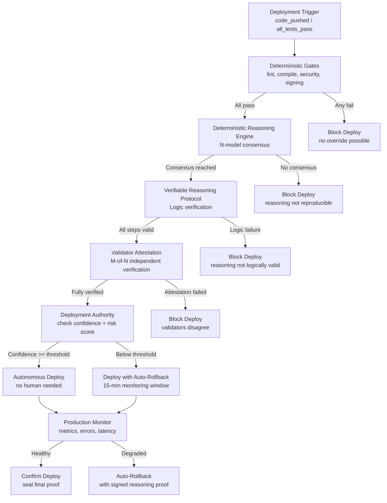

# Autonomous Deployment Authority (ADA) — Specification

## Problem Statement

MaatProof's Constitution §3 requires human approval for all production deployments. This was correct when LLM reasoning was non-deterministic and unverifiable. With the Deterministic Reasoning Engine (DRE) and Verifiable Reasoning Protocol (VRP), agents can now produce **reproducible, logically verified, consensus-backed deployment decisions**.

The Autonomous Deployment Authority (ADA) replaces human approval with **cryptographic proof verification** -- the agent deploys when it can prove its reasoning is correct, not when a human says so.

## Architecture



## Deployment Decision Matrix

The ADA uses a **multi-signal scoring system** to decide whether to deploy autonomously.

| Signal | Weight | Source | Threshold |
|--------|--------|--------|-----------|
| Deterministic gates | 25% | DeterministicLayer | All must pass (binary) |
| DRE consensus ratio | 20% | Deterministic Reasoning Engine | >= 80% (4/5 models agree) |
| Logic verification | 20% | LogicVerifier | All steps must pass (binary) |
| Validator attestation | 20% | Validator network | >= 3/5 validators agree |
| Risk score | 15% | Change impact analysis | <= 0.3 (low risk) |

### Risk Score Calculation

```python
@dataclass
class RiskAssessment:
    files_changed: int          # More files = higher risk
    lines_changed: int          # More lines = higher risk
    critical_paths_touched: bool # Core modules = higher risk
    new_dependencies: int       # New deps = higher risk
    test_coverage_delta: float  # Coverage drop = higher risk
    security_scan_findings: int # Any finding = higher risk
    
    @property
    def risk_score(self) -> float:
        """0.0 (no risk) to 1.0 (maximum risk)"""
        score = 0.0
        score += min(self.files_changed / 50, 0.2)
        score += min(self.lines_changed / 500, 0.2)
        score += 0.2 if self.critical_paths_touched else 0.0
        score += min(self.new_dependencies / 5, 0.15)
        score += max(-self.test_coverage_delta / 10, 0.0)  # Only penalize drops
        score += min(self.security_scan_findings / 3, 0.25)
        return min(score, 1.0)
```

### Deployment Authority Levels

| Authority Level | Requirements | Environment |
|----------------|-------------|-------------|
| **Full autonomous** | All gates pass + strong consensus + logic verified + fully attested + risk <= 0.2 | Production |
| **Autonomous with monitoring** | All gates pass + majority consensus + logic verified + peer attested + risk <= 0.5 | Production (15-min rollback window) |
| **Staging autonomous** | All gates pass + self-verified + risk <= 0.7 | Staging |
| **Dev autonomous** | Deterministic gates pass | Dev |
| **Blocked** | Any gate fails OR no consensus OR logic failure | No deploy |

## Auto-Rollback Protocol

Every autonomous deployment includes a **15-minute monitoring window** with automatic rollback if metrics degrade.

```python
@dataclass  
class RollbackTrigger:
    metric: str                 # e.g., "error_rate", "p99_latency", "cpu_usage"
    baseline: float             # Pre-deploy value
    current: float              # Current value
    threshold_pct: float        # Max acceptable increase (e.g., 0.1 = 10%)
    triggered: bool             # Whether rollback was triggered
```

**Rollback triggers:**
- Error rate increases > 10% from baseline
- P99 latency increases > 25% from baseline
- CPU usage increases > 50% from baseline
- Any new unhandled exception type appears
- Health check endpoint returns non-200

**Rollback is itself a signed proof** -- the agent produces a `ReasoningProof` documenting why it rolled back, what metrics triggered it, and what the baseline was.

## Economic Accountability ($MAAT)

Without human approval, accountability shifts to **economic incentives**.

| Actor | Stake | Slashing Condition |
|-------|-------|--------------------|
| **Deploying agent** | Stakes $MAAT proportional to risk score | Slashed if deploy causes rollback |
| **Validators** | Stake $MAAT per attestation | Slashed if they attest "agree" but replay produces different result |
| **Model providers** | Reputation score (no direct stake) | Score reduced if model produces non-deterministic output at temp=0 |

## Acceptance Criteria

- [ ] ADA computes deployment authority level from all 5 signals
- [ ] Full autonomous deploy works end-to-end without human involvement
- [ ] Auto-rollback triggers within 60 seconds of metric degradation
- [ ] Rollback produces its own signed reasoning proof
- [ ] Risk score correctly penalizes high-risk changes
- [ ] $MAAT staking and slashing enforced for deploying agents and validators
- [ ] All deployment decisions are independently verifiable via DeterministicProof
- [ ] Zero human approvals required for fully-verified deployments
