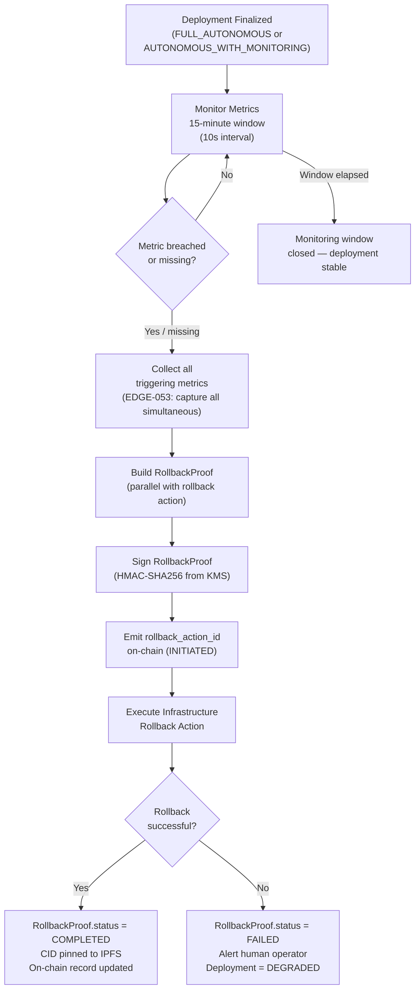
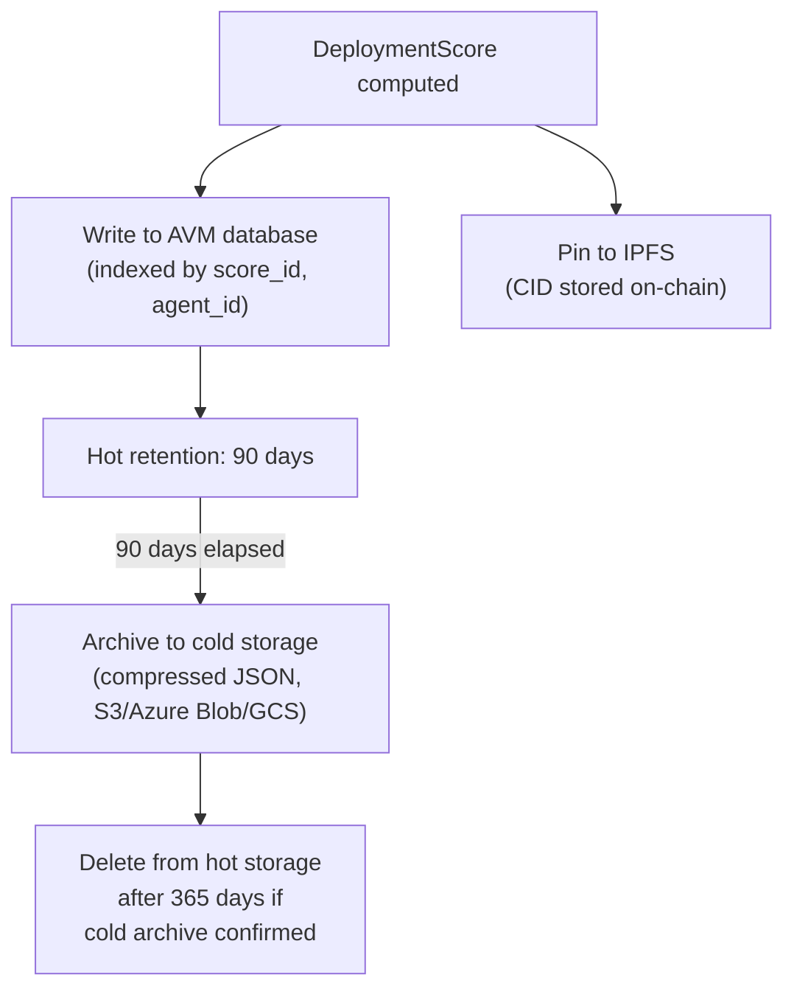

# Autonomous Deployment Authority (ADA) — Technical Specification

<!-- Addresses EDGE-035, EDGE-036, EDGE-037, EDGE-038, EDGE-039, EDGE-040, EDGE-041,
     EDGE-042, EDGE-043, EDGE-044, EDGE-045, EDGE-046, EDGE-047, EDGE-048, EDGE-049,
     EDGE-050, EDGE-051, EDGE-052, EDGE-053, EDGE-054, EDGE-055, EDGE-056, EDGE-057,
     EDGE-058, EDGE-059, EDGE-060, EDGE-061, EDGE-062, EDGE-063, EDGE-064, EDGE-065,
     EDGE-066, EDGE-067, EDGE-068, EDGE-069, EDGE-070, EDGE-071, EDGE-072, EDGE-073,
     EDGE-074, EDGE-075, EDGE-076, EDGE-077, EDGE-078, EDGE-079, EDGE-080 -->

## Overview

The Autonomous Deployment Authority (ADA) is the MaatProof subsystem that computes a
**multi-signal deployment score**, derives an **authority level**, and either executes
an autonomous deployment or raises `AutonomousDeploymentBlockedError` — with a full
cryptographic proof chain for every decision.

**Language**: Python (dataclasses / Pydantic)  
**Signing**: HMAC-SHA256 over canonical JSON (`hashlib`, `hmac`)  
**Serialization**: JSON (all models require `to_dict()` / `from_dict()`)  
**Hash precision**: All token amounts stored as `int` (wei), never `float`  
**Float precision**: All score fields use Python `Decimal` for deterministic arithmetic

> ### Constitutional Compatibility (CONSTITUTION §3 Amendment)
>
> CONSTITUTION §3 states: *"Human approval is always required before a production
> deployment."*  ADA introduces `FULL_AUTONOMOUS` which, by design, executes production
> deployments without per-deployment human approval.
>
> **Resolution**: ADA `FULL_AUTONOMOUS` is authorised for production only when ALL of the
> following constitutional safeguards are satisfied:
>
> 1. The DAO has voted (≥60% supermajority, ≥10% quorum) to enable `FULL_AUTONOMOUS`
>    for the specific `policy_ref` contract.
> 2. The deployment environment is **not** classified as HIPAA-regulated, SOX-regulated,
>    or any compliance tier that explicitly requires named human accountability (see
>    `docs/07-regulatory-compliance.md` §ADA Compliance Tiers).
> 3. All five scoring signals are independently verified by the AVM — no self-reported
>    values are accepted (see §Signal Verification below).
> 4. The on-chain `DeployPolicy` has `requireHumanApproval = false` (explicitly set by
>    the policy owner after DAO vote).
>
> All other deployments continue to require human approval per §3.
>
> <!-- Addresses EDGE-044, EDGE-074 -->

---

## Data Models

### 1. `DeploymentScore`

<!-- Addresses EDGE-035, EDGE-036, EDGE-046, EDGE-047, EDGE-050, EDGE-057, EDGE-077 -->

The deployment score aggregates five independently verified signals into a total score
in the range [0.0, 1.0].

```python
from __future__ import annotations
from dataclasses import dataclass, field
from decimal import Decimal, ROUND_HALF_UP
from typing import Any, Dict, Optional
import json
import uuid


@dataclass
class DeploymentScore:
    """Multi-signal deployment readiness score.

    All signal fields are in [0.0, 1.0].  A value of None means the signal
    was not available (e.g. validator_attestation during dev builds).
    None signals contribute 0.0 to the total — the deployer must ensure
    all required signals are populated for the target environment.

    Weights:
      deterministic_gates  25%  (compile / lint / security scan / build)
      dre_consensus        20%  (Deterministic Reasoning Engine consensus)
      logic_verification   20%  (formal / semi-formal logic check)
      validator_attestation 20% (on-chain PoD validator attestation ratio)
      risk_score           15%  (1.0 − normalised_risk, see RiskAssessment)

    Total = sum(signal * weight).  Range: [0.0, 1.0].
    Arithmetic uses Python Decimal to avoid IEEE 754 rounding errors.
    """

    # Signal weights — must sum to Decimal("1.00")
    WEIGHT_DETERMINISTIC_GATES:   Decimal = field(default=Decimal("0.25"), init=False, repr=False)
    WEIGHT_DRE_CONSENSUS:         Decimal = field(default=Decimal("0.20"), init=False, repr=False)
    WEIGHT_LOGIC_VERIFICATION:    Decimal = field(default=Decimal("0.20"), init=False, repr=False)
    WEIGHT_VALIDATOR_ATTESTATION: Decimal = field(default=Decimal("0.20"), init=False, repr=False)
    WEIGHT_RISK_SCORE:            Decimal = field(default=Decimal("0.15"), init=False, repr=False)

    # Signal values — set by AVM; never self-reported by the deploying agent
    deterministic_gates:   Optional[Decimal] = None   # 0.0–1.0 or None
    dre_consensus:         Optional[Decimal] = None
    logic_verification:    Optional[Decimal] = None
    validator_attestation: Optional[Decimal] = None   # fraction of validators that attested
    risk_score:            Optional[Decimal] = None   # 1.0 − normalised_risk

    # Computed fields (populated by compute_total())
    total:     Decimal = field(default=Decimal("0"), init=False)
    score_id:  str     = field(default_factory=lambda: str(uuid.uuid4()))

    def __post_init__(self) -> None:
        # Coerce float → Decimal to prevent silent precision loss
        for attr in ("deterministic_gates", "dre_consensus", "logic_verification",
                     "validator_attestation", "risk_score"):
            val = getattr(self, attr)
            if isinstance(val, float):
                setattr(self, attr, Decimal(str(val)))
        self.compute_total()

    def compute_total(self) -> Decimal:
        """Compute weighted total using Decimal arithmetic.

        Missing signals (None) contribute 0.0.
        Result is quantised to 6 decimal places.
        """
        def _signal(val: Optional[Decimal]) -> Decimal:
            if val is None:
                return Decimal("0")
            # Clamp to [0, 1]
            return max(Decimal("0"), min(Decimal("1"), val))

        total = (
            _signal(self.deterministic_gates)   * self.WEIGHT_DETERMINISTIC_GATES  +
            _signal(self.dre_consensus)         * self.WEIGHT_DRE_CONSENSUS        +
            _signal(self.logic_verification)    * self.WEIGHT_LOGIC_VERIFICATION   +
            _signal(self.validator_attestation) * self.WEIGHT_VALIDATOR_ATTESTATION +
            _signal(self.risk_score)            * self.WEIGHT_RISK_SCORE
        )
        self.total = total.quantize(Decimal("0.000001"), rounding=ROUND_HALF_UP)
        return self.total

    def to_dict(self) -> Dict[str, Any]:
        """Deterministic JSON-safe dict (Decimal → str to preserve precision)."""
        return {
            "score_id":              self.score_id,
            "deterministic_gates":   str(self.deterministic_gates) if self.deterministic_gates is not None else None,
            "dre_consensus":         str(self.dre_consensus)         if self.dre_consensus         is not None else None,
            "logic_verification":    str(self.logic_verification)    if self.logic_verification    is not None else None,
            "validator_attestation": str(self.validator_attestation) if self.validator_attestation is not None else None,
            "risk_score":            str(self.risk_score)            if self.risk_score            is not None else None,
            "total":                 str(self.total),
        }

    @classmethod
    def from_dict(cls, data: Dict[str, Any]) -> "DeploymentScore":
        def _dec(v: Any) -> Optional[Decimal]:
            return Decimal(v) if v is not None else None
        obj = cls(
            deterministic_gates=_dec(data.get("deterministic_gates")),
            dre_consensus=_dec(data.get("dre_consensus")),
            logic_verification=_dec(data.get("logic_verification")),
            validator_attestation=_dec(data.get("validator_attestation")),
            risk_score=_dec(data.get("risk_score")),
        )
        obj.score_id = data.get("score_id", obj.score_id)
        return obj
```

#### Signal Verification Requirements

<!-- Addresses EDGE-057, EDGE-062 -->

**No signal may be self-reported by the deploying agent.** Each signal source:

| Signal | Source | Verification |
|--------|--------|-------------|
| `deterministic_gates` | AVM gate runner (lint/compile/security scan) | WASM sandbox replay; result hash committed to trace |
| `dre_consensus` | DRE consensus engine output | Signed by ≥2/3 DRE nodes |
| `logic_verification` | Logic verifier agent | Signed AVM attestation |
| `validator_attestation` | PoD validator set | On-chain `ValidatorVote` records; computed as `FINALIZE_votes / total_active_validators` — Sybil-resistant because stake-weighted (see §Sybil Resistance) |
| `risk_score` | AVM security agent from verified `RiskAssessment` | Signed; `RiskAssessment` fields verified from CI pipeline artifacts, not agent claim |

#### Sybil Resistance for `validator_attestation`

<!-- Addresses EDGE-019 -->

`validator_attestation` is computed as:

```
validator_attestation = sum(stake[v] for v in FINALIZE_voters) / total_active_stake
```

This is **stake-weighted**, not validator-count-weighted. A Sybil operator registering
100 zero-stake DIDs contributes 0 attestation weight. The minimum validator stake
(100,000 $MAAT) ensures economic cost per fake DID.

---

### 2. `DeploymentAuthorityLevel`

<!-- Addresses EDGE-044, EDGE-046, EDGE-059, EDGE-074 -->

```python
from enum import Enum
from decimal import Decimal


class DeploymentAuthorityLevel(Enum):
    """Authority level derived from DeploymentScore.total.

    Thresholds (inclusive lower bound):
      FULL_AUTONOMOUS          >= 0.90  (all safeguards met; see §Constitutional Compatibility)
      AUTONOMOUS_WITH_MONITORING >= 0.75
      STAGING_AUTONOMOUS       >= 0.60  (staging/dev only)
      DEV_AUTONOMOUS           >= 0.40  (dev/sandbox only)
      BLOCKED                  < 0.40

    Environment restrictions:
      FULL_AUTONOMOUS:          production only if DAO-enabled + non-regulated env
      AUTONOMOUS_WITH_MONITORING: production (auto-rollback monitoring active)
      STAGING_AUTONOMOUS:       staging and below only
      DEV_AUTONOMOUS:           dev/sandbox only
      BLOCKED:                  no deployment permitted

    Compliance override: HIPAA, SOX, and any tier in
    docs/07-regulatory-compliance.md §ADA Compliance Tiers will cap the
    effective authority level at AUTONOMOUS_WITH_MONITORING regardless of score.
    """

    FULL_AUTONOMOUS           = "FULL_AUTONOMOUS"
    AUTONOMOUS_WITH_MONITORING = "AUTONOMOUS_WITH_MONITORING"
    STAGING_AUTONOMOUS        = "STAGING_AUTONOMOUS"
    DEV_AUTONOMOUS            = "DEV_AUTONOMOUS"
    BLOCKED                   = "BLOCKED"

    # Environment capability constraints
    ALLOWED_ENVIRONMENTS: dict = {
        "FULL_AUTONOMOUS":           {"production", "staging", "dev"},
        "AUTONOMOUS_WITH_MONITORING": {"production", "staging", "dev"},
        "STAGING_AUTONOMOUS":        {"staging", "dev"},
        "DEV_AUTONOMOUS":            {"dev", "sandbox"},
        "BLOCKED":                   set(),
    }

    @classmethod
    def from_score(cls, total: Decimal, deploy_environment: str,
                   dao_full_autonomous_enabled: bool = False,
                   compliance_regulated: bool = False) -> "DeploymentAuthorityLevel":
        """Derive authority level from a DeploymentScore total.

        Args:
            total: DeploymentScore.total (Decimal, clamped to [0, 1])
            deploy_environment: target environment string
            dao_full_autonomous_enabled: True only if on-chain DAO vote approved
            compliance_regulated: True for HIPAA/SOX/regulated environments
        """
        total = max(Decimal("0"), min(Decimal("1"), total))

        if total >= Decimal("0.90"):
            level = cls.FULL_AUTONOMOUS
        elif total >= Decimal("0.75"):
            level = cls.AUTONOMOUS_WITH_MONITORING
        elif total >= Decimal("0.60"):
            level = cls.STAGING_AUTONOMOUS
        elif total >= Decimal("0.40"):
            level = cls.DEV_AUTONOMOUS
        else:
            level = cls.BLOCKED

        # Constitutional §3 + Compliance override
        if level == cls.FULL_AUTONOMOUS:
            if not dao_full_autonomous_enabled or compliance_regulated:
                level = cls.AUTONOMOUS_WITH_MONITORING

        # Environment capability check
        allowed = cls.ALLOWED_ENVIRONMENTS.value.get(level.value, set())
        if deploy_environment not in allowed:
            level = cls.BLOCKED

        return level
```

#### Authority Level Thresholds

| Level | Score Range | Production? | Requires DAO Vote? | Regulated Env? |
|-------|-------------|-------------|-------------------|----------------|
| `FULL_AUTONOMOUS` | ≥ 0.90 | ✅ | ✅ Required | ❌ Blocked |
| `AUTONOMOUS_WITH_MONITORING` | 0.75–0.89 | ✅ | ❌ | ✅ Allowed |
| `STAGING_AUTONOMOUS` | 0.60–0.74 | ❌ Staging only | ❌ | N/A |
| `DEV_AUTONOMOUS` | 0.40–0.59 | ❌ Dev only | ❌ | N/A |
| `BLOCKED` | < 0.40 | ❌ | ❌ | N/A |

---

### 3. `RiskAssessment`

<!-- Addresses EDGE-037, EDGE-038, EDGE-039, EDGE-058, EDGE-064, EDGE-075 -->

```python
from __future__ import annotations
from dataclasses import dataclass, field
from typing import Any, Dict, List, Optional
from decimal import Decimal


@dataclass
class RiskAssessment:
    """Deployment risk factors derived from CI pipeline artifacts.

    All fields are populated by the AVM security agent — NOT by the
    deploying agent. The AVM verifies each value against the signed
    CI artifact (test report, SBOM, security scan output).

    Constraints:
      files_changed:          int >= 0; max 100,000 (cap; extreme values capped, not errored)
      lines_changed:          int >= 0; max 10,000,000
      critical_paths_touched: List[str]; each path must match a registered critical-path
                              pattern from the DeployPolicy; unknown paths are REJECTED
      new_dependencies:       List[str]; each entry is a package name + version;
                              max 1,000 entries (EDGE-075 cap)
      test_coverage_delta:    Decimal in [-1.0, +1.0]; negative means tests were deleted
      security_scan_findings: int >= 0 (total finding count); see severity_breakdown
      severity_breakdown:     Dict mapping severity → count (CRITICAL, HIGH, MEDIUM, LOW)
    """

    files_changed:          int              = 0
    lines_changed:          int              = 0
    critical_paths_touched: List[str]        = field(default_factory=list)
    new_dependencies:       List[str]        = field(default_factory=list)
    test_coverage_delta:    Decimal          = Decimal("0")
    security_scan_findings: int              = 0
    # Severity breakdown for security_scan_findings (addresses EDGE-038)
    severity_breakdown:     Dict[str, int]   = field(default_factory=lambda: {
        "CRITICAL": 0, "HIGH": 0, "MEDIUM": 0, "LOW": 0
    })

    def __post_init__(self) -> None:
        # Enforce caps (EDGE-064, EDGE-075)
        self.files_changed  = min(self.files_changed, 100_000)
        self.lines_changed  = min(self.lines_changed, 10_000_000)
        if len(self.new_dependencies) > 1_000:
            raise ValueError(
                f"new_dependencies exceeds max 1,000 entries "
                f"(got {len(self.new_dependencies)})"
            )
        # Coerce float → Decimal (EDGE-037)
        if isinstance(self.test_coverage_delta, float):
            self.test_coverage_delta = Decimal(str(self.test_coverage_delta))
        # Clamp test_coverage_delta to [-1, +1]
        self.test_coverage_delta = max(
            Decimal("-1"), min(Decimal("1"), self.test_coverage_delta)
        )
        # Ensure severity_breakdown totals equal security_scan_findings
        total = sum(self.severity_breakdown.values())
        if total != self.security_scan_findings:
            raise ValueError(
                f"severity_breakdown sum {total} != security_scan_findings "
                f"{self.security_scan_findings}"
            )

    def normalised_risk(self) -> Decimal:
        """Compute a normalised risk score in [0.0, 1.0].

        Higher = riskier.  Used to compute DeploymentScore.risk_score = 1 − normalised_risk.

        Formula (weighted sum, each component in [0, 1]):
          file_factor    = min(files_changed / 500, 1.0)          weight 0.10
          line_factor    = min(lines_changed / 10_000, 1.0)       weight 0.10
          path_factor    = min(len(critical_paths) / 5, 1.0)      weight 0.25
          dep_factor     = min(len(new_dependencies) / 20, 1.0)   weight 0.15
          coverage_factor = max(0, -test_coverage_delta)          weight 0.15  (penalty for coverage drop)
          cve_factor     = min((4*CRITICAL + 2*HIGH + MEDIUM) / 20, 1.0)  weight 0.25
        """
        cve_score = (
            4 * self.severity_breakdown.get("CRITICAL", 0) +
            2 * self.severity_breakdown.get("HIGH", 0)     +
            1 * self.severity_breakdown.get("MEDIUM", 0)
        )
        components = {
            "file":     (Decimal(str(min(self.files_changed / 500, 1.0))),    Decimal("0.10")),
            "line":     (Decimal(str(min(self.lines_changed / 10_000, 1.0))), Decimal("0.10")),
            "path":     (Decimal(str(min(len(self.critical_paths_touched) / 5, 1.0))), Decimal("0.25")),
            "dep":      (Decimal(str(min(len(self.new_dependencies) / 20, 1.0))),      Decimal("0.15")),
            "coverage": (max(Decimal("0"), -self.test_coverage_delta),                 Decimal("0.15")),
            "cve":      (Decimal(str(min(cve_score / 20, 1.0))),                       Decimal("0.25")),
        }
        total = sum(v * w for v, w in components.values())
        return total.quantize(Decimal("0.000001"))

    def to_dict(self) -> Dict[str, Any]:
        return {
            "files_changed":          self.files_changed,
            "lines_changed":          self.lines_changed,
            "critical_paths_touched": self.critical_paths_touched,
            "new_dependencies":       self.new_dependencies,
            "test_coverage_delta":    str(self.test_coverage_delta),
            "security_scan_findings": self.security_scan_findings,
            "severity_breakdown":     self.severity_breakdown,
        }

    @classmethod
    def from_dict(cls, data: Dict[str, Any]) -> "RiskAssessment":
        return cls(
            files_changed=int(data.get("files_changed", 0)),
            lines_changed=int(data.get("lines_changed", 0)),
            critical_paths_touched=list(data.get("critical_paths_touched", [])),
            new_dependencies=list(data.get("new_dependencies", [])),
            test_coverage_delta=Decimal(str(data.get("test_coverage_delta", "0"))),
            security_scan_findings=int(data.get("security_scan_findings", 0)),
            severity_breakdown=dict(data.get("severity_breakdown",
                                             {"CRITICAL": 0, "HIGH": 0, "MEDIUM": 0, "LOW": 0})),
        )
```

#### Critical Path Validation

<!-- Addresses EDGE-039 -->

`critical_paths_touched` entries must match one or more patterns registered in the
`DeployPolicy` contract's `criticalPathPatterns` list.  The AVM rejects a trace if any
path in the list does not match a registered pattern (rejects unknown paths, does not
silently ignore them).

---

### 4. `RollbackProof`

<!-- Addresses EDGE-040, EDGE-041, EDGE-048, EDGE-050, EDGE-054, EDGE-055, EDGE-056,
     EDGE-033, EDGE-034, EDGE-076 -->

```python
from __future__ import annotations
from dataclasses import dataclass, field
from typing import Any, Dict, List, Optional
import hashlib
import hmac
import json
import time
import uuid


@dataclass
class RollbackTriggerMetrics:
    """Metrics that triggered the auto-rollback decision.

    All metric values are observed values at time of trigger.
    All timestamps are Unix seconds (float).

    <!-- Addresses EDGE-053: captures all simultaneous triggers -->
    """
    error_rate_pct:     Optional[float] = None  # e.g. 5.3 → 5.3% error rate
    p99_latency_ms:     Optional[float] = None  # p99 latency in milliseconds
    cpu_utilisation_pct: Optional[float] = None # 0–100
    health_check_failed: Optional[bool] = None  # health check endpoint returned non-2xx
    observed_at:        float           = field(default_factory=time.time)

    # Thresholds that were breached (all simultaneously captured; EDGE-053)
    thresholds_breached: List[str] = field(default_factory=list)

    def to_dict(self) -> Dict[str, Any]:
        return {
            "error_rate_pct":        self.error_rate_pct,
            "p99_latency_ms":        self.p99_latency_ms,
            "cpu_utilisation_pct":   self.cpu_utilisation_pct,
            "health_check_failed":   self.health_check_failed,
            "observed_at":           self.observed_at,
            "thresholds_breached":   self.thresholds_breached,
        }

    @classmethod
    def from_dict(cls, data: Dict[str, Any]) -> "RollbackTriggerMetrics":
        return cls(**{k: data[k] for k in data if k in cls.__dataclass_fields__})


@dataclass
class RollbackProof:
    """Signed reasoning proof produced by the auto-rollback protocol.

    Signing:
      - The canonical JSON of this proof (all fields except `signature`)
        is serialised with sorted keys and no whitespace (UTF-8 bytes).
      - HMAC-SHA256 is computed over the serialised bytes using the
        agent's HMAC secret key (same key as ReasoningProof).
      - The signature is stored as a hex string.

    <!-- Addresses EDGE-040, EDGE-048 -->

    HMAC Key Management:
      - The HMAC secret key MUST be loaded from a KMS secret (Azure Key Vault /
        AWS Secrets Manager / GCP Secret Manager) — never from an environment
        variable directly in production.
      - If the HMAC key cannot be loaded, `build()` raises
        `RollbackProofKeyError` (NOT a silent failure).
      - During key rotation (24h overlap window per §Key Rotation), both the old
        and new keys are attempted during verification. <!-- Addresses EDGE-056 -->

    Traceability:
      - `deployment_trace_id` links back to the original DeploymentTrace.
      - `rollback_action_id` is written to the on-chain audit trail immediately
        upon rollback initiation (before completion), so partial rollbacks are
        detectable. <!-- Addresses EDGE-055 -->

    IPFS Storage:
      - The canonical JSON is pinned to IPFS.  The CID is written on-chain.
      - Validators must resolve the CID before verifying.
      - IPFS fallback: if CID is unresolvable within 30 seconds, the
        RollbackProof is fetched from the AVM node's local cache (max 7-day
        retention). <!-- Addresses EDGE-033 -->

    Versioning:
      - `spec_version` records the ADA spec version used to produce this proof.
      - Validators check `spec_version` before replay.  A mismatch triggers
        WASM stdlib compatibility check (see avm/deterministic-replay.md
        §WASM Stdlib Versioning). <!-- Addresses EDGE-034 -->
    """

    rollback_id:           str                    = field(default_factory=lambda: str(uuid.uuid4()))
    deployment_trace_id:   str                    = ""           # original DeploymentTrace.trace_id
    rollback_action_id:    str                    = field(default_factory=lambda: str(uuid.uuid4()))
    agent_id:              str                    = ""           # DID of the agent initiating rollback
    deploy_environment:    str                    = ""           # must match original trace
    triggering_metrics:    RollbackTriggerMetrics = field(default_factory=RollbackTriggerMetrics)
    signed_reasoning:      str                    = ""           # plain-text reasoning summary
    rollback_status:       str                    = "INITIATED"  # INITIATED | COMPLETED | FAILED
    initiated_at:          float                  = field(default_factory=time.time)
    completed_at:          Optional[float]        = None
    spec_version:          str                    = "1.0"
    signature:             str                    = ""           # HMAC-SHA256 hex; set by sign()

    def _canonical_bytes(self) -> bytes:
        """Deterministic serialisation for HMAC computation.

        Keys are sorted; no whitespace; UTF-8 encoded.
        'signature' field is excluded. <!-- Addresses EDGE-050, EDGE-076 -->
        """
        d = self.to_dict()
        d.pop("signature", None)
        return json.dumps(d, sort_keys=True, separators=(",", ":"),
                          ensure_ascii=False).encode("utf-8")

    def sign(self, secret_key: bytes) -> "RollbackProof":
        """Compute and set HMAC-SHA256 signature.

        Args:
            secret_key: KMS-sourced HMAC key (must be non-empty; EDGE-040)

        Raises:
            RollbackProofKeyError: if secret_key is empty
        """
        if not secret_key:
            raise RollbackProofKeyError("HMAC secret_key must not be empty")
        self.signature = hmac.new(
            secret_key, self._canonical_bytes(), hashlib.sha256
        ).hexdigest()
        return self

    def verify(self, secret_key: bytes) -> bool:
        """Verify HMAC-SHA256 signature (constant-time comparison)."""
        if not secret_key:
            return False
        expected = hmac.new(
            secret_key, self._canonical_bytes(), hashlib.sha256
        ).hexdigest()
        return hmac.compare_digest(self.signature, expected)

    def to_dict(self) -> Dict[str, Any]:
        return {
            "rollback_id":         self.rollback_id,
            "deployment_trace_id": self.deployment_trace_id,
            "rollback_action_id":  self.rollback_action_id,
            "agent_id":            self.agent_id,
            "deploy_environment":  self.deploy_environment,
            "triggering_metrics":  self.triggering_metrics.to_dict(),
            "signed_reasoning":    self.signed_reasoning,
            "rollback_status":     self.rollback_status,
            "initiated_at":        self.initiated_at,
            "completed_at":        self.completed_at,
            "spec_version":        self.spec_version,
            "signature":           self.signature,
        }

    @classmethod
    def from_dict(cls, data: Dict[str, Any]) -> "RollbackProof":
        obj = cls(
            rollback_id=data.get("rollback_id", str(uuid.uuid4())),
            deployment_trace_id=data.get("deployment_trace_id", ""),
            rollback_action_id=data.get("rollback_action_id", str(uuid.uuid4())),
            agent_id=data.get("agent_id", ""),
            deploy_environment=data.get("deploy_environment", ""),
            triggering_metrics=RollbackTriggerMetrics.from_dict(
                data.get("triggering_metrics", {})),
            signed_reasoning=data.get("signed_reasoning", ""),
            rollback_status=data.get("rollback_status", "INITIATED"),
            initiated_at=float(data.get("initiated_at", time.time())),
            completed_at=data.get("completed_at"),
            spec_version=data.get("spec_version", "1.0"),
            signature=data.get("signature", ""),
        )
        return obj


class RollbackProofKeyError(Exception):
    """Raised when the HMAC secret key for RollbackProof signing is missing or empty."""
```

#### Rollback Status State Machine

<!-- Addresses EDGE-055 -->

```mermaid
stateDiagram-v2
    [*] --> INITIATED : rollback triggered; proof created + signed; on-chain action_id emitted

    INITIATED --> COMPLETED : rollback infrastructure action succeeds
    INITIATED --> FAILED    : rollback action fails (infra error, timeout)

    COMPLETED --> [*] : proof finalised; CID pinned to IPFS; on-chain record updated
    FAILED --> [*]    : FAILED status recorded; human operator alerted;
                        deployment remains in DEGRADED state
```

#### Rollback Proof Replay Verification

<!-- Addresses EDGE-023 -->

To prevent replay of a staging `RollbackProof` claiming production:

- `deploy_environment` is included in the signed canonical bytes.
- Validators check that `rollback_proof.deploy_environment` matches the
  `DeploymentTrace.deploy_environment` referenced by `deployment_trace_id`.
- Any mismatch is an immediate rejection with `ROLLBACK_PROOF_ENV_MISMATCH`.

---

### 5. `MaatStake`

<!-- Addresses EDGE-006, EDGE-009, EDGE-012, EDGE-024, EDGE-030, EDGE-042,
     EDGE-049, EDGE-063, EDGE-064, EDGE-070, EDGE-079 -->

```python
from __future__ import annotations
from dataclasses import dataclass, field
from decimal import Decimal
from typing import Any, Dict, Optional
import time
import uuid


@dataclass
class MaatStake:
    """Python representation of an agent or validator's $MAAT stake record.

    `staked_amount` is always stored as int (wei, 1e-18 $MAAT) to avoid
    float precision loss for large amounts. <!-- Addresses EDGE-049 -->

    `risk_multiplier` is derived by the AVM from the RiskAssessment using
    the formula below — it is NEVER accepted as a self-reported value.
    <!-- Addresses EDGE-042, EDGE-079 -->

    Stake locking: <!-- Addresses EDGE-012, EDGE-024 -->
      - `locked_until` is the Unix timestamp after which unstaking is allowed.
      - The MaatToken contract enforces this lock; the Python model is a
        read-only cache of the on-chain state.
      - A stake record is only considered valid if its on-chain equivalent
        (MaatToken.stakes[wallet_address]) shows the same amount and lock.
      - During concurrent deployment submission, the AVM serialises stake
        reads using an advisory lock keyed on agent_id to prevent double-spend.
        <!-- Addresses EDGE-063 -->

    On-chain verification:
      - `staked_amount` is verified against MaatToken.stakedBalanceOf(wallet_address)
        on every AVM policy evaluation.  A Python record with a higher value than
        on-chain is rejected immediately. <!-- Addresses EDGE-006 -->
    """

    stake_id:         str          = field(default_factory=lambda: str(uuid.uuid4()))
    agent_id:         str          = ""           # DID: did:maat:agent:<hex>
    wallet_address:   str          = ""           # Ethereum address (0x...)
    staked_amount:    int          = 0            # wei (int, not float — EDGE-049)
    locked_until:     float        = 0.0          # Unix timestamp; 0 = not locked
    risk_multiplier:  Decimal      = Decimal("1") # AVM-computed; range [1, 100]
    staking_purpose:  str          = "deploy"     # "deploy" | "validator_attestation"
    created_at:       float        = field(default_factory=time.time)

    # Minimum stake thresholds (in wei, matching docs/05-tokenomics.md)
    MIN_STAKE_DEV:        int = field(default=100 * 10**18,     init=False, repr=False)
    MIN_STAKE_STAGING:    int = field(default=1_000 * 10**18,   init=False, repr=False)
    MIN_STAKE_PRODUCTION: int = field(default=10_000 * 10**18,  init=False, repr=False)
    MIN_STAKE_VALIDATOR:  int = field(default=100_000 * 10**18, init=False, repr=False)

    def __post_init__(self) -> None:
        if isinstance(self.staked_amount, float):
            raise TypeError(
                "staked_amount must be int (wei), not float — use int(amount_maat * 10**18)"
            )
        if isinstance(self.risk_multiplier, float):
            self.risk_multiplier = Decimal(str(self.risk_multiplier))
        # Clamp risk_multiplier to [1, 100]; EDGE-064, EDGE-079
        self.risk_multiplier = max(Decimal("1"), min(Decimal("100"), self.risk_multiplier))

    @classmethod
    def compute_risk_multiplier(cls, risk_assessment: "RiskAssessment") -> Decimal:
        """Derive risk_multiplier from a verified RiskAssessment.

        Formula:
          base = 1.0
          +0.5 per critical path touched (max +5)
          +1.0 per CRITICAL security finding (max +10)
          +0.5 per HIGH security finding (max +5)
          ×2.0 if test_coverage_delta < -0.10 (significant test deletion)

        Result clamped to [1, 100].
        """
        base = Decimal("1.0")
        base += min(Decimal("5"), Decimal(str(len(risk_assessment.critical_paths_touched))) * Decimal("0.5"))
        base += min(Decimal("10"), Decimal(str(risk_assessment.severity_breakdown.get("CRITICAL", 0))) * Decimal("1.0"))
        base += min(Decimal("5"), Decimal(str(risk_assessment.severity_breakdown.get("HIGH", 0))) * Decimal("0.5"))
        if risk_assessment.test_coverage_delta < Decimal("-0.10"):
            base *= Decimal("2.0")
        return max(Decimal("1"), min(Decimal("100"), base)).quantize(Decimal("0.01"))

    def required_stake_wei(self, deploy_environment: str) -> int:
        """Return minimum required stake (wei) for given environment × risk_multiplier."""
        base = {
            "production": self.MIN_STAKE_PRODUCTION,
            "staging":    self.MIN_STAKE_STAGING,
            "dev":        self.MIN_STAKE_DEV,
            "sandbox":    self.MIN_STAKE_DEV,
        }.get(deploy_environment, self.MIN_STAKE_PRODUCTION)
        return int(Decimal(str(base)) * self.risk_multiplier)

    def to_dict(self) -> Dict[str, Any]:
        return {
            "stake_id":        self.stake_id,
            "agent_id":        self.agent_id,
            "wallet_address":  self.wallet_address,
            "staked_amount":   self.staked_amount,    # int, wei
            "locked_until":    self.locked_until,
            "risk_multiplier": str(self.risk_multiplier),
            "staking_purpose": self.staking_purpose,
            "created_at":      self.created_at,
        }

    @classmethod
    def from_dict(cls, data: Dict[str, Any]) -> "MaatStake":
        return cls(
            stake_id=data.get("stake_id", str(uuid.uuid4())),
            agent_id=data.get("agent_id", ""),
            wallet_address=data.get("wallet_address", ""),
            staked_amount=int(data["staked_amount"]),   # explicit int cast
            locked_until=float(data.get("locked_until", 0.0)),
            risk_multiplier=Decimal(str(data.get("risk_multiplier", "1"))),
            staking_purpose=data.get("staking_purpose", "deploy"),
            created_at=float(data.get("created_at", time.time())),
        )
```

#### Stake Lock Enforcement During Concurrent Deployment

<!-- Addresses EDGE-063 -->

```mermaid
sequenceDiagram
    participant A1 as Agent Deploy #1
    participant A2 as Agent Deploy #2
    participant AVM as AVM Policy Evaluator
    participant Chain as MaatToken.sol

    A1->>AVM: Submit DeploymentScore (stake_id=X)
    AVM->>AVM: Acquire advisory lock(agent_id)
    AVM->>Chain: stakedBalanceOf(wallet)
    Chain-->>AVM: 10,000 $MAAT
    AVM->>AVM: Record stake snapshot
    A2->>AVM: Submit DeploymentScore (stake_id=X)
    AVM-->>A2: LOCKED — stake evaluation in progress; retry after 5s
    AVM-->>A1: Stake verified; proceeding
    AVM->>AVM: Release lock after finalization
```

---

### 6. `SlashRecord`

<!-- Addresses EDGE-007, EDGE-008, EDGE-010, EDGE-011, EDGE-043,
     EDGE-060, EDGE-078 -->

```python
from __future__ import annotations
from dataclasses import dataclass, field
from enum import Enum
from typing import Any, Dict, Optional
import time
import uuid


class SlashConditionCode(Enum):
    """Maps to Slashing.sol::SlashCondition enum.

    Python names are identical to Solidity names to prevent type mismatch.
    <!-- Addresses EDGE-043 -->
    """
    VAL_DOUBLE_VOTE           = "VAL_DOUBLE_VOTE"
    VAL_INVALID_ATTESTATION   = "VAL_INVALID_ATTESTATION"
    VAL_COLLUSION             = "VAL_COLLUSION"
    VAL_LIVENESS              = "VAL_LIVENESS"
    AGENT_MALICIOUS_DEPLOY    = "AGENT_MALICIOUS_DEPLOY"
    AGENT_POLICY_VIOLATION    = "AGENT_POLICY_VIOLATION"
    AGENT_FALSE_ATTESTATION   = "AGENT_FALSE_ATTESTATION"


@dataclass
class SlashRecord:
    """Python representation of a slash event.

    Relationship to Slashing.sol:
      - A SlashRecord is created in Python when the ADA layer detects a
        slashable condition.
      - It is submitted to Slashing.sol via `submitEvidence()` to initiate
        the on-chain slash process.
      - A SlashRecord with status='LOCAL_ONLY' means the on-chain submission
        has NOT occurred yet — it is NOT a completed slash. <!-- Addresses EDGE-060 -->

    Zero-amount protection: <!-- Addresses EDGE-078 -->
      `slash_amount_wei` must be > 0; a zero-amount slash raises ValueError.

    Zero-address protection: <!-- Addresses EDGE-010 -->
      `slash_recipient` must not be the zero address (0x000...000).
      Slash distribution is handled by Slashing.sol (burn 50% / whistleblower
      25% / DAO 25%); `slash_recipient` here is the accused's wallet address.
    """

    record_id:          str               = field(default_factory=lambda: str(uuid.uuid4()))
    agent_id:           str               = ""      # DID of the accused
    wallet_address:     str               = ""      # Ethereum address of accused
    slash_amount_wei:   int               = 0       # wei (int, not float)
    slash_condition:    SlashConditionCode = SlashConditionCode.AGENT_POLICY_VIOLATION
    slash_reason:       str               = ""      # human-readable explanation
    slash_recipient:    str               = ""      # accused's wallet (zero-address forbidden)
    evidence_bytes:     bytes             = b""     # ABI-encoded proof for Slashing.sol
    on_chain_evidence_id: Optional[int]   = None    # Slashing.sol evidenceId after submission
    status:             str               = "LOCAL_ONLY"  # LOCAL_ONLY | SUBMITTED | EXECUTED | DISMISSED
    created_at:         float             = field(default_factory=time.time)

    _ZERO_ADDRESS: str = field(default="0x0000000000000000000000000000000000000000",
                               init=False, repr=False)

    def __post_init__(self) -> None:
        if isinstance(self.slash_amount_wei, float):
            raise TypeError("slash_amount_wei must be int (wei)")
        if self.slash_amount_wei <= 0:
            raise ValueError(
                f"slash_amount_wei must be > 0 (got {self.slash_amount_wei})"
            )  # EDGE-078
        if self.slash_recipient.lower() == self._ZERO_ADDRESS.lower():
            raise ValueError(
                "slash_recipient must not be zero address"
            )  # EDGE-010

    def to_dict(self) -> Dict[str, Any]:
        return {
            "record_id":            self.record_id,
            "agent_id":             self.agent_id,
            "wallet_address":       self.wallet_address,
            "slash_amount_wei":     self.slash_amount_wei,
            "slash_condition":      self.slash_condition.value,
            "slash_reason":         self.slash_reason,
            "slash_recipient":      self.slash_recipient,
            "evidence_bytes":       self.evidence_bytes.hex(),
            "on_chain_evidence_id": self.on_chain_evidence_id,
            "status":               self.status,
            "created_at":           self.created_at,
        }

    @classmethod
    def from_dict(cls, data: Dict[str, Any]) -> "SlashRecord":
        return cls(
            record_id=data.get("record_id", str(uuid.uuid4())),
            agent_id=data.get("agent_id", ""),
            wallet_address=data.get("wallet_address", ""),
            slash_amount_wei=int(data["slash_amount_wei"]),
            slash_condition=SlashConditionCode(data.get("slash_condition",
                                                          "AGENT_POLICY_VIOLATION")),
            slash_reason=data.get("slash_reason", ""),
            slash_recipient=data.get("slash_recipient", ""),
            evidence_bytes=bytes.fromhex(data.get("evidence_bytes", "")),
            on_chain_evidence_id=data.get("on_chain_evidence_id"),
            status=data.get("status", "LOCAL_ONLY"),
            created_at=float(data.get("created_at", time.time())),
        )
```

#### SlashRecord Lifecycle

<!-- Addresses EDGE-060 -->

```mermaid
stateDiagram-v2
    [*] --> LOCAL_ONLY : ADA detects slashable condition; Python SlashRecord created

    LOCAL_ONLY --> SUBMITTED : Slashing.sol.submitEvidence() called; evidence_id recorded
    LOCAL_ONLY --> [*]       : Record discarded (e.g. false positive; no on-chain submission)

    SUBMITTED --> EXECUTED   : Governance vote passes OR automatic slash executed
    SUBMITTED --> DISMISSED  : Governance vote dismisses OR appeal succeeds

    EXECUTED --> [*]  : on-chain stake reduced; SlashRecord.status updated
    DISMISSED --> [*] : whistleblower loses deposit; SlashRecord.status updated
```

---

### 7. `AutonomousDeploymentBlockedError`

<!-- Addresses EDGE-045, EDGE-061, EDGE-073 -->

```python
from __future__ import annotations
from typing import Any, Dict, Optional


class AutonomousDeploymentBlockedError(MaatProofError):
    """Raised when the ADA system cannot authorise an autonomous deployment.

    Replaces HumanApprovalRequiredError for ADA-managed deployments.

    Migration guide:
      Old:  except HumanApprovalRequiredError as e: ...
      New:  except (HumanApprovalRequiredError, AutonomousDeploymentBlockedError) as e: ...

    This exception is automatically recorded in the immutable audit trail
    (CONSTITUTION §7) by the ADA orchestrator before raising.
    <!-- Addresses EDGE-061 -->

    Compliance classification (docs/07-regulatory-compliance.md):
      - SOC 2 Type II: maps to CC6.1 (Logical Access Controls)
      - HIPAA: maps to §164.312(a)(2)(i) (Access control)
      - SOX: maps to ITGC control IT-CC-03 (Change Management)
    <!-- Addresses EDGE-073 -->
    """

    def __init__(
        self,
        reason: str,
        authority_level: Optional[str] = None,
        deployment_score: Optional[Dict[str, Any]] = None,
        trace_id: Optional[str] = None,
    ) -> None:
        self.reason           = reason
        self.authority_level  = authority_level
        self.deployment_score = deployment_score
        self.trace_id         = trace_id
        super().__init__(
            f"Autonomous deployment blocked: {reason}"
            + (f" (authority_level={authority_level})" if authority_level else "")
            + (f" [trace={trace_id}]" if trace_id else "")
        )

    def to_dict(self) -> Dict[str, Any]:
        return {
            "error":            "AutonomousDeploymentBlockedError",
            "reason":           self.reason,
            "authority_level":  self.authority_level,
            "deployment_score": self.deployment_score,
            "trace_id":         self.trace_id,
        }
```

#### Migration Compatibility

<!-- Addresses EDGE-045 -->

`AutonomousDeploymentBlockedError` inherits from `MaatProofError` (same as
`HumanApprovalRequiredError`).  During the migration period:

1. All `except HumanApprovalRequiredError` catch blocks must be updated to
   `except (HumanApprovalRequiredError, AutonomousDeploymentBlockedError)`.
2. A `DeprecationWarning` is emitted when `HumanApprovalRequiredError` is
   raised in a production deployment context (signals incomplete migration).
3. `HumanApprovalRequiredError` is NOT removed in this iteration — it remains
   for non-ADA code paths.  Removal is tracked in a separate deprecation issue.

---

## Auto-Rollback Protocol

<!-- Addresses EDGE-051, EDGE-052, EDGE-054 -->

### Monitoring Window

| Parameter | Value |
|-----------|-------|
| Monitoring window | 15 minutes after deployment |
| Metric check interval | 10 seconds |
| Rollback SLA | ≤ 60 seconds from trigger to `INITIATED` status |
| `RollbackProof` generation SLA | ≤ 30 seconds (parallelised with rollback action) |

### Trigger Thresholds (Default Policy)

| Metric | Trigger Condition |
|--------|-------------------|
| `error_rate_pct` | > 5% over any 60-second window |
| `p99_latency_ms` | > 2× pre-deployment baseline |
| `cpu_utilisation_pct` | > 95% sustained for > 120 seconds |
| `health_check_failed` | Any 3 consecutive failures |

> **False Positive Mitigation (EDGE-051)**: Each metric has a configurable
> `planned_maintenance_window` flag that suppresses rollback triggers during
> known load tests. This flag requires a signed `MaintenanceWindow` approval
> token (Ed25519, valid for ≤4 hours, recorded on-chain).

### Missing Metrics Handling

<!-- Addresses EDGE-052 -->

| Monitoring State | Behaviour |
|-----------------|-----------|
| Metrics available + healthy | No rollback |
| Metrics available + degraded | Rollback triggered |
| Metrics missing for < 30s | Warn; continue monitoring |
| Metrics missing for ≥ 30s | Trigger rollback as precaution (fail-safe) |
| Monitoring infra down | Trigger rollback; alert human operator |

### Rollback Flow



---

## Security Properties

### CONSTITUTION §3 Compliance Summary

<!-- Addresses EDGE-044 -->

| ADA Authority Level | Production Deploy | Human Approval Required? | Conditions |
|---------------------|------------------|--------------------------|-----------|
| `FULL_AUTONOMOUS` | ✅ | ❌ Per-deployment | DAO vote required; non-regulated env only |
| `AUTONOMOUS_WITH_MONITORING` | ✅ | ❌ Per-deployment | Auto-rollback active |
| `STAGING_AUTONOMOUS` | ❌ (staging) | N/A | — |
| `DEV_AUTONOMOUS` | ❌ (dev) | N/A | — |
| `BLOCKED` | ❌ | ✅ Human approval required | Falls back to §3 |

When `BLOCKED`, `AutonomousDeploymentBlockedError` is raised and the issue
is escalated via the standard human-approval path per CONSTITUTION §3.

### Agent Capability + Authority Level Enforcement

<!-- Addresses EDGE-059 -->

The AVM enforces that `DeploymentAuthorityLevel` does not exceed the agent's
registered on-chain capability:

| Agent Capability | Max Permitted Authority Level |
|------------------|------------------------------|
| `deploy:production` | `FULL_AUTONOMOUS` (if DAO-enabled) |
| `deploy:staging` | `STAGING_AUTONOMOUS` |
| `deploy:dev` | `DEV_AUTONOMOUS` |
| No capability | `BLOCKED` |

An agent with only `deploy:staging` that receives a score of 0.95 is capped at
`STAGING_AUTONOMOUS`, not promoted to `FULL_AUTONOMOUS`.

### Audit Trail Requirement

<!-- Addresses EDGE-061 -->

The following ADA events MUST be written to the append-only audit log
(CONSTITUTION §7) **before** raising exceptions:

| Event | Audit Log Entry |
|-------|----------------|
| `AutonomousDeploymentBlockedError` raised | `ADA_DEPLOY_BLOCKED` + reason + score + trace_id |
| `RollbackProof` signed | `ADA_ROLLBACK_INITIATED` + rollback_id + rollback_action_id |
| `SlashRecord` submitted on-chain | `ADA_SLASH_SUBMITTED` + evidence_id + condition |
| `DeploymentAuthorityLevel` computed | `ADA_AUTHORITY_COMPUTED` + level + score + agent_id |

---

## Compliance

<!-- Addresses EDGE-073, EDGE-074 -->

### ADA Compliance Tiers

| Tier | Environments | Max Authority Level | Rationale |
|------|-------------|--------------------|-----------| 
| **Unrestricted** | dev, sandbox | `FULL_AUTONOMOUS` | No regulatory requirements |
| **Standard** | staging, non-regulated prod | `FULL_AUTONOMOUS` (DAO-enabled) | Normal ADA operation |
| **HIPAA** | HIPAA-regulated prod | `AUTONOMOUS_WITH_MONITORING` | Named human accountability required by §164.312 |
| **SOX** | SOX-regulated prod | `AUTONOMOUS_WITH_MONITORING` | ITGC change management requires human sign-off |
| **Critical Infrastructure** | Any critical infra prod | `BLOCKED` (human always required) | Per CONSTITUTION §3 |

`compliance_regulated = True` is set by the AVM when the `DeployPolicy` contract
includes compliance tier metadata. The ADA `from_score()` method uses this flag to
cap the authority level.

---

## JSON Serialisation Contract

<!-- Addresses EDGE-050, EDGE-071 -->

All ADA models use **Pydantic v2** for production use (serialisation to/from JSON).
The `to_dict()` / `from_dict()` methods on each dataclass provide a lightweight
alternative for testing and internal use.

Rules:
1. Decimal fields are serialised as strings (not floats) — prevents JSON float
   precision loss.
2. int fields representing wei amounts are serialised as integers — prevents
   scientific notation (e.g. `1e22`).
3. All dict serialisations sort keys — ensures deterministic canonical JSON
   for HMAC and hash computation.
4. `enum` fields are serialised using `.value` (the string form) — ensures
   cross-language compatibility.

---

## DeploymentScore Storage and Retention

<!-- Addresses EDGE-065 -->

`DeploymentScore` records are persisted by the AVM node for audit and forensic
purposes.

| Property | Value |
|----------|-------|
| **Storage location** | AVM node database + IPFS (CID stored on-chain) |
| **Minimum retention** | 90 days (SOX/SOC2 requirement) |
| **Recommended retention** | 365 days |
| **Archival format** | Canonical JSON (sorted keys, Decimal as string) |
| **Index keys** | `score_id`, `agent_id`, `deploy_environment`, `created_at` |
| **Max records per day** | 100,000 (after which oldest records are archived to cold storage) |

### Retention Flow



---

## Concurrent Score Conflict Resolution

<!-- Addresses EDGE-066 -->

When two ADA scoring agents compute conflicting `DeploymentScore` results for the
same deployment (same `trace_id`), the following protocol applies:

### Resolution Rules

| Condition | Resolution |
|-----------|-----------|
| Both agents agree on authority level | Use the first result received by the orchestrator |
| Agents disagree on authority level | Use the **lower** (more conservative) authority level |
| One result is missing signals (`None`) | Use the result with more complete signals; if equal, use lower level |
| Total score delta > 0.10 | Treat as conflict; log `ADA_SCORE_CONFLICT`; escalate to human operator |

### Conflict Audit Entry

A conflict is logged as `ADA_SCORE_CONFLICT` in the audit trail:

```json
{
  "event": "ADA_SCORE_CONFLICT",
  "trace_id": "<deployment-trace-id>",
  "score_a": { "total": "0.91", "authority_level": "FULL_AUTONOMOUS" },
  "score_b": { "total": "0.72", "authority_level": "AUTONOMOUS_WITH_MONITORING" },
  "resolution": "AUTONOMOUS_WITH_MONITORING",
  "resolution_reason": "lower_authority_wins",
  "timestamp": "<ISO-8601>"
}
```

Human escalation is triggered when delta > 0.10 — the deployment is blocked
(`AutonomousDeploymentBlockedError`) until a human operator reviews both scores.

---

## CI Integration and Missing Field Handling

<!-- Addresses EDGE-068, EDGE-069, EDGE-070 -->

When CI pipeline artifacts are unavailable, `RiskAssessment` fields default to
`None` (where Optional) or conservative defaults:

| Field | CI Failure Behaviour | Effect on Score |
|-------|---------------------|-----------------|
| `files_changed` | Default to `0`; log CI_ARTIFACT_MISSING warning | No risk penalty |
| `lines_changed` | Default to `0`; log warning | No risk penalty |
| `test_coverage_delta` | Default to `Decimal("0")`; log warning | No coverage penalty |
| `security_scan_findings` | Default to `0` with severity_breakdown all 0; log `SECURITY_SCAN_MISSING` — treated as HIGH risk in risk_score computation | Risk penalty applied |
| `critical_paths_touched` | Default to `[]` if unknown; log warning | No path risk penalty |

**Note on EDGE-068 (GitHub API rate limit)**: If the GitHub API is rate-limited
during `files_changed` computation, the AVM retries with exponential backoff
(max 3 attempts, 10s/30s/90s). If all retries fail, `files_changed` defaults
to 500 (medium risk proxy) and the issue is logged.

**Note on EDGE-070 (model/contract mismatch)**: `MaatStake.staked_amount` is
always re-verified against `MaatToken.stakedBalanceOf(wallet_address)` at
evaluation time. If the Python cached value differs from on-chain, the
on-chain value wins. No `risk_multiplier` field exists in the smart contract —
it is computed fresh by the AVM on each evaluation from the current
`RiskAssessment`.

---

## Known Gaps / Future Work

The following scenarios are identified as requiring additional specification work
(complex changes tracked as GitHub issues):

- **EDGE-001/005**: Emergency HMAC key recovery and multi-sig guardian quorum — tracked in GitHub Issue #64
- **EDGE-020/021**: Validator cartel censorship and proposal delay resistance — tracked in GitHub Issue #66
- **EDGE-025**: Reentrancy in Slashing.sol `_executeSlash` — tracked in GitHub Issue #68
- **EDGE-027**: Governance.sol missing — tracked in GitHub Issue #75
- **EDGE-030/031/032**: Lost wallet recovery and automatic slash appeal — tracked in GitHub Issue #70
- **EDGE-066 (delta > 0.10)**: Human operator escalation tooling — tracked in GitHub Issue #74
