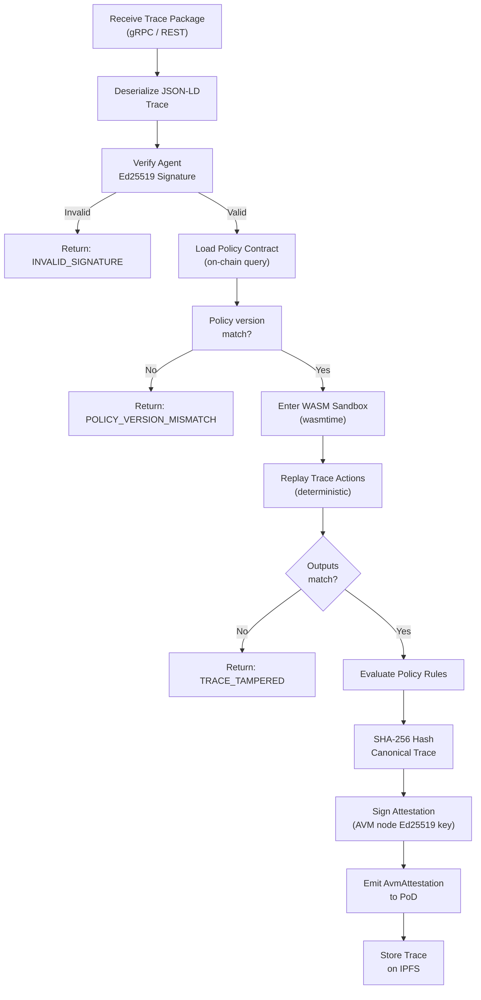

# AVM Technical Specification

## Overview

The Agent Virtual Machine (AVM) is the core execution and verification engine of MaatProof. This document provides the full technical specification for AVM implementation in Rust.

**Language**: Rust  
**Sandbox**: WebAssembly (WASM) via `wasmtime`  
**Signing**: Ed25519 (`ed25519-dalek`)  
**Hashing**: SHA-256 (`sha2`)  
**Serialization**: JSON-LD (`serde_json` + JSON-LD context)  
**Transport**: gRPC (`tonic`) + REST  

---

## Execution Model

The AVM receives an agent reasoning trace and executes it deterministically in a WASM sandbox. Each execution produces an `AvmAttestation` that validators use in PoD consensus.

### Trace Recording

During live agent execution (not replay), the AVM records every agent action as a `TraceAction`. Each action captures:

- `action_id`: UUID v4, unique per action
- `action_type`: `REASONING | TOOL_CALL | DECISION | APPROVAL_REQUEST`
- `input`: The input to this action (tool args, reasoning prompt, etc.)
- `output`: The observed output (tool result, decision text, etc.)
- `tool_calls`: Sub-tool invocations made during this action
- `timestamp`: UTC timestamp of action execution

### Deterministic Replay

Replay uses recorded outputs — it does not re-sample LLM outputs. The WASM sandbox stubs all non-deterministic operations (I/O, clocks, randomness). Replay is successful when all re-executed action outputs match recorded outputs.

---

## Data Structures

```rust
use chrono::{DateTime, Utc};
use serde::{Deserialize, Serialize};

#[derive(Serialize, Deserialize, Clone, Debug, PartialEq)]
pub enum ActionType {
    Reasoning,
    ToolCall,
    Decision,
    ApprovalRequest,
    PolicyCheck,
}

#[derive(Serialize, Deserialize, Clone, Debug)]
pub struct ToolCall {
    pub tool_name: String,
    pub tool_input: serde_json::Value,
    pub tool_output: serde_json::Value,
    pub duration_ms: u64,
}

#[derive(Serialize, Deserialize, Clone, Debug)]
pub struct TraceAction {
    pub action_id: String,
    pub action_type: ActionType,
    pub timestamp: DateTime<Utc>,
    pub input: serde_json::Value,
    pub output: serde_json::Value,
    pub tool_calls: Vec<ToolCall>,
    pub metadata: std::collections::HashMap<String, String>,
}

#[derive(Serialize, Deserialize, Clone, Debug)]
pub struct DeploymentTrace {
    pub context: String,              // JSON-LD: "https://maat.dev/trace/v1"
    pub trace_id: String,             // UUID v4
    pub agent_id: String,             // W3C DID: "did:maat:agent:..."
    pub policy_ref: String,           // Contract address
    pub policy_version: u32,
    pub artifact_hash: String,        // sha256:...
    pub deploy_environment: String,   // "production" | "staging" | etc.
    pub actions: Vec<TraceAction>,
    pub timestamp: DateTime<Utc>,
    pub human_approval_ref: Option<String>, // on-chain tx hash
    pub signature: String,            // hex-encoded Ed25519 sig over trace
}

#[derive(Serialize, Deserialize, Clone, Debug, PartialEq)]
pub enum PolicyResult {
    Pass,
    Fail { reason: String },
}

#[derive(Serialize, Deserialize, Clone, Debug)]
pub struct AvmAttestation {
    pub trace_hash: String,           // sha256 of canonical trace JSON
    pub policy_result: PolicyResult,
    pub policy_ref: String,
    pub policy_version: u32,
    pub agent_id: String,
    pub avm_node_id: String,          // AVM validator node DID
    pub avm_signature: String,        // Ed25519 sig over attestation
    pub timestamp: DateTime<Utc>,
}
```

---

## Trace Hashing

The trace hash is computed over the **canonical JSON serialization** of the `DeploymentTrace` struct, with keys sorted lexicographically and the `signature` field excluded:

```rust
use sha2::{Sha256, Digest};

pub fn hash_trace(trace: &DeploymentTrace) -> String {
    // Serialize without signature field
    let mut canonical = serde_json::to_value(trace).unwrap();
    canonical.as_object_mut().unwrap().remove("signature");

    // Sort keys (serde_json preserves insertion order by default;
    // use BTreeMap for deterministic key ordering)
    let canonical_str = serde_json::to_string(&canonical).unwrap();
    let hash = Sha256::digest(canonical_str.as_bytes());
    format!("sha256:{}", hex::encode(hash))
}
```

---

## Policy Evaluation

The AVM's policy evaluator queries the on-chain `DeployPolicy` contract and evaluates each rule against the trace's execution state:

```rust
pub struct PolicyEvaluator {
    contract_client: DeployPolicyClient,
}

impl PolicyEvaluator {
    pub async fn evaluate(
        &self,
        trace: &DeploymentTrace,
        execution_state: &ExecutionState,
    ) -> PolicyResult {
        let rules = self.contract_client
            .get_rules(&trace.policy_ref, trace.policy_version)
            .await
            .expect("Failed to fetch policy rules");

        if rules.no_friday_deploys && execution_state.deploy_day_of_week == 5 {
            return PolicyResult::Fail { reason: "NO_FRIDAY_DEPLOYS".into() };
        }
        if rules.require_human_approval && trace.human_approval_ref.is_none() {
            return PolicyResult::Fail { reason: "HUMAN_APPROVAL_REQUIRED".into() };
        }
        if execution_state.test_coverage < rules.min_test_coverage {
            return PolicyResult::Fail { reason: "INSUFFICIENT_TEST_COVERAGE".into() };
        }
        if execution_state.critical_cves > rules.max_critical_cves {
            return PolicyResult::Fail { reason: "CRITICAL_CVE_FOUND".into() };
        }
        if execution_state.agent_stake < rules.min_agent_stake {
            return PolicyResult::Fail { reason: "INSUFFICIENT_AGENT_STAKE".into() };
        }

        PolicyResult::Pass
    }
}
```

---

## LLM Model Versioning

Every reasoning trace records the LLM model that produced it. This is critical for replay verification and audit.

### Model Metadata in Traces

Each `REASONING` or `DECISION` action in the trace includes:

```rust
pub struct LlmMetadata {
    pub provider:    String,   // "anthropic" | "openai" | "mistral" | "local"
    pub model_id:    String,   // "claude-3-7-sonnet-20250219"
    pub model_hash:  String,   // SHA-256 of model weights (for local/self-hosted)
    pub temperature: f32,      // 0.0–1.0; low temperature preferred for agents
    pub max_tokens:  u32,
    pub top_p:       f32,
}
```

### LLM Provider Abstraction

The AVM defines a `LlmProvider` trait that all LLM backends must implement:

```rust
pub trait LlmProvider: Send + Sync {
    /// Return canonical model identifier (e.g., "anthropic/claude-3-7-sonnet-20250219")
    fn model_id(&self) -> &str;

    /// Execute a single LLM call; returns (response_text, token_usage)
    async fn complete(
        &self,
        system_prompt: &str,
        messages: &[Message],
        params: &LlmParams,
    ) -> Result<LlmResponse, LlmError>;

    /// Return true if this provider supports deterministic mode (seed + temp=0)
    fn supports_deterministic_mode(&self) -> bool;
}

pub struct AnthropicProvider { /* ... */ }
pub struct OpenAiProvider    { /* ... */ }
pub struct LocalProvider     { /* model_path: PathBuf, ... */ }
```

### Confidence Scoring

Agents record a `confidence_score` (0.0–1.0) for each decision step. Low-confidence decisions automatically escalate to human approval:

| Confidence | Action |
|---|---|
| ≥ 0.90 | Proceed autonomously |
| 0.70–0.89 | Flag in trace; continue unless policy requires human review |
| < 0.70 | Mandatory human review before proceeding |
| Any decision near rollback/reject | Always escalate to human review |

```rust
pub struct DecisionOutput {
    pub decision:         DeployDecision,   // APPROVE | REJECT | DEFER
    pub confidence_score: f32,              // 0.0–1.0
    pub reasoning_summary: String,
    pub escalate_to_human: bool,            // auto-set if confidence < 0.70
}
```

---

## Prompt Injection Mitigations in AVM

The AVM enforces the following at trace ingestion:

1. **System prompt hash verification** — Each agent registration includes a SHA-256 hash of its system prompt. The AVM verifies that the trace's recorded system prompt hash matches the registered one.
2. **Input sanitization** — Raw text inputs (PR bodies, commit messages) are length-limited to 4,096 tokens and stripped of control characters before being passed to the LLM tool.
3. **Injection pattern detection** — The AVM scans all REASONING action inputs for known injection patterns (e.g., "ignore previous instructions", "disregard your system prompt"). Detected patterns cause the trace to be flagged `SUSPICIOUS` and escalated.
4. **Tool call validation** — Tool call names and parameters are validated against a schema; the LLM cannot invent tool calls that aren't in the registered tool manifest.

---

## Identity Attestation

Agents sign the canonical trace hash with their Ed25519 private key:

```rust
use ed25519_dalek::{Signer, SigningKey};

pub fn sign_trace(trace_hash: &str, signing_key: &SigningKey) -> String {
    let sig = signing_key.sign(trace_hash.as_bytes());
    hex::encode(sig.to_bytes())
}

pub fn verify_trace_signature(
    trace_hash: &str,
    signature_hex: &str,
    verifying_key: &ed25519_dalek::VerifyingKey,
) -> bool {
    let sig_bytes = hex::decode(signature_hex).unwrap_or_default();
    if sig_bytes.len() != 64 { return false; }
    let sig = ed25519_dalek::Signature::from_bytes(&sig_bytes.try_into().unwrap());
    verifying_key.verify_strict(trace_hash.as_bytes(), &sig).is_ok()
}
```

---

## WASM Sandbox

The WASM sandbox uses `wasmtime` with a constrained set of imports — no network, no filesystem, no random, no clock:

```rust
use wasmtime::{Engine, Linker, Module, Store};

pub struct AvmSandbox {
    engine: Engine,
}

impl AvmSandbox {
    pub fn new() -> Self {
        let mut config = wasmtime::Config::new();
        config.wasm_threads(false);
        config.wasm_simd(false);
        Self { engine: Engine::new(&config).unwrap() }
    }

    pub fn replay(&self, wasm_module: &[u8], trace: &DeploymentTrace) -> ReplayResult {
        let mut store = Store::new(&self.engine, ());
        let module = Module::new(&self.engine, wasm_module).unwrap();
        let mut linker: Linker<()> = Linker::new(&self.engine);

        // Only allow deterministic, pure functions
        // No net, no fs, no rand, no time
        linker.func_wrap("env", "log", |_msg: i32| {}).unwrap();

        let instance = linker.instantiate(&mut store, &module).unwrap();
        let replay_fn = instance
            .get_typed_func::<i32, i32>(&mut store, "replay_trace")
            .unwrap();

        // Pass trace as WASM memory pointer
        let result = replay_fn.call(&mut store, 0).unwrap();
        if result == 1 { ReplayResult::Match } else { ReplayResult::Mismatch }
    }
}
```

---

## AVM Execution Flow Diagram


