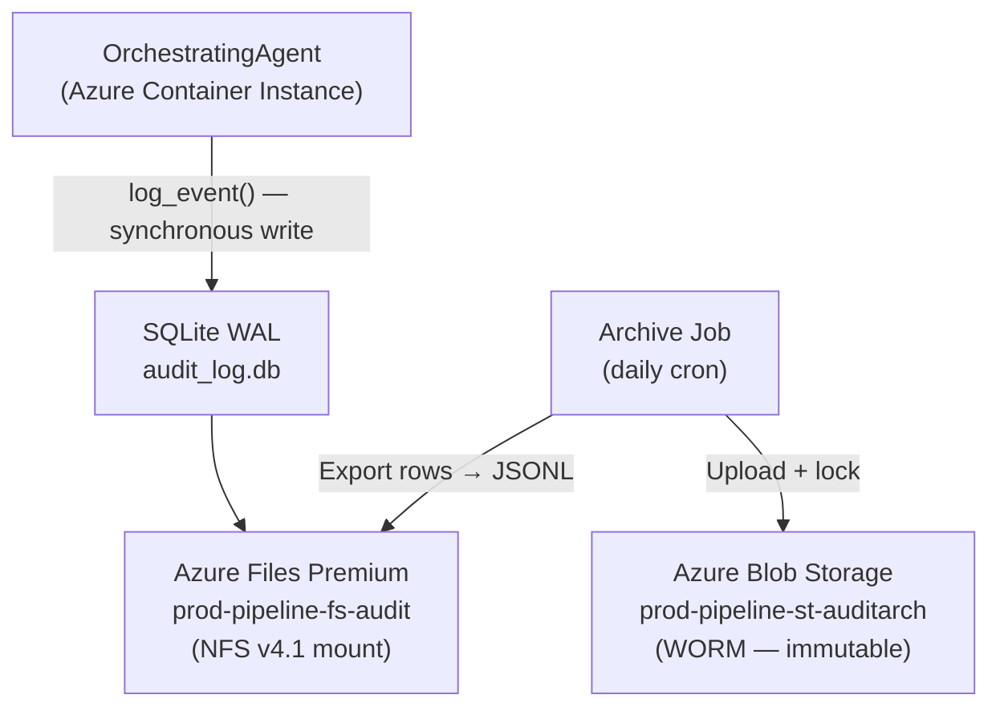
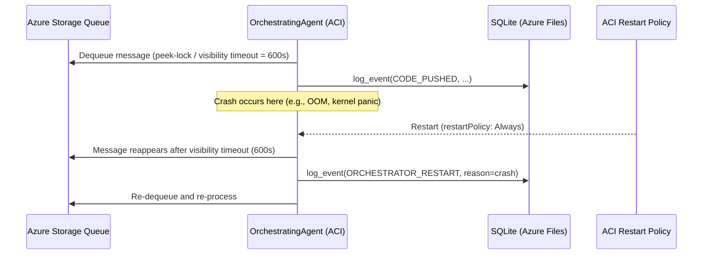
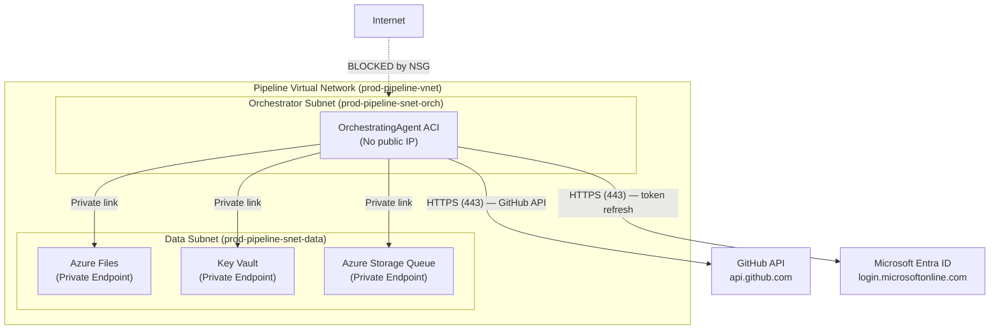

# Core Pipeline Infrastructure & IaC Specification

<!-- Addresses EDGE-125-001 through EDGE-125-070 (issue #125) -->

## Overview

This specification defines the **cloud infrastructure resources, IaC templates, secrets
management, compute, messaging, and human-approval environment configuration** required
to run the MaatProof ACI/ACD **core pipeline** (orchestrator, audit log, HMAC signing
keys, event queue, and human-approval gate).

> This spec is **complementary to** `specs/dre-infra-spec.md` (which covers DRE
> committee compute). The two must be deployed together for a complete MaatProof
> environment. All naming, tagging, and IaC-quality rules from `dre-infra-spec.md §4–7`
> and `CONSTITUTION.md §13` also apply here.

**Preferred IaC tooling**: Azure Bicep (Phase 1). Terraform support is a Phase 2 item.

References:
- `CONSTITUTION.md §3–4` — Human approval policy, cryptographic proof requirement
- `specs/audit-logging-spec.md` — Audit log data model, HMAC key management
- `specs/proof-chain-spec.md §3` — HMAC key minimum entropy requirements
- `specs/dre-infra-spec.md` — DRE-specific infrastructure (naming, tagging, CI/CD gates)
- `docs/06-security-model.md` — Key management and network security

---

## §1 — Audit Log Storage Infrastructure

<!-- Addresses EDGE-125-001, EDGE-125-002, EDGE-125-003, EDGE-125-004,
     EDGE-125-005, EDGE-125-006, EDGE-125-007, EDGE-125-008, EDGE-125-009 -->

### §1.1 Storage Resource Architecture

The audit log storage layer uses two complementary resources:

| Layer | Resource | Purpose | Retention |
|-------|---------|---------|-----------|
| **Online (hot)** | Azure Files (Premium tier) | Hosts the live SQLite WAL audit database | 90 days (dev) / 2 years (production) |
| **Archive (WORM)** | Azure Blob Storage (immutable) | Daily JSONL exports for long-term compliance | Up to 10 years (SOX/Critical Infra) |



### §1.2 Azure Files Resource Definition

<!-- Addresses EDGE-125-007 -->

```bicep
// prod-pipeline-fs-audit — Azure Files Premium for live SQLite audit DB
resource auditFileStorage 'Microsoft.Storage/storageAccounts@2023-01-01' = {
  name: '${env}pipelinestaudit'     // e.g., prodpipelinestaudit (no hyphens; suffix auto-appended)
  location: location                // MUST be a parameter — never hardcoded (EDGE-125-053)
  sku: { name: 'Premium_LRS' }
  kind: 'FileStorage'
  properties: {
    minimumTlsVersion: 'TLS1_2'
    supportsHttpsTrafficOnly: true
    allowBlobPublicAccess: false    // Deny public blob access at account level (EDGE-125-054)
    networkAcls: {
      defaultAction: 'Deny'        // Private endpoint only (EDGE-125-008)
      bypass: ['AzureServices']
    }
    largeFileSharesState: 'Enabled'
  }
}

resource auditFileShare 'Microsoft.Storage/storageAccounts/fileServices/shares@2023-01-01' = {
  name: '${auditFileStorage.name}/default/audit-db'
  properties: {
    shareQuota: 100                  // GiB; alert at 80%
    accessTier: 'Premium'
    enabledProtocols: 'NFS'          // NFS v4.1 for container mount
  }
}
```

**Mount configuration** for the orchestrator ACI (see §3):

```yaml
# Azure Container Instance volume mount
volumes:
  - name: audit-db-vol
    azureFile:
      shareName: audit-db
      storageAccountName: "${auditFileStorage.name}"
      readOnly: false               # Write access required by orchestrator only
```

> **Single-writer constraint (EDGE-125-006):** The orchestrator MUST run as a **single
> instance** (see §3.4 for the singleton pattern). Azure Files NFS does not provide
> row-level locking across multiple clients; two orchestrator instances writing
> concurrently would corrupt the SQLite WAL. The IaC deployment pipeline enforces
> exactly one orchestrator instance at all times (see §3.5).

### §1.3 CanNotDelete Resource Lock

<!-- Addresses EDGE-125-001, EDGE-125-003 -->

Both the hot storage account and the WORM archive account MUST have a `CanNotDelete`
Management Lock applied via IaC:

```bicep
resource auditStorageLock 'Microsoft.Authorization/locks@2020-05-01' = {
  name: '${env}-pipeline-audit-nodelete'
  scope: auditFileStorage
  properties: {
    level: 'CanNotDelete'
    notes: 'Audit log storage — tamper-evident log. Do not delete. See CONSTITUTION.md §7.'
  }
}

resource auditArchiveLock 'Microsoft.Authorization/locks@2020-05-01' = {
  name: '${env}-pipeline-auditarch-nodelete'
  scope: auditArchiveStorage
  properties: {
    level: 'CanNotDelete'
    notes: 'Compliance archive — WORM. Do not delete. See audit-logging-spec.md §8.'
  }
}
```

> **Lock removal monitoring (EDGE-125-003, EDGE-125-061):** Azure Policy MUST deny
> lock removal on resources tagged `managed-by: iac` in the `{env}-pipeline-rg`
> resource group. Additionally, a **Microsoft Defender for Cloud** alert MUST be
> configured to fire within 5 minutes when any `Microsoft.Authorization/locks` DELETE
> operation succeeds on the audit resource group. This alert routes to the on-call
> channel configured in `CONSTITUTION.md §3`.
>
> Recovery procedure: If a lock is accidentally removed, the IaC pipeline re-applies
> it on next run. Operators MUST NOT delete the underlying storage resource in the
> interim; if deletion occurred, treat as a **Critical compliance incident** per
> `audit-logging-spec.md §3.3 EDGE-010`.

### §1.4 Append-Only Access Policy (WORM Archive)

<!-- Addresses EDGE-125-002 -->

The archive Blob Storage container MUST use Azure Blob **immutable storage** with a
time-based retention policy:

```bicep
resource auditArchiveStorage 'Microsoft.Storage/storageAccounts@2023-01-01' = {
  name: '${env}pipelinestauditarch'
  location: location
  sku: { name: 'Standard_GRS' }    // Geo-redundant for compliance archives
  kind: 'StorageV2'
  properties: {
    allowBlobPublicAccess: false
    minimumTlsVersion: 'TLS1_2'
    networkAcls: { defaultAction: 'Deny', bypass: ['AzureServices'] }
  }
}

resource auditArchiveContainer 'Microsoft.Storage/storageAccounts/blobServices/containers@2023-01-01' = {
  name: '${auditArchiveStorage.name}/default/audit-archive'
  properties: {
    publicAccess: 'None'
    immutableStorageWithVersioning: {
      enabled: true
    }
  }
}

// Time-based retention policy: 7 years (SOX maximum) — EDGE-125-009, EDGE-125-069
resource retentionPolicy 'Microsoft.Storage/storageAccounts/blobServices/containers/immutabilityPolicies@2023-01-01' = {
  name: '${auditArchiveContainer.name}/default'
  properties: {
    immutabilityPeriodSinceCreationInDays: 2555   // 7 years (SOX)
    allowProtectedAppendWrites: true               // ALLOWS appending new records; blocks overwrites/deletes
  }
}
```

> **`allowProtectedAppendWrites: true` (EDGE-125-002):** This flag permits APPEND of
> new blobs/blocks to an existing blob while preventing modification or deletion of
> existing data. New daily JSONL files can be added; old ones cannot be overwritten.
>
> **Incident investigation annotation (EDGE-125-010):** Since the WORM policy prevents
> modification, incident investigators MUST write annotations to a **separate
> `audit-annotations` container** (not subject to WORM) that references entry IDs from
> the immutable archive. Annotations are linked to entries by `entry_id` but are stored
> independently. This preserves the immutability of the original log while allowing
> forensic notes.

### §1.5 Capacity Alerting

<!-- Addresses EDGE-125-004, EDGE-125-068 -->

```bicep
// Alert when Azure Files share usage > 80%
resource auditStorageAlert 'Microsoft.Insights/metricAlerts@2018-03-01' = {
  name: '${env}-pipeline-audit-capacity-warn'
  properties: {
    severity: 2
    criteria: {
      'odata.type': 'Microsoft.Azure.Monitor.SingleResourceMultipleMetricCriteria'
      allOf: [{
        name: 'FileShareUsage80'
        metricName: 'FileShareUsagePercent'
        threshold: 80
        operator: 'GreaterThan'
      }]
    }
    actions: [{ actionGroupId: onCallActionGroupId }]
    targetResourceUri: auditFileStorage.id
  }
}
```

When usage exceeds 95%:
1. `AuditLogger` raises `AuditDiskFullError` (per `audit-logging-spec.md §7.2`).
2. The pipeline halts and emits a system alert.
3. Operators MUST increase the `shareQuota` in IaC and re-apply before resuming.

### §1.6 Backup Policy

<!-- Addresses EDGE-125-005 -->

The live SQLite database on Azure Files MUST be protected by:

1. **Azure Backup** vault configured with daily snapshots retained for 30 days.
2. **Litestream** (or equivalent WAL replication): If used, the Litestream process
   runs as a sidecar in the orchestrator ACI and replicates the SQLite WAL to the
   archive Blob Storage container in near-real-time.
3. **RPO**: Maximum 24 hours for Azure Backup snapshots; ≤ 1 minute with Litestream.
4. **Recovery procedure**: Documented in `docs/runbooks/audit-db-recovery.md`
   (created as part of issue #125 implementation).

---

## §2 — HMAC Signing Key Infrastructure

<!-- Addresses EDGE-125-017, EDGE-125-019, EDGE-125-020, EDGE-125-055,
     EDGE-125-056 -->

### §2.1 Key Vault Resource Definition

The HMAC signing key for the audit log and proof chain MUST be stored in a dedicated
**Azure Key Vault (Premium tier)** with HSM-backed protection:

```bicep
resource hmacKeyVault 'Microsoft.KeyVault/vaults@2023-02-01' = {
  name: '${env}-pipeline-kv'           // e.g., prod-pipeline-kv
  location: location
  properties: {
    sku: { family: 'A', name: 'premium' }  // Premium = HSM-backed keys (EDGE-125-020)
    tenantId: subscription().tenantId
    enableSoftDelete: true              // Soft-delete REQUIRED (EDGE-125-055)
    softDeleteRetentionInDays: 90
    enablePurgeProtection: true         // Prevents hard-delete during soft-delete window
    enableRbacAuthorization: true       // Use RBAC (not legacy access policies)
    networkAcls: {
      defaultAction: 'Deny'
      bypass: 'AzureServices'
      virtualNetworkRules: [{
        id: orchestratorSubnetId       // Allow only orchestrator subnet
      }]
    }
  }
}
```

> **HSM requirement (EDGE-125-020):** The Premium SKU is **mandatory for production**.
> Standard SKU (software-protected keys) is acceptable for development environments only.
> IaC templates parameterize the SKU and enforce Premium for `env == 'prod'` via a
> Bicep condition guard.
>
> **Soft-delete + purge protection (EDGE-125-055):** Enables a 90-day recovery window
> if the key is accidentally deleted. `enablePurgeProtection: true` prevents an attacker
> with Owner access from permanently deleting the key during the soft-delete window.

### §2.2 HMAC Key Secret Naming Convention

<!-- Addresses EDGE-125-019 -->

HMAC signing key secrets follow this naming pattern:

```
pipeline-{environment}-hmac-key-v{version}
```

| Token | Values | Notes |
|-------|--------|-------|
| `pipeline` | Literal | Distinguishes from DRE LLM API keys |
| `{environment}` | `dev`, `staging`, `prod` | Environment isolation |
| `hmac-key` | Literal | Key type identifier |
| `v{version}` | Integer, e.g., `v1`, `v2`, `v3` | Key version (see `audit-logging-spec.md §3.2`) |

Examples:
- `pipeline-prod-hmac-key-v1` (retired)
- `pipeline-prod-hmac-key-v2` (current)
- `pipeline-staging-hmac-key-v1` (current)

> **GitHub Actions format (EDGE-125-019):** When using GitHub Actions environment
> secrets instead of Key Vault (acceptable for dev/staging), the corresponding secret
> name is `MAAT_AUDIT_HMAC_KEY_{VERSION}` (matching `audit-logging-spec.md §3.1`).
> The mapping between the Key Vault name and the GitHub Actions secret name MUST be
> documented in the IaC README.

### §2.3 Orchestrator RBAC for HMAC Key Vault

<!-- Addresses EDGE-125-017 -->

The orchestrator's managed identity MUST have the minimum permissions required to
read HMAC key secrets:

```bicep
// Grant orchestrator managed identity read-only access to HMAC secrets only
resource hmacKeyReaderRole 'Microsoft.Authorization/roleAssignments@2022-04-01' = {
  name: guid(hmacKeyVault.id, orchestratorIdentity.id, 'Key Vault Secrets User')
  scope: hmacKeyVault
  properties: {
    roleDefinitionId: subscriptionResourceId(
      'Microsoft.Authorization/roleDefinitions',
      '4633458b-17de-408a-b874-0445c86b69e6'  // Key Vault Secrets User (read-only)
    )
    principalId: orchestratorIdentity.properties.principalId
    principalType: 'ServicePrincipal'
  }
}
```

The orchestrator managed identity MUST NOT have:
- Key Vault Administrator, Contributor, or Owner on any Key Vault
- Access to Key Vaults belonging to the DRE or other tenants
- Any write access to Key Vault secrets

> **Access monitoring (EDGE-125-056):** Azure Key Vault **diagnostic logging** MUST be
> enabled and routed to a Log Analytics Workspace. An **alert rule** MUST fire if:
> (a) a `SecretGet` operation succeeds from any principal OTHER than the orchestrator
> managed identity, or (b) more than 100 `SecretGet` operations occur within 5 minutes
> from any single principal (rate-anomaly detection). Alerts route to the on-call
> channel.

### §2.4 GitHub Actions Environment Secret Security

<!-- Addresses EDGE-125-018, EDGE-125-044, EDGE-125-058 -->

When HMAC keys are stored as GitHub Actions secrets:

1. **Environment secrets only**: HMAC key secrets MUST be configured as GitHub Actions
   **environment secrets** scoped to the `production`, `staging`, or `dev` environments
   — NOT as repository-level secrets.

2. **No `pull_request_target` trigger**: Workflows that access HMAC key secrets MUST
   NOT use the `pull_request_target` trigger. This trigger runs with the base repo's
   context and can expose secrets to fork contributors. Use `pull_request` (which
   does NOT expose environment secrets) or restrict with environment protection rules.

3. **`secrets: inherit` prohibited**: Workflows MUST explicitly declare secret names;
   `secrets: inherit` is prohibited per `dre-infra-spec.md §11.1`.

4. **`add-mask` step required**: Every workflow step that reads an HMAC key secret MUST
   call `echo "::add-mask::$SECRET_VALUE"` before any subsequent step that might log it.

```yaml
# CORRECT — environment secret, explicit declaration, masked
jobs:
  run-orchestrator:
    environment: production
    steps:
      - name: Mask HMAC key
        run: echo "::add-mask::${{ secrets.MAAT_AUDIT_HMAC_KEY_2 }}"
      - name: Start orchestrator
        env:
          MAAT_AUDIT_HMAC_KEY_2: ${{ secrets.MAAT_AUDIT_HMAC_KEY_2 }}
        run: python -m maatproof.orchestrator
```

---

## §3 — Orchestrator Compute Infrastructure

<!-- Addresses EDGE-125-021, EDGE-125-022, EDGE-125-023, EDGE-125-024,
     EDGE-125-026, EDGE-125-027, EDGE-125-028, EDGE-125-029, EDGE-125-030,
     EDGE-125-064 -->

### §3.1 Compute Resource Type

The `OrchestratingAgent` runs as an **Azure Container Instance (ACI)** in Phase 1.
Azure Container Apps (ACA) may be used for Phase 2 if auto-scaling is required.

| Attribute | Phase 1 (ACI) | Phase 2 (ACA) |
|-----------|--------------|---------------|
| Resource type | `Microsoft.ContainerInstance/containerGroups` | `Microsoft.App/containerApps` |
| Scaling | Manual (single instance) | Horizontal (KEDA-based) |
| State | Persistent (Azure Files NFS mount) | Persistent (same mount) |
| Cost | Pay-per-second | Pay-per-request |
| Recommended for | Dev, staging, small-team prod | High-throughput production |

### §3.2 Orchestrator ACI Bicep Definition

```bicep
resource orchestratorContainerGroup 'Microsoft.ContainerInstance/containerGroups@2023-05-01' = {
  name: '${env}-pipeline-aci-orch'
  location: location
  identity: {
    type: 'UserAssigned'
    userAssignedIdentities: { '${orchestratorIdentity.id}': {} }
  }
  properties: {
    osType: 'Linux'
    restartPolicy: 'Always'          // Auto-restart on crash (EDGE-125-022)
    ipAddress: {
      type: 'Private'                // No public IP (EDGE-125-028)
      ports: []                      // No inbound ports
    }
    subnetIds: [{ id: orchestratorSubnetId }]
    containers: [{
      name: 'orchestrator'
      properties: {
        image: orchestratorImageDigest  // MUST be image@sha256:digest — NOT :latest (EDGE-125-026)
        resources: {
          requests: { cpu: 2, memoryInGB: 4 }    // Minimum for production (EDGE-125-023, EDGE-125-024)
          limits: { cpu: 4, memoryInGB: 8 }
        }
        environmentVariables: [
          { name: 'MAAT_ENV', value: env }
          { name: 'MAAT_AUDIT_HMAC_KEY_VERSION', value: hmacKeyVersion }
          // HMAC key injected at runtime from Key Vault; NOT in IaC template
        ]
        volumeMounts: [{
          name: 'audit-db-vol'
          mountPath: '/data/audit'
          readOnly: false
        }]
        securityContext: {
          runAsUser: 1000              // Non-root user (EDGE-125-064)
          runAsGroup: 1000
          allowPrivilegeEscalation: false
          readOnlyRootFilesystem: true // Read-only root; /data/audit is a volume mount
          capabilities: {
            drop: ['ALL']              // Drop all Linux capabilities (EDGE-125-064)
          }
        }
      }
    }]
    volumes: [{
      name: 'audit-db-vol'
      azureFile: {
        shareName: 'audit-db'
        storageAccountName: auditFileStorage.name
        storageAccountKey: auditFileStorageKey  // Injected at deploy time from Key Vault ref
        readOnly: false
      }
    }]
    diagnostics: {
      logAnalytics: {
        workspaceId: logAnalyticsWorkspaceId
        logType: 'ContainerInsights'
      }
    }
  }
}
```

### §3.3 Compute Sizing

<!-- Addresses EDGE-125-023, EDGE-125-024 -->

| Environment | CPU (vCPU) | Memory (GiB) | Max concurrent pipeline events |
|------------|-----------|-------------|-------------------------------|
| Development | 0.5 | 1 | 10 |
| Staging | 1 | 2 | 50 |
| Production | 2 (min) — 4 (max) | 4 (min) — 8 (max) | 200 |

> **Memory sizing rationale (EDGE-125-023):** A `ReasoningProof` with the maximum 500
> steps at 4,096 chars each is ~2 MiB serialized. The orchestrator may hold up to 200
> concurrent in-flight pipeline events (pending/processing). Peak memory: ~400 MiB for
> proof data + 3.6 GiB operating headroom = 4 GiB minimum for production.
>
> For throughput beyond 200 concurrent events, migrate to Azure Container Apps with
> KEDA-based auto-scaling triggered on queue depth (§4.4).

### §3.4 Singleton Orchestrator Constraint

<!-- Addresses EDGE-125-006, EDGE-125-027 -->

The orchestrator MUST run as a **single instance** to prevent:
- Concurrent SQLite writes from multiple writers corrupting the WAL (EDGE-125-006)
- Duplicate pipeline processing for the same queue message (EDGE-125-027)

Enforcement mechanisms:

1. **ACI deployment**: Azure Container Instance supports only one container group with
   a given name; re-deploying the same ACI name replaces the existing instance.

2. **IaC-enforced single instance**: The Bicep template defines exactly `1` container
   instance. Auto-scaling is disabled for Phase 1.

3. **Distributed lock (optional, Phase 2)**: For Phase 2 multi-instance deployments,
   the orchestrator MUST acquire a distributed lock via Azure Blob Storage
   [lease API](https://learn.microsoft.com/en-us/rest/api/storageservices/lease-blob)
   before processing any queue message. Any instance failing to acquire the lease
   within 30 seconds MUST exit with `ORCHESTRATOR_LOCK_CONTENTION` error.

### §3.5 Crash Recovery and State Persistence

<!-- Addresses EDGE-125-030 -->



**Recovery invariants (EDGE-125-030):**

1. Queue messages use a **visibility timeout of 600 seconds** (10 minutes). If the
   orchestrator crashes before deleting the message, the message reappears in the queue
   after 600 seconds for re-processing.

2. On restart, the orchestrator reads the audit log to determine the last known
   pipeline state. If the last event for a pipeline run is in state `AWAITING_APPROVAL`,
   the orchestrator emits `ORCHESTRATOR_RESTART_RECOVERY` with the pending `proof_id`
   and re-sends the human approval request.

3. **AWAITING_APPROVAL recovery (EDGE-125-030):** If the orchestrator was in
   `AWAITING_APPROVAL` at crash time:
   - Check audit log for `AWAITING_APPROVAL` entry with no corresponding
     `HUMAN_APPROVED` or `HUMAN_REJECTED` entry.
   - If found and within the 24-hour approval timeout window: re-send notification.
   - If outside the window: emit `APPROVAL_TIMEOUT` and transition to `IDLE`.

4. **Idempotency**: All orchestrator event handlers MUST be idempotent. Re-processing
   the same queue message twice MUST produce the same audit log outcome (duplicate
   audit entries are rejected by the `UNIQUE` constraint on `entry_id` — see
   `audit-logging-spec.md §5.2`).

### §3.6 Orchestrator Network Security

<!-- Addresses EDGE-125-028, EDGE-125-029 -->



**Orchestrator NSG rules (EDGE-125-028):**

| Priority | Direction | Source | Destination | Port | Action |
|----------|-----------|--------|-------------|------|--------|
| 100 | Outbound | OrchestratorSubnet | GitHub IP ranges | 443 | Allow |
| 110 | Outbound | OrchestratorSubnet | `AzureActiveDirectory` tag | 443 | Allow |
| 200 | Outbound | OrchestratorSubnet | VirtualNetwork | 443 | Allow (private endpoints) |
| 4096 | Outbound | OrchestratorSubnet | Any | Any | **Deny** |
| 4096 | Inbound | Any | OrchestratorSubnet | Any | **Deny** |

**Orchestrator managed identity RBAC (EDGE-125-029):**

| Resource | Role | Scope |
|---------|------|-------|
| HMAC Key Vault | Key Vault Secrets User | `prod-pipeline-kv` only |
| Audit file storage | Storage File Data SMB Share Contributor | `audit-db` share only |
| Queue storage account | Storage Queue Data Message Processor | Queue resource only |
| Log Analytics | Monitoring Metrics Publisher | Log Analytics workspace only |

The orchestrator managed identity MUST NOT have Contributor or Owner on any resource
group or subscription.

---

## §4 — Message Queue Infrastructure

<!-- Addresses EDGE-125-031, EDGE-125-032, EDGE-125-033, EDGE-125-034,
     EDGE-125-035, EDGE-125-036, EDGE-125-037, EDGE-125-038, EDGE-125-039,
     EDGE-125-040, EDGE-125-059, EDGE-125-063 -->

### §4.1 Queue Resource Type Selection

The pipeline event queue uses **Azure Storage Queue** in Phase 1.

| Queue Type | Phase | Rationale |
|-----------|-------|-----------|
| **Azure Storage Queue** | Phase 1 | Simple, cost-effective, sufficient for ordered single-consumer pipeline |
| **Azure Service Bus Standard** | Phase 2 | Preferred if: dead-letter queue, sessions, duplicate detection, or >65 KiB messages are needed |

> **Ordering note (EDGE-125-036):** Azure Storage Queue provides **best-effort FIFO**
> ordering (not strict). The orchestrator's state machine (defined in
> `proof-chain-spec.md §6`) MUST handle out-of-order events gracefully — out-of-sequence
> events are logged and ignored without halting the pipeline.

### §4.2 Queue Resource Definition

```bicep
resource queueStorageAccount 'Microsoft.Storage/storageAccounts@2023-01-01' = {
  name: '${env}pipelinestqueue'      // e.g., prodpipelinestqueue
  location: location
  sku: { name: 'Standard_LRS' }
  kind: 'StorageV2'
  properties: {
    minimumTlsVersion: 'TLS1_2'
    supportsHttpsTrafficOnly: true
    allowBlobPublicAccess: false
    networkAcls: {
      defaultAction: 'Deny'          // Private endpoint only (EDGE-125-040)
      bypass: ['AzureServices']
    }
  }
}

resource pipelineQueue 'Microsoft.Storage/storageAccounts/queueServices/queues@2023-01-01' = {
  name: '${queueStorageAccount.name}/default/pipeline-events'
  properties: {}
}

// Dead-letter queue: messages that fail to process move here (EDGE-125-035)
resource pipelineDlq 'Microsoft.Storage/storageAccounts/queueServices/queues@2023-01-01' = {
  name: '${queueStorageAccount.name}/default/pipeline-events-dlq'
  properties: {}
}
```

> **Note on Azure Storage Queue DLQ (EDGE-125-035):** Native Azure Storage Queue does
> not have a built-in dead-letter queue. The orchestrator MUST implement DLQ logic
> explicitly:
> 1. After `max_dequeue_count` (default: 5) retries, move the message to
>    `pipeline-events-dlq` manually.
> 2. A **DLQ monitoring alert** fires when `pipeline-events-dlq` depth exceeds 0.
> 3. DLQ messages are retained for 7 days (configurable) before expiry.
>
> For Phase 2 (Service Bus), native DLQ is available without custom code.

### §4.3 Queue Message Configuration

<!-- Addresses EDGE-125-032, EDGE-125-033 -->

| Parameter | Value | Rationale |
|-----------|-------|-----------|
| **Message TTL** | **86,400 seconds (24 hours)** | Matches the human-approval timeout window; messages older than 24 hours are stale and should not be processed |
| **Visibility timeout** | **600 seconds (10 minutes)** | Crash recovery window (§3.5); gives orchestrator 10 min to process before message reappears |
| **Max queue depth** | 10,000 messages | Alert fires at 8,000 (80%); processing is paused at 10,000 (EDGE-125-033) |
| **Max message size** | 64 KiB (Azure Storage Queue limit) | Sufficient for all pipeline event types; oversized messages are rejected |

**Queue depth alerting (EDGE-125-033):**

```bicep
resource queueDepthAlert 'Microsoft.Insights/metricAlerts@2018-03-01' = {
  name: '${env}-pipeline-queue-depth-warn'
  properties: {
    criteria: {
      allOf: [{
        name: 'QueueDepth80Pct'
        metricName: 'QueueMessageCount'
        threshold: 8000
        operator: 'GreaterThan'
      }]
    }
    actions: [{ actionGroupId: onCallActionGroupId }]
    targetResourceUri: queueStorageAccount.id
  }
}
```

### §4.4 Queue Message Schema and Validation

<!-- Addresses EDGE-125-038, EDGE-125-059, EDGE-125-063 -->

All pipeline event messages MUST conform to the following JSON schema:

```json
{
  "$schema": "http://json-schema.org/draft-07/schema#",
  "type": "object",
  "required": ["event", "timestamp", "pipeline_id", "idempotency_key"],
  "properties": {
    "event": {
      "type": "string",
      "enum": [
        "CODE_PUSHED", "TEST_FAILED", "ALL_TESTS_PASS",
        "STAGING_HEALTHY", "STAGING_UNHEALTHY",
        "HUMAN_APPROVED", "HUMAN_REJECTED",
        "PROD_ERROR_SPIKE", "ROLLBACK_COMPLETE"
      ]
    },
    "timestamp": { "type": "number", "minimum": 0 },
    "pipeline_id": { "type": "string", "maxLength": 256 },
    "idempotency_key": { "type": "string", "format": "uuid" },
    "payload": {
      "type": "object",
      "maxProperties": 50,
      "additionalProperties": { "type": "string", "maxLength": 4096 }
    }
  },
  "additionalProperties": false
}
```

**Orchestrator queue consumer MUST (EDGE-125-038):**
1. Validate every dequeued message against this schema BEFORE processing.
2. Reject (move to DLQ) any message that fails schema validation.
3. Apply prompt injection detection to ALL string fields in `payload` per
   `proof-chain-spec.md §5 — Prompt Injection Mitigations — Python Layer` (EDGE-125-059).

**Poison pill protection (EDGE-125-063):**

```python
MAX_DEQUEUE_COUNT = 5  # If a message has been dequeued ≥ 5 times without success,
                        # it is a "poison pill" — move to DLQ and alert

async def process_message(message: QueueMessage) -> None:
    if message.dequeue_count >= MAX_DEQUEUE_COUNT:
        await queue_client.send_message(dlq_client, message.content)
        await queue_client.delete_message(message)
        audit_logger.log_event(
            "QUEUE_POISON_PILL_QUARANTINED",
            result=f"dequeue_count={message.dequeue_count}",
            metadata={"message_id": message.id}
        )
        alert_on_call(f"Poison pill quarantined: {message.id}")
        return
    # Normal processing...
```

### §4.5 Queue Service Unavailability Handling

<!-- Addresses EDGE-125-039 -->

When the Azure Storage Queue service is unavailable:

1. **At orchestrator start**: Orchestrator emits `QUEUE_UNAVAILABLE` to the audit log
   (using in-memory fallback only) and exits with a non-zero exit code.
   The ACI `restartPolicy: Always` triggers restart with exponential backoff.

2. **During processing**: If the queue becomes unavailable mid-processing, the
   orchestrator logs `QUEUE_CONNECTIVITY_LOST` and retries the queue connection with
   exponential backoff (1 s → 2 s → 4 s → 8 s → 16 s; max 5 retries = ~31 seconds).
   If reconnection fails, the orchestrator halts and awaits ACI restart.

3. **Event loss prevention**: The orchestrator acknowledges (deletes) queue messages
   only AFTER the audit log entry is durably written (i.e., after SQLite COMMIT).
   A crash between dequeue and DELETE causes the message to reappear after the
   visibility timeout — see §3.5 crash recovery.

### §4.6 Queue Access Security

<!-- Addresses EDGE-125-037 -->

Queue access credentials MUST follow the same rules as HMAC key credentials:
- The queue storage account connection string or key MUST NOT appear in any IaC
  template, environment variable file, or source code committed to Git.
- The orchestrator accesses the queue using its **Managed Identity**
  (Storage Queue Data Message Processor role — see §3.6 RBAC table).
- If SAS tokens are needed for external publishers (e.g., GitHub Actions webhooks),
  they MUST have a maximum TTL of 1 hour and be scoped to enqueue-only operations.

---

## §5 — Human Approval GitHub Environment

<!-- Addresses EDGE-125-041, EDGE-125-042, EDGE-125-043, EDGE-125-044,
     EDGE-125-045, EDGE-125-046, EDGE-125-047 -->

### §5.1 GitHub Environment Configuration

The human approval gate requires a dedicated GitHub Actions **environment** named
`production` (and `staging` for staging gate workflows) configured with strict
protection rules.

**Required environment configuration:**

| Setting | Required Value | Rationale |
|---------|---------------|-----------|
| `required_reviewers` | ≥ 1 person or team (recommended: 2) | Prevents single-point failure and insider threat (EDGE-125-042) |
| `wait_timer` | 0 minutes (software timeout enforced; see §5.3) | GitHub wait timer is advisory; software enforces the 24h timeout |
| `deployment_branch_policy` | `protected_branches: true` OR explicit `main` only | Prevents deployment from feature branches (EDGE-125-045) |
| `prevent_self_review` | `true` | Agent MUST NOT approve its own deployment |

> **Required reviewer count MUST be ≥ 1 (EDGE-125-042):** The IaC pipeline (or
> GitHub App configuration script) MUST validate that `required_reviewers` ≥ 1 before
> any production environment is considered active. A GitHub environment with zero
> required reviewers is treated as a **misconfiguration** and the pipeline MUST
> emit `HUMAN_APPROVAL_BYPASSED` to the audit log and halt.

**GitHub environment configuration** (via GitHub API or Terraform `github` provider):

```hcl
# Terraform GitHub provider — production environment
resource "github_repository_environment" "production" {
  repository  = var.repo_name
  environment = "production"

  reviewers {
    teams = [data.github_team.release_team.id]   // At least one team required
  }

  deployment_branch_policy {
    protected_branches     = true   // Only protected branches (EDGE-125-045)
    custom_branch_policies = false
  }
}
```

### §5.2 Fork PR Protection

<!-- Addresses EDGE-125-044, EDGE-125-058 -->

Workflows that trigger the human approval environment MUST use the `push` or
`workflow_dispatch` trigger — **not** `pull_request_target`. This prevents fork
contributors from accessing environment secrets via PR targeting.

```yaml
# CORRECT — no fork access to environment secrets
on:
  push:
    branches: ['main']
  workflow_dispatch:
    inputs:
      environment:
        required: true
        type: choice
        options: ['staging', 'production']

# PROHIBITED — exposes environment secrets to fork PRs
on:
  pull_request_target:   # NEVER use this for workflows with environment secrets
```

### §5.3 Approval Timeout Synchronization

<!-- Addresses EDGE-125-046 -->

The software 24-hour approval timeout (defined in `proof-chain-spec.md §6`) and the
GitHub environment must be consistent:

1. The orchestrator starts a 24-hour countdown on emission of `AWAITING_APPROVAL`.
2. The GitHub Actions deployment job uses a `timeout-minutes: 1440` (24 hours) on the
   approval-waiting step. This matches the software timeout.
3. If the GitHub deployment job times out (no reviewer action in 24 hours), the
   workflow emits a synthetic `HUMAN_APPROVAL_TIMEOUT` event to the orchestrator queue,
   triggering the `APPROVAL_TIMEOUT` transition in the state machine.

```yaml
# Approval step in deployment workflow
- name: Wait for manual approval
  uses: actions/deploy-pages@v3   # or equivalent approval action
  timeout-minutes: 1440           # 24 hours — matches software timeout (EDGE-125-046)
  with:
    environment: production
```

### §5.4 Reviewer Unavailability Escalation

<!-- Addresses EDGE-125-041 -->

When all required reviewers are unavailable (e.g., vacation, illness):

1. The orchestrator continues in `AWAITING_APPROVAL` state for up to 24 hours.
2. After 8 hours with no approval action, the orchestrator emits `APPROVAL_DELAYED`
   to the audit log with metadata `elapsed_hours: 8` and sends a secondary alert to
   a backup escalation channel (configurable via `MAAT_APPROVAL_ESCALATION_WEBHOOK`).
3. After 24 hours, `APPROVAL_TIMEOUT` is emitted and the deployment is blocked.
4. **Recovery path**: A team lead with `role:architect` label can extend the timeout
   by re-triggering the approval workflow via `workflow_dispatch` with `extend_timeout: true`.
   This creates a new 24-hour window and logs `APPROVAL_TIMEOUT_EXTENDED` in the audit log.

### §5.5 Stale Proof Rejection

<!-- Addresses EDGE-125-043 -->

When a human reviewer approves a deployment, the GitHub Actions workflow MUST:
1. Read the `proof_id` from the pending deployment metadata (set by the orchestrator
   when emitting `AWAITING_APPROVAL`).
2. Verify the `proof_id` matches the current pending proof in the orchestrator's state
   (queried via the internal API).
3. If mismatched (stale approval), reject the approval, log `STALE_APPROVAL_REJECTED`,
   and re-request approval with the current `proof_id`.

### §5.6 GitHub Environment Lifecycle Management

<!-- Addresses EDGE-125-047 -->

GitHub environments are versioned in IaC (GitHub provider Terraform or GitHub API).
- Deleting a GitHub environment must be treated as a **breaking IaC change** requiring
  `role:architect` review (per `dre-infra-spec.md §4.3`).
- A **monitoring check** runs daily to verify that the `production` environment exists
  and has `required_reviewers ≥ 1`. If this check fails, a GitHub Issue is opened
  with label `role:architect` and label `agent:planner` to trigger remediation.
- Operators MUST NOT manually delete the production environment via the GitHub UI;
  all lifecycle operations must go through IaC.

---

## §6 — IaC Template Quality Requirements

<!-- Addresses EDGE-125-049, EDGE-125-052, EDGE-125-053 -->

### §6.1 Location Parameterization

<!-- Addresses EDGE-125-053 -->

ALL IaC templates MUST declare `location` as a required parameter with no default:

```bicep
@description('Azure region for all resources. Must be same region as DRE resources.')
param location string  // No default — callers must explicitly specify

// Anti-pattern: NEVER hardcode location
// location: 'westus2'  // PROHIBITED — flagged by custom linter
```

The CI linter (§7.1 in `dre-infra-spec.md`) MUST detect hardcoded location strings
(any `'eastus'`, `'westus2'`, etc. inside resource definitions) and fail the build.

### §6.2 Explicit `dependsOn` Requirements

<!-- Addresses EDGE-125-052 -->

Resources with dependencies MUST declare them explicitly when Bicep's implicit
dependency resolution cannot guarantee ordering:

| Resource | Must depend on |
|---------|---------------|
| Key Vault RBAC role assignment | Key Vault resource |
| Key Vault secret | Key Vault resource + RBAC assignment |
| Private endpoint | Target resource + Virtual Network |
| Storage queue | Storage account |
| ACI container group | Key Vault + storage account + VNET |

> Bicep infers dependencies from symbolic references in most cases. Explicit
> `dependsOn` is required when ordering depends on a resource created in a separate
> module or when an ARM-level ordering issue has been observed in testing.
>
> The `az deployment what-if` output in CI MUST be reviewed for any resources
> listed in ambiguous ordering before merge.

### §6.3 Subscription Scope Validation

<!-- Addresses EDGE-125-049 -->

Multi-subscription Bicep deployments MUST specify the target subscription explicitly:

```bicep
// At the module level — never omit subscriptionId for cross-subscription references
module dreResources './dre-resources.bicep' = {
  scope: subscription(dreSubscriptionId)   // Explicit; never use implicit subscription()
  name: 'dreResources'
  params: { ... }
}
```

CI `what-if` runs MUST target the correct subscription via `--subscription` flag.
A CI step that deploys without an explicit subscription selector is a linting error.

---

## §7 — Security Controls Summary

<!-- Addresses EDGE-125-056, EDGE-125-061, EDGE-125-064, EDGE-125-065 -->

### §7.1 Resource Lock Monitoring

<!-- Addresses EDGE-125-003, EDGE-125-061 -->

All audit-critical resources (audit storage account, HMAC Key Vault, queue storage)
MUST have a **Lock Integrity Check** that runs as a daily GitHub Actions job:

```yaml
# .github/workflows/lock-integrity-check.yml
name: Lock Integrity Check
on:
  schedule:
    - cron: '0 6 * * *'    # Daily at 06:00 UTC

jobs:
  check-locks:
    environment: production
    steps:
      - name: Verify CanNotDelete lock exists on audit storage
        run: |
          az lock show --name "${ENV}-pipeline-audit-nodelete" \
            --resource-group "${ENV}-pipeline-rg" \
            --output none || (echo "LOCK MISSING" && exit 1)
      # Repeat for HMAC KV and queue storage
```

Failure of this check triggers a GitHub Issue with `role:architect` + `role:release`
labels and an on-call alert.

### §7.2 Container Security Profile

<!-- Addresses EDGE-125-064 -->

The orchestrator container (§3.2) MUST run with the security profile defined in that
section (`runAsUser: 1000`, `allowPrivilegeEscalation: false`, `readOnlyRootFilesystem: true`,
`capabilities.drop: ['ALL']`).

The IaC security scan (Checkov) MUST include the following rules:
- `CKV_AZURE_28`: Ensure container group does not use `privileged: true`
- Custom rule: Ensure `allowPrivilegeEscalation: false` in all container `securityContext`

### §7.3 Cross-Tenant Storage Isolation

<!-- Addresses EDGE-125-065 -->

Audit log storage accounts MUST:
- Be in a dedicated resource group within the tenant's own Azure subscription.
- Never share private endpoint DNS zones with other tenants.
- Use Azure Private DNS Zone scoped to the production VNet only (no peering to
  other tenant VNets).
- Be governed by Azure Policy that denies VNet peering between production and any
  other subscription.

---

## §8 — Validation Rules Summary

<!-- Coverage map for EDGE-125-001 through EDGE-125-070 -->

| Scenario | Addressed? | Spec Section |
|----------|-----------|--------------|
| CanNotDelete lock on audit storage | ✅ | §1.3 |
| Append-only WORM immutable policy | ✅ | §1.4 |
| Lock removal monitoring + recovery | ✅ | §1.3, §7.1 |
| Audit storage capacity alerting | ✅ | §1.5 |
| SQLite file backup | ✅ | §1.6 |
| Two orchestrators write same SQLite | ✅ | §1.2, §3.4 |
| Azure Files NFS mount config | ✅ | §1.2 |
| Audit storage public endpoint | ✅ | §1.2 (networkAcls) |
| SOX 7-year lifecycle policy | ✅ | §1.4 (immutabilityPeriod = 2555 days) |
| WORM investigator annotation | ✅ | §1.4 (annotations container) |
| HMAC key in Git | ✅ | `audit-logging-spec.md §3.1` |
| Key Vault soft-deleted mid-run | ✅ | `audit-logging-spec.md §3.1` + `dre-infra-spec.md §2.3` |
| Key version not incremented | ✅ | `audit-logging-spec.md §3.2` |
| Multiple instances, different keys | ✅ | `audit-logging-spec.md §3.3 EDGE-061` |
| HMAC key entropy < 32 bytes | ✅ | `proof-chain-spec.md §3` |
| HMAC key in logs | ✅ | `audit-logging-spec.md §3.1 EDGE-008` |
| RBAC: HMAC KV over-broad access | ✅ | §2.3 |
| GitHub Actions env secret on fork | ✅ | §2.4, `dre-infra-spec.md §11.1` |
| HMAC key secret naming convention | ✅ | §2.2 |
| KV SKU downgrade (HSM→Standard) | ✅ | §2.1 (Premium mandatory for prod) |
| No IaC for orchestrator compute | ✅ | §3.2 (ACI Bicep definition) |
| Orchestrator crash, no restart | ✅ | §3.2 (restartPolicy: Always) |
| Orchestrator OOM | ✅ | §3.3 (memory limits) |
| Orchestrator SKU too small | ✅ | §3.3 (capacity table) |
| Orchestrator in wrong region | ✅ | §6.1 (location param) + `dre-infra-spec.md §10.3` |
| Container image :latest tag | ✅ | §3.2 (digest pinning required) |
| Two orchestrators concurrent | ✅ | §3.4 (singleton constraint) |
| Orchestrator NSG public inbound | ✅ | §3.6 (NSG rules: deny all inbound) |
| Orchestrator MSI over-privileged | ✅ | §3.6 (RBAC table) |
| Crash in AWAITING_APPROVAL state | ✅ | §3.5 (crash recovery) |
| No message queue IaC | ✅ | §4.2 (Bicep definition) |
| Queue message TTL too short | ✅ | §4.3 (TTL = 86,400s) |
| Queue depth unbounded | ✅ | §4.3 (10,000 limit + alert) |
| Duplicate queue messages | ✅ | §3.5 (idempotent processing + audit unique constraint) |
| Dead-letter queue | ✅ | §4.2, §4.4 (DLQ handling) |
| Out-of-order events | ✅ | §4.1 (state machine handles gracefully) |
| Queue access key in IaC | ✅ | §4.6 (Managed Identity for queue access) |
| Queue poison pill crashes orch | ✅ | §4.4 (MAX_DEQUEUE_COUNT circuit breaker) |
| Queue service unavailable | ✅ | §4.5 (retry + halt behavior) |
| Cross-tenant queue access | ✅ | §4.2 (Private endpoint, RBAC) |
| Reviewers unavailable | ✅ | §5.4 (escalation path) |
| Required reviewers = 0 bypass | ✅ | §5.1 (validation: ≥1 required) |
| Human approves stale proof | ✅ | §5.5 (proof_id verification) |
| Fork PR + pull_request_target | ✅ | §5.2 (prohibited trigger) |
| Environment allows any branch | ✅ | §5.1 (protected_branches: true) |
| Approval timeout not in GitHub | ✅ | §5.3 (timeout-minutes: 1440) |
| GitHub environment deleted | ✅ | §5.6 (monitoring check) |
| Reviewer approves wrong state | ✅ | `proof-chain-spec.md §6` |
| Bicep wrong subscription scope | ✅ | §6.3 |
| IaC no explicit environment param | ✅ | `dre-infra-spec.md §4.6` |
| Deprecated Bicep API version | ✅ | `dre-infra-spec.md §7.1` (Checkov) |
| Missing dependsOn race | ✅ | §6.2 |
| Hardcoded location | ✅ | §6.1 |
| Storage public endpoint | ✅ | `dre-infra-spec.md §6.2` |
| KV soft-delete not configured | ✅ | §2.1 |
| HMAC key exfiltrated via RBAC | ✅ | §2.3, §7.1 (access monitoring) |
| Forged audit HMAC | ✅ | `audit-logging-spec.md §2` |
| Workflow fork secret exposure | ✅ | §2.4, §5.2 |
| Prompt injection in queue msg | ✅ | §4.4 (injection detection before processing) |
| HMAC key in stdout | ✅ | `audit-logging-spec.md §3.1 EDGE-008` |
| Resource lock deleted | ✅ | §1.3 (lock + Azure Policy deny) |
| Audit log replay attack | ✅ | `audit-logging-spec.md §2.2` |
| Poison pill circuit breaker | ✅ | §4.4 |
| Container escape | ✅ | §3.2, §7.2 (securityContext) |
| Cross-tenant audit storage | ✅ | §7.3 |
| Audit gap on crash | ✅ | §3.5 + `audit-logging-spec.md §4.3` |
| HMAC key version lost | ✅ | `audit-logging-spec.md §3.3 EDGE-010` |
| Audit storage full during audit | ✅ | §1.5 (capacity alerting) |
| SOX WORM lifecycle in IaC | ✅ | §1.4 |
| Human approval on-chain tx ref | Partial | `audit-logging-spec.md §1.2 EDGE-063` + §5 |

*Last updated: 2026-04-23 — Addresses spec edge cases EDGE-125-001 through EDGE-125-070 for
[MaatProof ACI/ACD Engine - Core Pipeline] Infrastructure / IaC (#125)*
