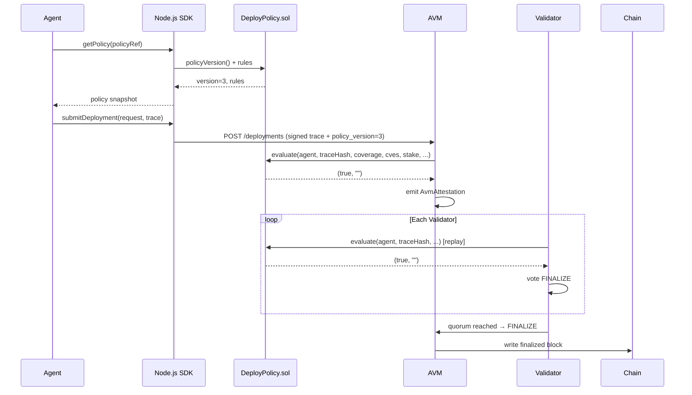

# Deployment Contract — Technical Specification

## Overview

Deployment Contracts are on-chain smart contracts written in **Solidity** that encode deployment policy rules. This specification covers the contract structure, how agents query contracts, and how validators check policy compliance.

**Language**: Solidity ^0.8.20  
**Network**: MaatProof L1 (EVM-compatible)  
**Standard**: MaatProof Deployment Contract Interface v1  

---

## Contract Structure

### State Variables

```solidity
struct PolicyRules {
    bool    noFridayDeploys;
    bool    requireHumanApproval;
    uint8   minTestCoverage;        // 0-100 (percent)
    uint8   maxCriticalCves;
    uint256 minAgentStake;          // in $MAAT (wei)
    uint8   deployWindowStart;      // UTC hour (0-23)
    uint8   deployWindowEnd;        // UTC hour (0-23)
    string[] allowedEnvironments;  // ["staging", "production"]
    address[] requiredApprovers;   // human approver addresses
}

PolicyRules public rules;
uint256 public policyVersion;       // incremented on each update
address public policyOwner;
bool    public active;              // inactive contracts reject all
```

### Events

```solidity
event PolicyUpdated(uint256 indexed version, address updatedBy, uint256 timestamp);
event PolicyEvaluated(
    address indexed agent,
    bytes32 indexed traceHash,
    bool    passed,
    string  failReason,
    uint256 policyVersion
);
event PolicyDeactivated(address deactivatedBy);
```

---

## Agent Interaction

Agents query the contract before submitting a deployment request:

```javascript
// Node.js SDK
const policy = await maatProof.getPolicy(policyRef);
const deployRequest = {
  policy_ref: policyRef,
  policy_version: policy.version,   // must match at submission time
  agent_id: agentDid,
  artifact_hash: sha256(artifact),
  deploy_environment: 'production',
  human_approval_ref: approvalTxHash,
  trace: serializedTrace,
};
await maatProof.submitDeployment(deployRequest);
```

If the policy version changes between agent query and validator evaluation, the deployment is rejected with `POLICY_VERSION_MISMATCH`.

---

## Validator Policy Check

Validators call `evaluate()` during PoD consensus:

```solidity
function evaluate(
    address agent,
    bytes32 traceHash,
    uint8   testCoverage,
    uint8   criticalCves,
    uint256 agentStake,
    bool    humanApprovalPresent,
    uint8   deployHourUtc,
    uint8   deployDayOfWeek,
    string  calldata environment
) external returns (bool passed, string memory failReason);
```

The function is `external` (not `view`) because it emits the `PolicyEvaluated` event — this creates an on-chain record of every policy evaluation.

---

## Example Solidity Contract

```solidity
// SPDX-License-Identifier: MIT
pragma solidity ^0.8.20;

interface IDeployPolicy {
    function evaluate(
        address agent,
        bytes32 traceHash,
        uint8   testCoverage,
        uint8   criticalCves,
        uint256 agentStake,
        bool    humanApprovalPresent,
        uint8   deployHourUtc,
        uint8   deployDayOfWeek,
        string  calldata environment
    ) external returns (bool passed, string memory failReason);

    function policyVersion() external view returns (uint256);
    function active() external view returns (bool);
}

contract DeployPolicy is IDeployPolicy {
    struct PolicyRules {
        bool    noFridayDeploys;
        bool    requireHumanApproval;
        uint8   minTestCoverage;
        uint8   maxCriticalCves;
        uint256 minAgentStake;
        uint8   deployWindowStart;
        uint8   deployWindowEnd;
    }

    PolicyRules public rules;
    uint256 public policyVersion;
    address public policyOwner;
    bool    public active;

    event PolicyUpdated(uint256 indexed version, address updatedBy, uint256 timestamp);
    event PolicyEvaluated(
        address indexed agent,
        bytes32 indexed traceHash,
        bool    passed,
        string  failReason,
        uint256 policyVersion
    );

    constructor(PolicyRules memory _rules) {
        rules = _rules;
        policyVersion = 1;
        policyOwner = msg.sender;
        active = true;
    }

    function evaluate(
        address agent,
        bytes32 traceHash,
        uint8   testCoverage,
        uint8   criticalCves,
        uint256 agentStake,
        bool    humanApprovalPresent,
        uint8   deployHourUtc,
        uint8   deployDayOfWeek,
        string  calldata /*environment*/
    ) external override returns (bool passed, string memory failReason) {
        require(active, "Policy is deactivated");

        if (rules.noFridayDeploys && deployDayOfWeek == 5) {
            emit PolicyEvaluated(agent, traceHash, false, "NO_FRIDAY_DEPLOYS", policyVersion);
            return (false, "NO_FRIDAY_DEPLOYS");
        }
        if (rules.requireHumanApproval && !humanApprovalPresent) {
            emit PolicyEvaluated(agent, traceHash, false, "HUMAN_APPROVAL_REQUIRED", policyVersion);
            return (false, "HUMAN_APPROVAL_REQUIRED");
        }
        if (testCoverage < rules.minTestCoverage) {
            emit PolicyEvaluated(agent, traceHash, false, "INSUFFICIENT_TEST_COVERAGE", policyVersion);
            return (false, "INSUFFICIENT_TEST_COVERAGE");
        }
        if (criticalCves > rules.maxCriticalCves) {
            emit PolicyEvaluated(agent, traceHash, false, "CRITICAL_CVE_FOUND", policyVersion);
            return (false, "CRITICAL_CVE_FOUND");
        }
        if (agentStake < rules.minAgentStake) {
            emit PolicyEvaluated(agent, traceHash, false, "INSUFFICIENT_AGENT_STAKE", policyVersion);
            return (false, "INSUFFICIENT_AGENT_STAKE");
        }
        if (deployHourUtc < rules.deployWindowStart || deployHourUtc >= rules.deployWindowEnd) {
            emit PolicyEvaluated(agent, traceHash, false, "OUTSIDE_DEPLOY_WINDOW", policyVersion);
            return (false, "OUTSIDE_DEPLOY_WINDOW");
        }

        emit PolicyEvaluated(agent, traceHash, true, "", policyVersion);
        return (true, "");
    }

    function updatePolicy(PolicyRules memory _rules) external onlyOwner {
        rules = _rules;
        policyVersion++;
        emit PolicyUpdated(policyVersion, msg.sender, block.timestamp);
    }

    function deactivate() external onlyOwner {
        active = false;
    }

    modifier onlyOwner() {
        require(msg.sender == policyOwner, "Not policy owner");
        _;
    }
}
```

---

## Interaction Diagram


