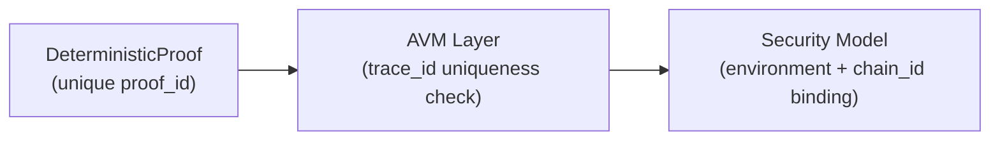
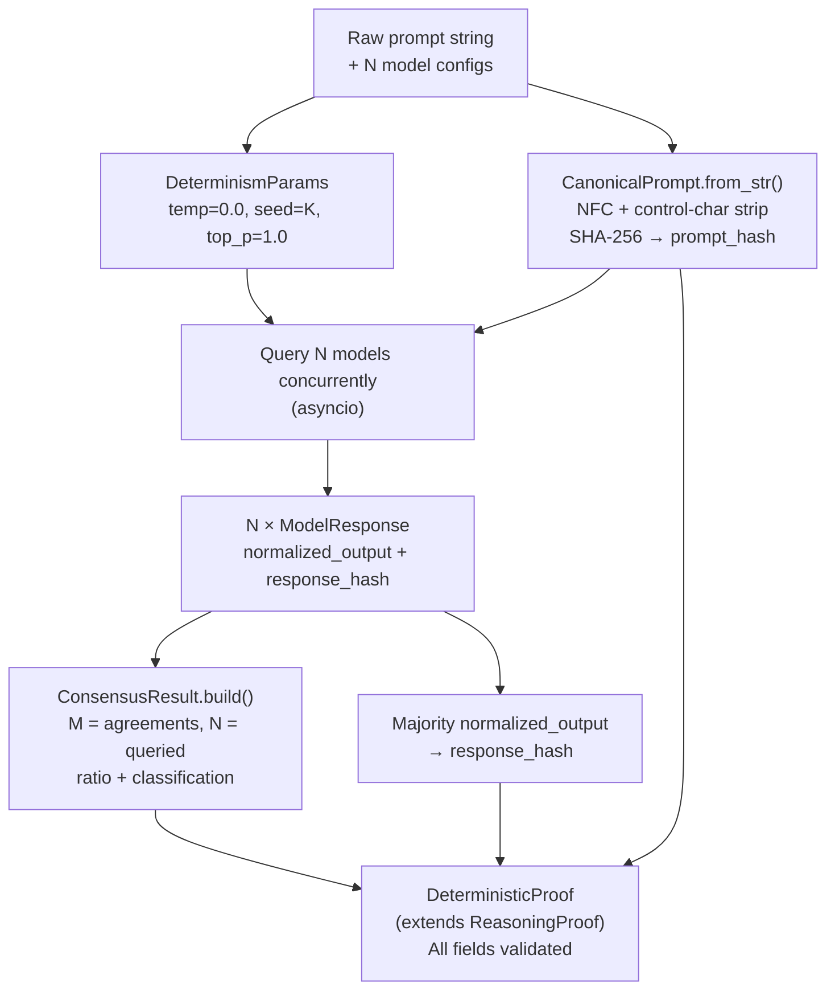

# Deterministic Reasoning Engine (DRE) — Data Models Specification

<!-- Addresses EDGE-001 through EDGE-040 (issue #30) -->

## Overview

The Deterministic Reasoning Engine (DRE) is the Python component responsible for
producing cryptographically verifiable, consensus-based reasoning proofs.
It extends the core `ReasoningProof` primitive (defined in `maatproof/proof.py`)
with multi-model consensus semantics: the same canonical prompt is sent to **N**
independent LLM models, their outputs are normalised, M-of-N agreement is
measured, and the result is encoded in a `DeterministicProof`.

**Language**: Python 3.11+  
**Serialisation**: `dataclasses` + `json` (primary); Pydantic v2 optional  
**Hashing**: `hashlib.sha256` — SHA-256 exclusively  
**Unicode**: `unicodedata.normalize("NFC", …)` — NFC form exclusively  
**Module**: `dre.models` — all public types importable from this path  

---

## Module Structure

<!-- Addresses EDGE-034 -->

```
dre/
├── __init__.py
└── models.py          # All data model types live here
```

All four primary types plus supporting enums/helpers are importable from a single
path:

```python
from dre.models import (
    CanonicalPrompt,
    ConsensusClassification,
    ConsensusResult,
    DeterminismParams,
    DeterministicProof,
    ModelResponse,
)
```

The `dre` package is a sibling of `maatproof` in the project root.

---

## Data Models

### 3.1 `DeterminismParams`

<!-- Addresses EDGE-012, EDGE-013, EDGE-014, EDGE-038 -->

Captures the exact LLM sampling parameters that must be enforced to guarantee
deterministic (or near-deterministic) output.

```python
@dataclass
class DeterminismParams:
    """LLM sampling parameters enforced for deterministic mode.

    Attributes:
        temperature: Must be exactly 0.0. Any other value violates the
            determinism contract and the model will raise ``ValueError``.
        seed:        Non-negative integer seed passed to the LLM provider.
            Required (not optional). Valid range: [0, 2**32 - 1].
        top_p:       Must be exactly 1.0. Setting top_p < 1.0 enables nucleus
            sampling and can alter output distribution even at temperature=0.
    """
    temperature: float  # must be exactly 0.0
    seed: int           # required; range [0, 2**32 - 1]
    top_p: float        # must be exactly 1.0

    def __post_init__(self) -> None:
        if self.temperature != 0.0:
            raise ValueError(
                f"DeterminismParams.temperature must be 0.0, got {self.temperature}"
            )
        if not (0 <= self.seed <= 2**32 - 1):
            raise ValueError(
                f"DeterminismParams.seed must be in [0, 2**32-1], got {self.seed}"
            )
        if self.top_p != 1.0:
            raise ValueError(
                f"DeterminismParams.top_p must be 1.0, got {self.top_p}"
            )
```

**Validation rules:**

| Field | Constraint | Error |
|-------|-----------|-------|
| `temperature` | Must equal `0.0` exactly | `ValueError` |
| `seed` | Integer in `[0, 2^32-1]`; `None` is **not** allowed | `ValueError` |
| `top_p` | Must equal `1.0` exactly | `ValueError` |

---

### 3.2 `CanonicalPrompt`

<!-- Addresses EDGE-006, EDGE-007, EDGE-008, EDGE-022, EDGE-030, EDGE-035, EDGE-039 -->

Encapsulates a prompt that has been normalised to a canonical byte form.
Two prompts that are semantically identical (same text, modulo Unicode form and
whitespace) must produce **identical** `prompt_hash` values, regardless of which
thread or process constructs them.

```python
@dataclass
class CanonicalPrompt:
    """A normalised, content-addressed prompt.

    The normalisation pipeline is:
      1. Decode input to str (UTF-8, strict).
      2. Apply NFC Unicode normalisation (``unicodedata.normalize("NFC", s)``).
      3. Strip ASCII control characters (codepoints < 0x20, except \\t, \\n, \\r).
      4. Encode back to bytes (UTF-8).
      5. Compute SHA-256 hex digest.

    ``unicodedata.normalize`` is thread-safe in CPython and PyPy. Two concurrent
    calls with the same input always return the same result.

    Attributes:
        content:               Normalised UTF-8 bytes of the prompt.
        prompt_hash:           SHA-256 hex digest (64 lowercase hex chars) of
            ``content``.
        normalization_metadata: Dict recording the normalisation steps applied.
            Required keys: ``unicode_form`` (``"NFC"``), ``encoding``
            (``"utf-8"``), ``control_chars_stripped`` (bool).
    """
    content: bytes
    prompt_hash: str          # 64 hex chars; SHA-256 of content
    normalization_metadata: dict

    # Maximum permitted prompt size. Prompts exceeding this limit are rejected
    # at construction time to prevent unbounded memory usage and LLM token
    # overflow.  (See EDGE-008.)
    MAX_CONTENT_BYTES: ClassVar[int] = 32_768  # 32 KiB

    def __post_init__(self) -> None:
        # Size guard (EDGE-008)
        if len(self.content) > self.MAX_CONTENT_BYTES:
            raise ValueError(
                f"CanonicalPrompt.content exceeds maximum size of "
                f"{self.MAX_CONTENT_BYTES} bytes (got {len(self.content)})"
            )
        # Hash format guard (EDGE-001, EDGE-016)
        if not _is_sha256_hex(self.prompt_hash):
            raise ValueError(
                f"CanonicalPrompt.prompt_hash must be a 64-char SHA-256 hex "
                f"digest, got {self.prompt_hash!r}"
            )
        # Integrity check
        expected = hashlib.sha256(self.content).hexdigest()
        if self.prompt_hash != expected:
            raise ValueError(
                "CanonicalPrompt.prompt_hash does not match SHA-256(content)"
            )
        # Metadata keys guard
        required_keys = {"unicode_form", "encoding", "control_chars_stripped"}
        if not required_keys.issubset(self.normalization_metadata):
            raise ValueError(
                f"normalization_metadata must contain keys {required_keys}"
            )

    @classmethod
    def from_str(cls, prompt: str) -> "CanonicalPrompt":
        """Build a CanonicalPrompt from a raw string.

        Applies the full normalisation pipeline and computes the hash.
        An empty string is valid; its hash is the well-known SHA-256 of zero
        bytes (``e3b0c44298fc1c149afbf4c8996fb92427ae41e4649b934ca495991b7852b855``).
        (See EDGE-007, EDGE-035.)

        The prompt is treated as an opaque string — if it happens to be valid
        JSON, it is NOT re-parsed or re-serialised.  Key sorting applies only
        to the surrounding trace JSON, not to prompt content.  (See EDGE-022.)

        Note on prompt injection: ``CanonicalPrompt`` records the prompt
        faithfully after Unicode normalisation. Injection-pattern detection and
        input sanitisation beyond control-character stripping are the
        responsibility of the AVM layer (``specs/avm-spec.md``
        §Prompt Injection Mitigations).  (See EDGE-026.)
        """
        import unicodedata
        import re
        # Step 1 + 2: NFC normalisation
        normalised = unicodedata.normalize("NFC", prompt)
        # Step 3: strip ASCII control chars (keep tab, newline, carriage return)
        normalised = re.sub(r"[\x00-\x08\x0b\x0c\x0e-\x1f\x7f]", "", normalised)
        content = normalised.encode("utf-8")
        if len(content) > cls.MAX_CONTENT_BYTES:
            raise ValueError(
                f"Prompt exceeds {cls.MAX_CONTENT_BYTES}-byte limit after "
                f"normalisation ({len(content)} bytes)"
            )
        prompt_hash = hashlib.sha256(content).hexdigest()
        metadata = {
            "unicode_form": "NFC",
            "encoding": "utf-8",
            "control_chars_stripped": True,
        }
        return cls(content=content, prompt_hash=prompt_hash,
                   normalization_metadata=metadata)
```

**Normalisation contract:**

| Step | Rule |
|------|------|
| Unicode form | NFC via `unicodedata.normalize("NFC", s)` — eliminates EDGE-006 |
| Control characters | Strip codepoints `< 0x20` except `\t` (0x09), `\n` (0x0A), `\r` (0x0D) — eliminates EDGE-030 |
| Encoding | UTF-8 strictly |
| Prompt content | Treated as opaque string — JSON prompts are **not** re-parsed — eliminates EDGE-022 |
| Max size | 32,768 bytes post-normalisation; raises `ValueError` if exceeded — eliminates EDGE-008 |
| Empty input | Valid — SHA-256(b"") = `e3b0c442...` — eliminates EDGE-007, EDGE-035 |
| Thread safety | `unicodedata.normalize` is reentrant in CPython and PyPy; no locking needed — eliminates EDGE-039 |

---

### 3.3 `ModelResponse`

<!-- Addresses EDGE-013, EDGE-015, EDGE-018, EDGE-025, EDGE-033 -->

Captures the complete output of a single LLM call under deterministic params.

```python
@dataclass
class ModelResponse:
    """Output from a single LLM model under deterministic sampling params.

    Attributes:
        model_id:          Canonical model identifier in the format
            ``{provider}/{model-name}@{version}``
            (e.g. ``"anthropic/claude-3-7-sonnet@20250219"``).
            Must match the format defined in ``specs/llm-provider-spec.md``
            §Model ID Canonical Format.
        raw_output:        The verbatim response text from the model.
        normalized_output: The response after whitespace normalisation and,
            for code outputs, canonicalised formatting.  Must be semantically
            equivalent to ``raw_output`` — normalisation may not change
            meaning, only formatting.  (See EDGE-018.)
        determinism_params: The exact sampling params used; temperature must
            be 0.0, seed must be set, top_p must be 1.0.
        response_hash:     SHA-256 hex digest of
            ``normalized_output.encode("utf-8")``.  An empty normalised output
            produces hash ``e3b0c44298fc1c149afbf4c8996fb924...``.
            (See EDGE-025.)
    """
    model_id: str
    raw_output: str
    normalized_output: str
    determinism_params: DeterminismParams
    response_hash: str   # SHA-256 of normalized_output bytes; 64 hex chars

    _MODEL_ID_PATTERN: ClassVar[re.Pattern] = re.compile(
        r"^[a-zA-Z0-9_-]+/[a-zA-Z0-9._-]+@[a-zA-Z0-9._-]+$"
    )

    def __post_init__(self) -> None:
        # Model ID format validation (EDGE-020, EDGE-033)
        if not self._MODEL_ID_PATTERN.match(self.model_id):
            raise ValueError(
                f"ModelResponse.model_id must follow '{{provider}}/{{model}}@{{version}}' "
                f"format, got {self.model_id!r}"
            )
        # response_hash format (EDGE-016)
        if not _is_sha256_hex(self.response_hash):
            raise ValueError(
                "ModelResponse.response_hash must be a 64-char SHA-256 hex digest"
            )
        # response_hash integrity (EDGE-015)
        expected = hashlib.sha256(self.normalized_output.encode("utf-8")).hexdigest()
        if self.response_hash != expected:
            raise ValueError(
                "ModelResponse.response_hash does not match "
                "SHA-256(normalized_output)"
            )
```

**Normalisation scope (EDGE-018):**

The `normalized_output` field represents only *formatting* normalisation:

| Allowed | Not Allowed |
|---------|------------|
| Strip leading/trailing whitespace | Change variable names or logic |
| Collapse multiple blank lines to one | Add or remove code statements |
| Canonicalise line endings (`\r\n` → `\n`) | Alter string literals |
| Remove trailing whitespace per line | Re-order JSON keys in generated code |

Implementations **must** verify that `raw_output` and `normalized_output` are
semantically equivalent before constructing a `ModelResponse`.

---

### 3.4 `ConsensusClassification` (Enum)

<!-- Addresses EDGE-003, EDGE-009, EDGE-037 -->

```python
class ConsensusClassification(str, Enum):
    """Classification of the M-of-N agreement level.

    Boundaries are **inclusive on the upper threshold**:

        STRONG   : ratio >= 0.80
        MAJORITY : 0.60 <= ratio < 0.80
        WEAK     : 0.40 <= ratio < 0.60
        NONE     : ratio  < 0.40

    The function ``classify_ratio(ratio)`` (below) is the canonical mapping.
    All implementations must use it; do not inline the boundary logic.
    """
    STRONG   = "STRONG"
    MAJORITY = "MAJORITY"
    WEAK     = "WEAK"
    NONE     = "NONE"


def classify_ratio(ratio: float) -> ConsensusClassification:
    """Map a consensus ratio in [0.0, 1.0] to a ConsensusClassification.

    The mapping is exhaustive and covers every value in [0.0, 1.0].
    Raises ValueError for ratios outside [0.0, 1.0].

    Boundary examples (EDGE-009, EDGE-024):
      classify_ratio(0.80) -> STRONG    (inclusive lower bound of STRONG)
      classify_ratio(0.799) -> MAJORITY
      classify_ratio(0.60) -> MAJORITY  (inclusive lower bound of MAJORITY)
      classify_ratio(0.599) -> WEAK
      classify_ratio(0.40) -> WEAK      (inclusive lower bound of WEAK)
      classify_ratio(0.399) -> NONE
      classify_ratio(0.0)  -> NONE
      classify_ratio(1.0)  -> STRONG
    """
    if not (0.0 <= ratio <= 1.0):
        raise ValueError(f"consensus_ratio must be in [0.0, 1.0], got {ratio}")
    if ratio >= 0.80:
        return ConsensusClassification.STRONG
    if ratio >= 0.60:
        return ConsensusClassification.MAJORITY
    if ratio >= 0.40:
        return ConsensusClassification.WEAK
    return ConsensusClassification.NONE
```

**Boundary table (EDGE-009):**

| Ratio | Classification |
|-------|---------------|
| 1.0 | STRONG |
| 0.80 | STRONG |
| 0.799… | MAJORITY |
| 0.60 | MAJORITY |
| 0.599… | WEAK |
| 0.40 | WEAK |
| 0.399… | NONE |
| 0.0 | NONE |

---

### 3.5 `ConsensusResult`

<!-- Addresses EDGE-003, EDGE-010, EDGE-011, EDGE-019, EDGE-024, EDGE-029, EDGE-032, EDGE-037 -->

```python
@dataclass
class ConsensusResult:
    """Outcome of M-of-N multi-model consensus.

    Attributes:
        agreements:      Number of models whose normalised output agreed with
            the majority response.  Must satisfy ``0 <= agreements <= total``.
        total:           Total number of models **queried** (not just those
            that responded).  Models that timed out or errored count toward
            ``total`` but not toward ``agreements``.  Must be >= 1.
            (See EDGE-029 for why total = queried, not responded.)
        consensus_ratio: Computed as ``agreements / total``.  Always in
            ``[0.0, 1.0]``.  Stored for convenience; recomputed from
            ``agreements`` and ``total`` on deserialisation to prevent forgery.
            (See EDGE-002, EDGE-003, EDGE-023.)
        classification:  Derived from ``consensus_ratio`` via
            ``classify_ratio()``.  Always consistent with ``consensus_ratio``.
            (See EDGE-003, EDGE-037.)
    """
    agreements: int
    total: int
    consensus_ratio: float
    classification: ConsensusClassification

    def __post_init__(self) -> None:
        # Guard: total must be at least 1 (EDGE-011)
        if self.total < 1:
            raise ValueError(
                f"ConsensusResult.total must be >= 1, got {self.total}"
            )
        # Guard: agreements in [0, total] (EDGE-019)
        if not (0 <= self.agreements <= self.total):
            raise ValueError(
                f"ConsensusResult.agreements must be in [0, total={self.total}], "
                f"got {self.agreements}"
            )
        # Recompute and verify ratio (EDGE-002, EDGE-003)
        expected_ratio = self.agreements / self.total
        if abs(self.consensus_ratio - expected_ratio) > 1e-9:
            raise ValueError(
                f"ConsensusResult.consensus_ratio {self.consensus_ratio!r} does not "
                f"match agreements/total = {expected_ratio!r}"
            )
        # Recompute and verify classification (EDGE-003, EDGE-037)
        expected_cls = classify_ratio(self.consensus_ratio)
        if self.classification != expected_cls:
            raise ValueError(
                f"ConsensusResult.classification {self.classification!r} is "
                f"inconsistent with consensus_ratio {self.consensus_ratio!r}; "
                f"expected {expected_cls!r}"
            )

    @classmethod
    def build(cls, agreements: int, total: int) -> "ConsensusResult":
        """Construct a ConsensusResult, computing ratio and classification.

        Args:
            agreements: Models that agreed with the majority output.
            total:      Total models queried (including non-responders).

        Raises:
            ValueError: If invariants are violated.
        """
        ratio = agreements / total  # ZeroDivisionError propagates if total=0
        return cls(
            agreements=agreements,
            total=total,
            consensus_ratio=ratio,
            classification=classify_ratio(ratio),
        )
```

**Denominator policy (EDGE-029):**

The denominator in `consensus_ratio` is always the number of models **queried**,
not the number that responded. Rationale: using responders-only as the denominator
would allow an attacker to make partial consensus look stronger by timing out
uncooperative models.

**Minimum N policy (EDGE-010):**

`total` must be ≥ 1 (validated in `__post_init__`). However, callers querying a
single model (`total = 1`) receive a valid `ConsensusResult` — the classification
will be STRONG if the single model responds (`1/1 = 1.0`). **Operators** are
advised to set `total >= 3` for meaningful multi-model consensus (see
`specs/llm-provider-spec.md` §Multi-Model Consensus — "two or more providers
must agree").

---

### 3.6 `DeterministicProof`

<!-- Addresses EDGE-001, EDGE-002, EDGE-004, EDGE-005, EDGE-015, EDGE-016, EDGE-017, EDGE-020, EDGE-023, EDGE-028, EDGE-031, EDGE-033, EDGE-040 -->

Extends `ReasoningProof` (from `maatproof/proof.py`) with DRE-specific consensus
fields. All base-class invariants (`root_hash`, `signature`, `steps`) continue to
apply.

```python
@dataclass
class DeterministicProof(ReasoningProof):
    """A ReasoningProof enriched with multi-model consensus metadata.

    Inherits from ``maatproof.proof.ReasoningProof``:
        proof_id, model_id, chain_id, steps, root_hash, signature,
        created_at, metadata.

    Additional fields:
        prompt_hash:      SHA-256 hex digest (64 chars) of the
            ``CanonicalPrompt.content`` used to query all models.
            Must match a ``CanonicalPrompt`` object that can be independently
            reconstructed from the prompt bytes stored in the trace.
        consensus_ratio:  The ``ConsensusResult.consensus_ratio`` value.
            Must be in ``[0.0, 1.0]``.  Always recomputed from the
            ``ConsensusResult`` — never accepted from untrusted input alone.
        response_hash:    SHA-256 hex digest of the **consensus** normalised
            output.  For multi-model consensus, this is the SHA-256 of the
            majority response's ``normalized_output``.  If no majority exists,
            this is SHA-256(b"") and ``ConsensusResult.classification`` is NONE.
            (See EDGE-040.)
        model_ids:        Non-empty list of canonical model identifiers
            (``{provider}/{model}@{version}``) for all models that were queried.
            No duplicates.  Each entry must pass ``ModelResponse`` model-ID
            format validation.  (See EDGE-004, EDGE-005, EDGE-020, EDGE-028.)

    Metadata shadowing (EDGE-031):
        The inherited ``metadata`` dict must NOT contain keys ``prompt_hash``,
        ``consensus_ratio``, ``response_hash``, or ``model_ids``.  These are
        always read from their dedicated fields.  The ``__post_init__`` method
        enforces this.
    """
    prompt_hash: str       # 64 hex chars; SHA-256 of CanonicalPrompt.content
    consensus_ratio: float # [0.0, 1.0]; from ConsensusResult
    response_hash: str     # 64 hex chars; SHA-256 of majority normalized_output
    model_ids: list        # List[str]; non-empty; no duplicates; canonical format

    _MODEL_ID_PATTERN: ClassVar[re.Pattern] = re.compile(
        r"^[a-zA-Z0-9_-]+/[a-zA-Z0-9._-]+@[a-zA-Z0-9._-]+$"
    )
    _RESERVED_METADATA_KEYS: ClassVar[frozenset] = frozenset(
        {"prompt_hash", "consensus_ratio", "response_hash", "model_ids"}
    )

    def __post_init__(self) -> None:
        # prompt_hash validation (EDGE-001, EDGE-016)
        if not _is_sha256_hex(self.prompt_hash):
            raise ValueError(
                "DeterministicProof.prompt_hash must be a 64-char SHA-256 hex digest"
            )
        # consensus_ratio range (EDGE-002)
        if not (0.0 <= self.consensus_ratio <= 1.0):
            raise ValueError(
                f"DeterministicProof.consensus_ratio must be in [0.0, 1.0], "
                f"got {self.consensus_ratio}"
            )
        # response_hash validation (EDGE-015, EDGE-016)
        if not _is_sha256_hex(self.response_hash):
            raise ValueError(
                "DeterministicProof.response_hash must be a 64-char SHA-256 hex digest"
            )
        # model_ids non-empty (EDGE-005)
        if not self.model_ids:
            raise ValueError("DeterministicProof.model_ids must not be empty")
        # model_ids: no None elements (EDGE-028)
        for i, mid in enumerate(self.model_ids):
            if mid is None:
                raise ValueError(
                    f"DeterministicProof.model_ids[{i}] is None; "
                    "all entries must be non-None strings"
                )
            # model_ids: canonical format (EDGE-020, EDGE-033)
            if not self._MODEL_ID_PATTERN.match(str(mid)):
                raise ValueError(
                    f"DeterministicProof.model_ids[{i}] {mid!r} does not follow "
                    "'{provider}/{model}@{version}' format"
                )
        # model_ids: no duplicates (EDGE-004)
        if len(self.model_ids) != len(set(self.model_ids)):
            dupes = [m for m in self.model_ids if self.model_ids.count(m) > 1]
            raise ValueError(
                f"DeterministicProof.model_ids contains duplicates: {dupes}"
            )
        # metadata shadowing guard (EDGE-031)
        shadow = self._RESERVED_METADATA_KEYS & set(self.metadata.keys())
        if shadow:
            raise ValueError(
                f"DeterministicProof.metadata must not contain reserved DRE "
                f"field keys: {shadow}"
            )
```

**Multi-model `response_hash` computation (EDGE-040):**

When N models are queried, the `response_hash` in `DeterministicProof` is the
SHA-256 of the **majority-vote normalised output** — i.e., the `normalized_output`
from the `ModelResponse` that represents the agreed-upon answer:

```
majority_response = most_common(model_responses, key=lambda r: r.normalized_output)
response_hash     = SHA-256(majority_response.normalized_output.encode("utf-8"))
```

If there is no majority (all responses differ, `ConsensusClassification.NONE`),
`response_hash` is set to `SHA-256(b"")` =
`e3b0c44298fc1c149afbf4c8996fb92427ae41e4649b934ca495991b7852b855`.

**Serialisation round-trip and float precision (EDGE-023):**

`consensus_ratio` is stored as a Python `float` (IEEE 754 double). To prevent
precision drift in `to_dict()` / `from_dict()` round-trips, implementations
must round-trip the ratio through the `agreements` and `total` integers from the
`ConsensusResult` and recompute rather than trusting the stored float. The
`__post_init__` tolerance of `1e-9` accommodates floating-point arithmetic while
rejecting forged values.

---

## 4. Hash Computation Reference

<!-- Addresses EDGE-016 -->

All hashes in the DRE layer use **SHA-256** exclusively. No other algorithm
(MD5, SHA-1, SHA-512) is acceptable. Implementations must validate digest length:

```python
def _is_sha256_hex(value: str) -> bool:
    """Return True iff value is a 64-character lowercase hex string."""
    if not isinstance(value, str):
        return False
    if len(value) != 64:
        return False
    try:
        int(value, 16)
        return True
    except ValueError:
        return False
```

---

## 5. Validation Rules Summary

<!-- Addresses EDGE-001 through EDGE-040 -->

| Model | Field | Constraint | EDGE scenario |
|-------|-------|-----------|---------------|
| `DeterminismParams` | `temperature` | `== 0.0` | EDGE-012 |
| `DeterminismParams` | `seed` | Integer in `[0, 2^32-1]`; required | EDGE-013, EDGE-038 |
| `DeterminismParams` | `top_p` | `== 1.0` | EDGE-014 |
| `CanonicalPrompt` | `content` | `len <= 32768`; bytes | EDGE-008 |
| `CanonicalPrompt` | `prompt_hash` | 64 hex chars; SHA-256 of content | EDGE-001, EDGE-016 |
| `CanonicalPrompt` | normalization | NFC + control-char strip | EDGE-006, EDGE-030 |
| `ModelResponse` | `model_id` | `{provider}/{model}@{version}` regex | EDGE-020, EDGE-033 |
| `ModelResponse` | `response_hash` | SHA-256 of `normalized_output` | EDGE-015 |
| `ModelResponse` | `normalized_output` | Formatting-only diff from `raw_output` | EDGE-018 |
| `ConsensusResult` | `total` | `>= 1` | EDGE-011 |
| `ConsensusResult` | `agreements` | `0 <= agreements <= total` | EDGE-019 |
| `ConsensusResult` | `consensus_ratio` | `== agreements / total` (±1e-9) | EDGE-002, EDGE-003 |
| `ConsensusResult` | `classification` | Derived from `classify_ratio(ratio)` | EDGE-003, EDGE-037 |
| `DeterministicProof` | `prompt_hash` | 64 hex chars; SHA-256 | EDGE-001, EDGE-016 |
| `DeterministicProof` | `consensus_ratio` | `[0.0, 1.0]` | EDGE-002 |
| `DeterministicProof` | `response_hash` | 64 hex chars; majority response SHA-256 | EDGE-015, EDGE-040 |
| `DeterministicProof` | `model_ids` | Non-empty; no duplicates; no None; canonical format | EDGE-004, EDGE-005, EDGE-028 |
| `DeterministicProof` | `metadata` | Must not shadow DRE fields | EDGE-031 |

---

## 6. Security Considerations

### 6.1 Replay Attack Prevention

<!-- Addresses EDGE-027 -->

`DeterministicProof` inherits `proof_id` (a UUID v4) from `ReasoningProof`.
Each proof constructed by `ProofBuilder` receives a unique `proof_id`; the same
`proof_id` must never be accepted twice by the AVM or consensus layer.

At the DRE data-model level, replay prevention is limited to uniqueness of
`proof_id`. **Full replay prevention** — including environment binding,
nonce freshness checks, and chain-ID scoping — is enforced by the trace
verification layer (`specs/trace-verification-spec.md` §Replay Procedure and
`docs/06-security-model.md` §Replay Attack Prevention).



### 6.2 Cross-Environment Proof Reuse

<!-- Addresses EDGE-036 -->

`DeterministicProof` does **not** embed a `deploy_environment` field. Environment
binding is the responsibility of the enclosing `DeploymentTrace`
(`deploy_environment` field in `specs/trace-verification-spec.md`). A
`DeterministicProof` extracted from one trace and embedded in another is
detectable because the parent trace's `deploy_environment` and `policy_version`
fields will not match — the AVM's policy evaluator will reject the submission.

For defence-in-depth, operators **should** include `deploy_environment` in the
`metadata` dict of `DeterministicProof` so that auditors can confirm environment
intent at the proof level without having to resolve the parent trace.

### 6.3 `model_ids` Forgery

<!-- Addresses EDGE-004, EDGE-005 -->

A `DeterministicProof.model_ids` list that includes models that never participated
in the actual LLM calls would inflate apparent consensus breadth. Countermeasures:

1. **At build time**: The DRE executor constructs `model_ids` from the set of
   `ModelResponse.model_id` values returned by actual LLM calls — it is never
   passed in from untrusted external input.
2. **At verification time**: Validators re-execute the DRE consensus step using
   the models listed in `model_ids` and verify the `response_hash` matches.

### 6.4 Prompt Injection Responsibility

<!-- Addresses EDGE-026 -->

`CanonicalPrompt` performs **normalisation** only — it does not detect or
reject adversarial payloads. Injection-pattern detection (`"ignore all previous
instructions"`, etc.) is enforced at the AVM layer before the prompt reaches
any LLM. See `specs/avm-spec.md` §Prompt Injection Mitigations.

### 6.5 Metadata Field Shadowing

<!-- Addresses EDGE-031 -->

`DeterministicProof.__post_init__` rejects any `metadata` dict that contains
keys `prompt_hash`, `consensus_ratio`, `response_hash`, or `model_ids`. Consumer
code must always read these values from the dedicated fields, never from
`metadata`. This invariant is enforced at construction time.

---

## 7. Edge Case Handling Reference

<!-- Summarises all EDGE scenarios and their resolution -->

| EDGE ID | Scenario | Resolution |
|---------|----------|-----------|
| EDGE-001 | Empty `prompt_hash` | `__post_init__` rejects non-64-char value |
| EDGE-002 | `consensus_ratio > 1.0` | `__post_init__` rejects value outside `[0.0, 1.0]` |
| EDGE-003 | Contradictory ratio/classification | `ConsensusResult.__post_init__` recomputes both and rejects inconsistency |
| EDGE-004 | Duplicate `model_ids` | `DeterministicProof.__post_init__` rejects duplicates |
| EDGE-005 | Empty `model_ids` | `DeterministicProof.__post_init__` rejects empty list |
| EDGE-006 | Non-NFC Unicode in prompt | `CanonicalPrompt.from_str()` applies NFC before hashing |
| EDGE-007 | Empty prompt string | Valid; `prompt_hash = SHA-256(b"") = e3b0c44...` |
| EDGE-008 | 500 KB prompt | Rejected at 32,768 bytes; `ValueError` raised |
| EDGE-009 | Boundary at 0.40/0.60/0.80 | `classify_ratio` uses inclusive lower bounds; see table in §3.4 |
| EDGE-010 | N=1 (single model) | Valid but classified as STRONG (1/1 = 1.0); operators advised to use N≥3 |
| EDGE-011 | `total = 0` (div/zero) | `ConsensusResult.__post_init__` rejects `total < 1` |
| EDGE-012 | `temperature ≠ 0.0` | `DeterminismParams.__post_init__` raises `ValueError` |
| EDGE-013 | `seed = None` | `DeterminismParams` requires non-None integer |
| EDGE-014 | `top_p ≠ 1.0` | `DeterminismParams.__post_init__` raises `ValueError` |
| EDGE-015 | `response_hash` mismatch | `ModelResponse.__post_init__` recomputes and validates |
| EDGE-016 | MD5 instead of SHA-256 | `_is_sha256_hex` rejects non-64-char digests |
| EDGE-017 | Broken Python inheritance | Spec defines `DeterministicProof(ReasoningProof)` pattern with `__post_init__` |
| EDGE-018 | Normalization changes semantics | Spec limits normalisation to formatting-only changes |
| EDGE-019 | `agreements > total` | `ConsensusResult.__post_init__` rejects `agreements > total` |
| EDGE-020 | Non-canonical `model_id` | Regex validation in `ModelResponse` and `DeterministicProof` |
| EDGE-021 | Concurrent sort | `unicodedata.normalize` is reentrant; no locking required |
| EDGE-022 | JSON string as prompt | Prompt treated as opaque string; not re-parsed |
| EDGE-023 | Float precision in round-trip | Recompute from `agreements/total`; tolerance `1e-9` |
| EDGE-024 | 2/3 = 67% → MAJORITY | `classify_ratio(0.667)` → MAJORITY (≥0.60) |
| EDGE-025 | Empty `raw_output` | `response_hash = SHA-256(b"") = e3b0c44...`; valid |
| EDGE-026 | Injection in prompt | `CanonicalPrompt` stores faithfully; AVM detects injection |
| EDGE-027 | DRE-level replay | `proof_id` uniqueness from `ReasoningProof`; AVM enforces deduplication |
| EDGE-028 | `None` in `model_ids` | `DeterministicProof.__post_init__` rejects `None` entries |
| EDGE-029 | Partial model response | Denominator = queried count (prevents attacker timeout manipulation) |
| EDGE-030 | Control chars in prompt | `CanonicalPrompt.from_str()` strips control chars |
| EDGE-031 | Metadata field shadowing | `__post_init__` rejects reserved keys in `metadata` |
| EDGE-032 | M/N irrecoverability | `ConsensusResult` stores both `agreements` and `total` as integers |
| EDGE-033 | `model_id` format mismatch | Regex validation enforced in both `ModelResponse` and `DeterministicProof` |
| EDGE-034 | Missing `dre.models` module | §2 Module Structure defines `dre/models.py` |
| EDGE-035 | Zero-byte `content` | Same as EDGE-007; SHA-256(b"") is valid |
| EDGE-036 | Cross-environment replay | `deploy_environment` in enclosing trace; guidance to add to `metadata` |
| EDGE-037 | Enum exhaustiveness | `classify_ratio` covers entire `[0.0, 1.0]` range with no gaps |
| EDGE-038 | Out-of-range seed | `DeterminismParams` validates seed in `[0, 2^32-1]` |
| EDGE-039 | Thread-safe normalisation | `unicodedata.normalize` is reentrant in CPython/PyPy |
| EDGE-040 | Multi-model `response_hash` | SHA-256 of majority `normalized_output`; SHA-256(b"") if NONE |

---

## 8. Serialisation Contract

All four models implement `to_dict()` → `from_dict()` round-trip serialisation.
The invariant is: `from_dict(to_dict(obj))` produces an object that is equal
to the original under `==`.

Key constraints:
- `consensus_ratio` is serialised as a JSON float; on deserialisation it is
  **recomputed** from `agreements / total` and validated (±1e-9 tolerance).
- `model_ids` is serialised as a JSON array; on deserialisation duplicates and
  `None` entries are re-validated.
- `classification` is serialised as the string value of `ConsensusClassification`
  and re-derived from `consensus_ratio` on deserialisation.

---

## 9. Flow Diagram — DRE Proof Construction



---

*Spec created to address issue #30 and referenced by issue #28.*  
*References: `maatproof/proof.py`, `specs/llm-provider-spec.md`, `specs/avm-spec.md`, `specs/trace-verification-spec.md`, `docs/06-security-model.md`.*
