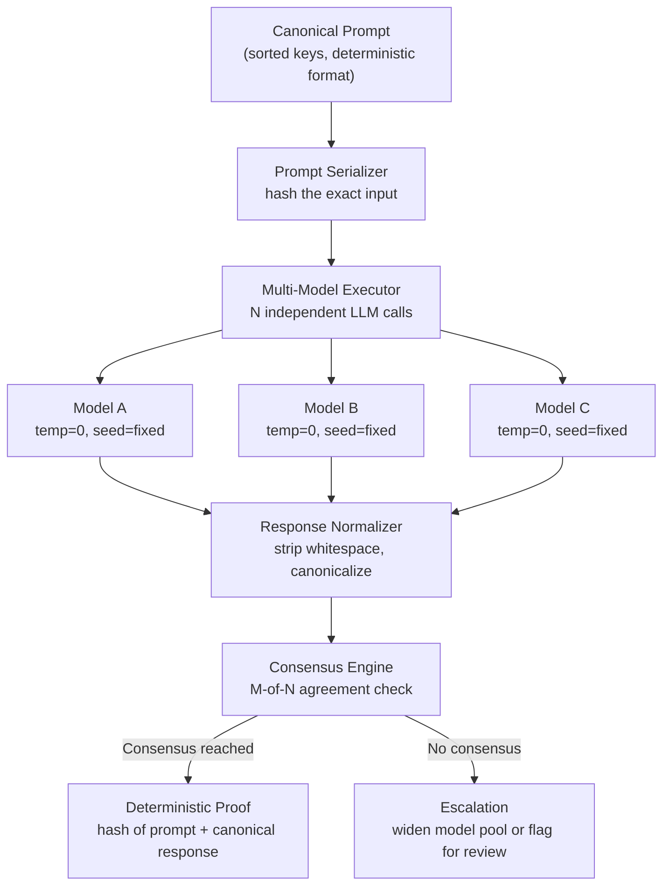

# Deterministic Reasoning Engine (DRE) — Specification

## Problem Statement

LLM reasoning is non-deterministic: the same prompt produces different outputs across runs due to sampling, floating-point variance, and provider-side batching. MaatProof cannot claim verifiable deployment decisions if the reasoning behind those decisions is unreproducible.

The Deterministic Reasoning Engine (DRE) solves this by making LLM reasoning **reproducible, canonical, and independently verifiable**.

## Architecture



## Core Components

### 1. Canonical Prompt Serializer

Every prompt sent to an LLM must be **canonicalized** before execution so that the exact input is reproducible and hashable.

```python
@dataclass
class CanonicalPrompt:
    prompt_id: str              # UUID
    prompt_hash: str            # SHA-256 of canonical content
    system_prompt: str          # The system instructions
    user_prompt: str            # The user/task prompt
    context: Dict[str, Any]     # Structured context (sorted keys)
    constraints: Dict[str, Any] # Model parameters (temp=0, seed, max_tokens)
    created_at: float           # POSIX timestamp
```

**Rules:**
- All dict keys sorted alphabetically
- All strings trimmed, normalized to NFC Unicode
- JSON serialization uses `sort_keys=True, separators=(',', ':')`
- The `prompt_hash` is SHA-256 of the canonical JSON representation
- Constraints MUST include: `temperature=0`, `seed=<fixed>`, `max_tokens=<fixed>`

### 2. Multi-Model Executor

Run the same canonical prompt on **N independent models** (minimum 3, recommended 5) to produce N independent reasoning chains.

```python
@dataclass
class ExecutionResult:
    model_id: str               # Which model produced this
    response_hash: str          # SHA-256 of normalized response
    normalized_response: str    # Whitespace-normalized, canonicalized
    raw_response: str           # Original response for audit
    token_count: int            # Tokens consumed
    latency_ms: float           # Response time
    execution_id: str           # Unique execution ID
```

**Determinism parameters (enforced, not optional):**
- `temperature = 0` (greedy decoding)
- `seed = <deterministic>` (provider-supported fixed seed)
- `top_p = 1.0` (no nucleus sampling)
- `max_tokens` = fixed per prompt type

### 3. Response Normalizer

Raw LLM responses vary in whitespace, formatting, and phrasing even at temperature=0. The normalizer produces a **canonical response** that can be compared across models.

**Normalization steps:**
1. Strip leading/trailing whitespace
2. Normalize Unicode to NFC form
3. Collapse multiple whitespace to single space
4. Extract structured output (JSON, code blocks) if present
5. For code: parse AST and compare structure, not formatting
6. For decisions: extract the decision enum (APPROVE/REJECT/DEFER) and key reasoning points

### 4. Consensus Engine

Consensus determines whether the models **agree** on the reasoning outcome.

```python
@dataclass
class ConsensusResult:
    consensus_reached: bool
    agreement_ratio: float      # e.g., 0.8 = 4/5 models agree
    consensus_response: str     # The agreed-upon canonical response
    dissenting_models: List[str]
    proof: ReasoningProof       # Signed proof of consensus
```

**Consensus levels:**

| Level | Threshold | Action |
|-------|-----------|--------|
| **Strong consensus** | >= 4/5 (80%) | Proceed with full confidence |
| **Majority consensus** | >= 3/5 (60%) | Proceed with warning logged |
| **Weak consensus** | < 3/5 | Escalate: add more models or flag |
| **No consensus** | < 2/5 | Block: reasoning is not deterministic for this input |

**What counts as "agreement":**
- For deployment decisions: same APPROVE/REJECT/DEFER enum value
- For code generation: same AST structure (ignoring variable names, whitespace)
- For reasoning: same conclusion, same key premises cited (order-independent)

### 5. Deterministic Proof

When consensus is reached, a `DeterministicProof` extends `ReasoningProof` with:

```python
@dataclass
class DeterministicProof(ReasoningProof):
    prompt_hash: str            # Hash of the canonical input
    consensus_ratio: float      # Agreement ratio
    model_ids: List[str]        # Models that participated
    response_hash: str          # Hash of the consensus response
    dissenting_hashes: List[str] # Hashes of dissenting responses
    execution_ids: List[str]    # All execution IDs for replay
```

**Verification:** Anyone with the same canonical prompt can re-run it on the same models and verify they get the same consensus response hash.

## Acceptance Criteria

- [ ] CanonicalPrompt produces identical hash for semantically identical prompts
- [ ] Multi-Model Executor runs N models concurrently with enforced determinism params
- [ ] Response Normalizer produces identical canonical output for formatting-only differences
- [ ] Consensus Engine correctly classifies strong/majority/weak/no consensus
- [ ] DeterministicProof is independently verifiable by replaying the prompt
- [ ] All components produce signed, hash-chained proofs
- [ ] End-to-end: same prompt -> same consensus -> same proof hash (reproducible)
