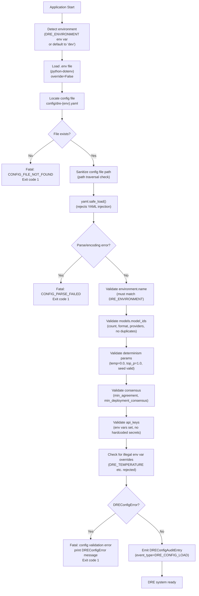

# DRE Configuration — Technical Specification

**Version**: 1.0
**Status**: Draft
**Language**: Python 3.11+, YAML config files, environment variables, python-dotenv
**Secrets Manager**: Environment variables (primary); Azure Key Vault (production-grade)
**Related Issues**: #122 (DRE Configuration), Part of #28
**Related Specs**:
- `specs/dre-spec.md` — DRE logical architecture (Stages 1–5, CommitteeConfig)
- `specs/deterministic-reasoning-engine.md` — DRE Python data models (DeterminismParams, ConsensusClassification)
- `specs/llm-provider-spec.md` — LLM provider abstraction and model ID format
- `specs/dre-infra-spec.md` — Infrastructure secrets management (Key Vault / Secrets Manager)
- `docs/06-security-model.md` — Key management and network security
- `CONSTITUTION.md §2` — Deterministic Layer requirements

<!-- Addresses EDGE-DRE-001 through EDGE-DRE-060 (issue #122) -->

---

## Overview

This specification defines the **environment-specific configuration schema** for the
Deterministic Reasoning Engine (DRE). It governs how model committees, determinism
parameters, consensus thresholds, and API key loading are declared and validated across
development (`dev`), UAT (`uat`), and production (`prod`) environments.

**Environment naming**: This spec uses `dev`, `uat`, `prod` as the canonical short names,
consistent with issue #122. These map to the infrastructure naming in `specs/dre-infra-spec.md`
as follows:

| DRE Config Name | Infrastructure Name | Cloud Resource Prefix |
|---|---|---|
| `dev` | `development` | `dev-` |
| `uat` | `staging` | `stg-` |
| `prod` | `production` | `prod-` |

**Design constraints:**
1. Secrets (API keys) are **never stored as plain text** in config files or environment variables
   with values embedded. All API key _values_ are loaded via `python-dotenv` from `.env` files
   or from the process environment — never hardcoded in YAML.
2. The configuration schema is validated at application startup (before processing any request).
   Invalid configurations cause a hard startup failure (`DREConfigError`), not a degraded mode.
3. `temperature` MUST be exactly `0.0` in all environments. This overrides the general AVM
   constraint in `specs/dre-spec.md §Execution Constraints` (≤0.2 for production) for the
   specific case of the Python DRE layer operating in deterministic mode. See §Temperature
   Invariant Clarification.
4. Every configuration load is recorded in the audit trail (`CONSTITUTION.md §7`).
5. Production configuration is immutable at runtime: hot-reload is disabled in `prod`.

---

## §1 — Environment → Configuration Mapping

<!-- Addresses EDGE-DRE-007, EDGE-DRE-010, EDGE-DRE-027, EDGE-DRE-049 -->

Each environment MUST declare exactly one configuration file and one matching `.env` file.
The protocol enforces the following environment-specific invariants:

| Environment | Config File | Min Models | Min `min_agreement` | `min_deployment_consensus` | Hot-Reload |
|---|---|---|---|---|---|
| `dev` | `config/dre-dev.yaml` | ≥ 1 (can use single model) | 1 | `weak` | ✅ Yes |
| `uat` | `config/dre-uat.yaml` | ≥ 3 | 2 | `majority` | ✅ Yes, round-boundary only |
| `prod` | `config/dre-prod.yaml` | ≥ 3 | 3 (must be `> M/2`) | `strong` | ❌ No |

> **Rule**: A `prod` config that sets `min_deployment_consensus` to anything less than `strong`
> is rejected at startup with `DREConfigError: prod requires min_deployment_consensus=strong`.
<!-- Addresses EDGE-DRE-015 -->

> **Rule**: A config file for environment `X` that declares `environment.name: Y` (where `X ≠ Y`)
> is rejected at startup with `DREConfigError: ENV_NAME_MISMATCH`.
<!-- Addresses EDGE-DRE-010 -->

> **CI environment**: CI pipelines use the `dev` config (`config/dre-dev.yaml`) and load
> API keys from GitHub Actions secrets injected as environment variables.
<!-- Addresses EDGE-DRE-049 -->

---

## §2 — Configuration File Format

<!-- Addresses EDGE-DRE-007, EDGE-DRE-025, EDGE-DRE-026, EDGE-DRE-037, EDGE-DRE-040,
     EDGE-DRE-043, EDGE-DRE-044, EDGE-DRE-045, EDGE-DRE-047, EDGE-DRE-058 -->

Configuration is stored as **YAML** files (one per environment). YAML is loaded with
`yaml.safe_load()` to prevent Python object injection (see §Security Constraints).

### §2.1 File Naming Convention

```
config/
  dre-dev.yaml     ← development environment
  dre-uat.yaml     ← UAT / staging environment
  dre-prod.yaml    ← production environment
```

All config files MUST be present in the repository. Absence of any config file causes a
startup failure at `DREConfigError: CONFIG_FILE_NOT_FOUND`.

### §2.2 YAML Schema (Canonical)

```yaml
# dre-prod.yaml — Example production configuration
# API key values MUST NOT appear here. Reference only the env var name.

environment:
  name: "prod"                       # string; must be "dev" | "uat" | "prod"

models:
  # model_ids: list of canonical model identifiers in {provider}/{model}@{version} format.
  # Must have >= 3 entries for uat and prod. No duplicates. No None entries.
  # Each entry must pass ModelResponse model_id format validation (llm-provider-spec.md).
  # All entries must come from distinct providers (no two entries with same provider prefix).
  # "Latest" aliases are rejected — version must be pinned.
  model_ids:
    - "anthropic/claude-3-7-sonnet@20250219"
    - "openai/gpt-4o@2024-08-06"
    - "mistral/mistral-large@2407"

  # determinism: LLM sampling parameters for deterministic execution.
  # temperature MUST be 0.0 in ALL environments. No exceptions.
  # top_p MUST be 1.0 in ALL environments.
  # seed MUST be a non-negative integer in [0, 2^32 - 1].
  # All three fields are REQUIRED; no defaults are applied if missing.
  determinism:
    temperature: 0.0                 # float; MUST be exactly 0.0
    top_p: 1.0                       # float; MUST be exactly 1.0
    seed: 314159                     # int; range [0, 2^32-1]; required

consensus:
  # min_agreement: minimum number of models that must agree on the same
  # DecisionTuple for the result to be accepted.
  # Must be > len(model_ids) / 2 (strict majority of the committee).
  # Must not exceed len(model_ids).
  # For prod: must be >= 3.
  min_agreement: 3

  # min_deployment_consensus: minimum ConsensusClassification required for a
  # deployment to be authorized. Must be one of: "strong" | "majority" | "weak" | "none".
  # prod MUST be "strong" (>= 80% agreement).
  # uat MUST be >= "majority" (>= 60% agreement).
  # dev MAY be "weak" or "none" (for local testing).
  min_deployment_consensus: "strong"

api_keys:
  # API key env var names — values are loaded from environment variables at startup.
  # The values of these env vars must NEVER be hardcoded here.
  # Use the naming convention: DRE_{ENV}_{PROVIDER}_API_KEY
  # Example: DRE_PROD_ANTHROPIC_API_KEY, DRE_PROD_OPENAI_API_KEY, DRE_PROD_MISTRAL_API_KEY
  # Each key in this section is the provider name; the value is the env var name to read.
  anthropic: "DRE_PROD_ANTHROPIC_API_KEY"
  openai: "DRE_PROD_OPENAI_API_KEY"
  mistral: "DRE_PROD_MISTRAL_API_KEY"
```

### §2.3 Dev Config Example

```yaml
# dre-dev.yaml — Development environment
environment:
  name: "dev"

models:
  model_ids:
    - "anthropic/claude-3-5-haiku@20241022"  # single model allowed for dev

  determinism:
    temperature: 0.0    # MUST be 0.0 even in dev — no exceptions
    top_p: 1.0          # MUST be 1.0 even in dev
    seed: 42            # fixed seed for dev reproducibility

consensus:
  min_agreement: 1                        # single model: 1-of-1
  min_deployment_consensus: "weak"        # dev: any classification passes

api_keys:
  anthropic: "DRE_DEV_ANTHROPIC_API_KEY"  # loaded from .env or process env
```

**Dev-specific invariants:**
- `model_ids` MAY have 1 entry in `dev` (single-model testing is valid).
- `min_deployment_consensus` MAY be `"none"` in `dev` (for dry-run testing).
- `temperature` MUST still be `0.0` — there is no dev relaxation for DeterminismParams.
- `top_p` MUST still be `1.0` — there is no dev relaxation for DeterminismParams.
<!-- Addresses EDGE-DRE-055 -->

### §2.4 UAT Config Example

```yaml
# dre-uat.yaml — UAT / staging environment
environment:
  name: "uat"

models:
  model_ids:
    - "anthropic/claude-3-7-sonnet@20250219"
    - "openai/gpt-4o@2024-08-06"
    - "mistral/mistral-large@2407"

  determinism:
    temperature: 0.0
    top_p: 1.0
    seed: 271828

consensus:
  min_agreement: 2                         # 2-of-3 for uat
  min_deployment_consensus: "majority"     # uat: >= 60% required

api_keys:
  anthropic: "DRE_UAT_ANTHROPIC_API_KEY"
  openai: "DRE_UAT_OPENAI_API_KEY"
  mistral: "DRE_UAT_MISTRAL_API_KEY"
```

---

## §3 — Field Validation Rules

<!-- Addresses EDGE-DRE-001 through EDGE-DRE-005, EDGE-DRE-016, EDGE-DRE-017,
     EDGE-DRE-024, EDGE-DRE-025, EDGE-DRE-026, EDGE-DRE-029, EDGE-DRE-030,
     EDGE-DRE-037, EDGE-DRE-038, EDGE-DRE-043, EDGE-DRE-044, EDGE-DRE-045,
     EDGE-DRE-053, EDGE-DRE-057 -->

### §3.1 Model IDs Validation

```python
import re

MODEL_ID_PATTERN = re.compile(
    r"^[a-zA-Z0-9_-]+/[a-zA-Z0-9._-]+@[a-zA-Z0-9._-]+$"
)
# Reject floating alias versions like "@latest", "@main", "@trunk"
FLOATING_ALIAS_PATTERN = re.compile(
    r"@(latest|main|trunk|HEAD|master|stable)$", re.IGNORECASE
)

SUPPORTED_PROVIDERS = frozenset({
    "anthropic", "openai", "mistral", "local"
})

def validate_model_ids(
    model_ids: list,
    environment: str,
) -> None:
    """
    Validate the model_ids list for DRE committee configuration.

    <!-- Addresses EDGE-DRE-004, EDGE-DRE-005, EDGE-DRE-006, EDGE-DRE-019,
         EDGE-DRE-024, EDGE-DRE-029, EDGE-DRE-053 -->
    """
    if not isinstance(model_ids, list):
        raise DREConfigError(
            "models.model_ids must be a list, got "
            f"{type(model_ids).__name__!r}"
        )

    # Empty check (EDGE-DRE-024)
    if len(model_ids) == 0:
        raise DREConfigError(
            "models.model_ids must not be empty. "
            "At least 1 model is required for dev; at least 3 for uat and prod."
        )

    # Minimum count per environment (EDGE-DRE-004, EDGE-DRE-053)
    min_count = {"dev": 1, "uat": 3, "prod": 3}
    required = min_count.get(environment, 3)
    if len(model_ids) < required:
        raise DREConfigError(
            f"models.model_ids must have >= {required} entries for {environment}, "
            f"got {len(model_ids)}. "
            "Multi-model consensus requires a minimum committee of 3 for meaningful "
            "M-of-N agreement in uat and prod environments."
        )

    # Duplicate check (EDGE-DRE-005)
    seen = set()
    for mid in model_ids:
        if mid in seen:
            raise DREConfigError(
                f"models.model_ids contains duplicate entry: {mid!r}. "
                "Each committee slot must have a distinct model."
            )
        seen.add(mid)

    for mid in model_ids:
        # None check
        if mid is None:
            raise DREConfigError(
                "models.model_ids contains a null entry. All entries must be strings."
            )

        # Format validation (EDGE-DRE-029)
        if not MODEL_ID_PATTERN.match(str(mid)):
            raise DREConfigError(
                f"models.model_ids entry {mid!r} does not match canonical format "
                "'{{provider}}/{{model}}@{{version}}'. "
                "See specs/llm-provider-spec.md §Model ID Canonical Format."
            )

        # Floating alias rejection (EDGE-DRE-029)
        if FLOATING_ALIAS_PATTERN.search(str(mid)):
            raise DREConfigError(
                f"models.model_ids entry {mid!r} uses a floating version alias. "
                "Pin to a specific model version (e.g., @20250219, @2407) to ensure "
                "reproducible committee execution."
            )

        # Unsupported provider (EDGE-DRE-006)
        provider = mid.split("/")[0].lower()
        if provider not in SUPPORTED_PROVIDERS:
            raise DREConfigError(
                f"models.model_ids entry {mid!r} references unsupported provider "
                f"{provider!r}. Supported providers: {sorted(SUPPORTED_PROVIDERS)}. "
                "See specs/llm-provider-spec.md §Supported Providers."
            )

    # Same-provider concentration check (EDGE-DRE-019)
    # For uat and prod: reject if all models are from the same provider
    if environment in ("uat", "prod"):
        providers_used = {mid.split("/")[0].lower() for mid in model_ids}
        if len(providers_used) == 1:
            raise DREConfigError(
                f"All {len(model_ids)} model_ids are from the same provider "
                f"{list(providers_used)[0]!r}. "
                "Use models from distinct providers to ensure committee independence "
                "and prevent a single provider outage from blocking all deployments. "
                "See specs/dre-spec.md §Committee Independence."
            )
```

### §3.2 DeterminismParams Validation

```python
def validate_determinism_params(
    temperature: object,
    top_p: object,
    seed: object,
    environment: str,
) -> None:
    """
    Validate DeterminismParams fields from config.

    <!-- Addresses EDGE-DRE-001, EDGE-DRE-002, EDGE-DRE-003, EDGE-DRE-016,
         EDGE-DRE-017, EDGE-DRE-025, EDGE-DRE-037, EDGE-DRE-043, EDGE-DRE-044,
         EDGE-DRE-045, EDGE-DRE-055 -->
    """
    # --- temperature ---
    if temperature is None:
        raise DREConfigError(
            "models.determinism.temperature is required and must be 0.0. "
            "There is no default. See specs/deterministic-reasoning-engine.md §DeterminismParams."
        )
    # Coerce int 0 to float (EDGE-DRE-037: YAML parses `0` as int)
    if isinstance(temperature, int) and not isinstance(temperature, bool):
        temperature = float(temperature)
    if not isinstance(temperature, float):
        raise DREConfigError(
            f"models.determinism.temperature must be a float (0.0), "
            f"got {type(temperature).__name__!r} ({temperature!r}). "
            "If using YAML, write `temperature: 0.0` (with decimal point)."
        )
    if temperature != 0.0:
        raise DREConfigError(
            f"models.determinism.temperature must be exactly 0.0, got {temperature}. "
            "Non-zero temperature introduces randomness that breaks deterministic replay. "
            "This constraint applies to ALL environments (including dev). "
            "See specs/deterministic-reasoning-engine.md §DeterminismParams."
        )

    # --- top_p ---
    if top_p is None:
        raise DREConfigError(
            "models.determinism.top_p is required and must be 1.0. "
            "There is no default."
        )
    # Coerce string "1.0" if possible (EDGE-DRE-025)
    if isinstance(top_p, str):
        try:
            top_p = float(top_p)
        except ValueError:
            raise DREConfigError(
                f"models.determinism.top_p must be a float (1.0), got string {top_p!r}. "
                "Write `top_p: 1.0` in YAML."
            )
    # Coerce int to float
    if isinstance(top_p, int) and not isinstance(top_p, bool):
        top_p = float(top_p)
    if not isinstance(top_p, float):
        raise DREConfigError(
            f"models.determinism.top_p must be a float (1.0), "
            f"got {type(top_p).__name__!r} ({top_p!r})."
        )
    if top_p != 1.0:
        raise DREConfigError(
            f"models.determinism.top_p must be exactly 1.0, got {top_p}. "
            "top_p < 1.0 enables nucleus sampling and alters output distribution "
            "even at temperature=0. This constraint applies to ALL environments. "
            "See specs/deterministic-reasoning-engine.md §DeterminismParams."
        )

    # --- seed ---
    if seed is None:
        raise DREConfigError(
            "models.determinism.seed is required. "
            "A fixed integer seed is mandatory for reproducible LLM committee execution. "
            "Range: [0, 2^32 - 1]. See specs/deterministic-reasoning-engine.md §DeterminismParams."
        )
    if isinstance(seed, bool):
        raise DREConfigError(
            f"models.determinism.seed must be an integer, got bool ({seed!r}). "
            "Write an explicit integer (e.g., seed: 42)."
        )
    # Reject float seeds (EDGE-DRE-017)
    if isinstance(seed, float):
        if seed.is_integer():
            raise DREConfigError(
                f"models.determinism.seed must be an integer, got float {seed!r}. "
                "Write `seed: 42` (without decimal point) in YAML."
            )
        raise DREConfigError(
            f"models.determinism.seed must be an integer, got float {seed!r}."
        )
    if not isinstance(seed, int):
        raise DREConfigError(
            f"models.determinism.seed must be an integer, got {type(seed).__name__!r} ({seed!r})."
        )
    if not (0 <= seed <= 2**32 - 1):
        raise DREConfigError(
            f"models.determinism.seed must be in [0, 2^32 - 1], got {seed}. "
            "See specs/deterministic-reasoning-engine.md §DeterminismParams."
        )
```

### §3.3 Consensus Validation

```python
CONSENSUS_CLASSIFICATIONS = ("strong", "majority", "weak", "none")
MIN_DEPLOYMENT_CONSENSUS = {
    "dev":  "weak",     # dev: weak or above allowed (all local testing)
    "uat":  "majority", # uat: majority (>=60%) required
    "prod": "strong",   # prod: strong (>=80%) required
}

CONSENSUS_RANK = {"none": 0, "weak": 1, "majority": 2, "strong": 3}

def validate_consensus(
    min_agreement: object,
    min_deployment_consensus: object,
    model_count: int,
    environment: str,
) -> None:
    """
    Validate consensus configuration.

    <!-- Addresses EDGE-DRE-011, EDGE-DRE-015, EDGE-DRE-030, EDGE-DRE-038,
         EDGE-DRE-053, EDGE-DRE-057 -->
    """
    # --- min_agreement ---
    if min_agreement is None:
        raise DREConfigError(
            "consensus.min_agreement is required. "
            "Specify the minimum number of models that must agree."
        )
    if not isinstance(min_agreement, int) or isinstance(min_agreement, bool):
        raise DREConfigError(
            f"consensus.min_agreement must be an integer, "
            f"got {type(min_agreement).__name__!r} ({min_agreement!r})."
        )
    if min_agreement <= 0:
        raise DREConfigError(
            f"consensus.min_agreement must be a positive integer, got {min_agreement}. "
            "min_agreement=0 would accept any result without consensus — "
            "this is a security violation."
        )

    # Must be > model_count / 2 (EDGE-DRE-053)
    if model_count > 1 and min_agreement <= model_count // 2:
        raise DREConfigError(
            f"consensus.min_agreement={min_agreement} does not form a strict majority "
            f"of the {model_count}-model committee. "
            f"min_agreement must be > {model_count // 2} (i.e., >= {model_count // 2 + 1}). "
            "A minority agreement is not a consensus."
        )

    # Must not exceed model count (EDGE-DRE-030)
    if min_agreement > model_count:
        raise DREConfigError(
            f"consensus.min_agreement={min_agreement} exceeds the number of "
            f"configured models ({model_count}). "
            "Consensus can never be reached if more models must agree than exist."
        )

    # Prod minimum (EDGE-DRE-015)
    if environment == "prod" and min_agreement < 3:
        raise DREConfigError(
            f"consensus.min_agreement must be >= 3 for prod, got {min_agreement}. "
            "Three-of-N minimum is required for Byzantine fault tolerance in production."
        )

    # --- min_deployment_consensus ---
    if min_deployment_consensus is None:
        raise DREConfigError(
            "consensus.min_deployment_consensus is required. "
            f"Must be one of: {CONSENSUS_CLASSIFICATIONS}."
        )
    if not isinstance(min_deployment_consensus, str):
        raise DREConfigError(
            f"consensus.min_deployment_consensus must be a string, "
            f"got {type(min_deployment_consensus).__name__!r}."
        )
    if min_deployment_consensus not in CONSENSUS_CLASSIFICATIONS:
        raise DREConfigError(
            f"consensus.min_deployment_consensus {min_deployment_consensus!r} is not valid. "
            f"Must be one of: {CONSENSUS_CLASSIFICATIONS}."
        )

    # Enforce environment minimums (EDGE-DRE-011, EDGE-DRE-015)
    required_min = MIN_DEPLOYMENT_CONSENSUS[environment]
    if CONSENSUS_RANK[min_deployment_consensus] < CONSENSUS_RANK[required_min]:
        raise DREConfigError(
            f"consensus.min_deployment_consensus={min_deployment_consensus!r} is below "
            f"the minimum required for {environment} ({required_min!r}). "
            f"Deployments in {environment} require at least {required_min!r} consensus "
            f"(>= {{'none': '0%', 'weak': '40%', 'majority': '60%', 'strong': '80%'}}[{required_min!r}]). "
            "See specs/deterministic-reasoning-engine.md §ConsensusClassification."
        )
```

### §3.4 API Keys Validation

```python
ENV_VAR_NAMING_PATTERN = re.compile(
    r"^DRE_(DEV|UAT|PROD)_[A-Z0-9_]+_API_KEY$"
)

HARDCODED_SECRET_PATTERNS = [
    re.compile(r"^sk-[A-Za-z0-9]{20,}"),         # OpenAI-style keys
    re.compile(r"^anthropic-[A-Za-z0-9]{20,}"),  # Anthropic-style keys
    re.compile(r"^[A-Za-z0-9+/]{40,}={0,2}$"),   # Base64-encoded secrets
    re.compile(r"^-----BEGIN"),                    # PEM key material
]

def validate_api_keys(
    api_keys: dict,
    environment: str,
    model_ids: list,
) -> None:
    """
    Validate API key configuration section.

    API key VALUES must be env var names (e.g., "DRE_PROD_ANTHROPIC_API_KEY"),
    never the actual key material.

    <!-- Addresses EDGE-DRE-008, EDGE-DRE-018, EDGE-DRE-028, EDGE-DRE-032,
         EDGE-DRE-048, EDGE-DRE-050 -->
    """
    import os

    if not isinstance(api_keys, dict):
        raise DREConfigError(
            "api_keys must be a dict mapping provider name to env var name."
        )

    # Each model_id's provider must have an api_keys entry
    required_providers = {mid.split("/")[0].lower() for mid in model_ids
                          if mid.split("/")[0].lower() != "local"}
    for provider in required_providers:
        if provider not in api_keys:
            raise DREConfigError(
                f"api_keys.{provider} is missing. "
                f"A provider API key reference is required for model {provider!r}. "
                "Set api_keys.{provider} to the env var name "
                f"(e.g., DRE_{environment.upper()}_{provider.upper()}_API_KEY)."
            )

    for provider, env_var_name in api_keys.items():
        if not isinstance(env_var_name, str) or not env_var_name:
            raise DREConfigError(
                f"api_keys.{provider} must be a non-empty string (env var name), "
                f"got {env_var_name!r}."
            )

        # Detect hardcoded secret material (EDGE-DRE-008, EDGE-DRE-032)
        for pattern in HARDCODED_SECRET_PATTERNS:
            if pattern.match(env_var_name):
                raise DREConfigError(
                    f"api_keys.{provider} appears to contain raw secret material "
                    f"(matched pattern: {pattern.pattern!r}). "
                    "api_keys values must be environment variable NAMES, not values. "
                    "Example: set api_keys.anthropic to 'DRE_PROD_ANTHROPIC_API_KEY', "
                    "then set DRE_PROD_ANTHROPIC_API_KEY=<actual-key> in your .env file "
                    "or secret manager."
                )

        # Naming convention check (EDGE-DRE-048)
        if not ENV_VAR_NAMING_PATTERN.match(env_var_name):
            import warnings
            warnings.warn(
                f"api_keys.{provider} value {env_var_name!r} does not follow the "
                "recommended naming convention DRE_{{ENV}}_{{PROVIDER}}_API_KEY "
                f"(e.g., DRE_{environment.upper()}_{provider.upper()}_API_KEY). "
                "Non-standard names increase risk of cross-environment key confusion.",
                DREConfigWarning,
                stacklevel=3,
            )

        # Cross-environment key check (EDGE-DRE-018)
        env_upper = environment.upper()
        for other_env in ("DEV", "UAT", "PROD"):
            if other_env != env_upper and other_env in env_var_name.upper():
                raise DREConfigError(
                    f"api_keys.{provider} references env var {env_var_name!r} which "
                    f"appears to belong to environment {other_env.lower()!r}, "
                    f"not {environment!r}. "
                    "Do not share API keys across environments."
                )

        # Check env var is set at startup (EDGE-DRE-050)
        value = os.environ.get(env_var_name)
        if not value:
            raise DREConfigError(
                f"api_keys.{provider}: environment variable {env_var_name!r} is not set "
                f"or is empty. "
                "Load API keys from your .env file or set them in the process environment "
                "before starting the DRE. "
                "See §.env File Loading."
            )

        # Empty value check (EDGE-DRE-028)
        if value.strip() == "":
            raise DREConfigError(
                f"api_keys.{provider}: environment variable {env_var_name!r} is set but "
                "empty. A non-empty API key is required."
            )
```

---

## §4 — API Key Loading via python-dotenv

<!-- Addresses EDGE-DRE-008, EDGE-DRE-032, EDGE-DRE-036, EDGE-DRE-048,
     EDGE-DRE-050, EDGE-DRE-056 -->

### §4.1 .env File Location

The DRE config loader uses `python-dotenv` to load API key values before config validation.
The `.env` file location is resolved as follows:

1. If the `DRE_ENV_FILE` environment variable is set, use that path.
2. Otherwise, look for `.env.{environment}` (e.g., `.env.prod`) in the project root.
3. Otherwise, fall back to `.env` in the project root.
4. If no `.env` file is found, proceed without loading (process environment variables
   are used directly; this is the expected path in CI/CD pipelines).

```python
import os
from dotenv import load_dotenv
from pathlib import Path

def load_env_file(environment: str) -> None:
    """
    Load .env file for the given environment before config validation.

    <!-- Addresses EDGE-DRE-036, EDGE-DRE-056 -->

    Priority:
    1. DRE_ENV_FILE env var (explicit override)
    2. .env.{environment} in project root
    3. .env in project root
    4. No file — rely on process environment (CI/CD)
    """
    explicit = os.environ.get("DRE_ENV_FILE")
    if explicit:
        env_path = Path(explicit)
        if not env_path.is_file():
            raise DREConfigError(
                f"DRE_ENV_FILE points to non-existent path: {explicit!r}. "
                "Check the DRE_ENV_FILE environment variable."
            )
        load_dotenv(env_path, override=False)
        return

    root = Path(__file__).parent.parent  # project root
    for name in (f".env.{environment}", ".env"):
        candidate = root / name
        if candidate.is_file():
            load_dotenv(candidate, override=False)
            return

    # No .env file found — rely on process environment (normal in CI)
```

> **`override=False`**: `python-dotenv` is called with `override=False`, meaning it does
> **not** override environment variables that are already set in the process environment.
> This prevents a local `.env` file from inadvertently overriding secrets injected by a
> CI/CD pipeline.
<!-- Addresses EDGE-DRE-036 -->

### §4.2 Environment Variable Override Policy

Only the following fields MAY be overridden via environment variables using the `DRE_` prefix.
Security-critical fields (`temperature`, `top_p`, `seed`, `min_deployment_consensus`,
`min_agreement`) **cannot** be overridden via environment variables — only through config files
with the full validation pipeline applied.

| Environment Variable | Overrides | Allowed in Prod? |
|---|---|---|
| `DRE_ENV_FILE` | `.env` file path | Yes |
| `DRE_{ENV}_{PROVIDER}_API_KEY` | API key value for that provider/env | Yes |
| `DRE_CONFIG_BASE_DIR` | Base directory for config files | Yes |
| `DRE_TEMPERATURE` | `models.determinism.temperature` | **No — rejected** |
| `DRE_SEED` | `models.determinism.seed` | **No — rejected** |
| `DRE_MIN_AGREEMENT` | `consensus.min_agreement` | **No — rejected** |
| `DRE_MIN_DEPLOYMENT_CONSENSUS` | `consensus.min_deployment_consensus` | **No — rejected** |

The config loader emits a `DREConfigError` if an attempt is detected to override a
security-critical field via an environment variable.
<!-- Addresses EDGE-DRE-009, EDGE-DRE-036 -->

---

## §5 — YAML Injection Prevention

<!-- Addresses EDGE-DRE-020 -->

YAML config files MUST be parsed with `yaml.safe_load()`, not `yaml.load()`.

```python
import yaml

def _load_yaml(path: str) -> dict:
    """
    Load a YAML config file safely.

    <!-- Addresses EDGE-DRE-020, EDGE-DRE-047, EDGE-DRE-058 -->
    """
    try:
        with open(path, "r", encoding="utf-8") as f:
            result = yaml.safe_load(f)
    except UnicodeDecodeError as exc:
        raise DREConfigError(
            f"Config file {path!r} is not valid UTF-8: {exc}. "
            "DRE config files must be UTF-8 encoded (not UTF-16, UTF-32, or Latin-1)."
        )
    except yaml.YAMLError as exc:
        raise DREConfigError(
            f"Config file {path!r} has invalid YAML syntax: {exc}. "
            "Fix the YAML syntax error and restart."
        )
    if not isinstance(result, dict):
        raise DREConfigError(
            f"Config file {path!r} did not parse to a dict (got {type(result).__name__!r}). "
            "The config file must be a YAML mapping at the top level."
        )
    return result
```

`yaml.safe_load()` rejects all Python-specific YAML tags including:
- `!!python/object` — Python object instantiation
- `!!python/exec` — arbitrary code execution
- `!!python/eval` — expression evaluation

Any YAML file containing these tags causes a `yaml.YAMLError` (caught and re-raised as
`DREConfigError: CONFIG_PARSE_FAILED`).
<!-- Addresses EDGE-DRE-020 -->

---

## §6 — Config File Path Sanitization

<!-- Addresses EDGE-DRE-059 -->

```python
import os
import pathlib

def sanitize_config_path(path: str, environment: str) -> str:
    """
    Resolve and validate the config file path.
    Prevents path traversal (e.g., ../../prod-config.yaml).

    <!-- Addresses EDGE-DRE-059 -->
    """
    config_base_dir = os.environ.get("DRE_CONFIG_BASE_DIR", "config")
    config_base = pathlib.Path(config_base_dir).resolve()
    resolved = pathlib.Path(path).resolve()

    try:
        resolved.relative_to(config_base)
    except ValueError:
        raise DREConfigError(
            f"Config file path {path!r} resolves to {resolved!s} which is outside "
            f"the allowed config directory {config_base!s}. "
            "Path traversal is not permitted."
        )

    if not resolved.is_file():
        raise DREConfigError(
            f"Config file not found: {resolved!s}. "
            f"Expected config/dre-{environment}.yaml to exist."
        )

    return str(resolved)
```

---

## §7 — Hot-Reload Policy

<!-- Addresses EDGE-DRE-022, EDGE-DRE-031 -->

| Environment | Hot-Reload Allowed | Behaviour |
|---|---|---|
| `dev` | ✅ Yes | `model_ids`, `consensus`, and `api_keys` sections reload on file change |
| `uat` | ✅ Yes, round-boundary only | Reload queued; applied after active DRE round reaches terminal state (`FINALIZED` / `REJECTED` / `DISCARDED`) |
| `prod` | ❌ No | Config is immutable after process start. Config changes require a rolling restart. |

**Concurrent reload safety** (<!-- Addresses EDGE-DRE-031 -->):
The config reload mechanism MUST use a read-write lock (`threading.RLock`) to prevent
a partially-written config from being observed by an in-progress DRE execution.

```python
import threading

_config_lock = threading.RLock()

def reload_config(environment: str) -> "DREConfig":
    """Atomically reload and validate config. Thread-safe."""
    with _config_lock:
        return DREConfig.load(environment)
```

---

## §8 — Startup Validation Flow

<!-- Addresses EDGE-DRE-007, EDGE-DRE-021, EDGE-DRE-046 -->



**Critical constraint** (<!-- Addresses EDGE-DRE-021 -->):
All validation MUST complete before the DRE processes any request. If startup validation
fails, the process MUST exit with code 1. Starting in a degraded mode with invalid
configuration is not permitted.

---

## §9 — Python Config Loader Reference Implementation

<!-- Addresses EDGE-DRE-040, EDGE-DRE-046, EDGE-DRE-060 -->

```python
from __future__ import annotations
from dataclasses import dataclass, field
from typing import List, Dict, Optional
import os
import re
import warnings
import yaml

class DREConfigError(Exception):
    """Raised on invalid or dangerous DRE configuration. Causes startup failure."""

class DREConfigWarning(UserWarning):
    """Non-fatal DRE configuration warning (e.g., non-standard env var name)."""

SUPPORTED_ENVIRONMENTS = frozenset({"dev", "uat", "prod"})

@dataclass
class DeterminismConfig:
    temperature: float   # must be 0.0
    top_p: float         # must be 1.0
    seed: int            # range [0, 2^32-1]

@dataclass
class ConsensusConfig:
    min_agreement: int
    min_deployment_consensus: str  # "strong" | "majority" | "weak" | "none"

@dataclass
class DREConfig:
    """
    Validated DRE configuration for one environment.
    Construct via DREConfig.load(environment).
    """
    environment:              str
    model_ids:                List[str]
    determinism:              DeterminismConfig
    consensus:                ConsensusConfig
    api_keys:                 Dict[str, str]   # provider → env var name

    @classmethod
    def load(cls, environment: str) -> "DREConfig":
        """
        Load and validate DRE config for the given environment.

        Raises:
            DREConfigError on validation failure (startup should exit with code 1).
            ValueError if environment is not in SUPPORTED_ENVIRONMENTS.
        """
        if environment not in SUPPORTED_ENVIRONMENTS:
            raise ValueError(
                f"Unknown DRE environment {environment!r}. "
                f"Must be one of: {sorted(SUPPORTED_ENVIRONMENTS)}"
            )

        # Load .env file first (python-dotenv, override=False)
        load_env_file(environment)

        # Check for illegal env var overrides
        _check_no_security_env_var_overrides()

        # Locate and sanitize config path
        config_base = os.environ.get("DRE_CONFIG_BASE_DIR", "config")
        config_path = os.path.join(config_base, f"dre-{environment}.yaml")
        safe_path = sanitize_config_path(config_path, environment)

        # Load YAML (safe)
        raw = _load_yaml(safe_path)

        return cls._validate(raw, environment)

    @classmethod
    def _validate(cls, raw: dict, environment: str) -> "DREConfig":
        """Full validation of raw config dict."""
        # environment section
        env_section      = raw.get("environment", {})
        models_section   = raw.get("models", {})
        consensus_section = raw.get("consensus", {})
        api_keys_section  = raw.get("api_keys", {})

        config_env = env_section.get("name", "")
        if config_env != environment:
            raise DREConfigError(
                f"Config file declares environment.name={config_env!r} but was loaded "
                f"for environment={environment!r}. Use the correct config file. "
                "(Error: ENV_NAME_MISMATCH)"
            )

        model_ids = models_section.get("model_ids")
        if model_ids is None:
            raise DREConfigError(
                "models.model_ids is required but not present in config."
            )
        validate_model_ids(model_ids, environment)

        determinism_raw = models_section.get("determinism", {})
        validate_determinism_params(
            temperature=determinism_raw.get("temperature"),
            top_p=determinism_raw.get("top_p"),
            seed=determinism_raw.get("seed"),
            environment=environment,
        )

        min_agreement = consensus_section.get("min_agreement")
        min_deployment_consensus = consensus_section.get("min_deployment_consensus")
        validate_consensus(
            min_agreement=min_agreement,
            min_deployment_consensus=min_deployment_consensus,
            model_count=len(model_ids),
            environment=environment,
        )

        validate_api_keys(api_keys_section, environment, model_ids)

        # Construct validated DeterminismConfig (with type coercions already applied)
        temperature = determinism_raw.get("temperature")
        if isinstance(temperature, int):
            temperature = float(temperature)
        top_p = determinism_raw.get("top_p")
        if isinstance(top_p, int):
            top_p = float(top_p)
        seed = determinism_raw.get("seed")

        return cls(
            environment=environment,
            model_ids=model_ids,
            determinism=DeterminismConfig(
                temperature=temperature,
                top_p=top_p,
                seed=seed,
            ),
            consensus=ConsensusConfig(
                min_agreement=min_agreement,
                min_deployment_consensus=min_deployment_consensus,
            ),
            api_keys=api_keys_section,
        )


def _check_no_security_env_var_overrides() -> None:
    """
    Detect and reject any attempt to override security-critical fields via env vars.

    <!-- Addresses EDGE-DRE-009, EDGE-DRE-036 -->
    """
    SECURITY_CRITICAL_ENV_VARS = {
        "DRE_TEMPERATURE": "models.determinism.temperature",
        "DRE_TOP_P": "models.determinism.top_p",
        "DRE_SEED": "models.determinism.seed",
        "DRE_MIN_AGREEMENT": "consensus.min_agreement",
        "DRE_MIN_DEPLOYMENT_CONSENSUS": "consensus.min_deployment_consensus",
    }
    for env_var, config_field in SECURITY_CRITICAL_ENV_VARS.items():
        if os.environ.get(env_var) is not None:
            raise DREConfigError(
                f"Environment variable {env_var!r} attempts to override security-critical "
                f"config field {config_field!r}. Security-critical fields can only be set "
                "in the YAML config file (where the full validation pipeline applies). "
                "(Error: ENV_VAR_OVERRIDE_REJECTED)"
            )
```

---

## §10 — Config Audit Trail

<!-- Addresses EDGE-DRE-052 -->

Every DRE configuration load and reload event is recorded in the append-only audit log
(`CONSTITUTION.md §7`). The audit entry includes:

```python
@dataclass
class DREConfigAuditEntry:
    """Audit record emitted whenever DRE config is loaded or changed."""
    entry_id:              str    # UUID v4
    event_type:            str    # "DRE_CONFIG_LOAD" | "DRE_CONFIG_RELOAD" | "DRE_CONFIG_ERROR"
    environment:           str    # "dev" | "uat" | "prod"
    config_file_path:      str    # absolute path to config file
    config_file_hash:      str    # SHA-256 of config file contents (hex)
    model_ids:             list   # the validated model_ids list
    min_deployment_consensus: str # the validated min_deployment_consensus
    timestamp:             float  # Unix timestamp
    error_message:         str    # populated on DRE_CONFIG_ERROR; empty otherwise
```

**Compliance note**: This satisfies SOC 2 CC8.1 (change management) for DRE configuration.

---

## §11 — Temperature Invariant Clarification

<!-- Addresses EDGE-DRE-039, EDGE-DRE-055 -->

There is an apparent discrepancy between two existing specs:

| Spec | Claim | Context |
|---|---|---|
| `specs/dre-spec.md §Execution Constraints` | Max temperature (production): `0.2`; Max temperature (staging): `0.5` | General AVM execution constraints for any LLM call in the AVM sandbox |
| `specs/deterministic-reasoning-engine.md §DeterminismParams` | `temperature` must be exactly `0.0` | Python DRE layer operating in deterministic mode |

**Resolution**: These specs operate at different layers:
- `dre-spec.md §Execution Constraints` defines the **AVM-wide ceiling** — no LLM call in the
  AVM sandbox may exceed `0.2` temperature in production. This is a maximum, not a target.
- `deterministic-reasoning-engine.md §DeterminismParams` defines the **DRE-specific requirement**
  for the Python multi-model committee: temperature MUST be exactly `0.0` for the DRE to produce
  deterministic, replayable outputs.

**Rule**: When operating in DRE deterministic mode (as configured by this spec), `temperature`
MUST be `0.0` in **all environments** (`dev`, `uat`, `prod`). The AVM-wide ceiling of `0.2`
does not create permission to set temperature above `0.0` in DRE committee execution.

This constraint applies to dev environments as well — there is no dev relaxation for
`temperature` or `top_p` in the DRE Python layer. If a developer wants to experiment with
higher temperature, they must use a non-DRE LLM call path that is outside this spec's scope.

---

## §12 — Error Reference

<!-- Addresses EDGE-DRE-060 -->

| Error Code | Class | Description |
|---|---|---|
| `CONFIG_FILE_NOT_FOUND` | `DREConfigError` | Config file does not exist at expected path |
| `CONFIG_PATH_TRAVERSAL` | `DREConfigError` | Config path resolves outside allowed base dir |
| `CONFIG_PARSE_FAILED` | `DREConfigError` | YAML syntax error or encoding error in config file |
| `ENV_NAME_MISMATCH` | `DREConfigError` | `environment.name` does not match the requested environment |
| `MODEL_IDS_EMPTY` | `DREConfigError` | `models.model_ids` is empty |
| `MODEL_IDS_TOO_FEW` | `DREConfigError` | Fewer than required models for the environment |
| `MODEL_IDS_DUPLICATE` | `DREConfigError` | Duplicate entry in `models.model_ids` |
| `MODEL_ID_INVALID_FORMAT` | `DREConfigError` | `model_id` does not match `{provider}/{model}@{version}` |
| `MODEL_ID_FLOATING_ALIAS` | `DREConfigError` | `model_id` uses `@latest` or other floating alias |
| `MODEL_ID_UNSUPPORTED_PROVIDER` | `DREConfigError` | Provider not in supported list |
| `MODEL_IDS_SAME_PROVIDER` | `DREConfigError` | All models from same provider (uat/prod only) |
| `TEMPERATURE_INVALID` | `DREConfigError` | `temperature` is not `0.0` |
| `TEMPERATURE_MISSING` | `DREConfigError` | `temperature` field absent |
| `TOP_P_INVALID` | `DREConfigError` | `top_p` is not `1.0` |
| `TOP_P_MISSING` | `DREConfigError` | `top_p` field absent |
| `SEED_INVALID` | `DREConfigError` | `seed` out of range or wrong type |
| `SEED_MISSING` | `DREConfigError` | `seed` field absent |
| `CONSENSUS_AGREEMENT_INVALID` | `DREConfigError` | `min_agreement` ≤ 0, non-majority, or > model count |
| `CONSENSUS_CLASSIFICATION_INVALID` | `DREConfigError` | `min_deployment_consensus` not in valid set |
| `CONSENSUS_TOO_LOW` | `DREConfigError` | `min_deployment_consensus` below environment minimum |
| `API_KEY_REF_HARDCODED` | `DREConfigError` | Raw secret material detected in `api_keys` value |
| `API_KEY_CROSS_ENV` | `DREConfigError` | API key env var name references wrong environment |
| `API_KEY_MISSING` | `DREConfigError` | Required API key env var not set at startup |
| `API_KEY_EMPTY` | `DREConfigError` | API key env var is set but empty |
| `ENV_VAR_OVERRIDE_REJECTED` | `DREConfigError` | Attempted env var override of security-critical field |

---

## §13 — Git Secret Scanning

<!-- Addresses EDGE-DRE-032 -->

Pre-commit and CI enforcement for DRE config files:

1. **Pre-commit hook**: Before any commit, the hook runs
   `python -m dre.config.validator --check-secrets` on all modified `config/dre-*.yaml`
   and `.env.*` files. If a hardcoded secret is detected (matching the `HARDCODED_SECRET_PATTERNS`
   in §3.4), the commit is blocked.

2. **CI scan** (`dre-config-validate` job): Every PR runs this job. It fails with exit code 1
   if any `config/dre-*.yaml` contains an `api_keys` value that matches a hardcoded secret pattern.

3. **`.env` files**: `.env.*` files MUST be listed in `.gitignore`. The CI pre-check job
   fails if any `.env.*` file (other than `.env.example`) is detected in the git index.

4. **Revocation on accidental commit**: If a plaintext API key is discovered in git history,
   treat it as compromised immediately, revoke the key in the provider dashboard, rotate all
   affected keys, rewrite git history using `git filter-repo`, and file a security incident
   report in the audit log.

---

## §14 — Seed Management

<!-- Addresses EDGE-DRE-023 -->

### §14.1 Environment Seed Isolation

Different environments MUST use different seed values to prevent cross-environment
proof correlation. Using the same seed in dev, uat, and prod creates a risk where
an adversary who knows the seed can craft prompts that produce predictable outputs:

| Environment | Seed Policy |
|---|---|
| `dev` | Any valid integer; developer's choice (e.g., 42) |
| `uat` | Must differ from dev seed; recommended: derive from UAT deployment timestamp |
| `prod` | Must differ from dev and uat seeds; recommended: governance-controlled fixed integer |

> **Note**: For the DRE Python layer, the seed is configured once per environment and reused
> for all committee executions in that environment. Per-bundle seed derivation (as described in
> `specs/dre-spec.md §Seed Injection Attacks` for the Rust layer) is a higher-security option
> that may be implemented as a Phase 2 enhancement.

### §14.2 Seed Rotation

When rotating the seed (e.g., after a suspected seed-targeting attack):
1. Update `config/dre-{env}.yaml` with the new seed value.
2. Restart the DRE process (prod: rolling restart; uat/dev: direct restart).
3. Record the rotation as a `DRE_CONFIG_RELOAD` audit event.
4. Invalidate any in-flight DRE rounds (they will restart with the new seed).

---

## §15 — Validation Rules Summary

| Scenario | EDGE ID | Coverage | Spec Section |
|----------|---------|---------|-------------|
| temperature != 0.0 in config | EDGE-DRE-001 | ✅ | §3.2, §11 |
| top_p != 1.0 in config | EDGE-DRE-002 | ✅ | §3.2 |
| seed omitted | EDGE-DRE-003 | ✅ | §3.2 |
| model_ids < 3 (uat/prod) | EDGE-DRE-004 | ✅ | §3.1 |
| duplicate model_ids | EDGE-DRE-005 | ✅ | §3.1 |
| unsupported provider | EDGE-DRE-006 | ✅ | §3.1 |
| config file missing | EDGE-DRE-007 | ✅ | §2.1, §8 |
| hardcoded API key in config | EDGE-DRE-008 | ✅ | §3.4, §13 |
| illegal env var override | EDGE-DRE-009 | ✅ | §4.2, §9 |
| env name mismatch | EDGE-DRE-010 | ✅ | §1, §9 |
| min_deployment_consensus=none | EDGE-DRE-011 | ✅ | §3.3 |
| ratio = 80% → STRONG | EDGE-DRE-012 | ✅ | `specs/deterministic-reasoning-engine.md §classify_ratio` |
| ratio = 60% → MAJORITY | EDGE-DRE-013 | ✅ | `specs/deterministic-reasoning-engine.md §classify_ratio` |
| ratio = 40% → WEAK | EDGE-DRE-014 | ✅ | `specs/deterministic-reasoning-engine.md §classify_ratio` |
| WEAK consensus in prod | EDGE-DRE-015 | ✅ | §3.3 |
| negative seed | EDGE-DRE-016 | ✅ | §3.2 |
| seed as float | EDGE-DRE-017 | ✅ | §3.2 |
| dev uses prod API key | EDGE-DRE-018 | ✅ | §3.4 |
| all models same provider | EDGE-DRE-019 | ✅ | §3.1 |
| YAML injection | EDGE-DRE-020 | ✅ | §5 |
| late validation (not at startup) | EDGE-DRE-021 | ✅ | §8 |
| hot-reload in prod | EDGE-DRE-022 | ✅ | §7 |
| same seed across envs | EDGE-DRE-023 | ✅ | §14 |
| empty model_ids list | EDGE-DRE-024 | ✅ | §3.1 |
| top_p as string "1.0" | EDGE-DRE-025 | ✅ | §3.2 |
| consensus threshold format ambiguity | EDGE-DRE-026 | ✅ | §3.3 |
| uat vs staging naming conflict | EDGE-DRE-027 | ✅ | §1 |
| empty API key env var | EDGE-DRE-028 | ✅ | §3.4 |
| floating model alias | EDGE-DRE-029 | ✅ | §3.1 |
| min_agreement > model_count | EDGE-DRE-030 | ✅ | §3.3 |
| concurrent config reload race | EDGE-DRE-031 | ✅ | §7 |
| API key hardcoded in git | EDGE-DRE-032 | ✅ | §13 |
| same endpoints dev and prod | EDGE-DRE-033 | ✅ | §1, §3.4 |
| config file permissions | EDGE-DRE-034 | ✅ | §13 (.gitignore, pre-commit) |
| deprecated model version | EDGE-DRE-035 | Partial | §3.1 (format checked; runtime availability requires provider check) |
| .env overrides security param | EDGE-DRE-036 | ✅ | §4.1, §4.2 |
| temperature as integer 0 | EDGE-DRE-037 | ✅ | §3.2 |
| no min_deployment_consensus | EDGE-DRE-038 | ✅ | §3.3 |
| temp conflict dre-spec vs det-re-engine | EDGE-DRE-039 | ✅ | §11 (resolved) |
| config loader library unspecified | EDGE-DRE-040 | ✅ | §9 |
| seed = 0 | EDGE-DRE-041 | ✅ | `specs/deterministic-reasoning-engine.md §DeterminismParams` |
| seed = 2^32 | EDGE-DRE-042 | ✅ | `specs/deterministic-reasoning-engine.md §DeterminismParams` |
| missing top_p field | EDGE-DRE-043 | ✅ | §3.2 |
| missing temperature field | EDGE-DRE-044 | ✅ | §3.2 |
| missing seed field | EDGE-DRE-045 | ✅ | §3.2 |
| startup validation order | EDGE-DRE-046 | ✅ | §8 |
| UTF-16 config file | EDGE-DRE-047 | ✅ | §5 |
| API key env var naming convention | EDGE-DRE-048 | ✅ | §3.4, §4.2 |
| CI environment config | EDGE-DRE-049 | ✅ | §1 |
| missing required env var | EDGE-DRE-050 | ✅ | §3.4 |
| model doesn't support seed | EDGE-DRE-051 | Partial | `specs/llm-provider-spec.md §supports_deterministic_mode()` |
| no config audit trail | EDGE-DRE-052 | ✅ | §10 |
| 2 models claiming "majority" | EDGE-DRE-053 | ✅ | §3.3 |
| prod config no staging gate | EDGE-DRE-054 | ✅ | §7 (prod hot-reload disabled; rolling restart required) |
| dev temp=0.5 conflict | EDGE-DRE-055 | ✅ | §2.3, §11 |
| .env file location unspecified | EDGE-DRE-056 | ✅ | §4.1 |
| empty consensus config | EDGE-DRE-057 | ✅ | §3.3 |
| YAML syntax error | EDGE-DRE-058 | ✅ | §5 |
| path traversal | EDGE-DRE-059 | ✅ | §6 |
| no error code catalogue | EDGE-DRE-060 | ✅ | §12 |

---

## References

- Issue #122 — DRE Configuration
- Issue #28 — Deterministic Reasoning Engine (parent)
- `specs/dre-spec.md` — DRE logical architecture (CommitteeConfig, non-convergence handling)
- `specs/deterministic-reasoning-engine.md` — DRE Python data models (DeterminismParams, ConsensusClassification, DeterministicProof)
- `specs/llm-provider-spec.md` — LLM provider abstraction (model ID format, supports_deterministic_mode)
- `specs/dre-infra-spec.md` — Infrastructure secrets management (Key Vault, naming conventions)
- `specs/vrp-config-spec.md` — VRP Configuration (structural reference for config pattern)
- `docs/06-security-model.md` — Key management, multi-cloud KMS
- `docs/05-tokenomics.md` — Not applicable (no staking in DRE config)
- `CONSTITUTION.md §2` — Deterministic Layer (trust anchor gates)
- `CONSTITUTION.md §7` — Audit Trail requirement
