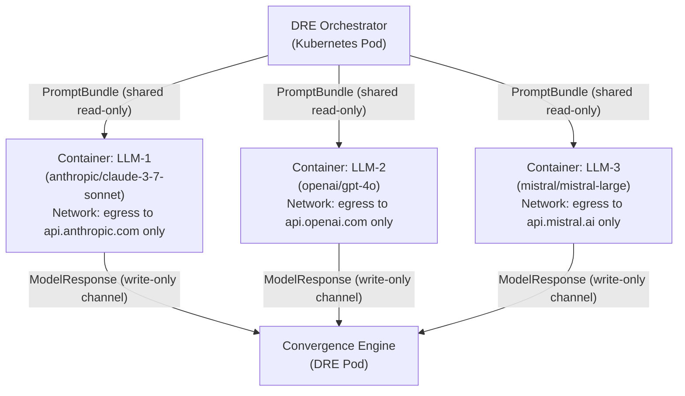
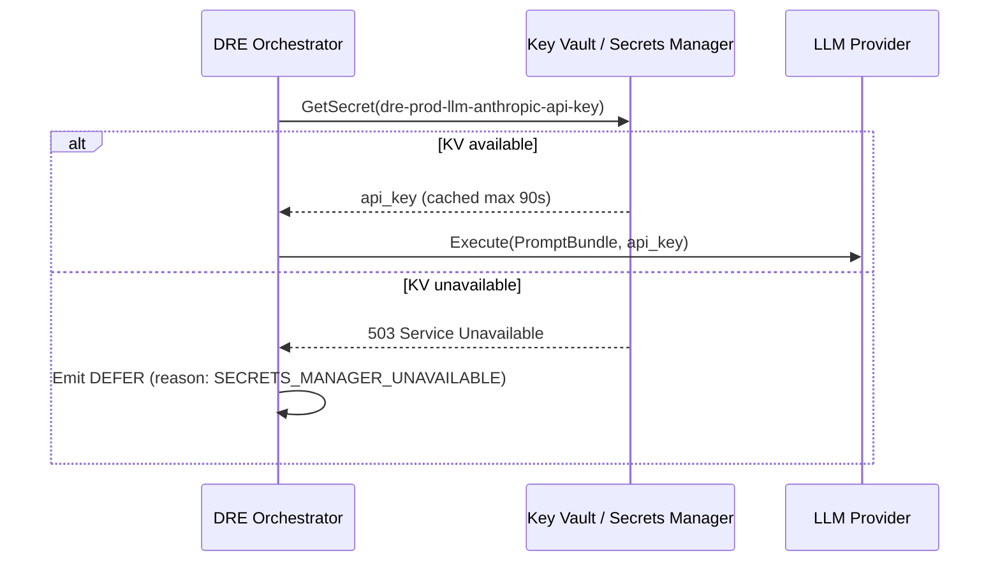
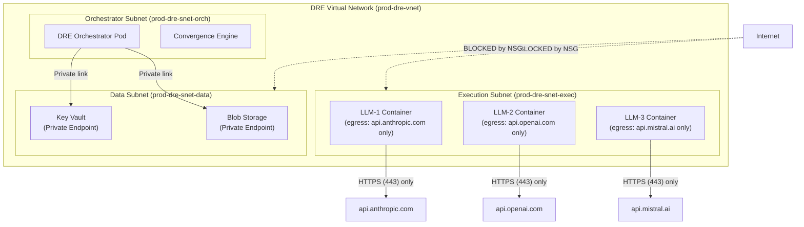

# DRE Infrastructure & IaC Specification

<!-- Addresses EDGE-IaC-001 through EDGE-IaC-060 (issue #117) -->

## Overview

This specification defines the infrastructure resources, IaC templates, secrets management,
naming conventions, and operational requirements for running the Deterministic Reasoning Engine
(DRE) at scale.

The DRE requires a **dedicated infrastructure layer** that is separate from application code and
provides:
- Isolated compute for concurrent N-model LLM execution
- Secure secrets management for provider API keys
- Persistent, encrypted storage for proofs and traces
- Idempotent, environment-aware IaC templates
- Network-isolated execution sandboxes to enforce committee independence

References:
- `specs/dre-spec.md` — DRE logical architecture (Stages 1–5)
- `specs/deterministic-reasoning-engine.md` — DRE Python data models
- `docs/06-security-model.md` — Key management and network security
- `specs/llm-provider-spec.md` — Provider abstraction and failover policy

---

## §1 — Compute Requirements for Concurrent N-Model Execution

<!-- Addresses EDGE-IaC-001, EDGE-IaC-002, EDGE-IaC-003, EDGE-IaC-006,
     EDGE-IaC-007, EDGE-IaC-008, EDGE-IaC-058, EDGE-IaC-059 -->

### §1.1 Minimum Compute Per Model Execution

Each committee member (LLM call) runs in its own **isolated container instance**:

| Resource | Minimum | Recommended (production) |
|----------|---------|--------------------------|
| CPU | 0.5 vCPU | 2 vCPU |
| Memory | 512 MiB | 2 GiB |
| Ephemeral storage | 1 GiB | 4 GiB |
| Max wall-clock time | 60 s (enforced by DRE timeout) | 60 s |

> **Rationale**: Containers are destroyed after each execution; ephemeral storage does not
> persist between runs. Memory limits prevent OOM attacks that could cause selective model
> failures (EDGE-IaC-001, EDGE-IaC-006).

### §1.2 Committee Execution Isolation

<!-- Addresses EDGE-IaC-010, EDGE-IaC-035 -->

Each committee member **must** run in a separate container with:
- Separate network namespace (no inter-container communication)
- Separate volume mounts (no shared filesystem)
- Separate CPU and memory cgroup limits
- `NO_NETWORK` policy: all egress blocked except to the configured LLM provider API endpoint

This enforces the DRE §Committee Independence guarantee:
> "Committee members must not share intermediate state."



### §1.3 Auto-Scaling Policy

<!-- Addresses EDGE-IaC-003, EDGE-IaC-008, EDGE-IaC-058, EDGE-IaC-059 -->

| Metric | Scale-Out Trigger | Scale-In Trigger | Min Replicas | Max Replicas |
|--------|-------------------|------------------|-------------|-------------|
| DRE queue depth | > 10 pending executions | < 2 for 5 min | 2 | 50 |
| CPU utilization (DRE pod) | > 70% for 2 min | < 30% for 10 min | 2 | 50 |
| Memory utilization | > 80% for 2 min | < 40% for 10 min | 2 | 50 |

**Per-tenant rate limiting**: Each tenant (agent DID) is limited to **20 concurrent DRE
executions**. Requests beyond this limit receive HTTP 429 with a `Retry-After` header.
This prevents resource starvation of other tenants (EDGE-IaC-059).

### §1.4 Spot/Preemptible Instance Policy

<!-- Addresses EDGE-IaC-007 -->

- DRE compute **may** use spot/preemptible instances for cost reduction.
- The DRE orchestrator **must** monitor for preemption signals and:
  1. Complete any in-flight model responses already received.
  2. Mark the preempted committee member as a **non-vote** (abstention).
  3. Proceed with remaining members, checking quorum math.
  4. If quorum is no longer achievable, emit `DEFER` with reason `COMPUTE_PREEMPTED`.
- Spot instances are **not allowed** for the convergence engine pod (DRE orchestrator).

### §1.5 Node Crash and Member Timeout

<!-- Addresses EDGE-IaC-002, EDGE-IaC-006 -->

When a committee member container exits unexpectedly or exceeds the 60-second execution
timeout, the DRE treats it as an **abstention** per `specs/dre-spec.md` §Committee
Independence:

| Scenario | DRE Action |
|----------|-----------|
| Member timeout (> 60 s) | Count as non-vote; check remaining quorum |
| OOM kill | Count as non-vote; log with `reason: OOM` |
| Node crash | Count as non-vote; log with `reason: NODE_CRASH` |
| Spot preemption | Count as non-vote; log with `reason: PREEMPTED` |

If the remaining members cannot achieve quorum, the DRE follows the non-convergence
handling defined in `specs/dre-spec.md` §Non-Convergence Handling.

---

## §2 — Secrets Management for LLM API Keys

<!-- Addresses EDGE-IaC-011, EDGE-IaC-012, EDGE-IaC-013, EDGE-IaC-014,
     EDGE-IaC-015, EDGE-IaC-016, EDGE-IaC-017, EDGE-IaC-018, EDGE-IaC-019,
     EDGE-IaC-020, EDGE-IaC-054 -->

### §2.1 Key Storage Requirements

All LLM provider API keys **must** be stored in the cloud-native secrets manager:

| Cloud | Service | Key Type |
|-------|---------|----------|
| **Azure** | Azure Key Vault (Standard or Premium tier) | Secrets (API keys as string secrets) |
| **AWS** | AWS Secrets Manager | SecretString |
| **GitHub CI** | GitHub Actions Secrets (encrypted) | Env variable injection only |

**Plaintext credentials in the repository are a constitutional violation (CONSTITUTION.md §2).**
IaC templates must reference Key Vault / Secrets Manager by URI; they must never embed
credential values.

### §2.2 Secret Naming Convention

<!-- Addresses EDGE-IaC-018, EDGE-IaC-019 -->

Secrets follow the naming pattern:
```
dre-{environment}-llm-{provider}-api-key
```

Examples:
- `dre-prod-llm-anthropic-api-key`
- `dre-staging-llm-openai-api-key`
- `dre-dev-llm-mistral-api-key`

This prevents cross-provider key substitution (EDGE-IaC-018) and ensures environment
separation between CI and production (EDGE-IaC-019).

### §2.3 Key Vault Outage Handling

<!-- Addresses EDGE-IaC-013 -->

When the secrets manager is unavailable at execution start:

1. DRE **must not** cache secrets beyond a **90-second TTL** in process memory.
2. If Key Vault is unreachable at execution start, DRE emits `DEFER` with reason
   `SECRETS_MANAGER_UNAVAILABLE`.
3. If Key Vault becomes unreachable **mid-execution** (after keys are retrieved), the
   DRE continues with cached keys for the duration of that execution only.
4. Operators are alerted via the configured monitoring channel.



### §2.4 Key Rotation During Execution

<!-- Addresses EDGE-IaC-012, EDGE-IaC-017 -->

- API keys are cached by the DRE with a **90-second TTL**.
- After TTL expiry, the DRE re-fetches from Key Vault on the next execution.
- Key rotation during an in-flight execution **does not** interrupt that execution; the
  cached key remains valid for the current run.
- Operators rotating keys must set the new key as the **current version** in Key Vault;
  the previous version remains readable for the 90-second cache TTL window.
- Key rotation is logged as an audit event with the Key Vault rotation timestamp.

### §2.5 Single-Provider Key Invalid

<!-- Addresses EDGE-IaC-014 -->

If an API key for one committee member is rejected by the provider (HTTP 401/403):

1. DRE counts that member as an **abstention** (not an error).
2. DRE logs `reason: API_KEY_INVALID` with the provider name (not the key value).
3. An alert is emitted to the operator's monitoring channel.
4. Remaining members continue; quorum math proceeds with the abstention counted.

### §2.6 Logging Sanitisation

<!-- Addresses EDGE-IaC-015 -->

The DRE infrastructure **must** enforce log sanitisation at two layers:

1. **Application layer**: All log statements that involve HTTP request/response objects
   must pass through the `mask_secrets()` function defined in `specs/llm-provider-spec.md`
   before emission.
2. **Infrastructure layer**: Container log export pipelines (e.g., Log Analytics Workspace,
   CloudWatch) must have a **secret masking filter** configured that replaces:
   - Values matching `sk-[A-Za-z0-9]{40,}` (OpenAI-style keys)
   - Values matching `anthropic-[A-Za-z0-9]{40,}` (Anthropic-style keys)
   - Any value matching the pattern `api[_-]?key\s*[=:]\s*\S+` (generic)
   - Any value that matches a known Key Vault secret name (exact match)

### §2.7 Least-Privilege RBAC for DRE Identity

<!-- Addresses EDGE-IaC-016, EDGE-IaC-057 -->

The DRE runtime identity (Managed Identity on Azure / IAM Role on AWS) must have **only**:

| Permission | Scope |
|-----------|-------|
| Key Vault Secrets: Get, List | Named Key Vault for DRE secrets only |
| Storage Blob: Read, Write, Create | DRE proof storage container only |
| Container Registry: Pull | DRE image registry only |

The DRE identity **must not** have:
- Owner or Contributor on any subscription or resource group
- Access to Key Vaults belonging to other tenants or services
- Write access to any infrastructure resources

IaC templates **must** implement these permissions using `roleAssignment` resources scoped
to specific resources, not resource groups or subscriptions.

---

## §3 — Storage Resources for Proof Persistence

<!-- Addresses EDGE-IaC-040, EDGE-IaC-041, EDGE-IaC-042, EDGE-IaC-043,
     EDGE-IaC-044, EDGE-IaC-045 -->

### §3.1 Storage Architecture

DRE proofs and traces require two storage tiers:

| Tier | Purpose | Service | Retention | Encryption |
|------|---------|---------|-----------|-----------|
| **Hot storage** | Active proofs (< 30 days) | Azure Blob Storage (Hot) / AWS S3 Standard | 30 days | AES-256, customer-managed key |
| **Cool storage** | Archived proofs (30–365 days) | Azure Blob Storage (Cool) / AWS S3 Intelligent-Tiering | 365 days | AES-256, customer-managed key |
| **IPFS** | Content-addressed trace CIDs | IPFS (Pinata or self-hosted node) | Permanent | Content-addressed (hash = address) |

### §3.2 Encryption at Rest

<!-- Addresses EDGE-IaC-044 -->

All DRE storage resources **must** have encryption at rest enforced via IaC:

```bicep
// Azure Blob Storage — encryption at rest (EDGE-IaC-044)
resource storageAccount 'Microsoft.Storage/storageAccounts@2023-01-01' = {
  properties: {
    encryption: {
      services: {
        blob: { enabled: true }
      }
      keySource: 'Microsoft.Keyvault'  // Customer-managed key
      keyvaultproperties: {
        keyvaulturi: keyVaultUri
        keyname: 'dre-storage-cmk'
      }
    }
  }
}
```

Operator-managed keys are required for production. Microsoft-managed keys are acceptable
for development/staging only.

### §3.3 Storage Capacity Limits and Alerting

<!-- Addresses EDGE-IaC-040 -->

| Alert | Threshold | Action |
|-------|----------|--------|
| Hot storage > 80% | Warn | Page operator; review lifecycle policy |
| Hot storage > 95% | Critical | Pause new DRE executions; emit `DEFER` with reason `STORAGE_CAPACITY_EXCEEDED` |
| Cool storage > 80% | Warn | Review retention policy; archive older proofs |

Lifecycle policies must automatically transition proofs:
- Hot → Cool: after 30 days
- Cool → Archive/Glacier: after 365 days

### §3.4 Storage Access and SAS Tokens

<!-- Addresses EDGE-IaC-041 -->

DRE **must not** use long-lived SAS tokens for proof storage. Instead:
- Use Managed Identity (Azure) / IAM Role (AWS) for storage access.
- If SAS tokens are required (e.g., for auditor read access), they must have a **maximum
  TTL of 1 hour** and be scoped to a specific blob/object.
- DRE proof upload uses the Managed Identity directly; no SAS tokens in the execution path.

### §3.5 IPFS Availability

<!-- Addresses EDGE-IaC-042 -->

When IPFS is unavailable:
1. DRE proof is stored in hot storage with a `ipfs_pending: true` flag.
2. A background job retries IPFS upload every 5 minutes for up to 24 hours.
3. After 24 hours, the proof is marked `ipfs_failed` and an alert is raised.
4. Validators attempting to replay a trace with an unresolvable CID must fetch from
   hot/cool storage fallback URL embedded in the proof's metadata.

Operators **should** run at least two IPFS pinning services (e.g., Pinata + web3.storage)
for redundancy.

### §3.6 Concurrency Safety

<!-- Addresses EDGE-IaC-045 -->

Concurrent proof writes **must** use the storage service's native concurrency controls:
- Azure Blob: ETag-based optimistic concurrency (`If-None-Match: *` for new blobs)
- AWS S3: Conditional writes via `If-None-Match` header (S3 Conditional Writes, 2024+)

Proof blobs are named with the `proof_id` (UUID v4 from `ReasoningProof`), which is
globally unique. Two concurrent writes with the same `proof_id` indicate a replay attack
and the second write must be rejected (HTTP 412 Precondition Failed).

### §3.7 Soft-Delete and Recovery

<!-- Addresses EDGE-IaC-043 -->

All proof storage must have **soft-delete** enabled with a minimum retention period:

| Environment | Soft-Delete Retention |
|------------|----------------------|
| Production | 90 days |
| Staging | 30 days |
| Development | 7 days |

Proofs must not be permanently deleted (purged) during the soft-delete window. Automated
purge policies are disabled for proof storage containers.

---

## §4 — IaC Idempotency Requirements

<!-- Addresses EDGE-IaC-021, EDGE-IaC-022, EDGE-IaC-023, EDGE-IaC-024,
     EDGE-IaC-025, EDGE-IaC-026, EDGE-IaC-027, EDGE-IaC-028 -->

### §4.1 Idempotency Contract

IaC templates for DRE infrastructure **must** satisfy the following idempotency contract:

> Applying the same IaC template N times to the same environment produces the same
> infrastructure state as applying it once. No duplicate resources are created; no
> resources are destroyed and recreated unless a breaking parameter change is made.

Verification: `terraform plan` or `az deployment what-if` must show **zero changes** when
run against infrastructure that is already in the expected state.

### §4.2 No-Downtime Updates

<!-- Addresses EDGE-IaC-022 -->

IaC updates that affect compute or storage resources **must not** cause downtime for
in-flight DRE executions:

1. **Scale-out first**: Add new resource instances before removing old ones.
2. **Drain period**: Allow existing executions 120 seconds to complete before
   the old resource is terminated.
3. **Storage**: Storage account changes must use **in-place updates** where possible.
   If a storage account must be recreated, data migration must complete before the old
   account is deleted.
4. **Canary deploys**: IaC changes to compute are applied to 10% of pods first; full
   rollout only if no errors within 5 minutes.

### §4.3 Breaking vs. Non-Breaking IaC Changes

<!-- Addresses EDGE-IaC-023, EDGE-IaC-050 -->

| Change Type | Classification | Procedure |
|-------------|---------------|-----------|
| Compute SKU change | Breaking | Requires drain + rolling replacement |
| Storage account rename | Breaking | Requires data migration plan in IaC PR |
| Storage account deletion | Breaking | Blocked — must open architecture issue |
| Adding new resource | Non-breaking | Apply directly |
| Updating secret reference | Non-breaking | Apply directly (existing executions use cached key) |
| Network security group rule change | Breaking | Requires security review + staging gate |

Breaking changes **must** be flagged in the PR description and require `role:architect`
review before merge (per CONSTITUTION.md §10).

### §4.4 Partial Apply Failure

<!-- Addresses EDGE-IaC-024 -->

When IaC apply fails midway:
1. The IaC tool's native state lock prevents concurrent applies.
2. Operators must resolve the partial state using `terraform state` commands or Azure
   deployment rollback before re-applying.
3. The DRE continues operating on existing infrastructure until IaC is fully applied.
4. Partial state documentation is added to `docs/runbooks/iac-recovery.md` (to be
   created as part of issue #117 implementation).

### §4.5 Drift Detection

<!-- Addresses EDGE-IaC-027 -->

Infrastructure drift (manual changes outside IaC) must be detected automatically:
- A **daily drift detection job** runs `terraform plan` / `az deployment what-if` against
  all DRE infrastructure.
- Detected drift is reported as a GitHub Issue with label `role:architect`.
- Manual changes to DRE infrastructure are prohibited except during declared incident
  windows (which must be documented and followed by an IaC update).

### §4.6 Environment Guard

<!-- Addresses EDGE-IaC-028 -->

IaC apply pipelines **must** require explicit environment confirmation:
- The target environment (`dev`, `staging`, `prod`) must be passed as an explicit
  parameter to the IaC pipeline.
- Production deploys require a separate approval step (GitHub Actions environment
  protection rule with `required_reviewers`).
- IaC pipelines **must not** auto-promote from staging to production; that requires
  a separate manual trigger with environment explicitly set to `prod`.

---

## §5 — Cloud Resource Naming and Tagging Conventions

<!-- Addresses EDGE-IaC-029, EDGE-IaC-030, EDGE-IaC-031, EDGE-IaC-032,
     EDGE-IaC-033, EDGE-IaC-034 -->

### §5.1 Naming Pattern

All DRE cloud resources follow the naming pattern:

```
{env}-dre-{resource-type}-{short-descriptor}
```

| Token | Values | Notes |
|-------|--------|-------|
| `{env}` | `dev`, `stg`, `prod` | 3-char abbreviation |
| `dre` | Literal | Module identifier |
| `{resource-type}` | See table below | Resource type abbreviation |
| `{short-descriptor}` | Optional, ≤ 8 chars, lowercase alphanumeric | Disambiguates multiple of same type |

**Resource type abbreviations:**

| Resource | Abbreviation | Example Name | Max Length |
|----------|-------------|-------------|-----------|
| Storage Account (Azure) | `st` | `proddrestablock` (no hyphens) | 24 chars |
| Key Vault | `kv` | `prod-dre-kv` | 24 chars |
| Container Registry | `cr` | `prod-dre-cr` | 50 chars |
| Kubernetes Cluster | `aks` | `prod-dre-aks` | 63 chars |
| Log Analytics Workspace | `law` | `prod-dre-law` | 63 chars |
| Virtual Network | `vnet` | `prod-dre-vnet` | 64 chars |
| Subnet | `snet` | `prod-dre-snet-exec` | 80 chars |

> **Note on Azure Storage Account names**: Azure Storage Account names must be globally
> unique, lowercase alphanumeric, 3–24 characters, with no hyphens. Use the format
> `{env}drest{random-5-char-suffix}` (e.g., `proddrest7f3a2`). The suffix is derived
> from the first 5 chars of the resource group's unique ID (EDGE-IaC-029).

### §5.2 Required Tags

<!-- Addresses EDGE-IaC-034 -->

All DRE resources **must** have the following tags applied via IaC:

| Tag | Value | Purpose |
|-----|-------|---------|
| `environment` | `dev` / `staging` / `production` | Cost allocation + policy |
| `component` | `dre` | Module identification |
| `managed-by` | `iac` | Drift detection |
| `owner` | GitHub team slug (e.g., `platform-team`) | Escalation path |
| `cost-center` | Cost center code (e.g., `CC-1234`) | Finance attribution |
| `created-by` | IaC pipeline run ID | Audit trail |

Resources missing required tags are **automatically flagged** by Azure Policy /
AWS Config rules deployed alongside the DRE infrastructure.

### §5.3 Name Conflict Prevention

<!-- Addresses EDGE-IaC-030 -->

- Each environment (`dev`, `stg`, `prod`) must be deployed to a **separate Azure
  subscription / AWS account**.
- Cross-subscription name conflicts are impossible for most resource types.
- For globally-namespaced resources (Storage Accounts, Key Vaults, Container Registries),
  IaC templates must include a configurable `uniqueSuffix` parameter to ensure global
  uniqueness across organizations.

### §5.4 Prohibited Name Content

<!-- Addresses EDGE-IaC-032, EDGE-IaC-033 -->

Resource names **must not** contain:
- Unicode characters (use ASCII only)
- Emoji or special characters
- Forward slashes, backslashes, or dots (except where the cloud service permits them)
- Environment names derived from branch names (branch names may contain `/`, `_`, or
  other characters incompatible with cloud resource naming rules)

When deriving resource names from branch names (e.g., for ephemeral test environments),
the branch name must be sanitised:
- Replace `/` with `-`
- Strip all characters not in `[a-z0-9-]`
- Truncate to 8 characters
- Append 4-char hash suffix to prevent collision

---

## §6 — Network Isolation and Security

<!-- Addresses EDGE-IaC-035, EDGE-IaC-036, EDGE-IaC-037, EDGE-IaC-038,
     EDGE-IaC-039 -->

### §6.1 Network Architecture



### §6.2 Network Security Group Rules

<!-- Addresses EDGE-IaC-036, EDGE-IaC-037, EDGE-IaC-038 -->

**Execution Subnet NSG** (one per committee member):

| Priority | Direction | Source | Destination | Port | Action |
|----------|-----------|--------|-------------|------|--------|
| 100 | Outbound | ExecutionSubnet | LLM Provider IP ranges | 443 | Allow |
| 200 | Outbound | ExecutionSubnet | AzureKeyVault service tag | 443 | Allow |
| 4096 | Outbound | ExecutionSubnet | Any | Any | **Deny** |
| 4096 | Inbound | Any | ExecutionSubnet | Any | **Deny** |

> Execution containers have **no inbound access** and **no general outbound access**.
> Only specific HTTPS egress to the designated LLM provider is permitted per container.

**Data Subnet NSG**:

| Priority | Direction | Source | Destination | Port | Action |
|----------|-----------|--------|-------------|------|--------|
| 100 | Inbound | OrchestratorSubnet | DataSubnet | 443 | Allow |
| 4096 | Inbound | Any | DataSubnet | Any | **Deny** |
| 4096 | Outbound | DataSubnet | Internet | Any | **Deny** |

Storage and Key Vault resources in the Data Subnet must use **Private Endpoints** to
prevent public internet access (EDGE-IaC-038).

### §6.3 Cross-Tenant Isolation

<!-- Addresses EDGE-IaC-039 -->

- Each DRE tenant (agent organization) must deploy to a **separate Azure subscription
  / AWS account**.
- No VNet peering is permitted between different tenant subscriptions.
- Shared infrastructure (e.g., shared AKS cluster for development) must use
  **Kubernetes namespace isolation** with `NetworkPolicy` resources that deny
  cross-namespace pod communication.
- Shared development environments must not process production-tier proofs.

---

## §7 — CI/CD Pipeline for IaC

<!-- Addresses EDGE-IaC-046, EDGE-IaC-047, EDGE-IaC-048, EDGE-IaC-049,
     EDGE-IaC-050 -->

### §7.1 IaC CI Pipeline Requirements

All IaC changes must pass the following CI checks before merge:

| Check | Tool | Pass Criteria |
|-------|------|---------------|
| Syntax validation | `az bicep build` / `terraform validate` | Exit code 0 |
| Security scan | Checkov / tfsec | No HIGH or CRITICAL findings |
| What-if / plan | `az deployment what-if` / `terraform plan` | No unexpected destroys |
| Naming convention | Custom linter (see §5.1) | All resources named per spec |
| Tag compliance | Custom linter (see §5.2) | All required tags present |
| Secret detection | `git-secrets` / `trufflehog` | No plaintext credentials |

### §7.2 Deployment Gate: Staging Before Production

<!-- Addresses EDGE-IaC-047 -->

IaC changes follow a mandatory promotion path:

```
PR opened → CI checks pass → Merge to main → Auto-deploy to dev
                                           → Manual trigger: deploy to staging
                                           → Staging smoke tests pass
                                           → Manual trigger (with `role:architect` approval): deploy to prod
```

IaC changes may **not** be applied to production without first being validated in staging.
The production deployment pipeline requires explicit approval from two `role:architect`-
labelled team members.

### §7.3 CI Timeout and Cleanup

<!-- Addresses EDGE-IaC-048 -->

If a CI IaC validation job exceeds 15 minutes:
1. The job is cancelled.
2. Any test infrastructure created during the run is destroyed by a cleanup step
   (using `terraform destroy` / `az deployment delete` on the test resource group).
3. The cleanup step runs even on cancellation (job-level `always()` condition in
   GitHub Actions).

### §7.4 Module Version Pinning

<!-- Addresses EDGE-IaC-049 -->

All IaC module references must be pinned to a specific version:

```bicep
// Correct: pinned version
module dreCompute 'br/public:avm/res/compute/virtual-machine-scale-set:0.3.0' = { ... }

// Incorrect: floating reference
module dreCompute 'br/public:avm/res/compute/virtual-machine-scale-set:latest' = { ... }
```

The CI linter must reject any IaC module reference without an explicit semantic version.

---

## §8 — Failure Modes and Recovery

<!-- Addresses EDGE-IaC-009, EDGE-IaC-013, EDGE-IaC-042 -->

### §8.1 DRE Failure Mode Catalogue

| Failure | Detection | DRE Response | Operator Action |
|---------|-----------|-------------|-----------------|
| Single LLM provider API down | HTTP 5xx or timeout | Count as abstention; check quorum | Alert if ≥2 providers fail |
| All LLM providers down | 3/3 abstentions | Emit `DEFER` (reason: `ALL_PROVIDERS_UNAVAILABLE`) | Page on-call; check provider status pages |
| Key Vault outage at execution start | Secrets fetch fails | Emit `DEFER` (reason: `SECRETS_MANAGER_UNAVAILABLE`) | Check KV health; DNS resolution |
| Compute node crash | Container exit code non-zero | Count as abstention | Auto-scale replaces node |
| Storage write failure | HTTP 5xx from storage | Retry 3× with exponential backoff; emit `DEFER` if still failing | Check storage account health |
| IPFS unavailable | CID pin fails | Store in hot storage; schedule retry | Check IPFS node health |
| Compute region outage | All pods unhealthy | Emit `DEFER` for all in-flight | Activate failover region (if configured) |
| Spot preemption | Preemption signal | Count as abstention | Auto-provision replacement |

### §8.2 Multi-Region Failover (Optional)

For production deployments requiring high availability, operators may configure a
secondary region:

- Primary region processes all DRE executions.
- Secondary region maintains a warm standby with replicated secrets and storage.
- Failover is manual; automatic failover is not supported in Phase 1 (see roadmap).
- RPO (recovery point objective): 0 (secrets and storage are replicated synchronously).
- RTO (recovery time objective): 15 minutes (manual failover).

---

## §9 — Scaling and Capacity Planning

<!-- Addresses EDGE-IaC-003, EDGE-IaC-008, EDGE-IaC-058, EDGE-IaC-060 -->

### §9.1 Capacity Model

For a committee of N models, each DRE execution consumes:

```
compute_cost = N × (per_model_cost)
           where per_model_cost ≈ 0.5 vCPU + 512 MiB for 60 seconds

storage_cost = proof_size × replicas
           where proof_size ≈ 50 KiB per DRE execution (median)

api_cost = N × (input_tokens + output_tokens) × (provider_price_per_token)
```

### §9.2 Rate Limiting and Provider Quota Management

<!-- Addresses EDGE-IaC-060 -->

When a provider rate-limits the DRE (HTTP 429):

1. The affected committee member is placed in a **provider-level backoff queue** with
   exponential backoff starting at 1 second (max 30 seconds).
2. If the backoff exceeds the 60-second committee execution timeout, count as abstention.
3. A `RATE_LIMITED` event is emitted in the trace.
4. Operators should configure provider API keys with appropriate quota tiers to avoid
   rate limiting under peak load.
5. The DRE does NOT silently switch to a different model to work around rate limiting
   (this would violate the no-silent-failover policy in `specs/llm-provider-spec.md`).

---

## §10 — Multi-Cloud Support

<!-- Addresses EDGE-IaC-051, EDGE-IaC-052, EDGE-IaC-053 -->

### §10.1 Supported Cloud Providers (Phase 1)

The DRE IaC templates provide **first-class support for Azure** in Phase 1. AWS and
GCP templates are listed as roadmap items (Phase 2).

| Cloud | IaC Tool | Status |
|-------|---------|--------|
| **Azure** | Bicep | ✅ Phase 1 |
| **AWS** | Terraform | 🗓️ Phase 2 |
| **GCP** | Terraform | 🗓️ Phase 3 |

### §10.2 Cloud-Agnostic Abstraction Layer

To enable future multi-cloud support without code rewrites, the DRE application code
must not reference cloud-specific APIs directly. All infrastructure interactions go
through the following interfaces (defined in `specs/dre-spec.md`):

| Interface | Azure Implementation | AWS Implementation |
|-----------|--------------------|--------------------|
| Secrets manager | Azure Key Vault SDK | AWS Secrets Manager SDK |
| Blob storage | Azure Blob Storage SDK | AWS S3 SDK |
| Container compute | AKS | EKS |
| Identity | Managed Identity | IAM Roles for Service Accounts (IRSA) |

### §10.3 Regional Service Availability

<!-- Addresses EDGE-IaC-052 -->

Before deploying DRE to a new Azure region, operators must verify that the following
services are available in that region:
- Azure Key Vault (Standard tier)
- Azure Blob Storage
- Azure Kubernetes Service
- Private Endpoints for Key Vault and Storage

A region compatibility check script must be included in the IaC repository.

---

## §11 — Security Controls Summary

<!-- Addresses EDGE-IaC-054, EDGE-IaC-055, EDGE-IaC-056 -->

### §11.1 CI/CD Security Controls

<!-- Addresses EDGE-IaC-054 -->

GitHub Actions secrets containing LLM API keys must be configured as:
- **Environment secrets** (not repository-level secrets) so they are only available
  in specific environments (staging, production).
- **`secrets: inherit`** is prohibited in DRE workflows — secrets must be explicitly
  listed.
- CI logs must be configured to mask the secret values: `add-mask` must be called
  before any step that might use the secret value.

### §11.2 IaC Security Review Gate

<!-- Addresses EDGE-IaC-055 -->

IaC PRs that touch the following resources require a `role:architect` security review
before merge:
- Network Security Groups
- Key Vault access policies
- RBAC role assignments
- Storage account public access settings
- Container registry access policies

### §11.3 Infrastructure Service Principal

<!-- Addresses EDGE-IaC-056 -->

The service principal / IAM role used by IaC deployment pipelines must have:
- **Contributor** on the DRE resource group only (not Subscription Owner/Contributor)
- **Key Vault Certificates Officer** on the DRE Key Vault only
- **No access** to other resource groups or subscriptions

Overly privileged service principals are flagged by the security scan in §7.1.

---

## §12 — Validation Rules Summary

| Scenario | Coverage | Spec Section |
|----------|---------|-------------|
| Compute OOM mid-execution | ✅ | §1.1, §1.5 |
| Node crash / preemption | ✅ | §1.4, §1.5 |
| Committee member in same pod | ✅ | §1.2 |
| Auto-scaling with N models | ✅ | §1.3 |
| 100 concurrent executions | ✅ | §1.3 (rate limiting) |
| API key expiry | ✅ | §2.4 |
| Cached key after rotation | ✅ | §2.4 |
| Key Vault outage | ✅ | §2.3 |
| Invalid key for one provider | ✅ | §2.5 |
| Key in logs | ✅ | §2.6 |
| Over-privileged MSI | ✅ | §2.7 |
| BYOK rotation during execution | ✅ | §2.4 |
| CI vs prod secrets mismatch | ✅ | §2.2 |
| Soft-deleted secret | ✅ | §2.3 |
| Duplicate resources on second apply | ✅ | §4.1 |
| Apply during active processing | ✅ | §4.2 |
| Resource recreation data loss | ✅ | §4.3 |
| Partial apply failure | ✅ | §4.4 |
| IaC drift | ✅ | §4.5 |
| Wrong environment apply | ✅ | §4.6 |
| Resource name length | ✅ | §5.1 |
| Name conflict across environments | ✅ | §5.3 |
| Missing environment prefix | ✅ | §5.1 |
| Unicode/emoji in resource name | ✅ | §5.4 |
| Branch name in resource name | ✅ | §5.4 |
| Missing tags | ✅ | §5.2 |
| Committee members sharing network | ✅ | §1.2, §6.1 |
| External network during execution | ✅ | §6.2 |
| Inbound traffic to execution nodes | ✅ | §6.2 |
| Storage exposed to internet | ✅ | §6.2 |
| Cross-tenant VNet access | ✅ | §6.3 |
| Storage capacity exceeded | ✅ | §3.3 |
| SAS token expiry | ✅ | §3.4 |
| IPFS outage | ✅ | §3.5 |
| Soft-delete expiry | ✅ | §3.7 |
| No encryption at rest | ✅ | §3.2 |
| Storage race condition | ✅ | §3.6 |
| IaC not tested in CI | ✅ | §7.1 |
| IaC to prod without staging gate | ✅ | §7.2 |
| CI timeout partial state | ✅ | §7.3 |
| Missing module reference | ✅ | §7.4 |
| Breaking IaC change | ✅ | §4.3 |
| Azure to AWS migration | ✅ | §10.1, §10.2 |
| Regional service availability | ✅ | §10.3 |
| CI env var exfiltration | ✅ | §11.1 |
| Malicious IaC merge | ✅ | §11.2 |
| Over-privileged service principal | ✅ | §11.3 |
| Cross-tenant RBAC | ✅ | §2.7, §6.3 |
| 1000 concurrent executions | Partial | §1.3 (framework; exact limits TBD by implementation) |
| Per-tenant resource starvation | ✅ | §1.3 |
| Provider rate limits under load | ✅ | §9.2 |
| Region outage failover | Partial | §8.2 (manual failover only; auto-failover is Phase 2) |
| Cost management | Partial | §9.1 (model only; detailed cost controls require cost estimation) |
