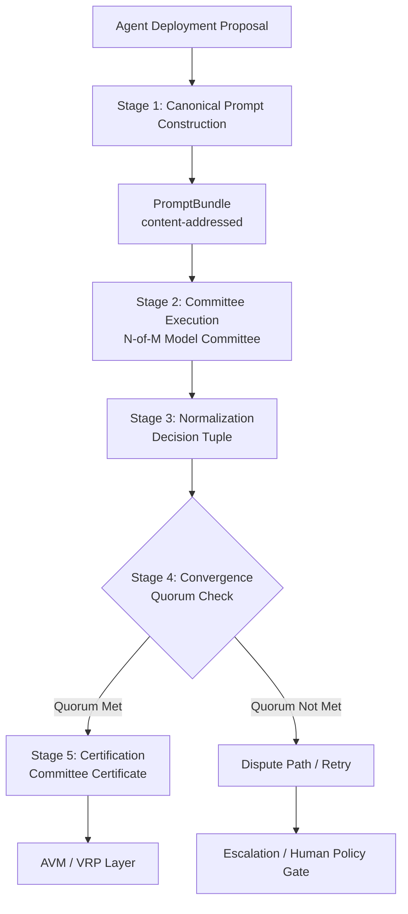
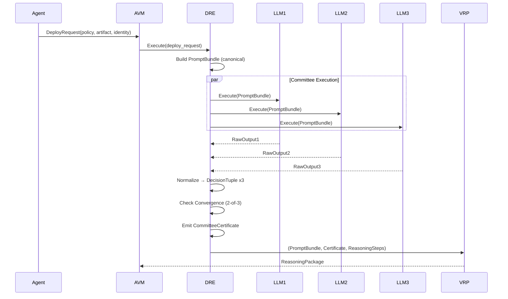
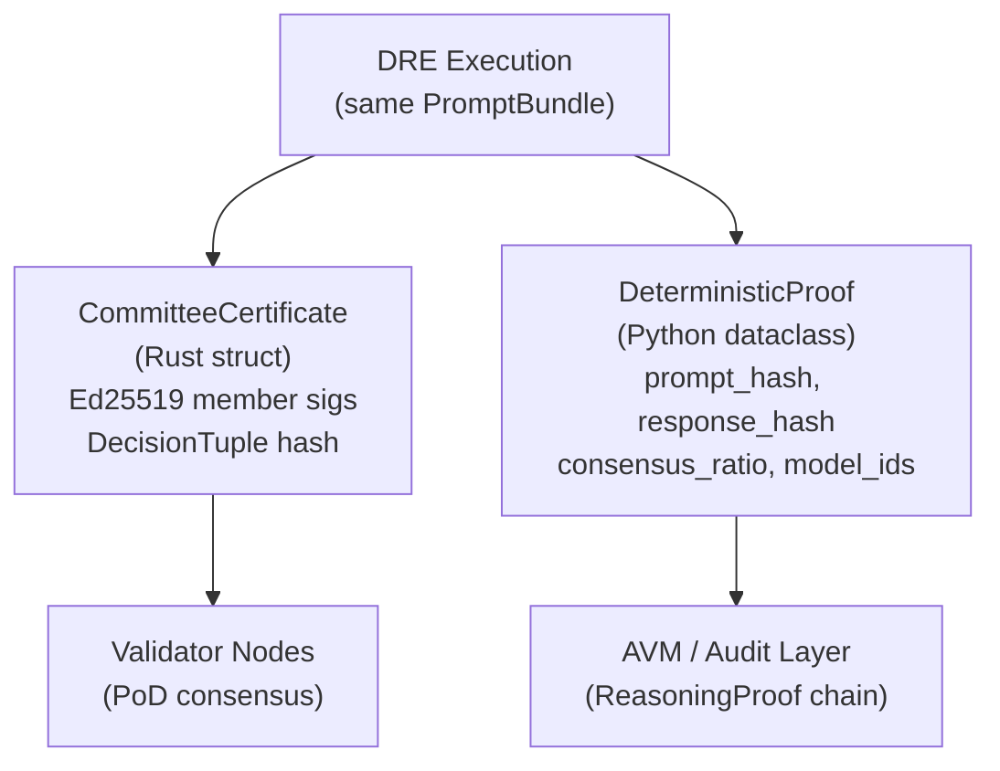

# Deterministic Reasoning Engine (DRE) Specification

## Overview

The Deterministic Reasoning Engine (DRE) is a protocol layer within the AVM that transforms an
agent's deployment proposal into a canonical reasoning package that can be independently replayed
and verified by validators.

The core insight: even when raw LLM execution is imperfectly reproducible, canonical bundles,
structured reasoning, replayable checkers, and validator consensus can make final deployment
authorization deterministic **at the system level**.

## Whitepaper Reference

Section 3.4 — "Deterministic Reasoning Engine (DRE)"

> "MaatProof defines determinism as a system property produced by canonicalization, quorum
> convergence, and replayable verification."

## Architecture



## Stage 1: Canonical Prompt Construction

The DRE serializes all deployment context into a single, content-addressed **PromptBundle**.

### PromptBundle Structure

```rust
#[derive(Serialize, Deserialize, Clone)]
pub struct PromptBundle {
    /// Content address (SHA-256 of canonical serialization)
    pub content_address: [u8; 32],
    
    /// System prompt pinned to a specific version hash
    pub system_prompt: VersionedPrompt,
    
    /// On-chain deployment policy reference
    pub deployment_policy: PolicyReference,
    
    /// Repository snapshot (git commit hash + tree hash)
    pub repo_snapshot: RepoSnapshot,
    
    /// Build artifact content address
    pub build_artifact: ArtifactReference,
    
    /// Test execution results (deterministic hash)
    pub test_results: TestResultBundle,
    
    /// Security scan results
    pub scan_results: ScanResultBundle,
    
    /// Environment manifest (infra state hash)
    pub environment_manifest: EnvironmentManifest,
    
    /// Bundle schema version
    pub schema_version: u32,
    
    /// Creation timestamp (milliseconds since epoch)
    pub created_at: u64,
}

#[derive(Serialize, Deserialize, Clone)]
pub struct VersionedPrompt {
    pub content: String,
    pub version_hash: [u8; 32],
    pub model_profile: ModelProfile,
}

#[derive(Serialize, Deserialize, Clone)]
pub struct PolicyReference {
    pub contract_address: [u8; 20], // Ethereum-style address
    pub policy_version: u64,
    pub policy_hash: [u8; 32],
}

#[derive(Serialize, Deserialize, Clone)]
pub struct RepoSnapshot {
    pub git_commit: String,
    pub tree_hash: [u8; 32],
    pub branch: String,
    pub changed_files: Vec<FileEntry>,
}

#[derive(Serialize, Deserialize, Clone)]
pub struct ArtifactReference {
    pub ipfs_cid: String,
    pub sha256: [u8; 32],
    pub artifact_type: ArtifactType,
    pub sbom_hash: Option<[u8; 32]>,
}
```

### Canonicalization Rules

1. All fields sorted lexicographically by key (BTreeMap-based serialization)
2. Timestamps truncated to second precision (milliseconds stripped)
3. String fields normalized to NFC Unicode
4. Binary fields encoded as lowercase hex
5. `content_address` computed over all other fields (SHA-256 of canonical JSON)

## Stage 2: Committee Execution

The same PromptBundle is executed across an **N-of-M model committee** using the most
deterministic runtime configuration available for each member.

### Committee Configuration

```rust
#[derive(Serialize, Deserialize)]
pub struct CommitteeConfig {
    /// Total committee members (M)
    pub committee_size: usize,
    
    /// Required agreement (N) — must be > M/2
    pub quorum_threshold: usize,
    
    /// Model profiles for each slot
    pub model_slots: Vec<ModelProfile>,
    
    /// Maximum wall-clock time per execution
    pub timeout_ms: u64,
}

#[derive(Serialize, Deserialize, Clone)]
pub struct ModelProfile {
    /// LLM provider identifier
    pub provider: String,
    
    /// Pinned model version
    pub model_version: String,
    
    /// Temperature (must be ≤ 0.2 for production)
    pub temperature: f32,
    
    /// Fixed seed where supported by provider
    pub seed: Option<u64>,
    
    /// Pinned runtime profile hash
    pub runtime_profile_hash: [u8; 32],
}
```

### Execution Constraints

| Constraint | Value |
|---|---|
| Max temperature (production) | 0.2 (AVM-wide ceiling) |
| Max temperature (staging) | 0.5 (AVM-wide ceiling) |
| **DRE deterministic mode temperature** | **Exactly 0.0** (overrides AVM ceiling — see note) |
| Required seed (if supported) | Fixed per bundle |
| Tool outputs | Must be deterministic (no wall-clock, no randomness) |
| Network access | Disabled during execution |
| Max execution time | 60 seconds per committee member |

> **DRE Deterministic Mode Note** <!-- Addresses EDGE-DRE-039 -->:
> The "Max temperature" rows above are the AVM-wide ceiling for general LLM calls.
> When a committee member executes in **DRE deterministic mode** (as configured by
> `specs/dre-config-spec.md` and enforced by `DeterminismParams` in
> `specs/deterministic-reasoning-engine.md`), the temperature MUST be exactly **0.0**
> in all environments — including production, staging, and development.
> Setting temperature to any value other than 0.0 causes `DeterminismParams` to raise
> a `ValueError` and the DRE config loader to raise a `DREConfigError` at startup.
> The AVM ceiling of 0.2 does not grant permission to use temperature > 0.0 in the
> DRE committee execution path.

### Parallel Execution

All committee members execute the PromptBundle in parallel isolation. No member observes
another member's output before submitting its own result. This prevents herding and ensures
independent opinions.

## Stage 3: Normalization

Committee outputs are compiled into a **deterministic decision tuple** rather than trusted as
free-form text.

```rust
#[derive(Serialize, Deserialize, PartialEq, Eq, Hash)]
pub struct DecisionTuple {
    /// Binary deploy decision
    pub decision: DeployDecision,
    
    /// Policy gate results (one per policy rule)
    pub policy_gates: Vec<PolicyGateResult>,
    
    /// Deterministic risk score (0–1000, integer only)
    pub risk_score: u32,
    
    /// Rollout strategy if deploying
    pub rollout_strategy: Option<RolloutStrategy>,
    
    /// Blocking findings from security scan
    pub blocking_findings: Vec<FindingRef>,
    
    /// Reasoning root hash (Merkle root of reasoning steps)
    pub reasoning_root: [u8; 32],
}

#[derive(Serialize, Deserialize, PartialEq, Eq, Hash)]
pub enum DeployDecision {
    Approve,
    Reject,
    Escalate, // requires human approval policy gate
}

#[derive(Serialize, Deserialize, PartialEq, Eq, Hash)]
pub struct PolicyGateResult {
    pub rule_id: String,
    pub passed: bool,
    pub evidence_hash: [u8; 32],
}
```

### Normalization Rules

1. Free-form LLM narrative is **stripped** from the decision tuple
2. Only structured, machine-checkable fields survive normalization
3. The `risk_score` is computed by a versioned deterministic function (not LLM opinion):
   - Inputs: change size, scan severity, historical rollback rate, committee agreement strength, service criticality
   - Function version is part of the PromptBundle schema

## Stage 4: Convergence

The run is accepted only when the configured quorum (N-of-M) agrees on:
1. The same `decision` field
2. The same `policy_gates` results (all gates must match)
3. A compatible `reasoning_root` (within configured tolerance)

```rust
pub struct ConvergenceResult {
    pub accepted: bool,
    pub agreement_count: usize,
    pub total_members: usize,
    pub majority_tuple: DecisionTuple,
    pub minority_tuples: Vec<(DecisionTuple, usize)>,
    pub convergence_timestamp: u64,
}

impl DRE {
    pub fn check_convergence(
        results: &[MemberResult],
        config: &CommitteeConfig,
    ) -> ConvergenceResult {
        // Group results by decision tuple
        let mut groups: BTreeMap<DecisionTuple, usize> = BTreeMap::new();
        for r in results {
            *groups.entry(r.tuple.clone()).or_default() += 1;
        }
        
        // Find majority
        let (majority_tuple, count) = groups.iter()
            .max_by_key(|(_, c)| *c)
            .unwrap();
        
        ConvergenceResult {
            accepted: *count >= config.quorum_threshold,
            agreement_count: *count,
            total_members: results.len(),
            majority_tuple: majority_tuple.clone(),
            minority_tuples: groups.iter()
                .filter(|(t, _)| *t != majority_tuple)
                .map(|(t, c)| (t.clone(), *c))
                .collect(),
            convergence_timestamp: now_ms(),
        }
    }
}
```

### Non-Convergence Handling

| Scenario | Action |
|---|---|
| No quorum, retries < 3 | Re-execute with different random seeds |
| No quorum after 3 retries | Escalate to human approval policy gate |
| Minority disagrees on policy gate | Flag for post-deploy audit |
| Minority disagrees on risk score only | Accept if risk scores within 10% range |

## Stage 5: Certification

On successful convergence, the DRE emits a **Committee Certificate** that validators can use
for replay without re-executing the full LLM committee.

```rust
#[derive(Serialize, Deserialize)]
pub struct CommitteeCertificate {
    /// The PromptBundle that was executed
    pub prompt_bundle_hash: [u8; 32],
    
    /// The agreed-upon decision tuple
    pub decision_tuple: DecisionTuple,
    
    /// Ed25519 signatures from agreeing committee members
    pub member_signatures: Vec<MemberSignature>,
    
    /// Agreement count and total
    pub quorum: QuorumInfo,
    
    /// Certificate creation timestamp
    pub certified_at: u64,
    
    /// DRE version that produced this certificate
    pub dre_version: String,
}

#[derive(Serialize, Deserialize)]
pub struct MemberSignature {
    pub member_index: usize,
    pub model_version: String,
    pub decision_hash: [u8; 32],
    pub signature: [u8; 64], // Ed25519
    pub public_key: [u8; 32],
}

#[derive(Serialize, Deserialize)]
pub struct QuorumInfo {
    pub required: usize,
    pub achieved: usize,
    pub total_members: usize,
}
```

## Integration with AVM



## Security Considerations

### Prompt Bundle Integrity

- The PromptBundle `content_address` must be verified before execution begins
- Any field tampering invalidates the address and causes execution rejection
- The policy reference must resolve to an on-chain, immutable contract version

### Committee Independence

- Committee members must not share intermediate state
- Network partitions between members are treated as abstentions (not errors)
- A member that times out is counted as a non-vote (does not break quorum math if enough others agree)

### Seed Injection Attacks

- Fixed seeds may be vulnerable to adversarial prompt crafting targeting that seed
- Seeds must be rotated per PromptBundle (derived from bundle content address, not attacker-controlled)
- Seed derivation: `HMAC-SHA256(bundle_content_address, dre_epoch_key)`

### Risk Score Manipulation

- The risk score function is versioned and on-chain — changes require governance vote
- The function operates only on structured inputs (no LLM text in the computation path)
- Validators re-compute the risk score independently and reject certificates where it diverges

## Versioning

| Field | Policy |
|---|---|
| DRE version | Semver, on-chain registry |
| PromptBundle schema | Integer version in bundle |
| Risk score function | On-chain, governance-controlled |
| Model profiles | Pinned per bundle, not latest |
| Committee size | Governance-controlled, default 3-of-5 |

## CommitteeCertificate vs DeterministicProof

<!-- Addresses EDGE-D033 — reconcile the two proof types -->

The DRE produces two related but distinct artifacts:

| Artifact | Layer | Purpose | Who uses it |
|---|---|---|---|
| `CommitteeCertificate` (Rust) | Rust/consensus layer | Attests the DRE committee converged; carries Ed25519 member signatures over the `DecisionTuple` | Validator nodes — for rapid PoD consensus replay without re-executing LLMs |
| `DeterministicProof` (Python) | Python orchestration layer | Extends `ReasoningProof` with multi-model consensus metadata; carries `prompt_hash`, `consensus_ratio`, `response_hash`, `model_ids` | AVM policy evaluator, auditors, off-chain verification tools |

Both are produced from the same DRE execution run.  The `CommitteeCertificate`
is the **on-chain / consensus-layer** evidence; the `DeterministicProof` is the
**off-chain / audit-layer** record.



## DRE Committee vs Validator Committee

<!-- Addresses EDGE-D031 -->

These are **two independent committees** at different layers of the protocol:

| Committee | Members | Task | Spec |
|---|---|---|---|
| **DRE Model Committee** (Layer 1) | N LLM model instances (default 3-of-5) | Converge on a `DecisionTuple` given the same `PromptBundle` | This spec (§Stage 2–4) |
| **Validator Committee** (Layer 2) | Staked human/machine validators | Verify the `CommitteeCertificate` + VRP Merkle root; vote ACCEPT/REJECT/DISPUTE | `specs/pod-consensus-spec.md` |

The DRE model committee's output (`CommitteeCertificate`) is an **input** to the
validator committee — validators do not re-run the LLM committee; they verify
the certificate using pinned deterministic checkers.

## References

- Whitepaper §3.4 — Deterministic Reasoning Engine
- Whitepaper §3.5 — Verifiable Reasoning Protocol
- zkLLM [16]: Zero knowledge proofs for large language models
- Cryptographic verifiability of end-to-end AI pipelines [17]
- Proof-carrying code [13]
- Issue #137 — DRE Documentation (CommitteeCertificate/DeterministicProof reconciliation)
