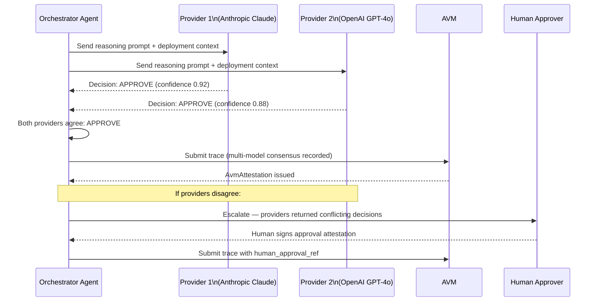
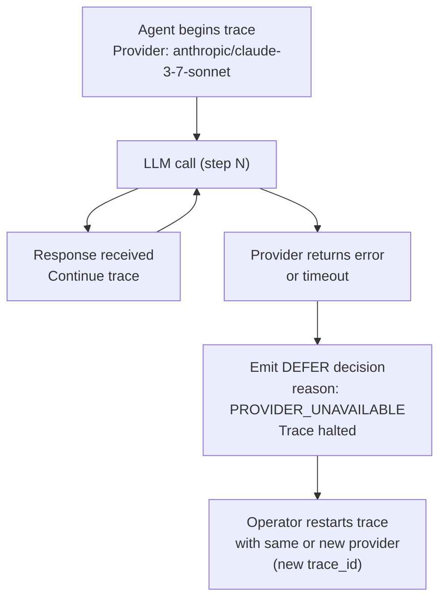

# LLM Provider — Technical Specification

## Overview

MaatProof agents use Large Language Models (LLMs) for reasoning, decision-making, and deployment evaluation. The AVM defines a provider-agnostic abstraction layer so that agents can work with any supported LLM backend while producing auditable, reproducible traces.

All LLM calls made during agent execution are recorded in the deployment trace. The trace includes the provider, model ID, parameters, token usage, and response hash — enabling deterministic replay verification.

---

## Supported Providers

| Provider | Models | Notes |
|---|---|---|
| **Anthropic** | Claude 3.7 Sonnet, Claude 3.5 Haiku, Claude 3 Opus | Recommended for production reasoning agents |
| **OpenAI** | GPT-4o, GPT-4 Turbo, o3 | Full tool-use support |
| **Mistral** | Mistral Large, Mistral Small | EU-hosted option for data residency compliance |
| **Local / Self-hosted** | Any GGUF-compatible model via llama.cpp | For air-gapped or on-premise deployments |

---

## Model ID Canonical Format

All model references in traces and configuration use the format:

```
{provider}/{model-name}@{version}
```

Examples:
- `anthropic/claude-3-7-sonnet@20250219`
- `openai/gpt-4o@2024-08-06`
- `mistral/mistral-large@2407`
- `local/llama-3-70b@q4_k_m`

This canonical form ensures that traces are tied to an exact model snapshot, not a floating alias.

---

## Rust `LlmProvider` Trait

```rust
use async_trait::async_trait;
use serde::{Deserialize, Serialize};

#[derive(Serialize, Deserialize, Clone, Debug)]
pub struct Message {
    pub role:    String,   // "user" | "assistant" | "system"
    pub content: String,
}

#[derive(Serialize, Deserialize, Clone, Debug)]
pub struct LlmParams {
    pub temperature: f32,    // 0.0–1.0
    pub max_tokens:  u32,
    pub top_p:       f32,
    pub seed:        Option<u64>, // for deterministic mode
}

#[derive(Serialize, Deserialize, Clone, Debug)]
pub struct TokenUsage {
    pub input_tokens:  u32,
    pub output_tokens: u32,
    pub total_tokens:  u32,
}

#[derive(Serialize, Deserialize, Clone, Debug)]
pub struct LlmResponse {
    pub text:         String,
    pub usage:        TokenUsage,
    pub finish_reason: String,   // "stop" | "length" | "tool_calls"
    pub response_hash: String,   // sha256 of response text (for trace integrity)
}

#[derive(Debug, thiserror::Error)]
pub enum LlmError {
    #[error("Provider unavailable: {0}")]
    Unavailable(String),
    #[error("Rate limited by provider")]
    RateLimited,
    #[error("Context window exceeded: {tokens} tokens > {limit}")]
    ContextWindowExceeded { tokens: u32, limit: u32 },
    #[error("Invalid response from provider: {0}")]
    InvalidResponse(String),
}

#[async_trait]
pub trait LlmProvider: Send + Sync {
    /// Return canonical model identifier (e.g., "anthropic/claude-3-7-sonnet@20250219")
    fn model_id(&self) -> &str;

    /// Execute a single LLM call; returns (response_text, token_usage)
    async fn complete(
        &self,
        system_prompt: &str,
        messages:      &[Message],
        params:        &LlmParams,
    ) -> Result<LlmResponse, LlmError>;

    /// Return true if this provider supports deterministic mode (seed + temp=0)
    fn supports_deterministic_mode(&self) -> bool;

    /// Maximum context window in tokens for this model
    fn context_window_tokens(&self) -> u32;
}

pub struct AnthropicProvider {
    pub api_key:  String,
    pub model:    String,
    pub endpoint: String,
}

pub struct OpenAiProvider {
    pub api_key:  String,
    pub model:    String,
    pub endpoint: String,
}

pub struct MistralProvider {
    pub api_key:  String,
    pub model:    String,
    pub endpoint: String,
}

pub struct LocalProvider {
    pub model_path: std::path::PathBuf,
    pub model_hash: String, // SHA-256 of model weights file
}
```

---

## Temperature Policy

LLM temperature controls output randomness. MaatProof enforces strict limits per deployment environment:

| Environment | Max Temperature | Rationale |
|---|---|---|
| Production | ≤ 0.2 | Low randomness; consistent, auditable decisions |
| Staging | ≤ 0.5 | Moderate; allows exploratory reasoning |
| Development | ≤ 1.0 | No restriction; developer testing |

Traces submitted with `temperature > 0.2` for a production deployment are **rejected** by the AVM with `POLICY_TEMPERATURE_EXCEEDED`.

---

## Token Budget Per Trace Action

| Action Type | Max Input Tokens | Max Output Tokens |
|---|---|---|
| `REASONING` step | 8,192 | 4,096 |
| `DECISION` step | 4,096 | 1,024 |
| `TOOL_CALL` construction | 2,048 | 512 |
| `APPROVAL_REQUEST` | 2,048 | 512 |

Exceeding the token budget for an action causes the action to be split into sub-steps. Each sub-step is recorded independently in the trace.

---

## Context Window Management

For long deployment traces, the agent SDK uses a **sliding window strategy**:

```rust
pub struct ContextWindowManager {
    pub max_tokens:      u32,
    pub system_prompt:   String,
    pub message_history: Vec<Message>,
}

impl ContextWindowManager {
    /// Trim message history to fit within max_tokens, preserving system prompt
    /// and always keeping the last N messages (recent context).
    pub fn trim_to_fit(&mut self, reserve_for_output: u32) {
        let available = self.max_tokens - reserve_for_output
            - estimate_tokens(&self.system_prompt);

        // Always keep the last 4 messages (most recent context)
        let keep_recent = 4;
        let mut tokens_used = self.message_history
            .iter().rev().take(keep_recent)
            .map(|m| estimate_tokens(&m.content))
            .sum::<u32>();

        let mut keep_from = self.message_history.len().saturating_sub(keep_recent);
        while keep_from > 0 && tokens_used < available {
            let msg = &self.message_history[keep_from - 1];
            tokens_used += estimate_tokens(&msg.content);
            if tokens_used <= available { keep_from -= 1; }
        }

        self.message_history = self.message_history[keep_from..].to_vec();
    }
}
```

A `CONTEXT_TRIMMED` event is emitted in the trace whenever trimming occurs, noting the number of messages dropped.

---

## Hallucination Handling and Confidence Scoring

Each agent decision step records a `confidence_score` (0.0–1.0). The score is derived from the agent's own self-assessment expressed in its reasoning output, calibrated against a reference rubric in the system prompt.

| Confidence Range | Action |
|---|---|
| ≥ 0.90 | Proceed autonomously |
| 0.70–0.89 | Flag in trace; continue unless policy mandates human review |
| < 0.70 | Mandatory human review before proceeding |
| Any REJECT/ROLLBACK decision | Always escalate — human must confirm destructive actions |

```rust
pub struct DecisionOutput {
    pub decision:          DeployDecision,  // APPROVE | REJECT | DEFER
    pub confidence_score:  f32,             // 0.0–1.0
    pub reasoning_summary: String,
    pub escalate_to_human: bool,            // auto-set if confidence < 0.70
    pub llm_metadata:      LlmMetadata,
}
```

---

## Multi-Model Consensus

For high-stakes production deployments, operators can enable **multi-model consensus**: two or more independent LLM providers must agree on `APPROVE` or `REJECT` before a deployment trace is submitted.

### Configuration

```rust
pub struct MultiModelConsensusConfig {
    pub enabled:          bool,
    pub providers:        Vec<Box<dyn LlmProvider>>,
    pub require_unanimous: bool,  // if false: majority vote among providers
    pub environments:     Vec<String>, // e.g., ["production"]
}
```

### Multi-Model Consensus Flow



### Disagreement Handling

If providers disagree (one `APPROVE`, one `REJECT`), the deployment is automatically escalated to human review. The trace records both provider responses and the disagreement event.

---

## LLM Call Recording Format

Every LLM call is recorded in the deployment trace as part of the action's `metadata`:

```json
{
  "action_id": "a1b2c3d4-...",
  "action_type": "REASONING",
  "llm_call": {
    "provider":       "anthropic",
    "model_id":       "anthropic/claude-3-7-sonnet@20250219",
    "temperature":    0.1,
    "max_tokens":     4096,
    "input_tokens":   1247,
    "output_tokens":  312,
    "finish_reason":  "stop",
    "response_hash":  "sha256:e3b0c44298fc1c149afb...",
    "latency_ms":     1834,
    "timestamp":      "2025-03-15T14:32:01Z"
  }
}
```

The `response_hash` allows auditors to verify that the response recorded in the trace matches the LLM output at the time of execution.

---

## Provider Failover Policy

MaatProof enforces a **strict no-silent-failover policy** for in-progress traces:

- If the primary LLM provider is unavailable **mid-trace**, the agent **defers the deployment** (emits `DEFER` decision with reason `PROVIDER_UNAVAILABLE`).
- The agent does **not** silently switch to a different model for the remaining steps of the same trace.
- A new trace may be submitted with a different provider once the operator updates the agent configuration.



**Rationale**: Switching providers mid-trace would break deterministic replay, since different models produce different outputs for identical prompts.

---

## Privacy: What Is Sent to External LLM APIs

MaatProof agents are responsible for masking sensitive data before any LLM call. The agent SDK enforces the following:

| Data Category | Sent to LLM | Notes |
|---|---|---|
| Artifact metadata (name, version, hash) | ✅ Yes | Non-sensitive; needed for reasoning |
| Test results (pass/fail counts, coverage %) | ✅ Yes | Aggregated; no raw test output |
| Deployment environment name | ✅ Yes | e.g., "production" |
| Policy rule text | ✅ Yes | Public policy; needed for compliance check |
| Secrets (API keys, passwords, tokens) | ❌ Never | Masked by SDK before LLM call |
| Private source code | ❌ Never | Only hashes sent; code stays on-premise |
| PII from logs | ❌ Never | Log scrubber runs before trace submission |

```rust
pub fn mask_secrets(input: &str, secret_patterns: &[Regex]) -> String {
    let mut output = input.to_string();
    for pattern in secret_patterns {
        output = pattern.replace_all(&output, "[REDACTED]").to_string();
    }
    output
}
```

The SDK ships with built-in patterns for common secret formats (AWS keys, GitHub tokens, JWT tokens, etc.) and supports custom patterns via configuration.
